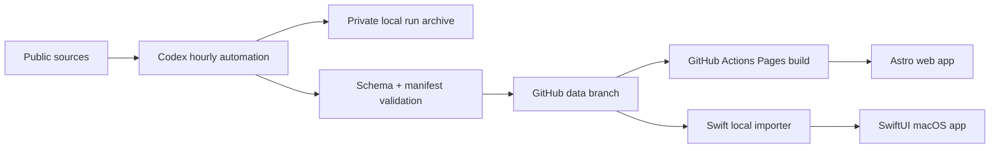

# Architecture

## Overview

Daily Report App is split into three layers:

1. **Producer**: Codex automation collects public research signals, normalizes them, validates the contract, and writes append-only files to the `data` branch.
2. **Public data contract**: JSON Schema plus public manifests provide one shared format for all readers.
3. **Consumers**: Astro renders the public web UI; SwiftUI imports the same files into a local cache for the macOS app.

## Branches

- `main`: source code, schemas, fixtures, workflows, and documentation.
- `data`: public generated data only.
- `agent/schema-data`: schema, collector, fixtures, and validation work.
- `agent/web-ui`: Astro web application work.
- `agent/mac-swift`: SwiftUI application work.
- `agent/ci-deploy`: GitHub Actions and deployment work.

## Data Flow

## Public Data Rules

- Public data must not include secrets, cookies, private raw API responses, or personal-only notes.
- Generated files are append-only where practical.
- Corrections use tombstones instead of silently rewriting historical facts.
- `latest.json` points to a manifest, and every manifest path must include a sha256 checksum.

