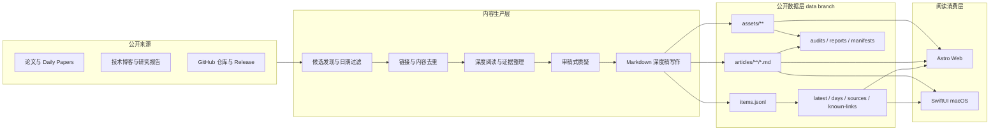
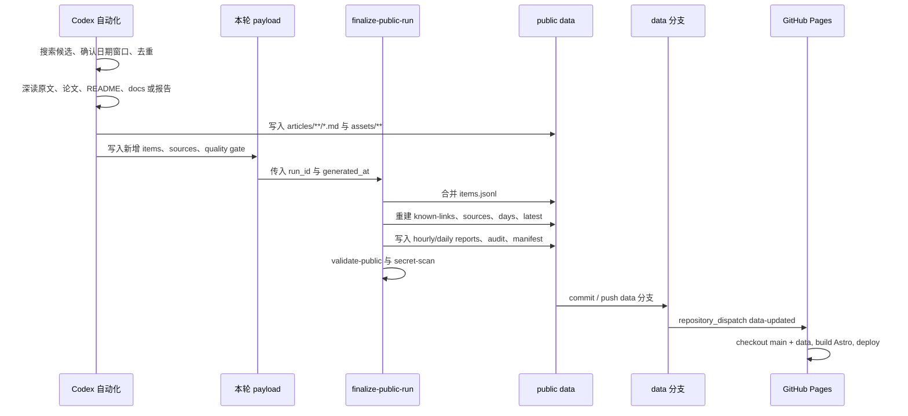
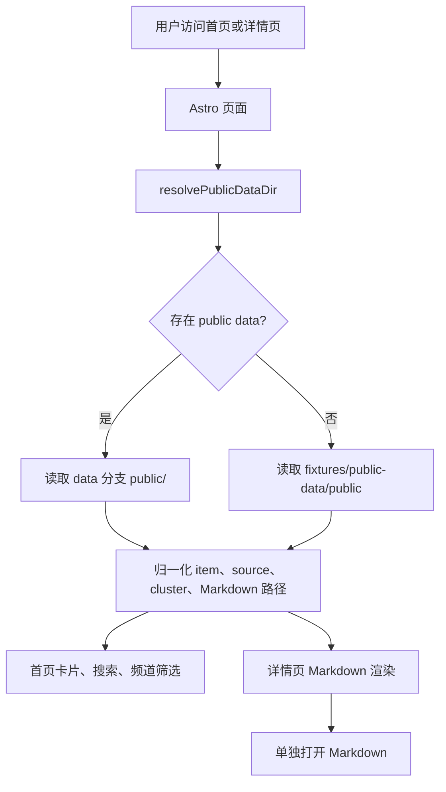
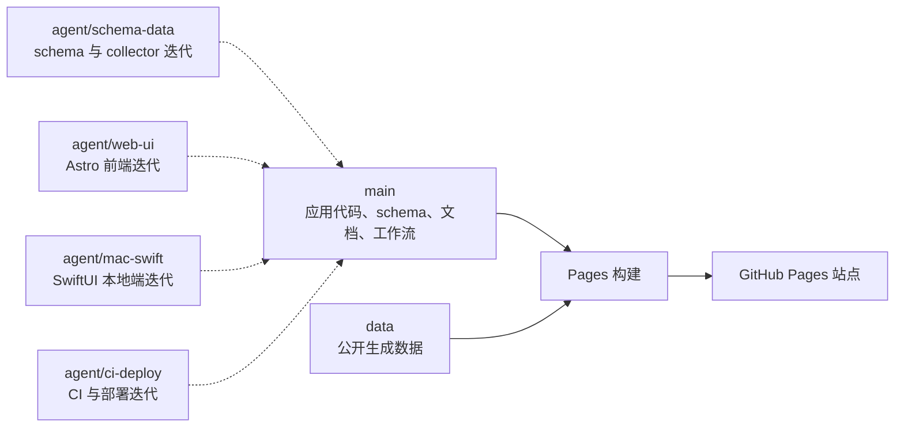
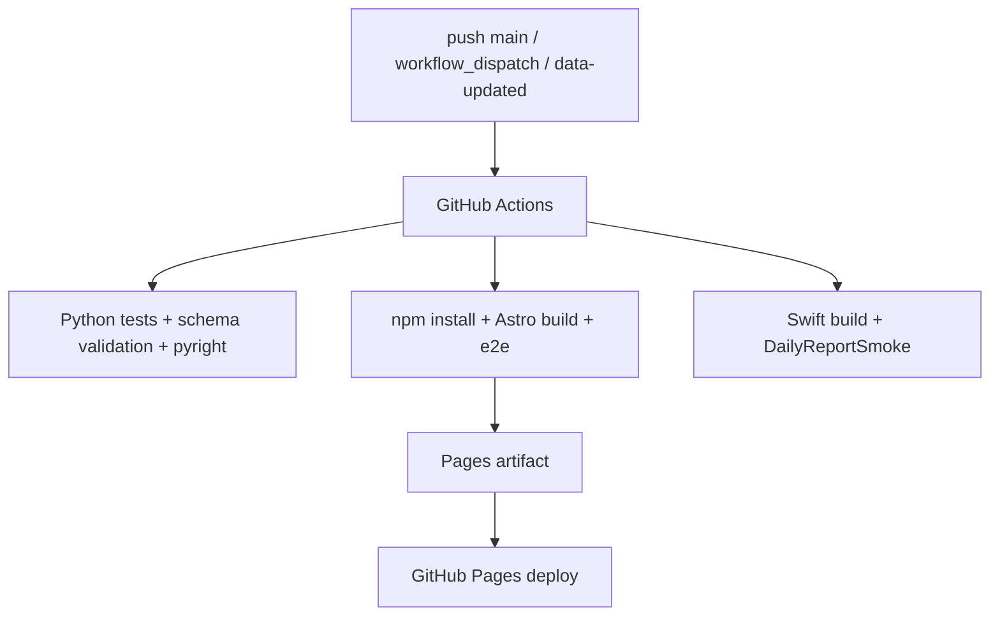

# Daily Report App 架构

这份文档只描述整体架构和数据流。README 保持产品介绍和本地部署入口。

## 总览

Daily Report App 由三层组成：

1. **内容生产层**：Codex 自动化发现公开 AI 研究材料，做日期过滤、去重、深读、审稿式检查和 Markdown 写作。
2. **公开数据层**：`data` 分支保存可公开发布的 JSON、Markdown、图片附件、审计记录和 manifest。
3. **阅读消费层**：Astro Web 站点和 SwiftUI macOS 端读取同一套公开数据，展示搜索、分类、卡片和详情页。

## 数据流

自动化每次运行只写新增内容和一个小 payload，随后调用发布工具机械重建 public data 索引。这样可以避免模型手工维护大型 JSON 文件。

## Web 读取路径

Astro 站点优先读取生产 public data。如果本地或部署环境没有 data 分支数据，则回退到 fixtures，保证页面仍然可以构建和预览。

## 分支职责

- `main`：应用代码、schema、fixtures、工作流和文档。
- `data`：公开生成数据，不放应用代码。
- `agent/schema-data`：schema、collector、fixtures 和校验逻辑开发分支。
- `agent/web-ui`：Astro Web 产品体验开发分支。
- `agent/mac-swift`：SwiftUI macOS 端开发分支。
- `agent/ci-deploy`：GitHub Actions 和部署链路开发分支。

## 核心约束

- public data 不能包含 secrets、cookies、私有 API 原始响应或个人笔记。
- `item` JSON 只做索引和卡片展示，长文正文必须放在 Markdown 文件里。
- 关键图表可以先落到 `public/assets/`，但 Markdown 只在图片承担证据功能时引用，不单独生成本地附件清单。
- `known-links.json` 是去重账本，自动化写入前必须读取。
- `latest.json` 指向 manifest；manifest 中每个文件都需要 sha256。
- 历史数据尽量追加写入；纠错应优先使用可追踪记录，避免静默覆盖。

## CI 与部署

Pages workflow 会 checkout `main`，尝试 checkout `data` 到 `_data_branch`，并在 data 不存在时使用 fixtures 回退数据。`repository_dispatch: data-updated` 用于在 data 分支产生新 manifest 后触发页面刷新。
