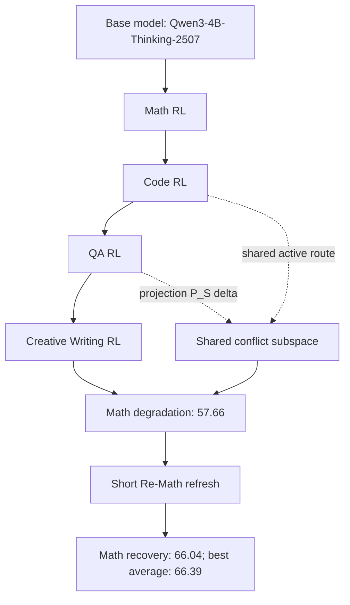

# A Local Perturbation Theory for Cross-Domain Interference and Recovery in Multi-Domain RL：多领域 RL 后训练为什么会互相伤害，以及短刷新为什么能救回来

## 论文元信息

- 标题：[A Local Perturbation Theory for Cross-Domain Interference and Recovery in Multi-Domain RL](https://arxiv.org/abs/2606.02398)
- 类型：论文
- 分类：大模型后训练相关
- 作者：Lei Yang、Siyu Ding、Deyi Xiong
- arXiv：`2606.02398`
- 提交时间：2026-06-01 15:44:56 UTC；arXiv 页面显示 `[Submitted on 1 Jun 2026]`
- Hugging Face Daily Papers 页面：[https://huggingface.co/papers/2606.02398](https://huggingface.co/papers/2606.02398)，显示 Published on Jun 1、Submitted by Lei Yang on Jun 3
- 第三方 PDF 提取页：[HyperAI paper page](https://hyper.ai/en/papers/2606.02398)
- 相关周报/第三方解读：[Wolf Digest 2026-06-04](https://wolfdigest.com/)、[Hyperion Consulting research decoded](https://hyperion-consulting.io/en/insights/ai-research-decoded-the-rise-of-specialized-reasoning-engines-in-physical-ai)

## TL;DR

这篇论文研究的是一个很具体但在后训练工程里越来越常见的问题：同一个大语言模型经过多个领域的 RL post-training 后，为什么在某个领域变强的同时会把另一个领域的能力打坏。作者把领域设置为数学推理、代码生成、问答和创意写作四类，使用平衡的多领域数据，每个领域 5,120 条训练样本，基座模型为 Qwen3-4B-Thinking-2507；数学来自 OpenR1-math，代码来自 KlearReasoner-CodeSub-15K，问答来自 SuperGPQA，创意写作来自 crownelius/Creative-Writing 系列，并额外用 Qwen3-235B-A22B-Instruct-2507 重采样 2,560 条参考回答。评测上，数学使用 30 道 AIME25 验证题，其余领域各 50 条 held-out validation；测试还包括从非训练 SuperGPQA 与 MMLU-Pro 中抽样的 2,141 条 QA 和 1,203 条 MMLU-Pro 记录。

作者的核心判断不是“多任务训练发生了笼统的灾难性遗忘”，也不是“全模型梯度互相冲突”。他们先观察单领域 RL 对参数的改动很稀疏、幅度很小：单领域专家中约 77% 到 89% 的参数绝对变化低于 $10^{-7}$，相对变化低于 $10^{-3}$；再把 MLP intermediate channel 当作 neuron，聚合 gate、up、down projection 的改动幅度，取每个领域 top 10% 改动最大的 neuron 计算 Jaccard overlap，发现领域之间平均重叠低于 0.19。表面上看，不同领域改的是不同 neuron，似乎不该互相伤害。但论文进一步指出，不同领域仍然会共享“活跃计算路径”；如果后训练更新在这些共享路径上的方向相反，即使全局梯度几乎正交、top-neuron overlap 很低，也会通过局部高曲率方向造成选择性损伤。

方法上，论文提出一个 local perturbation theory。设领域 $A$ 的 checkpoint 为 $\theta_A^\*$，后续领域 $B$ 带来的局部更新为 $\delta_B$，领域 $A$ 的损失为 $L_A$。论文把干扰写成 $L_A(\theta_A^\*+\delta_B)-L_A(\theta_A^\*)$，在局部平滑假设下，一阶项在最优点附近被压低，主要伤害来自二阶项 $\frac{1}{2}\delta_B^\top H_A(\theta_A^\*)\delta_B$。更重要的是，作者不认为全量 $\delta_B$ 都同等重要，而是引入共享活跃冲突子空间 $S_{A,B}$，用投影 $P_S\delta_B$ 表示真正落在冲突路径上的那部分更新，于是主导项变成 $\frac{1}{2}(P_S\delta_B)^\top H_A(\theta_A^\*)(P_S\delta_B)$。这解释了为什么“低参数重叠”和“显著能力退化”可以同时发生。

修复上，论文提出短领域刷新。若当前坏掉的 checkpoint 是 $\theta_0=\theta_A^\*+\delta_B$，就在受损领域 $A$ 上做很短的 refresh：$\theta_{t+1}=\theta_t-\alpha g_A(\theta_t)$。在 $L_A$ 对冲突子空间有正曲率、正交补空间回流较弱的假设下，有几何收缩界：

$$
\|P_S(\theta_t-\theta_A^\*)\|_2 \le (1-\alpha\mu_A)^t\|P_S\delta_B\|_2
$$

直观地说，refresh 不需要完整回训，而是快速压缩落在受损领域敏感方向上的有害分量。实验证据里，作者报告在 `Code -> Math -> QA -> CW` 的顺序训练之后，做一次短 `Re-Math` refresh 可把 Math 从 57.66 恢复到 66.04，同时大体保住其他领域能力，得到 66.39 的最佳平均分；此外，还用 Math-QA pair 的 sparse proxy conflict coordinate set 做 training-free rollback，部分恢复 Math，作为“伤害局部化”的权重空间证据。

这篇论文对日报值得收录的原因是：它把 LLM RL 后训练里的多领域干扰从宏观经验问题拆成可测量的局部机制，给出了数据构造、参数改动稀疏性、neuron overlap、共享路径方向、二阶损伤项、refresh 收缩界和 rollback 证据。局限也明显：第三方页面没有暴露完整表格图像 URL，本轮自动化无法稳定嵌入原论文图；论文目前主要围绕一个 4B thinking 模型和四类任务域，refresh 是否能在更大模型、更复杂 RL 算法、真实 agent/coding 长轨迹中保持同样选择性，仍需复现。

## 来源与材料地图

本轮阅读使用了四类材料：

| 材料 | 用途 | 可信度与边界 |
|---|---|---|
| arXiv 页面 | 确认标题、作者、日期、学科、摘要、PDF/HTML/source 链接 | 原始元数据可信；本环境无法直接解析 PDF 正文 |
| Hugging Face Papers | 确认 Published on Jun 1、Submitted by Lei Yang on Jun 3、社区摘要 | 属于论文聚合页；摘要为模型生成，需要回到 arXiv 与 PDF 提取页核对 |
| HyperAI paper page | 提取数据集、方法公式、实验观察和图像占位信息 | 标注为 Source PDF，像是 PDF 内容提取；仍是第三方抽取，不等同作者原文全文 |
| Wolf Digest / Hyperion Consulting | 判断第三方如何概括论文价值 | 只能作为外部解读和趋势线索，不作为核心实验依据 |

需要特别说明：arXiv 页面确实提供 PDF 和 experimental HTML 链接，但本次自动化运行环境无法稳定打开 PDF 正文，也无法拿到可直接嵌入的 figure 图片 URL。因此正文对 figure/table 的解读基于 arXiv 摘要、Hugging Face 页面以及 HyperAI 从 PDF 提取的 Dataset / Method / Experiment 段落；所有具体数字只采用这些页面明确出现的数字，不扩展编造未见表格。

## 1. 背景与研究问题

RL post-training 已经不只是“让数学更强”或“让代码更强”的单点优化。真实产品里的模型通常希望同时覆盖数学推理、代码、问答、写作、工具使用、网页操作、检索与安全拒答。问题是，多领域能力并不是线性叠加的：后训练模型在一个领域获得收益之后，另一个领域可能下降。传统解释通常有两类：

- **灾难性遗忘**：新领域训练覆盖旧领域能力，旧能力被整体冲掉。
- **全局梯度冲突**：不同任务的梯度方向冲突，多任务优化无法兼顾。

这篇论文认为这两种解释都不够细。作者观察到，单领域 RL 的参数更新本身并不大，很多参数几乎没有动；不同领域 top-changed neurons 的重叠也低。如果从“改了同一批参数”来解释干扰，就会发现证据不充分。另一方面，全文摘要里明确提到“substantial interference can occur even when full-model gradients are nearly orthogonal”，也就是全模型尺度上看不出强梯度冲突，但任务性能仍然会受损。

研究问题因此被重新定义为：当后训练更新是稀疏、小幅、低重叠的，为什么还会发生强干扰？答案落在“共享活跃计算路径”上。一个领域没有必要直接改写另一个领域的 top neuron；只要它在推理时经过的活跃路径与另一个领域共享，并且更新方向在局部高曲率方向上造成负影响，损伤就能出现。这把问题从“全模型参数有没有冲突”改成“功能路径上的局部扰动是否落在敏感子空间”。

## 2. 方法与模型机制

论文的方法可以拆成三层：观测、理论、修复。

### 2.1 观测层：RL 更新是稀疏小扰动

作者首先比较单领域 RL expert 与 base model 的参数差异。HyperAI 提取页给出的数字是： across single-domain experts，约 77% 到 89% 的参数绝对变化低于 $10^{-7}$，相对变化低于 $10^{-3}$。这个观察很关键，因为它排除了“RL 后训练大范围重写模型”的简单说法。至少在论文设置中，domain RL 更像是在已有模型附近做局部扰动。

第二个观察是 neuron 级别的弱重叠。作者把 MLP intermediate channel 定义成 neuron，并把这个 channel 在 gate projection、up projection、down projection 上的参数变化聚合为 edit magnitude。之后对每个领域选出 top 10% 变化最大的 neurons，计算 pairwise Jaccard coefficient。提取页给出的结论是平均低于 0.19。也就是说，Math、Code、QA、Creative Writing 并没有主要改同一组 top neurons。

这两个观察共同构成论文的反直觉入口：如果改动小、重叠低，为什么后训练顺序仍然会互相伤害？

### 2.2 理论层：二阶损伤项与共享冲突子空间

论文把领域 $A$ 训练后的模型写成 $\theta_A^\*$，后面领域 $B$ 的局部更新写成 $\delta_B$。如果关心 $B$ 对 $A$ 的伤害，就看：

$$
\Delta_{B\rightarrow A}=L_A(\theta_A^\*+\delta_B)-L_A(\theta_A^\*)
$$

在局部平滑近似下，可以做 Taylor 展开：

$$
L_A(\theta_A^\*+\delta_B)
\approx
L_A(\theta_A^\*)+
\nabla L_A(\theta_A^\*)^\top \delta_B+
\frac{1}{2}\delta_B^\top H_A(\theta_A^\*)\delta_B
$$

如果 $\theta_A^\*$ 已经是领域 $A$ 的局部良好点，一阶梯度项较小，那么真正解释伤害的是二阶曲率项：

$$
\Delta_{B\rightarrow A}\approx
\frac{1}{2}\delta_B^\top H_A(\theta_A^\*)\delta_B
$$

这不是说“所有 $B$ 的更新都会伤害 $A$”。论文进一步引入低维共享活跃冲突子空间 $S_{A,B}$。可以把它理解成：领域 $A$ 与领域 $B$ 虽然 top changed neurons 不重叠，但它们在推理时共享一部分计算路径；在这些路径上，某些方向会对 $A$ 的损失非常敏感。设 $P_S$ 是投影到这个子空间的投影算子，则主导损伤项被局部化为：

$$
\Delta_{B\rightarrow A}\approx
\frac{1}{2}(P_S\delta_B)^\top H_A(\theta_A^\*)(P_S\delta_B)
$$

这个表达式给了一个更精确的解释：不是 $\delta_B$ 全部危险，而是 $P_S\delta_B$ 危险；不是全局梯度冲突决定一切，而是局部共享路径的曲率和方向决定干扰。

### 2.3 修复层：短 refresh 与 rollback

修复方法也直接对应这个理论。若 $B$ 后训练之后模型变成：

$$
\theta_0=\theta_A^\*+\delta_B
$$

那么在领域 $A$ 上做短 refresh：

$$
\theta_{t+1}=\theta_t-\alpha g_A(\theta_t)
$$

论文的 Theorem 1 给出一个冲突子空间上的几何收缩关系：

$$
\|P_S(\theta_t-\theta_A^\*)\|_2
\le
(1-\alpha\mu_A)^t\|P_S\delta_B\|_2
$$

其中 $\mu_A>0$ 表示 $L_A$ 在 $S_{A,B}$ 上的局部曲率下界。这条式子的工程含义很清楚：如果损伤集中在低维冲突子空间，refresh 的前几步就能快速压缩有害分量；它不必恢复所有参数，也不必把模型退回旧 checkpoint。论文还扩展到 alternating refresh，认为一个交替 refresh cycle 可以近似成对加权多领域目标的一步下降，从而朝局部 Pareto-stationary compromise 移动。

这张图不是论文原图，而是本轮编辑根据论文逻辑整理的流程图。它表达的是：顺序 RL 后训练不是简单累积收益，而可能在共享活跃路径上留下局部有害分量；短 Re-Math refresh 对准 Math 敏感方向收缩这些分量，因而能恢复 Math，同时尽量不破坏其他领域。

## 3. 训练、数据、评测和实验设置

从第三方 PDF 提取页可读到的数据设置如下：

| 领域 | 数据来源 | 训练规模 | 备注 |
|---|---:|---:|---|
| Math | OpenR1-math | 5,120 | 数学推理训练子集 |
| Code | KlearReasoner-CodeSub-15K | 5,120 | 代码生成训练子集 |
| QA | SuperGPQA | 5,120 | 按 subfield 与 difficulty 分层 |
| Creative Writing | crownelius/Creative-Writing series | 5,120 | 混合 Sonnet4.6-800x、Gemini3Pro-2700x、Reasoning-KimiK2.5-600x、Qwen3.5Plus-2000x |

创意写作部分还有一个细节：作者用 Qwen3-235B-A22B-Instruct-2507 重采样 2,560 条 responses，构造更新后的参考答案。所有训练 prompt 截断到最大 2,048 tokens。模型侧，提取页明确说 combined dataset 用于 fine-tuning Qwen3-4B-Thinking-2507 base model。

评测与验证拆分：

| 评测部分 | 规模 | 用途 |
|---|---:|---|
| AIME25 Math validation | 30 problems | 数学验证 |
| 其他领域 validation | 每领域 50 held-out examples | Code / QA / CW 的 held-out 验证 |
| QA test | 2,141 examples | 来自非训练 SuperGPQA |
| MMLU-Pro test | 1,203 examples | 来自非训练 MMLU-Pro |

这些设置的优点是四个训练域规模对齐，便于观察顺序训练与领域间干扰；缺点是本轮材料没有暴露完整 RL 算法超参、训练 step 数、batch size、reward 细节、每个领域的完整 metric 列。读者应把本文中关于机制的部分理解为“基于论文摘要和提取页可验证信息的解读”，而不是完整复现实验指南。

## 4. 主结果与指标解读

可明确提取的主结果包括四组。

### 4.1 单领域更新幅度小

约 77% 到 89% 参数满足：

$$
|\Delta\theta_i|<10^{-7},\quad
\frac{|\Delta\theta_i|}{|\theta_i|+\epsilon}<10^{-3}
$$

这里第二个式子是解释性整理，用来表达“相对变化低于 $10^{-3}$”的含义。它说明在作者设置中，RL post-training 不是大规模重写权重，而是围绕 base model 的局部编辑。

### 4.2 top-neuron overlap 低

用 MLP intermediate channel 作为 neuron，聚合 gate/up/down projection 的 edit magnitude，取 top 10% neurons 后，领域间 pairwise Jaccard overlap 平均低于 0.19。这直接支持作者反驳“共同改了同一批 neuron 所以互相伤害”的粗解释。

### 4.3 顺序训练发生选择性退化

论文摘要和第三方提取页都强调顺序多领域 RL 会产生 asymmetric degradation。最具体的数字是 `Code -> Math -> QA -> CW` 后 Math 降到 57.66。这个数字必须和后续恢复结果一起看：如果退化是全局噪声，短 Math refresh 不应当能选择性救回 Math；如果退化集中在 Math 敏感的共享子空间，短 refresh 才有解释力。

### 4.4 Re-Math refresh 恢复 Math

短 Re-Math refresh 把 Math 从 57.66 恢复到 66.04，并得到最佳平均分 66.39。这个结果支持两个结论：

- 退化不是完全不可逆的能力丢失；至少一部分损伤可由短 refresh 收缩。
- refresh 的作用并非只优化 Math 单域分数；摘要说它 largely preserving performance on other domains，说明副作用有限。

不过，当前材料没有给出完整四领域分数表，所以不能进一步判断 Code、QA、CW 在 refresh 前后各自变化多少，也不能判断 66.39 相对所有 baseline 的统计显著性。

## 5. 消融、失败案例和误差分析

论文提到的消融与验证主要是机制消融，而不是传统 benchmark 表格消融。

- **全局梯度冲突解释不足**：如果 full-model gradients nearly orthogonal 仍然发生显著干扰，那么只看全局夹角会漏掉局部路径伤害。
- **参数重叠解释不足**：如果 top 10% changed neurons 的平均 Jaccard overlap 低于 0.19，直接说“两个领域改了同一组 neurons”也不够。
- **冲突子空间解释更强**：用 $P_S\delta_B$ 捕获后续领域更新在共享活跃冲突子空间的分量，能解释低重叠与高伤害并存。
- **训练-free rollback 提供权重空间证据**：对 Math-QA pair 的 sparse proxy conflict coordinate set 做 rollback，能够部分恢复 Math。它不是重新训练，因此更像是在验证“确实有一组局部坐标承载了可逆损伤”。

失败案例方面，当前可访问材料没有列出具体样本级错误，如某道数学题、某段代码或某个创意写作输出如何失败。因此本轮不能编造 case study。更稳妥的说法是：论文的失败分析目前从能力分数与权重/路径层面展开，而不是以自然语言样本逐例解释。

## 6. Figure/Table 逐图逐表解读

本轮无法取得原论文 figure 的稳定图片 URL，但 HyperAI 页面暴露了多个 image 占位，并在相邻文字中说明它们对应的数据、方法和实验。

| 图或表线索 | 可读到的信息 | 支撑的结论 | 不能证明什么 |
|---|---|---|---|
| Dataset image 占位 | 四领域数据来源、5,120/域、2,048 token 截断、validation/test split | 实验是平衡多域 RL 设置 | 不能确认每个样本的过滤规则和 reward 细节 |
| neuron overlap figure 占位 | top 10% changed neurons 的 Jaccard overlap 平均低于 0.19 | 低 neuron overlap 与跨域退化并存 | 不能独立验证图中所有 pair 的具体数值 |
| experiment image 占位 | 顺序 RL、short refresh、targeted rollback 均用于验证机制 | 干扰局部化、可被短 refresh 部分修复 | 不能确认完整 baseline 统计显著性 |
| Re-Math result | Math 57.66 -> 66.04，最佳平均 66.39 | refresh 有选择性恢复能力 | 不能说明所有训练顺序、所有模型规模都有效 |

如果后续自动化能下载 PDF 或 TeX source，优先补充三类图：参数变化分布图、neuron Jaccard heatmap、顺序训练/refresh 的四领域分数曲线。这些图会显著增强文章的证据密度。

## 7. 相关工作与第三方解读

Hugging Face 把这篇论文放在 Daily Papers 并显示 2026-06-01 发布、2026-06-03 作者提交，说明它在社区聚合层面有一定可见度。Wolf Digest 2026-06-04 将其概括为“multi-domain RL interference is local, not global”，并复述了 Re-Math 从 57.66 到 66.04、最佳平均 66.39 的结果。Hyperion Consulting 则从 Physical AI/工程部署角度解读，把它类比为“reason layer surgery”，认为 conflict subspace 对多任务策略扩展有参考意义。

这些第三方解读有两个作用：

- 它们说明论文的工程读法不是只限于理论推导，而是指向“如何给一个模型追加新能力而不破坏旧能力”。
- 它们也有商业化泛化风险。比如把 LLM 多领域 RL 的 conflict subspace 直接外推到 VLA、机器人或安全合规，需要更多任务和模型证据，不能仅凭这篇论文推出。

相关研究脉络上，这篇工作与 OPD/TrOPD、RLVR、多任务/多域后训练、灾难性遗忘、gradient conflict、model editing、能力恢复和权重空间 rollback 都有关。与上轮收录的 Trust Region On-Policy Distillation 相比，TrOPD 关心 teacher-student 分布错配下 token-level supervision 是否可靠；这篇论文关心多个 RL 域顺序叠加时，局部路径上为何产生二阶损伤。二者都在把“后训练不稳定”拆成可定位机制，而不是只报告 benchmark 分数。

## 8. 关键论证链

作者的论证链可以压缩为八步：

1. 多领域 RL 后训练会出现选择性退化，一个领域后训可能伤害另一个领域。
2. 单领域 RL 更新本身稀疏、小幅，约 77% 到 89% 参数变化极小。
3. 各领域 top 10% changed neurons 的 Jaccard overlap 平均低于 0.19。
4. 因此，“全局灾难性遗忘”或“直接 neuron 重叠”不足以解释全部退化。
5. 不同领域虽然改动位置不同，但共享活跃计算路径；更新方向在这些路径上可能协同，也可能冲突。
6. 局部 Taylor 展开显示，后续领域对早期领域的伤害主要由二阶项 $\frac{1}{2}\delta^\top H\delta$ 控制。
7. 把更新投影到共享冲突子空间后，可解释低全局冲突与高局部损伤并存。
8. 短 refresh 和 training-free rollback 能选择性恢复受损能力，给出机制层面的正证据。

## 9. 证据与边界

本轮可确认的证据点：

- arXiv 元数据确认论文于 2026-06-01 提交，属于本周窗口。
- Hugging Face 页面确认 Published on Jun 1，并由 Lei Yang 于 Jun 3 提交到 Daily Papers。
- 摘要明确把问题限定在 LLM RL post-training 的 Math、Code、QA、Creative Writing 等领域。
- HyperAI PDF 提取页给出四领域数据来源、每域 5,120 条训练样本、2,048 token 截断、Qwen3-4B-Thinking-2507 基座。
- 方法部分给出参数稀疏性、top-neuron Jaccard overlap 低于 0.19、二阶损伤项、冲突子空间投影和 refresh 收缩界。
- 主结果给出 Re-Math 从 57.66 到 66.04、最佳平均 66.39。
- 第三方解读至少有 Wolf Digest 与 Hyperion Consulting 复述其局部干扰机制。

边界也必须清楚：

- 本轮没有拿到原 PDF 图片的稳定 URL，因此图片不能以内嵌形式展示。
- 当前材料没有完整训练超参、奖励函数实现、所有 baseline 表、显著性检验和样本级失败案例。
- 论文使用的基座与四领域任务设计较集中，不能直接推出所有 LLM、所有 RL 算法、所有 agent 场景都满足同样局部理论。
- training-free rollback 的 proxy conflict coordinate set 如何构造，需要读完整 PDF 或代码才能复现。

## 10. 后续追踪问题

- 后续应直接下载 PDF 或 TeX source，补齐所有 Figure/Table 的编号、标题和图中数字。
- 查找是否有 GitHub 代码或作者补充材料，特别是 sparse proxy conflict coordinate set 的构造方法。
- 跟踪是否有更大模型、不同 RL 算法（PPO、GRPO、RLVR、DPO-like RL）上的复现实验。
- 检查 refresh 步数、学习率、样本比例是否敏感；如果只要 10% steps 就能恢复，工程意义很强。
- 与 TrOPD、Echo Chamber、multi-task gradient surgery、model editing rollback 做横向比较：哪些是监督可靠性问题，哪些是能力冲突问题。

## 11. Detail inventory：本轮可抽取的细节清单

为了便于下一轮自动化接着补证据，这里把已经读到的细节按 inventory 方式重新整理一次。

- **方法模块**：single-domain RL sparse edit analysis、MLP intermediate channel neuron edit magnitude、top 10% neuron Jaccard overlap、shared active conflict subspace $S_{A,B}$、second-order damage term、short domain refresh、alternating refresh、training-free rollback on sparse proxy conflict coordinates。
- **输入输出**：输入是同一 base model 在不同领域 RL post-training 后的 checkpoints、参数变化、领域验证集和测试集；输出是领域分数变化、参数/神经元重叠统计、局部理论项和 refresh/rollback 后的恢复分数。
- **数据规模**：四个领域各 5,120 条训练样本，总训练样本量按平衡混合为 20,480 条；创意写作中有 2,560 条参考回答由 Qwen3-235B-A22B-Instruct-2507 重采样；训练 prompt 最大 2,048 tokens。
- **模型与任务域**：基座是 Qwen3-4B-Thinking-2507；任务域包括 Math、Code、QA、Creative Writing。这个选择覆盖推理、程序合成、知识问答和开放式生成，但不覆盖多轮网页 agent、长上下文检索 agent 或安全拒答。
- **核心数字**：77% 到 89% 参数变化极小；top 10% changed neurons 的平均 Jaccard overlap 低于 0.19；顺序训练后 Math 为 57.66；短 Re-Math refresh 后 Math 到 66.04；最佳平均分为 66.39；QA test 为 2,141 条，MMLU-Pro test 为 1,203 条。
- **公式变量**：$\theta_A^\*$ 表示领域 $A$ 训练后的局部最优或良好 checkpoint；$\delta_B$ 表示领域 $B$ 后续训练产生的局部位移；$L_A$ 是领域 $A$ 的损失；$H_A$ 是 $L_A$ 在 $\theta_A^\*$ 附近的 Hessian；$P_S$ 是投影到共享冲突子空间的算子；$\mu_A$ 是子空间上的局部曲率下界；$\alpha$ 是 refresh 学习率。
- **失败类型**：可确认的失败不是具体样本错误，而是领域级能力退化；最明确案例是 Math 在后续领域训练后下降，再由 Re-Math refresh 恢复。样本级错误、失败输出格式和 reward hacking 类型目前未暴露。
- **证据缺口**：缺少原图 URL、完整表格、训练超参、RL 算法实现、所有领域 refresh 前后分数、rollback 坐标构造伪代码、统计显著性与多 seed 结果。

这份 inventory 的作用是防止后续日报只复述“局部冲突”这个概念。真正值得继续追踪的是：作者能否把 $S_{A,B}$ 从理论对象变成可工程化估计的诊断工具；refresh 是否只是特定顺序和特定模型上的补丁；rollback proxy 是否可以在没有验证集泄漏的情况下自动构造。如果这些问题有代码或复现回答，这篇论文就会从机制观察更进一步变成可用训练配方。

## 审稿式结论

这篇论文可以进入日报的“大模型后训练”频道。它的价值不在于提出一个更高分的单模型，而在于把多领域 RL 后训练中的能力干扰拆成“稀疏更新 + 共享活跃路径 + 局部二阶损伤 + 短 refresh 恢复”的机制链。对于正在做 reasoning/coding/writing/agent 多能力叠加的团队，它提示一个实际问题：不要只看全局梯度冲突，也不要只看整体 benchmark；要观察局部路径、冲突子空间和短回补能否选择性恢复能力。

但日报呈现时必须带上边界：这不是一套已经可直接部署的通用多领域 RL 训练系统。它目前更像一个机制论文，证据集中在一个 4B thinking 模型和四类领域任务；复现需要完整 PDF、代码、超参和图表。下一轮如果能补到代码与完整表格，应重点验证 refresh 的成本、对非目标领域的副作用，以及 rollback proxy 是否能被自动发现。
