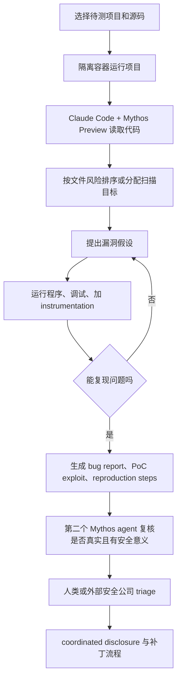

# Anthropic 扩展 Project Glasswing：从“AI 找漏洞”转向“AI 时代的验证、披露与补丁产能”

## 论文或项目元信息

- **标题**：Expanding Project Glasswing
- **类型**：官方博客 / AI 安全报告型更新
- **发布方**：Anthropic
- **发布时间**：2026-06-02
- **原文链接**：[https://www.anthropic.com/news/expanding-project-glasswing](https://www.anthropic.com/news/expanding-project-glasswing)
- **项目页**：[Project Glasswing](https://www.anthropic.com/project/glasswing)
- **初始更新**：[Project Glasswing: An initial update](https://www.anthropic.com/research/glasswing-initial-update)
- **技术评估**：[Assessing Claude Mythos Preview's cybersecurity capabilities](https://red.anthropic.com/2026/mythos-preview/)
- **披露看板**：[Anthropic coordinated vulnerability disclosure dashboard](https://red.anthropic.com/2026/cvd/)
- **当前分类**：AI 安全相关

## TL;DR

Anthropic 在 2026 年 6 月 2 日发布的 `Expanding Project Glasswing` 不是单纯宣布“扩大合作伙伴名单”，而是在把一个高风险模型受控开放项目改造成一条防御侧生产线。Project Glasswing 的核心前提是：Claude Mythos Preview 这类模型已经能在真实代码库中以远高于传统人工审计的速度发现、复现、评估甚至利用漏洞；因此安全问题的瓶颈从“能不能找到漏洞”转移到“能不能验证、披露、修复、部署补丁，并在补丁窗口内降低攻击面”。6 月 2 日更新给出的新增动作是：在约 50 个初始伙伴基础上，再扩展到约 150 个新组织，覆盖 15 个以上国家，并补齐电力、水务、医疗、通信、硬件等初始 cohort 覆盖不足的关键基础设施行业。每个新组织在获得访问前仍需满足 Anthropic 的安全要求。

这篇更新必须和 5 月 22 日初始更新、CVD dashboard 和 4 月 7 日红队技术长文连起来读。5 月 22 日材料显示，Project Glasswing 与约 50 个伙伴在第一个月已经发现超过 10,000 个被 Mythos Preview 估为 high 或 critical 的漏洞；在开源扫描部分，Anthropic 扫描了 1,000 多个开源项目，得到 23,019 个候选，其中 6,202 个被模型估为 high/critical。1,752 个 high/critical 候选经过六家外部安全研究公司或 Anthropic 少量自查后，90.6% 被确认是真阳性，62.4% 被确认仍是 high/critical。按这个后验比例，即使模型不再发现新漏洞，Anthropic 也估计开源部分会接近 3,900 个 high/critical 漏洞。披露看板截至 2026-05-22 记录了 1,596 个已披露漏洞、1,451 个维护者已确认收到、97 个 upstream 已修复、88 个已有 CVE 或 GHSA；这组数字说明“发现”之后的漏斗很陡，真正稀缺的是人类 triage、维护者响应和补丁部署能力。

红队技术长文解释了为什么 Anthropic 把 Mythos-class 模型视为 release-risk threshold。Mythos Preview 在约 7,000 个 OSS-Fuzz entry points 上的内部 benchmark 中不仅比 Sonnet 4.6、Opus 4.6 发现更多低等级 crash，还在 10 个完全打补丁目标上达到 tier 5 的 control-flow hijack；在 Firefox JavaScript shell exploit 对比中，Opus 4.6 在数百次尝试里只有少数成功或 register control，而 Mythos Preview 在 250 次试验中有 181 次生成 working exploit、另有 29 次达到 register control。技术长文还描述了统一 agent scaffold：隔离容器中放入待测项目和源码，让 Claude Code + Mythos Preview 读取代码、运行程序、加调试逻辑、复现怀疑点、产出 bug report、PoC exploit 和 reproduction steps；随后再用一个 Mythos agent 复核报告是否真实且有安全意义。这个流程不是“聊天问答”，而是把模型变成大规模并行、文件级定向的漏洞搜索与复核系统。

6 月 2 日扩展更新的关键转折是：Anthropic 不再把 Project Glasswing 描述为“少数顶级伙伴用最强模型找零日”的封闭实验，而是提出两个角色。第一，安全地扩大 defender 对更强模型、工具和共同基础设施的访问，让关键基础设施和开源维护者在类似能力普及前获得防御时间差。第二，把支持重心从发现漏洞转向披露、修复、部署和补丁前移。原文明确提到，许多伙伴已经用 Mythos Preview 写补丁、做 pre-release checks，模型还可用于渗透测试、自动化威胁检测与响应、把 legacy codebase 重写到 memory-safe languages。Anthropic 同时说，正在与第三方讨论如何大幅扩展开源漏洞 review 和 patching，计划继续扩大 Project Glasswing，并扩展 Cyber Verification Program，让更多组织在特定防御任务中获得 Mythos-class 能力。

这篇更新可以进入日报的原因不在于“Anthropic 又发了一个安全项目”，而在于它给出了 AI 安全治理里一个可观察的新范式：当模型能力本身具有显著 dual-use 性质时，发布策略不再是简单的公开或不公开，而是按组织、任务、权限、工具链、披露流程、补丁能力和审计责任分层。它的局限也同样清楚：大量最强证据仍因 90 天或 90+45 天 coordinated disclosure 窗口不能公开；许多关键数值来自 Anthropic 自报或合作方反馈；“大多数伙伴每家找到数百个 critical/high”不能直接推出所有 findings 都同等严重、可达或可利用；“97 个已修复”也不能推出终端用户已经部署补丁。日报后续应追踪三件事：CVD dashboard 的 patched/advisory 比例是否持续上升；未来 90 天后 hash commitment 是否兑现为可审计漏洞细节；以及 Cyber Verification Program 的准入、日志、撤权、误用检测和第三方审计机制是否足够清晰。

## 来源与材料地图

本次深读使用的材料分为四层：

| 层级 | 材料 | 日期 | 用途 |
|---|---:|---:|---|
| 主文 | Anthropic `Expanding Project Glasswing` | 2026-06-02 | 判断本次新增事实：约 150 个新组织、15+ 国家、扩展行业、未来方向 |
| 官方上下文 | `Project Glasswing: An initial update` | 2026-05-22 | 提取第一个月发现、triage、披露、补丁漏斗数字 |
| 技术依据 | Anthropic Frontier Red Team `Assessing Claude Mythos Preview's cybersecurity capabilities` | 2026-04-07 | 解释 Mythos Preview 的 scaffold、benchmark、zero-day 和 exploit 能力 |
| 动态看板 | Anthropic CVD dashboard | 2026-05-22 更新 | 核对 23,019 candidates、1,596 disclosed、97 patched、88 advisories |
| 外部参考 | Cloud Security Alliance rapid research、Sandra Joyce 2026-06-04 证词、Resilient Cyber Newsletter | 2026-05/06 | 对照政策语境、行业瓶颈和第三方二次解读 |

这些材料之间的关系不是平行新闻，而是一条因果链：红队评估说明模型能力为什么不能普通发布；初始更新说明真实合作项目里发现与披露的漏斗；CVD dashboard 让部分披露流程可跟踪；6 月 2 日扩展更新则把前面的能力证据转化为“扩大防御访问和扩展 patching capacity”的组织策略。

## 1. 博客背景与作者要回答的问题

`Expanding Project Glasswing` 要回答的问题有两个：

1. 当 Mythos-class cyber capabilities 已经接近或超过专家级漏洞发现和 exploit development 时，Anthropic 为什么还要扩大访问，而不是继续收紧？
2. 当漏洞发现速度被模型显著降低成本后，软件生态真正短缺的环节是什么，Project Glasswing 下一阶段要补哪一段？

原文给出的答案是受控扩张。Anthropic 认为，未来 6 到 12 个月内，很多公司可能拥有类似 Mythos-class 的模型，而且不一定具备足够强、足够精确的防误用 safeguards。若只靠“暂不公开”拖延，防御侧会在类似能力外溢时没有准备。因此 Project Glasswing 的目标不是把 Mythos Preview 变成普通商业模型，而是先让关键基础设施、系统性软件维护者、可信安全团队和开源生态中的高价值项目获得防御优势。

这个答案的第二半更重要：Project Glasswing 的价值不再主要是“找出更多漏洞”，而是把 AI 发现能力接到 vulnerability verification、coordinated disclosure、maintainer triage、patch authoring、deployment 和 detection response 上。用一个简化公式表示，AI 时代的防御收益不是单独由发现量决定：

$$
Defense\ Gain \approx Valid\ Findings \times Patch\ Rate \times Deployment\ Speed \times Exposure\ Reduction
$$

这里的 `Valid Findings` 是模型发现并经人类或工具确认的真实问题；`Patch Rate` 是被维护者修复的比例；`Deployment Speed` 是补丁从 upstream 到用户环境的速度；`Exposure Reduction` 是在补丁前后通过配置加固、检测规则、临时缓解和资产优先级降低真实攻击面的程度。Anthropic 的 6 月 2 日更新，本质上是在承认第一项已经被模型显著放大，后面三项才是接下来更难的系统工程。

## 2. 原文结构总览：6 月 2 日更新讲了什么

主文可以按四段理解。

第一段是扩展事实。Anthropic 在和 Project Glasswing partners、安全行业、开源维护者、美国政府密切合作数周后，把 partnership 扩展到约 150 个新组织。新组织来自 15 个以上国家，许多还服务更广泛的跨国基础设施。新增 group 覆盖电力、水务、医疗、通信、硬件等初始 cohort 不足的行业，也包括维护大量下游组织依赖代码库的 vendors、公司和非营利组织。Anthropic 对入选标准的描述很重：这些 partner 的 codebase 一旦被重大攻击，可能造成 catastrophic 后果；多数 partner 的 major attack 可能影响超过 1 亿人，并有全球或国家安全影响。

第二段是 Project Glasswing 的角色定义。Anthropic 说，Mythos Preview 激发了软件行业和政府关于 AI 如何改变网络安全的讨论，也改变了他们对项目目的的理解。这里最关键的判断是：具备强 cyber capabilities 的廉价快速 AI 模型即将到来，机构运营规范必须适应这一现实。Project Glasswing 的角色变成两件事：一是安全地向 defender 提供更好模型、工具和共同基础设施；二是把支持逐步从找漏洞转向披露、修复和部署补丁。

第三段是支持 cyberdefenders 的工具化路线。Anthropic 提到初始 partners 已经大规模使用 Mythos Preview、共享 best practices，并和第三方 triage model findings。为了让更多组织复用这种方法，Anthropic 推出 Claude Security public beta，使用公开 frontier models 进行 codebase 扫描并建议补丁；同时按 request 向 trusted security teams 释放 Project Glasswing partners 用来更快发现漏洞的 tools。这里实际形成了两层能力：Mythos Preview 仍是 gated research preview；公开模型和工具链则服务于更广泛的企业安全扫描与修复。

第四段是 patching 和未来路径。Anthropic 承认当前 bottleneck 是验证、披露和修复大量 Mythos-class 模型 surfacing 的漏洞。Mythos Preview 不只找漏洞，也能写 patches、做 pre-release checks、做 penetration testing、自动化 threat detection and response、重写 legacy codebases 到 memory-safe languages。之后 Anthropic 将优先扩展 essential infrastructure providers、critical open-source maintainers 和 safety testers，并扩大 Cyber Verification Program。

## 3. 关键数字：发现、验证、披露、修补不是同一个口径

读 Glasswing 最容易混淆的是数字口径。下面这张表把官方材料里的关键数字拆开：

| 数字 | 来源 | 口径 | 能说明什么 | 不能说明什么 |
|---:|---|---|---|---|
| 约 150 个新组织 | 2026-06-02 扩展更新 | 新增 partnership 扩展对象 | 受控访问范围扩大，覆盖更多行业和国家 | 不等于 150 个组织已全部获得 Mythos Preview 访问 |
| 15+ 国家 | 2026-06-02 扩展更新 | 新增组织所在地 | 项目从美国和初始大厂伙伴扩到国际关键基础设施 | 不等于全球覆盖充分 |
| 约 50 个初始伙伴 | 2026-05-22 初始更新 | 启动后首批使用方 | 初始 cohort 已进入实测阶段 | 不等于所有伙伴都公开披露细节 |
| 10,000+ high/critical | 2026-05-22 初始更新 | partner 总体发现，模型估计和部分验证混合语境 | 模型发现规模已经压过传统 triage 产能 | 不等于都已被外部验证、可利用或已披露 |
| 23,019 candidates | 2026-05-22 / CVD dashboard | 开源扫描全部严重级别候选 | 漏洞发现漏斗起点非常大 | 不等于 23,019 个真实漏洞 |
| 6,202 high/critical estimates | 2026-05-22 初始更新 | 模型估计为 high/critical 的开源候选 | 模型认为高风险候选比例很高 | 不等于已确认 high/critical |
| 1,752 reviewed | 2026-05-22 初始更新 | high/critical 候选中经六家外部公司或 Anthropic 审查 | 有一部分已进入人工/外部 triage | 不代表所有候选 |
| 90.6% true positives | 2026-05-22 初始更新 | 1,752 评审样本中确认真实漏洞比例 | 至少在被抽查和 triage 的 subset 里质量较高 | 不能推出所有 23,019 候选同样质量 |
| 62.4% high/critical confirmed | 2026-05-22 初始更新 | 1,752 评审样本中确认仍为 high/critical 的比例 | 模型严重性判断有较强但非完美一致性 | 不能代替维护者最终风险接受判断 |
| 1,596 disclosed | CVD dashboard | 已向维护者披露总数 | 进入 disclosure 流程的规模 | 不等于已修复 |
| 97 patched upstream | CVD dashboard | upstream 已修复 | 补丁产能远低于发现产能 | 不等于用户端已部署 |
| 88 advisories | CVD dashboard | 已有 CVE/GHSA 等安全公告 | 部分漏洞进入公开可追踪状态 | 不等于所有修复都有公告 |

上图是 Anthropic 在初始更新和 CVD dashboard 中使用的披露漏斗图。它的证据功能不是证明 Mythos Preview 找到的每个候选都高危，而是展示从 `23,019 candidates` 到 `1,900 reviewed`、`1,726 confirmed valid`、`1,596 total reported`、`97 patched upstream`、`88 advisories` 的断崖式收缩。日报应重点读出这个漏斗的管理含义：模型生成的发现量已经不是系统最终产出，系统最终产出是“被维护者理解、能复现、能修、能安全公开、能被用户部署”的漏洞处理结果。

## 4. 技术上下文：Mythos Preview 为什么构成不同的安全阈值

Anthropic 红队长文的关键不是把 Mythos Preview 神化成“能攻破所有系统”，而是提供一个可复现的能力画像：它能在真实代码、真实编译运行环境、真实 exploit constraints 下，完成过去需要专家组合才能完成的长链条工作。

技术长文描述的 scaffold 大致如下：

这条流程说明，Mythos Preview 的“能力”不是单次回答质量，而是由 agentic scaffold 放大：容器提供可运行 oracle，源码和调试工具让模型能闭环验证，文件级并行让它能覆盖大量 attack surface，复核 agent 减少低价值报告，人类 triage 和 disclosure policy 控制输出。对日报读者来说，这比“模型发现很多漏洞”更重要，因为未来任何 AI cyber defense 产品都很可能要复用类似架构：隔离运行环境、目标排序、并行扫描、自动复现、报告生成、人工验证、披露与修复工作流。

红队文还给出了两个 benchmark 层面的证据。

第一，在 OSS-Fuzz corpus 的约 1,000 个开源 repository 和约 7,000 个 entry points 上，Anthropic 按 crash 严重程度做五级 ladder：tier 1 是 basic crash，tier 5 是 complete control-flow hijack。Sonnet 4.6 和 Opus 4.6 在 tier 1、tier 2 有若干结果，但 tier 3 各只有 1 个；Mythos Preview 不只产生 595 个 tier 1/2 crash，还在 tier 3/4 有少量结果，并在 10 个完全打补丁目标上达到 tier 5。

第二，在 Firefox JavaScript shell exploit 对比中，Opus 4.6 以前在数百次尝试里仅少数成功；Mythos Preview 在相同方向上明显跃迁。

这张图把 Sonnet 4.6、Opus 4.6 和 Mythos Preview 在 Firefox JS shell exploitation 上做堆叠对比。红色代表成功生成 working exploit，橙色代表达到 register control 但未完全 exploit，灰色代表未成功。Mythos Preview 的红色部分达到 72.4%，橙色部分为 11.6%；Sonnet 4.6 和 Opus 4.6 基本没有完整 exploit，只在 register control 上有少量比例。这个图不能直接推出 Mythos Preview 在所有真实目标上都有同样成功率，因为 benchmark 目标、prompt、运行次数和筛选方式都影响结果；但它足以支持 Anthropic 的一个较窄主张：同一代公开模型到 Mythos Preview 之间，在 exploit development 的某些受控任务上出现了显著能力跳变。

## 5. 逐段深读：从发现能力到补丁产能

主文最值得细读的段落，是 Anthropic 对瓶颈变化的描述。它说，过去软件安全进展受限于发现漏洞的速度；现在受限于验证、披露和修复大量 AI 找到的漏洞。这个说法背后有三个现实约束。

第一，漏洞报告不是越多越好。开源维护者已经面临大量低质量 AI-generated bug reports。一个不能复现、没有 threat model、没有可执行 PoC、严重性判断粗糙的报告，会消耗维护者时间，甚至让真正高危报告被淹没。Anthropic 的初始更新提到，部分维护者要求 Anthropic 放慢披露速度，因为他们需要更多时间设计补丁。这说明 AI 发现能力一旦脱离 triage capacity，可能反而造成协调拥塞。

第二，严重性评估不能只靠模型自评。Anthropic 给出 90.6% true positive 和 62.4% high/critical confirmed，是因为 1,752 个 high/critical 候选经过外部安全公司或 Anthropic 审查。这里的好消息是真阳性很高；坏消息是这个流程昂贵且慢。CVD dashboard 的 `1,900 reviewed by external security firms` 到 `467 reported to maintainers`，说明大量发现即使真实，也可能因为重复、低可达性、威胁模型外、维护者要求、披露节奏或报告质量问题不能立即进入公开披露。

第三，补丁不是最后一步。CVD dashboard 上的 `97 patched upstream` 只是 upstream 修复，不代表下游发行版、企业镜像、设备 firmware、云服务依赖、移动端组件和嵌入式设备都已部署。Anthropic 主文提到 future work 包括 deploying patched software，说明他们意识到“patched upstream”仍然只是供应链中的中间状态。

用流程公式表示：

$$
Candidate \rightarrow Validated \rightarrow Disclosed \rightarrow Patched_{upstream} \rightarrow Packaged \rightarrow Deployed \rightarrow Exposure\ Down
$$

每个箭头都有损耗和延迟。Mythos Preview 主要放大的是第一个箭头前的 candidate generation 和部分 validation；Project Glasswing 下一阶段要补的是后面所有箭头。

## 6. Project Glasswing 的组织设计：不是公开发布，而是受控防御网络

6 月 2 日扩展更新强调，每个新增组织在获得访问前都要满足安全要求。虽然原文没有完整公开准入 checklist，但从项目页、初始更新和 Cyber Verification Program 语境可以看出，Anthropic 实际在构造一个受控防御网络，而不是普通 SaaS self-serve 发布。

这个网络有几个层次：

- **核心模型层**：Claude Mythos Preview，仍然是 gated research preview，不面向公众 general availability。
- **关键组织层**：初始约 50 个 partners，加上约 150 个新组织，覆盖关键基础设施、系统性 vendor、开源维护组织和安全测试者。
- **工具层**：Project Glasswing partners 使用的 skills、扫描 harness、threat model builder，以及 Claude Security public beta。
- **验证层**：六家外部安全研究公司、Anthropic 内部 triage、维护者确认和 CVD dashboard。
- **披露层**：Coordinated Vulnerability Disclosure policy、hash commitment、90 天或补丁后约 45 天公开窗口、CVE/GHSA。
- **生态层**：Alpha-Omega/OpenSSF、Apache Software Foundation、Claude for Open Source、Cyber Verification Program。

这套设计的安全含义是，能力不是孤立授予某个用户，而是和任务、组织身份、报告路径、日志、审计、披露节奏和补丁责任绑定。它也解释了为什么 Anthropic 一边说 safeguards 还不足以公开 Mythos-class models，一边又扩大 Project Glasswing：他们试图让“访问控制 + 任务限制 + 合作方资质 + 后处理流程”暂时代替尚未成熟的模型级防误用 safeguard。

## 7. 原文短摘录与分析

> "Cheap, fast AI models with powerful cyber capabilities are around the corner."

这句是主文的安全前提。它不是在说 Mythos Preview 已经公开，而是在说类似能力会因多家公司模型进步而扩散；因此防御准备必须在能力扩散前启动。

> "the bottleneck in cybersecurity is now verifying, disclosing, and patching"

这句是全篇的中心转折。Project Glasswing 从漏洞发现项目升级为安全运营和开源维护者产能问题：谁来验证、谁来写报告、谁来修、谁来部署。

> "hundreds of thousands of organizations, researchers, and maintainers"

这句解释为什么 150 个新组织仍只是过渡规模。若 Mythos-class 能力普及，真正需要工具和流程支持的是数量级更大的软件维护和防御生态。

这些摘录都很短，且必须放在上下文中理解：Anthropic 的论点不是“只有 Anthropic 可以解决 AI cyber risk”，而是“模型能力已改变发现成本，防御生态必须先于不受控扩散建立新运营规范”。

## 8. 与第三方和政策材料的对照

Cloud Security Alliance 的 rapid research 把 Glasswing 放在“vulnerability discovery velocity vs disclosure crisis”的框架里，强调 AI-assisted discovery 会制造披露和修复拥塞。这与 Anthropic 主文的瓶颈判断一致，但 CSA 材料更偏政策和风险管理，不能替代官方 dashboard 数字。

2026-06-04 的 Sandra Joyce 国会证词把 Project Glasswing 与 OpenAI Trusted Access for Cyber 一起作为“advanced cyber capabilities 支持 defenders”的行业例子。证词同时强调，frontier agents 可用于 remediation prioritization、patch generation、fix testing、detection rule generation、incident response 和 legacy modernization。这与 Anthropic 6 月 2 日主文中列出的 patching、pre-release checks、penetration testing、threat detection and response、memory-safe rewrite 基本同构。它提供了政策语境：美国关键基础设施讨论已经开始把 AI cyber model 视为 defender capability 和 information sharing 议题，而不只是模型发布风险。

Resilient Cyber Newsletter #99 则代表行业观察角度。它把 Glasswing 数字、Cloudflare/CrowdStrike/Google 等生态事件和 agent containment 放在同一期里，说明市场读者已经把 AI 漏洞发现、agent identity、供应链攻击和安全团队人力瓶颈看成同一组问题。它有参考价值，但二级解读中的部分数字和判断仍应回到 Anthropic 原文、CVD dashboard 或参与方博客核对。

## 9. 证据点清单

本次可直接引用的证据点至少有这些：

1. Anthropic 2026-06-02 主文：扩展到约 150 个新组织，分布在 15+ 国家，覆盖电力、水务、医疗、通信、硬件等行业。
2. Anthropic 2026-05-22 初始更新：初始约 50 个 partners 发现超过 10,000 个 high/critical 漏洞，Cloudflare 报告 2,000 个 bugs，其中 400 个 high/critical。
3. Anthropic 2026-05-22 初始更新：开源扫描 1,000+ projects，23,019 total candidates，6,202 high/critical estimates，1,752 reviewed，90.6% true positives，62.4% high/critical confirmed。
4. CVD dashboard：截至 2026-05-22，1,596 disclosed，1,451 acknowledged by maintainer，97 patched upstream，88 advisories。
5. Red Team blog：Mythos Preview 使用 container + Claude Code scaffold 读取源码、运行项目、调试、复现、输出 PoC 和 reproduction steps，并用第二个 agent 复核。
6. Red Team blog：OSS-Fuzz entry point benchmark 中 Mythos Preview 达到 10 个 tier 5 control-flow hijack；Firefox JS shell chart 中 working exploit 和 register control 比例显著高于 Sonnet/Opus 4.6。
7. House testimony 2026-06-04：政策层把 Project Glasswing、OpenAI Trusted Access for Cyber 和 Microsoft MDASH 作为 defender-facing advanced cyber capability 的例子。

## 10. 审稿式质疑：哪些结论不能从原文直接推出

第一，不能从“10,000+ high/critical findings”直接推出“10,000+ 已确认可利用漏洞”。Anthropic 在不同段落里混合了模型估计、伙伴反馈、外部 triage 和披露状态；日报必须保持口径分离。

第二，不能从 `90.6% true positives` 推出全部 23,019 candidates 的整体真阳性率。这个比例来自被审查的 subset，且审查优先级可能偏向模型估计更高严重性或更值得披露的候选。

第三，不能从“97 patched upstream”推出真实世界风险已经下降相同比例。补丁是否被下游打包、是否被设备厂商发布、是否被企业部署、是否需要重启和兼容性测试，都不在 dashboard 数字里。

第四，不能从 Mythos Preview 在特定 benchmark 和案例里的 exploit 成功推出所有领域的 cyber capability 同等强。红队案例集中在 memory safety、OS/browser/core utilities、NFS、FFmpeg、OpenBSD 等强验证目标；Web app business logic、云身份链、SaaS 租户隔离和人机社工场景可能需要不同评估。

第五，不能从受控 partner access 推出 safeguards 已经足够强。Anthropic 自己承认尚未开发出足够稳健、足够精确的 safeguards 来支持 Mythos-class general access。

## 11. 后续追踪问题

- CVD dashboard 在 2026 年 6 月、7 月和 8 月的 `patched upstream`、`advisories`、`disclosed` 是否显著增长，还是继续卡在维护者产能？
- Anthropic 在 90 天或 90+45 天 disclosure window 后，是否把 hash commitment 兑现为可审计的漏洞细节、PoC 说明和修补记录？
- 新增约 150 个组织里，有多少是开源维护组织、关键基础设施运营商、安全研究公司、云厂商或政府相关机构？行业分布是否会公开？
- Cyber Verification Program 的准入、撤权、日志、误用检测、输出审计和事故响应机制是否足够明确？
- Claude Security public beta 使用公开模型修复 2,100+ 漏洞的口径是什么：内部企业代码、自动 patch suggestions、已合并补丁，还是仅生成修复建议？
- 对开源维护者而言，AI 生成 report 的格式、reproduction artifact、severity justification、patch diff 和 maintainer feedback loop 能否标准化？

## 12. 可复用到 Daily Report 的判断

这篇内容适合进入 AI 安全频道，因为它同时满足三个条件：

1. **日期合规**：主文发布时间是 2026-06-02，在本周窗口内；关联 CVD dashboard 和 House testimony 也在 5 月下旬到 6 月上旬的当前讨论中。
2. **分类明确**：主题是 frontier model cyber capabilities、controlled access、coordinated vulnerability disclosure、AI-assisted patching，属于 AI 安全而非普通产品发布。
3. **证据链足够深**：主文有扩展事实，初始更新有数据漏斗，红队长文有技术 scaffold 和 benchmark，CVD dashboard 有状态计数，第三方/政策材料有外部语境。

日报标题应避免写成“Anthropic 又开放了危险模型”或“AI 已经能攻破一切”。更准确的判断是：Project Glasswing 正在从能力展示进入安全生产线建设，真正值得追踪的是“AI 发现漏洞之后的组织处理能力”。

## 13. 最终结论

`Expanding Project Glasswing` 的核心价值，是把 AI 安全讨论从模型单点能力推到社会技术系统：能力被谁使用、在什么环境中运行、输出如何验证、漏洞如何披露、维护者如何承接、补丁如何部署、误用如何被限制。Anthropic 给出的新事实是约 150 个新增组织和 15+ 国家覆盖；真正的新判断是，未来安全优势不只属于“谁有最强漏洞发现模型”，还属于“谁能把模型发现接入验证、披露、修复、部署和检测响应的闭环”。

这篇更新也暴露了它自己的边界。大量高危发现仍不能公开，许多数字来自 Anthropic 和 partner 口径，独立复核材料有限；CVD dashboard 是重要进步，但目前只能说明漏斗状态，不能完整证明真实世界风险下降。Daily Report 应继续跟踪 Anthropic、OpenAI、Microsoft、Cisco、OpenSSF 和关键维护者如何把 AI cyber capabilities 从受控试点变成可审计、可扩展、不压垮维护者的防御基础设施。
