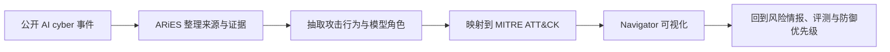

# LLM ATT&CK Navigator：Anthropic 如何把一年 AI 赋能网络威胁整理成可追踪地图

> 研究者精读 · 这篇不是在证明“LLM 已经会独立黑入系统”，而是在把公开可见的 AI-enabled cyber threat 放回 MITRE ATT&CK 坐标系里，看模型到底进入了攻击链的哪些位置、证据强到什么程度、风险阈值正在怎样移动。

- 原文：[Anthropic Frontier Red Team: LLM ATT&CK Navigator](https://red.anthropic.com/2026/attack-navigator/)
- 配套说明：[What we learned mapping a year's worth of AI-enabled cyber threats](https://www.anthropic.com/news/mapping-ai-enabled-cyber-threats)
- 发布时间：2026-06-03
- 相关框架：[MITRE ATT&CK Enterprise Matrix](https://attack.mitre.org/matrices/enterprise/)、[Verizon 2025 DBIR](https://www.verizon.com/business/resources/reports/dbir/)

## TL;DR

Anthropic Frontier Red Team 发布的 **LLM ATT&CK Navigator**，核心贡献不是一个新的 cyber benchmark，也不是一次模型能力炫技，而是把一年内公开报告的 **832 起疑似 AI 赋能网络安全事件**，映射到 MITRE ATT&CK 的 tactic、technique 和 procedure 层级。它试图回答一个更细的问题：当报告说攻击者“使用了 AI”时，AI 是在写钓鱼文本、辅助代码、解释漏洞、组织侦察结果，还是已经进入多工具编排和后续行动选择？

报告给出的最稳健判断是：公开证据显示 AI-enabled cyber activity 已经不只停留在内容生成环节，而是横跨 Reconnaissance、Resource Development、Initial Access、Execution、Persistence、Defense Evasion、Credential Access、Discovery、Lateral Movement、Collection、Command and Control、Exfiltration、Impact 等多个 ATT&CK 区域。Anthropic 在配套说明中称，大约 **70% 的 MITRE tactics** 至少出现过一个 AI-enabled activity 证据。

但这两个数字都不能被读成“全球已有 832 起真实 AI 自动化攻击”，也不能被读成“LLM 已经自主覆盖 70% 攻击链”。832 是公开可见的观察点，70% 是 tactic 覆盖面，不是发生频率。更准确的读法是：AI 在攻击链里的使用已经足够分散、足够复杂，安全团队需要用 ATT&CK 这种行为坐标系持续跟踪，而不是继续把“用了 AI”当成单一标签。

## 这篇文章真正关心的问题

这篇文章真正关心的不是“模型会不会黑客攻击”。这个问法太粗，因为它把几种风险混在了一起：有人可能只是用 LLM 改写钓鱼邮件，有人可能用它生成脚本，有人可能让它解释错误输出，还有人可能把模型接进扫描器、shell、漏洞利用工具和凭据处理流程。

Anthropic 的问题更接近威胁情报语境：**AI-enabled cyber threat 在真实公开事件中出现在哪里？这些位置能否被放进防御方已经熟悉的 ATT&CK 矩阵？**

这个问题有两个隐含前提。

第一，AI 风险需要按攻击行为拆开。攻击链里每一步的防御含义不同：侦察阶段的模型增强，可能主要带来速度和规模；凭据访问阶段的模型增强，可能带来更强的数据清洗和目标筛选；如果进入工具调用编排，风险才更接近 agentic misuse。

第二，安全团队需要可复用的坐标系。MITRE ATT&CK 的优势在于它不是按“攻击者是谁”分类，而是按可观察行为分类。把 LLM 使用挂到 ATT&CK 上，能够让模型安全、威胁情报、SOC、红队和政策团队讨论同一组对象。

## 作者是怎么展开这个问题的

作者的展开顺序很克制，大体是从“行业缺少细粒度地图”出发，再逐步说明数据、映射和图表。

第一步是定义研究对象：公开报告中的 AI-enabled cyber activity。这里的 activity 不是同质实验样本，而是来自威胁报告、安全厂商博客、平台方披露、研究文章和新闻材料的公开观察。配套说明给出的总数是 832 起。

第二步是把这些材料纳入 Anthropic 的 **AI Risk Intelligence and Evaluation System, ARiES**。从公开描述看，ARiES 更像一套风险情报与评估流程：它把分散的事件、来源、AI 参与线索和攻击行为组织起来，让后续映射和复核有结构可依。

第三步是把事件里的行为映射到 MITRE ATT&CK。这里的关键不是简单打标签，而是把“AI 参与方式”与 tactic / technique / procedure 联系起来。例如，同样写着“used AI”，如果行为是生成社会工程文本，它和 Initial Access 语境更相关；如果行为是批量整理目标、解释漏洞或生成脚本，就会落到不同的技术项。

第四步是用 Navigator 展示结果。Navigator 的意义是让读者能按 ATT&CK 战术、技术、证据和活动类型浏览，而不是只看总数。它把报告从“年度趋势文章”变成了一个可以继续更新的证据地图。

可以把作者的方法压缩成这样一条路线：

这条路线说明，报告的中心不是模型评测，而是风险情报工程：把噪声很大的公开材料，整理成可以被防御方持续使用的行为地图。

## 关键段落细读

> "AI-enabled cyber threats"

这个短语比 “AI cyber attacks” 更谨慎。enabled 表示 AI 可能是辅助器、加速器、分析器或编排器，而不必然是自主攻击主体。Anthropic 选择这个说法，是在提醒读者不要把所有模型参与都解释成同一种能力跃迁。

> "832 publicly reported incidents"

这是全文最容易被传播、也最容易被误读的数字。它的作用是证明公开材料的规模已经大到值得系统化整理，但它不是全球真实基数，也不是随机抽样。公开报告天然有披露偏差：被厂商看见、愿意公开、技术细节足够多的事件，才更可能进入地图。

> "a living map"

这句话解释了 Navigator 的定位。它不是一次性榜单，而是会随模型能力、攻击者采纳、平台披露和研究复核变化的地图。对防御方来说，这意味着 ATT&CK 上的空白格子不能被当成安全证明；它们只是“目前公开证据不足”的区域。

> "LLM ATT&CK Navigator"

标题里的 Navigator 也值得读。作者没有说 “LLM Threat Taxonomy”，而是把工作放在 ATT&CK Navigator 传统里：不是重新发明分类学，而是把 LLM 相关证据放进安全团队已经会用的矩阵。这降低了采用门槛，也限制了报告的野心：它优先服务于可追踪、可审计、可更新，而不是给出一个宏大的 AI 风险理论。

## 案例、图表与证据的作用

报告中最重要的视觉证据是完整 Navigator 矩阵。

这张图的作用不是展示“某个模型能执行所有格子”，而是展示公开材料中哪些 ATT&CK 技术项已经出现 AI 参与证据。正确读法是横向看攻击阶段，纵向看具体技术，再回到每个格子的证据来源。

按 tactic 聚合的图表则回答覆盖面问题。

大约 70% tactics 覆盖的意义是：AI 参与已经跨越多个攻击阶段，不能再只被理解为“写邮件”或“生成恶意代码”。但覆盖不等于频率，一个 tactic 只要有足够证据出现一次，就可能被计入。因此它更适合当排查清单，而不是概率排序。

activity type 图表的价值在于把模型角色拆开。

这是报告里最值得后续研究复用的部分之一。文本生成、代码辅助、漏洞解释、侦察总结、工具调用编排、运营自动化，对风险阈值的含义完全不同。如果这些角色被压缩成“used AI”，防御方就很难判断该补日志、改权限、加人工确认，还是重新设计模型拒答和工具权限。

最后一类聚合趋势图支撑了 living map 的论点。

它提醒读者：今天没有公开证据的 ATT&CK 技术项，明天可能会出现；今天只是文本辅助的环节，未来也可能因为工具生态成熟而进入更高自动化等级。图表的作用不是预测某条曲线，而是要求后续所有案例都能继续落回同一坐标系。

## 这篇文章的核心判断与边界

这篇文章的核心判断可以概括为三层。

第一，公开证据已经足以说明 AI-enabled cyber activity 是多阶段现象，而不是单一内容生成问题。AI 参与出现在侦察、资源准备、初始访问、执行、凭据处理、发现、横向移动、数据收集和影响等区域。

第二，MITRE ATT&CK 是比“AI 攻击清单”更稳健的表达方式。它把讨论对象从供应商、模型和新闻标题，转到可观察行为、攻击目的和防御控制点。

第三，风险阈值需要按模型角色分层。文本润色和多工具 agent 不是同一级别风险；单次代码生成和根据工具反馈连续选择下一步，也不是同一级别风险。

边界同样重要。

| 不能直接推出的结论 | 为什么不能推出 |
|---|---|
| 全球真实 AI 网络攻击数量就是 832 | 832 来自公开报告，不是全球基数，也不是随机样本 |
| AI 已经高频覆盖 70% 攻击链 | 70% 指 tactic 覆盖面，不是频率、成熟度或自动化程度 |
| LLM 已经自主完成完整攻击链 | 报告没有证明所有阶段都由模型自主完成 |
| 某个具体模型风险最高 | 公开材料通常缺少模型版本、提示词、工具权限和人为介入比例 |
| 空白技术项就是安全的 | 空白可能只是未发现、未披露或难以归因 |

也就是说，这份报告最强的证据是“公开可见采用模式”，而不是“模型能力上限”。它适合指导威胁情报和防御优先级，不适合被改写成模型排行榜或恐慌式结论。

## 放到 AI 安全、后训练、Agent 或对应领域里看

放到 AI 安全里看，这篇文章把抽象的 misuse 风险拉回了安全运营语言。过去很多 AI 安全讨论会停在越狱、恶意代码生成或模型拒答上；Anthropic 这篇则问：这些能力在真实攻击链里到底对应哪种 ATT&CK 行为？防御者能不能观察到结果？证据来自哪里？

放到后训练与模型评测里看，它提示评测任务不能只测“模型是否会输出恶意 payload”。更关键的是能力阈值：模型是否会帮助用户分解攻击目标、解释漏洞、选择工具、根据失败反馈调整计划、压缩观察结果、规避检测或推进多步骤链条。不同阈值对应不同安全策略。

可以把阈值粗略分成四层：

| 阈值 | 模型角色 | 风险变化 |
|---|---|---|
| 内容辅助 | 改写、翻译、个性化文本 | 扩大社会工程规模和变体 |
| 技术辅助 | 解释漏洞、生成脚本、排错 | 降低低中技能攻击者成本 |
| 操作辅助 | 组织侦察、整理凭据、选择下一步 | 提高多阶段攻击效率 |
| 工具编排 | 在工具反馈中连续决策 | 接近 agentic cyber misuse，需要更强权限边界和审计 |

放到 Agent 领域里看，Navigator 不是在证明 agent 已经普遍接管攻击，而是在给 agentic risk 找观察坐标。一旦攻击者把 LLM 接入 shell、扫描器、云 API、漏洞利用框架或数据处理工具，ATT&CK 映射就能帮助研究者判断：模型到底是在增加速度、增加规模、增加变体，还是增加了自主选择攻击步骤的能力。

放到风险情报里看，ARiES 的意义是把事件、证据、映射和评测连起来。一个成熟的 AI 风险情报系统不只存“发生了什么”，还应该存“证据强度如何、模型角色是什么、落在哪个 ATT&CK 技术项、能反向生成什么评测和检测需求”。

## 还值得继续追问什么

1. Anthropic 是否会公开 Navigator 的可下载数据格式，例如 JSON、CSV、STIX/TAXII 或 ATT&CK Navigator layer。
2. 832 起事件是否去重，证据等级如何划分，不同来源之间的可信度如何处理。
3. MITRE、CISA 或主要安全厂商是否会把 LLM activity type 纳入更正式的 ATT&CK 扩展或防御矩阵。
4. 后续案例中，AI 参与是否会从文本和代码辅助继续向工具调用编排迁移。
5. 模型安全评测能否围绕 ATT&CK 技术项设计“有无 LLM、不同工具权限、不同人工确认点”的对照。
6. Verizon DBIR、M-Trends、Microsoft Digital Defense Report、Google Threat Intelligence 等年度报告是否会开始披露 AI-assisted TTP 字段。
7. 企业 SOC 是否能在不看到提示词和模型日志的情况下，仅通过行为遥测判断某条攻击链是否被 AI 放大。

打开原文：[LLM ATT&CK Navigator](https://red.anthropic.com/2026/attack-navigator/)
