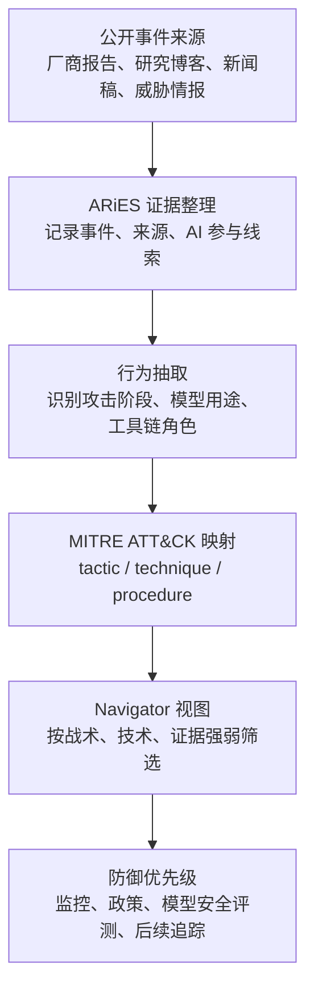

# LLM ATT&CK Navigator：Anthropic 如何把一年 AI 赋能网络威胁整理成可追踪地图

- 内容类型：AI 安全报告 / 官方研究博客
- 主要来源：[Anthropic Frontier Red Team: LLM ATT&CK Navigator](https://red.anthropic.com/2026/attack-navigator/)
- 配套官方新闻稿：[What we learned mapping a year's worth of AI-enabled cyber threats](https://www.anthropic.com/news/mapping-ai-enabled-cyber-threats)
- 发布时间：2026-06-03
- 分类：AI 安全相关
- 相关框架：[MITRE ATT&CK Enterprise Matrix](https://attack.mitre.org/matrices/enterprise/)、[Verizon 2025 DBIR](https://www.verizon.com/business/resources/reports/dbir/)

这张题图来自 Anthropic 新闻稿。它不是实验结果图，而是报告入口图：真正有信息量的是 Frontier Red Team 博客中的交互式 Navigator、MITRE ATT&CK 映射和四张统计图。下面正文会把这些图分别放到对应章节解释。

## TL;DR

Anthropic Frontier Red Team 在 2026 年 6 月 3 日发布了一个名为 **LLM ATT&CK Navigator** 的公开报告，目标不是证明某个模型“会黑客攻击”，而是把一年内公开披露的 832 起疑似 AI 赋能网络安全事件，映射到 MITRE ATT&CK 的战术、技术和程序层级。报告把“LLM 在网络攻击链里到底帮了什么忙”拆成可统计、可筛选、可更新的证据地图，覆盖 Reconnaissance、Resource Development、Initial Access、Execution、Persistence、Defense Evasion、Credential Access、Discovery、Lateral Movement、Collection、Command and Control、Exfiltration、Impact 等战术。

它的方法可以概括为四步：第一，收集公开报告、威胁情报、博客和安全厂商材料中的 AI 相关 cyber 事件；第二，用内部的 **AI Risk Intelligence and Evaluation System, ARiES** 组织证据，给每个事件标注来源、信号强度和行为类型；第三，把事件里的行为映射到 MITRE ATT&CK 企业矩阵，统计哪些 TTP 已经出现、哪些还没有足够公开证据；第四，把结果做成可探索的 Navigator，让安全团队按战术、技术、模型角色和证据强弱查看。报告明确说这是“living map”，因为 AI 能力、攻击者采纳速度和披露材料都会变。

最重要的数字有三个。其一，官方新闻稿说 Frontier Red Team 梳理了 **832 起**公开报告的 AI 相关事件。其二，Frontier Red Team 博客说这些事件横跨 MITRE ATT&CK 中许多战术，其中大约 **70% 的 MITRE tactics** 已经出现至少一个 AI 赋能活动证据。其三，报告把“AI 参与攻击”分成层级：有些只是攻击者用 LLM 起草钓鱼邮件或翻译文本，有些则把模型接进自动化扫描、代码生成、漏洞利用链分析或运营流程；因此“AI 参与”不能被压缩成一个布尔值。

报告的实用价值在于它把安全讨论从宏观恐慌拉回到可审计对象：哪些 ATT&CK 技术有证据，证据来自哪里，模型在其中是辅助、自动化器、分析器还是执行链的一部分。它也提醒读者不要过度外推：公开材料偏向被披露的事件，不能代表真实基数；很多报告只说明攻击者使用 AI，却没有披露模型、提示词、工具链或人工参与比例；Navigator 证明的是“公开可观察到的采用模式”，不是“LLM 已经自主完成完整攻击链”。

日报视角下，这篇报告值得进入 AI 安全频道，因为它提供了一个可复用的分类框架：以后追踪 agentic cyber risk、模型滥用、企业防御优先级时，可以把新事件继续落到 MITRE ATT&CK 的 tactic / technique 结构里，再结合 ARiES 式证据等级做更新。它的局限也很清楚：没有给出原始 832 条事件明细的完整可下载数据；没有把每个技术项的统计置信度、误报处理和样本偏差完全展开；也没有证明特定模型相对于传统自动化工具带来了多少净新增能力。

## 来源与材料地图

本轮深读使用了五类材料。

| 材料 | 链接 | 本文使用方式 |
|---|---|---|
| Frontier Red Team 技术博客 | [LLM ATT&CK Navigator](https://red.anthropic.com/2026/attack-navigator/) | 主材料，读取报告动机、方法、图表、Navigator 定义和结论边界 |
| Anthropic 新闻稿 | [Mapping AI-enabled cyber threats](https://www.anthropic.com/news/mapping-ai-enabled-cyber-threats) | 核对发布日期、832 起事件、ARiES 背景和官方定位 |
| MITRE ATT&CK | [Enterprise Matrix](https://attack.mitre.org/matrices/enterprise/) | 解释 tactic / technique 映射，避免把报告误读成任意分类表 |
| Verizon DBIR | [2025 Data Breach Investigations Report](https://www.verizon.com/business/resources/reports/dbir/) | 作为第三方行业背景：AI 风险需要和传统 breach 模式对照 |
| Anthropic earlier case study | [Disrupting the first reported AI-orchestrated cyber espionage campaign](https://www.anthropic.com/news/disrupting-ai-orchestrated-cyber-espionage) | 作为同一研究团队对 agentic cyber misuse 的补充上下文 |

第三方参考方面，本轮还查找了标题加 `analysis`、`review`、`AI-enabled cyber threats`、`LLM ATT&CK Navigator`、`Anthropic 832 incidents` 等组合。可用材料主要是官方原文、MITRE 与 Verizon 框架；低质量转载大多重复新闻稿，没有提供比官方材料更强的证据，因此本文只把它们当发现线索，不作为主要论据。

## 1. 报告背景：作者到底要回答什么问题

这篇报告的入口问题很具体：当安全社区说“攻击者正在使用 AI”时，这句话太粗。它既可能指攻击者用模型改写钓鱼邮件，也可能指把模型嵌入扫描、脚本生成、漏洞解释、基础设施管理、凭据处理或运营决策。前者更像生产力工具，后者更接近攻击链自动化。

Anthropic 的 Frontier Red Team 因此没有只列“AI cyber incidents”清单，而是选择用 MITRE ATT&CK 做坐标系。ATT&CK 的好处是它把攻击链拆成战术目标和技术动作。战术回答“攻击者为什么做这一步”，技术回答“攻击者怎么做”。如果 AI 只在写邮件中出现，它应该落在 social engineering 或相关初始访问语境；如果 AI 帮助生成脚本、解释漏洞或整理受害系统信息，它又会落到不同技术项。

这也是报告标题里 “Navigator” 的意义。它不是一篇普通趋势文章，而是试图把 AI 滥用观察变成一个可导航、可增量更新的地图。安全团队可以问：哪些 ATT&CK 区域已有公开证据？哪些还只是合理担忧？哪些领域的证据来自高质量披露，哪些只是媒体转述？

## 2. 原文结构总览

Frontier Red Team 博客大致分成六个层次。

1. 先说明研究动机：AI 系统已经影响网络安全，但行业需要更细粒度的威胁地图，而不是笼统判断。
2. 再介绍数据来源：团队收集公开报道的 AI-enabled cyber activity，并将其纳入 ARiES 工作流。
3. 然后解释映射方法：把观察到的行为落到 MITRE ATT&CK 的 tactics、techniques 和 procedures。
4. 接着展示 Navigator：用交互式视图呈现不同技术项的出现情况、热度和证据链接。
5. 随后用图表说明总体分布：哪些战术出现更多，哪些技术还很少见，哪些活动更可能体现 agentic 使用。
6. 最后讨论局限：公开披露偏差、证据强弱不同、LLM 参与程度难以完全还原，以及地图需要持续更新。

这个结构服务的是“证据地图”而不是“模型能力评测”。读者不应把它当成某个模型在 cyber benchmark 上的分数，也不应把它当成攻击者能力上限。它更像一张安全运营情报图：把分散事件聚类，便于企业、研究者和政策制定者讨论风险优先级。

## 3. 方法：从公开事件到 ATT&CK 技术项

报告没有公布完整原始数据集，但可以从原文描述还原出一个清晰管线。

这张图是本文根据官方描述整理的解释性流程，不是原文直接给出的系统图。它强调两个转换：一是从自然语言威胁报告到结构化事件，二是从事件到 ATT&CK 技术项。真正困难的地方不是画图，而是证据归因。

### 3.1 事件并不等于攻击样本

报告说团队映射了 832 起公开报告的事件。这里的“事件”不是同质样本。有些可能来自安全厂商报告，有些来自平台方封禁公告，有些来自研究团队分析，有些来自新闻材料。不同来源对技术细节的披露深度差异很大。

因此，较合理的理解是：832 是公开可见的 AI cyber activity 观察点，不是随机抽样数据集，也不是全球真实基数。它适合回答“公开材料里哪些 ATT&CK 区域已出现 AI 使用证据”，不适合直接回答“现实世界中有多少比例攻击使用 AI”。

### 3.2 ARiES 的角色：把风险情报流程化

Anthropic 新闻稿把 ARiES 全称写为 **AI Risk Intelligence and Evaluation System**。从公开表述看，ARiES 不是单一模型，而是 Anthropic 用来收集、组织和评估 AI 风险情报的内部系统或流程。它把事件从散乱文本转成可用于评估和红队工作的材料。

在这篇报告里，ARiES 的价值主要有三点。

- 统一事件口径：把来源、日期、攻击链位置和 AI 参与方式放到同一结构里。
- 支持证据回溯：每个判断都应能回到公开材料，而不是只留下一个风险标签。
- 连接评测与防御：如果某类 ATT&CK 技术已有真实滥用证据，就可以反过来设计模型安全评测和监控规则。

### 3.3 ATT&CK 映射的核心变量

把报告抽象成公式，可以把每个事件 $e_i$ 看成一个带证据的三元组：

$$
e_i = (s_i, a_i, m_i)
$$

其中 $s_i$ 是公开来源，$a_i$ 是可观察行为，$m_i$ 是模型参与方式。映射函数 $f$ 把事件放到 ATT&CK 技术项：

$$
f(e_i) \rightarrow (tactic, technique, evidence)
$$

这里的关键不是数学复杂度，而是每个变量的含义。$m_i$ 不能只写“used AI”。更有用的标签应该区分文本生成、代码生成、漏洞解释、工具调用编排、侦察总结、凭据处理、规避建议或运营自动化。证据 $evidence$ 也需要区分直接日志、平台检测、研究复现、威胁情报推断和媒体转述。

## 4. Navigator 图表逐图解读

Frontier Red Team 博客包含四张主要图片。它们共同回答一个问题：AI 赋能网络威胁在 ATT&CK 矩阵中到底分布在哪里。

### Figure 1：完整 Navigator 矩阵

这张图是整篇报告的中心证据。它把 AI-enabled cyber activity 映射到 ATT&CK 技术格子里。每个格子的颜色或热度代表公开事件中对应技术的观察情况。读者看到的不是“某个模型会执行所有格子”，而是“公开材料中哪些技术区域已经被报告过 AI 参与”。

图的正确读法是横向看战术阶段、纵向看具体技术。比如 Reconnaissance 和 Resource Development 更容易出现 AI 辅助，因为这些阶段包含信息整理、内容生成、目标画像、基础设施准备等文本或脚本密集任务。后面的 Lateral Movement、Exfiltration 或 Impact 如果也出现标记，说明至少有公开材料声称 AI 进入了更靠后的攻击链，但仍要回到具体证据看模型是否只是辅助分析。

### Figure 2：按 MITRE tactic 的覆盖分布

这张图把技术项提升到 tactic 层级，帮助读者判断“攻击链哪个阶段更常被 AI 赋能”。博客中最醒目的结论是，大约 70% 的 MITRE tactics 已有至少一个 AI-enabled activity 证据。这个数字的意义是覆盖面，而不是频次。

覆盖面高说明 AI 使用已经不只停留在写钓鱼文本或生成恶意内容这种早期想象里。但它仍不能证明每个战术阶段都已经被模型稳定自动化，因为一个 tactic 只要出现一次合格证据就会被计入覆盖。安全团队应把它当成排查清单，而不是发生概率排序。

### Figure 3：AI activity type 的相对分布

这张图试图区分“模型在事件里扮演什么角色”。这是报告中最值得复用的设计，因为很多 AI 安全讨论会把 prompt generation、code assistance、tool orchestration、analysis support 混在一起。实际上，它们对风险和防御的含义完全不同。

如果 AI 主要用于生成文本，防御重点可能是检测大规模社会工程、品牌冒充和语义变体。如果 AI 用于代码或脚本生成，重点会转向代码执行前后的行为监控。如果 AI 被接进多工具链，重点则是权限边界、工具调用审计、速率限制、人工确认点和异常轨迹检测。

### Figure 4：按时间或类别的聚合趋势

这张图承担“living map”论证：AI cyber activity 不是一次性清单，而是持续变化的观察对象。随着模型能力、工具生态和攻击者习惯变化，Navigator 需要继续更新。它也暗示了一个方法论问题：今天没有公开证据的技术项，不能被当成永久安全区。

日报编辑视角下，这张图最重要的不是曲线具体形状，而是它要求后续自动化持续追踪同一坐标系。未来如果出现新的 agentic cyber case，我们应该问它新增了哪个 ATT&CK 技术项、改变了哪个 activity type、证据等级是否比过去更强。

## 5. 832 起事件能证明什么，不能证明什么

官方新闻稿给出的 832 起公开报告事件，是整篇报告最容易被误读的数字。

| 读法 | 是否合理 | 解释 |
|---|---:|---|
| “公开材料中至少有 832 个 AI cyber activity 观察点” | 是 | 这是报告明确支持的读法 |
| “全球已有 832 起真实 AI 网络攻击” | 不充分 | 公开事件不等于全球真实基数，且事件定义可能包含研究披露和平台处置 |
| “AI 已经覆盖 70% ATT&CK tactics” | 部分合理 | 覆盖指至少有证据出现，不代表每个阶段都高频发生 |
| “LLM 能自主完成完整攻击链” | 不充分 | 报告没有证明所有阶段都由模型自主完成，也没有给出统一自动化比例 |
| “防御方应把 AI 使用映射到 ATT&CK” | 是 | 这是报告最稳健、最可落地的结论 |

这也是为什么报告选择 ATT&CK，而不是只报总数。总数容易制造心理冲击，但对安全团队行动帮助有限。ATT&CK 技术项更适合变成检测、审计和演练需求。

## 6. 和 MITRE ATT&CK 的关系：不是重新发明安全分类

MITRE ATT&CK 的 Enterprise Matrix 本来就是防御团队熟悉的攻击行为知识库。Anthropic 的报告没有另起炉灶创造“AI 攻击分类学”，而是把 AI 参与方式挂到已有矩阵上。这一点很重要，因为它降低了组织采用成本。

一个企业安全团队可以沿用已有流程：威胁建模、检测规则、日志源覆盖、红队演练、事件响应复盘都可以围绕 ATT&CK 展开。新增加的是一个问题：这个技术项如果被 LLM 放大，会改变哪一层？

可以把风险增量写成一个解释性评分：

$$
R_{AI}(technique) = B + A_{scale} + A_{speed} + A_{variation} + A_{autonomy} - D
$$

其中 $B$ 是该技术原本的基础风险，$A_{scale}$ 是规模放大，$A_{speed}$ 是速度提升，$A_{variation}$ 是文本、代码或基础设施变体生成能力，$A_{autonomy}$ 是工具链自主化程度，$D$ 是现有检测和人工控制能抵消的部分。这个公式不是原文公式，而是本文为了帮助理解防御优先级做的解释性整理。

例如，同样是侦察阶段，LLM 可能主要增加速度和变体生成；同样是执行阶段，如果模型只是辅助解释错误，$A_{autonomy}$ 较低；如果模型能在多工具环境里连续选择动作并根据反馈调整，$A_{autonomy}$ 才会显著上升。报告最有价值的部分就在于推动读者做这种拆分。

## 7. 和 Verizon DBIR 的对照：AI 风险要落回真实 breach 结构

Verizon DBIR 是年度数据泄露报告，长期跟踪社会工程、凭据滥用、漏洞利用、勒索软件、供应链和人为错误等模式。把 Anthropic 报告与 DBIR 放在一起看，可以避免两个极端。

一个极端是低估 AI：认为攻击者只是多了一个写邮件工具，不会改变防御面。Anthropic 的 Navigator 反驳了这个低估，因为公开证据已经覆盖了多个 ATT&CK tactics，说明 AI 参与不只发生在内容生成环节。

另一个极端是高估 AI：把所有网络攻击变化都归因于模型能力。DBIR 提醒我们，真实泄露仍然高度依赖凭据、社会工程、补丁管理、暴露服务和运营失误。AI 可能放大这些路径，但未必取代它们。更现实的问题是：AI 会在哪些传统高发路径上降低攻击者成本？

| 传统 breach 模式 | AI 可能放大的环节 | 防御侧更应关注 |
|---|---|---|
| 社会工程 | 多语言、个性化、快速变体 | 邮件与消息语义检测、身份确认流程 |
| 凭据滥用 | 泄露数据整理、目标画像 | MFA、异常登录、凭据重用检测 |
| 漏洞利用 | 漏洞解释、脚本辅助、错误排查 | 暴露面管理、补丁 SLA、运行时监控 |
| 勒索与敲诈 | 文案生成、受害者沟通、数据分类 | 备份恢复、出站流量、敏感数据发现 |
| 供应链 | 项目画像、依赖关系分析 | SBOM、代码审计、发布链完整性 |

这张表是本文的综合分析，不是 Anthropic 原文表格。它把 Navigator 的 AI 参与维度和 DBIR 的 breach 现实连接起来。日报后续可以沿这个表追踪：AI 是否真的改变高发 breach 类型的成本结构。

## 8. 和 Anthropic 早前 cyber case 的关系

Anthropic 2025 年 11 月发布过一篇案例，讨论其如何中断一起被描述为 AI-orchestrated 的网络间谍活动。那篇文章的重点是具体案例：攻击者如何把 Claude Code 和工具生态用于侦察、自动化和运营支持。2026 年 6 月的 Navigator 则把视角从单案扩展到一年公开材料。

两者的关系可以这样理解。

- 早前 case study 回答“一个高强度案例里模型可能怎样进入攻击流程”。
- LLM ATT&CK Navigator 回答“公开材料整体看，AI 参与分布在哪些 ATT&CK 区域”。
- 前者更适合分析 agentic misuse 的执行链，后者更适合建立长期监测面板。

这也解释了为什么 Anthropic 在新闻稿里强调 “mapping”。如果没有地图，单个案例容易被看成孤立极端；如果只有地图没有案例，读者又很难理解模型具体怎样被接入攻击流程。两个材料合起来，才构成比较完整的安全叙事。

## 9. 原文短摘录与分析

> "a living map"

这句来自 Frontier Red Team 博客对 Navigator 的定位。它强调地图会随新证据更新，不是一次性年度榜单。对防御方来说，这意味着指标、规则和模型评测都应持续更新。

> "AI-enabled cyber threats"

这是官方新闻稿反复使用的短语。它刻意没有写成 autonomous cyber attacks，说明 Anthropic 在定义上保留了模型参与程度差异。本文也沿用这种谨慎口径。

> "832 publicly reported incidents"

这句是新闻稿中最关键的量化信息。它支持“公开材料规模已经足够系统化整理”的结论，但不支持“全球真实攻击数量就是 832”的结论。

这些摘录都很短，只用来锚定原文概念。报告细节主要通过结构化转述和图表分析展开。

## 10. 防御者如何复用这个框架

如果把 Navigator 当成企业安全团队的工具，它至少能支持四类工作。

### 10.1 检查检测规则覆盖

安全团队可以把已标记的 ATT&CK 技术项和自己的日志源、SIEM 规则、EDR 行为检测做对照。问题不是“有没有 AI 检测器”，而是“如果 AI 帮助攻击者更快执行某个技术项，我们现在是否能看见结果行为”。

这点很关键。多数情况下，防御方未必能直接看到攻击者提示词或模型调用日志，但可以看到外部行为：扫描、异常登录、脚本执行、横向移动、数据压缩、出站传输等。Navigator 更适合帮助选择这些行为检测优先级。

### 10.2 设计模型安全评测

模型开发者可以把高频或高风险 ATT&CK 技术转成安全评测任务。例如，评测不应该只问模型是否会生成明显恶意代码，还应评估模型是否会帮助用户分解攻击链、规避检测、优化凭据处理或选择下一步行动。

但评测要注意边界。不能为了“贴近真实攻击”而泄露可操作利用流程。更安全的做法是评估模型是否拒绝不当请求、是否提供防御性替代、是否识别高风险上下文，以及在工具调用环境里是否触发人工确认。

### 10.3 调整红队演练

红队可以围绕 “AI augmentation” 设计演练：同样的攻击路径，在没有 LLM、只有文本 LLM、带代码助手、带工具调用 agent 四种条件下，速度、成功率、误报、人工干预点有什么差异。这样才能量化 $A_{scale}$、$A_{speed}$ 和 $A_{autonomy}$。

Anthropic 报告没有直接给出这些实验数据，但它提供了候选技术项。企业不需要从零想象场景，可以先从公开证据最多或业务暴露面最大的 ATT&CK 区域开始。

### 10.4 制定供应商和内部工具政策

当员工、外包、SOC、开发团队和安全团队都在使用 LLM 工具时，组织需要区分防御用途和滥用风险。Navigator 可以帮助政策制定者把规则写得更具体：哪些请求必须走安全环境，哪些需要日志留存，哪些工具调用需要审批，哪些数据不能输入外部模型。

这比泛泛禁止“AI 用于网络安全”更可执行。网络安全本身会大量使用自动化和模型，关键是权限、审计、隔离和用途。

## 11. Skeptic 审查：三类不能直接推出的结论

### 11.1 不能推出“LLM 已经自主完成大多数攻击链”

报告证明的是公开事件中 AI 参与分布广，不是模型自主性已经普遍很高。很多事件可能仍然由人类攻击者主导，模型只是辅助生成、分析或加速。

### 11.2 不能推出“某个具体模型风险最高”

公开报告通常不会完整披露模型版本、提示词、工具权限和安全策略。Navigator 是活动地图，不是模型排行榜。把它用来比较供应商风险会超出证据。

### 11.3 不能推出“没有标记的 ATT&CK 技术就是安全的”

未出现公开证据可能意味着尚未发生，也可能意味着未被发现、未被披露或难以归因。报告自己也强调 living map，因此空白区域更像追踪方向，而不是安全证明。

### 11.4 不能推出“AI 风险独立于传统安全控制”

AI 可能放大社会工程、漏洞利用和凭据滥用，但防御仍然要落在身份、补丁、隔离、日志、备份、出站控制和人员流程上。Navigator 应该增强这些控制的优先级排序，而不是替代它们。

## 12. 证据强度和主要局限

这篇报告最强的证据是官方披露的系统化整理：832 起公开事件、ATT&CK 映射、Navigator 图表、activity type 划分，以及和 ARiES 的内部情报流程连接。它让读者能看到 AI cyber activity 的结构，而不是只看到新闻标题。

主要局限也来自公开材料属性。

| 局限 | 为什么重要 | 后续应如何补 |
|---|---|---|
| 原始事件明细未完整公开 | 外部研究者难以复核每条映射 | 发布可脱敏数据集或更细的证据等级 |
| 样本存在披露偏差 | 高曝光事件更容易进入地图 | 和平台日志、CVD 数据、企业遥测交叉验证 |
| AI 参与程度不均 | “用 AI”可能从改写文本到工具编排差别巨大 | 细分模型角色和自动化等级 |
| 缺少反事实基线 | 难判断 AI 相比传统脚本新增了多少能力 | 设计有无 LLM 对照红队实验 |
| 技术项覆盖不等于频率 | 70% tactics 覆盖容易被误读 | 同时报告覆盖、频次、置信度和影响 |

因此，日报应该把这篇报告视为高质量安全情报框架，而不是最终统计答案。它适合指导后续采集、分类和问题设计。

## 13. 后续追踪问题

下一轮自动化可以继续追踪这些问题。

1. Anthropic 是否会公开 Navigator 的可下载 JSON、CSV 或 STIX/TAXII 版本。
2. MITRE、CISA 或安全厂商是否会把 LLM-specific activity type 纳入 ATT&CK 扩展或防御矩阵。
3. 是否有独立研究复核 832 起事件的来源质量、重复率和 ATT&CK 映射一致性。
4. agentic cyber misuse 是否从文本辅助转向工具调用编排，尤其是多步骤侦察、漏洞解释和运营自动化。
5. 企业 SOC 是否开始把“AI-assisted TTP”作为检测、事件响应和红队报告字段。
6. 后续 DBIR、M-Trends、Microsoft Digital Defense Report 或 Google Threat Intelligence 是否出现同类统计。

这些问题比追逐单条新闻更有价值，因为它们能判断报告提出的地图是否成为行业共同语言。

## 14. 可复用到 Daily Report 的判断

这篇报告应进入 AI 安全频道，而不是 Agent 或后训练频道，原因有三点。

第一，它的核心贡献是安全情报结构化。虽然涉及 agentic misuse，但主问题不是构建 agent，也不是训练模型，而是如何把 AI 赋能网络威胁落到 ATT&CK 坐标系。

第二，它给出了可复用的数据产品形态。Daily Report 后续可以借鉴 Navigator 思路：每条安全内容不仅写摘要，还记录威胁阶段、模型角色、证据强度和防御含义。

第三，它对“AI 安全”有现实约束。它不只讨论模型幻觉、越狱或抽象风险，而是把模型滥用放进企业安全团队熟悉的攻击链里，能连接模型安全、SOC、红队和政策制定。

## 15. 审稿式结论

如果用 reviewer 口吻评价，本文认为 LLM ATT&CK Navigator 是一篇值得收录的安全研究报告。它的问题定义清楚，分类框架稳健，图表服务于可操作防御，而不是制造噱头。尤其是用 MITRE ATT&CK 承接 AI cyber activity，让读者可以把新风险接入既有安全运营体系。

它的证据边界也必须保留。报告没有公开完整原始数据，无法独立复算 832 起事件的去重、置信度和映射一致性；也没有给出每个模型角色的严格量化实验。因此，日报卡片摘要不应写成“AI 已经自动化网络攻击链”，而应写成“Anthropic 将公开 AI 赋能网络威胁映射到 ATT&CK，显示公开证据已覆盖多个攻击阶段，并提出可持续更新的防御情报地图”。

从后续价值看，最值得追踪的不是这个数字本身，而是这个坐标系是否被更多机构采用。如果 CISA、MITRE、Verizon、Google、Microsoft 或主要安全厂商开始用类似字段披露 AI-assisted TTP，Daily Report 就可以围绕同一结构做长期趋势分析。
