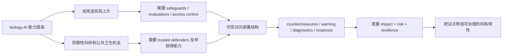

# OpenAI 的生物防御行动计划：把 frontier biology AI 放进“可信访问 + 实证评估 + 机构韧性”的闭环

## 元信息

| 字段 | 内容 |
| --- | --- |
| 原文 | [Biodefense in the Intelligence Age](https://openai.com/index/biodefense-in-the-intelligence-age/) |
| 完整计划 | [Biodefense in the Intelligence Age PDF](https://cdn.openai.com/pdf/biodefense-in-the-intelligence-age.pdf) |
| 发布时间 | 2026-06-04 |
| 类型 | 官方行动计划 / AI for 安全 / 生物安全 |
| 关联材料 | [Rosalind Biodefense](https://openai.com/index/strengthening-societal-resilience-with-rosalind-biodefense/)、[GPT-Rosalind 新能力](https://openai.com/index/introducing-new-capabilities-to-gpt-rosalind/)、[强制核酸合成筛查公开信](https://screendna.org/)、[IFP DNA supply chain 分析](https://ifp.org/how-to-secure-the-dna-supply-chain/) |

## TL;DR

- **这篇计划在做什么：** OpenAI 把 GPT-Rosalind 与 Rosalind Biodefense 从“生命科学模型发布”推进到“生物防御能力部署计划”，核心不是让模型直接替代专家，而是让可信政府、公共卫生、国家实验室、大学、非营利和责任企业在受控访问下使用 advanced biology AI。
- **它怎么做：** 行动计划拆成 5 个支柱：可信访问装备防御者、加速医学反制措施、建立早期预警系统、加强诊断与响应、同时度量影响/风险/韧性。
- **证据与背景：** OpenAI 在 2026-05-29 发布 Rosalind Biodefense，2026-06-03 更新 GPT-Rosalind 能力；相关评测里，GPT-Rosalind 在 MedChemBench 为 27.5% vs GPT-5.5 的 25.1%，GeneBench 为 21.6% vs 20.4% 且少用 31% tokens，LabWorkBench 为 63.2% vs 55.8%。
- **关键数字：** 计划本身没有给出新实验结果，但给出 5 个承诺、5 个行动方向和 1 个明确排除边界：批准用途不包括危险 gain-of-function 研究的设计、规划、优化、执行或 troubleshooting。
- **最重要判断：** 这不是单纯“开放更强生物模型”，而是把能力放在 access control、expert review、monitoring、operational pilots、shared benchmarks 和 policy evidence 组成的闭环里。
- **局限：** 计划仍停留在行动框架层面，缺少对项目验收指标、partner selection 标准、失败案例、误报/漏报成本、跨国治理冲突、数据保护与公开透明度之间张力的细粒度公开说明。

## 这篇文章真正关心的问题是什么？

### 问题不是“AI 能不能懂生物”，而是“谁能安全地把它接入现实防线”

- 原文的出发点是一个双重事实：
  - advanced AI 已经能辅助科学团队综合证据、跨领域推理、分析复杂数据。
  - 同一批能力也可能降低生物安全门槛，尤其在实验设计、序列解释、协议理解、数据综合和决策支持上。
- 因此文章没有把生物安全写成“模型拒答策略”的窄问题。
- 它把问题重写为：
  - <u>防御者能否比风险扩散更早获得能力？</u>
  - <u>能力部署能否被专家验证、被机构吸收、被现实流程约束？</u>
  - <u>风险评估能否同时衡量 misuse risk 与 defensive benefit？</u>

### 它回应的是 AI 安全里的一个老张力

| 张力 | 常见极端答案 | 本文给出的中间路线 |
| --- | --- | --- |
| 生物能力增强 | 完全扩散以促进科学 | 完全收紧以避免风险 |
| 本文态度 | 不主张无边界开放 | 也不主张让防御者失去工具 |
| 机制 | trusted access | expert partnership + safeguards + evaluation |

- 这条路线的隐含前提是：
  - 最危险的状态不是“没有 AI”，也不是“人人都能无限访问 AI”。
  - 最危险的状态可能是攻击者或不负责任使用者利用扩散能力，而公共卫生、实验室、筛查、制造和应急系统没有同步增强。
- 所以本文反复强调 biological resilience：
  - 早发现威胁。
  - 更快发展 countermeasures。
  - 更有把握地协调响应。
  - 在危机前而不是危机中建立制度能力。

## 作者的论证路线

### 一句话结构



### claim → mechanism → evidence → boundary

| 层次 | 本文主张 | 对应机制 | 可见证据 | 边界 |
| --- | --- | --- | --- | --- |
| Claim | 防御者需要 frontier biology AI | trusted access | Rosalind Biodefense 和政府 trusted access | 只面向可信机构，不是通用开放 |
| Mechanism | 能力必须进入现实工作流 | pilots、expert review、validation environments | 反制措施、预警、诊断、演练等场景 | 需要实验室、制造、临床、公卫系统承接 |
| Evidence | 能力正在变强 | GPT-Rosalind 评测与插件工作流 | MedChemBench、GeneBench、LabWorkBench 指标 | 指标来自 OpenAI 自建/专家评估，外部复现有限 |
| Boundary | 不能只看模型能力 | risk + benefit 双账本 | Preparedness Framework、独立评估、shared benchmarks | 高层计划，没有公开细到项目级验收 |

## 五个承诺：不是口号，而是部署约束

### 1. Strengthen biological resilience

- 含义：
  - OpenAI 要支持能够加速 countermeasures、威胁检测、诊断、响应和公共利益生物 AI 部署的机构。
- 论证作用：
  - 把“生命科学 AI”从药物发现扩展到公共安全。
  - 把收益指标从论文或模型分数改成 crisis readiness。
- 需要追问：
  - 什么样的 readiness 算真正改善？
  - 是响应时间缩短、检测灵敏度提升、候选疫苗周期缩短，还是跨机构协调成本下降？

### 2. Expand trusted access

- 含义：
  - 先进生物 AI 不向所有人无差别开放，而是给有使命、专业能力、治理能力和 safeguards 的机构。
- 这解决的核心问题：
  - 防御者需要强能力。
  - 强能力又不能按消费级产品逻辑扩散。
- 文章给出的控制面包括：
  - access management。
  - organizational governance。
  - user controls。
  - monitoring。
  - narrow or revoke access。

### 3. Develop safeguards and evaluations

- 含义：
  - capability 与 safety 一起推进，不是模型先放出去再补规则。
- 计划明确把这些环节放在一起：
  - biological capability evaluations。
  - access controls。
  - monitoring。
  - abuse investigation。
  - model-safety research。
  - partner feedback。
- 它的意义：
  - 安全不只靠模型拒答。
  - 安全是访问、审计、组织、评估、反馈和治理的组合系统。

### 4. Partner with validating institutions

- 含义：
  - OpenAI 不把生物防御当成纯技术问题。
- 原文强调的现实依赖：
  - public-health institutions。
  - scientific expertise。
  - laboratory infrastructure。
  - emergency-management systems。
  - manufacturing capacity。
  - international cooperation。
- 研究者视角下，这一点很关键：
  - 生物风险不是只有“知识泄露”。
  - 它还涉及样本、试剂、合成供应链、实验设施、临床系统、制造扩产、公共信任和跨境协调。

### 5. Build and share evidence

- 含义：
  - OpenAI 承诺在不制造 information hazard 的前提下，发布高层 findings 和 lessons。
- 这里存在一个天然张力：
  - 太少公开，外部无法审计。
  - 太多公开，可能帮助规避 safeguards 或复现危险能力。
- 这也是本文最大的边界之一：
  - “公开高层结果”到底如何让学界、政府和公众判断有效性，文章没有给出细则。

## 五个行动：从模型访问到机构韧性的流水线

### Action 1：通过可信访问装备防御者

- 目标对象：
  - government science and public-health teams。
  - national laboratories。
  - defense-science organizations。
  - trusted academic groups。
  - responsible companies。
  - nonprofit biosecurity organizations。
- 部署方式：
  - bounded mission work。
  - authorized users。
  - strong data protections。
  - expert review of model-supported scientific outputs。
- 这意味着模型输出不会被视为最终科学结论。
- 更准确地说，它被放在一个“专家验证前置”的辅助系统中。

### Action 2：加速医学反制措施

- 文章把 countermeasures 拆成一条转化链：
  - 从 scientific questions 到 validated evidence。
  - 从 evidence 到 promising interventions。
  - 从 interventions 到可评估、可交付的 countermeasures。
- 这条链条的价值在于：
  - AI 可以加速文献综合、方向识别、数据分析和 routine scientific work。
  - 但真正的公共卫生价值取决于 expert partners 能否验证输出。
- 计划也明确政府角色：
  - 识别 priority threat areas。
  - 连接 AI 能力与公卫/生物防御项目。
  - 资助 validation environments。
  - 强化 manufacturing 和 delivery pathways。

### Action 3：建立早期预警系统

- 可能应用包括：
  - metagenomic sequencing。
  - anomaly detection。
  - pathogen 或 sequence information triage。
  - clinical、genomic、agricultural、environmental、open-source indicators 的综合。
- 这里的核心不是“AI 预测下一次疫情”。
- 更稳健的理解是：
  - AI 可能帮助从多源信号里更早发现异常。
  - 也可能帮助专家更快解释信号、排序风险、协调响应。
- 文章明确一个边界：
  - 这类系统应加强现有 surveillance 与 response institutions，而不是取代它们。

### Action 4：加强诊断、准备和响应

- 文章列出的工作流包括：
  - diagnostic development。
  - interpretation of complex evidence。
  - scenario planning。
  - operational playbooks。
  - resource allocation。
  - epidemiological modeling。
  - screening。
  - non-pharmaceutical interventions。
  - 跨科学、医疗、公卫和应急社区的协调。
- 这里最值得注意的是 NPIs。
- 这说明 OpenAI 没有把生物防御只理解成药物、疫苗或检测。
- 它还包括：
  - respiratory protection。
  - clean-air technologies。
  - environmental monitoring。
  - infection-control practices。
- 换句话说，AI for biodefense 的目标变量不是单一模型准确率，而是社会系统在压力下的可执行选项。

### Action 5：度量影响、风险和韧性

- 这是计划中最重要的安全设计。
- 因为它明确要求同时覆盖两张账：
  - 模型是否增加 misuse risk。
  - 专家使用 AI 是否改善 defensive outcomes。
- 文章列出的度量对象：
  - capability evaluations。
  - safeguards evaluations。
  - operational pilots。
  - real-world impact measurement。
  - shared benchmarks。
  - policy-relevant evidence。
- 如果缺少这一层，整篇计划会变成“我们相信防御用途有益”。
- 有了这一层，至少形成了可审计问题：
  - 哪些演示只是 demo？
  - 哪些试点被验证为 progress？
  - 哪些场景需要 additional controls？

## 方法机制：把生物 AI 部署看成受控系统

### 一个简化的系统公式

```text
Defensive Value = f(C, A, V, O, G) - R

C = model capability，用于科学推理、证据综合、工具调用和数据分析
A = trusted access，限制谁能用、用在哪些任务、何时撤销
V = validation，由专家、实验室、试点和基准验证输出
O = operational integration，接入公共卫生、制造、诊断、响应流程
G = governance，包括审计、监控、政策证据和机构职责
R = residual risk，包括误用、误导、过度信任、信息危害和治理失灵
```

- 这篇行动计划真正想提高的不是单独的 `C`。
- 它要提高的是 `C * A * V * O * G` 的组合质量。
- 如果 `C` 很高但 `A` 很弱，风险扩散。
- 如果 `C` 很高但 `V` 很弱，模型可能制造错误科学自信。
- 如果 `C` 很高但 `O` 很弱，公共卫生系统无法吸收结果。
- 如果 `G` 很弱，外部无法知道防御收益是否大于剩余风险。

### 伪代码：一个可信访问生物防御工作流

```text
Input:
  mission_request
  authorized_institution
  biological_domain
  data_sensitivity
  proposed_workflow

State:
  access_scope
  model_capability_level
  safety_policy
  expert_review_queue
  audit_log
  validation_plan

Process:
  if institution is not trusted or mission is not defensive:
      deny access

  if workflow touches prohibited dangerous gain-of-function support:
      deny or route to safety review

  assign access_scope based on mission, users, data, and safeguards

  while workflow is active:
      model produces evidence synthesis or analysis support
      experts review scientific outputs
      system records provenance, prompts, artifacts, and decisions

      if monitoring detects misuse pattern:
          narrow or revoke access
          open abuse investigation

      if output enters operational use:
          run validation_plan
          measure speed, quality, risk, and coordination impact

Output:
  validated defensive artifact
  residual risk assessment
  benchmark or lesson shared at safe abstraction level

Failure boundaries:
  no expert validation
  no traceable audit
  unclear mission scope
  output cannot be operationalized
  public disclosure would create information hazard
```

## 证据与相关材料：为什么这不是孤立发布？

### GPT-Rosalind 的能力背景

| 材料 | 日期 | 关键点 | 与本文关系 |
| --- | --- | --- | --- |
| Introducing GPT-Rosalind | 2026-04-16 | 面向 biology、drug discovery、translational medicine 的 frontier reasoning model | 给行动计划提供模型底座 |
| Rosalind Biodefense | 2026-05-29 | 面向 trusted developers 和政府/盟友公卫生物防御任务 | 给行动计划提供早期部署路径 |
| GPT-Rosalind 新能力 | 2026-06-03 | 强化 tool use、agentic coding、med chem、genomics、wet lab troubleshooting | 说明模型已进入长流程科研工作台 |
| Biodefense action plan | 2026-06-04 | 把前述能力组织成 5 支柱长期议程 | 本文主对象 |

### 能力数字如何读？

| Benchmark | 对比 | 原文数字 | 应该如何解释 |
| --- | --- | --- | --- |
| MedChemBench | GPT-Rosalind vs GPT-5.5 | 27.5% vs 25.1%，少用 7.2% tokens | medicinal chemistry 工作流上有小幅领先，但绝对分数仍说明任务很难 |
| GeneBench | GPT-Rosalind vs GPT-5.5 | 21.6% vs 20.4%，少用 31% tokens | 长程 genomics / quantitative biology agent 任务仍远未“解决” |
| LabWorkBench | GPT-Rosalind vs GPT-5.5 | 63.2% vs 55.8%，少用 5.3% tokens | 对真实 wet lab protocol assistance 有明显增益，但数据 proprietary，外部复现有限 |

- 这些数字支持一个有限结论：
  - GPT-Rosalind 在若干生命科学工作流上确实有更强任务表现。
- 这些数字不能支持更强结论：
  - 不能说明它可以独立替代生物学家。
  - 不能说明所有输出都能直接进入实验或公共卫生决策。
  - 不能说明 safeguards 在现实攻击或误用场景中已经充分验证。

### 合成核酸筛查公开信提供了外部政策背景

- 同一周，公开信呼吁美国立法者强制 synthetic nucleic acid order screening 与 recordkeeping。
- 这份公开信的重要性在于：
  - 它把 AI 生物风险的治理焦点放到物理供应链 chokepoint。
  - 它不是只要求模型公司调 refusals。
  - 它强调 traceability 可以支持合法 biosecurity investigations。
- IFP 的分析进一步指出：
  - 复杂基因合成供应链集中在少数 providers 和国家。
  - free tools 已能便宜地筛查大量 base pairs。
  - screening 的收益具有 positive externality，因此自愿机制可能不足。
- 这与 OpenAI 行动计划互补：
  - OpenAI 计划强调 trusted AI access。
  - DNA screening 强调 synthetic biology supply chain controls。
  - 两者共同说明，AI biosecurity 需要“模型层 + 访问层 + 供应链层 + 机构层”的多点治理。

## 关键段落细读：文章如何一步步收窄边界？

### “Biology is physical” 是全文的边界句

- 这句话的意思不是泛泛说生物世界复杂。
- 它在论证中承担三个功能：
  - 反对把生物防御简化为模型能力排名。
  - 强调 labs、materials、manufacturing、clinical systems、public-health operations 和 trust。
  - 说明 AI 只是一条能力输入，不是完整防御系统。
- 对 AI 安全研究来说，这意味着：
  - 评估不能只测模型回答。
  - 还要测模型接入现实工作流后，对机构行为、响应时间、错误传播和审计能力的影响。

### “Trusted access is the deployment approach” 是治理核心

- 可信访问不是 marketing label。
- 它至少包含：
  - 身份与机构准入。
  - 任务边界。
  - 数据保护。
  - 用户控制。
  - 行为监控。
  - 可收窄或撤销的权限。
- 这和普通 SaaS access control 不同：
  - 普通访问控制多是商业授权。
  - 这里的访问控制本身就是 safety mechanism。

### “Evaluation must cover both sides of the ledger” 是评估框架的关键句

- 单看 misuse risk 会导致过度保守：
  - 防御者拿不到足够强的工具。
- 单看 public benefit 会导致过度乐观：
  - 误用、误导和扩散风险被低估。
- 双账本评估要求至少回答：
  - 模型是否让危险任务更容易？
  - 模型是否让防御任务更快、更准、更可协调？
  - 哪些 safeguards 降低了前者？
  - 哪些 institutional workflows 放大了后者？

## 这篇计划没有说透的地方

### 1. partner selection 的可审计性

- 原文说 trusted partners 需要 mission、expertise、governance 和 safeguards。
- 但没有公开具体评分标准。
- 后续最值得看：
  - 谁来判定机构可信？
  - 政府 partner、公司 partner、非营利 partner 的标准是否一致？
  - 被拒绝或被撤销 access 的流程是否可申诉、可审计？

### 2. operational pilots 的指标还不够细

- 文章列出 tabletop scenarios、bounded operational settings 和 preparedness exercises。
- 但没有说明最小验收集。
- 可以想象的指标包括：
  - threat triage 时间缩短多少。
  - literature synthesis 漏掉关键证据的比例。
  - expert review 发现模型错误的分布。
  - false alarm 对公共卫生资源的消耗。
  - 应急演练中跨机构交接是否更清晰。

### 3. 公开透明与信息危害的平衡仍难

- 文章承诺在安全范围内分享 high-level findings。
- 但 AI biosecurity 的核心矛盾正是：
  - 不公开，外部无法验证 safeguards。
  - 公开太细，可能帮助规避 safeguards 或复制危险工作流。
- 一个可行中间路线可能是：
  - 公开评估设计的抽象结构。
  - 公开 aggregate failure categories。
  - 由可信第三方进行封闭复核。
  - 对高风险细节做延迟或分级披露。

### 4. 防御加速是否会制造能力集中？

- trusted access 让合格机构更早获得强工具。
- 这可能提升公共利益。
- 也可能带来集中化问题：
  - 谁掌握模型能力？
  - 哪些国家或机构被排除？
  - 低资源公共卫生系统如何受益？
  - 私营平台是否成为关键安全基础设施？
- 原文强调 international cooperation，但没有细化跨国公平与治理冲突。

## 研究者视角：它对 AI 安全的启发

### 从“模型安全”转向“能力分配安全”

- 过去很多 AI 安全讨论集中在：
  - 模型是否会回答危险问题。
  - 模型是否达到某个 capability threshold。
  - 模型是否能被 jailbreak。
- 这篇计划把问题推进到：
  - 强能力应该分配给谁？
  - 在什么任务边界内分配？
  - 如何撤销？
  - 如何度量防御收益？
- 这更接近真实世界安全工程。

### 从“拒绝危险输出”转向“建设防御能力”

- 生物安全不能只靠模型拒绝。
- 因为现实风险链条很长：
  - 知识获取。
  - 序列设计。
  - 合成订购。
  - 实验执行。
  - 传播或响应。
- 因此安全设计也必须覆盖多个节点：
  - 模型行为。
  - 访问权限。
  - 合成供应链筛查。
  - 实验室验证。
  - 公卫响应。
  - 事后溯源。

### 从“benchmark 分数”转向“公共卫生 outcome”

- GPT-Rosalind 的 benchmark 数字很有信息量。
- 但行动计划最终要证明的不是 benchmark。
- 它要证明：
  - detection earlier。
  - countermeasures faster。
  - diagnostics better。
  - response more coordinated。
  - resilience stronger。
- 这要求 AI safety 评估与公共卫生、实验室和应急管理共同设计。

## 继续追问

### 对 OpenAI

- trusted access 的准入、收窄、撤销和复核标准是什么？
- Rosalind Biodefense 项目的安全事件如何记录和公开？
- 第三方评估机构能否接触足够细的日志、输出和失败案例？
- 对低资源国家或机构，是否存在防御能力分配不均的问题？

### 对 AI 安全研究者

- 如何构造不泄露危险细节的 biology capability evaluations？
- 如何把“专家审核模型输出”本身纳入评估？
- 如何测量模型对公共卫生响应的净影响，而不是只测单轮任务正确率？
- 如何把 supply-chain screening 与 model access control 合成一个端到端风险模型？

### 对政策制定者

- 核酸合成筛查、模型访问治理和公共卫生演练是否应作为一套组合政策？
- 强制 recordkeeping 如何兼顾 biosecurity investigation 与科研隐私？
- 如果州级规则与联邦规则冲突，谁负责制定最低统一标准？
- 如果 frontier biology AI 主要由少数私营平台提供，公共机构应如何保留独立验证能力？

## 结论

- OpenAI 的这篇行动计划最值得关注的不是“又发布了一个 AI 生物安全倡议”。
- 它更像是在提出一套 frontier biology AI 的部署哲学：
  - 强能力不应无边界扩散。
  - 防御者也不能被动落后。
  - 模型输出必须经过专家、实验室、机构和治理流程验证。
  - 安全评估必须同时衡量风险和防御收益。
- 它的不足也很清楚：
  - 公开材料仍以原则和方向为主。
  - 缺少项目级指标、失败案例和外部复核机制细节。
  - trusted access 的公平性、透明度和国际治理仍有待展开。
- 但从 AI for 安全的角度，这篇文章给出的方向是清晰的：
  - 生物安全不是只让模型“少说危险话”。
  - 它需要让合格防御者在受控条件下“更早、更快、更可验证地行动”。
