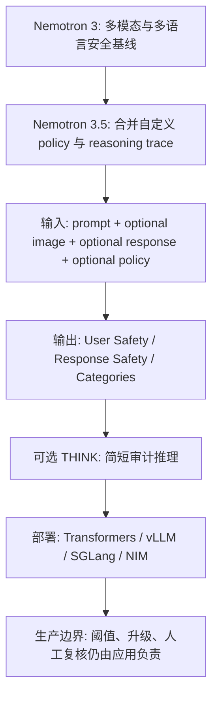
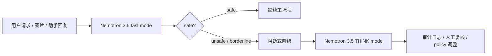
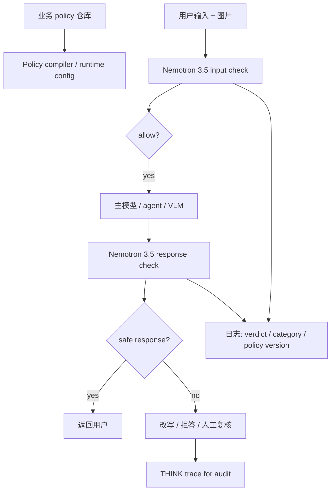

# Nemotron 3.5 Content Safety：把多模态安全、企业自定义策略和审计推理合进一个 Guard 模型

> 研究者精读 · AI 安全相关

**来源**：[Hugging Face Blog: Nemotron 3.5 Content Safety](https://huggingface.co/blog/nvidia/nemotron-3-5-content-safety)  
**模型卡**：[nvidia/Nemotron-3.5-Content-Safety](https://huggingface.co/nvidia/Nemotron-3.5-Content-Safety)  
**数据集**：[nvidia/Nemotron-3.5-Content-Safety-Dataset](https://huggingface.co/datasets/nvidia/Nemotron-3.5-Content-Safety-Dataset)  
**发布时间**：2026-06-04  
**模型日期**：2026-06-02  
**分类**：AI 安全相关  
**标签**：Nemotron、content-safety、multimodal-safety、guard-model、custom-policy、reasoning-trace、Aegis

## TL;DR

- **这篇发布做什么**：NVIDIA 发布 `Nemotron 3.5 Content Safety`，把用户输入、可选图片、可选助手回复和可选企业自定义 policy 放进同一次安全判定；模型输出 `safe/unsafe`、违规类别，并可在 THINK mode 下输出简短推理痕迹。
- **它怎么做**：模型以 `Gemma-3-4B-it` 为底座，经 NVIDIA 在多模态、多语言、推理型安全数据上 LoRA 微调；最终权重合回 4B 模型，面向 Transformers、vLLM、SGLang 和 NVIDIA NIM 部署。
- **关键机制**：3.5 相比 Nemotron 3 的核心增量不是单一 benchmark 分数，而是四个工程接口同时成立：统一多模态上下文、12 种显式训练语言与约 140 种零样本迁移、自定义策略注入、可审计但可关闭的 reasoning trace。
- **证据和数字**：官方报告约 **85%** 多模态/多语言综合 harmful-content classification accuracy；Multilingual Aegis 上约 **96.5%**，RTP-LX 上约 **88.8%**，二者合并平均约 **92.7%**；默认非 THINK 模式延迟相对 Nemotron 3 不变，图 4 宣称相对另一个多模态安全模型端到端延迟低 **3x**。
- **训练与数据**：模型卡写明 4B 参数、128K context、SigLIP vision encoder、LoRA rank 16、5 epochs、learning rate 0.0001、alpha 32；公开数据集约 **98,316** 行，含约 **88.7k** train、**4.81k** validation、**4.81k** test，约 **70k** text-only 和 **28k** image-referenced 记录。
- **局限**：官方图表多处标注 internally evaluated；真实生产仍需要企业自己的黄金集、阈值、升级路径和人工复核；THINK trace 增加延迟，且推理痕迹不是合规证明本身；多模态安全评测仍受真实图片授权和 benchmark 覆盖不足限制。

## 这篇发布真正关心的问题

### 它不是又一个简单 moderation API

NVIDIA 这次发布要解决的问题可以拆成四层：

1. **输入形态变复杂**：现代 AI 产品不只接收文本，还接收图片、截图、文档扫描件、图表和多轮上下文。
2. **风险从单点变成交互**：一段文字本身可能安全，一张图本身也可能安全，但二者组合后可能构成违规请求。
3. **企业 policy 不统一**：金融、医疗、儿童教育、开发者工具和内部知识库对风险类别的容忍度不同。
4. **安全判定需要可解释**：企业不只想知道被拦截，还需要知道为什么被拦截、哪个 policy 版本触发、是否值得人工复核。

这决定了 Nemotron 3.5 的定位：

| 传统内容安全模型 | Nemotron 3.5 想覆盖的形态 |
|---|---|
| 多为英文文本分类器 | 文本、图片、用户请求、模型回复合并判断 |
| 输出一个类别或分数 | 输出用户安全、回复安全、类别和可选推理 |
| 安全 taxonomy 固定 | 可在推理时传入自然语言 policy |
| 常作为外围过滤器 | 可作为输入治理、输出验证和审计证据的一部分 |

### 为什么这是 AI 安全问题，而不是只属于内容审核

从 AI 安全视角看，guard model 的难点不在“有无分类器”，而在分类器是否能跟真实系统边界对齐：

- **对齐对象**：不仅是模型输出，也包括用户输入、检索内容、工具返回、图片上下文和产品 policy。
- **部署位置**：既可能在生成前拦截，也可能在生成后评分，还可能作为人工复核队列的证据生成器。
- **失败代价**：误杀会损害可用性，漏判会造成合规、品牌、安全和法律风险。
- **演化速度**：攻击样式、业务规则和监管要求都会变化，单一静态 taxonomy 很快不够用。

因此，Nemotron 3.5 的研究意义在于：

> 它把“内容安全”从固定标签分类，推进到“可组合上下文 + 可注入 policy + 可审计判定”的生产安全接口。

## 作者的论证路线

### 从 Nemotron 3 到 Nemotron 3.5：增量在哪里

官方博客的论证顺序很清楚：

1. 先回顾 Nemotron 内容安全栈从英文文本分类器演进到多模态、多语言模型。
2. 再说明 Nemotron 3.5 把几个原本分散的能力合到一次推理调用中。
3. 然后逐项解释新增能力：多模态统一判定、全球语言覆盖、自定义 policy、THINK mode、安全数据集。
4. 最后用模型卡、训练数据、benchmark 和部署方式说明它不是概念 demo，而是可实际接入的模型。

可以把这条路线写成：



### 这条路线的核心 claim

| Claim | Mechanism | Evidence | Boundary |
|---|---|---|---|
| 单模型可以处理多模态安全上下文 | prompt、image、response 合为一个 context | Figure 1 的多 benchmark 平均约 85% | 官方内部评测，不等于所有生产分布 |
| 多语言安全不能只靠英文模型迁移 | 12 语言显式训练 + Gemma 3 基座迁移 | Aegis 约 96.5%，RTP-LX 约 88.8% | 约 140 语言是零样本泛化，不是每种语言都有同等证据 |
| 企业需要可注入 policy | 推理时传入自然语言 policy specification | 模型卡给出 custom_policy 调用路径 | policy 文本质量、版本控制、冲突解决仍需外部系统 |
| 审计需要推理痕迹 | THINK mode 输出简短 reasoning trace | 训练中用大模型生成并压缩 trace | trace 不是事实证明，也会增加 latency |
| 安全数据需要开放 | 发布约 98k 行数据集 | dataset card 给出 split、格式、图像处理方法 | 真实图片授权限制导致部分图像只保留链接 |

## 机制一：统一多模态判定

### 输入不是三个独立样本

Nemotron 3.5 的接口不是分别评估：

- 用户文本是否安全；
- 图片是否安全；
- 助手回复是否安全。

它试图评估一个组合上下文：

$$
V = f_{\theta}(u, i, r, p)
$$

变量含义：

| 符号 | 含义 |
|---|---|
| $u$ | user prompt，即用户请求 |
| $i$ | optional image，可为空 |
| $r$ | optional assistant response，可为空 |
| $p$ | optional custom policy，可为空 |
| $V$ | 安全判定，包括 user safety、response safety、categories、可选 trace |

这个形式重要，因为很多风险只在组合后出现：

- 用户说“怎么打开这个”，图片显示的是药柜、枪柜、锁具或门禁。
- 用户请求看似中性，但助手回复补出了违法步骤。
- 图片看似普通，但文本把图像对象转化为攻击目标。
- 同一内容在儿童产品和开发者工具里触发不同 policy。

### 为什么统一判定比独立打分更接近真实风险

独立打分常见失败模式：

| 失败模式 | 独立打分为什么容易错 | 统一上下文为什么有价值 |
|---|---|---|
| 跨模态隐含违规 | 图片或文本单看都不完整 | 模型可把图像对象和文本意图合并 |
| 回复安全与请求安全分离 | 用户请求危险但模型拒答安全 | 同时输出 user safety 与 response safety |
| 产品规则不同 | 固定 taxonomy 不知道业务语境 | custom policy 让推理时可带领域约束 |
| 审计缺证据 | 只有标签难以复盘 | THINK trace 可说明触发路径 |

这也是它和“文本 moderation classifier”的根本区别：

- 文本 classifier 更像一个局部阈值器。
- Nemotron 3.5 更像一个小型安全裁决器。
- 但裁决器不等于 policy engine；它只给 verdict，执行动作仍在应用侧。

## 机制二：12 语言显式覆盖与跨语言迁移

### 官方给出的语言边界

官方博客说，Nemotron 3.5 维持 12 种显式训练语言：

| 语言组 | 语言 |
|---|---|
| 欧洲语言 | English、French、Spanish、German、Portuguese、Italian、Russian |
| 亚洲语言 | Chinese、Japanese、Korean、Hindi |
| 中东语言 | Arabic |

模型卡还列出了 Thai、Dutch 等支持项；博客强调 Gemma 3 基座带来约 140 语言的零样本迁移。

这里需要区分两层证据：

1. **显式训练语言**：有训练数据或适配目标，可信度更高。
2. **零样本语言**：来自基座模型泛化能力，必须在具体地区和业务样本上验证。

### 为什么多语言安全不能只看平均分

多语言安全的风险不是“翻译一下就行”：

- 有些安全类别在不同文化语境中表达方式不同。
- 政策术语、药品名称、金融诈骗话术、俚语和隐喻会跨语言漂移。
- 英文 benchmark 上的安全边界可能无法覆盖低资源语言的真实绕过方式。

因此，Nemotron 3.5 的多语言 claim 应该这样读：

| 可直接采信 | 需要谨慎外推 |
|---|---|
| 12 语言 benchmark 上有官方数字 | 约 140 语言可迁移不等于同等准确 |
| Aegis 和 RTP-LX 显示较高平均表现 | 企业私有术语、方言、黑话仍需本地黄金集 |
| 4B 模型便于多次调用 | 低资源语言的漏判成本不能只靠公开图表估计 |

## 机制三：自定义 policy enforcement

### 这可能是 3.5 最重要的产品化增量

固定 taxonomy 的问题是：

- 它把所有产品放进同一套安全类别。
- 它难以表达行业特定规则。
- 它很难处理“同一词在不同业务中意义不同”的场景。

Nemotron 3.5 允许在推理时传入自定义 policy specification，让模型根据这个 policy 解释输入与输出。

一个抽象接口可以写成：

```text
Input:
  prompt: 用户请求
  image: 可选图片
  response: 可选助手回复
  custom_policy: 自然语言定义的允许/禁止行为

State:
  built_in_taxonomy: Aegis 2.0 / MLCommons aligned categories
  policy_context: 业务自定义规则

Output:
  user_safety: safe | unsafe
  response_safety: safe | unsafe | omitted
  categories: violated categories
  reasoning_trace: optional concise trace
```

### 自定义 policy 的关键不是“更灵活”，而是“责任回到组织”

这点很重要：

- 模型支持自定义 policy，不代表企业自动合规。
- 企业仍需要定义、评审、版本化和测试 policy。
- 模型输出必须映射到 block、allow、rewrite、escalate、human review 等动作。

更具体地说，生产系统至少需要这些外部控制：

| 外部控制 | 为什么模型本身不能替代 |
|---|---|
| policy 版本管理 | 需要知道哪次判定用了哪个规则 |
| 阈值和处置策略 | 模型只输出 verdict，业务决定动作 |
| 人工复核队列 | 边界样本需要人类判断 |
| 回归测试集 | 每次 policy 或模型升级都要测试 |
| 争议和申诉流程 | 安全模型不能自己处理用户争议 |

第三方生产评估也强调这一点：Nemotron 3.5 更适合作为输入治理和输出验证层，而不是合规证明本身。

## 机制四：THINK mode 与可审计推理

### THINK mode 解决什么

普通 guard model 的输出通常是：

```text
User Safety: unsafe
Response Safety: unsafe
Safety Categories: ...
```

这个输出足够快，但不够解释：

- 审核员不知道模型为什么判 unsafe。
- policy 作者不知道规则文本是否被模型按预期理解。
- 合规人员难以把单次判定变成可复盘证据。

THINK mode 增加一个简短推理痕迹：

```text
Reasoning trace:
  1. 检查用户请求是否触发 policy。
  2. 检查助手回复是否提供可执行违规步骤。
  3. 如果图片改变语境，则合并判断。
  4. 输出最终安全标签和类别。
```

### 训练 trace 的两阶段压缩

官方材料提到，推理痕迹不是简单把长链路原样保留，而是两步生成：

1. 用更大的教师模型生成推理痕迹。
2. 再用另一个大模型压缩成更短的解释，目标是降低输出 token 和延迟。

这条设计有两个好处：

- **训练信号更明确**：模型不只学标签，还学“为什么这个标签成立”。
- **部署更现实**：trace 如果太长，会让同步 moderation 路径不可用。

也有两个边界：

- **trace 可能合理但不真实**：它是模型生成的解释，不是可独立验证的因果日志。
- **trace 会带来延迟**：官方建议在延迟敏感路径关闭 THINK，在审计或复核路径开启。

### 生产上更合理的双路径



这比“所有请求都开 THINK”更实际：

- 高频低风险路径保持低延迟。
- 高风险或争议路径保留解释。
- policy 迭代能利用 trace 找到误杀和漏判模式。

## 模型结构与训练设置

### 模型卡里的工程细节

| 项目 | 值 |
|---|---|
| Developer | NVIDIA Corporation |
| Base model | Google Gemma-3-4B-it |
| 参数规模 | 4B |
| 架构 | decoder-only Transformer |
| Vision encoder | SigLIP |
| 图像尺寸 | 896 x 896 |
| Context length | up to 128K |
| 微调方式 | LoRA，最终合回主模型 |
| LoRA rank | 16 |
| LoRA alpha | 32 |
| epochs | 5 |
| learning rate | 0.0001 |
| optimizer | AdamW |
| runtime | Transformers、vLLM、SGLang |
| 硬件示例 | RTX PRO 6000 BSE、H100、A100 |

这些细节说明它不是大型闭源评估器，而是一个可以多次调用的 4B guard model。

### 为什么 4B 尺寸对安全模型重要

内容安全模型常常被部署在多个位置：

- 用户输入进入主模型前；
- 检索结果进入上下文前；
- 助手回复返回用户前；
- 工具调用执行前后；
- 事件进入人工复核前。

如果 guard model 太大，每一步调用都会变成成本瓶颈。

因此，4B 模型的价值不是“能力最强”，而是：

| 需求 | 4B guard model 的意义 |
|---|---|
| 高频调用 | 单次成本较低 |
| 多路径接入 | 可在输入、输出、异步审计多处使用 |
| 私有部署 | 更容易在企业 GPU 或 NIM 上运行 |
| 低延迟 | fast mode 适合同步请求路径 |
| 可定制 | custom policy 把部分规则从模型训练转到推理输入 |

## 训练数据：真实、多模态、推理与合成数据的混合

### 数据来源拆解

官方博客和模型卡列出的训练数据可以分成几类：

| 数据类型 | 作用 |
|---|---|
| Nemotron Safety Guard Dataset v3 | 多语言文本安全数据 |
| NVIDIA 人工标注多模态数据 | 真实图片与安全标签 |
| Nemotron VLM Dataset v2 | 扫描文档、图表、论文、图示等安全样本 |
| reasoning traces | 教模型如何解释安全判定 |
| CantTalkAboutThis | topic-following 与 policy-specification verdict |
| synthetic data | 补充 jailbreak、罕见违规、多模态对抗样本 |

这里最值得注意的是：

- 官方强调 99% 训练图片是真实照片，而不是合成图片。
- 公开数据集仍受授权限制，部分真实图片不能直接随数据集再分发。
- 合成数据约占训练量 10%，主要用于补足稀有和对抗分布。

### 公开数据集的规模与格式

| 指标 | 数字 |
|---|---|
| 总行数 | 98,316 |
| train | 约 88.7k |
| validation | 约 4.81k |
| test | 约 4.81k |
| text-only | 约 70k |
| image-referenced | 约 28k |
| parquet 存储 | dataset viewer 显示优化 parquet |
| 总文件大小 | dataset card 显示 3.97 GB |
| dataset creation date | 2026-06-02 |
| license | CC-BY-4.0 |

数据集本身也提醒使用者：

- 它包含不安全请求和有害回复，不能直接面向普通用户展示。
- 合成记录和生成式 reasoning trace 应向下游披露。
- 真实图片部分需要通过 Wikimedia 或 tarball 解析到本地。

### 数据集为什么重要

很多开源安全模型只发布权重，不发布训练或评估数据。

这会带来三个问题：

1. 研究者难以复核模型究竟学了什么。
2. 企业难以构建回归测试和对照实验。
3. 多模态安全尤其难，因为真实图片授权常常阻碍公开数据集。

Nemotron 3.5 发布数据集的意义在于：

- 给安全研究者一个可检查的数据起点；
- 让企业能建立自己的 regression suite；
- 暴露多模态安全数据构建的真实约束；
- 让 benchmark gap 不再只是口号，而能落到样本来源和授权问题上。

## Benchmark 与图表证据

### Figure 1：综合多语言和多模态 benchmark


Figure 1 的作用是给出整体位置判断：

- Nemotron 3.5 在多个多语言、多模态安全 benchmark 上平均约 85%。
- 对比对象包括 Qwen3Guard、Llama-Guard3 Vision、Llama-Guard4、OpenAI Omni、Granite Guardian 等。
- benchmark 横跨 PolyGuard、RTPLX、Multijail、XSafety、Aya Redteaming、Multilingual Aegis、LinguaSafe、VLGuard、MM-SafetyBench。

这张图能支持的结论：

| 能支持 | 不能直接支持 |
|---|---|
| Nemotron 3.5 是一个强开源/开放可用安全模型候选 | 它在任何企业场景都优于闭源审核系统 |
| 多模态、多语言评测覆盖较宽 | 每个 benchmark 都有公开可复现细节 |
| 4B 模型能达到较高平均 accuracy | 所有低资源语言和行业黑话都安全 |

### Figure 2：Multilingual Aegis 上的 12 语言表现


Figure 2 的关键信息：

- 官方标注平均约 97%，正文给出 Multilingual Aegis 平均约 96.5%。
- 语言覆盖 12 类，图中包括 English、Arabic、German、Spanish、French、Hindi、Japanese、Thai、Chinese、Italian、Dutch、Korean。
- 这张图强调的不是单一英文高分，而是跨语言稳定性。

研究者需要追问：

- Aegis 的类别是否覆盖企业真实 policy？
- 每种语言样本量是否足以代表本地风险？
- 文化语境、俚语、混合语言和代码切换是否被充分覆盖？

### Figure 3：RTP-LX 上的跨语言表现


Figure 3 的作用是补充另一套跨语言安全评测：

- 官方正文给出 RTP-LX 平均约 88.8%。
- 它低于 Aegis 平均值，说明不同 benchmark 的难度和样本分布不同。
- 这提醒我们不要只拿最高图表做结论。

一个更稳妥的读法是：

$$
S_{prod} \neq S_{Aegis} \neq S_{RTP-LX}
$$

变量解释：

| 符号 | 含义 |
|---|---|
| $S_{prod}$ | 企业生产分布下的安全表现 |
| $S_{Aegis}$ | Aegis 对齐 taxonomy 下的 benchmark 表现 |
| $S_{RTP-LX}$ | RTP-LX 下的跨语言表现 |

结论：

- benchmark 是筛选模型的起点；
- 不是上线阈值；
- 更不是替代生产 golden set 的证据。

### Figure 4：延迟证据


Figure 4 说明端到端延迟随 concurrency 增加的趋势：

- 绿色线代表 Nemotron 3.5。
- 灰色线代表另一多模态安全模型。
- 官方图注宣称端到端延迟低 3x。

这张图最有用的地方不是绝对毫秒数，而是生产启发：

- guard model 会被重复调用；
- concurrency 上升时延迟曲线很关键；
- THINK mode 应该与 fast mode 分离预算；
- 若安全模型比主模型还慢，生产团队会绕过它。

## 和其他 guardrail 方式的关系

### 它不是替代全部安全系统

Nemotron 3.5 更适合作为一个模型层安全判定器。

它不替代：

- policy authoring；
- app-level allow/block rules；
- 人工审核；
- 日志和审计系统；
- abuse monitoring；
- red team；
- incident response；
- 法务和合规解释。

一个合理的系统边界是：



### 和 API-native moderation 的区别

很多云模型服务会提供内置 moderation 或 inline safety score。

Nemotron 3.5 的区别：

| 维度 | API-native moderation | Nemotron 3.5 |
|---|---|---|
| 部署 | 跟特定 API 绑定 | 可自托管、HF、NIM 或第三方推理 |
| 输入 | 通常服务内文本/响应 | prompt、图片、response、自定义 policy |
| 控制 | 服务商规则更多 | 企业可传 policy、记录模型版本 |
| 适用模型 | 主要管本 API 的输入输出 | 可管多模型、多供应商、多路径 |
| 风险 | 供应商黑盒 | 仍需验证，但可控性更强 |

这也是为什么它对 Agent 安全有意义：

- Agent 可能使用多个模型；
- Agent 会看截图、网页、文档和工具输出；
- Agent 的风险取决于输入、工具、回复和动作组合；
- 独立 guard model 更容易放在 orchestration 层。

## 失败模式与局限

### Benchmark gap 仍然存在

官方博客自己也承认多模态安全评测有结构性缺口：

- 很多经典 safety benchmark 仍是 text-only。
- 多模态 benchmark 常用合成图像。
- 真实生产图片受授权约束，难以开放复现。
- 文化细节、地区法规、图文组合攻击很难穷尽。

因此，Nemotron 3.5 的公开数字更像：

| 证据类型 | 价值 | 局限 |
|---|---|---|
| 官方 benchmark | 证明模型有宽覆盖能力 | internally evaluated，细节需复核 |
| 模型卡训练参数 | 说明模型可部署和可复查 | 不提供完整训练流水线 |
| 公开数据集 | 便于测试和二次研究 | 图像授权与合成数据 artifacts 仍在 |
| custom policy | 更接近企业需求 | policy 质量决定最终效果 |
| THINK trace | 便于审计和调试 | 不是可验证事实日志 |

### Custom policy 的失败边界

自定义 policy 可能引入新的问题：

- policy 写得太宽，导致误杀；
- policy 写得太窄，导致漏判；
- policy 内部条款冲突；
- policy 与 built-in taxonomy 冲突；
- policy 更新后没有回归测试；
- policy 文本被 prompt injection 诱导绕过。

因此，企业使用时应该至少记录：

| 字段 | 原因 |
|---|---|
| model_id | 便于定位模型版本 |
| model_revision | 便于复现实验 |
| policy_id | 便于知道使用哪套业务规则 |
| policy_hash | 防止规则被悄悄修改 |
| verdict | 安全决策结果 |
| categories | 违规类别 |
| trace_enabled | 是否使用 THINK mode |
| input_modality | 文本、图片、回复是否参与 |
| final_action | allow、block、rewrite、review |

### Reasoning trace 的失败边界

THINK trace 容易被过度解读。

更准确的说法是：

- 它有助于审核员理解模型判定；
- 它有助于 policy 作者调试规则；
- 它有助于审计日志形成上下文；
- 但它不是模型内部真实因果过程；
- 也不是监管或法律层面的最终证明。

如果 trace 与 verdict 不一致，应优先视为模型输出需要复核，而不是选择性相信其中一项。

## 研究者视角的领域延伸

### 对 AI 安全：guard model 正在从分类器变成控制接口

过去的 guardrail 常是：

- 输入分类；
- 输出分类；
- 固定类别；
- 单一模型供应商内置。

Nemotron 3.5 代表的方向是：

- 上下文组合；
- policy 注入；
- 多模态；
- 可审计 trace；
- 可自托管；
- 可接入多模型栈。

这让 guard model 更像控制接口，而不是旁路工具。

后续值得追问：

- Guard model 能否承受 adversarial prompt 对 custom policy 的攻击？
- 多模态图文组合攻击是否需要专门 red-team benchmark？
- THINK trace 会不会泄露 policy 细节，反而帮助攻击者绕过？
- 当多个 guardrail verdict 冲突时，哪个系统拥有最终裁决权？

### 对 Agent：安全判定必须覆盖动作前后

Agent 场景里，安全问题不仅是文本回复。

它还包括：

- 工具调用参数是否危险；
- 浏览器页面是否诱导模型执行高风险操作；
- 文件或截图里是否包含敏感信息；
- 执行动作前是否需要 human approval；
- 工具返回内容是否改变原始请求的安全语义。

Nemotron 3.5 的多模态与 response safety 能覆盖部分问题，但还不够：

| Agent 风险 | Nemotron 3.5 可帮助 | 仍需额外系统 |
|---|---|---|
| 用户请求危险 | prompt safety | 意图澄清、身份权限 |
| 截图含敏感信息 | image-aware moderation | DLP、权限控制 |
| 助手回复危险 | response safety | 自动改写、拒答策略 |
| 工具调用危险 | 可把参数转文本检查 | capability sandbox、approval gate |
| 任务中途被诱导 | 可做阶段性检查 | policy-aware planner、状态审计 |

### 对后训练：安全数据正在变成可训练经验

Nemotron 3.5 数据集里最值得注意的是 reasoning trace 和 topic-following 数据。

这提示后训练方向的一个趋势：

- 安全不再只是输出层拒答模板；
- 它会进入训练数据、推理格式、policy-following 和审计输出；
- 模型需要学习“按规则判断”，而不只是“遇到危险词拒绝”。

可以把 guard model 后训练写成：

$$
\mathcal{D}_{safe} = \{(u, i, r, p, y, c, \tau)\}
$$

变量解释：

| 符号 | 含义 |
|---|---|
| $u$ | 用户输入 |
| $i$ | 图片或视觉上下文 |
| $r$ | 助手回复 |
| $p$ | policy specification |
| $y$ | safe/unsafe 标签 |
| $c$ | 违规类别 |
| $\tau$ | 简短 reasoning trace |

这类数据让模型学习的不只是分类边界，还有 policy interpretation。

## 结论与继续追问

### 本文最值得带走的判断

- Nemotron 3.5 Content Safety 的核心价值不是 4B、不是单张 benchmark 图，而是把多模态输入、助手回复、自定义 policy 和审计推理合并成一个可部署 guard model 接口。
- 官方数字显示它在多语言和多模态 harmful-content classification 上有较强表现；Aegis 约 96.5%、RTP-LX 约 88.8%、综合约 85% 是本轮最关键的证据。
- 公开数据集约 98k 行，包含 text-only 与 image-referenced 样本，这对开源安全模型复核和回归测试有实际价值。
- 真正上线时，企业仍必须自己做 policy 版本化、黄金集评测、阈值决策、人工复核和 incident response。
- THINK trace 适合审计和调试，不应被当成事实证明；延迟敏感链路应优先 fast mode，高风险样本再进入 trace 路径。

### 还需要继续追问的问题

1. **可复现性**：官方 benchmark 图是否会发布完整评测脚本、prompt、阈值和样本映射？
2. **低资源语言**：约 140 种零样本语言在真实地区样本上的误杀/漏判如何？
3. **Policy injection**：用户能否通过输入影响 custom policy 的解释边界？
4. **Trace 安全**：reasoning trace 是否可能暴露防护逻辑，帮助攻击者调整绕过策略？
5. **Agent 动作安全**：如何把 tool call、file diff、browser action 结构化成 Nemotron 可判定的安全上下文？
6. **多 guard 冲突**：当 Nemotron、API-native moderation、业务规则和人工审核给出不同结论时，最终 arbitration 机制是什么？

### 最后一句话

Nemotron 3.5 Content Safety 不是“安全问题已经解决”的证据；它更像一个把多模态安全判定、企业策略和审计输出合并到同一推理接口的基础模块。真正的研究价值在于，它让 AI 安全系统可以围绕可版本化 policy、可复核数据和可部署 guard model 重新组织，而不是继续把内容安全当成主模型外面的一层英文文本过滤器。

## 参考来源

- Hugging Face Blog: Nemotron 3.5 Content Safety: Customizable Multimodal Safety for Global Enterprise AI
- Hugging Face Model Card: nvidia/Nemotron-3.5-Content-Safety
- Hugging Face Dataset Card: nvidia/Nemotron-3.5-Content-Safety-Dataset
- NVIDIA-NeMo GitHub: Nemotron 3.5 Content Safety usage cookbook
- NVIDIA-NeMo GitHub: nemotron-policy-generator skill
- Production AI Institute: What Nemotron 3.5 Content Safety Changes for Production AI Teams
