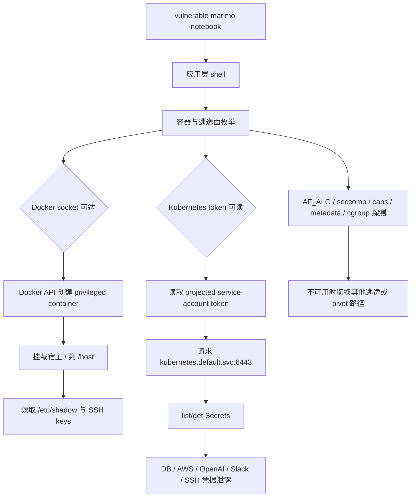

# Sysdig：从 marimo RCE 到容器逃逸与 Kubernetes Secret 倾倒

> 研究者精读 · 这篇博客的重点不是“AI 发明了新逃逸技术”，而是 Sysdig 观测到疑似 LLM harness 把已知云原生弱点串成了机器速度的后渗透链条。

| 字段 | 内容 |
|---|---|
| 原文 | [Agentic threat actor hits the orchestration plane](https://www.sysdig.com/blog/agentic-threat-actor-hits-the-orchestration-plane-ai-agent-driven-container-escape) |
| 作者 | Sysdig Threat Research Team / Michael Clark |
| 发布时间 | 2026-06-04 |
| 入口漏洞 | vulnerable marimo notebook / CVE-2026-39987 |
| 观测时间 | Sysdig 称 2026-05-29 观测到该活动 |
| 相关背景 | [AI agent at the wheel](https://www.sysdig.com/blog/ai-agent-at-the-wheel-how-an-attacker-used-llms-to-move-from-a-cve-to-an-internal-database-in-4-pivots)、[marimo CVE update](https://www.sysdig.com/blog/cve-2026-39987-update-how-attackers-weaponized-marimo-to-deploy-a-blockchain-botnet-via-huggingface) |

## 一句话结论

Sysdig 报告的攻击链是：攻击者利用 vulnerable marimo notebook 拿到执行入口后，枚举容器环境、Docker socket、kernel / namespace / Kubernetes token 等逃逸面；随后借助可达 Docker socket 创建 privileged container，挂载宿主根目录读取凭据；最后重放 pod 内 service-account token 到 Kubernetes API，list/get namespace Secrets，拿到数据库、AWS、OpenAI API、Slack webhook、SSH keys 等材料。

真正的新意不在每个单点技术，而在操作方式：

- 逃逸原语是老问题：Docker socket、privileged container、host mount、service-account token、过宽 RBAC。
- 串联方式像 agent：先枚举可用面，再根据反馈选择路径，再把结果切成下一轮可解析的片段。
- 归因证据不是“速度快”这么粗，而是 canary、raw stream directive、base64 staging harness、自测、显式分隔符、重试和反馈驱动路径选择共同出现。

## 博客在回答什么问题

Sysdig 想回答的是：当 LLM agent harness 被接入真实 shell、Docker API 和 Kubernetes API 后，云原生后渗透会发生什么变化？

它不是在讨论：

- 模型是否能发明新的容器逃逸漏洞；
- marimo 漏洞本身的完整技术细节；
- 哪个模型最危险；
- LLM 是否“自主黑入一切”。

它在讨论：

- 攻击者如何从 notebook RCE 扩大到宿主机和集群控制面；
- 为什么这一条链看起来不像人类交互式操作；
- 防守方应该关注哪些行为语义，而不是只追 IP 或单条命令；
- Docker socket 和 Kubernetes token 在 agentic attacker 面前为什么会更危险。

## 事件链拆解

### Phase 1：入口不是结论，入口只是起点

marimo CVE-2026-39987 是应用层入口。Sysdig 把它放在开头，是为了说明攻击者已经有了 notebook 执行环境。

真正要看的不是 RCE 本身，而是后续动作是否扩大了安全边界：

- 从应用进程到容器边界；
- 从容器到宿主 Docker daemon；
- 从 pod 到 Kubernetes API；
- 从单个 workload 到 Secret store 和下游云资源。

### Phase 2：枚举是一张权限地图

攻击者不是直接打一条逃逸命令，而是先做环境测绘。Sysdig 展示的枚举包括：

- `/.dockerenv`、`/proc/1/cgroup`：确认容器化和 runtime 线索；
- `/var/run/docker.sock`：判断是否能直接控制宿主 Docker daemon；
- seccomp、capabilities、`core_pattern`：判断内核/命名空间方向是否有机会；
- AF_ALG：测试 Copy Fail 相关攻击面；
- Kubernetes service-account token：判断是否可进入 API server；
- cloud metadata：判断是否可转向云凭据；
- `/dev/mem` 等补充路径：测试更底层的直接内存路径。

这一步的关键是“并行枚举 + 标记输出”。攻击者用 `_SOCK_`、`_K8S_`、`_AFALG_` 等分隔符把结果切开，这更像给下一轮 agent 读的结构化 observation，而不是人类终端阅读习惯。

### Phase 3：Docker socket 是宿主级放大器

如果应用容器挂载了 `/var/run/docker.sock`，攻击者就能通过 Docker API 让宿主 daemon 代为创建容器。Sysdig 描述的路径包括：

- 使用宿主本地已有 image，减少 registry egress；
- 创建 privileged container；
- 把宿主根目录 bind mount 到容器内 `/host`；
- 共享 host PID/network/IPC namespace；
- 把宿主命令写进 container create 的 `Cmd`；
- start 后读取 logs，把输出拿回 agent。

这意味着应用容器不再只是应用边界。Docker socket mount 在这种场景下近似等于给 workload 一个宿主 root 的代理接口。

### Phase 4：宿主材料被读取

Sysdig 报告的目标材料包括：

- `/host/etc/shadow`；
- deploy 用户 SSH private key；
- root `authorized_keys`；
- `id_rsa`、`id_ed25519`、`.pem` 等密钥搜索结果；
- second-stage payload 下载与执行路径。

如果某个 bind mount 路径不可用，攻击者还会尝试 `nsenter` 进入 host namespaces。这说明它不是单条固定脚本，而是在按环境反馈切换策略。

### Phase 5：Kubernetes service-account token 变成 Secret store 入口

pod 内 token 被读取后，攻击者向 `https://kubernetes.default.svc:6443` 重放 bearer token。只要 RBAC 允许 list/get Secrets，就能直接枚举并解码 Secret data。

Sysdig 报告中出现的泄露材料包括：

- database credentials；
- AWS keys；
- OpenAI API key；
- Slack webhook；
- SSH keys。

这一步把应用层 RCE 放大成集群 Secret store 泄露。根因不是 AI，而是 workload token 可读、RBAC 过宽、Secret 权限边界没有缩小。

## Agentic 归因证据怎么读

| 证据 | 原文含义 | 强度 |
|---|---|---|
| JSON error response canary 被执行 | 攻击端把响应体里的探针当成可行动指令 | 强，说明观察流被机器消费 |
| invisible raw stream directive 被回显 | 工具读取 terminal raw byte stream，而不是人眼看到的 rendered terminal | 强，说明终端通道可能接入自动 parser |
| base64 staging harness 自测 | 先投 hello、chunked hello/world，再投真实脚本 | 中强，说明攻击端在验证工具通道可靠性 |
| 显式 section markers | 输出被 `===SHADOW===`、`_SOCK_` 等标记切开 | 中，脚本也能这么做，但很适合 agent 消费 |
| 高 retry 与按反馈换路 | 失败后改用 Docker socket、namespace 或 token replay | 中强，体现环境自适应 |

单独一条证据不足以断言 LLM agent。Sysdig 的论证强在多个信号叠加：canary 证明上下文被消费，raw stream 证明读取面不是普通人类终端，staging harness 与分隔符证明输出面向下一轮解析，反馈换路证明存在操作策略更新。

## 这篇博客能支持哪些结论

能支持：

- Sysdig 在自身遥测范围内观测到疑似 agentic operator 完成容器逃逸和 Kubernetes credential replay。
- Docker socket mount 能把应用容器 RCE 放大为宿主访问。
- pod service-account token + 过宽 RBAC 能把 workload compromise 放大为 Secret store dump。
- LLM harness 可能降低云原生后渗透链条的串联成本。
- 防守重点应放在行为语义和运行时边界，而不是只看固定 IoC。

不能支持：

- 不能说这是全球首次类似攻击，只能说 Sysdig first observed。
- 不能说 LLM 发明了新的容器逃逸技术。
- 不能说所有结构化输出都来自 LLM agent，成熟脚本也能模拟一部分行为。
- 不能从单一 Sysdig 案例推出所有云原生攻击都已经 agentic。

## 防守映射

### 立即修

- 更新 marimo 到修复版本，尤其是 terminal WebSocket authentication 相关修复。
- 禁止普通应用容器挂载 `/var/run/docker.sock`。
- 默认关闭不需要的 service-account token automount。
- 对 workload 的 RBAC 做最小化，普通业务 pod 不应 list/get Secrets。

### 运行时检测

- 容器内访问 `/var/run/docker.sock`；
- Docker API `containers/create` 搭配 `Privileged=true`、`Binds=["/:/host"]`；
- host PID/network/IPC namespace 共享；
- 容器内读取 `/var/run/secrets/kubernetes.io/serviceaccount/token`；
- pod 内直接请求 `kubernetes.default.svc:6443`；
- 非控制面 workload 短时间 list/get Secrets；
- 读取 `/etc/shadow`、SSH private keys、`.pem`；
- 命令输出大量使用固定分隔符并伴随高 retry。

### Agent 归因与 honeypot

Sysdig 的 canary 思路值得复用。防守方可以在受控响应、错误消息、工具输出或 terminal stream 中植入不会影响人类操作的探针，看对端是否把 hidden / raw context 当成指令执行。

这类方法比“命令很快所以是 AI”更稳，因为它直接测试观察流是否被自动系统消费。

## 与 Anthropic LLM ATT&CK Navigator 的关系

Anthropic 的 Navigator 说高风险 actor 的区别越来越不在技术数量，而在 agentic scaffolding。Sysdig 这个案例是一个云原生版本的实证样本：

- 技术项本身都能落到传统 ATT&CK / cloud TTP；
- 真正危险的是模型可能把枚举、逃逸、凭据、API replay 串成快速闭环；
- 这类 orchestration 还没有很好地被传统 taxonomy 表达。

## 还要继续追问

1. Sysdig 是否会发布对应 Falco rules 或更完整 behavior mapping。
2. marimo CVE-2026-39987 的公开暴露面是否继续扩大。
3. canary / raw stream 归因方法能否在 notebook、CI runner、terminal、agent sandbox 中跨平台复现。
4. 攻击者是否会扩展到 containerd socket、Kubelet API、CI/CD runner socket、cloud workload identity。
5. Kubernetes 默认配置和平台产品是否会更激进地收紧 service-account token 和 Secret 权限。
6. 行业是否需要一个“AI-assisted cloud post-exploitation”行为分类，而不是只把它塞进一般容器逃逸。

## 阅读定位

这篇博客应该作为云原生运行时安全和 Agent 安全之间的桥梁来读。容器逃逸、Docker socket、Kubernetes token 都是老风险；LLM agent 的作用是让它们更容易被动态串联。对防守方来说，最重要的不是识别“AI 味”，而是切断可被 agent 串起来的权限放大路径。

打开原文：[Sysdig: Agentic threat actor hits the orchestration plane](https://www.sysdig.com/blog/agentic-threat-actor-hits-the-orchestration-plane-ai-agent-driven-container-escape)
