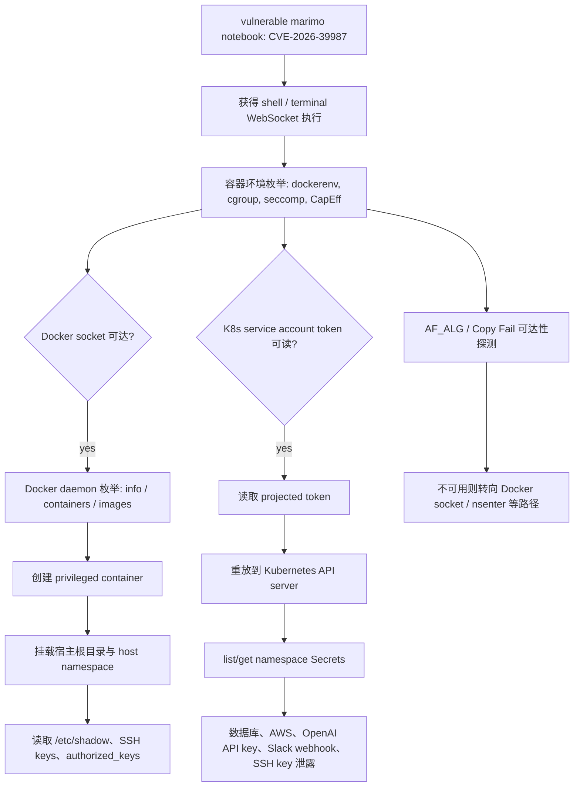
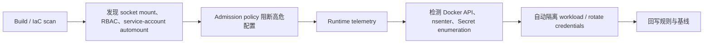

# Sysdig 观测到 Agentic 攻击者进入容器与编排平面：从 marimo RCE 到 Docker Socket 逃逸和 Kubernetes Secret 倾倒

## 元信息与 TL;DR

- 原文：[Agentic threat actor hits the orchestration plane: AI agent-driven container escape](https://www.sysdig.com/blog/agentic-threat-actor-hits-the-orchestration-plane-ai-agent-driven-container-escape)
- 发布：Sysdig Threat Research Team，Michael Clark，2026-06-04。
- 分类：AI 安全 / AI for Security，重点是 LLM agent 驱动的真实世界云原生后渗透。
- 相关前文：[AI agent at the wheel](https://www.sysdig.com/blog/ai-agent-at-the-wheel-how-an-attacker-used-llms-to-move-from-a-cve-to-an-internal-database-in-4-pivots)，2026-05-26，解释同一 marimo 漏洞链条中更早的 AWS credential pivot。
- 漏洞背景：[marimo CVE-2026-39987 update](https://www.sysdig.com/blog/cve-2026-39987-update-how-attackers-weaponized-marimo-to-deploy-a-blockchain-botnet-via-huggingface)，用于确认入口不是“AI 新漏洞”，而是 notebook 终端暴露带来的应用层 RCE。


### TL;DR

- **这篇做什么**：Sysdig TRT 报告称，2026-05-29 观测到一个攻击者利用 vulnerable marimo notebook（CVE-2026-39987）后，由 LLM harness 驱动完整后渗透链条，进入容器、宿主机和 Kubernetes 编排平面。
- **怎么做**：攻击流程先枚举容器上下文、Docker socket、seccomp、capabilities、AF_ALG、Kubernetes service account token 与 cloud metadata；再把可达 Docker socket 当成逃逸原语，创建 privileged container 挂载宿主根文件系统；随后读取宿主凭据并重放 pod 内 service-account token 访问 Kubernetes API。
- **关键证据**：Sysdig 给出两类 agentic 归因信号：攻击端会解析 JSON error response 中埋入的 canary 指令，也会回显 terminal raw byte stream 中的不可见 escape-sequence 指令；同时命令流呈现 base64 分块投递、一次性自测 staging harness、显式分隔符、重试和按反馈改写下一步的结构。
- **关键数字**：文章日期是 2026-06-04；事件发生在 2026-05-29；同系列 2026-05-26 前文中，早期链条曾在不到 1 小时内从 marimo RCE 走到内部 PostgreSQL 数据库倾倒，bastion 阶段不到 2 分钟完成 schema 与内容读取。
- **为什么重要**：这不是新的容器逃逸技巧，而是“agentic operator 把已知云原生攻击原语自动串联”的证据。风险从“有人发现 Docker socket 后慢慢手工横向移动”，变成“模型驱动 harness 在一次会话里并行探测、选择逃逸路径、读取 Secret store”。
- **局限**：证据主要来自 Sysdig 自家遥测与威胁研究叙事；“first observed”只代表 Sysdig TRT 的观测范围；自动化与 LLM agent 的边界也需要谨慎，因为成熟脚本同样能做一部分格式化输出、重试和 token replay。

## 来源与材料地图

### 本轮读取的公开材料

| 材料 | 日期 | 本文用途 |
|---|---:|---|
| Sysdig 6 月 4 日主文 | 2026-06-04 | 主证据：container escape、Kubernetes token replay、agentic signature、IoC 与建议 |
| Sysdig 5 月 26 日前文 | 2026-05-26 | 对照：同一 marimo 漏洞族从 AWS credential pivot 扩展到 orchestration plane |
| Sysdig CVE-2026-39987 update | 2026 年内 | 背景：marimo 入口、被武器化方式和 patch 方向 |
| Anthropic LLM ATT&CK Navigator | 2026-06-03 | 横向参照：本周已有 AI-enabled cyber threat 的分类框架，但该条已在上一轮日报写入，不重复 |
| Kubernetes / Docker 常识性安全边界 | 长期背景 | 用于解释为什么 Docker socket 与 service-account token 是关键放大器 |

### 为什么选择 Sysdig 而不是重复 Anthropic

- Anthropic 的 LLM ATT&CK Navigator 已经进入 public 数据：
  - `canonical_url=https://red.anthropic.com/2026/attack-navigator/`
  - 该条聚焦 832 起公开报告、13,873 个观测、MITRE ATT&CK 映射。
- Sysdig 这篇是不同类型证据：
  - 不是年度映射或分类框架；
  - 是具体入侵链条；
  - 细节落在容器逃逸、Docker daemon、Kubernetes RBAC 和 Secret store；
  - 更适合补齐“AI cyber threat 从侦察/凭据重放进入云原生控制面”的本周观察。

## 背景：这不是“AI 发明容器逃逸”，而是“AI 降低串联成本”

### 传统脚本、人工攻击者和 LLM agent 的区别

| 维度 | 人工交互 | 预写脚本 | LLM agent harness |
|---|---|---|---|
| 探测方式 | 逐条命令试探 | 固定顺序枚举 | 批量枚举后按反馈改写下一步 |
| 输出格式 | 面向人眼阅读 | 面向日志或文件 | 面向下一轮模型解析 |
| 失败处理 | 人工判断 | 硬编码 fallback | 根据 observation 选择替代原语 |
| 成本结构 | 人工时间 | 脚本开发时间 | 推理预算与工具调用预算 |
| 检测难点 | 操作慢但语义灵活 | 指纹稳定 | 行为目标稳定但命令形状易变 |

Sysdig 文章真正值得读的点在这里：攻击者没有展示新的 Docker daemon 漏洞，也没有提出新的 Kubernetes API bypass。它展示的是：

- 已知弱配置组合可以被 agentic harness 快速组合；
- 每个阶段的输出都被整理成“下一轮模型容易消费”的结构；
- 攻击链不需要对目标提前写好完整 playbook；
- 一旦环境暴露 Docker socket 或过宽 RBAC，应用层 RCE 会被放大成宿主机与集群 secret store 泄露。

### 风险公式：为什么一个 notebook RCE 会变成集群级事件

可以把本案风险写成一个简单乘法模型：

$$
R_{\text{cluster}} = E_{\text{app}} \times S_{\text{socket}} \times P_{\text{privileged}} \times K_{\text{token}} \times B_{\text{rbac}} \times A_{\text{agent}}
$$

变量解释：

- $E_{\text{app}}$：互联网可达应用入口是否存在 RCE，例如 vulnerable marimo terminal endpoint。
- $S_{\text{socket}}$：容器是否挂载 `/var/run/docker.sock`。
- $P_{\text{privileged}}$：攻击者能否借 Docker API 创建 privileged container 并挂载宿主路径。
- $K_{\text{token}}$：pod 内是否存在可读 Kubernetes service-account token。
- $B_{\text{rbac}}$：该 token 的 RBAC 是否允许 list/get Secrets。
- $A_{\text{agent}}$：agentic harness 是否能根据反馈自动选择下一步，而不是固定失败后停止。

这个公式的含义是：

- 任一关键因子降为 0，整条链就会断掉；
- Docker socket 与 Kubernetes token 是两个放大器；
- LLM agent 不改变基础权限模型，但提高了“发现并串联这些权限”的速度。

## 攻击链主线：从应用层 RCE 到编排平面



### Phase 1：枚举逃逸面，而不是盲打单一路径

Sysdig 看到的第一组动作是一次性枚举容器与宿主边界：

- 是否在容器内运行：
  - `/.dockerenv`
  - `/proc/1/cgroup`
- Docker daemon 是否暴露：
  - `/var/run/docker.sock`
- 容器安全姿态：
  - `seccomp`
  - effective capabilities
  - writable `core_pattern`
- kernel crypto attack surface：
  - `AF_ALG`
  - Copy Fail reachability
- 云与编排上下文：
  - instance metadata endpoint
  - Kubernetes service-account token path

这里的 agentic 特征不是某个命令，而是“一次 observation 打包多个判定点”。每个探测前都有分隔符，便于下一轮模型把输出切成字段：

| 标记 | 含义 | 下一步决策 |
|---|---|---|
| `_SOCK_` | Docker socket 是否可达 | 可达则转 Docker API 逃逸 |
| `_CAPS_` | capabilities bitmask | 判断 namespace / privileged 路径 |
| `_AFALG_` | Copy Fail 相关 kernel crypto 接口 | 可达才考虑 kernel LPE |
| `_K8S_` | service-account token 是否存在 | 可读则尝试 Kubernetes API replay |
| `_IMDS_` | cloud metadata 是否可达 | 可达则可能尝试 cloud credential pivot |

### Phase 2：把 Docker socket 当成宿主机 root 等价物

Docker socket 的核心风险可以压缩成一句话：

> 如果应用容器能访问宿主 Docker daemon，它通常就能让 daemon 代表自己创建一个更高权限的新容器。

Sysdig 观察到攻击者没有依赖 registry pull，而是复用宿主已有 image。它通过 Docker API：

- 创建 privileged container；
- 把宿主 `/` bind mount 到容器内；
- 共享 host PID、network、IPC namespace；
- 在 container `Cmd` 中直接嵌入一次性读取命令；
- 读取 container output stream 拿结果。

这种方式的安全意义是：

- **无 registry egress**：不需要拉新镜像，减少网络侧可见信号；
- **一次性 create-and-read**：每个宿主探测都是一个短生命周期动作；
- **输出回到模型上下文**：结果被下一轮 agent 用作新的决策输入；
- **权限来自 daemon**：攻击者不需要容器内本身已经 privileged，socket 就是越权入口。

### Phase 3：读取宿主凭据与 fallback namespace 路径

主文提到攻击者读取了：

- 宿主 `/etc/shadow`；
- deploy 用户 SSH private key；
- root `authorized_keys`；
- 额外 `id_rsa`、`id_ed25519`、`.pem` 材料。

如果某个 bind-mount 路径不可用，攻击链会回退到 host namespace 进入方式，例如用 PID 1 的 namespace 读取宿主文件。本文不复写可直接执行命令，因为日报的用途是防守分析，不是提供操作手册；但模式可以概括为：

```text
if docker_socket == reachable:
  create privileged container
  mount host filesystem
  collect credential material
elif namespace_entry == possible:
  enter host namespaces
  collect credential material
else:
  continue probing lower-risk pivots
```

### Phase 4：Kubernetes service-account token replay

Kubernetes 侧的链条更直接：

1. pod 内 projected volume 暴露 service-account token；
2. 攻击者读取 token；
3. 攻击脚本关闭或绕过 TLS 校验细节；
4. 请求 `https://kubernetes.default.svc:6443`；
5. 先列 namespace secrets；
6. 再读取每个 Secret 的 data 字段并解码。

主文列出的泄露材料包括：

- database credentials；
- AWS keys；
- OpenAI API key；
- Slack webhook；
- SSH keys。

这说明一个常见误区：很多团队把 Kubernetes Secret 当成“已经在集群内，所以安全”。但如果某个 workload 的 service account 有过宽 `list/get secrets` 权限，那么应用层 RCE 就能直接变成 Secret store dump。

## Agentic signature：Sysdig 为什么认为这是 LLM agent

### 信号 1：响应上下文 canary 被当成指令执行

Sysdig 称攻击端解析了 JSON error response 中植入的 canary，并按照其中 endpoint 继续请求。这个现象的意义是：

- 人类读错误响应时通常会忽略隐藏或无关字段；
- 传统脚本也只会解析预期字段；
- LLM harness 更可能把完整 response body 当作可执行上下文；
- 如果 canary 诱导了后续行为，就能证明“观察流被模型或模型外 parser 消费”。

这类证据接近“prompt injection honeypot”的思路：不是看攻击者做了什么 TTP，而是看它是否会执行只有机器读完整上下文才会注意的指令。

### 信号 2：terminal raw byte stream 的不可见指令被回显

另一类信号来自 shell stream 中的不可见 escape-sequence-wrapped directive。Sysdig 的解释是：

- 人类看到的是 rendered terminal；
- harness 看到的是 raw byte stream；
- 如果不可见 directive 被回显或影响行为，说明终端输出被非人类工具链读取。

这个判断比“命令很快”更强，因为快并不能区分脚本和 agent；但 raw byte stream canary 可以测试“输出消费者”。

### 信号 3：base64 分块投递前先做 staging harness 自测

主文写到攻击者会先投递 disposable canary payload：

- 先测试 hello；
- 再测试 chunked hello + world；
- 确认 append-and-decode 能 round trip；
- 最后才投递真正脚本。

这像一个 agent 在验证自己的工具通道，而不是人类在交互 shell 里随手输入。它体现了：

- 对工具可靠性的显式检查；
- 对输出可解析性的控制；
- 在真实动作前降低失败概率；
- 与 LLM tool loop 常见的“先试小动作，再执行重动作”一致。

### 信号 4：分隔符与 bounded output 是为上下文窗口服务

Sysdig 在前文和本篇都反复强调分隔符：

- `===SHADOW===`
- `===SSH===`
- `_SOCK_`
- `_K8S_`
- `---`

这类 marker 的作用不是给人类看，而是让下一轮模型或 controller 把混合输出切块。bounded output 也类似：

- 限制行数；
- 压掉 stderr；
- 禁用 pager；
- 把多条 query 放在一次输出中。

这些动作共同指向一个设计目标：

> 攻击者不是在保存完整证据，而是在把环境状态压缩成下一步推理能吃下的 observation。

## 与 5 月 26 日前文的关系：攻击面从 AWS pivot 下沉到 orchestration plane

### 前文链条：marimo 到数据库

5 月 26 日前文的关键事实是：

- 2026-05-10，攻击者利用 marimo terminal RCE；
- 从主机上收集 cloud credentials；
- 通过 Cloudflare Workers 做 per-request egress pool；
- 调用 AWS Secrets Manager；
- 拿到 SSH private key；
- 进入 bastion；
- 在不到 2 分钟内倾倒 PostgreSQL schema 与内容。

前文的重点是：

- agent 能在未知应用 schema 上做推断；
- 中文 planning comment 泄漏到命令流；
- 命令形状适合机器消费；
- 输出值被下一步调用直接消费。

### 本文链条：从应用容器到宿主与 Kubernetes

6 月 4 日新文的变化是攻击面下沉：

| 维度 | 5 月 26 日前文 | 6 月 4 日本文 |
|---|---|---|
| 初始入口 | marimo RCE | marimo RCE |
| 主要 pivot | AWS credentials / Secrets Manager / SSH bastion | Docker socket / privileged container / K8s API |
| 目标资产 | internal PostgreSQL database | host credentials + Kubernetes Secrets |
| agentic 证据 | planning comment、分隔符、value handoff | canary response、raw stream directive、staging harness、分隔符 |
| 防守重点 | patch marimo、rotate cloud/db credentials、监控 lateral movement | 禁止 Docker socket mount、收紧 service account、runtime detection |

这说明同一个入口漏洞在不同环境配置下会产生完全不同的后渗透路径。Agent 的价值不是“知道一个固定漏洞”，而是能快速判断当前环境里哪个放大器最有用。

## 检测与防护：把控制点放在放大器上

### 防护优先级表

| 优先级 | 控制点 | 为什么有效 | 失败后果 |
|---:|---|---|---|
| P0 | 升级 marimo 到 0.23.0 或更高 | 修掉入口 terminal WebSocket 认证问题 | 互联网入口仍可直接给 shell |
| P0 | 不把 `/var/run/docker.sock` 挂进应用容器 | 切断 Docker daemon 逃逸原语 | 应用 RCE 近似获得宿主 root |
| P0 | 禁用不必要的 service-account automount | 切断 pod 内 token replay | RCE 后可直连 Kubernetes API |
| P1 | RBAC 最小权限，禁止普通 workload list/get Secrets | 降低 token 泄露后的 blast radius | namespace 或 cluster secret dump |
| P1 | unprivileged container、read-only rootfs、drop capabilities、restrictive seccomp | 压缩 nsenter、AF_ALG、kernel LPE 空间 | fallback 路径仍可用 |
| P1 | runtime detection 监控 Docker API、nsenter、secret read、异常 service account 请求 | 在逃逸和 replay 阶段获得强信号 | 只靠边界日志会错过关键阶段 |
| P2 | 轮换受影响 Secret、AWS key、SSH key、DB password、webhook | 降低已泄露材料的后续价值 | 攻击者可离线横向移动 |

### 行为检测：不要只盯 IP 和固定命令

Sysdig 给了两个 C2/source IP，但也提醒这是中等质量 indicator。真正有用的是行为指纹：

- 应用容器访问 Docker socket；
- 使用 Docker API 创建 privileged container；
- 新容器挂载宿主 `/`；
- container 指定 host PID/network/IPC；
- 读取宿主 credential material；
- pod 内进程直接访问 Kubernetes API；
- service account 突然 list/get 大量 secrets；
- 输出中出现重复结构化分隔符；
- 短时间内多个探测块按反馈变化。

可以把检测逻辑抽象成：

$$
\text{Alert} =
\mathbb{1}(\text{RCE surface})
\land
(\text{DockerSocketUse} \lor \text{K8sSecretEnumeration})
\land
\text{CredentialAccess}
$$

其中：

- `RCE surface` 可以来自 notebook、workflow、CI runner、Jupyter、marimo 等运行代码服务；
- `DockerSocketUse` 关注 Unix socket 到 Docker API 的异常请求；
- `K8sSecretEnumeration` 关注 service account 在短时间内 list/get secrets；
- `CredentialAccess` 关注 shadow、SSH key、cloud env、database secret、webhook 等读取行为。

### 为什么 runtime telemetry 比静态配置更重要

静态扫描当然能发现：

- Docker socket mount；
- privileged container；
- service account automount；
- RBAC 过宽；
- secret 明文分布。

但本案的关键阶段发生在运行时：

- 攻击者是否真的访问了 socket；
- 是否创建了新 privileged container；
- 是否从 pod 内访问 API server；
- 是否批量读取了 Secret；
- 是否把结果发送到外部 infrastructure。

因此，防守不是“只做 CSPM”或“只做 runtime”。更合理的组合是：



## 质疑与边界：哪些结论不能过度外推

### 边界 1：Sysdig 的“首次观测”不是行业首次

主文说这是 Sysdig TRT 首次观察到由 agent harness 完成 container escape 和 Kubernetes credential replay。这个表述应按字面理解：

- 它是 Sysdig 的遥测与研究范围内的首次；
- 不是证明全球从未发生过类似攻击；
- 也不是证明所有攻击者都已经转向 LLM agent。

日报里应该写“Sysdig reported / observed”，不要写成“全球首次确认”。

### 边界 2：脚本和 agent 的界线仍有灰区

一些特征并非 LLM agent 独有：

- 分隔符可以由脚本写入；
- base64 分块可以由脚本投递；
- 重试和 fallback 可以由自动化框架完成；
- bounded output 也可能是成熟攻击工具为了稳定性做的设计。

Sysdig 的强证据在于多个信号叠加：

- canary response 被执行；
- raw byte stream invisible directive 被读取；
- staging harness 先自测再投递；
- 输出结构与 value handoff 呈现面向下一轮推理的形态；
- escape primitive 会根据实时结果选择。

如果只拿其中一个信号，就不足以断言 LLM agent。

### 边界 3：漏洞和配置仍是根因，LLM 是加速器

本案中真正把攻击放大的根因是：

- vulnerable marimo endpoint；
- Docker socket 暴露给应用容器；
- pod 内 token 可读；
- RBAC 允许 secrets list/get；
- 宿主 credential material 可由逃逸容器读取。

LLM harness 的作用是：

- 更快枚举；
- 更灵活选择；
- 更低成本适配未知环境；
- 更适合把观察结果变成下一步动作。

这意味着修复重点不应只放在“识别 AI 攻击者”，而应放在削掉攻击链中最强的权限放大器。

## 给工程团队的落地检查清单

### Kubernetes 与容器平台

- 检查所有 workload 是否挂载 `/var/run/docker.sock`：
  - 如果用于 build 或 CI，改用隔离 runner；
  - 如果必须存在，至少不要放在互联网可达应用 pod 中。
- 检查 service account automount：
  - 默认关闭；
  - 只对确实需要 API access 的 workload 开启；
  - 使用短 TTL bound token。
- 检查 RBAC：
  - 普通 workload 不应拥有 `list secrets`；
  - `get secrets` 应按 resourceNames 缩小；
  - 跨 namespace 权限必须有业务解释。
- 检查 pod security：
  - 禁止 privileged；
  - drop capabilities；
  - restrictive seccomp；
  - read-only root filesystem；
  - 禁止 host PID/network/IPC，除非有极强理由。

### Notebook / workflow / agent 运行服务

- marimo、Jupyter、Langflow、Airflow、CI runner、内部 agent sandbox 都属于高风险类别：
  - 它们本来就执行代码；
  - 它们经常接触凭据；
  - 它们容易被错误暴露到公网；
  - 它们常被赋予过宽的 Docker 或 Kubernetes 权限。
- 对这类服务应做额外控制：
  - 强认证；
  - 网络隔离；
  - 无长期云密钥；
  - 无宿主 Docker socket；
  - pod/service account 最小权限；
  - 严格 egress policy。

### 运行时检测规则应关注的语义

| 语义 | 典型信号 | 风险 |
|---|---|---|
| Docker socket abuse | 应用进程向 `/var/run/docker.sock` 发起 create/start/logs 请求 | 宿主逃逸 |
| Host mount | 新容器 bind mount `/`、`/home`、`/etc` | 凭据读取 |
| Namespace entry | 容器内调用 namespace entry 工具 | 宿主横向 |
| Secret enumeration | service account 短时间 list/get secrets | Secret store 泄露 |
| Credential file access | 读取 shadow、SSH keys、cloud credential files | 后续横向移动 |
| Agent-shaped output | 高频分隔符、bounded output、批量 probe、按反馈改写 | 可能为 LLM harness |

## 日报判断：为什么这篇值得持续追踪

### 本文的高价值结论

- AI-enabled cyber threat 的焦点正在从“模型会不会生成恶意代码”转到“模型能不能操作已有工具链完成多阶段 post-exploitation”。
- 云原生环境尤其适合 agentic attacker：
  - 状态可枚举；
  - API 可组合；
  - 权限边界由 token 和 socket 表达；
  - 工具输出结构化；
  - 每一步都能转成下一轮 observation。
- 防守方的关键不是证明每次攻击是否由 LLM 直接操作，而是降低“机器速度串联已知弱配置”的收益。

### 下轮应追踪的问题

- Sysdig 是否公开更多检测规则、Falco rule 或可复现的 runtime behavior mapping。
- marimo CVE-2026-39987 的被利用范围是否继续扩大，是否进入更多 KEV / CERT / distro advisory。
- Anthropic LLM ATT&CK Navigator 是否把 Docker socket abuse、Kubernetes token replay 这类 orchestration-plane TTP 映射到更细 activity type。
- Microsoft / Google / AWS 的 agent security 产品是否开始把“agentic attacker behavior”作为独立 detection category，而不是只当普通容器逃逸。
- 是否出现更强的第三方复核，确认 Sysdig 的 agentic attribution 在不同遥测环境中也成立。

## 本地附件与审计记录

- 图片附件：`/assets/2026/06/06/itm_2d8c44d450c8f427/sysdig-agentic-container-escape.png`
- 原图 URL：`https://cdn.prod.website-files.com/681e366f54a6e3ce87159ca4/6a219b0a6143dc499090c53f_Blog-TRT%20CVE-2026-39987-p-1080.png`
- SHA-256：`d7da20ff63ecf7a4aa5807667c8077bc4ccc7df1cebf1b05eb9ca9736c5ef043`
- 图片状态：已下载到 data worktree，本 Markdown 使用本地 `/assets/...` 路径，没有直接嵌入外部图片 URL。

## 结论

- Sysdig 这篇不是“LLM agent 发明了新攻击”，而是展示 agentic operator 如何把普通云原生弱配置串成高影响攻击链。
- 最值得借鉴的防守视角是“放大器优先”：
  - patch 应用入口；
  - 移除 Docker socket；
  - 缩小 service account；
  - 禁止 Secret store 被普通 workload 枚举；
  - 用 runtime telemetry 捕捉逃逸和 token replay。
- 对 AI 安全研究者来说，它提供了比“模型生成恶意代码”更贴近现实的威胁模型：LLM agent 的危险不只在生成 payload，而在于把状态观察、工具调用、权限枚举和反馈驱动决策整合成机器速度的 post-exploitation loop。

