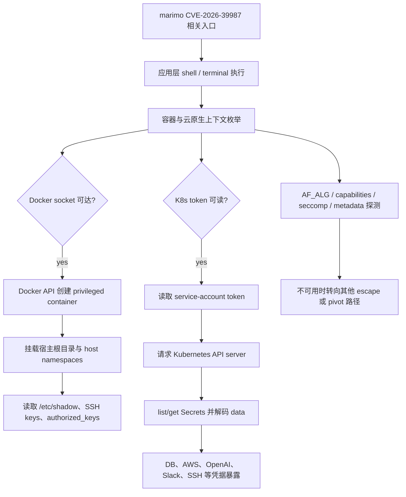

# Sysdig 观测到 Agentic 攻击者进入容器与编排平面：从 marimo RCE 到 Docker Socket 逃逸和 Kubernetes Secret 倾倒

> 研究者精读 · 这篇文章的重点不是“AI 发明了新的容器逃逸”，而是 Sysdig 观测到一个疑似 LLM agent harness 把 marimo RCE、Docker socket、privileged container、Kubernetes service-account token 和 Secrets 枚举串成了机器速度的云原生后渗透链条。

- 原文：[Agentic threat actor hits the orchestration plane: AI agent-driven container escape](https://www.sysdig.com/blog/agentic-threat-actor-hits-the-orchestration-plane-ai-agent-driven-container-escape)
- 作者与日期：Sysdig Threat Research Team，Michael Clark，2026-06-04
- 相关前文：[AI agent at the wheel](https://www.sysdig.com/blog/ai-agent-at-the-wheel-how-an-attacker-used-llms-to-move-from-a-cve-to-an-internal-database-in-4-pivots)，2026-05-26
- 漏洞背景：[marimo CVE-2026-39987 update](https://www.sysdig.com/blog/cve-2026-39987-update-how-attackers-weaponized-marimo-to-deploy-a-blockchain-botnet-via-huggingface)


## TL;DR

Sysdig Threat Research Team 报告称，2026-05-29 观测到一个攻击者利用 vulnerable marimo notebook，也就是 CVE-2026-39987 相关入口，在获得应用层执行后，由疑似 LLM agent harness 驱动后续动作：先枚举容器边界、Docker socket、seccomp、capabilities、AF_ALG、Kubernetes service-account token 和 cloud metadata，再把可达 Docker socket 作为容器逃逸原语，创建 privileged container 挂载宿主根文件系统，读取宿主凭据，最后重放 pod 内 token 访问 Kubernetes API 并倾倒 Secrets。

这篇文章的重要性不在于新漏洞。Docker socket 等价宿主高权限入口、service-account token replay、过宽 RBAC 导致 Secret store 泄露，这些都是云原生安全里的老问题。新变化在于：Sysdig 看到攻击链呈现出 agentic operator 的形状，包括 canary 指令被响应上下文消费、terminal raw byte stream 中的不可见指令被回显、base64 分块投递前的 staging harness 自测、结构化分隔符、bounded output、重试和按反馈改写下一步。

文章还和 Sysdig 2026-05-26 的前文连在一起。前文里，同一 marimo 漏洞族曾在不到 1 小时内从 RCE 走到内部 PostgreSQL 数据库倾倒，其中 bastion 阶段不到 2 分钟完成 schema 与内容读取。6 月 4 日这篇则把焦点从 AWS credential pivot 推到 orchestration plane：容器、宿主机、Docker daemon 和 Kubernetes API。

最需要保留的边界是：Sysdig 的“首次观测”应理解为其自身遥测与研究范围内的 first observed；脚本也可以产生一部分分隔符、重试和 base64 投递行为；真正让 LLM agent attribution 变强的是多个 canary、raw stream、value handoff 和自适应路径选择信号叠加。

## 这篇文章真正关心的问题

这篇文章真正关心的是：**当一个攻击者把 LLM agent 接进真实 shell 和云原生控制面后，原本需要人工经验串联的 post-exploitation 链条，会不会变成低成本、可反馈驱动、可快速改写的操作循环？**

如果只看单个技术点，文章里的大多数动作都不新。应用 RCE、Docker socket 滥用、privileged container、host filesystem bind mount、Kubernetes service-account token、Secrets list/get、SSH key 和 cloud credential 读取，都有很长的攻防历史。

Sysdig 的问题不是“有没有新招”，而是“这些老招被谁、以什么操作形态、在多快的反馈循环里串起来”。传统人工攻击者可以逐条试探；预写脚本可以固定枚举；LLM agent harness 的风险则在于把环境观察压缩成下一轮推理输入，然后根据反馈选择可行的逃逸路径。

这也是标题里 orchestration plane 的意义。攻击者一旦从应用容器进入 Docker daemon 或 Kubernetes API，问题就不再是一个 notebook 被打穿，而是容器权限边界、宿主机权限和集群 Secret store 是否会连锁失守。

## 作者是怎么展开这个问题的

作者的叙事顺序基本沿着入侵链推进。

第一步是交代入口：攻击者利用 vulnerable marimo notebook 获得执行。这里需要强调，marimo 漏洞是入口，不是 AI 生成的新漏洞；真正的研究对象是进入后怎样横向扩大控制面。

第二步是枚举环境。攻击者没有直接盲打某个逃逸，而是同时探测 `/.dockerenv`、`/proc/1/cgroup`、`/var/run/docker.sock`、seccomp、effective capabilities、`core_pattern`、AF_ALG、cloud metadata 和 Kubernetes service-account token 路径。这说明它先在构建一张当前环境的权限地图。

第三步是选择 Docker socket 路径。如果应用容器能访问宿主 Docker daemon，攻击者就能通过 Docker API 创建更高权限的新容器。Sysdig 描述的链条包括创建 privileged container、复用宿主已有 image、挂载宿主 `/`、共享 host PID/network/IPC namespace，并通过 container output stream 取回结果。

第四步是读取宿主材料。文章提到的目标包括宿主 `/etc/shadow`、deploy 用户 SSH private key、root `authorized_keys`，以及额外 `id_rsa`、`id_ed25519`、`.pem` 等密钥材料。若某条路径不可用，攻击链还会考虑 namespace 进入等 fallback。

第五步是进入 Kubernetes 侧。pod 内 projected service-account token 被读取后，攻击者向 `https://kubernetes.default.svc:6443` 重放 token，列 namespace Secrets，再读取并解码 Secret data。Sysdig 提到泄露材料包括 database credentials、AWS keys、OpenAI API key、Slack webhook 和 SSH keys。

第六步是解释为什么认为这是 agentic。文章不是只凭“速度快”下判断，而是列出 canary、raw byte stream、staging harness、分隔符和按反馈调整等归因信号。

## 关键段落细读

> "AI agent-driven container escape"

标题里的这个短语容易被误读成“模型发现了新逃逸漏洞”。更准确地说，Sysdig 讨论的是 agent 驱动的逃逸流程：逃逸原语仍然是 Docker socket、privileged container 和宿主挂载，agent 的作用是枚举、选择、执行和反馈调整。

> "orchestration plane"

orchestration plane 指向 Kubernetes、Docker daemon、service account、Secrets、namespace 和 runtime 这些控制面。文章把风险从单点应用 RCE 推到了平台边界：只要应用容器带着过大的平台权限运行，攻击者就能把一个 notebook shell 放大成宿主和集群级访问。

> "first observed"

这个表述必须按字面读。它支持“Sysdig TRT 在自身观测范围内第一次看到这类 agent harness 完成 container escape 和 Kubernetes credential replay”，但不支持“全球首次发生”。安全博客里的 first observed 往往是遥测边界内的发现，不是全行业历史断言。

> "canary"

canary 是这篇归因证据里最关键的词之一。Sysdig 不是只看命令很快或格式整齐，而是把隐藏在 JSON error response 或 terminal raw byte stream 中的指令当作探针。如果攻击端把这些正常人类操作里不该执行的上下文当成下一步指令，就说明观察流被自动化 reader、parser 或 LLM harness 消费了。

## 案例、图表与证据的作用

这篇文章最有价值的证据不是某一条命令，而是完整攻击链的可解释性。



这条链的关键在于两个放大器。

第一个是 Docker socket。如果容器能访问 `/var/run/docker.sock`，它就不是普通应用容器了；它可以让宿主 Docker daemon 代表它创建具有更高权限的新容器。Sysdig 提到攻击者复用宿主已有 image，而不是依赖 registry pull，这会减少网络侧新镜像拉取信号。

第二个是 Kubernetes service-account token。如果 token 可读，且 RBAC 允许 list/get Secrets，那么应用层 RCE 就能直接变成 Secret store dump。很多团队把 Kubernetes Secret 当作集群内部安全材料，但在过宽 RBAC 下，它其实是攻击者完成横向移动和云资源访问的跳板。

归因证据则由多个信号叠加。

| 信号 | Sysdig 看到的含义 | 为什么比“速度快”更有价值 |
|---|---|---|
| JSON error response canary 被执行 | 攻击端读取并执行了响应上下文中的诱导内容 | 测试观察流是否被机器消费 |
| raw byte stream directive 被回显 | terminal 不可见内容影响了后续行为 | 区分 rendered terminal 与 raw stream reader |
| base64 分块前先自测 staging harness | 先测试 hello、chunked hello + world，再投递真实脚本 | 像工具通道可靠性验证 |
| 分隔符与 bounded output | `_SOCK_`、`_K8S_`、`===SHADOW===` 等 marker 切分输出 | 输出面向下一轮解析，而不只是人眼阅读 |
| 按反馈改写路径 | 某些逃逸面不可用时转向 Docker socket、namespace 或 token replay | 显示存在环境感知的路径选择 |

这些证据共同说明，作者关心的是攻击操作形态，而不是单点 IoC。IP 地址和固定命令可能会变，但“从 RCE 到容器边界枚举，再到 Docker/Kubernetes 权限放大”的行为语义更稳定。

## 这篇文章的核心判断与边界

核心判断是：LLM agent 的风险不只在生成 payload，而在降低云原生后渗透的串联成本。攻击者不需要提前为每个环境写完整 playbook，只要 harness 能观察输出、压缩状态、选择下一步，就能把多个已知弱配置快速接起来。

这个判断可以写成一个风险链：

```text
internet-facing code execution
+ mounted Docker socket
+ privileged container creation
+ host filesystem access
+ readable service-account token
+ over-broad RBAC on Secrets
+ feedback-driven agent harness
= cluster-scale credential exposure
```

边界也要讲清楚。

第一，漏洞和配置仍然是根因。没有 marimo RCE，攻击者缺少入口；没有 Docker socket mount，宿主逃逸路径会断；没有 service-account token 或过宽 RBAC，Kubernetes Secret dump 会受限。LLM agent 是加速器和串联器，不是绕过所有权限模型的魔法层。

第二，agent attribution 有灰区。分隔符、base64 分块、重试、fallback 和 bounded output 都可以由成熟脚本实现。Sysdig 的强证据在于多个 canary 与 raw stream 信号叠加，再加上路径选择和 value handoff；单拿某一个特征并不足以断言 LLM agent。

第三，Sysdig 的观测边界不能外推成行业边界。应写成“Sysdig observed / reported”，而不是“全球首次确认”。

第四，防守不能只追逐 AI 标记。运行时更需要关注 Docker socket abuse、privileged container create、host mount、namespace entry、service account 异常访问 API server、短时间 list/get Secrets、credential file access 和异常出站。

## 放到 AI 安全、后训练、Agent 或对应领域里看

放到 AI 安全里看，这篇文章把问题从“模型会不会输出恶意代码”推进到“模型能否降低真实后渗透链条的操作成本”。攻击者最需要的未必是新的 exploit，而是快速理解陌生环境、选择可用权限边界、把结果传回下一轮决策。

放到 Agent 领域里看，云原生环境非常适合 agentic attacker。原因并不神秘：状态可枚举，API 可组合，错误输出结构化，权限以 token、socket、namespace、capability 和 RBAC 表达，每一步都能变成下一轮 observation。这样的环境天然适合工具调用循环。

放到容器与 Kubernetes 安全里看，文章再次证明边界不是“我在容器里”就结束了。真正的边界是：

| 边界对象 | 一旦过宽会发生什么 |
|---|---|
| Docker socket | 应用容器可借 daemon 创建高权限容器 |
| privileged / host namespace | 容器可接近宿主文件系统和进程空间 |
| service-account token | RCE 后可直接请求 Kubernetes API |
| RBAC secrets 权限 | namespace 或 cluster Secret store 变成可枚举资产 |
| runtime telemetry | 缺失时只能事后从泄露结果推断攻击链 |

放到归因研究里看，Sysdig 给了一个很有价值的方向：不要只凭速度、命令形状或输出格式判断“这是 AI”。更强的做法是投放上下文 canary，观察攻击端是否会消费只有 raw response 或 raw stream reader 才会看到的指令。它接近 prompt-injection honeypot，也更能逼近“谁在读观察流”这个问题。

放到后训练和工具权限设计里看，文章也提醒模型提供方和 agent 平台：高风险不是单个回答，而是工具循环。shell、Docker API、Kubernetes API、cloud API、数据库和 secret store 一旦被接进 agent，就必须有权限收缩、日志审计、人工确认、速率限制和环境隔离。

## 还值得继续追问什么

1. Sysdig 是否会公开更完整的 Falco rule、runtime behavior mapping 或可复现实验环境，用来验证 Docker socket abuse 与 K8s token replay 检测。
2. marimo CVE-2026-39987 的真实暴露面是否继续扩大，是否进入更多 KEV、CERT、distro advisory 或云平台告警。
3. canary 与 raw stream 归因方法能否被其他安全团队复现，尤其是在不同 terminal、notebook、CI runner 和 agent sandbox 中。
4. 攻击者是否会从 Docker socket 继续扩展到 containerd socket、Kubelet API、CI/CD runner socket 或云厂商 workload identity。
5. Kubernetes 防守实践是否会默认关闭普通 workload 的 service-account automount，并禁止非控制面服务 list/get Secrets。
6. 后续 AI cyber threat 框架是否会把 orchestration-plane TTP 单独列出，而不是只归入一般容器逃逸。
7. 当命令由脚本、传统自动化和 LLM agent 混合生成时，行业是否能建立更清晰的归因等级，而不是简单二分“人类”与“AI”。

打开原文：[Agentic threat actor hits the orchestration plane](https://www.sysdig.com/blog/agentic-threat-actor-hits-the-orchestration-plane-ai-agent-driven-container-escape)
