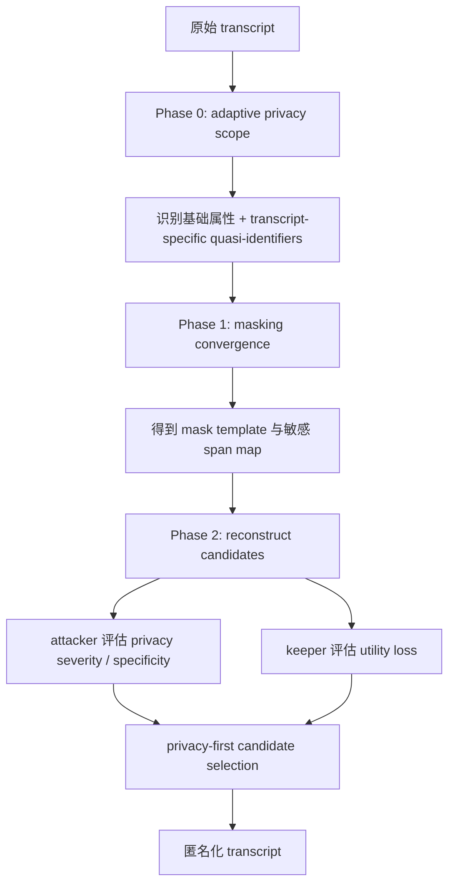

# AURA：对抗 Web-Search Agent 的文本匿名化

> 研究者精读 · AURA 的贡献不是“再写一个脱敏 prompt”，而是把匿名化拆成两件事：先找出会被 Web-search Agent 拼成身份的线索，再只重写这些高风险 span，同时保留定性研究需要的上下文效用。

| 字段 | 内容 |
|---|---|
| 论文 | [LLM Anonymization Against Agentic Re-Identification](https://arxiv.org/abs/2605.30848) |
| 方法 | AURA, Anonymization with Utility-Retention Adaptation |
| 作者 | Ziwen Li, Jianing Wen, Tianshi Li |
| 机构 | Northeastern University, Khoury College of Computer Sciences |
| 代码 | [AURA GitHub](https://github.com/PEACH-Research-Lab/AURA) |
| 数据 | Anthropic Interviewer dataset 中被 agentic re-id 验证可识别的 27 条高风险 transcript |

## 一句话结论

AURA 把隐私威胁模型从“文本里有没有 PII”升级成“Web-search Agent 能不能用弱线索重新识别受访者”。论文从 1,250 条 Anthropic Interviewer transcripts 中筛出 27 条可被重新识别的高风险样本，比较 Presidio、one-shot rewrite、prior anonymizer、DP-MLM 和 AURA variants。

核心结果：

- Presidio 只删固定 PII，仍有 13/27 到 21/27 被重新识别。
- One-shot rewrite 仍有 8/27 到 17/27 被重新识别。
- Adaptive AURA 在三种攻击者下大多降到 0/27 到 5/27。
- AURA 不是靠把文本洗空取胜；adaptive variants 还能保留约 74.9% 到 80.3% utility-grid units。
- DP-MLM 在低 epsilon 下能做到 0/27 re-id，但 unit-level utility 可低到 0.0%，说明形式化扰动和研究可用性之间有很硬的冲突。

## 研究问题：为什么传统脱敏不够

传统 de-identification 通常把风险集中在姓名、邮箱、电话、地址、机构、日期等显式 PII。但访谈文本里的身份线索往往不是单个实体，而是组合：

- 研究主题；
- 职业路径；
- 工具栈；
- 小众实验设备；
- 工作流；
- 机构或社区语境；
- 时间线；
- 与公开论文、网页、项目页能互相印证的细节。

Web-search Agent 改变了攻击面。它能把 transcript 中多个弱信号转成搜索 query，再跨网页交叉验证候选身份。这样一来，“没有姓名”不等于匿名。

AURA 要解决的问题是：如果必须抵抗这种 agentic re-identification，能否不把文本改到失去研究价值？

## 方法总览



### Phase 0：扩展什么算敏感

基础隐私范围包括 8 类属性：

- Age
- Sex
- Location
- Occupation
- Education
- Relationship status
- Income
- Place of birth

但 AURA 不停在这 8 类。它会用 Web-search re-identification probe 找 transcript-specific quasi-identifiers，例如 workflow cues、tool-stack mentions、domain-practice clues、institutional context。这个步骤是 AURA 和 NER 脱敏的根本差别。

### Phase 1：只定位需要改的 span

AURA 使用 masking convergence。它不是直接让 LLM 重写整篇 transcript，而是迭代识别可推断属性和证据 span，直到敏感推断收敛或达到上限。

输出有两个：

- `T_hat`：带 mask 的 transcript template；
- `M`：mask id 到原始敏感 span 的映射。

这一步的好处是把“哪里危险”和“怎样保留效用”分开。普通 one-shot rewrite 往往把两件事混在同一次生成里，容易要么漏掉准标识符，要么把上下文整段泛化。

### Phase 2：候选重构与 privacy-first 选择

候选匿名文本需要同时过两类检查：

| 角色 | 检查对象 | 目标 |
|---|---|---|
| attacker | 剩余 privacy severity 与 specificity | 越低越好 |
| keeper | 研究效用损失 | 越低越好 |

选择规则是 privacy-first：

```text
先筛 specificity count <= C_max 的候选；
如果存在合格候选，按 privacy severity 再按 utility loss 选最小；
如果不存在合格候选，退而求其次选 specificity / severity / utility loss 的字典序最小。
```

这意味着 AURA 不会为了更流畅或更像原文而牺牲隐私约束。

## 实验设置

### 数据

作者从 Anthropic Interviewer dataset 的 1,250 条 transcript 开始，先运行 agentic re-identification attack，只保留能被验证识别的样本，最终得到 27 条 high-risk transcripts。

这点必须单独强调：实验是 stress test，不是随机平均样本。它证明 AURA 在最难的一组文本上有用，但不能直接推出所有访谈文本的平均匿名成功率。

### 攻击者

隐私评测使用三种 Web-search attacker：

- GPT-5.1；
- GPT-5.4-mini；
- Gemini-3-Flash。

论文报告每种方法在 27 条 transcript 中被重新识别的数量。攻击重复三次，报告最高 re-id rate。

### 效用指标

论文不用 BLEU 或文本相似度，而是用定性研究更接近的问题：

| 层级 | 数量 | 含义 |
|---|---:|---|
| Profile facts | 170 | 受访者背景、职业、教育、专长等 |
| Codebook facts | 371 | 人类 codebook 中的主题/行为事实 |
| Utility-grid units | 2,349 | profile fact 与 codebook fact 的组合 |

utility-grid 更严格，因为只有“谁的背景”和“他说了什么/做了什么”同时保留，一个解释单元才算恢复。

## 主结果

### 隐私结果

| 方法 | GPT-5.1 | GPT-5.4-mini | Gemini-3-Flash | 解读 |
|---|---:|---:|---:|---|
| Presidio | 13/27 | 21/27 | 17/27 | 固定 PII 删除挡不住准标识符组合 |
| One-shot minimal | 10/27 | 14/27 | 8/27 | 泛化更多，但仍漏掉可搜索线索 |
| One-shot detailed | 15/27 | 17/27 | 14/27 | 保留细节越多，re-id 风险越高 |
| Prior anonymizer | 6/27 | 7/27 | 7/27 | 稳定但效用不占优 |
| AURA 8-attribute GPT-4.1 | 6/27 | 8/27 | 7/27 | 固定 scope 有帮助但仍不足 |
| Adaptive AURA GPT-4.1 | 2/27 | 3/27 | 0/27 | 动态 scope 明显降低残余风险 |
| Adaptive AURA Qwen3.5-27B | 2/27 | 4/27 | 0/27 | 开放/本地模型配置也能工作 |
| DP-MLM epsilon 10/30 | 0/27 | 0/27 | 0/27 | 强隐私，但效用损伤严重 |

关键结论不是“AURA 永远最隐私”。低 epsilon DP-MLM 在 re-id 上更强。AURA 的价值在于 privacy-utility frontier：在还保留研究上下文的前提下，把 re-id 风险压低。

### 效用结果

| 方法 | Profile recovery | Codebook recovery | Utility-grid recovery | 解读 |
|---|---:|---:|---:|---|
| AURA 8-attribute GPT-4.1 | 80.6% | 93.3% | 77.1% | 固定 scope 下效用保持强 |
| Adaptive AURA GPT-4.1 | 未列入摘要表 | 95.1% | 74.9% | 多压隐私，grid 小幅下降 |
| Adaptive AURA Qwen3.5-27B | 未列入摘要表 | 96.8% | 80.3% | 本地/open-weight variant 表现强 |
| Prior anonymizer | - | - | 72.1% | 效用低于 AURA front |
| DP-MLM epsilon 10 | - | - | 0.0% | 文本被扰动到几乎不可分析 |
| DP-MLM epsilon 140 | - | - | 60.1% | 放松隐私后效用仍低于 AURA |

Profile facts 的下降并不一定坏，因为很多身份线索本来就在 profile details 中。论文真正想保留的是 codebook facts 和 profile-code 组合中仍可支持研究问题的部分。

## 图表怎么读

### Figure 1：pipeline 图

它证明 AURA 不是单次 rewrite。关键是三段：

- adaptive privacy inference 负责发现风险；
- mask convergence 负责限制编辑范围；
- reconstruction + attacker/keeper selection 负责平衡隐私和效用。

### Table 1：re-identification 主表

读这张表要看三条横向比较：

- Presidio 与 one-shot rewrite：说明普通可用工具不够；
- 8-attribute AURA 与 adaptive AURA：说明动态 scope 是关键；
- DP-MLM 与 AURA：说明形式隐私和上下文效用是不同目标。

### Utility barplot

这张图的重点不是 codebook recovery 很高，而是 utility-grid。很多匿名化方法能保留“主题事实”，但丢掉受访者背景后，定性研究里的解释单元仍会失效。

### Pareto front

Pareto 图说明三类方法的位置：

- Presidio / one-shot：效用高，但 privacy success 低；
- DP-MLM：隐私强，但效用低；
- Adaptive AURA：处在更实用的中间区域。

## 失败模式与反例

### 1. NER 不懂组合线索

NER 可以删除姓名、地址、机构，但不一定删除“某个领域 + 某种工具 + 某段经历”。Web-search Agent 正是靠这些组合线索工作。

### 2. One-shot rewrite 混淆两个目标

一句 prompt 同时要求“不可识别”和“保留洞察”，模型往往没有机制判断哪些 span 是必须改的，哪些细节应该保留。

### 3. DP-MLM 不是错，而是目标不同

DP-MLM 给的是 token-level DP 扰动。低 epsilon 下隐私很好，但文本可能失去定性分析价值。AURA 没有形式化保证，但更适合“发布仍可读、可分析的访谈材料”这个场景。

### 4. AURA 的中间产物本身敏感

mask map、re-id candidate、evidence quote、reference fact files 都可能近似 PII。部署时不能只保护最终 transcript，还要保护 pipeline 产生的诊断材料。

## 证据边界

这篇论文能支持：

- Web-search Agent 让访谈匿名化威胁模型显著变强。
- 固定 PII / NER 删除不足以抵抗准标识符组合。
- adaptive privacy scope 对降低 re-id count 很重要。
- mask-reconstruct 比整段泛化更利于保留定性研究效用。

不能直接支持：

- AURA 给出差分隐私式保证。
- 27 条 transcript 能代表全部访谈数据。
- 当前攻击者失败就意味着未来攻击者失败。
- LLM judge 的 utility proxy 等同于人类研究者真实分析质量。

## 对产品和研究的启发

### 对隐私产品

- 匿名化系统需要内置攻击性 probe，而不是只做实体识别。
- 准标识符应按任务和语料动态发现。
- 中间审计产物要按敏感数据管理。
- 输出应同时报告隐私残余风险和效用损失，而不是只给“已脱敏”标签。

### 对 Agent 安全

- 风险来自模型 + 搜索工具的组合，不是模型裸推理。
- 隐私评测应测试可外接工具的 re-identification，而不是只测 attribute inference。
- Search API、网页索引、提示策略变化都会让匿名化结果过期。

### 对定性研究

- 厚描和匿名化天然冲突，因为背景细节既是研究价值，也是身份线索。
- AURA 的思路不是删掉所有背景，而是找出“可搜索、可拼接、可验证”的危险背景。
- 发布 transcript 时应有人工审查环节，尤其检查改写后是否仍保留研究问题所需的上下文。

## 还要继续追问

1. 27 条 high-risk transcripts 之外，普通 transcript 上的平均 privacy-utility frontier 如何。
2. 更强搜索模型、更多外部数据库、社媒、论文图谱加入后，adaptive scope 是否会扩大。
3. utility-grid 是否能和真实人类 coder 的下游任务表现对齐。
4. AURA 如何处理多语言 transcript 和跨语言搜索 re-id。
5. mask map 与 re-id evidence 如何做最小留存、加密和审计。
6. 是否能把形式隐私方法和 AURA 的 span-level 重构结合起来。

## 阅读定位

AURA 最值得借鉴的不是某个 prompt，而是系统边界：匿名化不再是“删除 PII”，而是“模拟一个会搜索的攻击者，再对可被搜索拼接的线索做最小必要改写”。它没有解决所有隐私问题，但把 agentic re-identification 这个新威胁模型讲清楚了。

打开原文：[arXiv:2605.30848](https://arxiv.org/abs/2605.30848)
