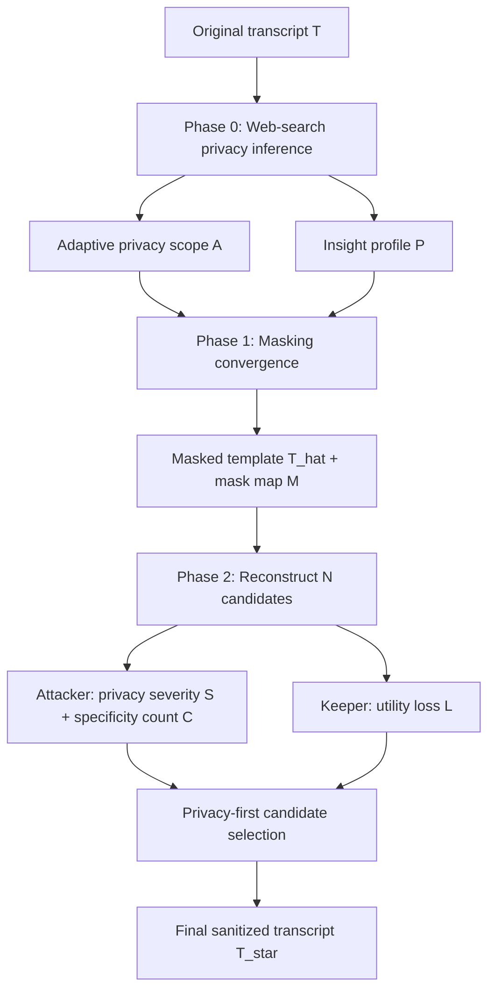

# AURA：当 Web-Search Agent 能重新识别受访者，匿名化还剩多少空间？

## 1. 元信息与 TL;DR

### 基本信息

| 字段 | 内容 |
|---|---|
| 论文 | LLM Anonymization Against Agentic Re-Identification |
| 方法 | AURA，Anonymization with Utility-Retention Adaptation |
| 作者 | Ziwen Li, Jianing Wen, Tianshi Li |
| 机构 | Northeastern University, Khoury College of Computer Sciences |
| arXiv | [2605.30848](https://arxiv.org/abs/2605.30848)，v2 于 2026-06-01 更新 |
| 项目页 | [peach-research-lab.github.io/AURA](https://peach-research-lab.github.io/AURA/) |
| 代码 | [PEACH-Research-Lab/AURA](https://github.com/PEACH-Research-Lab/AURA) |
| 类型 | AI 安全 / 隐私 / Agentic re-identification |

### TL;DR

- AURA 处理的问题是：当 LLM Agent 能调用 Web search 时，传统“删姓名、删邮箱”的匿名化不够了；职业路径、工具栈、研究主题、机构线索等弱上下文也会被串联成身份线索。
- 方法上，它把匿名化拆成两件事：
  - 先用 Web-search re-identification probe 扩展隐私范围，找出基础 8 类属性之外的 transcript-specific quasi-identifiers。
  - 再用 mask-reconstruct 流程只改敏感 span，并由 attacker/keeper 对候选改写做 privacy-first 选择。
- 实验上，它从 Anthropic Interviewer 的 1,250 条 transcript 中筛出 27 条已被 Web-search Agent 验证可重新识别的高风险样本。
- 评测上，它同时看三类攻击者的 re-identification count，以及 170 个 profile facts、371 个 codebook facts、2,349 个 profile-code utility-grid units 的保留率。
- 关键数字是：
  - Adaptive AURA 在三种攻击者下把重新识别压到 0 到 5 / 27。
  - Presidio NER baseline 仍有 13 到 21 / 27 被识别。
  - prior LLM anonymizer 为 6 到 7 / 27。
  - Adaptive AURA 仍保留 74.9% 到 80.3% 的 utility-grid unit。
- 局限也很明确：
  - 27 条样本小且来自特定数据集。
  - utility 由 LLM judge 和 fact recovery 近似，不等于真实研究者分析质量。
  - privacy count 是经验攻击评测，不是差分隐私式保证。

## 2. 来源与材料地图

### 本轮阅读材料

| 材料 | 作用 |
|---|---|
| arXiv HTML / PDF | 确认日期、摘要、方法、实验、附录、限制 |
| 项目页 | 确认 2026-06-01 论文发布、Figure 1/2/3、关键结果表述 |
| GitHub README | 确认代码入口、pipeline 文件、EVAL harness、隐私说明 |
| AURA/README | 确认运行方式、SQLite scratch DB、scope/provider 选项 |
| EVAL/README | 确认 direct_intent、profile recovery、code-fact recovery 的评测脚本 |
| 相关工作检索 | 对照 Staab 等人的 LLM attribute inference、Agentic deanonymization、DP-MLM |

### 日期与新鲜度

- arXiv 页面显示：
  - v1 提交：2026-05-29。
  - v2 修订：2026-06-01。
- Hugging Face Paper 页面显示：
  - Published on Jun 1。
  - Submitted by author on Jun 5。
- 项目页 News 显示：
  - 2026-06-01 paper released on arXiv。
  - 2026-05-28 project website live。
  - 2026-05-26 code released。
- 结论：
  - 它满足“今天或本周内发布、更新、官方标记”的窗口要求。

## 3. 背景：为什么匿名化问题变了？

### 旧威胁模型

传统 text de-identification 主要防这些显式标识：

- 姓名。
- 邮箱。
- 地址。
- 电话。
- 日期。
- 机构名。
- 账号名。

对应技术常见是 NER 或规则系统，例如 Presidio。

### 新威胁模型

Agentic LLM 多了三个能力：

1. **生成查询**：能把 transcript 中的弱线索转成搜索 query。
2. **跨源检索**：能从网页、论文、简历、社媒和机构页中找证据。
3. **交叉验证**：能把多个弱线索拼成候选身份。

这意味着风险不再只来自“明文 PII”。

### 典型危险线索

| 线索类型 | 为什么危险 | 为什么不能全删 |
|---|---|---|
| 职业细分 | 可能缩小到很小人群 | 研究分析需要职业背景 |
| 研究主题 | 可和论文/项目页匹配 | 主题是 qualitative data 的核心 |
| 工具栈 | 可定位团队或领域 | 工具使用本身是行为证据 |
| 机构上下文 | 可直接指向学校/公司 | 机构生态影响结论解释 |
| 时间线 | 可对齐公开事件 | 经验叙述需要时间结构 |

AURA 的核心判断是：匿名化不应只问“删什么”，还要问“如何保留可分析的上下文”。

## 4. AURA 方法：mask-reconstruct，而不是整段重写

### Figure 1：整体流程


### 三阶段流程



### Phase 0：初始化隐私范围

AURA 不只使用固定 8 类属性：

- Age。
- Sex。
- Location。
- Occupation。
- Education。
- Relationship status。
- Income。
- Place of birth。

它还让 Web-search Agent 针对原始 transcript 做 vulnerability probe，找出动态 quasi-identifiers：

- workflow cues。
- research-pipeline signatures。
- tool-stack mentions。
- domain-practice cues。
- institutional/contextual clues。

输出包括：

| 符号 | 含义 |
|---|---|
| `A` | adaptive privacy scope，最终要保护的属性集合 |
| `B` | blacklist evidence spans，可支撑 re-id 的证据片段 |
| `P` | utility insight profile，8 个维度的研究价值画像 |

### Phase 1：Masking convergence

论文把原文记作 `T`。

迭代过程可以写成：

```text
t_0 = T
for i in 0 ... R_mask:
  A_i = PrivacyInfer(t_i, A)
  t_{i+1} = RewriteToSuppress(t_i, A_i)
  if no attributes can be inferred:
      break
```

然后 AURA 比较 `T` 与最终改写文本，得到：

- `T_hat`：带 `[MASK_i]` 的模板。
- `M = {i -> s_i}`：每个 mask 对应的原始 span。
- seed replacements：Phase 1 已生成的初步替换。

关键设计是：Phase 1 的目标不是产出最终匿名文本，而是产出“哪些 span 真正需要被动刀”的风险地图。

### Phase 2：Reconstruct, evaluate, select

给定 `T_hat`、`M` 和 `P` 后，reconstructor 只为 masked spans 生成 `N` 个 replacement dictionaries。

每个候选 `T'^(n)` 会被三类分数评估：

| 分数 | 公式/含义 | 方向 |
|---|---|---|
| privacy severity `S_n` | `S_n = sum_a severity_{n,a}` | 越低越好 |
| specificity count `C_n` | 仍过于具体的维度数 | 越低越好 |
| utility loss `L_n` | `L_n = sum_u loss_{n,u}` | 越低越好 |

选择规则是 privacy-first：

```text
V = {n | C_n <= C_max}
if V is not empty:
  n* = argmin_{n in V} (S_n, L_n)
else:
  n* = argmin_n (C_n, S_n, L_n)
```

这体现了一个安全产品思路：

- 先保证不太具体。
- 再压隐私泄漏 severity。
- 最后才在候选之间追求更少 utility loss。

## 5. 训练/实验设置：样本小，但威胁强

### 数据构造

论文从 Anthropic Interviewer dataset 的 1,250 条 transcript 开始。

筛选条件是：

1. 对每条原始 transcript 跑 agentic re-identification attack。
2. 只保留可验证身份的样本。
3. 最终得到 27 条 re-identifiable interview transcripts。

这个设计的含义是：

- 它不是平均场景。
- 它是高风险 stress test。
- 它更适合回答“匿名化方法在已知脆弱样本上能否降低风险”。

### Privacy benchmark

论文用三种攻击者模型复测 rewrite 后的 transcript：

| 攻击者 | 作用 |
|---|---|
| GPT-5.1 | 同时用于 adaptive privacy scope generation 的强攻击者 |
| GPT-5.4-mini | 论文报告中整体更强的 re-id attacker |
| Gemini-3-Flash | 检查跨模型鲁棒性 |

指标是 re-identified transcripts 的数量和比例。

### Utility benchmark

Utility 不是只看 BLEU 或文本相似度。

论文构建三层事实：

| 层级 | 数量 | 含义 |
|---|---:|---|
| profile facts | 170 | 受访者背景、职业、教育、专长等 |
| codebook facts | 371 | 人类 codebook 中的行为/主题事实 |
| utility-grid units | 2,349 | profile fact 与 codebook fact 的组合 |

utility-grid 的直觉是：

- 定性研究经常问“谁在什么背景下做了什么”。
- 如果只保留行为事实，但丢掉必要背景，很多下游解释仍会失效。

### Utility-grid 公式

对第 `i` 条 transcript：

| 符号 | 含义 |
|---|---|
| `P_i` | 原文中验证过的 profile facts |
| `C_i` | 原文中验证过的 codebook facts |
| `P_hat_i` | rewrite 后仍可恢复的 profile facts |
| `C_hat_i` | rewrite 后仍可恢复的 codebook facts |

单条 transcript 的 grid recovery：

```text
g_i = |P_hat_i| / |P_i| * |C_hat_i| / |C_i|
```

全局 unit-level recovery：

```text
G_unit = sum_i |P_hat_i| |C_hat_i| / sum_i |P_i| |C_i|
```

这个指标比单独 profile recovery 或 code recovery 更严格，因为一个 grid unit 只有在两边事实都保留时才算恢复。

## 6. 主结果：AURA 把隐私-效用曲线推到中间地带

### Table 1：re-identification 结果

| 方法 | GPT-5.1 | GPT-5.4-mini | Gemini-3-Flash | 解读 |
|---|---:|---:|---:|---|
| AURA adaptive, Qwen3.5-27B | 2/27 | 4/27 | 0/27 | 开源/本地 backbone 也可用 |
| AURA adaptive, Qwen3.5-35B-A3B | 2/27 | 5/27 | 2/27 | privacy 稳定但略高 |
| AURA adaptive, GPT-4.1 | 2/27 | 3/27 | 0/27 | 综合最强之一 |
| AURA pure adaptive, GPT-4.1 | 2/27 | 3/27 | 2/27 | 不用基础 8 类也有效 |
| AURA 8-attribute, GPT-4.1 | 6/27 | 8/27 | 7/27 | 固定 scope 风险更高 |
| Anonymizer baseline | 6/27 | 7/27 | 7/27 | 与固定 scope 接近 |
| Presidio | 13/27 | 21/27 | 17/27 | NER 无法挡住弱线索组合 |
| One-shot minimal | 10/27 | 14/27 | 8/27 | 轻量 rewrite 不够 |
| One-shot detailed | 15/27 | 17/27 | 14/27 | 更详细 prompt 也不稳 |
| DP-MLM, ε=10/30 | 0/27 | 0/27 | 0/27 | 隐私强，但 utility 很低 |

### Figure 2：utility preservation


关键数字：

- GPT-4.1 的 8-attribute AURA：
  - profile facts：80.6%。
  - codebook facts：93.3%。
  - utility-grid units：77.1%。
- GPT-4.1 的 adaptive AURA：
  - codebook recovery：95.1%。
  - utility-grid units：74.9%。
- Qwen3.5-27B 的 adaptive AURA：
  - utility-grid units：80.3%。
  - codebook recovery：96.8%。
- DP-MLM：
  - ε=10 时 unit-level utility-grid 为 0.0%。
  - ε=140 时也只有 60.1%。

### Figure 3：Pareto frontier


图里的格局很清楚：

- DP-MLM 在高隐私、低效用角落。
- Presidio 和 one-shot rewrite 在高效用、高泄漏角落。
- Adaptive AURA 靠近右上角，形成中间地带。
- 8-attribute AURA 说明 mask-reconstruct 本身也比 prior anonymizer 更保留 utility。

## 7. 消融、失败与机制解释

### 消融 1：固定 8 类 vs adaptive scope

固定 8 类保护的是传统个人属性。

Adaptive scope 会额外捕捉 transcript-specific clues。

结果差异：

| 对比 | 观察 |
|---|---|
| 8-attribute AURA | GPT-5.4-mini 下 7 到 8 / 27 仍被识别 |
| adaptive AURA | GPT-5.4-mini 下 3 到 5 / 27 被识别 |
| 结论 | scope 直接影响 re-id resistance |

这说明很多风险不在基础属性列表里，而在细碎上下文中。

### 消融 2：AURA vs prior anonymizer

论文附录给了 synthetic diff。

AURA 更像：

- 把“tabletop interferometry”等高定位线索改成更一般的 scientific research。
- 保留第一人称和叙述结构。
- 只在 risky spans 上做替换。

prior anonymizer 更像：

- 整句改写。
- 把具体经验改成泛化叙述。
- 更容易损伤 qualitative flow。

### 消融 3：privacy scope 与 reconstruction 的分工

论文的关键机制不是“扩大 scope 就赢”。

更准确地说：

- scope 控制“在哪里动刀”。
- reconstruction 控制“动刀后保留多少语义和研究价值”。
- attacker/keeper selection 控制“候选是否同时满足安全和可用”。

这也是为什么 8-attribute AURA 在固定 scope 下也能比 prior anonymizer 有更高 utility-grid recovery。

### 失败模式与残余风险

| 风险 | 说明 |
|---|---|
| attacker drift | 未来更强搜索模型可能发现新线索 |
| search ranking drift | 网页证据和排名会随时间变化 |
| utility proxy 偏差 | LLM judge 的 fact recovery 不等于真实分析质量 |
| 样本偏小 | 27 条高风险 transcript 不能代表所有文本分布 |
| 无正式隐私保证 | 结果是经验攻击下降，不是数学匿名性 |
| 数据敏感性 | re-id traces 自身可能变成 PII-equivalent artifact |

## 8. 代码项目：可跑，但不是公开复现实验全量数据

### 仓库结构

| 路径 | 作用 |
|---|---|
| `AURA/pipeline.py` | 四阶段 pipeline 主入口 |
| `AURA/run_expanded_privacy.py` | adaptive privacy 推荐入口 |
| `AURA/run_pure_adaptive_attri.py` | pure adaptive variant |
| `AURA/phase0_init.py` | JSONL 到 SQLite scratch DB |
| `AURA/phase1_masker.py` | masking convergence |
| `AURA/phase1_refiller.py` | masked span refill |
| `AURA/phase2_attacker.py` | privacy attacker score |
| `AURA/phase2_keeper.py` | utility keeper score |
| `EVAL/direct_intent.py` | Web-search re-id probe |
| `EVAL/identifier_profile_preservation.py` | profile fact recovery / re-id compare |
| `EVAL/evaluate_code_fact_recoverability.py` | codebook fact recovery |

### 可运行输入

仓库提供 synthetic 示例：

```json
{
  "conversation_id": "S00000001",
  "user_message": "Assistant: ... User: ..."
}
```

默认流程：

```bash
cd AURA
python run_expanded_privacy.py --reset-db
```

输出：

- `output/adaptive_attri/nobranch_rewritten.csv`。
- 每条 transcript 对应 SQLite scratch DB。
- re-id / expanded attributes 中间产物。

### 隐私工程细节

README 明确提醒这些 artifact 不应公开：

- 原始 transcript。
- direct-intent re-id candidate JSON。
- per-transcript reference fact files。
- SQLite scratch DB。
- recovery outputs 中的 evidence_quote。

这点很重要：

- 评测匿名化系统时，评测日志本身可能包含可识别证据。
- 安全 benchmark 的 reproducibility 与 privacy 有天然冲突。

## 9. 相关工作与 AURA 的位置

### 与 Staab 等 LLM attribute inference 工作的关系

Staab 等工作证明 LLM 能从文本推断 personal attributes。

AURA 接过这个问题，但更进一步：

- 不是只评估攻击。
- 也不只让模型 suppress inferred attributes。
- 它把 Web-search Agent 放进 threat model。
- 它把 utility retention 做成 profile/code/grid 三层评估。

### 与 Agentic deanonymization 的关系

Agentic deanonymization 工作展示了：

- 搜索 Agent 能从弱线索出发。
- 多轮查询会补全候选身份。
- 技术门槛明显降低。

AURA 的防御对象正是这种 agentic attacker。

### 与 DP 文本改写的关系

DP-MLM 的优势是形式化保证。

但在这篇论文的 setting 下：

- 低 ε 的 DP-MLM re-id 为 0/27。
- 但 unit-level utility 可以跌到 0.0%。
- 高 ε 虽然恢复一些 utility，但仍明显低于 AURA adaptive variants。

因此 AURA 不是替代 DP，而是处理“需要保留厚上下文”的经验型发布场景。

## 10. 对产品和研究的启发

### 对数据发布产品

一个实用系统不应只做 NER redaction。

更合理的 pipeline 是：

1. 先跑 agentic vulnerability probe。
2. 把动态 quasi-identifiers 转成 privacy scope。
3. 生成 risky span map。
4. 让数据管理员检查 mask map。
5. 只重构敏感 span。
6. 用多个 attacker model 复测。
7. 把 re-id traces 当敏感数据隔离保存。

### 对 Agent 安全

AURA 的隐含结论是：

- Web-search Agent 是 privacy attacker。
- 安全评测不能只看模型是否泄露训练数据。
- 也要看模型是否能把公开碎片拼成身份。

这和 AI safety 中的 capability externalization 很接近：

- 单个模型可能只会推断。
- 接上搜索和工具后，就能完成端到端识别任务。

### 对后训练与数据治理

如果要把 AURA 类能力用于后训练数据治理，奖励函数不应只优化“匿名化程度”。

一个更完整的目标可以写成：

```text
Reward = alpha * TaskUtility
       - beta  * ReIdRisk
       - gamma * Specificity
       - delta * OverGeneralization
       - eta   * SensitiveArtifactLeak
```

变量解释：

| 变量 | 含义 |
|---|---|
| `TaskUtility` | 下游分析事实是否仍可恢复 |
| `ReIdRisk` | 多攻击者 re-id 成功概率 |
| `Specificity` | 仍过于具体的线索数量 |
| `OverGeneralization` | 泛化过度造成的语义损失 |
| `SensitiveArtifactLeak` | 评测日志/中间产物是否泄露敏感证据 |

## 11. 局限与审慎解读

### 不能把 0/27 当作匿名性保证

DP-MLM 有数学保证，但 AURA 没有。

AURA 的结果应理解为：

- 在特定攻击协议下，re-id count 明显下降。
- 在三种 attacker model 下有一定鲁棒性。
- 但未来攻击者、搜索索引、提示策略变化后，风险可能改变。

### 不能把 LLM judge 当作最终 utility

Utility-grid 是比相似度更好的 proxy。

但它仍然不能替代：

- 真实研究者的 interpretive analysis。
- 对语气、细节、含混性、叙事节奏的人工判断。
- 长期数据复用中的新研究问题。

### 不能直接公开评测 traces

论文和 README 都强调不公开原始数据和 re-id artifacts。

这是正确的：

- re-id candidate JSON 可能包含身份线索。
- evidence_quote 可能是原文片段。
- SQLite scratch DB 记录每阶段 prompt/response。

安全评测系统必须把这些 artifact 当作敏感数据处理。

## 12. 后续追踪

### 值得继续看的问题

- AURA 是否会被接入真实 qualitative research 数据发布流程。
- 是否会有更大规模、多领域 transcript benchmark。
- 是否有人用非 Web-search attacker 做跨平台身份拼接。
- 是否会出现 human-in-the-loop masker/reconstructor 工作流。
- 是否能把 mask map 变成审计报告，而不是只输出 rewrite。
- 是否能用本地模型完成全流程，减少 API provider exposure。

### 本文结论

AURA 的贡献在于把 LLM 时代的匿名化问题重新定义为：

- 先发现 agentic re-identification 能利用的上下文线索。
- 再只改写这些高风险 span。
- 最后用 privacy attacker 和 utility keeper 做候选选择。

它的结果表明：

- NER redaction 已不足以对抗 Web-search Agent。
- 单次 LLM rewrite 很难稳定平衡 privacy 和 utility。
- 低 ε DP 改写保护强，但对 rich qualitative data 的效用损伤太大。
- mask-reconstruct 加 adaptive scope 是一个更现实的中间方案。

这篇论文最值得带走的工程判断是：匿名化不是一次性文本清洗，而是带攻击复测、风险地图、候选选择和敏感 artifact 管理的多阶段安全流程。

## 13. 本地图片与证据记录

### 图片本地化

| 图片 | 本地路径 | sha256 | 来源 |
|---|---|---|---|
| Figure 1 overview | `/assets/2026/06/07/itm_2f45d1dee0503570/figure-1-aura-overview.png` | `a931e8370925b6359897d08fc0b4e88bfbbb481f50f68511988c05083c7acdff` | 项目页 `static/images/teaser.png` |
| Figure 2 utility | `/assets/2026/06/07/itm_2f45d1dee0503570/figure-2-utility-barplot.png` | `4d8f54a23e958cb5020623ac0b3a650c0f166c62abcb03731e25786837f035bf` | 项目页 `static/images/utility_barplot.png` |
| Figure 3 Pareto | `/assets/2026/06/07/itm_2f45d1dee0503570/figure-3-pareto-front.png` | `af37cb12b63c59ee847c5bef7e8ce60f9ab78b2ac118000d640b86d4ce9f52e8` | 项目页 `static/images/pareto_front.png` |

### 本轮证据点

- arXiv 页面确认 v2 修订日期为 2026-06-01。
- Hugging Face Paper 页面确认 Published on Jun 1，Submitted on Jun 5。
- 项目页 News 确认 paper、website、code 的发布时间。
- GitHub README 确认 pipeline、EVAL、privacy notes 和复现实验入口。
- 论文主体和附录确认 27 条样本、三攻击者、170/371/2,349 utility facts/units、Table 1 和 Figure 2/3 结果。
