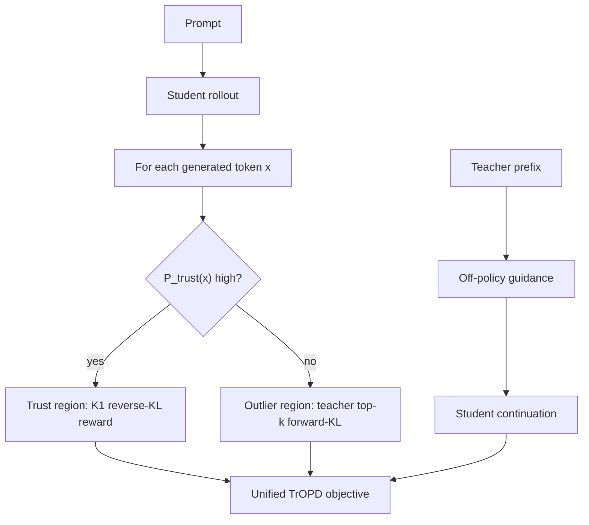
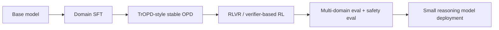

# TrOPD：把 On-Policy Distillation 的不稳定性拆到 token 级信任区域

## 元信息与 TL;DR

- 论文标题：Trust Region On-Policy Distillation
- 本轮分类：大模型后训练相关
- 论文页：[arXiv:2606.01249](https://arxiv.org/abs/2606.01249)
- PDF：[https://arxiv.org/pdf/2606.01249](https://arxiv.org/pdf/2606.01249)
- Hugging Face Paper：[https://huggingface.co/papers/2606.01249](https://huggingface.co/papers/2606.01249)
- 项目页：[Xingrun-Xing2/TrOPD](https://github.com/Xingrun-Xing2/TrOPD/tree/main)
- 作者：Xingrun Xing、Haoqing Wang、Boyan Gao、Ziheng Li、Yehui Tang
- 机构：Samsung Research Beijing、University of Oxford、Peking University
- 日期口径：arXiv v1 submitted 2026-05-31 14:04:51 UTC；当前 v2 revised 2026-06-03 04:57:08 UTC。本轮按“本周内官方修订/当前版本”收录。

### TL;DR

TrOPD 研究的是 reasoning-oriented On-Policy Distillation 的稳定训练问题。传统 off-policy distillation 让学生模型模仿 teacher 生成的轨迹，容易在长链路推理里产生 exposure bias；OPD 改为在 student 自己生成的轨迹上训练，但当 teacher 与 student 分布差异较大时，teacher 会给某些 student token 极低概率，基于 `K1` reverse-KL 的 token reward 会变成极端负值，从而制造异常策略梯度。

论文的核心方案不是简单“继续 on-policy”，而是把 student 生成 token 分成两类：teacher/student 分布接近的 token 进入 trust region，继续用 memory-efficient `K1` reverse-KL；分布错配严重的 outlier token 不再用 student-sampled token 的 RKL 梯度，而改用 teacher top-k forward-KL 近似，尽量回收 teacher 支持 token 的监督。模型还加入 teacher-prefix off-policy guidance：训练早期由 teacher 生成一段 prefix，student 接着写，prefix 长度按 cosine schedule 退火到 0，最后回到完全 on-policy。

证据上，TrOPD 在 DeepSeek-R1-Distill-Qwen-1.5B 和 Qwen3-SFT-1.7B 两类 student、数学/代码/STEM/指令多域 benchmark 上优于 OPD、EOPD、Entropy OPD、REOPOLD 等 OPD-family baseline。Qwen3 多域设置中，平均分从 OPD 的 48.29 提升到 51.73；DeepSeek 单域设置中，平均分从 OPD 的 37.11 提升到 40.63。消融显示，standalone top-k FKL 会崩到 Avg 1.40，但只在 outlier 区域使用 FKL Outlier 可到 Avg 49.00，叠加 off-policy guidance 的 TrOPD FKL 达到 Avg 49.85。

局限也很明确：这不是带有 TRPO 式严格策略改进保证的 trust region；`P_trust=min(pi_T/pi_S,1)` 是分布一致性的启发式代理，不等于“teacher 判断答案正确”。实验主要是 OPD-family 内部比较，缺少 RLVR/GRPO/PPO/SFT-only 等更广义后训练强基线；GitHub README 当前仍把模型、训练与评测代码、demo 标为 ToDo，因此不能写成完整开源可复现。

## 来源与材料地图

| 材料 | 作用 | 本轮使用方式 |
|---|---|---|
| arXiv abs/html/PDF | 日期、摘要、公式、实验表格、图 | 核对 v1/v2 时间、提取 Figure 1/2/3 与 Table 1-5 |
| Hugging Face Paper 页 | 第三方聚合与讨论信号 | 确认 paper page、关键词和相关 OPD 论文 |
| GitHub README | 项目状态与可复现性 | 确认目前仅技术报告发布，代码/模型仍在 ToDo |
| 相关工作线索 | OPD 邻近方法 | 对照 REOPOLD、AOPD、EOPD、GKD、MiniLLM、speculative KD |

### 本地化图片

- Figure 1：`/assets/2026/06/07/itm_5bee1372117e3472/figure-1.png`
- Figure 2：`/assets/2026/06/07/itm_5bee1372117e3472/figure-2.png`
- Figure 3(a)：`/assets/2026/06/07/itm_5bee1372117e3472/figure-3.png`
- Figure 3(b)：`/assets/2026/06/07/itm_5bee1372117e3472/figure-4.png`

## 1. 背景：为什么 OPD 在 reasoning 后训练里会不稳？

### 1.1 Off-policy distillation 的 exposure bias

传统 distillation 常见流程是：

1. teacher 先对训练 prompt 生成回答；
2. student 用 supervised fine-tuning 学这些 teacher trajectories；
3. 部署时 student 自己生成，遇到自己没见过的中间状态。

这对短回答或分类任务还能接受，但对 long CoT reasoning 问题很麻烦：

- teacher 轨迹与 student 轨迹不同，错误会沿推理链传播；
- student 一旦进入 teacher 训练分布之外的中间状态，后续 token 的监督会变弱；
- 生成越长，exposure bias 越容易积累。

On-Policy Distillation 的想法是：训练时就让 student 采样自己的 trajectories，再用 teacher 给这些 token/trajectory 打监督信号。这样训练分布更接近推理分布。

### 1.2 On-policy 的新问题：teacher 不一定可靠监督 student 的所有 token

OPD 的关键风险来自 teacher-student distribution mismatch：

| 情况 | 直观含义 | 训练风险 |
|---|---|---|
| `pi_T(x)` 与 `pi_S(x)` 接近 | student token 也是 teacher 支持的 token | teacher 的 token-level reward 较可靠 |
| `pi_T(x) << pi_S(x)` | student 采到了 teacher 很不认同的 token | `K1` RKL reward 可能极端负，梯度异常 |
| student 早期能力弱 | student 生成低质量 CoT | OPD 只在低质量轨迹附近探索，学不到 teacher 好轨迹 |

论文把这个问题称为 reliable on-policy token-level supervision。它不是只问“是否 on-policy”，而是问：

> student 当前采样的 token，是否处在 teacher 能给出可信监督的区域？

## 2. 公式：从 RKL 到 token-level outlier

### 2.1 基础 OPD 目标

设：

- `pi_S`：student policy；
- `pi_T`：teacher policy；
- `x ~ pi_S`：student 采样出的 token 或 trajectory。

Reverse KL distillation 可写成：

$$
D_{KL}(\pi_S || \pi_T)
=
\mathbb{E}_{x \sim \pi_S}
\left[
\log \frac{\pi_S(x)}{\pi_T(x)}
\right]
$$

训练时常等价地最大化：

$$
\log \frac{\pi_T(x)}{\pi_S(x)}
$$

这可以理解为 teacher 给 student-sampled token 的 reward：

- 如果 teacher 也认为这个 token 合理，reward 不会太差；
- 如果 teacher 几乎不给概率，reward 会非常负；
- 在 policy-gradient 形式下，这会放大成不稳定梯度。

论文指出，当 `pi_T(x)` 接近 0 时，`K1` estimator 的 policy-gradient signal 可能趋向极端：

$$
\nabla J
=
\frac{1}{\pi_S(x)}
\log \frac{\pi_T(x)}{\pi_S(x)}
\rightarrow -\infty
$$

### 2.2 为什么不能简单做 full-vocabulary KL？

Reasoning model 的输出长度很长。若序列长度为 `n`，词表大小为 `k`，full-vocabulary KL 的内存复杂度大致是：

$$
\mathcal{O}(n \cdot k)
$$

长 CoT + 大词表会让 full KL 很难承受，所以 reasoning-oriented OPD 往往依赖：

- `K1` token-level estimator；
- teacher top-k 近似；
- 只对 sampled token 或小候选集计算 KL。

这就是论文的核心工程约束：要稳定，还要低显存；不能直接回到昂贵的 full-vocab supervision。

## 3. 方法：Trust Region On-Policy Distillation

### 3.1 总体流程

TrOPD 有三个组件：

1. **Trust-region on-policy learning**：只在 teacher/student 分布较一致的 token 上使用 RKL/K1。
2. **Outlier estimation**：对 outlier 区域使用 teacher top-k FKL，而不是继续依赖不可靠 RKL 梯度。
3. **Off-policy trust-region guidance**：训练早期让 student 从 teacher prefix 后继续生成，逐步引导 student 进入 teacher 支持区域。

### 3.2 Trust region 怎么定义？

论文用类似 speculative decoding acceptance ratio 的形式定义 token 可信概率：

$$
P_{trust}(x)
=
\min
\left(
\frac{\pi_T(x)}{\pi_S(x)}, 1
\right)
$$

然后采样 mask：

$$
M_x \sim Bernoulli(P_{trust}(x))
$$

变量解释：

| 符号 | 含义 | 写作边界 |
|---|---|---|
| `M_x` | token `x` 属于 trust region | 不是“语义正确性”标签 |
| `1 - M_x` 或 `bar M_x` | token `x` 属于 outlier region | 表示 distribution mismatch 严重 |
| `pi_T/pi_S` | teacher 对 student token 的相对支持度 | 是启发式代理，不是 verifier |

这里的 trust region 不应理解成 TRPO 那类带严格单调改进保证的优化区域。它更像一种 token-level supervision reliability gating。

### 3.3 On-policy 分区目标

论文给出的 on-policy 分区目标可以整理为：

$$
J_x^{On}
=
- M_x \log \frac{\pi_S}{\pi_T}
- \bar{M}_x
\sum_{v \in V_T^k}
\pi_{T,v}
\log \frac{\pi_{T,v}}{\pi_{S,v}}
$$

也就是：

- trust region 内：仍用 `K1` reverse-KL estimator，复杂度约 `O(n)`；
- outlier region 内：用 teacher top-k vocabulary `V_T^k` 上的 forward-KL 近似，复杂度约 `O(nk)`，但 `k=64`，比 full vocabulary 可控。

### 3.4 为什么 outlier 不直接 mask 掉？

论文先比较了三种 outlier 策略：

| 策略 | 做法 | 优点 | 风险 |
|---|---|---|---|
| Mask Outlier | 异常 token 梯度置零 | 最稳，直接消除异常梯度 | 丢掉 teacher 仍可提供的部分信息 |
| Clip Outlier | 把 reward 裁到阈值 | 比 OPD 稳 | 阈值敏感，可能裁掉有用监督 |
| FKL Outlier | 在 outlier 区对 teacher top-k 做 FKL | 回收 teacher 支持 token 的监督 | top-k 近似仍有偏差，不能全局使用 |

关键发现是：standalone top-k FKL 在整个分布上使用会失败，但只在 outlier 区作为辅助估计反而有效。这说明 FKL 不是没用，而是要放在合适区域。

### 3.5 Off-policy guidance 的作用

OPD 还有一个问题：student 早期生成质量低，可能采不到 teacher 高质量轨迹附近。

TrOPD 加入 teacher prefix：

1. teacher 先生成 `x[:l]`；
2. student 从这个 prefix 后继续生成 `x[l:]`；
3. prefix 部分用 forward-KL imitation；
4. continuation 部分使用上面的 on-policy trust-region objective；
5. 最大 prefix 长度从最大训练长度开始，按 cosine schedule 退火到 0。

公式可写成：

$$
J_x
=
- \beta
KL_{x[:l] \sim \pi_T}
(\pi_T || \pi_S)
+
J_{x[l:]}^{On}
$$

其中 `beta=0.001`。直观上，它像训练早期的 teacher-supported warm start，避免弱 student 长时间困在低质量 SoG 区域。

## 4. 实验设置：哪些模型、数据和 benchmark？

### 4.1 三组 teacher-student 配置

| 设置 | Student | Teacher | 目标 |
|---|---|---|---|
| 单数学域 | DeepSeek-R1-Distill-Qwen-1.5B | Skywork-OR1-Math-7B | 数学 reasoning distillation |
| 多域 1 | DeepSeek-R1-Distill-Qwen-1.5B | Skywork-OR1-7B | math/code/STEM 多域 |
| 多域 2 | Qwen3-SFT-1.7B | Qwen3-Nemotron-4B | 更强 SFT student 的多域 OPD |

Qwen3-Nemotron-4B teacher 的附录训练信息：

- 初始化：Qwen3-4B-Base；
- SFT 数据：Nemotron 3 Nano 公开数据，清理后约 14M samples；
- SFT 设置：Adam、learning rate `5e-5`、weight decay `0.1`、warmup `10%`、batch size `512`；
- RLVR 数据：math 22,056、coding 19,169、science 19,670、instruction 16,575；
- RLVR 设置：GRPO group size `16`、batch `128`、每 2048 rollouts 更新，max length `32K`，temperature `1.0`。

### 4.2 统一训练设置

| 项 | 设置 |
|---|---:|
| OPD training steps | 200 |
| learning rate | `5e-6` |
| teacher top-k | `k=64` |
| off-policy imitation weight | `beta=0.001` |
| prompt batch size | 128 |
| rollouts per prompt | 4 |
| max generation length | 8096 tokens |
| AIME evaluation | 32 次评估平均 accuracy |

### 4.3 Benchmark 与 baseline

| 维度 | Benchmark |
|---|---|
| 数学 | AIME 2024、AIME 2025、AMC 2023 |
| 代码 | LiveCodeBench v6 |
| STEM | GPQA Diamond、MMLU-Redux v2 |
| 指令遵循 | IFBench |

Baseline 包括：

- base student；
- teacher；
- OPD；
- EOPD；
- Entropy OPD；
- REOPOLD / REOPOLD 2Stage；
- FKL、JSD、Clip Outlier、Mask Outlier、FKL Outlier；
- AOPD；
- TrOPD + AOPD。

## 5. 主结果：OPD-family 内部，TrOPD 的收益很清楚

### 5.1 DeepSeek 1.5B：单域与多域

| 设置 | 方法 | Avg | 相对 OPD |
|---|---|---:|---:|
| 单数学域 | Base | 34.69 | - |
| 单数学域 | OPD | 37.11 | 0 |
| 单数学域 | REOPOLD | 38.79 | +1.68 |
| 单数学域 | TrOPD | 40.63 | +3.52 |
| 多域 | OPD | 32.99 | 0 |
| 多域 | REOPOLD | 35.58 | +2.59 |
| 多域 | TrOPD | 37.61 | +4.62 |

单数学域 TrOPD 的分项：

| AIME 24 | AIME 25 | AMC 23 | LiveCodeBench v6 | GPQA Diamond | Avg |
|---:|---:|---:|---:|---:|---:|
| 38.54 | 32.50 | 77.03 | 18.86 | 36.24 | 40.63 |

要注意两点：

- TrOPD 不是超过 teacher；teacher 仍显著更强；
- 多域里 OPD 甚至低于 base average，说明 naive OPD 在 domain shift 下可能伤害已有能力。

### 5.2 Qwen3-SFT-1.7B：多域主结果

| 方法 | Math: AIME24 | Math: AIME25 | AMC23 | GPQA | MMLU-Redux | IFBench | LCB.v6 | Avg |
|---|---:|---:|---:|---:|---:|---:|---:|---:|
| Qwen3-SFT-1.7B | 35.41 | 26.45 | 68.90 | 25.25 | 66.60 | 26.19 | 30.29 | 39.87 |
| OPD | 48.02 | 40.72 | 81.79 | 29.80 | 68.60 | 37.07 | 32.00 | 48.29 |
| EOPD | 47.08 | 40.83 | 81.32 | 33.84 | 68.26 | 36.39 | 34.29 | 48.86 |
| Entropy OPD | 43.54 | 42.70 | 79.53 | 29.92 | 68.51 | 38.78 | 33.71 | 48.10 |
| REOPOLD | 45.62 | 42.29 | 81.64 | 30.56 | 68.30 | 36.05 | 35.43 | 48.56 |
| TrOPD | 52.08 | 44.06 | 83.04 | 35.98 | 68.74 | 42.18 | 36.00 | 51.73 |

这组是论文最强证据：

- TrOPD 相比 OPD 平均 +3.44；
- 相比 REOPOLD 平均 +3.17；
- 在 math、STEM、instruction、code 四类指标上都有提升；
- MMLU-Redux 提升较小，说明收益主要集中在推理/代码/指令类 benchmark。

## 6. 消融：哪些组件真正有用？

### 6.1 Table 1：先看 OPD 目标怎么选

| 方法 | AIME24 | AIME25 | AMC23 | Avg | 结论 |
|---|---:|---:|---:|---:|---|
| OPD (RKL) | 35.83 | 29.16 | 75.39 | 46.79 | 基础线 |
| standalone top-k FKL | 0.00 | 0.00 | 4.21 | 1.40 | 几乎训练失败 |
| JSD | 37.91 | 30.72 | 75.07 | 47.90 | 混合目标有收益 |
| Entropy OPD 20% | 35.52 | 29.06 | 73.82 | 46.13 | 高熵筛选不稳定 |
| Clip Outlier | 36.97 | 30.83 | 75.78 | 47.86 | 抑制异常梯度有用 |
| Mask Outlier | 37.08 | 30.62 | 75.46 | 47.72 | 更稳但可能丢信息 |
| FKL Outlier | 39.16 | 29.89 | 77.96 | 49.00 | outlier 内回收监督有效 |
| TrOPD | 38.54 | 32.50 | 78.51 | 49.85 | trust + outlier + guidance 最强 |

这里最重要的失败案例是 standalone top-k FKL：AIME24 和 AIME25 都是 0.00，AMC23 只有 4.21。它说明 teacher top-k FKL 是有偏近似，不能粗暴替代全局 OPD 目标。

### 6.2 Outlier objective 与 off-policy guidance

| 方法 | Outlier objective | AIME24 | AIME25 | AMC23 | Avg |
|---|---|---:|---:|---:|---:|
| OPD | RKL sampled token | 35.83 | 29.16 | 75.39 | 46.79 |
| Mask Outlier | 0 | 37.08 | 30.62 | 75.46 | 47.72 |
| Clip Outlier | tau | 36.97 | 30.83 | 75.78 | 47.86 |
| FKL Outlier | teacher top-k FKL | 39.16 | 29.89 | 77.96 | 49.00 |
| TrOPD Mask | 0 + guidance | 40.10 | 30.41 | 75.85 | 48.79 |
| TrOPD Clip | tau + guidance | 37.39 | 31.77 | 77.03 | 48.73 |
| TrOPD FKL | FKL + guidance | 38.54 | 32.50 | 78.51 | 49.85 |

消融支持三条判断：

1. 异常梯度确实是 OPD 的瓶颈之一，因为 mask/clip 都提升；
2. outlier 区不是完全无价值，因为 FKL Outlier 比 mask/clip 更好；
3. teacher-prefix guidance 与 outlier objective 互补，因为加入 guidance 后三类 TrOPD variant 都有收益。

### 6.3 与 AOPD 的关系

| 方法 | Avg | 解读 |
|---|---:|---|
| OPD | 37.11 | 基础线 |
| AOPD | 39.79 | 另一条并行 OPD 优化路线 |
| TrOPD | 40.63 | 单独强于 AOPD |
| TrOPD + AOPD | 41.67 | 两者可叠加，说明机制不完全重合 |

这个结果对后续研究有启发：OPD 稳定化可能不是单一 objective 的问题，而是多个维度叠加：

- token supervision reliability；
- positive sample selection；
- teacher prefix / behavior blending；
- reward variance reduction；
- calibration 与 confidence control。

## 7. Figure 与 Table 解读

### Figure 1：跨域收益的视觉摘要

Figure 1 展示 TrOPD、OPD、REOPOLD 与 Qwen3-1.7B 在四个指标上的对比：

- AIME25：TrOPD 44.06；
- LiveCodeBench：TrOPD 36.00；
- IFBench：TrOPD 42.18；
- GPQA：TrOPD 35.98。

它的主要作用是给出跨域提升的直观证据。但读图时不能忽略：

- teacher/base 在部分任务上仍有更高上限；
- 图展示的是作者选定设置，不是全模型全任务结论；
- GPQA 这类任务的提升幅度需要结合统计不确定性谨慎解读。

### Figure 2：方法结构图

Figure 2 把方法拆成上下两部分：

1. 上半部分是 on-policy trust region：student token 被分入 trust region 或 outlier；
2. 下半部分是 off-policy guidance：teacher draft prefix 先提供路径，student 再 continuation。

这张图的关键不是“用了两个 KL”，而是 KL 的使用位置不同：

| 区域 | 采样来源 | 目标 | 估计器 | 复杂度 |
|---|---|---|---|---|
| On-policy trust region | `x ~ pi_S` | `-KL(pi_S || pi_T)` | `log(pi_T(x)/pi_S(x))` | `O(n)` |
| On-policy outlier | `x ~ pi_S` | `-KL(pi_T || pi_S)` | teacher top-k FKL | `O(nk)` |
| Off-policy guidance | `x ~ pi_T` | `-beta KL(pi_T || pi_S)` | `beta log(pi_S(x)/pi_T(x))` | `O(n)` |

### Figure 3：entropy 与 gradient norm

Figure 3(a) 比较 entropy。作者的解释是：Mask Outlier 比 OPD 和 Clip Outlier 保留更高 policy entropy，因此更能维持探索能力。

Figure 3(b) 比较 gradient norm。Mask/Clip 的 gradient norm 低于 OPD，说明抑制 outlier token 后训练更稳定。这支持论文的问题诊断：OPD 失败不只是样本效率问题，也与 token-level 梯度异常有关。

## 8. 相关工作：它站在 OPD 哪条线上？

### 8.1 与 classic distillation 的差异

| 方法族 | 训练轨迹来源 | 主要问题 | TrOPD 的位置 |
|---|---|---|---|
| Sequence-level KD | teacher generations | exposure bias | TrOPD 转向 student-generated trajectories |
| Full-vocab OPD / GKD | student generations + full KL/JSD | 长 reasoning 显存开销高 | TrOPD 用 K1/top-k 低显存估计 |
| REOPOLD | reward clipping | 阈值敏感，可能裁掉有效监督 | TrOPD 用 trust mask + outlier FKL |
| Entropy OPD / EOPD | 高熵 token selection | 普通 token 也可能有监督价值 | TrOPD 用 teacher/student agreement 而非 entropy |
| AOPD | positive samples / objective 增强 | 与 trust region 维度不同 | TrOPD + AOPD 可叠加 |

### 8.2 Hugging Face 相关论文线索

Hugging Face paper search 显示同类方向在 2026 年很密集：

- Trust-Region Behavior Blending for On-Policy Distillation：也关注 trust region 与 early poor-quality student rollouts；
- KL for a KL：用 control variate baseline 稳定 OPD；
- Extreme Region Policy Distillation：关注 distribution mismatch 和 trust-region policy distillation；
- The Illusion of Certainty：关注 OPD 的 miscalibration。

这说明 OPD 的研究重点正在从“是否用 student rollouts”转向更细的问题：

1. student rollout 的哪些片段值得信任；
2. teacher 在哪些区域给出的监督有效；
3. 如何避免 token-level estimator 的方差、偏差和校准问题；
4. 训练早期如何从 off-policy 逐步过渡到 fully on-policy。

## 9. 审稿式质疑：这篇不能怎么解读？

### 9.1 日期口径

这篇论文的 v1 是 2026-05-31，严格按首次提交日不在 2026-06-01 到 2026-06-07 之内。它能进入本轮，是因为 arXiv 官方页面显示 v2 在 2026-06-03 修订，符合“本周内更新/官方标记当前版本”的规则。

因此，本篇不应写成“6 月 3 日首发论文”，而应写成：

- v1 submitted 2026-05-31；
- v2 revised 2026-06-03；
- 本轮按 v2 修订收录。

### 9.2 Trust region 不是正确性证明

`P_trust=min(pi_T/pi_S,1)` 衡量的是 teacher 对 student token 的相对支持度。它不是：

- 答案正确性验证器；
- 过程 reward model；
- formal safety guarantee；
- TRPO 式严格策略改进区域。

更准确的说法是：它把“teacher/student 分布一致性”当作 token-level supervision reliability 的启发式代理。

### 9.3 实验证据边界

论文证据强在 OPD-family 内部比较，但仍有缺口：

- 缺少 RLVR/GRPO/PPO/SFT-only continued training 等更广义后训练方法强基线；
- 消融主要集中在 math-domain distillation；
- 缺少 top-k、beta、prefix annealing、teacher-student gap、training steps 的系统敏感性；
- AIME 等虽报告 32 次评估平均，但没有训练多 seed 或置信区间；
- 失败案例缺少具体 bad trajectory / token-level 错误类型。

### 9.4 可复现性边界

项目 README 当前 ToDo 包括：

- Release Huggingface models；
- Training and evaluation code；
- Demos and applications。

所以当前更适合说“发布了技术报告与项目页”，不能说“训练代码和模型已完整开源”。

## 10. 对 Daily Report 读者的价值

### 10.1 方法价值

这篇论文值得跟踪，是因为它把 OPD 的不稳定性拆得很细：

| 传统问题表述 | TrOPD 的细化 |
|---|---|
| OPD 不稳定 | 哪些 token 的 teacher supervision 不可靠？ |
| RKL 梯度异常 | distribution mismatch 导致 `pi_T(x) << pi_S(x)` |
| FKL 近似会失败 | standalone top-k FKL 失败，但 outlier-only FKL 有用 |
| student 早期探索差 | teacher prefix guidance 逐步退火 |

这对小 reasoning model 后训练很实用。训练小模型时，teacher 越强、student 越弱，分布错配越明显；直接把所有 student token 都交给 teacher reward，可能不是最稳的做法。

### 10.2 为什么这不是普通 reward clipping？

REOPOLD 这类 clipping 方法的思路是：当 token reward 太极端时，把它截断到一个阈值。这个思路有效，但它把两个问题混在了一起：

1. 某个 token 的梯度太大，应该降低数值影响；
2. 某个 token 所在区域本身不适合继续用 student-sampled RKL 估计。

TrOPD 的区别在于先判断区域，再换估计器：

| 问题 | Clipping 的处理 | TrOPD 的处理 |
|---|---|---|
| 极端负 reward | 截断 reward | 先判断是否 outlier |
| teacher/student 分布错配 | 仍沿用 RKL 语义 | outlier 区改用 teacher top-k FKL |
| 有用 teacher 信号 | 可能一起被裁掉 | 尝试在 teacher top-k 上回收 |
| 超参依赖 | clipping threshold 很关键 | top-k、beta、annealing 仍关键，但语义更分区化 |

这个差异决定了它的实验解读方式。若只看最终平均分，TrOPD 像是“更好的 clipping”；若看 objective，它其实是在问：

> 当 sampled token 不可信时，我们是否应该停止从 student token 本身估计 teacher reward，转而从 teacher 支持集合抽取监督？

这也是 Table 1 中 standalone FKL 失败但 FKL Outlier 成功的含义。FKL 不是天然适合 OPD，而是在 outlier 区域承担“恢复 teacher 支持 token 信息”的局部角色。

### 10.3 与同周 OPD 候选的关系

候选侦察还发现了同周另一篇 OPD 论文：Filter, Then Reweight: Rethinking Optimization Granularity in On-Policy Distillation。它的方向同样是 OPD 粒度优化，但 TrOPD 更强调 teacher/student 分布错配下的 token-level trust region。

可以把本周 OPD 线索整理成一个趋势：

| 研究问题 | 典型方向 | TrOPD 的对应 |
|---|---|---|
| 哪些样本参与训练？ | filter / positive sample / curriculum | teacher-prefix guidance 改善早期样本质量 |
| 哪些 token 值得信任？ | token filtering / entropy selection | `P_trust=min(pi_T/pi_S,1)` |
| 极端梯度怎么处理？ | clipping / variance reduction | trust mask + outlier FKL |
| on-policy 与 off-policy 如何过渡？ | behavior blending / prefix annealing | teacher prefix 退火到 fully on-policy |

这条线值得持续追踪，因为 post-training 的讨论正在从“RLVR 是否有效”变成更细的工程问题：

- rollout 是谁生成的；
- reward 或 KL 在哪个状态分布上估计；
- 估计器是否低显存；
- 错误 token 是否被裁掉、mask 掉，还是换一种 supervision；
- 训练早期和训练后期是否应该使用同一策略。

### 10.4 如果要复现实验，应先验收哪些指标？

论文当前代码/模型还没完整发布。等仓库补齐后，不应只跑最终 benchmark，而要先验收训练过程信号：

| 监控项 | 为什么重要 | 预期现象 |
|---|---|---|
| outlier token ratio | 判断 student 是否逐渐进入 teacher 支持区域 | 随训练下降或趋稳 |
| trust-region loss | 检查 RKL/K1 是否稳定 | 不应频繁尖峰 |
| outlier FKL loss | 检查 teacher top-k 监督是否有效 | 不应长期为 0 或爆炸 |
| gradient norm | 对应 Figure 3(b) | TrOPD variant 应低于 vanilla OPD |
| entropy | 对应 Figure 3(a) | 不应过早 entropy collapse |
| prefix length schedule | 验证 off-policy guidance 退火 | 从 teacher-guided 过渡到 on-policy |
| benchmark variance | 判断小幅提升是否稳健 | 至少多 seed 或 bootstrap CI |

这里最容易出问题的是 outlier FKL 的数值实现。标准 KL 在 student 对 teacher top-k token 给极低概率时可能很大，论文文本中关于极端区域抑制的解释需要实现细节支撑。复现时应检查：

1. `pi_S(v)` 是否做了 epsilon floor；
2. top-k 概率是否重新归一化；
3. mask 是否 detach；
4. teacher logits 是否缓存；
5. mixed precision 下 log-ratio 是否溢出；
6. FKL loss 权重是否与 RKL loss 同量级。

### 10.5 对训练管线的决策建议

如果团队正在做 small reasoning model 后训练，这篇论文给出的不是“一步替换所有 RL”的结论，而是一个可插拔模块清单：

1. **先保留强 SFT 基线**：Qwen3-SFT-1.7B 的 base 已经有 39.87 Avg，OPD 是在这个基础上继续提升。
2. **再比较 OPD-family**：vanilla OPD、REOPOLD、Entropy OPD、TrOPD 应在统一 prompt、rollout、eval 下比较。
3. **最后接入 RLVR/GRPO**：TrOPD 论文没有覆盖更广义 RL 后训练强基线，实际管线仍要比较 RLVR。
4. **不要只看平均分**：需要同时看数学、代码、指令、STEM，避免某一域提升掩盖另一域退化。
5. **记录训练成本**：top-k FKL 虽比 full KL 轻，但 outlier 区域仍是 `O(nk)`，长输出下成本不可忽略。

更现实的使用方式可能是：

TrOPD 可以放在 SFT 与 RLVR 之间，也可以作为 RL 前的 distillation warmup。它的价值是让 student 更稳定地靠近 teacher reasoning distribution，而不是替代所有后训练阶段。

### 10.6 这篇论文的产品含义

对产品团队来说，TrOPD 的直接意义不是“做一个新模型”，而是降低小模型推理能力蒸馏的失败率。

可能受益的场景包括：

- 端侧或低成本 reasoning assistant；
- coding assistant 的小模型补全/解释模式；
- 企业内部多域问答模型；
- teacher 昂贵、student 便宜的部署架构；
- agent 系统中作为 planner 或 verifier 的小 reasoning model。

但产品化仍缺三类证据：

1. **实际延迟和成本**：论文报告 benchmark 分数，不报告完整训练/推理成本曲线。
2. **部署任务**：论文自己承认缺少 practical deployment/application studies。
3. **安全与可靠性**：OPD 提升 reasoning benchmark，不等于提升事实性、安全性或工具使用可靠性。

因此，日报读者应把它视为后训练方法进展，而不是可直接上线的模型发布。

### 10.7 工程启发

如果要把这类思想迁移到实际后训练管线，可以优先关注：

1. 记录 token-level `pi_T/pi_S` 分布，观察 outlier 比例是否随训练下降；
2. 分开监控 trust region 与 outlier region 的 loss/gradient norm；
3. 对 teacher-prefix guidance 做退火实验，不要固定 teacher forcing；
4. 把 full FKL、top-k FKL、sampled RKL 的显存与性能做统一 profiling；
5. 对小幅提升的 benchmark 加多 seed 和置信区间。

### 10.3 后续追踪问题

- 训练代码发布后，`P_trust` 的 Bernoulli sampling 是否稳定，还是会引入额外方差？
- top-k `k=64` 是否对不同 teacher/student gap 都合适？
- outlier FKL 在 `sum pi_S(v) -> 0` 时的实现细节如何避免数值异常？
- teacher prefix annealing 的 schedule 是否是关键超参？
- 如果 teacher 本身会犯 reasoning 错，trust region 会不会强化 teacher 的错误模式？
- TrOPD 能否与 RLVR/GRPO 组合，而不只是与 AOPD 组合？

## 11. 一句话记忆卡

| 问题 | 答案 |
|---|---|
| 它解决什么？ | reasoning OPD 中 teacher/student 分布错配导致 token-level RKL 梯度异常 |
| 它怎么做？ | trust region 内用 K1 RKL，outlier 区用 teacher top-k FKL，再加 teacher-prefix guidance |
| 证据是什么？ | DeepSeek/Qwen 两类 student，多域 benchmark 中优于 OPD/EOPD/REOPOLD |
| 最重要数字 | Qwen3 多域 Avg 48.29 -> 51.73；DeepSeek 单域 Avg 37.11 -> 40.63 |
| 最重要失败案例 | standalone top-k FKL 崩到 Avg 1.40 |
| 最大局限 | 不是形式化 trust-region guarantee，缺少广义 RL baseline、代码模型完整发布和部署研究 |

## 12. 读表时最容易踩的坑

### 12.1 平均分上涨，不等于所有能力同步上涨

TrOPD 的平均分很亮眼，但每个 benchmark 的解释权重不同。比如 Qwen3 多域设置中，MMLU-Redux 从 OPD 68.60 到 TrOPD 68.74，提升很小；真正拉开差距的是 AIME24、GPQA、IFBench 和 LiveCodeBench。

这意味着它更像 reasoning/code/instruction 型后训练稳定器，而不是一个全面提升所有通用知识能力的 recipe。日报读者如果只看 Avg，容易误解为“所有域都大幅提升”。

更稳妥的读法是：

- 数学：提升最清晰，尤其 AIME24；
- 代码：LiveCodeBench 有提升，但幅度不如数学；
- 指令：IFBench 提升明显，说明 teacher-prefix guidance 可能帮助 instruction following；
- 通用知识：MMLU-Redux 几乎持平，不能宣称通用能力大幅增强；
- STEM：GPQA 有提升，但缺少置信区间，需等待复现。

### 12.2 Teacher 很强，不代表 student 能接近 teacher

表格里 teacher 分数远高于 student：

| 设置 | Teacher Avg | TrOPD Avg | 差距 |
|---|---:|---:|---:|
| DeepSeek 单域 | 58.48 | 40.63 | 17.85 |
| DeepSeek 多域 | 58.80 | 37.61 | 21.19 |
| Qwen3 多域 | 73.43 | 51.73 | 21.70 |

所以 TrOPD 的贡献不是“把小模型蒸馏到 teacher 水平”，而是在受限步骤、受限 top-k、受限 student capacity 下，让 OPD 不那么容易被异常 token 拖垮。

这对产品判断很重要。若目标是低成本部署，小模型仍可能离 teacher 很远；TrOPD 只是降低蒸馏损失，不自动消除模型容量差距。

### 12.3 训练 200 steps 的结论不能外推到长期训练

论文统一训练 200 steps，这有利于公平比较 OPD-family baseline，但也带来外推限制：

1. 如果训练更久，vanilla OPD 是否会追上？
2. 如果使用更大 prompt pool，outlier 比例是否变化？
3. 如果 student 更小或 teacher 更大，trust region 是否会过窄？
4. 如果加入 mid-training，TrOPD 的相对收益是否仍然存在？

这些问题会影响实际管线。短训练中的稳定器，可能在长训练中变成保守约束；也可能因为持续减少异常梯度而更有价值。当前论文不足以回答，需要后续 ablation。

### 12.4 “可靠监督”是局部概率判断，不是人类标准

论文使用 teacher/student agreement 来近似监督可靠性。这在工程上合理，因为 teacher 对某个 token 支持越高，说明 teacher 更愿意沿这条局部路径继续；但它不能覆盖以下情况：

- teacher 高概率输出错误推理模板；
- teacher 与 student 在同一错误模式上达成一致；
- token 局部合理，但整条 reasoning trajectory 最终错误；
- teacher 偏好简短答案，而 benchmark 需要更长推导；
- teacher 在安全、事实性或格式上有系统偏差。

因此，TrOPD 更像 token-level optimization stabilizer，而不是 correctness verifier。若要用于高风险任务，还需要外部 verifier、过程奖励、单元测试、形式化检查或人工审计。

### 12.5 真正值得复现的是训练曲线，不只是最终表格

如果只复现 Table 3 或 Table 4，可能无法判断方法是否真的稳定。更有价值的是把训练过程曲线画出来：

- OPD、Clip、Mask、TrOPD 的 gradient norm；
- outlier ratio 随 step 的变化；
- trust-region token 的平均 reward；
- outlier FKL loss 的有效 token 数；
- teacher prefix 长度退火过程；
- 每个 benchmark 的中间 checkpoint 分数。

这些曲线能回答一个关键问题：

> TrOPD 是从一开始就更稳，还是只是在最后几个 checkpoint 更高？

如果前者成立，它适合作为生产训练 recipe；如果后者成立，它可能更像调参后获得的局部优势。

最后还要复核数据污染：teacher 与 student 的训练数据、benchmark 题目、prompt pool 是否存在交叉，否则小幅收益可能被高估。

## 结论

TrOPD 的贡献可以概括为一句话：

> 它把 reasoning OPD 的训练稳定性问题，从“选择哪种 KL objective”推进到“在不同 token 可靠性区域使用不同监督估计器”。

它的证据足以说明：在作者的 OPD-family 设置中，trust-region gating、outlier FKL 和 teacher-prefix guidance 的组合，比 vanilla OPD、entropy filtering 和 reward clipping 更稳定、更有效。

但它还不是后训练全局答案：

- 它没有证明 trust region 的形式化策略改进；
- 它没有覆盖 RLVR/GRPO/PPO 等强后训练基线；
- 它还缺少完整代码/模型发布和部署研究；
- 它的最佳使用方式，可能是作为 OPD 稳定化组件，叠加到更完整的 small reasoning model 训练 pipeline 中。
