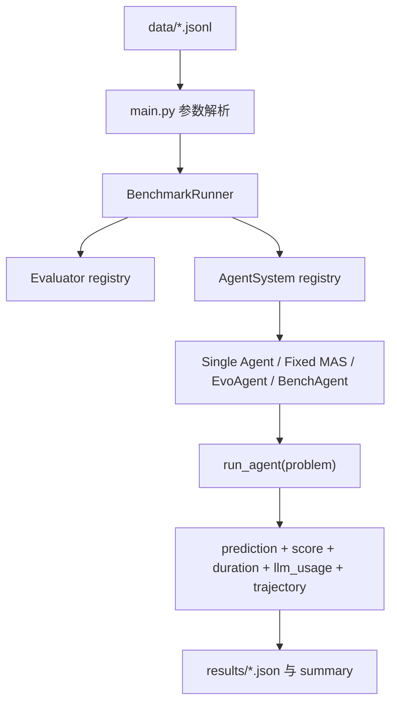

# Do More Agents Help?：多 Agent 真的帮忙，还是只是在增加协议噪声？

### 元信息

- 原文：Yuhang Fu 等，**Do More Agents Help? Controlled and Protocol-Aligned Evaluation of LLM Agent Workflows**
- 类型：arXiv 论文 + 开源代码项目
- 日期：2026-06-04 提交；代码仓 `BenchAgent` 分支最近提交为 2026-06-05
- 主题：LLM Agent workflow、多 Agent 系统、协议对齐评测、GAIA、工具使用、轨迹日志
- 代码：作者在 arXiv comments 指向 `LINs-lab/MASArena/tree/BenchAgent`

### TL;DR

- 这篇论文问了一个很具体的问题：**当 benchmark loader、工具访问、答案格式、token 统计、超时、日志和 evaluator 都对齐以后，增加更多 Agent 是否仍然带来稳定收益？**
- 作者提出 **BenchAgent**，把单 Agent、固定多 Agent、演化式多 Agent 放进同一套 substrate-internal，简称 SI，协议里比较；另把 Claude-Code-style runtime workflow 放进 protocol-aligned external，简称 PAE，协议里比较。
- SI 主实验覆盖 10 个 benchmark：MATH、AIME、GSM8K、DROP、BBH、MMLU-Pro、HumanEval、MBPP、HotpotQA、IFEval。主模型是 GPT-4.1，所有结果是单次 pass@1。
- 主结果很克制：单 Agent 平均准确率 **74.12%**；六个 MAS 里只有 EvoAgent 到 **75.56%**，高出 **1.44 点**，但这个差距小于作者用 Wilson 95% 区间给出的单次实验解释尺度。其余 MAS 低 **2.56 到 11.29 点**。
- 成本差异比准确率更尖锐：ChatEval 平均 token 用量 **105,838.02**，但平均准确率只有 **68.84%**；Camel、Jarvis 更便宜更快，却明显低于单 Agent。多 Agent 不是免费组合。
- GAIA 的 PAE 实验显示另一面：Claude-Code-style runtime workflow 总体 **66.72%**，Level 3 为 **69.23%**，比最强非 Claude 基线 Jarvis 总体高 **20.06 点**，Level 3 高 **42.31 点**。
- 作者没有把 GAIA 优势归因给“Agent 更多”。他们强调 runtime-generated workflow 同时混合了动态分工、状态文件、验证门、工具权限、上下文边界和 provider bookkeeping，缺少消融前不能宣称单一机制有效。
- 最值得带走的判断是：**Agent 数量不是解释变量，workflow 与任务错误模式是否匹配才是解释变量**。可验证任务可能受益于 debate；指令跟随可能受益于 judge；长程工具任务更依赖状态保持、证据固化和最终验证。

### 研究问题：为什么“多 Agent 是否有效”不能直接用排行榜回答？

作者的切入点不是重新发明一个 Agent，而是拆掉一个常见混淆：

- 一个系统更准，可能因为 workflow 更好。
- 也可能因为它拿到了更多工具。
- 也可能因为它的答案格式更宽松。
- 也可能因为 evaluator 不同。
- 也可能因为日志里没有记录失败成本。
- 还可能因为多轮 handoff 把约束丢了，但最终答案看不出中间哪里坏了。

所以论文把目标定义为 **workflow lift**：

```text
给定同一 benchmark instance x：

workflow w 产生最终答案 y_hat = w(x)
evaluator E(x, y_hat) 给出 0/1 成功信号
trace tau_w(x) 记录模型调用、工具调用、消息、artifact、终止事件
cost c(tau_w) 记录 token、latency、tool calls、delegation structure

workflow lift = 在 base model、loader、tool interface、answer contract、
evaluator、accounting substrate 固定时，用 MAS 替换单 Agent 后的 accuracy/cost 变化。
```

这个定义的关键是：**比较对象不是“产品 A vs 产品 B”，而是“同一执行底座上的 workflow organization 变化”**。

### 论文主张与论证路线

| Claim | Mechanism | Evidence | Boundary |
|---|---|---|---|
| 单纯增加 Agent 不保证收益 | 把单 Agent、固定 MAS、演化 MAS 放在同一 BenchAgent substrate 中比较 | Table 1：六个 MAS 只有 EvoAgent 平均准确率略高单 Agent，且只高 1.44 点 | 单次 pass@1；不是所有可能单 Agent 或所有可能 MAS 的最终定论 |
| 成本和延迟必须和准确率一起看 | 每个实例记录 token、wall-clock time、trajectory | Figure 2：相近准确率对应巨大 token/latency 差异；ChatEval token 最高但不领先 | token 统计依赖日志可见性；不同 provider bookkeeping 可能不完全等价 |
| MAS 收益是任务依赖的 | 不同协议匹配不同 error mode | EvoAgent 在 BBH 明显高；LLM-Debate 在 HumanEval/MATH 强；ChatEval 在 IFEval 强 | 聚合平均会掩盖 task-level 差异；需要更多重复实验 |
| runtime-generated workflow 在 GAIA 长程任务上更强 | 动态创建子 Agent、保持证据 artifact、验证后再 final answer | Table 2：CC-workflow 总体 66.72%，Level 3 69.23%；Figure 3 展示同题状态保持差异 | PAE 不是 SI；不能把优势归因给某一个机制 |
| 评测 Agent 必须记录轨迹 | final answer 会隐藏约束丢失、工具失败、强行作答 | Figure 3：EvoAgent 线性 handoff 丢掉 “dual James Beard” 约束；CC-workflow 通过 plan/solve/log/verify 保持状态 | retained traces 只是部分可见证据，不等于完整内部机制 |

### 方法机制：BenchAgent 到底控制了什么？


Figure 1 的作用不是装饰，而是在说明一个评测边界：

- benchmark instance 进入同一个 loader；
- 工具访问通过同一个 tool interface；
- answer formatting 经过同一个 final-answer contract；
- usage accounting 和 trajectory logging 同步记录；
- evaluator 调用被固定；
- 只有 workflow layer 改变。

作者把 workflow 分成四类：

| 类型 | 形式化直觉 | 论文中的角色 |
|---|---|---|
| Single-agent workflow | `|A_t| = 1`，一个控制器维护整个 trace | BenchAgent Core，作为 SI 锚点 |
| Fixed MAS | 执行前固定 `A, G, T`，即 Agent 集合、拓扑、工具范围 | Jarvis、LLM-Debate、AutoGen、CAMEL、ChatEval |
| Evolving MAS | 在设计者给定的 workflow family 里选择或变异 `G` | EvoAgent |
| Runtime-generated workflow | 运行时改变 `A_t, G_t, T_t`，可创建任务专属 Agent、私有上下文和验证分支 | Claude-Code-style workflow，只做 PAE |

这里有一个重要选择：**Claude Code 没有被强行重写成 BenchAgent 内部模块**。

- 如果强行重写，可能破坏它真实 runtime 的语义。
- 所以作者把它放在 PAE：输入、答案 schema、evaluator、模型 family、GAIA 工具能力类别尽量对齐。
- 但 controller 内部细节只通过保留 trace 部分可见。

这个选择让论文避免了一个常见错误：把不对称系统硬塞进同一个 leaderboard，然后假装比较完全公平。

### 工程实现：代码仓里能看到哪些边界？

作者的 `MASArena` 仓库把论文里的 substrate 落到了比较清楚的工程结构上：

- `run_benchmark.sh` 是官方入口，默认用 `uv run python main.py`。
- `main.py` 暴露 benchmark、agent-system、data、model、pass_at_k、tools、memory、timeout、concurrency 等参数。
- `BenchmarkRunner` 做统一数据加载、key normalization、异步执行、timeout、score、duration、usage、result JSON 输出。
- `mas_arena/agents/base.py` 定义所有 AgentSystem 必须实现 `run_agent(problem)`，并统一 token usage、agent interaction、trajectory 保存逻辑。
- `mas_arena/agents/bench_agent.py` 的 BenchAgent 是两层结构：
  - manager `CodeAgent`：负责规划、代码执行、工具选择、综合；
  - `search_agent` `ToolCallingAgent`：负责 web search、browser、Wikipedia 等信息获取；
  - 工具通过字符串配置展开，例如 `python_interpreter`、`search`、`browser`、`wikipedia`、`final_answer`；
  - 每次运行通过同一 final answer contract 返回，并记录 manager/search steps。

这个代码结构解释了论文里的“shared substrate”不是抽象口号：



### 实验设置：数据、工具、模型和不确定性怎么处理？

作者没有只报一个平均数，而是把实验设置拆得比较细。

| 维度 | 设置 |
|---|---|
| Broad SI benchmark | MATH、AIME、GSM8K、DROP、BBH、MMLU-Pro、HumanEval、MBPP、HotpotQA、IFEval |
| GAIA PAE | GAIA validation，全量 165 个任务，Level 数量为 53、86、26 |
| 采样 | 大于 400 的 split 用固定随机种子抽 400；小于等于 400 的 split 全量评测 |
| 主模型 | GPT-4.1，论文标明 `gpt-4.1-2025-04-14` |
| 解码设置 | appendix 写明 `MAX_TOKEN_SIZE=8192`、temperature 0.2、top_p 1.0 |
| 工具 | 多数 broad benchmark 只给 `python_interpreter`；HotpotQA 和 GAIA 给 expanded full tool registry |
| 结果 | 单次 end-to-end pass@1 |
| 不确定性 | 用 Wilson 95% binomial interval half-width 作为单次结果解释尺度 |

Wilson 指引在这里特别关键。作者不是说 EvoAgent 的 75.56% 一定强于 74.12%，而是说：

- 如果 split 很小，单次 pass@1 差距可能只是抽样波动。
- AIME 只有 30 题，最大 half-width 约 **16.8 点**。
- GAIA Level 3 只有 26 题，最大 half-width 约 **17.9 点**。
- 低于这个尺度的差距，不应被读成稳定排序。

公式直觉可以写成：

```text
观测成功率 p_hat = k / n
Wilson 区间给出 success probability 的保守范围

如果两个 workflow 的 pass@1 差距 < 对应 split 的 Wilson half-width，
论文只把它当作 descriptive gap，而不是稳定胜负。
```

### 主结果一：SI 条件下，多 Agent 没有稳定压过单 Agent

Table 1 的 benchmark-balanced 平均准确率如下：

| Workflow | 类型 | Avg. Acc. | Avg. Tok. | Avg. Time | 解读 |
|---|---:|---:|---:|---:|---|
| Single Agent | 单 Agent | 74.12% | 27,434.55 | 106.29s | 匹配锚点 |
| EvoAgent | 演化 MAS | 75.56% | 34,153.68 | 82.76s | +1.44 点，但在 Wilson 指引内 |
| LLM-Debate | 固定 MAS | 71.56% | 36,669.25 | 26.63s | 在可验证任务上有亮点，平均不领先 |
| ChatEval | 固定 MAS | 68.84% | 105,838.02 | 56.08s | IFEval 强，但 token 极高 |
| Jarvis | 固定 MAS | 66.90% | 9,668.33 | 11.20s | 轻量快速，但准确率低 |
| Camel | 固定 MAS | 66.37% | 8,470.19 | 15.75s | 低成本、低准确率 |
| AutoGen | 固定 MAS | 62.83% | 13,603.05 | 14.22s | broad suite 平均最低 |

这个表支持两个结论：

- **多 Agent 不是平均意义上的强优势**：五个固定/演化 MAS 在平均准确率上低于单 Agent。
- **成本曲线不能省略**：ChatEval 的 token 是单 Agent 的约 3.86 倍，但准确率更低；EvoAgent 稍高准确率也伴随更高 token。


Figure 2 的证据功能是把“准确率差一点”变成“成本差很多”：

- 如果只看 Avg. Acc.，可能会觉得 68% 到 75% 都在一个区间。
- 如果加入 token 和 time，workflow 的工程性质完全不同。
- 这对 Agent 评测尤其重要，因为 handoff、debate、judge、aggregation 都会制造额外模型调用。

### 主结果二：MAS 的有效性取决于任务错误模式

论文没有停在“多 Agent 无效”这种粗暴结论。更准确的说法是：

> MAS 只有在协议匹配任务错误模式时才有收益。

可从 Table 1 读出几个例子：

- **EvoAgent 在 BBH 上很强**：
  - Single Agent：78.25%
  - EvoAgent：94.00%
  - 作者解释为 prompt-scaffold search 找到了更合适的推理模式。
- **LLM-Debate 在 HumanEval 和 MATH 上较强**：
  - HumanEval：93.89%，高于 Single Agent 的 84.73%。
  - MATH：69.34%，高于 Single Agent 的 66.75%。
  - 这些任务的候选答案更容易检查，debate/proposal aggregation 能发挥作用。
- **ChatEval 在 IFEval 上明显强**：
  - ChatEval：84.25%
  - Single Agent：62.75%
  - 多 judge 式结构可能更适合逐条核对指令。
- **同一机制也会失败**：
  - ChatEval 在 AIME 只有 3.33%。
  - AutoGen 平均最低。
  - Jarvis/Camel 虽然便宜，但整体准确率明显低。

所以论文真正反对的是“Agent count scaling”的朴素直觉：

```text
错误直觉：更多 Agent -> 更多视角 -> 更高准确率

论文给出的替代表达：
workflow protocol 是否匹配 task error mode
  -> 匹配：可能提高可检查性、搜索多样性、指令核对
  -> 不匹配：可能压缩上下文、丢失约束、增加 token、制造强行作答
```

### 主结果三：GAIA 上 runtime-generated workflow 是另一类问题

GAIA validation 的 PAE 结果如下：

| Workflow | 类型 | L1 | L2 | L3 | Overall | Avg. Tok. | Avg. Time |
|---|---:|---:|---:|---:|---:|---:|---:|
| CC-workflow | Runtime-generated | 60.78% | 69.62% | 69.23% | 66.72% | 52,984.69 | 134.90s |
| Jarvis | 固定 MAS | 66.03% | 43.02% | 19.23% | 46.66% | 332,285.96 | 402.11s |
| Camel | 固定 MAS | 54.90% | 34.00% | 26.92% | 39.60% | 468,587.39 | 387.42s |
| ChatEval | 固定 MAS | 49.02% | 34.88% | 26.92% | 38.17% | 1,886,517.67 | 443.76s |
| Single Agent | 单 Agent | 58.82% | 30.00% | 19.23% | 37.56% | 459,652.83 | 213.33s |
| LLM-Debate | 固定 MAS | 52.94% | 34.00% | 15.38% | 37.15% | 414,812.44 | 201.53s |
| EvoAgent | 演化 MAS | 54.90% | 30.00% | 19.23% | 36.30% | 1,573,918.58 | 325.04s |
| AutoGen | 固定 MAS | 56.60% | 30.00% | 11.54% | 35.64% | 383,190.65 | 188.98s |

最重要的不是 L1，而是 L2/L3：

- L1 上 Jarvis 还高于 CC-workflow。
- L2 上 CC-workflow 领先 Jarvis **26.60 点**。
- L3 上 CC-workflow 领先 Jarvis **42.31 点**。
- 论文把 GAIA 解释为多步检索、文件检查、状态保持、延迟 final answer 的压力测试。

这说明长程工具任务的问题不只是“需要多个角色”，而是：

- 谁保存任务约束？
- 谁保存中间证据？
- 谁决定何时可以 final answer？
- 工具失败后是重试、换路径、还是强行回答？
- 子任务之间传递的是压缩自然语言，还是可审计 artifact？

### Figure 3：同一题里，handoff 为什么会丢约束？


Figure 3 是全文最有解释力的图之一。它比较了一个 GAIA 任务：

- 任务要求识别 Ali Khan 的 TV show、restaurant，以及两位 James Beard Award winners 推荐的书。
- EvoAgent 线性拆解成 Show、Resto、Book。
- 中间 search/action 过程出现 timeout、mutation、NoneType 等问题。
- 最终输出了一个看似合理但没有满足“双 James Beard 推荐”硬约束的答案。

CC-workflow 的 retained trace 展示了不同路径：

- Team-Lead/Planner 保存全局任务合同。
- Solver 输出 candidates、evidence、uncertainty，而不是直接 final answer。
- Writer 把结构化证据链写成日志 artifact。
- Verifier 在 final answer 前做约束验证。
- 工具参数错误被局部修复，通过读日志 fallback 继续验证。

这张图支撑的不是“Claude Code 一定更好”，而是更窄的机制判断：

- 固定/演化 MAS 的线性 handoff 容易把约束压缩掉。
- runtime workflow 如果有状态池、artifact 和 verifier gate，失败更可能停留在局部。
- 但这些机制是混在一起出现的，仍需要消融才能分清贡献。

### 算法流程：一个更可复现的 workflow 评测应该怎样跑？

论文没有给出传统算法伪代码，但可以从 protocol 抽象出评测流程：

```text
Input:
  D = benchmark instances
  W = workflows: single-agent, fixed MAS, evolving MAS
  M = fixed backend model
  T = benchmark-specific tool regime
  E = evaluator

State:
  result_table = []
  trace_store = []

For each workflow w in W:
  For each instance x in D:
    1. Normalize x using the shared benchmark loader.
    2. Expose the same answer contract and allowed tool regime T.
    3. Run workflow w with model M.
    4. Record trace tau_w(x):
       - messages
       - tool calls
       - token usage
       - wall-clock time
       - termination state
    5. Score final answer y_hat with evaluator E.
    6. Append accuracy, cost, latency, error state.

Output:
  - benchmark-level pass@1
  - benchmark-balanced average accuracy
  - token/time summaries
  - workflow lift against single-agent anchor
  - trace examples for failure analysis

Failure boundary:
  If protocol fields differ, move the comparison from SI to PAE.
  If trace visibility is partial, do not infer single-mechanism causality.
```

这个流程的价值在于，它把 Agent 研究中经常模糊的“系统表现”拆成三个层次：

- **score**：最终答对了吗？
- **cost**：答对或答错花了多少？
- **trace**：错在哪里，约束是否在 handoff 中消失？

### 相关工作位置：它不是又一个 benchmark，而是 workflow 对齐层

论文把自己放在几个方向之间：

- ReAct、Toolformer、WebGPT、SWE-agent、HuggingGPT/JARVIS 证明单控制器 + 工具也可以是强 workflow。
- CAMEL、MetaGPT、AutoGen、LLM-Debate、ChatEval 代表不同固定 MAS 协议。
- AgentVerse、EvoAgent、ADAS、AFlow、Magentic-One、MaAS、MASPO 等代表动态或演化 workflow。
- AgentBench、GAIA、WebArena、SWE-bench、ToolBench、Silo-Bench 提供任务或环境。
- Harbor 强调 sandboxed agent/model 评估。
- BenchAgent 的定位是：**不定义新任务，而是在既有任务上对齐跨 workflow 范式的执行协议**。

这个定位很清楚，也限制了论文的贡献边界：

- 它不是证明单 Agent 永远优于多 Agent。
- 它不是证明 Claude-Code-style workflow 的某个组件独立有效。
- 它是提供一种评测语法，让后续论文可以更精确地说“我改的是 workflow，不是工具、evaluator 或答案 contract”。

### 证据边界与局限

作者自己列出的局限值得认真保留：

- Broad benchmark 里的 MAS 是 re-instantiation，不是每个原系统的完全官方复现。
- CC-workflow 是外部 runtime exemplar，不能完全暴露内部 controller。
- GAIA 优势可能混合了 workflow generation、context compaction、file/shell tooling、permission scoping、provider bookkeeping。
- 所有主结果都是单次 pass@1，需要 repeated trials。
- retained traces 只暴露部分内部过程。
- 需要更严格的 tool-surface matched ablation、controller-sensitivity check、runtime-workflow ablation。

我会再加一个阅读上的边界：

- 论文把 single-agent anchor 设计成 BenchAgent Core，而不是“世界上最强单 Agent”。
- 因此它回答的是 **在这个 shared substrate 里改成 MAS 是否带来 workflow lift**。
- 它不回答“如果单 Agent 也有同样成熟的 artifact、verifier、permission 和 context packing，会怎样”。

这也是为什么 GAIA PAE 的结果很有启发，但还不能当成因果结论。

### Detail inventory：这篇论文真正可复用的细节清单

为了避免把论文读成一句“多 Agent 不一定好”，这里把可复用细节按研究变量整理出来。

| 细节类型 | 论文中给出的具体内容 | 为什么重要 |
|---|---|---|
| 方法名 | BenchAgent、Substrate-Internal、Protocol-Aligned External、workflow lift | 这些词把“系统比较”变成“协议边界内的 workflow 比较” |
| Agent 范式 | Single-agent、Fixed MAS、Evolving MAS、Runtime-generated workflow | 说明 Agent 数量只是表象，真正变量是运行时拓扑和工具边界 |
| 模型设置 | GPT-4.1；appendix 给出 max token、temperature、top_p | 使结果不被模型版本和采样设置完全混淆 |
| 数据规模 | Broad suite 多数 400 题；AIME 30；HumanEval 131；MBPP 341；GAIA 165 | 小样本 benchmark 的单次胜负必须谨慎解释 |
| 工具面 | 多数 broad benchmark 只给 python interpreter；HotpotQA/GAIA 给 full registry | 工具能力如果不对齐，workflow lift 会被工具优势污染 |
| 主指标 | pass@1、benchmark-balanced average accuracy、token、time | 让准确率和成本同时进入判断 |
| 统计解释 | Wilson 95% half-width 只作为单次结果解释尺度 | 防止把 1 到 2 点差距说成稳定排序 |
| 失败证据 | Figure 3 的同题 trace 对比 | final answer 无法暴露约束在 handoff 中何时丢失 |
| 代码证据 | `BenchmarkRunner`、`AgentSystem`、`BenchAgent`、evaluator registry | 说明统一协议在仓库里有可执行结构 |
| 尚缺证据 | runtime workflow 的机制消融、重复实验、完整内部 trace | 限定 GAIA PAE 结果的因果解释范围 |

### 细读一：为什么 loader、answer contract 和 evaluator 必须同时固定？

Agent 论文里最容易出现的混淆，是把“更宽松的输入输出协议”误读成“更强的 workflow”。这篇论文反复强调 loader、answer contract、evaluator，是因为它们分别控制三种不同误差：

- **loader 控制任务分布**：如果某个系统跳过了更难的文件、附件或长上下文任务，它的平均准确率会虚高。
- **answer contract 控制输出空间**：如果一个系统可以输出解释性长文，另一个系统必须输出短答案，evaluator 对两者的容错就不一样。
- **evaluator 控制成功定义**：同一答案在 exact match、semantic match、tool-specific evaluator 下可能得到不同分数。
- **usage accounting 控制成本解释**：如果某个 workflow 的中间模型调用没有被计入 token，低成本优势就不可信。
- **trajectory logging 控制失败解释**：如果没有 trace，只能看到最终错了，不能看到是计划错、搜索错、聚合错还是验证缺失。

这也是 BenchAgent 作为 substrate 的价值：它不是要替代所有 benchmark，而是把这些“容易被藏起来的协议变量”显式化。

### 细读二：为什么 EvoAgent 的 +1.44 点不能被过度解读？

EvoAgent 是 SI 表里唯一平均准确率高于单 Agent 的 MAS：

- Single Agent：74.12%。
- EvoAgent：75.56%。
- 差距：+1.44 点。

这个数字看似支持“演化式 MAS 更好”，但作者没有这么写，原因有三层：

- **第一，平均值不是同一个 Bernoulli pool 的置信区间**：论文用 benchmark-balanced mean，把不同 benchmark 的准确率先算出来再平均，不能简单把总题数相加后给一个精确置信结论。
- **第二，单个 benchmark 的 Wilson half-width 不小**：例如 AIME 的样本只有 30，最大 half-width 约 16.8 点；HumanEval 也有 8.4 点量级。
- **第三，EvoAgent 的收益集中在特定任务**：BBH 上的 94.00% 很亮眼，但这更像 prompt scaffold search 与 BBH 错误模式匹配，而不是所有任务都受益。

因此更稳妥的说法是：

```text
EvoAgent 给出了一个值得追查的正向信号，
但还没有给出“演化式多 Agent 稳定优于单 Agent”的证据。
```

这个判断方式比简单排名更重要。它提醒后续研究不要只拿平均分做标题，而要回答：提升来自哪些 benchmark、是否超过不确定性尺度、是否花了额外搜索预算、是否能在重复运行中保持。

### 细读三：为什么 ChatEval 是成本警示，而不只是弱 baseline？

ChatEval 的结果很有代表性：

- 在 IFEval 上，它达到 84.25%，明显高于 Single Agent 的 62.75%。
- 在 AIME 上，它只有 3.33%，远低于 Single Agent 的 46.67%。
- 平均 token 用量达到 105,838.02，是 broad suite 表里最高的一档。

这说明 judge/debate 类 workflow 不是天然低效，也不是天然有效。它的强项是：

- 多条指令需要逐项检查；
- 输出格式和约束容易被 checklist 化；
- 多个判断者可以降低漏检率。

它的弱点是：

- 当任务需要连续数学推理或紧凑搜索时，多轮评价可能制造噪声；
- 每个 judge 都要读上下文，token 成本快速膨胀；
- 聚合器如果没有新的外部证据，只是在高成本地重述已有错误。

所以 ChatEval 在这篇论文里的意义不是“这个方法不好”，而是展示一个设计原则：**多 Agent 的成本必须和任务结构绑定看，不能只看角色数量是否丰富**。

### 细读四：GAIA PAE 的强信号为什么仍然不是因果证明？

GAIA 表看起来很强：CC-workflow 总体 66.72%，明显高于 Jarvis 的 46.66%。但是作者仍然把它叫 PAE，而不是 SI，这是论文最审慎的地方。

原因是 CC-workflow 的优势至少可能来自多个缠在一起的机制：

- 动态子 Agent：任务运行中创建不同职责，而不是预设固定角色。
- 独立上下文：每个子 Agent 可以带着任务片段和私有上下文工作。
- 持久 artifact：中间证据写入文件或日志，不只靠自然语言传递。
- 验证门：final answer 前有 verifier，能阻止未验证答案直接提交。
- 工具权限和 shell/file 能力：长程任务里，文件检查和日志读取可能比聊天式 handoff 更关键。
- provider bookkeeping：token 和时间统计在外部 runtime 下可能不是完全同源。

如果没有消融，就无法回答：

- 只加 verifier gate 是否足够？
- 只加 artifact 是否足够？
- 动态创建子 Agent 是否比固定四角色更关键？
- 工具权限收缩是否既提升安全又提升正确率？
- 如果 BenchAgent Core 也拥有同样 artifact 和 verifier，会不会缩小差距？

因此，正确读法是：

```text
GAIA PAE 证明 mature runtime workflow 在这个设置下很强；
它不证明“更多 Agent”这个单一变量很强。
```

### 细读五：Figure 3 暗示的安全问题

Figure 3 表面上是准确率案例，实际上也能读出安全和可靠性问题。

如果一个 workflow 在 handoff 中丢掉硬约束，它在安全任务里可能丢掉的就不只是答案条件，而是：

- 用户明确禁止访问的资源；
- 只允许读、不允许写的权限边界；
- 敏感信息不得进入下游工具的限制；
- 必须保留审计日志的合规要求；
- final answer 前必须人工确认的流程门。

线性 MAS 的风险在于，每个中间 Agent 都可能把上游任务合同压缩成“自己理解的子问题”。当子问题描述变短，原始约束就可能消失。runtime workflow 的状态池和 artifact 不是万能药，但它至少给评测者一个检查点：

- 原始任务合同是否仍然可见？
- 中间证据是否可回放？
- final answer 是否经过独立验证？
- 工具错误是否被记录并恢复？

这正是 Agent 安全评测需要的结构化证据。未来如果要评估 skill 权限、工具调用边界或 agent containment，BenchAgent 这类 trajectory-aware substrate 可以作为底层审计接口。

### 研究者视角：这篇文章改变了哪些 Agent 讨论方式？

第一，评价多 Agent 不应再只问“几个 Agent”。

- 应该问 handoff 是否保持硬约束。
- 应该问中间状态是否可审计。
- 应该问 verifier 是否能阻止 unverified final answer。
- 应该问工具失败是否会局部恢复。
- 应该问 token 成本是否抵消准确率收益。

第二，workflow 设计应该从任务错误模式出发。

| 任务错误模式 | 可能匹配的 workflow | 原因 |
|---|---|---|
| 答案可验证、候选可比较 | Debate / 多 proposal | 多候选能提高搜索覆盖，聚合器容易检查 |
| 指令约束多、格式要求强 | Judge / checklist | 多 judge 可以逐条核对 instruction compliance |
| 长程检索、文件、依赖链 | Runtime workflow + artifact + verifier | 状态和证据需要跨步骤持久化 |
| 数学小样本、高方差 | 谨慎使用 MAS | Wilson half-width 大，单次胜负不稳定 |
| 工具调用昂贵或上下文易丢 | 强单 Agent 或轻量 workflow | handoff 可能比收益更贵 |

第三，Agent 安全和 Agent 评测会在这里汇合。

- 如果 workflow 不能记录谁看到了哪些上下文，就难以审计数据泄漏。
- 如果 tool scope 不随角色收缩，子 Agent 越多，权限面越大。
- 如果 final answer 没有 verifier gate，错误可能被包装成自信回答。
- 如果 artifact 没有持久化，事后很难做 incident analysis。

所以这篇论文对 AI 安全也有间接意义：它把“可审计 workflow”从安全口号变成了评测字段。

### 还值得继续追问什么？

- **消融问题**：GAIA 上 CC-workflow 的优势来自 dynamic subagents、persistent artifacts、verifier gate、tool surface，还是 context packing？
- **公平问题**：EvoAgent 在 BBH 的 prompt-scaffold search 是否使用了额外搜索预算？这个预算应如何和单 Agent 对齐？
- **重复性问题**：单次 pass@1 是否足够？不同随机种子、不同模型 backend、不同温度下 workflow lift 是否稳定？
- **工具面问题**：如果所有 workflow 都获得相同 file/shell/browser 权限，GAIA 排序是否改变？
- **安全问题**：runtime-generated workflow 的权限收缩、日志审计、敏感信息隔离应如何进入 benchmark？
- **产品化问题**：如果真实开发任务不是 GAIA，而是长仓库、脏工作区、用户中途打断，当前 BenchAgent protocol 还缺哪些 trace 字段？

### 结论

这篇论文最强的地方不是“发现多 Agent 不行”，而是把问题改写得更严谨：

- 在 SI 下，多 Agent 只有 task-protocol fit 才可能带来局部收益。
- 在 PAE 下，成熟 runtime workflow 在 GAIA 长程任务上显示出强优势。
- 但这两类证据不能混成一个排行榜。

如果用一句话概括：

**不要把 Agent 数量当作能力来源；要把状态保持、工具边界、证据 artifact、验证门和任务错误模式的匹配关系当作 workflow 设计的核心变量。**
