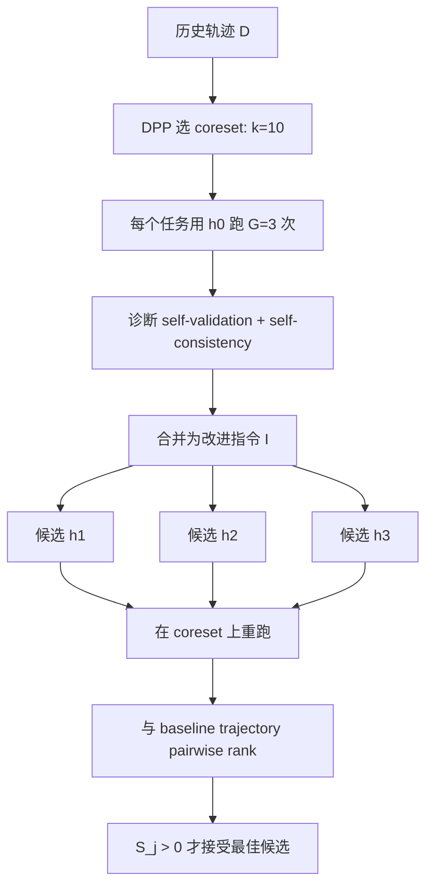
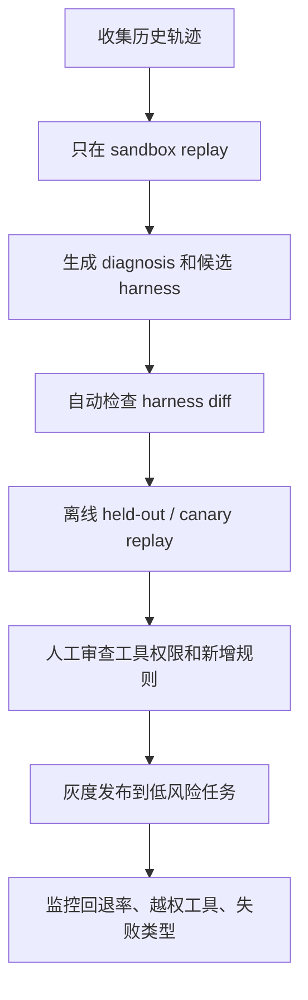

# RHO：不用验证集，让 Agent 从历史轨迹里改进自己的 harness

## 元信息与 TL;DR

| 字段 | 内容 |
|---|---|
| 论文 | [Retrospective Harness Optimization: Improving LLM Agents via Self-Preference over Trajectory Rollouts](https://arxiv.org/abs/2606.05922) |
| 代码 | [wbopan/retro-harness](https://github.com/wbopan/retro-harness) |
| 项目页 | [paper-rho.wenbo.io](https://paper-rho.wenbo.io) |
| 作者 | Wenbo Pan, Shujie Liu, Chin-Yew Lin, Jingying Zeng, Xianfeng Tang, Xiangyang Zhou, Yan Lu, Xiaohua Jia |
| 机构 | City University of Hong Kong, Microsoft Research Asia |
| 提交时间 | 2026-06-04T09:26:00Z |
| 方向 | 大模型 Agent / harness optimization / self-improving agent |

### TL;DR

- **这篇论文做什么**：RHO 研究的是 deployed agent 如何不用人工标签、验证集或外部 grader，仅靠过去任务轨迹，改进自己的 persistent harness，也就是技能、工具、说明和工作流文件。
- **它怎么做**：流程分三步：先用 DPP 从历史轨迹里选出困难且多样的 coreset；再对每个任务做 3 次 parallel group rollout，用 self-validation 和 self-consistency 诊断失败；最后生成 3 个候选 harness，用 agent 自己的 pairwise self-preference 选择是否接受更新。
- **实验对象**：作者用 Codex + GPT-5.5 high reasoning effort，在 SWE-Bench Pro、Terminal-Bench 2、GAIA-2 三类任务上评估，分别代表软件工程、命令行技术任务和动态知识工作。
- **关键结果**：单轮 RHO 把 SWE-Bench Pro held-out pass rate 从 0.59 提到 0.78；Terminal-Bench 2 从 0.71 到 0.76；GAIA-2 从 0.29 到 0.37。和同样不使用验证标签的 Dynamic Cheatsheet、ReasoningBank、Sleep-time Compute 相比，RHO 在三类任务上都更强。
- **关键证据**：消融显示诊断信号不是装饰：去掉 self-consistency 后，SWE-Bench Pro 从 0.78 掉到 0.56；去掉 self-validation 后掉到 0.70；直接把 raw trajectory 丢给 optimizer 只有 0.60。
- **局限**：RHO 假设环境能重复 reset、任务能多次 replay、agent 的能力有相当部分由可编辑 harness 承载；如果是一次性外部行动、不可逆操作或偏好判断会放大错误的高风险场景，必须加人工审批和安全检查。


## 研究问题：为什么不是再做一个 prompt optimizer？

### Agent 真正被部署后，标签经常不存在

论文抓住的是一个很现实的问题：

- deployed agent 每天都会留下大量轨迹；
- 这些轨迹包含错误、绕路、工具误用、提前停止、环境误判；
- 但用户不一定会给每条任务打标签；
- 团队也很难构造一个能代表未来任务分布的 validation set；
- 如果 harness optimizer 必须依赖外部标签，它就很难持续在线迭代。

所以 RHO 问的不是：

- “能不能用验证集搜索更好的 prompt？”
- “能不能训练一个更强的模型？”
- “能不能把成功经验写进 memory？”

它问的是：

> 只给一个 agent 自己过去留下的轨迹，能不能让它回头分析自己，并改出一个对未来任务更好的 harness？

### harness 在这里不是一个提示词

论文里的 harness 是一个持久目录，里面可以有：

- instruction markdown；
- skill checklist；
- executable helper scripts；
- workflow config；
- 对环境约束、grader 习惯、工具路径、验证流程的记录。

这和普通 prompt optimization 的区别很关键：

| 维度 | prompt/memory 方法 | RHO 的 harness |
|---|---|---|
| 可编辑表面 | 文本提示、记忆条目、cheatsheet | instructions + skills + executable tools |
| 学习信号 | 成功/失败摘要或检索内容 | 多条轨迹的失败模式和不一致性 |
| 选择机制 | 常见是固定更新或外部验证 | pairwise self-preference gate |
| 风险 | 容易变成经验堆积 | 也可能改出错误工具，需要审计 |

这也是论文的主张边界：RHO 的提升不是来自模型权重变化，而是来自外部工作结构变好。

## 论证路线：claim -> mechanism -> evidence -> boundary

| 层次 | 论文主张 | 机制 | 证据 | 边界 |
|---|---|---|---|---|
| Claim | 历史轨迹足以提供 harness 改进信号 | retrospective analysis | 三个 benchmark 的 held-out 提升 | 需要可 replay 环境 |
| Mechanism | 困难且多样的失败更适合驱动更新 | DPP coreset | Figure 5 中 DPP 达到 0.78，difficulty-only 只有 0.62 | DPP 依赖 LLM judge 与 embedding |
| Mechanism | 单条轨迹不够，组内对比更有信息 | G=3 group rollout | self-validation / self-consistency 消融显著下降 | 成本随 G 线性增加 |
| Evidence | full harness 优化强于 memory-only | tools + skills + instructions | Table 1 三个 benchmark 均优于 baselines | 仍未证明所有领域适用 |
| Boundary | 无标签不等于无风险 | strict acceptance + full logs | 只有 self-preference 分数大于 0 才接受 | evaluator 偏好可能放大坏规则 |

## 方法机制：RHO 的三阶段流程


### Stage 1：Coreset Selection

RHO 不直接把所有历史轨迹都交给 optimizer，原因有两个：

- **成本问题**：每条轨迹都 replay 和诊断会爆炸。
- **信号稀释**：大量简单任务会把真正有价值的失败模式淹没。

作者用 DPP 同时追求两个目标：

- 选困难任务；
- 不让困难任务全挤在同一种失败模式里。

论文里先让 LLM judge 为每条轨迹产生：

- 难度分数 `r_i`；
- 描述任务挑战和潜在失败模式的 textual fingerprint；
- fingerprint embedding 之间的相似度矩阵 `S`。

核心 kernel 写成：

```text
K = diag(r_tilde) S diag(r_tilde)

r_tilde_i = (max(r_i, epsilon) / max_j max(r_j, epsilon)) ^ alpha

alpha = theta / (2 * (1 - theta))
```

变量解释：

| 变量 | 含义 |
|---|---|
| `S` | 轨迹 fingerprint embedding 的 cosine similarity |
| `r_i` | LLM judge 给出的任务难度 |
| `epsilon` | 分数下限，避免低分轨迹权重塌陷 |
| `theta` | difficulty 与 diversity 的权衡 |
| `alpha` | 把 `theta` 转成 DPP 权重指数 |
| `det(K_Y)` | 子集 `Y` 的体积，鼓励“高权重且相互不同” |

代码实现里，`src/rho/selection/dpp_selector.py` 使用 greedy MAP，`theta=0.7`，`score_floor=0.1`，embedding 是 fingerprint 而不是 raw query。这个选择很有工程意义：raw query 容易按仓库或题面表层聚类，fingerprint 更接近失败模式。

### Stage 2：Group Rollout

选出 `k=10` 个 coreset 任务后，RHO 对每个任务用原始 harness `h_0` 并行跑 `G=3` 次。

这一步不是为了投票选答案，而是为了制造诊断材料：

- 同一任务三次运行都成功，说明 harness 问题可能不重；
- 有的成功、有的失败，说明 harness 对路径选择或验证流程不稳定；
- 三次都失败，说明可能缺工具、缺环境知识、缺任务拆解策略；
- 三次走出完全不同路径，说明 agent 对任务结构没有稳定理解。

论文把诊断拆成两类：

| 信号 | 关注点 | 典型发现 |
|---|---|---|
| self-validation | 单条轨迹内部是否做对 | 错误工具调用、假设不成立、过早停止、漏验证 |
| self-consistency | 多条轨迹之间是否一致 | 计划分歧、工具序列分歧、最终答案冲突 |

源码里的 `src/rho/orchestrators/diagnose.py` 也能看到这个结构。诊断 prompt 要求逐条检查 `trajectory_0/1/2` 的 `events.jsonl`、`final_message.txt` 和 `workspace_diff/`，再输出 JSON：

- `successful`；
- `quality_analysis`；
- `issues`；
- `failure_mode_analysis`；
- `inconsistency_analysis`；
- `harness_improvement_direction`；
- `severity`。

注意这里的 severity 不是 ground truth。`src/rho/strategies/diagnose.py` 把它当成 soft attention weight，用来排序诊断目录，让 optimizer 优先读更严重、更重复的 failure motif。

### Stage 3：Best-of-N Harness Proposal

RHO 不是让 optimizer 只改一次。它并行采样 `N=3` 个候选 harness：



候选选择分数是：

```text
S_j = (1 / |D_core|) * sum_{t in D_core} rank(t, tau_t^(j), tau_t^(0))
```

变量解释：

| 变量 | 含义 |
|---|---|
| `h_j` | 第 `j` 个候选 harness |
| `tau_t^(j)` | 候选 `h_j` 在任务 `t` 上的新轨迹 |
| `tau_t^(0)` | 原始 harness 在任务 `t` 上的 baseline 轨迹 |
| `rank(...)` | agent 对两条轨迹的 pairwise preference |
| `S_j > 0` | 严格接受阈值，避免平局时强行改动 |

这个 gate 是 RHO 的防回退机制。源码里的 `src/rho/loop.py` 会把候选去重，重跑每个候选，再用 `src/rho/orchestrators/evaluate.py` 对候选轨迹和 baseline 轨迹做 pairwise 评分。解析失败、执行失败或超时会给 0 分，因此无声失败不会推动 harness 更新。

## 实验设置：三个任务域对应三种 Agent 压力

### 公共配置

| 参数 | 取值 |
|---|---|
| backbone | Codex + GPT-5.5 |
| reasoning effort | high |
| rounds | 1 |
| coreset size `k` | 10 |
| rollouts per task `G` | 3 |
| candidate count `N` | 3 |
| selector | DPP greedy MAP |
| DPP weight `theta` | 0.7 |
| acceptance | mean pairwise score `S_j > 0` |
| persistence | prompts、completions、trajectories、diagnoses、candidate harnesses、diffs、scores、reports |

### SWE-Bench Pro

SWE-Bench Pro 是长程软件工程任务：

- 每个任务需要仓库级理解；
- agent 要修改多文件 patch；
- 最终用官方 per-instance Docker image 跑测试；
- pass 条件是 `FAIL_TO_PASS` 和 `PASS_TO_PASS` 都满足；
- 论文用前 100 个 hash-ordered 样本作 training pool，接下来 100 个作 held-out test pool。

这里 harness 最容易学到的是工程流程：

- 真实代码路径要先 trace；
- 测试命令要有目标性；
- 生成文件和 cache 不能进 patch；
- Go toolchain 可能不在默认路径；
- patch hygiene 会决定最终是否能应用。

### Terminal-Bench 2

Terminal-Bench 2 是命令行任务：

- 每个任务在 Docker container 中执行；
- verifier 写出 0/1 reward；
- held-out pool 是 59 个任务；
- agent 要写 shell 脚本、执行命令、检查状态。

这里 harness 的价值更多体现在：

- 如何恢复黑盒行为；
- 如何重跑最终 gate；
- 如何验证 package load；
- 如何检查导出的结构是否 well-formed。

### GAIA-2

GAIA-2 是动态知识工作环境：

- 使用 validation split 的 mini 配置，共 200 个 scenarios；
- 前 100 个作为 training pool，后 100 个作为 held-out；
- environment 有 asynchronous events 和 simulated time；
- agent 通过 tool dispatcher 与 sidecar process 互动。

这里 harness 学到的是：

- deadline 要绑定 simulated clock；
- 真实回复必须通过 interface 发出；
- 强制动作要拆解成 checklist；
- 调工具前确认 target content，而不是只看名称。

## 主结果：RHO 的提升集中在 full harness

| 方法 | Harness surface | SWE-Bench Pro | Terminal-Bench 2 | GAIA-2 |
|---|---:|---:|---:|---:|
| Vanilla Codex | none | 0.59 | 0.71 | 0.29 |
| Dynamic Cheatsheet | skills | 0.62 | 0.73 | 0.30 |
| ReasoningBank | memory | 0.61 | 0.73 | 0.28 |
| Sleep-time Compute | memory | 0.64 | 0.73 | 0.32 |
| **RHO** | **skills + tools** | **0.78** | **0.76** | **0.37** |

这张表的重点不只是 RHO 分数最高，而是它说明了一个机制差异：

- memory 方法能保留经验，但不能直接新增验证工具；
- cheatsheet 方法能记录策略，但难以改变执行表面；
- RHO 可以把经验变成脚本、checklist、instruction 和 workflow 约束；
- 这些改动对长程任务尤其重要。

### 与 Meta-Harness 的对照

| 方法 | 是否需要验证标签 | optimization agent calls | SWE-Bench Pro |
|---|---:|---:|---:|
| RHO | no | 103 | 0.78 |
| Meta-Harness 1 round | yes | 41 | 0.62 |
| Meta-Harness 10 rounds | yes | 320 | 0.80 |

这组结果不能简单读成“RHO 永远比验证集优化更强”。

更准确的读法是：

- 单轮、无标签、103 次 optimization-phase agent calls 下，RHO 已经接近 10 轮 Meta-Harness 的 0.80；
- Meta-Harness 10 轮仍能到 0.80，但它用约 3.1 倍 RHO 的 optimization-phase calls，且仍需要 validation labels；
- 如果组织有可靠验证集和更多预算，validation-feedback 仍可能更稳；
- 如果组织只有 deployment trajectories，RHO 提供了一条可执行路线。

## 行为变化：RHO 到底让 Agent 改了什么？

### Figure 3：新增 harness 内容不是泛泛建议

论文展示的最高分 harness 包含三类东西：

| benchmark | instruction | skills | tools |
|---|---|---|---|
| SWE-Bench Pro | 104 行 procedural rules | reference、trace path、spec ledger、smoke test | `check_build_and_lint`、`run_targeted_tests` |
| Terminal-Bench 2 | 119 行 procedural rules | black-box、final gate、package fix、polygons | `smoke_test_imports`、`validate_polygon_masks` |
| GAIA-2 | 101 行 procedural rules | timing、user reply、decompose、by content | `list_app_functions`、`get_function_schema`、`call_function` |

这说明 RHO 的输出不是“下次更小心”这种空泛反思，而是能落到：

- 特定环境约束；
- 可重复检查步骤；
- 小工具函数；
- 任务无关但领域相关的操作守则。

### Figure 4：提升来自长程任务和动作分布变化

论文分析了 held-out tasks 在不同 step 数内被解决的累计比例，还看了 action mix。

关键观察：

- SWE-Bench Pro 中，RHO 让 agent 更频繁 verification，论文给出的变化是 verify action 增加 61%，navigate 减少 13%。
- Terminal-Bench 2 中，agent 更少无效编辑，更多做状态导航和最终 gate 检查。
- GAIA-2 中，agent 更偏向真实 execution，而不是停留在编辑或计划上。

这很重要，因为它解释了为什么 RHO 不只是提升短题：

- 短题本来就容易被 vanilla agent 做完；
- 长题的失败常常来自过程控制，而不是单步推理；
- harness 恰好能改变过程控制。

## 消融：哪些设计真的必要？

### Coreset selection

| selector | SWE-Bench Pro held-out pass rate |
|---|---:|
| Vanilla Codex | 0.59 |
| random | 0.64 |
| coverage-only | 0.58 |
| difficulty-only | 0.62 |
| DPP RHO | 0.78 |

解释：

- difficulty-only 会把样本挤在同一种困难任务附近；
- coverage-only 会选到很多不够有信号的任务；
- random 偶尔碰到有用轨迹，但不稳定；
- DPP 同时看 difficulty 和 diversity，因此更适合暴露多类失败模式。

### Best-of-N proposal

| Dataset | candidate mean | chosen | std | lowest |
|---|---:|---:|---:|---:|
| SWE-Bench Pro | 0.79 | 0.78 | 0.06 | 0.73 |
| Terminal-Bench 2 | 0.74 | 0.76 | 0.03 | 0.71 |
| GAIA-2 | 0.34 | 0.37 | 0.03 | 0.32 |

这个结果有两个意思：

- 生成出来的三个候选大多都比 vanilla 强，说明诊断信号有用；
- self-preference 不是完美 oracle，因为 chosen 不总是最高 test score；
- 但它能避免最差候选，作为无标签 gate 仍有实际价值。

### Diagnosis signals

| Variant | SWE Pro | TB 2 | GAIA-2 |
|---|---:|---:|---:|
| full diagnosis | 0.78 | 0.76 | 0.37 |
| minus self-consistency | 0.56 | 0.75 | 0.27 |
| minus self-validation | 0.70 | 0.73 | 0.30 |
| raw trajectory | 0.60 | 0.75 | 0.29 |

最值得注意的是 SWE-Bench Pro：

- 去掉 self-consistency 后从 0.78 掉到 0.56，甚至低于 vanilla 0.59；
- raw trajectory 只有 0.60，说明“把日志全丢给模型”不是充分方法；
- 显式诊断让 optimizer 看到的是结构化失败模式，而不是混杂轨迹噪声。

## 代码实现：论文不是只有概念图

### 仓库结构

我核对了 README、CLI 文档和 zipball 源码。核心模块可以拆成：

| 模块 | 作用 |
|---|---|
| `src/rho/loop.py` | RHO evolution loop：solve -> diagnose/optimize -> candidate eval -> accept |
| `src/rho/protocols.py` | `Task`、`Harness`、`Trajectory`、`Diagnosis` 等接口 |
| `src/rho/selection/dpp_selector.py` | DPP greedy MAP coreset selector |
| `src/rho/orchestrators/diagnose.py` | 三轨迹诊断 prompt 与 JSON parsing |
| `src/rho/orchestrators/evaluate.py` | pairwise trajectory evaluator |
| `src/rho/strategies/diagnose.py` | full / no-consistency / no-validation diagnosis strategy |
| `src/rho/datasets/*` | SWE-Bench Pro、Terminal-Bench 2、GAIA-2 loaders 与 graders |
| `src/rho/meta_harness/*` | validation-feedback baseline |
| `src/rho/reasoningbank/*` | ReasoningBank baseline |

### 运行入口

README 给出的主流程是：

```bash
uv run rho evolve \
  --dataset locomo:data/locomo10.json \
  --rounds 1 \
  --codex-config configs/codex.chatgpt-default.toml
```

CLI 还支持：

- `rho solve`：用给定 harness 解单题；
- `rho grade`：对某个 split 评分；
- `rho inspect`：查看某轮结果；
- `rho select`：单独运行 selector；
- `rho reasoningbank`：跑 ReasoningBank baseline；
- `rho meta-harness`：跑 validation-feedback baseline；
- `rho ui`：浏览 prompts、completions、trajectories、harness diffs。

### 工程上最值得学的点

RHO 的实现不是把所有角色塞进一个长 prompt，而是用 workspace 隔离角色：

- `solve` 只看到 task 和当前 harness；
- `diagnose` 看到 task、harness 和三条轨迹；
- `optimize` 看到 harness 和 diagnosis 目录；
- `rank` 看到 task、两条轨迹和两个 harness 目录；
- 每一步的输出都持久化，方便 audit 和 ablation。

这个设计让研究结论更可检查：

- 哪条轨迹驱动了哪个诊断；
- 哪个诊断进入了哪个候选 harness；
- 候选和原 harness 的 diff 是什么；
- 哪个 pairwise rank 让候选被接受；
- 失败解析如何被置零而不是静默通过。

## 关键限制：无标签不是免费午餐

### 1. RHO 需要可重复环境

Group rollout 会重复 replay coreset task。

因此它不适合直接用于：

- 真实转账；
- 发邮件；
- 删除外部资源；
- 一次性机器人操作；
- 会污染线上状态的任务。

这些任务必须先放进可 reset sandbox，或者把 RHO 限制在模拟/回放环境里。

### 2. 失败案例应该怎么理解？

论文没有把每个失败样本都写成长篇 case study，但从方法和附录可以推断，RHO 真正关心的失败不是“答案错了”这一层，而是错误背后的可迁移结构。

可以把 failure mode 拆成四类：

| 失败类型 | 轨迹里会出现什么 | harness 可以怎么修 | 为什么适合 RHO |
|---|---|---|---|
| 环境约束未知 | 工具找不到、路径错误、构建命令误判 | 写入环境检查工具和路径说明 | 多个任务会重复暴露同一约束 |
| 验证不足 | 改完代码不跑目标测试，只看静态 diff | 增加 smoke test 或 targeted test checklist | 长程任务常败在最后确认 |
| 任务规格漂移 | 只修了显眼 bug，漏掉 prompt 的细小约束 | 增加 spec ledger，让 agent 逐项核对 | self-validation 能抓住“做了但没做全” |
| 路径选择不稳定 | 三条 rollout 走出完全不同方案 | 增加 trace-path 或 final-gate skill | self-consistency 能把不确定性显性化 |

这里的关键是：RHO 不需要知道真正的 hidden label，也不需要直接看到测试答案。它只需要看到 agent 在同一任务上表现出可解释的差异，再把这些差异压缩成“未来任务也可能受益”的 harness 改动。

但这也解释了为什么 raw trajectory baseline 表现差。原始日志里混有：

- 有用的命令；
- 无关探索；
- 偶然成功；
- 错误自信；
- 工具噪声；
- 长上下文里的局部幻觉；
- 任务特定细节。

如果 optimizer 直接读这些日志，很容易把偶然路径当成通用策略。RHO 的诊断阶段相当于先做一次信息蒸馏：把“这个样本发生了什么”改写成“这个 harness 可能缺什么”。

### 3. 部署 RHO 时，最小安全流程应该是什么？

如果把 RHO 放进真实 coding-agent 或 workflow-agent 系统，我不会建议让它自动热更新线上 harness。

更稳的流程应该是：



自动检查至少应该覆盖：

- 新增脚本是否调用网络、删除、移动、权限提升或凭据读取；
- 新增 instruction 是否鼓励跳过审批、忽略用户约束或扩大任务范围；
- 新增 skill 是否把任务特定细节错误固化为通用规则；
- 修改后 harness 是否仍通过已有回归任务；
- candidate harness 是否能解释每个 diff 对应哪个 diagnosis；
- pairwise rank 的 rationale 是否和实际轨迹证据一致。

这样做的目的不是把 RHO 变慢，而是把“自我改进”变成可审计变更管理。否则 RHO 的优势，持久文件系统级修改，也会变成它的主要风险来源。

### 4. 与产品里的 memory/skill 系统有什么不同？

很多 Agent 产品已经有 memory、rules、skills、project instructions。RHO 的区别在于它强调 closed-loop evaluation。

普通 memory 更新经常是：

- 用户指出一次问题；
- agent 写入一条规则；
- 下次靠检索或上下文注入使用；
- 很少系统性回放历史任务验证是否真的更好。

RHO 则要求：

- 先选一组有代表性的失败；
- 在同一任务上重跑；
- 把改动前后轨迹放到同一评价窗口；
- 只有相对更好才接受。

这个差别很实用。没有 replay 和 gate 的 skill 系统容易越积越多，最后变成互相冲突的规则堆。RHO 至少给出一个约束：新增规则必须解释历史 failure mode，并且在 coreset replay 中被 self-preference 认为优于 baseline。

当然，self-preference 仍然不等于真实生产收益。更成熟的系统应把 RHO 的 gate 当作第一层筛选，再叠加真实用户反馈、线上 canary、静态风险检查和人工 code review。

### 5. 对日常 coding-agent 运营，应该记录哪些诊断指标？

RHO 还有一个容易被忽略的价值：它提示我们，Agent 平台的日志不应该只记录“成功/失败”和 token 成本，还应该记录能被 harness optimizer 消费的结构化信号。

至少可以持续沉淀这些指标：

- **任务重试差异**：同一任务多次运行是否走向不同文件、不同测试命令、不同最终解释。
- **验证密度**：每次修改后是否运行目标测试、smoke test、类型检查或构建检查。
- **规格覆盖率**：最终回复和 diff 是否逐项覆盖用户 prompt 里的硬性要求。
- **工具越界率**：是否调用了与任务无关、范围过大或权限过高的工具。
- **失败可解释性**：失败后能否定位到环境约束、缺失知识、错误计划还是执行失误。
- **规则命中情况**：已有 skill 或 instruction 是否被实际引用，是否在关键步骤改变了行为。

这些指标能让 RHO 之外的系统也受益。即使暂时不自动改 harness，团队也可以用它们做周度故障复盘：哪些失败是模型能力问题，哪些其实是工具、说明、验证流程、权限边界没有写清楚。RHO 的研究意义就在这里：它把“轨迹日志”从事后审计材料，变成了可组织、可筛选、可回放的改进数据。

### 6. self-preference 会继承 evaluator 偏好

RHO 的 gate 依赖 agent 自己比较轨迹。

风险包括：

- evaluator 偏好更短但错误的轨迹；
- evaluator 被表面解释迷惑；
- evaluator 把不安全捷径当成高效；
- optimizer 把偶然成功固化成规则；
- 工具脚本扩大了错误规则的影响范围。

论文也明确指出，RHO 会修改 persistent agent behavior，因此高影响部署需要：

- full audit logs；
- sensitive harness edits 的人工批准；
- domain-specific safety checks；
- 对 accepted harness 的回归测试。

### 7. 结果还没证明跨模型泛化

论文配置里 solver、optimizer、ranker 都是同一 Codex + GPT-5.5 backbone。

这样做的好处是避免 judge 更强导致混淆。

但它也留下问题：

- Claude、Gemini、开源 coding agent 是否同样受益？
- 更弱模型是否能可靠做 diagnosis 和 pairwise rank？
- 更强模型是否会让 self-preference 更稳，还是更容易自信地 Goodhart？
- 不同 harness 表面，比如浏览器 agent、IDE agent、data analyst agent，是否也能用同一个 DPP + group rollout 框架？

## 研究者视角的领域延伸

### 对 Agent 研究：harness optimization 正在变成独立层

RHO 的重要性在于，它把 Agent 改进分成三层：

| 层 | 代表方法 | 优点 | 风险 |
|---|---|---|---|
| model weights | SFT/RL/RLHF | 能改底层能力 | 成本高，数据和安全门槛高 |
| memory/context | ReasoningBank、Sleep-time Compute | 易部署，低侵入 | 难新增真实工具 |
| harness/tools/workflow | RHO、Meta-Harness | 能改变操作结构 | 更可能引入持久错误 |

这意味着未来 Agent 产品很可能不只比较模型，还会比较：

- 是否有可审计 harness；
- 是否能从失败轨迹中提取可执行改进；
- 是否有防回退 gate；
- 是否能把工具更新、权限、回归测试、安全策略串起来。

### 对后训练：RHO 像一种“不改权重的 credit assignment”

RHO 和 RL 后训练有一个相似点：

- 都要从长程轨迹里找到 credit；
- 都要区分偶然失败和系统性失败；
- 都要避免把错误偏好强化成策略。

区别是：

- RL 改的是 policy weights；
- RHO 改的是 harness；
- RL 依赖 reward 或 preference data；
- RHO 用 self-validation、self-consistency 和 pairwise self-preference 近似 reward。

可以把 RHO 看成一种外部化的、文件系统层面的 credit assignment：

```text
长程失败轨迹
  -> 失败模式诊断
  -> harness edit
  -> coreset replay
  -> pairwise preference
  -> accept / reject
```

它给后训练研究的启发是：并非所有能力提升都必须压进权重。对于工具使用、验证习惯、仓库约束、环境流程这些结构化能力，harness 可能是更便宜、更可回滚、更可审计的载体。

### 对 AI 安全：self-improvement 必须和审计绑定

RHO 不是“让 agent 自己变强所以一定危险”的故事，也不是“自我改进已经解决”的故事。

更准确的安全问题是：

- agent 能否解释为什么修改 harness；
- 修改是否只影响目标 failure mode；
- 是否引入新的越权工具；
- 是否改变权限边界；
- 是否能在 held-out 和 adversarial tasks 上回归；
- 是否能让人类理解并批准 diff。

RHO 的可取之处是它留下了完整 artifact：

- diagnosis；
- candidate harness；
- harness diff；
- pairwise scores；
- held-out reports。

但这些 artifact 只有被安全流程消费才有意义。没有审计的人类审批，RHO 只是把错误偏好写进了更持久的系统层。

## 结论与继续追问

### 最值得带走的判断

- RHO 的贡献不是单个新 benchmark 数字，而是给 deployed agent 提供了一个“无验证集、可回放、可审计”的 harness 改进闭环。
- 它证明了历史轨迹里的失败和不一致性可以转成可执行工具、技能和说明，而不仅是 memory 摘要。
- 它也显示 self-preference 不是万能 judge：它能过滤最差候选，但不保证选中 test score 最高的候选。
- 真正强的地方在长程任务，因为长程任务的失败常来自流程控制、验证习惯和环境约束。

### 还需要追问的问题

1. **更强安全 gate**：pairwise self-preference 之外，能否加入 static analysis、policy checker、permission model、sandbox replay？
2. **跨模型复现**：同一 RHO loop 换 Claude、Gemini、开源 coding agent 后，诊断质量和候选选择是否仍稳定？
3. **不可逆任务**：对真实外部行动，能否只优化模拟 harness，再通过人工审批迁移到线上？
4. **多轮漂移**：一轮 RHO 有效，多轮是否会积累局部偏好、工具膨胀或 benchmark Goodhart？
5. **harness diff 评测**：能否把“新增工具是否越权”“是否扩大攻击面”“是否违反最小权限”变成自动化检查？

## 本次检索与材料范围

- 已读材料：
  - arXiv 论文 PDF 文本；
  - 项目 README；
  - `docs/cli-help.md`；
  - zipball 源码中的 `loop.py`、`protocols.py`、`selection/dpp_selector.py`、`orchestrators/diagnose.py`、`orchestrators/evaluate.py`、`strategies/diagnose.py`；
  - 论文附录中数据集、baseline、compute cost、hyperparameter 与 reproducibility 说明。
- 第三方/相关检索：
  - 搜索词包括 `Retrospective Harness Optimization Improving LLM Agents via Self-Preference arXiv 2606.05922` 和 `wbopan retro-harness Retrospective Harness Optimization GitHub`。
  - 同期相关主题包括 Meta-Harness、Dynamic Cheatsheet、ReasoningBank、Sleep-time Compute、Continual Harness、Skills-Coach；本文重点只把它们作为 RHO 的位置参照，没有展开成独立综述。
