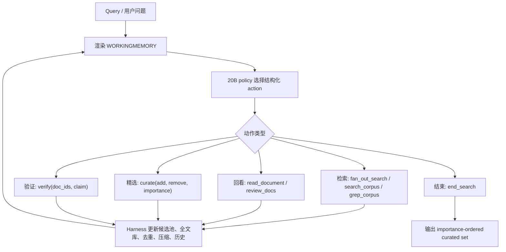

# Harness-1：把搜索 Agent 的“记忆账本”从模型里搬到 Harness 里

## 元信息与 TL;DR

| 字段 | 内容 |
|---|---|
| 论文 | [Harness-1: Reinforcement Learning for Search Agents with State-Externalizing Harnesses](https://arxiv.org/abs/2606.02373) |
| 发布窗口 | arXiv v1：2026-06-01 15:21:41 UTC；本轮采集：2026-06-06T23:41:31Z |
| 作者 | Pengcheng Jiang, Zhiyi Shi, Kelly Hong, Xueqiang Xu, Jiashuo Sun, Jimeng Sun, Hammad Bashir, Jiawei Han |
| 代码/模型 | [GitHub](https://github.com/pat-jj/harness-1)，[Hugging Face model card](https://huggingface.co/pat-jj/harness-1) |
| 方向 | 大模型 Agent、搜索 Agent、Agent Harness、RL 后训练、证据检索 |

### TL;DR

- **这篇做什么**：发布 Harness-1，一个 20B 搜索子 Agent，在状态外置的 search harness 中用 SFT + on-policy CISPO RL 训练，负责多轮检索、阅读、精选、验证和停止。
- **它怎么做**：模型不再独自背完整 transcript；harness 维护候选池、curated set、重要性标签、全文库、证据图、验证记录、去重压缩和预算标记，policy 只做语义选择。
- **证据是什么**：8 个检索 benchmark 上，平均 curated recall `0.730`，比下一强 open search subagent 高 `+11.4` 点；held-out transfer 平均增益 `+17.0` 点，高于 source-family 的 `+7.9` 点。
- **关键数字**：BrowseComp+ 消融中 full Harness-1 为 `0.584/0.667` Recall/FA Recall；关闭全部 Harness-1 机制后为 `0.513/0.624`，Recall 相对下降 `12.2%`。
- **局限是什么**：完整复现依赖 BrowseComp+ 文件、Chroma collection、OpenAI 检索支持、可选 Baseten reranker 和 CUDA/vLLM 环境；证据图仍是 regex 级实体/日期抽取。


## 来源与本地附件

| 材料 | 作用 | 备注 |
|---|---|---|
| arXiv PDF | 方法、公式、实验、消融、附录参数 | 一手来源 |
| GitHub README | 工程结构、运行入口、公开复现边界 | 一手来源 |
| `docs/run_vllm_browsecompplus.md` | vLLM serving 与 BrowseComp+ 条件 | 一手来源 |
| `inference/tinker_inference.md` | Tinker checkpoint 与 50-query 示例指标 | 一手来源 |
| Hugging Face model card | 21B 参数、BF16、加载路径、基础模型 | 一手来源 |
| Chroma Context-1 报告 | 相关工作与 baseline 背景 | 可信参考 |
| Emergent Mind 摘要 | 第三方交叉核对 | 辅助参考 |

| 本地图片 | sha256 | 解释 |
|---|---|---|
| `/assets/2026/06/07/itm_harness1_260602373/page-01.png` | `53d700f62323e0a287381ac0582f78886e2576fc4cdb3b1f54336fe2237063ad` | 摘要与 Figure 1 总览 |
| `/assets/2026/06/07/itm_harness1_260602373/page-03.png` | `9888f610474add78b41bcd12b9bdc840276c749385be4066c88f7c725a9512ca` | Figure 2 架构图 |
| `/assets/2026/06/07/itm_harness1_260602373/page-06.png` | `b8f0e4bd31e68577329de6b5e0f3415fb63ad21463365a5fd3187e7b6a0e4a64` | Table 2 主结果 |
| `/assets/2026/06/07/itm_harness1_260602373/page-09.png` | `95abc70d057a206f3c60e1c229205c974a9340aae0ca7536ff41fc5cafa043cf` | Figure 5 训练动态 |

## 背景：为什么搜索 Agent 需要“外置状态”？

### 问题一：长 transcript 会混淆两类能力

- 第一类能力是**语义搜索决策**：
  - 该搜哪个子问题。
  - 该读哪篇文档。
  - 该保留哪些证据。
  - 该验证哪条 claim。
  - 该不该结束。
- 第二类能力是**机械状态管理**：
  - 哪些候选已经见过。
  - 哪些文档只是噪音。
  - 哪些实体跨文档连接。
  - 哪些约束还没覆盖。
  - 哪些 claim 已经被文档支持。
- 传统做法把两类能力都塞给模型。
- 结果是 policy 既要学搜索，又要从长上下文里恢复一张隐含状态表。

### 问题二：RL reward 很容易变稀疏

- hard query 早期可能都交空 curated set。
- 多条 rollout 终局 reward 接近，梯度难区分。
- 如果 reward 只奖励“见过证据”，policy 会重复搜索。
- 如果 reward 没惩罚“见过但没保留”，policy 会遗漏最终证据集。
- 如果工具很多但没有结构，policy 会退化成最容易拿 reward 的窄策略。

### Harness-1 的核心观点

- 可恢复状态应由环境侧保存。
- 可压缩信息应由 renderer 控制。
- 可验证记录应变成 durable cache。
- 模型应保留真正需要判断的部分。
- 这不是削弱模型，而是让模型学习更干净的决策接口。

## 方法总览：Policy 做选择，Harness 做账本




### 状态表：每个变量各管什么？

| 状态 | Harness 维护 | Policy 保留 |
|---|---|---|
| `P_t` | 压缩、去重后的候选池 | 检查、阅读、精选哪些 candidate |
| `C_t, I_t` | curated output set 与重要性标签 | 添加、删除、提升、降级哪些文档 |
| `D_t` | 所有检索到的全文 memory | 何时通过 `review_docs` 回看 |
| `G_t` | 实体、年份、日期到文档的证据图 | 追哪个 bridge、singleton 或关系 |
| `V_t` | claim 的逐文档验证记录 | 写什么 claim，选哪些文档验证 |
| `H_t` | 搜索历史、结果摘要、动作统计 | 何时分叉、回退、继续 |
| `B_t` | budget-safe renderer 与 context marker | 何时搜索、阅读、总结、停止 |

### 两层工作记忆

- **Prompt-facing tier**：
  - 进入模型上下文。
  - 只渲染可行动摘要。
  - 包括 curated set、candidate pool、evidence graph、verification cache、budget marker。
- **Outer document store**：
  - 保存完整文档全文。
  - 默认不进入 prompt。
  - 需要时由 `read_document` 或 `review_docs` 重新渲染。
- 这种两层结构的好处：
  - prompt 不被全文淹没。
  - 证据不会因为旧 turn 被截断而消失。
  - policy 可用工具显式回看，而不是猜测早先上下文。

### 五类 action

| 类别 | 工具 | 含义 |
|---|---|---|
| 检索 | `fan_out_search`, `search_corpus`, `grep_corpus`, `read_document` | 引入新候选或全文 |
| 回看 | `review_docs` | 重新渲染已见文档，不再打 corpus |
| 精选 | `curate(add, remove, importance)` | 编辑最终证据集 |
| 验证 | `verify(doc_ids, claim)` | 把支持/不支持写入验证缓存 |
| 结束 | `end_search(reasoning)` | 返回 curated evidence set |

## 关键机制：从空集构造变成证据集编辑

### Auto-seeding

- 第一次成功搜索后，harness 自动把 top `k=8` reranked candidates 放进 `C_t`。
- 初始 importance 为 `fair`。
- 这样早期 rollout 不再都是空 curated set。
- Policy 的任务变成：
  - 删除弱证据。
  - 提升强证据。
  - 通过验证后再升到高重要性。
  - 在 `M=30` 的 curated cap 下排序。

### Importance tags

- 标签包括 `very_high`、`high`、`fair`、`low`。
- 当 curated set 超过容量时，harness 优先淘汰低重要性文档。
- 这等于给 policy 一个显式语言：
  - “我确定这是核心证据。”
  - “这是候选证据但还没验证。”
  - “这个文档只适合作为背景。”
- 没有标签时，消融显示 FA Recall 相对下降 `7.9%`。

### Evidence graph

- 图节点来自轻量抽取：
  - 多词大写专名。
  - 四位年份或年代。
  - 数字日期。
- 图边来自同一文档中的共现。
- 渲染时强调：
  - 高频实体。
  - bridge documents。
  - singleton entities。
- 它不替模型推理。
- 它把“跨文档线索在哪里”变成工作记忆中的可读索引。

### Compression 与 dedup

- 搜索结果用 Sentence-BM25 压缩。
- 每个检索结果选 top `K=4` 句，并保持原文顺序。
- 去重有两层：
  - chunk ID 去重。
  - content fingerprint 去重。
- 这两个机制的目标不是最大化 qrel 计数。
- 它们的目标是保护上下文预算，让下游生成器看到更少重复证据。

## 公式：Reward 怎样同时奖励“发现”和“保留”？

### 状态转移

```text
(s_t, a_t) -> (s_{t+1}, o_{t+1})
```

| 符号 | 含义 |
|---|---|
| `s_t` | 当前 harness state |
| `a_t` | policy 选择的结构化动作 |
| `o_{t+1}` | harness 执行动作后的下一步 observation |

### Terminal reward

```text
R =
  w_F F_beta
  + w_tau rho_tau
  + w_A rho_A
  + w_tauA rho_tauA
  + B_A 1[rho_A > 0]
  + w_div min(nu / nu_0, 1)
  - w_miss (rho_tauA - rho_A)_+
  - turn_penalty
```

| 项 | 解释 |
|---|---|
| `F_beta` | curated set 质量，`beta=2`，recall 权重约为 precision 的 4 倍 |
| `rho_tau` | trajectory recall，奖励过程中见过 gold evidence |
| `rho_A` | curated final-answer recall，奖励最终保留答案证据 |
| `rho_tauA` | trajectory final-answer recall，奖励过程中见过答案证据 |
| `B_A` | 只要最终保留答案证据就给 bonus |
| `w_div` | 工具多样性奖励，避免只会搜索 |
| `w_miss` | 惩罚“见过答案证据但没放进 curated set” |

### 超参数

| 参数 | 值 |
|---|---:|
| `w_F` | `0.7` |
| `w_tau` | `0.3` |
| `w_A` | `0.8` |
| `w_tauA` | `0.4` |
| `B_A` | `1.0` |
| `w_miss` | `0.35` |
| empty-set penalty | `-0.2` |
| reward floor | `10^-3` |
| KL anchor | `0.0` |
| diversity target `nu_0` | `6` |

## 训练：SFT 教会接口，RL 优化搜索行为

### SFT 阶段

- 基座模型是 `openai/gpt-oss-20b`。
- SFT 使用 LoRA rank `32`。
- 学习率 `5e-6`。
- batch size `128`。
- max sequence length `32,768`。
- 训练 `3` 个 epoch。
- Teacher 是 GPT-5.4 live agent。
- 保留轨迹条件：
  - 格式有效。
  - 至少返回一个文档。
  - final output recall `>= 0.10`。
- 最终筛出 `899` 条 trajectory。
- 每条 trajectory 按 turn 展开成监督样本。

### RL 阶段

- 从 SFT step `550` 初始化。
- 算法是 on-policy CISPO。
- clip 区间 `[0, 5]`。
- 数据集只用 SEC training split。
- query 数量 `3,453`。
- 每步 `128` queries。
- 每 query `8` rollouts。
- 每步总 `1,024` rollouts。
- 总 `80` 步，约 `82K` rollout。
- episode 上限 `40` turns。
- generation budget `2,048` tokens。
- 没有 KL anchor。
- constant-reward group 会被丢弃。

### 为什么小数据也能转移？

- 论文的解释不是“数据更大”。
- Harness-1 的 unique training items 是 `4,352`。
- Context-1 报告的是超过 `8K` SFT tasks 和 `9,159` RL queries。
- Search-R1 使用 `221,328` merged rows。
- Harness-1 的假设是：
  - 只要接口稳定，policy 学的是状态操作。
  - 状态操作比领域模板更容易迁移。
  - 例如“验证后提升证据”可以迁移到金融、专利、多跳 QA。

## 实验：主结果怎么看？


### Benchmark 覆盖

| 类型 | Benchmark |
|---|---|
| 浏览/网页 | BrowseComp+，Web synthetic |
| 金融 | SEC filings |
| 专利 | USPTO office actions |
| 长上下文多跳 | LongSealQA，Seal0QA，FRAMES，HotpotQA |

### 指标解释

| 指标 | 含义 | 用途 |
|---|---|---|
| Recall | final curated set 覆盖多少 annotated relevant docs | 看最终证据包质量 |
| Trajectory Recall | episode 中任意时刻见过多少 relevant docs | 区分“没搜到”和“搜到没留下” |
| Final-Answer Recall | final set 覆盖多少 answer docs | 更贴近下游回答 |
| Precision/F1 | curated set 精度与综合指标 | 次要，因为该 agent 目标是收集证据 |

### 关键结果

- 平均 curated recall：`0.730`。
- 平均 trajectory recall：`0.756`。
- 相比 Tongyi DeepResearch 30B：
  - Harness-1 curated recall 高 `+11.4` 点。
- 相比多个 frontier retriever：
  - 高于 GPT-5.4。
  - 高于 Sonnet-4.6。
  - 高于 Kimi-K2.5。
  - 高于 GPT-OSS-120B。
- 但 Opus-4.6 平均 curated recall 仍更高。

### Transfer pattern

| 组别 | 增益 |
|---|---:|
| Source-family：BC+、Web、Patents、SEC | 平均 `+7.9` 点 |
| Held-out：LongSealQA、Seal0QA、FRAMES、HotpotQA | 平均 `+17.0` 点 |
| held-out/source 比率 | `2.2x` |

### 为什么这个 pattern 重要？

- 如果模型只学会训练域技巧，held-out 应该更差。
- 结果相反，held-out 增益更大。
- 论文认为这说明 policy 学到的是领域无关的状态操作。
- 这些操作包括：
  - refine auto-seeded set。
  - 追 evidence graph 中的 bridge entity。
  - 回看不确定候选。
  - verify 后再 promote。
  - 交付紧凑 curated set。

## 消融：Harness 不是普通包装层

### BrowseComp+ 100-query 消融

| 配置 | Recall | FA Recall | 变化 |
|---|---:|---:|---|
| Full Harness-1 | `0.584` | `0.667` | 基线 |
| 去掉 importance tags | `0.560` | `0.614` | FA 下降 `7.9%` |
| 去掉 Sentence-BM25 compression | `0.585` | `0.620` | FA 下降 `7.0%` |
| 去掉 auto-seed | `0.582` | `0.624` | FA 下降 `6.4%` |
| 隐藏 evidence graph | `0.569` | `0.631` | FA 下降 `5.4%` |
| verify 不可用 | `0.566` | `0.641` | FA 下降 `3.9%` |
| review docs 不可用 | `0.598` | `0.641` | FA 下降 `3.9%` |
| 去掉 content fingerprint dedup | `0.611` | `0.678` | nominal 上升 |
| 关闭全部 Harness-1 机制 | `0.513` | `0.624` | Recall 下降 `12.2%` |

### 行为变化更关键

- 关闭机制后，policy 不只是少了信息。
- 它的工具使用模式也变了。
- 论文观察到：
  - `search_corpus` 使用增加。
  - `read_document` 和 `verify` 使用下降。
  - agent 更宽、更浅、更像搜索循环。
- 这说明 harness 状态在训练中已成为决策基底。
- 如果拿掉状态，policy 仍能搜索，但不再擅长选择和保留。

### content dedup 为什么 nominal 变好？

- BrowseComp+ qrels 可能包含 near-duplicate gold docs。
- MinHash-LSH dedup 阈值 `0.85` 可能合并近重复文档。
- 合并后 qrel 计数可能损失。
- 所以去掉 dedup 会让 recall 数字上升。
- 但 dedup 本意是节省上下文预算。
- 这个结果是一个真实 tradeoff，不应简单解释为 dedup 没用。

## 训练动态：Diversity reward 防止 search-only 塌缩


### 没有 diversity reward

- agent 快速学会大量调用 `fan_out_search`。
- trajectory recall 可能升高。
- curated recall 约停在 `0.53`。
- 工具多样性从约 `6` 降到约 `3.5`。
- 它找到了相关文档，但不可靠地把正确文档放进 final set。

### 有 diversity reward

- 工具多样性稳定在约 `4.3`。
- policy 更常组合搜索、精选、回看和验证。
- early recall 改善更慢。
- 但 final curated recall 更高，约到 `0.60`。
- 这证明 reward 需要和 harness 动作空间配套。

### 对 RL 训练的启发

- 工具越多，越需要 reward 约束工具组合。
- 只奖励发现，会鼓励搜索。
- 只奖励答案，会让 credit assignment 太粗。
- Harness-1 同时奖励：
  - 过程发现。
  - 最终保留。
  - 答案证据。
  - 工具多样性。
  - 少犯“见过但没选”的错误。

## 工程结构与复现边界

### GitHub README 中的目录

| 目录 | 用途 |
|---|---|
| `harness/` | 搜索 harness、工具、trajectory、task、reranking、配置 |
| `training/` | SFT data generation、SFT training、RL training |
| `inference/` | Harness-1 evaluation、ablation、HF/vLLM inference |
| `datagen/` | 数据集设置与辅助评测 |
| `model_export/` | Tinker adapter 合并为 Hugging Face checkpoint |
| `tests/` | import 与 CLI smoke tests |

### 能直接做什么？

- 加载 `pat-jj/harness-1` 权重。
- 用 vLLM 启服务。
- 做 raw `/v1/completions` smoke test。
- 在具备数据和索引时跑 BrowseComp+ evaluation。
- 查看 harness、training、inference 代码。
- 基于公开脚本做 ablation 或 baseline runner。

### 复现需要什么？

- Linux + Python `3.11+`。
- `uv`。
- CUDA NVIDIA GPU。
- vLLM with GPT-OSS support。
- Hugging Face checkpoint 权限。
- BrowseComp+ query/qrel/answer 文件。
- Chroma collection，且 document IDs 对齐 qrels。
- OpenAI credentials。
- 可选 Baseten reranker credentials。

### 本轮没有跑完整评测的原因

- 当前采集环境没有 H100/vLLM serving 条件。
- 没有 BrowseComp+ 本地文件。
- 没有论文所需 Chroma collection。
- 因此本轮只做源码/文档阅读与论文证据整理。
- 文中所有实验数字都来自论文或官方 repo 文档。

## 和相关工作的差异

### 对 Context-1 的推进

- Context-1 已把搜索子 Agent 从生成器中解耦。
- Harness-1 更明确地把 harness state 写成研究对象。
- 它补上了：
  - state notation。
  - tool signature。
  - reward weights。
  - training hyperparameters。
  - inference-time component ablation。

### 对 Search-R1/WebSeer 类工作的差异

- Search-R1/WebSeer 强调 RL 让 agent 更会多轮搜索。
- Harness-1 强调 RL 应该作用在显式状态接口上。
- 这不是同一个层级的改动。
- 前者更像训练更会跑的 agent。
- 后者更像重新设计 agent 的工作台。

### 对生产 Agent 的启发

- coding agent：
  - 文件树、诊断、测试结果、补丁状态应是结构化状态。
  - 不应只靠 chat history 记住。
- research agent：
  - source ledger、claim verification、evidence graph 应持久化。
  - 不应每轮从摘要里猜。
- browser agent：
  - DOM snapshot、任务进度、表单状态、失败步骤应由 runtime 维护。
  - policy 负责下一步动作。

## 局限、失败模式与怀疑式审稿

### 技术局限

- Evidence graph 是 regex-based。
- 多语言、隐式关系、别名合并可能不稳。
- 近重复 qrels 会影响 dedup 的 recall 读数。
- Reward 权重是手工设计。
- no KL anchor 是否长期稳定，还需要更多第三方复现。
- `M=30` curated cap 对不同任务未必通用。

### 工程局限

- 复现实验依赖外部服务。
- Chroma/OpenAI/reranker backend 对结果贡献需要单独剥离。
- 21B BF16 checkpoint 对硬件有门槛。
- Tinker 路径虽然公开，但仍不是普通开发者最易运行的本地流程。
- repo README 明确说部分 in-domain corpora 没有 bundled ready-made indexes。

### 我会追问作者的点

| 问题 | 原因 |
|---|---|
| 同一 policy 换不同 retrieval backend 后增益还剩多少？ | 需要拆开 harness、reranker、corpus backend 的贡献 |
| Evidence graph 换成 learned linker 后是否稳定提升？ | 当前 regex 图可能是主要瓶颈 |
| curated cap 是否应由任务自适应？ | 法务、医学、科研证据粒度不同 |
| verify tool 的错误如何传播？ | 错误验证可能把错误证据升为高重要性 |
| Diversity reward 是否会鼓励无意义工具调用？ | 工具多样性与任务效率存在张力 |

## 结论：最值得借鉴的是状态边界

- Harness-1 的最大价值不是单个 benchmark 数字。
- 它把 Agent 训练问题重新切开：
  - policy 学“做什么”。
  - harness 管“已经发生了什么”。
  - reward 同时评价“发现”和“保留”。
- 这对 Agent 产品尤其重要。
- 很多生产问题看起来像模型不聪明。
- 实际可能是 harness 没提供稳定状态。
- 如果状态只能藏在自然语言 transcript 里，RL 和 prompt 都会更脆。
- 如果状态成为可编辑、可验证、可渲染的对象，小模型也可能学到可迁移操作。

## 后续追踪

- 跟踪 GitHub issue，观察第三方 BrowseComp+ 复现结果。
- 跟踪 Hugging Face model card，确认 inference provider 和下载量变化。
- 对比 CHERRL 这类 reward-hacking 论文，检查 rubric reward 是否也会诱导 search policy 走捷径。
- 继续读 `SlidingWindowSearchEnv`、curation state、verification cache 与 reward 计算代码。
- 如果后续 repo 放出更多 ready-made index，可补一篇工程复现报告。
