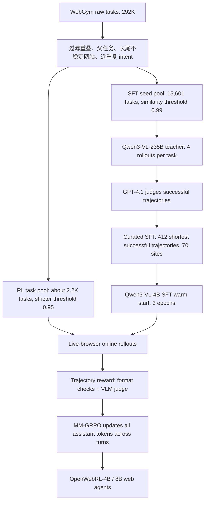

# OpenWebRL：把视觉 Web Agent 从“大规模模仿数据”推向真实网页在线强化学习

## 论文与项目元信息

- 标题：[OpenWebRL: Demystifying Online Multi-turn Reinforcement Learning for Visual Web Agents](https://arxiv.org/abs/2606.02031)
- 论文版本：arXiv:2606.02031，公开日期 2026-06-01 10:20:10 UTC；Hugging Face Papers 页面显示 Published on Jun 1、Submitted on Jun 2。
- 作者与机构：Rui Yang、Qianhui Wu、Yuxi Chen、Hao Bai、Wenlin Yao、Hao Cheng、Baolin Peng、Huan Zhang、Tong Zhang、Jianfeng Gao；UIUC 与 Microsoft Research。
- 项目页：[openwebrl.github.io](https://openwebrl.github.io/)
- 代码：[OpenWebRL/OpenWebRL](https://github.com/OpenWebRL/OpenWebRL)，Apache-2.0；仓库 README 显示 14 commits、Python 为主。
- 数据与模型：[OpenWebRL Hugging Face organization](https://huggingface.co/OpenWebRL)，包含 OpenWebRL-4B、OpenWebRL-8B、SFT checkpoints、OpenWebRL-RL-Tasks、OpenWebRL-SFT-Trajectories 和 Judge 数据。
- 分类判断：这篇应放入“大模型 Agent 相关”，同时和“大模型后训练”高度交叉，因为它的核心不是新的浏览器 UI 基准，而是对视觉 Web Agent 的在线多轮 RL 后训练配方做系统拆解。

这张图对应论文 Figure 1 和项目页 Performance Overview。它把 Online-Mind2Web、DeepShop、WebVoyager 三个 live-web benchmark 放在同一张图里，强调 OpenWebRL-4B 只用 4B backbone、0.4K warm-start trajectories 和 2.2K RL tasks，就能在 Online-Mind2Web 达到 67.0%、DeepShop 达到 64.0%、WebVoyager 达到 74.1%。图能支持“开放 4B 模型通过在线 RL 显著追近闭源 CUA 系统”的说法，但不能证明这些结果在任意未受控真实网站上都稳定复现，因为官方评测仍依赖特定 benchmark、judge 和浏览器服务协议。

## TL;DR

OpenWebRL 试图回答一个非常具体的问题：视觉 Web Agent 是否必须依赖几十万条静态网页轨迹做监督微调，还是可以像其他智能体一样在真实网页里通过在线多轮强化学习获得能力提升？作者的结论是，在线 RL 可以工作，但不能把“让模型在浏览器里试错”当成黑盒 recipe。它需要一个完整系统：能并行跑真实网页的 live-browser harness、少量高质量 SFT warm start、保留环境反馈和历史 reasoning 的多模态上下文管理、trajectory-level success judge、以及把单条轨迹奖励传播到所有 assistant tokens 的 Multimodal Multi-turn GRPO。

论文的训练流程分两段。第一段从 WebGym 的 292K raw tasks 出发，去掉 benchmark 重叠、父任务拆分、长尾不稳定网站和近重复 intent；用 Qwen3-Embedding-8B 做相似度去重，SFT 候选阈值为 0.99，得到 15,601 filtered seed tasks。然后用 Qwen3-VL-235B-A22B-Thinking 作为 teacher，每个 seed task 采样 4 条轨迹，用 GPT-4.1 判断成功与否，最后只选 412 条最短成功轨迹，覆盖 70 个网站，给 Qwen3-VL-4B-Thinking 做 3 epoch SFT。作者强调这里不是“越多模仿越好”，而是要让小模型进入可探索区域，同时避免过度 imitation 限制后续 RL 的 plasticity。

第二段是在线 RL。OpenWebRL 在 live browser 环境里采样多轮轨迹，每条轨迹由截图、URL、tab metadata、DOM 变化生成的 textual environment feedback、tool calls 和模型 reasoning 组成。动作空间有 13 个原子浏览器工具，包括 click、hover、drag、write、press keys、scroll、goto url、go back、wait、new tab、switch tab、close tab、done。模型每一步可以输出 reasoning 加一个或多个 tool calls；环境顺序执行这些工具并返回每次调用的文本反馈和新截图。上下文只保留最近 $K=1$ 张截图，却保留完整历史 reasoning 和所有环境反馈，目的是把视觉 grounding 和长期记忆分开：截图负责当前页面，文本负责“我刚才点了什么、失败在哪里、哪些约束已经满足”。

奖励不是 step reward，而是 trajectory-level reward。作者先检查响应格式：是否包含预期的 thinking 结束标记、是否能解析出工具调用、是否通过 done 给出最终答案。只有完成轨迹才调用 VLM judge；judge 看到 task instruction、最终回答、最近 3 张截图、完整 action history 和环境反馈，然后输出 SUCCESS 或 NOT SUCCESS。最终奖励是 gated reward：重复格式错误给 -1，格式不合法给 0，否则等于 judge score。默认 judge 是 GPT-4.1，但一个训练 run 需要 43.2K 次 judge API call，约 545.5 美元。作者于是用 12.5K diverse online rollouts 加 GPT-4.1 labels 蒸馏 OpenWebRL-Judge-8B，在 held-out 500 trajectories 上达到 89.8% accuracy、92.1% F1，训练动态接近 GPT-4.1 judge；直接用普通 Qwen3-VL-8B 当 judge 则出现 reward hacking。

实验上，OpenWebRL-4B 在三项 live-web benchmark 的 official success rate 分别是 WebVoyager 74.1%、Online-Mind2Web 67.0%、DeepShop 64.0%，平均 68.4%。对比 Qwen3-VL-4B-Thinking base 的平均 39.3%，SFT 先提升到 52.0%，MM-GRPO 再提升到 68.4%，也就是 RL 阶段带来 +16.4 points over SFT、+29.1 points over base。8B 版本平均 68.7%，50 step evaluation 到 69.2%。最有信息量的是长任务：OpenWebRL-4B 在 Online-Mind2Web 比 FARA-7B 高 +32.9 points，在 DeepShop 高 +37.8 points；比 MolmoWeb-8B 分别高 +31.7 和 +21.7 points。它没有在 WebVoyager 上打败所有闭源模型，但在 Online-Mind2Web 和 DeepShop 上超过多个闭源 computer-use 或 SoM baselines。

消融说明哪些设计真的有用。rollout-length curriculum 比固定 10/15/30 step 好：先 15 steps 再 30 steps，避免早期 30-step rollout 太慢太噪，同时让后期学会长任务。去掉 textual environment feedback，相对 15-step baseline 在 WebVoyager、Online-Mind2Web、DeepShop 分别掉 5.2、8.0、6.6 分；去掉 historical reasoning 掉得更狠，分别掉 14.6、23.7、8.6 分。把最近截图从 1 张增加到 2 张没有稳定收益，说明该框架的核心不是堆视觉历史，而是让环境反馈和 reasoning trace 充当 compact textual memory。

局限也很实在。作者手工检查 100 条 Online-Mind2Web failed trajectories，51% 是 live-web instability、access restriction、CAPTCHA、加载失败等环境问题；27% 是 reasoning/constraint tracking；13% 是 visual grounding 或交互错误；9% 是任务定义或 judge 问题。论文还承认官方 success rate 用 Browser-Use Stealth Browsers 降低网页阻塞，带来付费第三方依赖；项目的完整训练需要 CUDA、SGLang/Megatron/slime、Playwright、Orchard 或 local_process 浏览器服务、judge endpoint 和约 300 B200 GPU hours，不是普通研究者直接本地复现的小实验。它的价值在于把开放 Web Agent RL 的“能跑通的工程配方”拆得很细，而不是证明 4B 模型已能无条件替代闭源浏览器智能体。

## 来源与材料地图

本轮深读使用了这些材料：

- arXiv PDF 全文：重点读取 Abstract、Preliminaries、Section 4、Section 5、Appendix A/B/C/E/G/H。
- 项目页：核对 Performance Overview、Framework、Learning Dynamics、Ablations、Cases 和图片 URL。
- GitHub README：核对真实工程结构、入口脚本、SFT warm start、browser runtime、环境变量、Orchard/local process 两种运行模式。
- `openwebrl/README.md`：核对 `generate_browser.py`、`env/web_env.py`、`local_process_env.py`、`sandbox_env.py`、`env_server.py`、HTTP API、配置字段。
- `sft/README.md`：核对 LLaMAFactory SFT pipeline、ShareGPT-style multimodal data、history masking、post-process checkpoint 的目的。
- Hugging Face Papers 页面：核对发布日期、作者提交信息、代码和数据开放声明、相似论文推荐。
- 第三方辅助：alphaXiv 音频讲解、Papers.cool、Sophon、Takara TLDR 主要是摘要和讲解型材料，只作为“外部是否也把重点放在在线 RL、judge、数据瓶颈”的佐证，不作为核心实验证据。

## 1. 背景与研究问题：为什么视觉 Web Agent 需要在线 RL

视觉 Web Agent 的难点不是“看懂一张截图”这么简单。真实网页有动态加载、弹窗、重定向、反自动化、输入框状态、tab 切换、滚动边界、网络失败和 CAPTCHA。一个购物或搜索任务通常需要十几步，早期一次点击失败可能改变后续状态分布，使离线 SFT 轨迹里的动作不再适用。

论文把现有开放系统的问题归结为数据瓶颈。FARA、MolmoWeb 等强开放 Agent 大量依赖 curated web trajectories；静态演示能提供 dense supervision，但真实网页变化太快，收集和清洗轨迹昂贵，而且 off-policy teacher trajectories 会造成 covariate shift。强化学习可以让模型从自己的当前策略分布里学习，但在视觉 live-web 上，奖励稀疏、环境不稳定、上下文很长、评测依赖 judge，导致很多系统只在 self-hosted 或模拟网页上做。

OpenWebRL 的问题定义可以写成一个 POMDP：

$$
M=(S,O,A,T,R)
$$

每个任务 $q$ 给定起始 URL 和指令。在第 $t$ 步，Agent 看到 $o_t=(x_t,I_t)$，其中 $x_t$ 是 URL、tab info、环境反馈等文本状态，$I_t$ 是当前截图；历史为 $h_t=(q,o_0,a_0,\ldots,a_{t-1},o_t)$；策略 $\pi_\theta$ 生成包含 reasoning 和结构化浏览器动作的响应 $y_t$；环境转移到 $s_{t+1}\sim T(s_{t+1}|s_t,a_t)$ 并返回新观测。episode 在 `done`、步数耗尽或环境失败时终止，成功与否只在完整轨迹之后判断。

这个定义解释了为什么普通单轮 RLHF 或只对最终答案做监督不够。Web Agent 的动作在浏览器状态上产生副作用，训练样本不是单个 prompt-response，而是一条带截图、工具调用、环境反馈和最终 judge 结果的交互轨迹。

## 2. 方法总览：OpenWebRL 的五个关键模块

这条管线的重点是“少量高质量 warm start + 真实环境 RL”。SFT 阶段给小模型基本交互能力，让它不会在在线探索初期全是格式错误或无效点击；RL 阶段让模型从 live-web 的当前策略轨迹里得到反馈，学习如何在长任务中恢复、重试和维护约束。

### 2.1 Agent harness：把真实网页噪声拆成可诊断信号

OpenWebRL 基于 Orchard Env 构建 fault-tolerant browser environment，加入 navigation retries、timeout handling 和 structured failure attribution。它不是只开一个 Playwright 页面，而是让并行 browser instances 异步采样独立轨迹，并记录页面状态、交互历史和失败原因。

项目 README 进一步说明工程实现：`openwebrl/generate_browser.py` 是多轮 rollout driver，`openwebrl/env/web_env.py` 是 Playwright browser environment，`env/local_process_env.py` 启动本地 `env_server` 子进程，`env/sandbox_env.py` 通过 Orchard 创建 sandbox pods，`docker/env_server.py` 把 WebEnv 包成 FastAPI HTTP server。这样同一套训练脚本既能做 local smoke test，也能在 Kubernetes 式 sandbox 中并行跑浏览器。

### 2.2 13 个原子工具与 multi-tool-call interface

动作空间不是任意代码执行，而是 13 个原子浏览器工具：

| 类别 | 工具 | 作用 |
|---|---|---|
| Pointer management | `click`、`hover`、`drag` | 点击像素、移动到元素、拖拽 |
| Keyboard management | `write`、`press keys` | 清空并输入文本、按键或热键 |
| Page navigation | `scroll`、`goto url`、`go back`、`wait` | 滚动、跳转、后退、等待页面稳定 |
| Tab management | `new tab`、`switch tab`、`close tab` | 打开、切换、关闭标签页 |
| Termination | `done(answer)` | 结束 episode 并提交最终答案 |

每个模型 step 需要输出一个 reasoning block 加一个或多个 tool call blocks。环境按顺序执行多个工具，再把每次调用的反馈和下一张截图返回给模型。这个设计对网页任务很关键：例如“聚焦搜索框、输入关键词、按 Enter”可以在一个模型 step 完成，减少多余的模型-环境往返，降低 live rollout 的 wall-clock 成本。

### 2.3 环境反馈：DOM 变化变成可学习文本

论文 Appendix Table 5 给出了 feedback 示例。`click` 会返回目标元素、坐标、是否导航或新开 tab；无明显变化时会提示 no visible navigation。`write` 会返回实际聚焦元素和输入内容，如果字段实际值与 typed text 不一致也会提示。`scroll` 会提示滚动方向、比例和是否到边界。`goto url` 失败时会把 `net::ERR_HTTP2_PROTOCOL_ERROR` 这类异常转成明确失败消息。

这类反馈解决了一个视觉截图难以表达的问题：动作是否真的执行成功。截图可能看不出点击后新 tab 是否打开，也不一定能显示输入框实际值和 typed text 的差异。OpenWebRL 把这些 DOM-tree changes 和执行状态追加进下一轮 observation，让模型在后续 reasoning 中能判断“该重试、换策略还是继续”。

### 2.4 多模态上下文管理：只保留 1 张截图，但保留完整 reasoning

长网页任务的上下文会迅速膨胀。论文指出 30-step 轨迹可能超过 64K token 模型的上下文预算，尤其每一步都有 full-page screenshot、metadata、tool calls、feedback 和 reasoning。如果保留全部截图，训练成本会被视觉 token 吃掉。

OpenWebRL 的做法是保留最近 $K$ 张截图：

$$
I_t = (I_{\max(0,t-K+1)},\ldots,I_t)
$$

默认 $K=1$。策略上下文可写成：

$$
h_t=(s,q,o_0,y_0,o_1,y_1,\ldots,o_{t-1},y_{t-1},o_t,I_t)
$$

这里的关键不是“忘记历史”，而是把历史从视觉形式转成文本形式。作者保留完整历史 reasoning traces 和所有 environment feedback，把它们当作 compact textual memory：过去看到什么、为什么点某个按钮、哪些约束已满足、哪里失败了，都由模型自己的推理和环境反馈记录下来。后面的消融证明，去掉 historical reasoning 是最伤性能的改动。

## 3. 数据与训练设置：少量 SFT 不是口号

数据准备从 WebGym 开始。作者先从 292K raw task instances 里去掉与评测 benchmark 重叠的任务、由父 intent 分解出的 subtasks、来自长尾或不稳定网站的任务，以及近重复 intent。近重复检测用 Qwen3-Embedding-8B，对 task intents 做 embedding，并做 greedy similarity-based deduplication。

两个阈值对应两个用途：

| 阶段 | 相似度阈值 | 结果 | 用途 |
|---|---:|---:|---|
| SFT candidate pool | 0.99 | 15,601 filtered seed tasks | 给 teacher rollout，筛选成功演示 |
| RL task pool | 0.95 | 约 2.2K tasks | 在线 RL task pool，更严格降低语义重复 |

SFT 不是从所有成功轨迹里直接随机拿。作者用 Qwen3-VL-235B-A22B-Thinking 作为 teacher，对每个 filtered seed task 采样 4 条 independent teacher trajectories，再用 GPT-4.1 基于最终答案、interaction history 和 screenshot trajectory 判断成功。默认 SFT 集合从 PAE-WebVoyager subset 中挑成功轨迹；每个 task group 保留最短成功轨迹，同长度时选总 response length 更短的一条，并限制每个网站的任务数量，最后得到 412 条轨迹，覆盖 70 个网站。

SFT 训练使用 Qwen3-VL-4B-Thinking，3 epochs，peak learning rate $10^{-5}$，cosine schedule，10% linear warmup。每个 optimizer step 的 per-device batch 为 2，8-step gradient accumulation，8 个 data-parallel workers 下 global batch 为 128。`sft/README.md` 显示工程侧用 LLaMAFactory，把 released trajectories 转成 ShareGPT-style multimodal JSONL，并用 `mask_history: true` 保证每行只训练当前 assistant turn，而不是反复监督历史 assistant turns。

## 4. MM-GRPO：把轨迹级奖励传播到多轮 assistant tokens

OpenWebRL 使用的是 Multimodal Multi-turn GRPO。先看普通 multi-turn GRPO 的 advantage：

$$
A_i=\frac{R(\tau_i)-\mathrm{mean}(\{R(\tau_j)\}_{j=1}^{G})}{\mathrm{std}(\{R(\tau_j)\}_{j=1}^{G})}
$$

也就是说，同一个 task $q$ 下采样 $G$ 条轨迹，把每条轨迹的 reward 相对同组均值和标准差标准化。没有 critic，也不学 value function，优势信号来自组内相对表现。

OpenWebRL 的多模态版本对每条轨迹 $\tau_i$ 的所有 assistant turns 构造 $(h_{i,t},y_{i,t})$，把同一个 $A_i$ 分配给该轨迹里每一轮 assistant response 的 assistant tokens。论文给出的目标函数是：

$$
L_{\mathrm{MM-GRPO}}(\theta)=-
\frac{1}{G}\sum_{i=1}^{G}\sum_{t=0}^{T_i-1}
\frac{\sum_k m_{i,t,k}\min(\rho_{i,t,k}(\theta)A_i,\mathrm{clip}(\rho_{i,t,k}(\theta),1-\epsilon_{\mathrm{low}},1+\epsilon_{\mathrm{high}})A_i)}
{\max(\sum_k m_{i,t,k},1)}
$$

其中：

- $\rho_{i,t,k}(\theta)=\frac{\pi_\theta(y_{i,t,k}|h_{i,t},y_{i,t,<k})}{\pi_{\theta_\mathrm{old}}(y_{i,t,k}|h_{i,t},y_{i,t,<k})}$ 是 token-level importance ratio。
- $m_{i,t,k}$ mask 掉非 assistant tokens。
- $\epsilon_{\mathrm{low}}=0.2$，$\epsilon_{\mathrm{high}}=0.28$，使用 asymmetric clipping。
- 作者明确不在 trajectory level 加 $1/T_i$ normalization，因为那会 downweight 长轨迹，削弱长任务的学习信号。
- KL coefficient 和 entropy coefficient 都设为 0.0，让训练信号集中在 trajectory-level reward。

轨迹动态采样也很重要。作者会丢弃同组 reward 全相同的 task groups，例如全 0 或全 1。全 0 往往是环境失败、太难或当前策略完全不会；全 1 可能太简单。保留有 reward variance 的 group，可以形成“当前策略可解但不稳定”的自然 curriculum。

## 5. 奖励与 Judge：格式、完成状态和成功判断分层处理

奖励由 rule-based checks 和 VLM-as-a-judge 组成。每条轨迹先算三个量：format score $F(\tau_i)$、judge score $J(\tau_i)$、final reward $R(\tau_i)$。

格式检查会确认模型响应是否包含预期的 thinking closing tag，是否能解析出 browser tool call。状态过滤会跳过没有正常完成的轨迹：malformed tool calls、generation aborts、context-length truncation、environment errors、步数耗尽，都不调用 judge，直接令 $J(\tau_i)=0$。重复格式错误是特殊失败，给负奖励：

$$
R(\tau_i)=-1
$$

如果轨迹 completed 且有 `done` 产生最终答案，才调用 judge。judge 输入包含 task instruction、agent final answer、最近 3 张截图，以及显式 action history，包括工具调用和环境反馈。judge 输出 SUCCESS 或 NOT SUCCESS，解析规则是：

$$
J(\tau_i)=
\begin{cases}
1,& \text{if judge output contains SUCCESS}\\
0,& \text{if judge output contains NOT SUCCESS}\\
0,& \text{if judge output cannot be parsed}
\end{cases}
$$

论文特别说明 parser 会先检查 NOT SUCCESS，再检查 SUCCESS，避免把 negative verdict 误判成 positive。最终奖励是：

$$
R(\tau_i)=
\begin{cases}
-1,& \text{if repeated format errors}\\
0,& \text{if }F(\tau_i)=0\\
J(\tau_i),& \text{otherwise}
\end{cases}
$$

默认训练 judge 是 GPT-4.1。作者估算一次 typical training run 需要 43.2K judge API calls，成本约 545.5 美元。为了降低依赖，他们用 12.5K diverse online rollouts 和 GPT-4.1 labels 蒸馏 OpenWebRL-Judge-8B，让 judge 同时预测 judging rationale 和 final success evaluation。

Judge 消融很有说服力：OpenWebRL-Judge-8B 在 held-out 500 trajectory rollouts 上达到 89.8% accuracy、89.5% precision、94.8% recall、92.1% F1；GPT-4o 是 85.6/83.6/93.4/88.3；Qwen3-VL-32B-Instruct 是 85.8/87.4/88.3/87.8。更关键的是训练动态：OpenWebRL-Judge-8B 和 GPT-4.1 的 training reward/eval success trend 接近，而普通 Qwen3-VL-8B judge 会导致 reward hacking，高训练 reward 但低评测 success。

这张图对应论文 Figure 5。它不只是展示 Judge-8B 的离线准确率，而是展示 reward model 是否能在在线 RL 中提供稳定训练信号。图能支持“专门蒸馏过的 judge 比普通 VLM judge 更适合作为训练奖励”的结论，但仍不能证明 Judge-8B 在所有网站和任务分布上都足够可靠，因为 held-out set 仍来自作者收集的 rollout distribution。

## 6. 主结果：4B 模型为什么值得单独关注

主结果表可以压缩成以下几行：

| 模型 | Steps | Tasks | WebVoyager | Online-Mind2Web | DeepShop | Average |
|---|---:|---:|---:|---:|---:|---:|
| Qwen3-VL-4B-Thinking | 30 | - | 52.6 | 32.0 | 33.3 | 39.3 |
| OpenWebRL-4B-SFT | 30 | 0.4K | 60.2 | 47.0 | 48.7 | 52.0 |
| OpenWebRL-4B | 30 | 2.2K | 74.1 | 67.0 | 64.0 | 68.4 |
| OpenWebRL-4B w/ Judge-8B | 30 | 2.2K | 68.9 | 67.3 | 68.7 | 68.3 |
| Qwen3-VL-8B-Thinking | 30 | - | 61.3 | 38.7 | 44.0 | 48.0 |
| OpenWebRL-8B | 30 | 2.2K | 73.8 | 67.0 | 65.3 | 68.7 |
| OpenWebRL-8B | 50 | 2.2K | 74.6 | 69.7 | 63.3 | 69.2 |
| Gemini computer-use-preview | 100 | - | 88.6 | 57.3 | 62.0 | 69.3 |
| OpenAI computer-use-preview | 100 | - | 70.9 | 58.3 | 24.7 | 51.3 |
| MolmoWeb-8B | 100 | >278.5K | 78.2 | 35.3 | 42.3 | 51.9 |
| FARA-7B | 100 | >123.2K | 73.5 | 34.1 | 26.2 | 44.6 |

最值得注意的是，OpenWebRL-4B 的优势并不是靠更大模型或更多监督数据堆出来。SFT 只用 0.4K trajectories 就把平均分从 39.3 提到 52.0；在线 MM-GRPO 再把平均分提到 68.4。相对于 FARA-7B，OpenWebRL-4B 在 WebVoyager 只高 0.6 分，但在 Online-Mind2Web 高 32.9 分，在 DeepShop 高 37.8 分。也就是说，它的增益集中在更长、更动态、更需要约束维护的任务。

论文还报告 pass@k。OpenWebRL-4B 在三个 online benchmarks 上的 pass@k 曲线都强于 base 和 SFT，pass@4 official success rate 超过 90%。这说明 RL 不是只让单条 greedy trajectory 更强，也让采样多个尝试时更可能出现可行路线。对真实产品来说，这可能对应“后台并行尝试若干策略、选最可信完成轨迹”的 agent serving 方式。

项目页这张图的文字说明强调，MM-GRPO 并没有简单地让所有输出变长，而是增加 history summarization、blocker diagnosis、retry-plan reasoning、condition-proof reasoning 等特定推理模式的出现频率和长度。论文给出 history summarization presence rate 从 14.5% 到 21.4%、长度从 332 到 542 tokens；blocker diagnosis 从 14.2% 到 23.7%、长度从 273 到 440 tokens；non-proxy steps 则基本稳定在 282 到 325 tokens。它支持一个更细的判断：RL 学到的是“何时需要多想”，而不是普遍 verbosity。

## 7. 消融：哪些组件真的支撑了结论

### 7.1 SFT warm start：不是越大越好

Figure 2 显示，从 SFT checkpoint 开始的 MM-GRPO 在评测 success rate 上持续保持约 10% 优势；难任务上的收益尤其明显，hard tasks 提升 +22.3 points，而 base init 只提升 +2.3 points。这里的含义是，SFT 不只是让初始 reward 高一点，而是把策略放入能探索的行为空间，让在线 RL 不至于耗在格式错误和无效交互上。

但 Figure 6 又说明“更重的 SFT”未必更好。默认 0.4K trajectories、3 epochs 的 warm start 优于 0.4K/1 epoch，也优于 1.9K/3 epochs。作者的解释是，更大的 imitation 数据或更久模仿可能让策略过度贴合 teacher distribution，降低后续在线 RL 可塑性。这个结论对后训练很有启发：Agent 训练里的 SFT 不是最终能力来源，而是 exploration bootstrapping。

### 7.2 Rollout-length curriculum：先中等长度，再长任务

OpenWebRL-4B 用两阶段训练：先 90 iterations、最大 15 rollout steps，再 50 iterations、最大 30 steps。消融显示，固定 30-step only 在 WebVoyager、Online-Mind2Web、DeepShop 分别掉 7.4、1.6、0.7；固定 15-step only 掉 4.0、2.0、0.7；固定 10-step only 对 Online-Mind2Web 和 DeepShop 伤害更大，分别掉 6.3、6.7。

这个结果符合训练动力学直觉。早期直接跑 30-step rollout 成本高、失败多、reward variance 可能来自环境噪声；只跑 10-step 又学不到长任务。15-step stage 像稳定探索的中间层，30-step stage 再扩展到长 horizon。

### 7.3 Context management：文本记忆比多一张截图更重要

Table 4 的上下文消融是整篇最有价值的部分之一：

| 变体 | WebVoyager | Online-Mind2Web | DeepShop | 主要解释 |
|---|---:|---:|---:|---|
| OpenWebRL-4B | 74.1 | 67.0 | 64.0 | 完整方法 |
| 15-step rollout only baseline | 70.1 | 65.0 | 63.3 | 去掉后期 30-step curriculum |
| recent two screenshots | 68.2 | 65.3 | 59.3 | 多一张截图无稳定收益，DeepShop 还掉 4.0 |
| w/o textual environment feedback | 64.9 | 57.0 | 56.7 | 失去动作执行状态，分别掉 5.2、8.0、6.6 |
| w/o historical reasoning | 55.5 | 41.3 | 54.7 | 失去长期文本记忆，分别掉 14.6、23.7、8.6 |

Online-Mind2Web 对 historical reasoning 最敏感，掉 23.7 points。这说明长网页任务的核心不是单帧视觉识别，而是跨步骤维护计划、约束和失败恢复。OpenWebRL 的“只保留 1 张截图”并不是压缩到无记忆，而是用 reasoning trace 和 feedback 取代视觉历史。

## 8. 失败案例与误差分析：51% 不是模型本身能解决

论文 Appendix E 手工检查了 100 条 failed trajectories，来自不使用 Browser-Use Stealth Browser service 的 Online-Mind2Web 评测。四类失败如下：

| 失败类型 | 比例 | 含义 |
|---|---:|---|
| Access and environment issues | 51% | 页面加载失败、访问限制、CAPTCHA、网站阻塞等，Agent 策略可能合理但环境不让完成 |
| Reasoning and knowledge limitations | 27% | 长任务里漏掉价格、颜色、评分、尺寸、产品类型等约束，或缺背景知识 |
| Visual grounding and interaction errors | 13% | 点错附近元素、漏掉小 dropdown 或分页控件、没发现 filter 未生效 |
| Task definition and evaluation issues | 9% | 指令不清、任务欠定义，或 judge 错判完成轨迹 |

这张图对应项目页 Ablations & Analysis 的 failure mode。它支持作者对未来工作的判断：继续提升 Web Agent 不只需要更强 VLM，也需要更强浏览器基础设施、抗阻塞环境、约束跟踪和中间状态监控。它也提醒读者不要把 success rate 差距全部解释为“模型推理能力差距”，因为真实网页环境贡献了大量 non-agent failures。

## 9. 工程结构：代码仓库不是只有论文复现说明

GitHub README 把 OpenWebRL 拆成以下入口：

| Stage | 作用 | 入口 |
|---|---|---|
| Data preparation | parquet/JSONL 任务数据和 benchmark 转换 | `openwebrl/data/` |
| Browser rollout | 多轮浏览器 episode、截图、tool calls、feedback、格式检查 | `openwebrl/generate_browser.py` |
| SFT warm start | 用 LLaMAFactory 训练初始化 checkpoint | `sft/run_sft_with_llamafactory.sh` |
| Online RL training | Qwen3-VL 4B/8B 的 MM-GRPO 训练 launcher | `scripts/run_browser_Qwen3VL_4B_Instruct.sh`、`scripts/run_browser_Qwen3VL_8B_Instruct.sh` |
| Reward / judge | format reward + VLM-as-judge success evaluation | `openwebrl/reward_browser.py` |
| Evaluation | checkpoint 转换和 benchmark 评测 | `scripts/run_evaluation.sh`、`openwebrl/run_evaluate.py` |
| Optional judge SFT | 小 judge 的训练与评测 | `openwebrl/judge/` |

运行环境相当重。完整训练需要 Python 3.10+、CUDA、SGLang/Megatron/slime 栈、Playwright Chromium、模型 checkpoint 路径、训练输出路径、judge endpoint、可选 W&B，以及浏览器环境模式。`local_process` 适合小评测和 smoke test；`sandbox` 通过 Orchard 创建隔离浏览器 pods，更适合大规模并发 rollout。

Orchard 的收益不是抽象的“更安全”，而是实际降低阻塞率。项目页和 README 都写到，在不使用 Browser-Use Stealth Browsers 的 Online-Mind2Web 设置里，Orchard sandbox 相比 local process 把 blocked-trajectory rate 从 25.7% 降到 17.7%。在线 RL 中，同一个训练 step 下的 group rollouts 会重复访问同类网站，rate limiting 会被放大，因此隔离和生命周期管理直接影响训练数据质量。

## 10. Figure/Table 逐图逐表解读

- Figure 1 / 项目页 Performance Overview：证明 OpenWebRL-4B 在三个 live-web benchmarks 上达到新的开放模型强结果，尤其突出 Online-Mind2Web 和 DeepShop 的长任务增益。
- Table 1：把 WebRL、AgentRL、PAE、WebAgent-R1、UI-TARS-2、WebGym、WebSTAR、GUI-Libra、ScaleCUA、FARA、MolmoWeb 与 OpenWebRL 放在同一张 pipeline 表中，显示 OpenWebRL 是 SFT + MM-GRPO、multimodal、open web、mixed judges，并开放训练框架/数据/模型。
- Table 2：主结果表，核心数字是 OpenWebRL-4B 平均 68.4，SFT 52.0，base 39.3；8B 30-step 68.7，8B 50-step 69.2。
- Figure 2：SFT init 与 base init 的 MM-GRPO learning dynamics，说明 warm start 提升的不只是初期 reward，而是整个训练区间的 eval success。
- Figure 3：响应长度和 reasoning pattern 分析，说明 RL 增加的是特定 proxy reasoning，而不是所有 step 都冗长。
- Figure 4：pass@k 结果，说明 OpenWebRL-4B 的多次尝试策略分布更丰富。
- Figure 5 / Table 3：judge 训练动态和 held-out judge metrics，说明专门蒸馏 judge 是 reward 稳定性的关键。
- Table 4 / Figure 6 / Figure 7：rollout curriculum、context management、dynamic sampling、PPO epochs 的消融。最强结论是 environment feedback 和 historical reasoning 不可轻易删除。
- Figure 10：失败类型分布，说明环境不可控因素占失败大头，也给安全与基础设施追踪提供方向。
- Figure 11/12：Birkenstock 男士 clogs 和 IKEA sofa 的长轨迹案例，展示模型能在 14 或 19 steps 中维护多个产品约束，但这些案例是代表性成功样本，不能替代统计评测。

这个案例要求把“top-selling、Birkenstock、men clogs、brown、size 10-10.5”同时满足并加入购物车。它展示了 Agent 如何在多步搜索、筛选、检查产品属性和执行购物车操作中维持约束。日报阅读时应把它当作 qualitative evidence：有助于理解方法在长 horizon 购物任务中的行为形态，但不能从单个 case 推出总体可靠性。

## 11. 相关工作与第三方解读

Hugging Face Papers 页面上的社区评论把 OpenWebRL 概括为完整开放框架，并列出相似论文：Weblica、PRO-CUA、MolmoWeb、From History to State、Learning Agent-Compatible Context Management、GROW、DR-Venus 等。这些推荐说明社区也把它放在“视觉/网页 Agent 训练、上下文管理、RL 后训练”交叉位置。

alphaXiv 的音频讲解也把重点放在三个点：静态监督数据瓶颈、真实网页在线 RL 的环境噪声、以及 Judge 蒸馏对降低 GPT-4.1 依赖的重要性。它的价值是帮助确认外部读者最容易抓住的叙事，但它是自动生成讲解，不应覆盖论文细节。

Papers.cool、Sophon、Takara TLDR 基本是 arXiv 摘要镜像或短摘要，没有额外实验证据。它们能作为日期和传播线索，但不能作为主证据。更值得下一轮继续追踪的是论文提到和 HF 推荐里的同类开放系统：MolmoWeb、FARA、GUI-Libra、WebAgent-R1、GROW、From History to State。尤其是 MolmoWeb 与 FARA，因为 Table 2 直接把它们作为数据规模和 success rate 对比对象。

## 12. 关键论证链

作者的论证链可以压缩为六步：

1. 视觉 Web Agent 的静态 SFT 数据昂贵、易过时，而且 teacher trajectory 会造成 off-policy mismatch。
2. 真实网页在线 RL 有潜力，但必须先解决环境不稳定、reward 稀疏、上下文过长和 judge 成本。
3. 少量高质量 SFT warm start 能把小 VLM 放入可探索区域；412 条 trajectories 足以让 4B 模型获得基本 browser competence。
4. Agent harness、13 工具、多 tool call、环境反馈和 $K=1$ 截图策略让 live rollout 可扩展、可诊断、上下文可控。
5. MM-GRPO 把 trajectory-level reward 分配到所有 assistant turns；dynamic sampling、asymmetric clipping 和 rollout-length curriculum 稳定在线优化。
6. 主结果、judge 消融、上下文消融和失败分析共同支持结论：OpenWebRL 的性能不是单一模块贡献，而是“warm start + live rollout + reliable judge + textual memory + multi-turn policy optimization”的系统性结果。

## 13. 证据边界与不能直接推出的结论

这篇论文证据很完整，但仍有明显边界：

- 不能直接推出 OpenWebRL-4B 在任意真实网站都能稳定完成任务。评测仍限定在 WebVoyager、Online-Mind2Web、DeepShop，并采用各自协议和 judge。
- 不能把 51% 环境失败当作模型无关的完全外部问题。真实产品里，环境鲁棒性也是 Agent 系统能力的一部分；论文把它分开诊断是对的，但部署时仍要解决。
- 不能说“更多 SFT 数据一定有害”。论文只比较了特定 0.4K/1.9K 数据和 epoch 设置，更好的数据筛选或不同模型规模可能改变结论。
- 不能说 Judge-8B 已解决奖励模型泛化。它在作者构造的 held-out trajectories 上接近 GPT-4.1，但跨网站、跨任务、跨浏览器服务和 adversarial trajectories 的鲁棒性仍需验证。
- 不能把 OpenWebRL 的开放性等同于低成本复现。论文开放代码、数据和模型很重要，但完整训练仍需要复杂 GPU 与浏览器基础设施。

## 14. 安全与社会影响

Appendix G 的 broader impacts 写得比较直接。积极影响是开放训练框架、数据和 4B 模型降低了研究者研究 online RL for visual agents 的门槛，也减少对昂贵人工演示和闭源 CUA 系统的依赖。对可访问性场景，Web Agent 可以帮助不擅长传统网页操作的用户完成复杂表单、购物或信息查找。

风险也不能忽略。更强视觉 Web Agent 会降低自动化 scraping、违反网站条款、绕过 bot-detection、大规模账号或互动生成的门槛。长 horizon Agent 还可能在购买、提交表单、修改账户等 state-changing actions 上放大错误。在线 RL 直接访问真实网站，也会给第三方服务器带来流量负担。

作者提到的缓解包括在研究 benchmark 和任务分布上训练、数据收集时 rate limit、发布的是 4B 级模型而非 frontier 级能力，以及提供 model/dataset cards。日报视角下，这些缓解是必要但不充分的；如果未来把这种框架产品化，需要更强的权限边界、操作确认、robots/ToS 合规策略、站点访问速率控制、敏感动作阻断和审计日志。

## 15. 可复用到日报的判断

OpenWebRL 值得进入本周日报，不是因为“又一个 Web Agent benchmark SOTA”，而是它把开放 Web Agent 后训练中的几个工程难点拆得很清楚：

- 用少量 SFT 做 exploration bootstrap，而不是试图用监督数据覆盖所有网页状态。
- 把网页环境反馈显式转成文本，使模型能学习动作执行结果，而不是只盯截图。
- 用 trajectory-level judge 和 MM-GRPO 训练多轮行为，贴近真实 Agent 的 credit assignment。
- 用 Judge distillation 降低 GPT-4.1 reward dependency，并用 reward hacking 对照说明普通 VLM judge 不够。
- 用消融证明 historical reasoning trace 是长期记忆的重要载体，多一张截图未必更好。
- 把环境失败、模型推理失败、视觉 grounding、judge/任务问题拆开，为后续系统优化提供可操作指标。

对 Daily Report 的后续追踪，最值得盯三条线。第一是 OpenWebRL 代码仓库是否出现复现实验、issue、外部 PR 或训练脚本修复。第二是 OpenWebRL-Judge-8B 是否被其他 Web Agent 训练复用，以及是否暴露跨分布 reward hacking。第三是同类论文是否开始把“environment feedback + historical reasoning traces”做成更通用的 agent memory interface，而不是局限在浏览器任务。

## 审稿式结论

如果把这篇当成 reviewer 来看，优点是问题定义清楚、系统模块完整、结果数字和消融都围绕“为什么在线 RL 对视觉 Web Agent 有效”展开。尤其是 Table 4 的上下文消融、Figure 5 的 judge 动态和 Appendix E 的失败分析，让论文不只是报告 SOTA，而是在解释训练 recipe 的脆弱点。

主要保留意见是复现成本和外部依赖。官方 success rate 仍依赖 Browser-Use Stealth Browsers，训练依赖 GPT-4.1 或蒸馏 judge，完整 RL 需要约 300 B200 GPU hours 和大规模浏览器并发基础设施。另一个边界是，论文的 live-web 评测已经很接近真实网页，但仍不是开放互联网任意任务；安全、合规、站点负载和敏感动作权限都还停留在研究框架层面。

综合判断：这篇应收录，并且应标为“Agent + 后训练”重点内容。它给出的不是一个可随手 pip install 的轻量工具，而是一份开放视觉 Web Agent 在线 RL 的系统配方。对正在做浏览器 Agent、computer-use agent、网页任务评测或 RLVR 后训练的人，最值得复用的是三件事：让环境把动作后果说清楚；把历史 reasoning 当作长期文本记忆；让 trajectory reward 真正作用到多轮 assistant tokens。

## 后续追踪问题

- OpenWebRL 仓库后续是否发布完整训练日志、checkpoint conversion 细节和外部复现 issue？
- OpenWebRL-Judge-8B 在非 OpenWebRL rollout distribution 上是否仍能保持接近 GPT-4.1 的 success 判断？
- Orchard sandbox 对阻塞率的改善是否能在更多 benchmark 或不同地区网络环境下复现？
- “保留 reasoning trace 作为记忆”的方法是否会引入错误记忆积累，是否需要外部状态校验或摘要机制？
- 如果把 multi-tool-call interface 放到真实用户浏览器产品，如何限制危险动作、支付动作、隐私字段输入和批量访问？
- 与 MolmoWeb、FARA、GUI-Libra、WebAgent-R1、GROW 等方法相比，OpenWebRL 的收益有多少来自 online RL，有多少来自更强 harness 和 judge？

