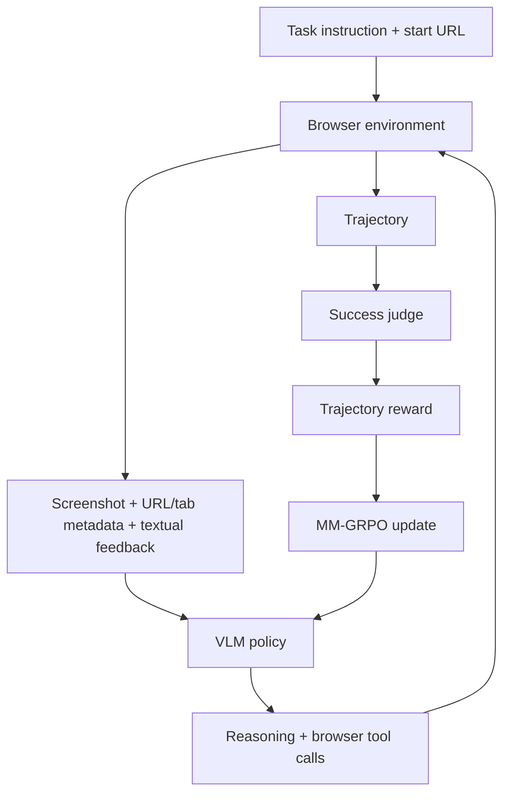

# OpenWebRL：视觉 Web Agent 的在线多轮强化学习到底难在哪里

> 研究者精读 · OpenWebRL 的价值不只是 4B 模型刷到更高分，而是系统拆解了 live-browser harness、少量 SFT warm start、环境反馈、trajectory judge、上下文管理和 MM-GRPO 为什么共同决定在线 Web RL 能不能跑稳。

| 字段 | 内容 |
|---|---|
| 论文 | [OpenWebRL: Demystifying Online Multi-turn Reinforcement Learning for Visual Web Agents](https://arxiv.org/abs/2606.02031) |
| 作者 | Rui Yang, Qianhui Wu, Yuxi Chen, Hao Bai, Wenlin Yao, Hao Cheng, Baolin Peng, Huan Zhang, Tong Zhang, Jianfeng Gao |
| 机构 | UIUC, Microsoft Research |
| 项目 | [openwebrl.github.io](https://openwebrl.github.io/) |
| 代码 / 数据 / 模型 | [GitHub](https://github.com/OpenWebRL/OpenWebRL)、[Hugging Face](https://huggingface.co/OpenWebRL) |
| 核心方法 | SFT warm start + live-web MM-GRPO + trajectory-level judge |

## 一句话结论

OpenWebRL 证明，小型视觉 Web Agent 可以通过真实网页在线多轮 RL 获得显著提升，但前提不是“把模型丢进浏览器随便试”。它需要完整训练系统：

- 从 WebGym 292K raw tasks 中筛出高质量 seed；
- 用 Qwen3-VL-235B teacher 和 GPT-4.1 judge 选出 412 条成功 SFT warm-start 轨迹；
- 在约 2.2K open-web RL tasks 上训练 Qwen3-VL-4B；
- 用 live-browser harness 返回截图、URL、tab metadata 和 textual environment feedback；
- 用 trajectory-level judge 给成功奖励；
- 用 MM-GRPO 把轨迹级 reward 分配到多轮 assistant tokens。

主结果：

- Qwen3-VL-4B base 平均 39.3；
- 412 条 SFT 后平均 52.0；
- 在线 RL 后 OpenWebRL-4B 平均 68.4；
- WebVoyager / Online-Mind2Web / DeepShop 分别为 74.1 / 67.0 / 64.0；
- RL over SFT 为 +16.4 points。

## 研究问题

视觉 Web Agent 的难点不是“看不看得懂截图”这么简单。真实网页任务有很多状态性问题：

- 页面动态加载；
- 点击不一定生效；
- 输入框可能没聚焦；
- tab 会切换；
- 滚动可能到边界；
- 页面会弹窗、限制访问或 CAPTCHA；
- 一步错误会改变后续状态；
- 任务约束需要在十几步里持续保持。

静态 imitation trajectory 有用，但也有三类瓶颈：

1. 高质量演示昂贵；
2. 网页变化快，静态轨迹容易过期；
3. teacher trajectory 和 student 当前策略分布不一致。

OpenWebRL 的问题是：在线 RL 能不能让小型开放 VLM 在真实网页环境里学会恢复、重试、保持约束和执行长任务？

## 系统结构

## 动作空间

OpenWebRL 使用 13 个原子浏览器工具。

| 类别 | 工具 | 作用 |
|---|---|---|
| Pointer | click, hover, drag | 点击、悬停、拖拽 |
| Keyboard | write, press keys | 输入文本、快捷键 |
| Navigation | scroll, goto url, go back, wait | 页面跳转与等待 |
| Tab | new tab, switch tab, close tab | 标签页管理 |
| Termination | done(answer) | 结束并提交答案 |

关键不是工具数量，而是每次工具执行后的 environment feedback。截图只能告诉模型“现在画面长什么样”，但 textual feedback 能告诉模型“动作有没有真的执行”。

例子：

- click 后返回目标元素、坐标、是否导航或新开 tab；
- write 后返回实际聚焦元素和输入值；
- scroll 后返回方向、比例、是否到达边界；
- goto url 失败时返回具体网络错误；
- wait 后返回页面稳定状态。

这类反馈是 Web Agent 的运行时记忆，不只是日志。

## 上下文管理

OpenWebRL 默认只保留最近 1 张截图，但保留完整历史 reasoning 和 environment feedback。

这个设计的含义是：

- 当前截图负责视觉 grounding；
- 历史 reasoning 负责目标、约束和计划；
- environment feedback 负责动作后果；
- 文本历史比多张视觉帧更适合长期记忆。

消融结果支持这一点：

| 变体 | WebVoyager | Online-Mind2Web | DeepShop | 解读 |
|---|---:|---:|---:|---|
| OpenWebRL-4B | 74.1 | 67.0 | 64.0 | 完整系统 |
| recent two screenshots | 68.2 | 65.3 | 59.3 | 多一张截图无稳定收益 |
| w/o textual feedback | 64.9 | 57.0 | 56.7 | 动作后果丢失 |
| w/o historical reasoning | 55.5 | 41.3 | 54.7 | 长期约束维护崩得最明显 |

这说明 OpenWebRL 的提升不只是看图能力，而是把交互历史转换成可学习的文本状态。

## 数据管线

### 1. 从 WebGym 过滤任务

初始任务池来自 WebGym 的 292K raw tasks。作者过滤掉：

- benchmark 重叠任务；
- 父 intent 拆出来的 subtasks；
- 长尾或不稳定网站；
- 近重复 intent。

近重复检测使用 Qwen3-Embedding-8B：

- SFT candidate pool 阈值 0.99，得到 15,601 seed tasks；
- RL task pool 阈值 0.95，得到约 2.2K tasks。

### 2. 生成 SFT warm start

SFT 不是大量堆数据，而是少量高质量轨迹。

流程：

1. Qwen3-VL-235B-A22B-Thinking teacher 每个 seed task 采样 4 条轨迹。
2. GPT-4.1 根据最终答案、interaction history 和截图轨迹判断成功。
3. 每个 task group 保留最短成功轨迹。
4. 控制每个网站的任务数量。
5. 最终得到 412 条成功轨迹，覆盖 70 个网站。

这 412 条轨迹的角色是 exploration bootstrap，不是最终能力来源。

### 3. 在线 RL

RL 阶段在约 2.2K live-web tasks 上做 MM-GRPO。每个任务采样一组 trajectories，reward 来自 trajectory-level success judge。

MM-GRPO 的要点：

- 同一任务组内标准化 advantage；
- 同一 trajectory 的 advantage 分配给该 trajectory 中所有 assistant turns 的 assistant tokens；
- 不做 trajectory length normalization，以免削弱长任务学习信号；
- KL coefficient 和 entropy coefficient 为 0；
- 固定 reward 全相同的 group 会被丢弃，因为没有相对学习信号。

## 主结果

| 模型 | Steps | Tasks | WebVoyager | Online-Mind2Web | DeepShop | Avg |
|---|---:|---:|---:|---:|---:|---:|
| Qwen3-VL-4B-Thinking | 30 | - | 52.6 | 32.0 | 33.3 | 39.3 |
| OpenWebRL-4B-SFT | 30 | 0.4K | 60.2 | 47.0 | 48.7 | 52.0 |
| OpenWebRL-4B | 30 | 2.2K | 74.1 | 67.0 | 64.0 | 68.4 |
| OpenWebRL-4B w/ Judge-8B | 30 | 2.2K | 68.9 | 67.3 | 68.7 | 68.3 |
| Qwen3-VL-8B-Thinking | 30 | - | 61.3 | 38.7 | 44.0 | 48.0 |
| OpenWebRL-8B | 30 | 2.2K | 73.8 | 67.0 | 65.3 | 68.7 |
| OpenWebRL-8B | 50 | 2.2K | 74.6 | 69.7 | 63.3 | 69.2 |
| Gemini computer-use-preview | 100 | - | 88.6 | 57.3 | 62.0 | 69.3 |
| OpenAI computer-use-preview | 100 | - | 70.9 | 58.3 | 24.7 | 51.3 |

最重要的不是 OpenWebRL-4B 是否“全面超过闭源系统”，而是它用 4B backbone、0.4K SFT trajectories 和 2.2K RL tasks，在 Online-Mind2Web 与 DeepShop 上明显超过许多更大或更多演示数据的 open agents，并接近 proprietary computer-use systems 的平均表现。

## 消融分析

### SFT warm start

从 base 直接 RL 也能学，但 hard tasks 上提升很有限。论文报告：

- SFT warm start 在 hard tasks 上 +22.3 points；
- base init 只 +2.3 points；
- 从 SFT checkpoint 开始的 MM-GRPO 训练曲线长期更好。

但更多 SFT 不一定更好。默认 0.4K / 3 epochs 优于 0.4K / 1 epoch，也优于 1.9K / 3 epochs。作者的解释是：过重 imitation 可能降低后续 RL plasticity。

### Rollout-length curriculum

默认训练先 90 iterations、max 15 steps，再 50 iterations、max 30 steps。

固定 horizon 的问题：

- 固定 30-step early training 慢且噪；
- 固定 10-step 无法覆盖长任务；
- 固定 15-step 少了后期长任务能力。

curriculum 让模型先学会短路径交互，再进入更长 horizon。

### Judge

默认训练 judge 是 GPT-4.1。作者估算 typical training run 需要 43.2K judge API calls，成本约 545.5 美元。

为降低依赖，作者用 12.5K online rollouts 和 GPT-4.1 labels 蒸馏 OpenWebRL-Judge-8B。

| Judge | Accuracy | Precision | Recall | F1 |
|---|---:|---:|---:|---:|
| OpenWebRL-Judge-8B | 89.8 | 89.5 | 94.8 | 92.1 |
| GPT-4o | 85.6 | 83.6 | 93.4 | 88.3 |
| Qwen3-VL-32B-Instruct | 85.8 | 87.4 | 88.3 | 87.8 |

更关键的是训练动态：普通 Qwen3-VL-8B judge 会被策略 reward hacking，离线准确率不是充分条件。

## 失败来源

作者人工分析了 100 条 Online-Mind2Web failed trajectories，且说明这组分析没有使用 Browser-Use Stealth Browser service，因此 access issues 可能偏高。

| 失败类型 | 占比 | 含义 |
|---|---:|---|
| access / environment issues | 51% | 页面加载失败、访问限制、CAPTCHA、网站阻塞 |
| reasoning / knowledge limits | 27% | 漏价格、颜色、评分、尺寸、产品类型等约束 |
| visual grounding / interaction errors | 13% | 点错元素、漏 dropdown、漏分页 |
| task definition / judge issues | 9% | 任务定义或评测边界问题 |

这张失败分析很重要，因为它说明 Web Agent 的性能不是单纯模型推理问题。浏览器基础设施、站点阻塞、任务协议和 judge 都是系统瓶颈。

## 图表怎么读

### Figure 1 / Table 2：主结果

支撑“在线 RL 有效”。关键读数是 4B base 39.3、SFT 52.0、RL 68.4，而不是只看最终最高分。

### Figure 2：SFT init vs base init

支撑 warm start 是 exploration bootstrap。SFT 不只是提高初始分，而是让后续 RL 进入更可学习区域。

### Figure 3：reasoning pattern

论文观察 RL 后模型更常写 history summarization 和 blocker diagnosis，但不是简单变啰嗦。它说明 RL 改变了模型如何在长任务中维护状态。

### Figure 4：pass@k

pass@k 提升说明策略分布中更容易采到成功路线。它和单次 success rate 互补，适合衡量多次尝试下的可用性。

### Figure 5 / Table 3：judge

说明 judge 不只是离线分类器，而是在线 RL reward model。一个 judge 离线看起来不错，仍可能在训练中被利用。

### Table 4：上下文消融

这是最能解释方法的表。environment feedback 和 historical reasoning 一删，长任务表现大幅下降；多保留一张截图反而没有稳定收益。

## 局限

1. 结果只覆盖 WebVoyager、Online-Mind2Web、DeepShop，不能外推到所有真实网站。
2. 51% 环境失败说明浏览器基础设施和访问限制仍是核心瓶颈。
3. Judge-8B 还未证明跨网站、跨任务、对抗式轨迹下完全鲁棒。
4. 更多 SFT 是否有害只在特定数据和训练组合下成立，不能泛化成规律。
5. 完整复现成本高：需要 CUDA、Playwright、SGLang/Megatron/slime、judge endpoint、Orchard 或 local browser service，以及约 300 B200 GPU hours。
6. 真实 Web Agent 会涉及登录、购物、提交表单、个人数据和不可逆动作，论文 benchmark 不等于完整安全评测。

## 对 Agent 研究的启发

### 1. 环境反馈是状态接口

OpenWebRL 说明，动作后果文本比多保留视觉帧更重要。这一点可以迁移到：

- search agent 的 retrieval feedback；
- coding agent 的 test / diff / command feedback；
- GUI agent 的 accessibility feedback；
- database agent 的 query plan / result feedback。

### 2. Online RL 需要系统工程

不是有 reward 就能 RL。需要：

- 稳定环境；
- 高质量初始化；
- 可用 judge；
- 上下文策略；
- horizon curriculum；
- 失败归因；
- 动态采样。

### 3. 视觉历史不等于长期记忆

长任务里，模型更需要知道“我为什么点这里、上一步发生了什么、还有哪些约束没满足”，而不是多看几张旧截图。

### 4. 安全边界还没完全进入训练

真实浏览器 Agent 可能执行 state-changing actions。后续训练协议需要把权限、确认、拒绝、审计和回滚也纳入环境和 reward，而不是只奖励 task success。

## 还要继续追问

1. environment feedback 能否标准化成跨浏览器/跨任务的 Agent state API。
2. trajectory-level reward 如何做更细粒度 credit assignment。
3. Judge-8B 如何抵抗策略性 reward hacking。
4. 在线训练访问真实网站时如何处理 rate limit、robots、合规和站点负载。
5. 任务成功与安全约束冲突时，reward 如何表达“应该停下来”。
6. 4B / 8B 之外，更小端侧模型或更大 VLM 的 scaling law 是什么。

## 阅读定位

OpenWebRL 最有价值的不是一个新 SOTA 数字，而是把视觉 Web Agent 在线 RL 变成可审计系统：什么数据让探索可行，什么反馈让状态可恢复，什么 judge 能提供奖励，什么上下文最该保留。它给 Agent 训练的启发是，长程能力来自模型和 harness 的共同设计。

打开原文：[arXiv:2606.02031](https://arxiv.org/abs/2606.02031)
