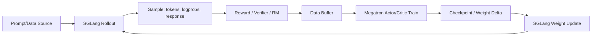

# slime：把大模型后训练的 RL、OPD 与 Agentic Rollout 收进同一条工程闭环

### 元信息

| 字段 | 内容 |
| --- | --- |
| 项目 | THUDM/slime |
| 类型 | 代码项目 / 后训练框架 |
| 方向 | 大模型后训练、RL Scaling、Agentic RL |
| 原始链接 | [https://github.com/THUDM/slime](https://github.com/THUDM/slime) |
| 本轮日期证据 | GitHub API 显示仓库 `pushedAt=2026-06-08T01:38:23Z`，最新提交为 `1de8347e8e6283ab4b7234073155a1a9aa3d5eb3` |
| 许可与规模 | Apache-2.0；本轮抓取时约 6020 stars、873 forks |

### TL;DR

- **slime 解决的问题**：大模型后训练中的 RL loop 通常被拆成训练器、推理服务、reward/verifier、数据缓冲、agent 环境与权重同步等多套系统；slime 选择把 Megatron 训练、SGLang rollout、Data Buffer、自定义生成函数和 reward 函数放进同一条闭环，降低“每个模块都能跑、合在一起却不可信”的风险。
- **核心做法**：训练侧固定围绕 Megatron，推理/rollout 侧固定围绕 SGLang；参数尽量 pass-through 到上游引擎，slime 自己只补 RL 数据流、权重同步、样本组织、插件接口、异步 rollout、调试与 CI 合约。
- **关键机制**：一次 rollout 产生样本、logprob、reward/verifier 结果，Data Buffer 把它交给 actor/critic 训练；训练后 actor 权重同步回 SGLang，再开始下一轮采样。这个机制支持 GRPO、PPO、REINFORCE++、GSPO，也把 OPD 做成可叠加的 token-level KL 项。
- **Agentic RL 价值**：slime 的 agent 样例不是另起一套 agent runtime，而是通过 `--custom-generate-function-path`、`--custom-rm-path`、`--rollout-function-path` 等接口接入多轮工具调用、搜索、sandbox、coding-agent、multi-agent 和 verifier reward。
- **实验/证据**：文档给出 Qwen3-8B-Base 在 OpenThoughts3-1.2M 子集上的初步 OPD 结果，SFT 后 Pass@1 为 76%，叠加 Qwen3-32B teacher 的 on-policy distillation 后到 94%；README 还列出 GLM-5.1/5/4.7/4.6/4.5 等实际后训练使用背景。
- **工程证据**：仓库包含 CPU 单测、plugin contract tests、GPU E2E tests、PPO/OPD/async rollout/weight sync/agent trajectory 等测试文件；同时文档明确 H100/H200 有完整 CI，B200 基本可用但 CI 保护不足。
- **局限**：slime 的强项来自“押注 Megatron + SGLang”而不是多后端通吃；这让系统能用更深的 SGLang routing、PD disaggregation、delta weight sync，但也意味着用户需要接受较重的 Megatron checkpoint、Docker/GPU/Ray/SGLang 运维栈。
- **研究意义**：这类框架把后训练研究从“算法公式”推向“系统闭环正确性”：reward 是否对应同一批 token、rollout 是否被长尾样本拖慢、权重同步是否与生成竞争、agent 轨迹是否能被证明来自模型采样，都会直接影响 RL 信号是否可信。

### 这篇代码项目真正关心什么？

- **表层问题**：如何把大模型 RL 后训练跑快、跑稳、跑到大模型规模。
- **深层问题**：如何让“采样得到的数据”与“训练吃到的数据”在复杂 agent 场景下仍然保持同一性。
- **更深一层**：当后训练进入工具调用、sandbox、multi-agent、长上下文、异步生成以后，训练框架不能只关心 loss，还必须证明数据路径没有在字符串、token、reward、logprob、checkpoint 之间失真。

| 传统拆法 | 常见风险 | slime 的取向 |
| --- | --- | --- |
| 单独训练器 | 训练快，但不一定知道 rollout 的真实 token 与 reward 来源 | Megatron 训练与 rollout 数据结构强绑定 |
| 单独推理服务 | 服务吞吐高，但权重同步、router、KV/offload 与训练节奏脱节 | SGLang 是第一等 rollout backend |
| 单独 agent 框架 | 工具链灵活，但轨迹常以字符串日志存在 | agent loop 通过 Sample/TokenSegment 回到训练样本 |
| 单独 reward/verifier | reward 能算，但很容易和样本生命周期错位 | reward、logprob、postprocess 在 rollout 路径内组织 |
| 单独调试脚本 | 能复现局部问题，但很难验证闭环 | debug rollout-only、train-only、trace、CI 都进入工程面 |

### 为什么 slime 不追求“多后端抽象”？

- README 的关键判断是：后训练框架如果同时抽象多个训练与推理后端，很容易落到“共同子集”。
- 对 RL scaling 来说，共同子集往往不够用，因为瓶颈来自：
  - 大模型 checkpoint 与分片格式；
  - 推理侧 KV cache、router、prefill/decode 资源比例；
  - 训练后权重如何低开销推给 rollout engine；
  - 多轮 agent 如何保持 session affinity；
  - 长尾样本如何不阻塞全局 step。
- slime 因此选择一条窄但深的路径：
  - **训练后端**：Megatron；
  - **rollout 后端**：SGLang；
  - **调度骨架**：Ray placement groups；
  - **数据桥**：Data Buffer / Sample；
  - **扩展口**：函数路径插件，而不是新建抽象框架。

### 核心闭环：rollout、训练、同步、再 rollout



- `train.py` 的主循环非常直接：
  - 建 Ray placement groups；
  - 启 rollout manager；
  - 建 actor/critic training models；
  - 先把 actor 权重推给 rollout；
  - 每轮执行 `generate → train → save/offload → update_weights → eval`。
- 这个顺序的意义不只是“工程流水线”：
  - rollout 使用的是当前 actor；
  - actor 训练吃的是当前 rollout；
  - 下一轮采样前同步新 actor；
  - eval 可按 rollout interval 插入；
  - offload/onload 明确处理训练与推理共卡时的显存占用。

### 用公式看 RL 样本量约束

slime 文档把一轮采样与一轮训练之间的样本量关系写得很清楚：

$$
\text{rollout\_batch\_size} \times \text{n\_samples\_per\_prompt}
=
\text{global\_batch\_size} \times \text{num\_steps\_per\_rollout}
$$

变量解释：

- `rollout_batch_size`：每轮采样多少个 prompt；
- `n_samples_per_prompt`：每个 prompt 采样多少个回答，GRPO 类算法常用它做组内比较；
- `global_batch_size`：一次参数更新消费多少样本；
- `num_steps_per_rollout`：同一批 rollout 数据被用于多少次 optimizer step；
- 默认 on-policy 语境下，`num_steps_per_rollout=1` 更容易保证数据与策略版本一致。

为什么这条式子重要：

- 如果左边大于右边，Data Buffer 会积压旧策略生成的样本；
- 如果左边小于右边，训练会复用或等待数据，破坏吞吐；
- 如果多轮 agent 生成把一个 prompt 拆成多个 segment，就必须额外保证这些 segment 不被当作多个独立 rollout 放大 reward。

### OPD：后训练不是只做 RL，也可以叠加 teacher KL

slime 的 on-policy distillation 文档给出一个很关键的设计：OPD 与 advantage estimator 正交。

它把原本的优势项改写为：

$$
\hat{A}_t
=
A_t
-
\lambda_{\mathrm{opd}}
\cdot
D_{\mathrm{KL}}
\left(P_{\mathrm{teacher}} \parallel P_{\mathrm{student}}\right)_t
$$

逐项解释：

- `A_t`：GRPO、PPO、REINFORCE++、GSPO 等基础 estimator 得到的原始 advantage；
- `λ_opd`：`--opd-kl-coef`，控制 distillation 信号相对 RL advantage 的权重；
- `P_teacher`：teacher 在 token 位置 `t` 上的分布；
- `P_student`：正在训练的 student/actor 分布；
- `D_KL`：token 级 reverse KL 惩罚，用来把 student 拉近 teacher。

两种 teacher 模式的边界：

| 模式 | teacher 位置 | 适用场景 | 主要成本 |
| --- | --- | --- | --- |
| `--opd-type sglang` | 外部 SGLang server | teacher 架构不同、体量太大、无法和训练模型同卡加载 | rollout 阶段要请求 teacher logprob |
| `--opd-type megatron` | Megatron 内部额外模型 | teacher 与 student/reference 架构相同、GPU 能放下 | training forward 里多算 teacher logprob |

文档中的初步数字：

| 设置 | Pass@1 |
| --- | ---: |
| Qwen3-8B-Base + SFT | 76% |
| Qwen3-8B-Base + SFT + OPD，teacher 为 Qwen3-32B | 94% |

这组数字不能被解读成“OPD 普遍提升 18 个点”。

更稳妥的解释是：

- 在这个 Qwen3-8B/OpenThoughts3 子集设置里，teacher token-level 分布提供了强监督；
- OPD 在 slime 里是 reward/advantage 之外的可组合项；
- 它的工程价值在于能和 GRPO/PPO 等 estimator 一起跑，而不是把蒸馏与 RL 做成两条互斥训练链。

### Agentic RL：插件口比“新框架”更重要

slime 的 agentic 设计值得细读，因为它没有把 agent 做成另一个顶层平台。

它把 agent loop 放进以下接口：

| 需求 | 接口 |
| --- | --- |
| 每个样本运行工具调用、RAG、sandbox、多轮环境交互 | `--custom-generate-function-path` |
| 计算 verifier reward、测试 reward、环境 success reward | `--custom-rm-path` |
| 完全替换 rollout orchestration | `--rollout-function-path` |
| 自定义 prompt/task 来源、重排、requeue | `--data-source-path` |
| 为 agent 轨迹附加 loss mask 或转换训练样本 | `--rollout-data-postprocess-path` / `--custom-convert-samples-to-train-data-path` |

这种接口设计有一个研究判断：

- agent 是数据生成流程，不应该改写训练 kernel；
- tool call、sandbox、search、multi-agent 都是“如何得到样本和 reward”的问题；
- 只要最后回到 token、logprob、loss_mask、reward，训练侧可以保持稳定。

### Coding-Agent RL 样例的关键不是 Claude Code，而是 token provenance

`examples/coding_agent_rl` 看起来像一个 SWE agent demo，但真正值得关注的是“字符串进、token 出”的约束。

它的流程是：

1. 每个样本启动一个新 sandbox；
2. coding agent 在 sandbox 中使用 Read/Edit/Grep/Bash/Agent 等工具；
3. agent 输出一个 `git diff`；
4. 第二个干净 sandbox 用测试 harness 评分，减少 test-cheating；
5. Anthropic-compatible adapter 记录每轮 prompt token、output token、rollout logprob；
6. 训练导出时不用重新 tokenize 字符串，而是使用当时 SGLang 采样出的 token ids。

为什么这点关键：

- 多轮 agent 的工具观察通常是字符串；
- 后续 prompt 会把历史 output、工具观察、compact 后消息重新拼起来；
- 如果训练时重新 tokenize “看起来一样”的文本，token 边界可能已经变了；
- 一旦 token provenance 断裂，RL 优化的就不一定是模型实际采样过的 token。

`slime/agent/trajectory.py` 的策略可以概括为：

```text
Input:
  TurnRecord(prompt_ids, output_ids, output_log_probs) 列表
State:
  prompt_ids, response_ids, loss_mask, rollout_log_probs
Loop:
  对第一轮，prompt 作为 segment prompt
  对后续轮次：
    如果 prompt base 改变，重新开始 segment
    如果 prompt suffix 与已有 response 只部分匹配，截断不可信 response
    对工具/环境新增上下文，loss_mask=0
    对模型新输出 token，loss_mask=1
Output:
  TokenSegment(prompt_ids, response_ids, loss_mask, rollout_log_probs)
Failure boundary:
  只要 token 来源无法证明，就保留上下文但不反传 loss
```

这个设计的意义：

- 它承认 agent 轨迹会发生 compact、subagent dispatch、prompt restart；
- 它不强求每个字符串片段都能训练；
- 它宁愿把不可信 token mask 掉，也不把漂移后的文本当作模型输出优化。

### Fan-out：一个 rollout 可以拆成多个训练 segment，但 reward 不能被放大

coding-agent 文档提到三类 segment：

- `subagent`：完成的 Task/Agent dispatch；
- `wipe`：自动 compact 冻结前的链；
- `final`：主链尾部。

如果一个完整轨迹被拆成 `K` 个 segment，slime 的样例做法是：

$$
r_i = \frac{r_{\mathrm{trajectory}}}{K}
$$

并让这些 sibling samples 共享同一个 `rollout_id`。

这样做解决两个问题：

- 训练可以看到更细的 token segment；
- reducer 不会因为 segment 变多而把同一条轨迹的 reward 统计成 `K` 条独立成功。

这对 agentic RL 很重要，因为 subagent 越多、compact 越频繁，segment 数就越不稳定。

### 异步 rollout：后训练系统的瓶颈不总在训练

`examples/fully_async` 说明 slime 还有一条 fully-async rollout 路径。

核心机制：

- 用 `train_async.py`；
- 把 rollout function 换成 `slime.rollout.fully_async_rollout.generate_rollout_fully_async`；
- 后台 `AsyncRolloutWorker` 维持固定数量的 in-flight generation；
- 当前训练 step 不必等待最慢样本完全结束后才启动下一批生成；
- `ABORTED` 样本会被 requeue，而不是直接进入训练。

适用场景：

| 场景 | 为什么会长尾 | fully-async 的作用 |
| --- | --- | --- |
| coding agent | 编译、测试、工具调用耗时差异巨大 | 让快样本先回流，慢样本不拖死整轮 |
| search/RAG agent | 外部检索、网页质量、网络延迟不稳定 | 维持 warm queue |
| multi-agent | 子 agent 数量和路径不固定 | 减少最慢轨迹对训练节奏的影响 |
| sandbox 环境 | boot、依赖安装、评测命令波动 | requeue/abort 更可控 |

局限也很明确：

- fully-async 示例暂不支持 evaluation mode；
- 跨 rollout 的 ordering 是 best-effort；
- partial-rollout 式 resume 对 `ABORTED` 轨迹还未完全接好，当前是重排队重跑。

### SGLang-native：router、PD disaggregation 与 delta weight sync 为什么进入后训练讨论？

很多后训练论文只写 reward 与 loss，但生产级 RL scaling 会被推理侧系统细节支配。

slime 把这些能力显式放进文档：

- SGLang 参数可用 `--sglang-` 前缀透传；
- router 参数可用 `--router-` 前缀透传；
- multi-turn agent 可用 session affinity；
- prefill/decode disaggregation 可为多轮 agent 区分资源；
- external rollout engine 可由外部系统管理；
- full/delta weight update 可走 NCCL 或共享文件系统；
- co-locate 模式下可以 offload train 或 rollout 释放显存。

把这些能力放进 RL 框架的原因：

- rollout 不是普通 inference，它要和训练权重版本保持同步；
- agent 多轮请求需要路由稳定，否则 KV/cache 和上下文亲和性会浪费；
- 大模型每轮全量权重同步成本高，delta sync 直接影响 step 时间；
- 训练与推理共卡时，offload/onload 顺序错误会变成难排查的 OOM 或性能抖动。

### 代码结构读法

| 路径 | 角色 | 读法 |
| --- | --- | --- |
| `train.py` | 同步训练主循环 | 看 rollout、train、weight update 的顺序 |
| `train_async.py` | 异步训练主循环 | 看下一轮 rollout 如何提前启动 |
| `slime/ray/rollout.py` | SGLang server group、router、engine 生命周期 | 看 placement group、server group、offload/onload |
| `slime/rollout/sglang_rollout.py` | 默认 SGLang rollout | 看 prompt ids、SGLang `/generate`、logprob、reward 的组织 |
| `slime/agent/trajectory.py` | agent token segment 归并 | 看 token provenance 与 loss mask |
| `docs/en/get_started/customization.md` | 插件接口地图 | 看 agentic workload 怎样不改核心训练 |
| `docs/en/advanced/on-policy-distillation.md` | OPD 机制 | 看 teacher mode 与 KL 项 |
| `examples/coding_agent_rl` | SWE coding-agent RL | 看 sandbox、adapter、diff、test reward |
| `examples/fully_async` | 异步 rollout | 看长尾样本处理 |

### 与 OpenRLHF、veRL、OpenHands 式 agent 框架的差异

这里不做跑分式比较，只看设计取向。

| 维度 | slime 的取向 | 代价 |
| --- | --- | --- |
| 后端 | Megatron + SGLang 深绑定 | 不适合想快速换 vLLM/FSDP/Trainer 的用户 |
| 数据生成 | 函数路径插件接入 | 插件作者要理解 Sample、loss_mask、metadata |
| agent 支持 | agent 是 rollout 形态 | 不提供完整产品化 agent UI/runtime |
| 大模型规模 | 优先服务大规模 MoE/dense 后训练 | 环境准备重，Docker/GPU/Ray 要求高 |
| 正确性 | token provenance、CI、debug path 明确 | 学习曲线比轻量脚本高 |
| 系统优化 | PD、router、delta weight sync、external engine | 配置面更宽，需要更强集群经验 |

### 证据边界：哪些结论可以拿走，哪些不能？

可以较稳地拿走：

- slime 是一个围绕 Megatron + SGLang 的 RL 后训练框架；
- 它支持 PPO/GRPO/REINFORCE++/GSPO 与 OPD 叠加；
- 它有 agentic rollout 插件接口，并给出 multi-agent、search、coding-agent、fully-async 样例；
- 它在 README 中把 GLM 系列后训练实践作为生产验证背景；
- 它的代码显式处理 token-level trajectory merge、loss mask、rollout logprob 与 weight update。

需要保留边界：

- README 中的生产验证不是公开论文式消融，无法独立拆分 slime 对 GLM 系列表现的贡献；
- OPD 的 76% 到 94% 是初步示例结果，不等于跨任务普遍收益；
- 大量 GPU E2E 测试需要相应硬件环境，本轮没有在本机跑训练测试；
- B 系列 GPU 支持在 quick start 中被标为基本稳定但缺少完整 CI 保护；
- agentic coding RL 样例依赖 sandbox、Claude Code CLI tarball、E2B-compatible 集群和网络回连，不是开箱即跑的轻量 demo。

### 失败模式清单

| 失败模式 | 表现 | slime 中相关防线 |
| --- | --- | --- |
| rollout 与训练策略版本错位 | 用旧 actor 样本训练新 actor 太多步 | `num_steps_per_rollout`、weight update 顺序 |
| reward 被 segment fan-out 放大 | 子 agent 越多 reward 越大 | 共享 `rollout_id`、reward/K |
| 字符串重 tokenization 漂移 | 训练 token 不是采样 token | `TurnRecord`、`TokenSegment`、loss mask |
| 推理长尾拖慢训练 | 最慢 sandbox 阻塞整轮 | fully-async worker、requeue |
| 权重同步成本过高 | 大模型每轮同步慢 | full/delta、NCCL/disk、external engine |
| SGLang router 不稳定 | 多轮 agent cache 与 session 断裂 | session affinity、router 参数透传 |
| 共卡显存竞争 | rollout 与 train 互相 OOM | offload/onload、colocate 配置 |
| 自定义插件破坏样本结构 | loss mask/reward/logprob 不齐 | plugin contract tests 与接口签名 |

### 研究者视角：slime 把后训练问题推向哪里？

- 第一，后训练不再只是“选 GRPO 还是 PPO”。
  - 真正难的是把采样、reward、logprob、teacher KL、权重同步和训练 step 对齐。
  - 任何一个环节错位，算法公式都可能给出错误信号。

- 第二，agentic RL 的基本单位不是一段文本，而是一条可审计轨迹。
  - 轨迹中有模型 token、工具观察、sandbox side effect、subagent segment、compact 后上下文。
  - 训练框架必须区分哪些 token 可以反传、哪些只是上下文。

- 第三，系统吞吐会改变可研究的问题。
  - 如果 rollout 占 90% 以上时间，那么算法改进可能被系统长尾掩盖。
  - fully-async、partial rollout、active partial rollout 这类方向会变成后训练研究本身的一部分。

- 第四，OPD 与 RL 的组合说明“后训练”正在从单一阶段变成混合目标。
  - RL reward 提供任务成功信号；
  - teacher KL 提供行为约束；
  - verifier 提供可判定目标；
  - loss mask 决定哪些 token 真正被优化。

### 继续追问

- slime 的 OPD 在不同 teacher/student 架构差异下是否稳定，尤其是 tokenizer、chat template、tool-call parser 不同时？
- fully-async rollout 在强 on-policy 假设下会引入多大的策略陈旧度，是否需要 staleness-aware advantage 或 importance correction？
- coding-agent RL 的 test reward 是否会诱导 agent 学会针对 sandbox/harness 的捷径，即使第二个干净 sandbox 已经降低了作弊风险？
- delta weight sync 对 MoE 大模型、低秩变化、稀疏路由更新是否能长期保持高收益？
- 多 agent fan-out 后的 reward/K 是否总是合理，还是应该按 token 数、子任务难度、subagent 贡献做更细分配？
- 当 agent 轨迹出现 prompt drift，当前策略是 mask 掉不可信 token；未来是否可以保留一个“可解释不可训练”的审计通道，专门分析 drift 原因？

### 结论

- slime 最值得关注的地方，不是它列了多少模型脚本，而是它把 RL 后训练的**系统闭环正确性**放到了前台。
- 它的工程判断很鲜明：
  - 不做多后端共同子集；
  - 深押 Megatron + SGLang；
  - 让 agent、search、sandbox、verifier 都作为 rollout 数据生成形态接入；
  - 用 token provenance、loss mask、weight sync、CI 与 debug path 保护训练信号。
- 对研究者来说，slime 提醒我们：
  - 后训练算法的可信度越来越依赖系统实现；
  - Agentic RL 的样本不是普通文本；
  - 能否证明“训练 token 来自真实采样轨迹”，会成为下一阶段大模型后训练框架的核心门槛。
