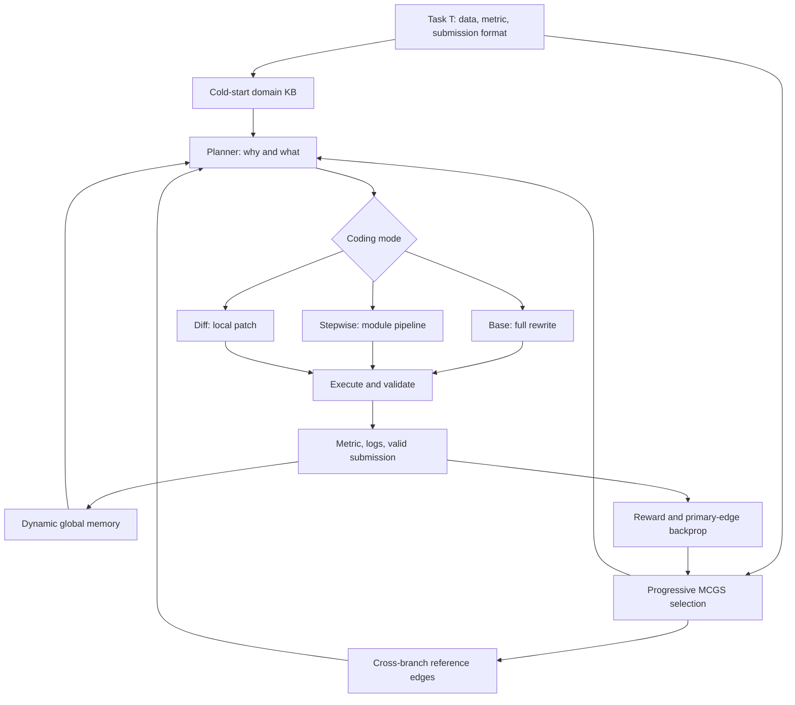

# MLEvolve：把 ML 工程 Agent 从“试一次代码”推进到可复用的搜索系统

### 元信息

| 字段 | 内容 |
| --- | --- |
| 论文 | [MLEvolve: A Self-Evolving Framework for Automated Machine Learning Algorithm Discovery](https://arxiv.org/abs/2606.06473) |
| 作者 | Shangheng Du、Xiangchao Yan、Jinxin Shi、Zongsheng Cao、Shiyang Feng、Zichen Liang、Boyuan Sun、Tianshuo Peng、Yifan Zhou、Xin Li、Jie Zhou、Liang He、Bo Zhang、Lei Bai |
| 机构 | Shanghai Artificial Intelligence Laboratory；East China Normal University |
| 日期 | arXiv v1：2026-06-04 17:55:59 UTC；GitHub README timeline：2026-06-05 论文发布 |
| 类型 | 论文 + 开源代码项目 |
| 代码 | [InternScience/MLEvolve](https://github.com/InternScience/MLEvolve) |
| 主题 | LLM Agent、机器学习工程、Monte Carlo Graph Search、经验记忆、自动算法发现 |

### TL;DR

- **这篇论文要解决的问题**：现有 ML 工程 Agent 在 Kaggle 式任务里往往沿着一条或几条树状轨迹试代码，分支之间不能共享经验，搜索过程也不记得过去失败过什么，导致 12 到 24 小时预算内大量重复试错。
- **MLEvolve 的核心做法**：把解法搜索建成有主边和参考边的图，提出 **Progressive MCGS**，让分支之间可以引用强节点；再加 **Retrospective Memory**，把每次尝试的 plan、code、metric、失败标签写入可检索记忆；最后用 Base / Stepwise / Diff 三种代码生成模式，把“决定改什么”和“如何改代码”拆开。
- **主要证据**：在 75 个 MLE-Bench 任务上，MLEvolve 用 Gemini-3.1-Pro-preview、每题 12 小时、最多 500 次 expansion，达到 **65.3% ± 0.8 全部 medal rate**、**100% valid submission rate**、**34.7% gold rate**，高于 24 小时预算的 AIBuildAI 63.1% 和 MARS+ 62.7%。
- **跨域证据**：在 AlphaEvolve 数学优化的 15 个任务上，项目页和论文报告 MLEvolve 对 AlphaEvolve **14/15 个任务持平或更好**，其中 **11/15 个任务拿到最优结果**，说明它不只是 MLE-Bench 过拟合式 pipeline。
- **消融结论**：在 MLE-Bench Lite 22 题上，完整系统 medal rate 为 **81.82%**；去掉 Progressive MCGS 降到 **68.18%**，去掉 Retrospective Memory 也降到 **68.18%**，去掉 Adaptive Code Generation 降到 **72.73%**。附录 9 题细分里，去掉 intra-branch evolution 从 **66.67%** 掉到 **33.33%**，是最重的结构性损失。
- **局限**：主实验依赖 Gemini-3.1-Pro-preview、H200、234GB RAM、MLE-Bench/Kaggle 式可执行环境；很多 baseline 数字来自 leaderboard 或原论文，不是同一实验室统一重跑；系统能提高搜索效率，但也会继承 Kaggle benchmark、私有模型和自动提交验证器的边界。

### 研究问题：为什么“长程 ML Agent”不是多写几版代码就够了？

- 论文把 Machine Learning Engineering 视为一种典型长程 Agent 任务：
  - 输入不是单个 prompt，而是数据集、指标、提交格式、训练脚本、模型选择和时间预算。
  - 输出不是一段答案，而是能产生 `submission.csv` 的完整 ML pipeline。
  - 成功来自连续迭代：生成解法、运行代码、读取 metric、诊断失败、保留有效策略、继续改进。

- 作者指出现有 MLE Agent 有三类瓶颈：
  - **Branch isolation**：树搜索或线性改进里，一个分支试到的好技巧很难给另一个分支用。
  - **Memoryless search**：MCTS 常只回传标量 reward；下一次 planning 不知道之前为什么失败、哪些改动曾经有效。
  - **One-shot generation**：很多方法每轮重写完整方案，容易破坏已工作的代码，也难以控制局部修补。

- 这不是单纯“多 Agent 协作”能解决的问题：
  - 多 Agent 只增加角色，不自动解决搜索状态如何组织。
  - 没有记忆结构时，Agent 会反复踩同一类数据泄漏、提交格式、训练不稳定或局部最优。
  - 没有代码粒度控制时，强模型也可能把一个小修补变成不可验证的大改写。

### 论文主张与论证路线

| 主张 | 机制 | 证据 | 边界 |
| --- | --- | --- | --- |
| 长程 MLE 需要跨分支信息流 | MCGS 的 reference edges 连接非父子节点 | Figure 1/2 展示主边 + 参考边；附录案例展示跨分支引用 loss 设计 | reference edge 不参与 credit backprop，仍依赖 LLM 判断“哪些引用有用” |
| 搜索应从探索逐步转向利用 | UCT 与 Elite-Guided 的软切换，`w(t)` 随时间下降 | Figure 3 中有效活跃分支从 4.8 降到 2.8，Vanilla MCTS 约 4.3 | 只证明代表性任务趋势，不等于所有任务都需要同样 schedule |
| Agent 需要可检索经验，而不是只看分数 | Retrospective Memory：domain KB + global memory；BM25 + FAISS + RRF | Table 3 去掉 memory 掉 13.64 个 medal 点；Table 5 去掉 KB 或 global memory 都降到 44.44% | 记忆质量依赖记录粒度、embedding、失败标签；可能复用错误经验 |
| 代码生成需要层级控制 | Planner 决定 why/what，Coder 决定 how；Base/Stepwise/Diff 按状态切换 | 去掉 Adaptive Code Generation 后 medal rate 从 81.82% 到 72.73% | 论文没有给每种 coding mode 的单独大规模消融 |
| 系统不只适用于 MLE-Bench | 同一自演化机制迁移到数学优化 | 15 个 AlphaEvolve 任务中 11 个最佳，14 个持平或超过 AlphaEvolve | 数学任务仍是可程序化评测，不代表开放科学发现全覆盖 |


### 方法机制一：Progressive MCGS 如何把树搜索改成“可引用的图搜索”？

#### 1. 搜索对象是什么？

论文把候选 ML pipeline 写成：

```text
s* = arg max_{s in S} h(T, s)
```

变量解释：

| 符号 | 含义 |
| --- | --- |
| `T` | 当前 ML 工程任务，例如某个 Kaggle/MLE-Bench competition |
| `s` | 一个完整候选解法，覆盖预处理、特征、模型训练、预测和提交 |
| `S` | 可搜索的解法空间 |
| `h(T, s)` | 任务指标，例如 accuracy、AUC、loss 或 Kaggle 排名相关 metric |
| `s*` | 在预算内找到的最佳候选 pipeline |

#### 2. 图结构如何区别主边和参考边？

MLEvolve 用有向图组织搜索：

```text
G = (V, E)
E = E_T union E_ref
```

- `E_T` 是主生成边：
  - 表示节点 `v` 由父节点 `u` 经某个 operator 生成。
  - selection、simulation、backpropagation 都沿主边工作。

- `E_ref` 是参考边：
  - 表示新节点额外吸收了某些历史节点或其他分支节点的信息。
  - 它支持跨分支知识流，但不参与 reward 回传。

- 这个设计的意义：
  - 主边保留 MCTS 的 credit assignment 简洁性。
  - 参考边让搜索不再被树结构隔离。
  - 一个分支发现的有效 loss、backbone、CV 策略或数据清洗技巧，可以成为另一个分支的输入材料。

#### 3. Progressive schedule 如何避免后期还在均匀乱试？

标准 UCT 形式是：

```text
UCT(i) = Q_i + c(t) * sqrt( ln(N_v + 1) / (N_i + epsilon) )
```

- `Q_i`：子节点平均 reward。
- `N_i`：子节点访问次数。
- `N_v`：父节点访问次数。
- `c(t)`：随时间下降的探索常数。
- `epsilon`：平滑项，避免除零。

MLEvolve 进一步加入 UCT 和 Elite-Guided 的软切换：

```text
P(S_t = UCT)   = w(t)
P(S_t = Elite) = 1 - w(t)
```

- 早期 `w(t)` 接近 1，优先探索更多分支。
- 中后期 `w(t)` 下降到 `w_min`，更频繁选择全局 top-K 节点。
- Elite-Guided 的节点概率按 inverse rank 分配：

```text
P(v_i | elite set) =
  (1 / rank(v_i)) / sum_j(1 / rank(v_j))
```

- 直观理解：
  - 早期像比赛选手广泛试方向。
  - 中期开始把预算压到更像 medal 解法的方向。
  - 后期仍保留少量探索，避免过早锁死在局部最优。

#### 4. 四类 expansion operator 分别解决什么问题？

| operator | 触发/用途 | 解决的失败模式 |
| --- | --- | --- |
| Primary expansion | 从当前父节点直接生成新方案 | 维持常规探索 |
| Intra-branch evolution | 看同一分支最近 `k` 个节点 | 防止重复做已经失败的局部改动 |
| Cross-branch reference | 当前分支停滞时引用其他强节点 | 把别的分支有效策略迁移过来 |
| Multi-branch aggregation | 全局停滞时融合多个强分支 | 组合互补技巧，开一个新分支起点 |

#### 5. reward 为什么分成 -1、1、2？

论文把每次运行结果转成简单 reward：

```text
R(v) =
  -1  if execution fails or no valid metric
   1  if execution succeeds but does not improve branch best
   2  if execution succeeds and refreshes branch best metric
```

- 这个 reward 不追求精细估计 leaderboard 分数。
- 它更像搜索控制信号：
  - 运行失败要明显惩罚。
  - 有效提交但没有改进仍有价值，因为它保留可执行解法。
  - 刷新分支最好成绩应鼓励继续沿这条轨迹开发。

### 方法机制二：Retrospective Memory 如何让 Agent 真正“记住”过去？

#### 1. 记忆分成两层

| 记忆层 | 内容 | 作用 |
| --- | --- | --- |
| Domain Knowledge Base | 按任务类型整理的候选模型、使用建议、领域先验 | 解决冷启动，不让 Agent 第一版方案过于离谱 |
| Dynamic Global Memory | 每个有效节点的 plan、outcome、analysis、feedback | 让后续 planning 和 debugging 检索过往成功/失败经验 |

#### 2. 检索公式为什么用 RRF？

论文用 lexical rank 和 vector rank 融合：

```text
score(d) =
  alpha * 1 / (k + r_lex(d))
  + (1 - alpha) * 1 / (k + r_vec(d))
```

- `r_lex(d)`：BM25/关键词检索中的排名。
- `r_vec(d)`：FAISS 语义检索中的排名。
- `alpha`：词面匹配和语义匹配的权重。
- `k`：平滑常数。

这个公式适合 MLE 场景：

- 错误日志、metric 名、模型名需要词面精确匹配。
- “这个分支为什么卡住”又需要语义相似检索。
- 只用 embedding 可能漏掉 `AUC`、`submission.csv`、`AsymmetricLoss` 这类关键 token。
- 只用 BM25 又可能找不到语义上相似的失败轨迹。

#### 3. 记忆在不同阶段怎么用？

- Planning stage：
  - 先生成一个自由文本 plan。
  - 用这个 plan 检索成功和失败经验。
  - 再把 plan 精炼成模块级规格。

- Debugging stage：
  - 用执行报错或 format validation error 检索相似错误。
  - 找到过去如何修复类似依赖、路径、shape、提交格式的问题。

- Search stage：
  - 每次有效节点都会继续写入记忆。
  - 记忆不是离线知识库，而是在当前任务搜索中动态增长。

### 方法机制三：Hierarchical Planning 与三种代码模式

| 模式 | 何时用 | 风险控制 |
| --- | --- | --- |
| Base | 没有可靠初始解法时，从零生成完整 pipeline | 快速覆盖端到端流程，但改动最大 |
| Stepwise | 任务复杂，需要按模块生成数据、模型、训练、推理 | 降低一次性生成难度，便于逐模块验证 |
| Diff | 已有可运行方案，只需局部提高 metric 或修 bug | 保留工作代码，减少破坏提交格式和训练流程 |

开源仓库的结构也对应这套拆分：

- `engine/agent_search.py`：搜索流程入口。
- `engine/node_selection.py`、`engine/search_node.py`：节点选择和搜索节点状态。
- `engine/execution.py`、`engine/executor.py`：运行候选代码并收集反馈。
- `agents/planner/`：base planner 和带 memory 的 planner。
- `agents/coder/`：base coder 与 stepwise coder。
- `agents/memory/`：global memory、record、retriever、embedding model。
- `agents/evolution_agent.py`、`fusion_agent.py`、`aggregation_agent.py`：分别对应 intra-branch、cross-branch 和 multi-branch 操作。

这说明论文不是只提出概念图，而是把搜索、记忆、代码生成和执行器拆成可运行模块。不过 README 也显示复现需要 MLE-Bench 数据、OpenAI-compatible/Gemini API 配置、embedding model、`requirements_base.txt` / `requirements_ml.txt` / `requirements_domain.txt` 等依赖，环境成本不低。

### 实验设置：评测到底在比什么？

| 项 | 设置 |
| --- | --- |
| 主 benchmark | MLE-Bench full set，75 个 Kaggle 风格任务 |
| 任务复杂度 | Low / Medium / High |
| 主要指标 | Medal Rate、Gold Rate、Valid Submission Rate、Above Median Rate、Beat Ratio |
| backbone | Gemini-3.1-Pro-preview |
| 每题预算 | 12 小时，最多 500 expansion steps |
| 硬件 | 21 vCPU、234GB RAM、单张 NVIDIA H200 |
| 随机性 | Table 1 报 mean ± SEM over 3 seeds |
| baseline | FM-Agent、MLE-STAR-Pro-1.5、MARS、MARS+、AIBuildAI、AIDE、R&D-Agent、ML-Master、AIRA-Dojo、Leeroo、ML-Master 2.0 |

MLE-Bench 的关键是它不是普通代码题：

- Agent 需要下载/读取数据。
- 写训练与预测流程。
- 生成符合格式的提交文件。
- 根据 private/public leaderboard 风格阈值计算 medal。
- 无效提交会直接损伤 valid rate。

因此 **100% valid submission rate** 是一个重要信号：MLEvolve 不只是追高分，也在控制可执行性和提交格式。

### 主结果：65.3% medal rate 为什么值得注意？


| 方法 | 时间 | All medal | Valid | Med+ | Gold |
| --- | ---: | ---: | ---: | ---: | ---: |
| MLEvolve | 12h | **65.3 ± 0.8** | **100.0 ± 0.0** | **76.0 ± 2.3** | **34.7 ± 0.0** |
| AIBuildAI | 24h | 63.1 ± 0.4 | 100.0 ± 0.0 | 71.1 ± 1.2 | 25.8 ± 0.4 |
| MARS+ | 24h | 62.7 ± 0.8 | 100.0 ± 0.0 | 74.2 ± 0.9 | 33.8 ± 0.4 |
| ML-Master 2.0 | 24h | 56.4 ± 2.5 | 95.6 ± 1.2 | 63.1 ± 1.2 | 19.6 ± 0.9 |
| R&D-Agent | 12h | 35.1 ± 0.4 | 53.3 ± 0.0 | 40.4 ± 0.9 | 16.4 ± 0.9 |

可以从三个角度读：

- **预算维度**：
  - MLEvolve 用 12 小时，和很多 24 小时 baseline 相比仍领先。
  - 这支持作者关于搜索效率的 claim。

- **难度维度**：
  - Low：80.3%。
  - Medium：64.0%。
  - High：46.7%。
  - High 与 AIBuildAI 都是 46.7%，说明最难任务上没有拉开差距；优势主要来自 Low/Medium 与整体稳定性。

- **质量维度**：
  - Gold rate 34.7%，高于 AIBuildAI 的 25.8%。
  - Above-median rate 76.0%，意味着超过四分之三任务能超过人类参赛者中位数。
  - Valid 100%，说明搜索没有以大量无效提交换高分。

### 数学优化：为什么作者要拿 AlphaEvolve 任务做第二组证据？

作者的逻辑是：

- 如果 MLEvolve 只在 MLE-Bench 有效，可能只是 Kaggle pipeline 工程模板很强。
- 如果同一机制能迁移到数学算法优化，就更像一个一般性的“候选程序搜索 + 执行反馈 + 经验复用”框架。

项目页和论文 Table 2 给出的结论：

| 比较项 | 结果 |
| --- | --- |
| 任务数 | 15 个 AlphaEvolve 数学编程任务 |
| 对比对象 | AlphaEvolve、AlphaEvolve-v2、SimpleTES、TTT-Discover、OpenEvolve |
| MLEvolve 最优 | 11/15 |
| 相对 AlphaEvolve | 14/15 个任务持平或超过 |

典型例子：

- Hex packing：3.9284759302，低于 AlphaEvolve 3.930092，方向是越低越好。
- Sum-diff 1：1.1901774219，高于 AlphaEvolve 1.1479889651。
- Autocorrelation 1st：1.5028628749，低于 AlphaEvolve 1.5052939684。
- Kissing number d11：592，略低于 AlphaEvolve/AlphaEvolve-v2 的 593，是少数没有超过的任务。

这组结果的边界也要明确：

- 数学优化任务仍然有可执行 evaluator。
- 它证明 MLEvolve 能迁移到程序化搜索问题。
- 它不能证明系统已经能自动完成开放式科学发现、设计实验或处理不可验证假设。

### 消融：真正不能拿掉的是哪一块？

Table 3 的 22 题 MLE-Bench Lite 消融：

| 配置 | Medal | Gold | Beat Ratio |
| --- | ---: | ---: | ---: |
| MLEvolve | **81.82** | **54.55** | **88.39** |
| w/o Progressive MCGS | 68.18 | 40.91 | 79.91 |
| w/o Retrospective Memory | 68.18 | 50.00 | 81.90 |
| w/o Adaptive Code Generation | 72.73 | 40.91 | 84.14 |

解读：

- 去掉 Progressive MCGS 和去掉 Memory 都会掉 13.64 个 medal 点。
- 去掉 Adaptive Code Generation 也明显变差，但 medal 仍有 72.73%，说明基础搜索和记忆仍能撑住一部分性能。
- Gold rate 对 Adaptive Code Generation 很敏感，从 54.55 到 40.91，说明局部可控修补对冲更高分很关键。

附录 Table 5 更有信息量：

| 细分机制 | Medal | Beat Ratio | 说明 |
| --- | ---: | ---: | --- |
| 完整 MLEvolve | 66.67 | 82.43 | 9 题代表性子集 |
| w/o Evolution | 33.33 | 74.95 | 同分支历史复盘最关键 |
| w/o Cross-branch | 55.56 | 75.93 | 跨分支引用主要帮助跳出停滞 |
| w/o Elite-Guided | 55.56 | 71.39 | 后期 exploitation 对 leaderboard 排名更敏感 |
| w/o Knowledge Base | 44.44 | 76.07 | 冷启动先验重要 |
| w/o Global Memory | 44.44 | 73.58 | 运行中积累的经验影响更深 |

最值得带走的是：

- “自进化”不是一句口号。
- 论文至少用消融说明了：
  - 分支内复盘能防止重复错误。
  - 跨分支引用能迁移局部技巧。
  - elite exploitation 能把已经不错的方案继续压榨。
  - 动态记忆比静态知识库更像长程任务的核心资产。

### Figure 3/5：搜索行为是否真的变了？


Figure 3 用 `exp(H(pi_t))` 衡量有效活跃分支数：

- MLEvolve：
  - 从早期约 **4.8** 降到后期 **2.8**。
  - 说明搜索预算逐步集中到更有希望的分支。

- Vanilla MCTS：
  - 大约维持在 **4.3**。
  - 表示后期仍比较均匀地分散资源。

这个图支撑的是机制层 claim：

- Progressive schedule 没有只停留在公式里。
- 搜索行为确实从探索转向利用。
- 但它仍是代表性任务分析，不是全量任务统计。


Figure 5 看 12 小时内平均 beat ratio：

- MLEvolve 最终约 **98.2%**。
- Vanilla MCTS 最终约 **70.7%**。
- 差异主要在中后期继续拉开。

这和作者的叙事一致：

- 初期大家都能写出一个可运行方案。
- 中后期真正考验系统是否能把历史经验、强分支和局部修补组合起来。
- 如果搜索结构不能改变，后期很容易 plateau。

### 附录案例：作者如何证明 reference edge 不是抽象概念？

#### Case 1：Intra-branch evolution

- 任务：`aptos2019-blindness-detection`。
- 分支已经尝试 EMA、Mixup、cross-validation 等 regularization，但没有提升。
- Evolution Agent 回看本分支轨迹后，判断瓶颈不是优化噪声，而是架构 inductive bias。
- 新策略：
  - 把 DINOv3 与 ResNet50 融合。
  - 用 CNN 补 ViT 对微小病灶局部特征的不足。
  - 用 diff-mode 修改模型和 optimizer 参数组。

#### Case 2：Cross-branch reference

- 任务：`mlsp-2013-birds`。
- 当前分支使用 symmetric Focal Loss，在极端多标签稀疏场景里被大量 negative 样本影响。
- Fusion Agent 从另一个强分支引用 Asymmetric Loss。
- 新策略：
  - `gamma_neg=4`、`gamma_pos=1`、`clip=0.05`。
  - 对 easy negatives 更激进衰减。
  - 作为 drop-in loss 替换原 FocalLoss。

#### Case 3：Multi-branch aggregation

- 任务仍是 `mlsp-2013-birds`。
- 全局停滞后，Aggregation Agent 融合多个分支：
  - EfficientNet-B1。
  - GeM pooling。
  - `fmin=500`、`fmax=8000` 的 bandpass 特征。
  - Multi-Label Focal Loss。
  - 5-fold CV。
  - `np.nan_to_num` 等稳定性处理。

这些案例让 reference edge 的作用更具体：

- 它不是简单把所有历史上下文塞给 LLM。
- 它是有触发条件、有引用节点、有生成关系、有代码模式选择的搜索操作。

### 伪代码：MLEvolve 一轮搜索可以怎样理解？

```text
Input:
  Task T
  Search graph G = (V, E_T union E_ref)
  Domain knowledge base KB
  Dynamic global memory M
  Time budget B

State:
  Candidate nodes V
  Primary tree edges E_T
  Reference edges E_ref
  Branch metrics and stagnation counters

Loop until time budget B or max expansions:
  1. Select node v_t:
     if random() < w(t):
       use UCT over primary edges E_T
     else:
       sample from top-K elite nodes by inverse rank

  2. Decide expansion operator:
     if branch stagnates:
       use intra-branch evolution or cross-branch reference
     if global stagnates:
       use multi-branch aggregation
     else:
       use primary expansion

  3. Retrieve memory:
     query KB by task type
     query M by plan/error/trajectory with BM25 + FAISS + RRF

  4. Plan:
     planner decides what to change and why

  5. Code:
     choose Base, Stepwise, or Diff mode
     generate or patch solution code

  6. Execute:
     run code, parse metric, validate submission

  7. Update:
     assign reward -1 / 1 / 2
     backprop only through E_T
     store plan, code, metric, feedback into M
     add reference edges when references were used

Output:
  Best solution.py
  submission.csv
  top-K candidate submissions
```

### Mermaid：系统数据流



### 相关工作位置：MLEvolve 和同类系统的区别

| 系统/方向 | 论文中的定位 | MLEvolve 的区别 |
| --- | --- | --- |
| AIDE | greedy search for MLE | MLEvolve 用图搜索和记忆减轻局部最优 |
| ML-Master / AIRA-Dojo | MCTS 式 MLE Agent | MLEvolve 用 reference edges 和 progressive schedule 改造树搜索 |
| MARS / MARS+ | budget-aware MCTS 与反思 | MLEvolve 进一步加入动态全局 memory 和 cross-branch fusion |
| R&D-Agent | researcher-developer 协作 | MLEvolve 关注搜索状态、执行反馈和代码模式切换 |
| AlphaEvolve | 面向算法发现的专门优化框架 | MLEvolve 试图用同一 MLE 系统迁移到数学优化 |
| Leeroo / AutoMind / ML-Master 2.0 | 外部知识或层级缓存 | MLEvolve 同时使用 cold-start KB 和运行时 global memory |

### 证据边界与可复现性

#### 1. Baseline 不是全都统一重跑

- 论文说明 Table 1 的 baseline 来自 MLE-Bench leaderboard 或相应论文。
- 这适合当前快速比较，但会带来环境差异：
  - 模型版本。
  - 推理预算。
  - 工具链。
  - 数据缓存。
  - 任务执行器和提交校验细节。

#### 2. backbone 与硬件成本很高

- 主实验用 Gemini-3.1-Pro-preview。
- 每题 12 小时，21 vCPU、234GB RAM、单 H200。
- 这不是个人开发者可轻松复现的设置。

#### 3. MLE-Bench 仍是 Kaggle 风格封闭任务

- 有明确数据、指标和提交文件。
- 这非常适合自动搜索。
- 但现实 ML 工程常有：
  - 数据权限问题。
  - 业务指标延迟。
  - 不可重复训练环境。
  - 线上风险和合规约束。
  - 多目标权衡而非单一 leaderboard metric。

#### 4. 记忆可能放大错误模式

- Global memory 记录成功与失败经验。
- 如果错误标签不准确，或某个任务的“有效技巧”被迁移到不适用任务，系统可能强化错误捷径。
- 论文没有系统讨论 memory poisoning、经验污染或跨任务负迁移。

#### 5. 自动化 ML 仍要防数据泄漏

仓库里有 `agents/data_leakage_agent.py` 和 validation 相关模块，说明作者意识到 MLE 场景的数据泄漏风险。但论文主文没有把安全验证作为核心实验指标：

- 没有单独报告 data leakage incident rate。
- 没有比较不同防泄漏策略的误报/漏报。
- 没有分析 Kaggle rule compliance 的边界。

### 失败模式：这篇论文真正暴露了哪些 Agent 工程难题？

#### 1. 长程 Agent 的失败常常不是“不会写代码”，而是“不会停止重复”

- MLE-Bench 里的很多失败并不来自语法错误：
  - 可能是反复选择同一类 backbone。
  - 可能是继续调学习率，但真正瓶颈在数据增强或 loss。
  - 可能是某个分支已经证明 Mixup 无效，另一个分支却因为看不到历史又试一遍。

- MLEvolve 的 intra-branch evolution 很像把实验记录变成搜索约束：
  - 最近几步尝试过什么？
  - 哪些改动没有提升？
  - 当前 plateau 更像优化问题、架构问题、数据问题还是提交格式问题？

- 这对 Agent 产品也有启发：
  - 只保存最终答案不够。
  - 只保存聊天记录也不够。
  - 需要保存“尝试、指标、失败原因、下一步不能再做什么”。

#### 2. Cross-branch reference 的价值在于“局部技巧迁移”

- 人类做 Kaggle 常会看多个 notebook：
  - 一个 notebook 的 CV split 可靠。
  - 另一个 notebook 的 loss 适合不平衡标签。
  - 第三个 notebook 的 feature extraction 更稳。

- 普通树搜索里，这些信息被锁在不同分支。
- MLEvolve 用 reference edge 表达“新节点参考了哪个强节点”：
  - 这比把所有候选代码拼到 prompt 里更可控。
  - 也比只按分数选择父节点更丰富，因为参考关系不等于父子生成关系。

- 但风险也在这里：
  - 强分支里的技巧未必适合当前分支。
  - 如果 reference selection 没有任务相似性约束，可能把不兼容模块硬塞进来。
  - 论文展示了成功案例，但还缺少“错误引用导致退化”的系统统计。

#### 3. Diff mode 不是小功能，而是长程稳定性的核心

- 在 ML pipeline 中，完整重写会带来很多隐性破坏：
  - 数据路径被改错。
  - submit schema 被破坏。
  - 训练/推理不一致。
  - 已经调好的 normalization 被覆盖。
  - 局部实验变成一次不可审计的大改。

- Diff mode 的意义是把 Agent 从“每次都重写答案”拉回工程约束：
  - 保留可运行基线。
  - 只改被 planner 点名的模块。
  - 让执行反馈更容易归因。

- 这也解释了为什么去掉 Adaptive Code Generation 后 gold rate 掉得明显：
  - 高分解法往往来自许多小修补。
  - 如果每次都全量重写，系统很难稳定保留已经有效的细节。

#### 4. Valid rate 是被低估的指标

- MLEvolve 的 100% valid submission rate 很重要，因为它说明系统没有只追求榜单分数。
- 在真实 ML 工程里，“能跑完、能提交、格式正确、指标可解析”本身就是工程能力。
- 如果一个 Agent medal rate 高但 valid rate 低，用户实际上要承担大量收尾成本。
- 因此这篇论文对 Agent 评测的提醒是：
  - 不能只看最终分数。
  - 要同时看有效提交率、运行失败率、修复成本和资源预算。
  - 对 coding / MLE Agent 来说，稳定性指标不是附属项，而是产品可用性的前置条件。

### 研究者视角：它和后训练、AI 安全有什么交叉？

| 交叉方向 | 可继续追问的问题 | 为什么重要 |
| --- | --- | --- |
| Agent 后训练 | 能否把 MLEvolve 的轨迹转成 SFT/RL 数据？ | 轨迹包含 plan、diff、execution、metric，比普通问答更适合训练长程工程 Agent |
| Reward modeling | `-1/1/2` reward 是否足够？ | 真实任务里提交有效、分数提高、泄漏风险和成本应同时进入 reward |
| 记忆治理 | Global memory 是否会污染未来任务？ | 自进化系统越长期运行，越需要记忆审计、失效策略和来源标注 |
| 安全评测 | Agent 是否会为了 medal 走数据泄漏捷径？ | Kaggle 式任务天然存在规则边界，自动搜索可能放大 shortcut |
| 成本约束 | medal per dollar / medal per GPU-hour 如何报告？ | 未来系统比较不能只看榜单，还要看资源效率 |

### 对 Agent 研究的意义

- **第一点：Agent 的核心资产不只是 prompt，而是搜索状态。**
  - MLEvolve 的主要增益来自图、记忆、节点、触发条件、执行反馈和代码模式。
  - 这和“写一个更强 system prompt”是不同路线。

- **第二点：长程任务需要可压缩的历史，而不是无限上下文。**
  - Global memory 把历史尝试结构化成可检索记录。
  - 它比把所有日志塞进上下文更可扩展，也更容易做消融。

- **第三点：执行反馈要变成搜索控制。**
  - metric、validity、branch best、stagnation counter 都进入决策。
  - Agent 不只是读日志，而是用日志改变下一步搜索策略。

- **第四点：自进化必须有边界。**
  - 在 MLE-Bench 里，优化目标明确。
  - 在安全、开放研究或真实产品里，目标函数往往不完整。
  - 如果没有安全约束，自进化搜索可能强化 shortcut、泄漏、过拟合或规则套利。

### 继续追问

- **记忆安全**：
  - 如果某个历史节点含有数据泄漏技巧，Global Memory 会如何避免复用？
  - 是否需要把 memory record 分成 trusted、suspect、invalid 三类？

- **跨任务迁移**：
  - 当前论文主要展示同一任务搜索中的 dynamic memory。
  - 下一步可问：跨 MLE-Bench 任务的长期 memory 是否能提升 cold start？
  - 反面问题是：跨任务 memory 会不会引入负迁移？

- **评测协议**：
  - 如果所有 Agent 都可以用 12 小时搜索和强私有模型，MLE-Bench 排名是否更多反映工程预算？
  - 是否需要报告每个 medal 的 token、GPU、API cost？

- **Agent 安全**：
  - MLEvolve 的 Diff mode 很适合减少破坏性改动。
  - 但同样也可能让危险改动更隐蔽。
  - 未来的 ML Agent benchmark 需要同时度量性能、数据泄漏、合规性和可审计性。

### 结论

- MLEvolve 最有价值的地方，不是“又一个 Kaggle Agent 排第一”，而是把长程 ML 工程任务拆成了可分析的系统问题：
  - 如何搜索？
  - 如何跨分支复用？
  - 如何记忆失败？
  - 如何控制代码改动粒度？
  - 如何用执行结果改变下一轮策略？

- 论文的证据相对完整：
  - 75 题 MLE-Bench full set。
  - 15 个数学优化任务。
  - 组件级和机制级消融。
  - 搜索熵与时间曲线。
  - 实际分支案例。

- 它的边界同样清楚：
  - 复现成本高。
  - baseline 环境未完全统一。
  - 安全、合规、成本和跨任务 memory 污染还不是主实验对象。

- 对后续 Agent 系统设计而言，MLEvolve 给出的启发是：
  - 不要把“Agent 能力”只寄托在更强模型上。
  - 真正能持续提升的系统，往往需要把搜索图、记忆、执行器、验证器和代码编辑粒度一起设计。

打开原文：[arXiv:2606.06473](https://arxiv.org/abs/2606.06473)
