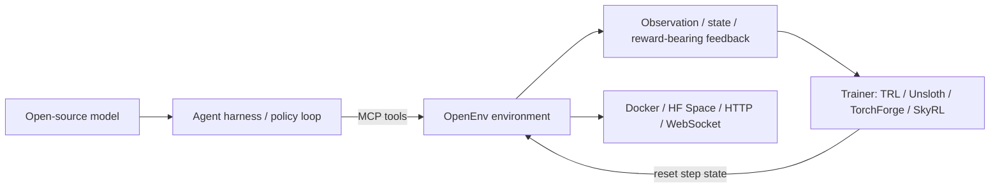

# OpenEnv 正在把 Agentic RL 的“环境层”做成公共协议

## 元信息与 TL;DR

- **标题**：The Open Source Community is backing OpenEnv for Agentic RL
- **来源**：Hugging Face Blog
- **发布日期**：2026-06-08
- **项目仓库**：https://github.com/huggingface/OpenEnv
- **本轮定位**：大模型后训练 / Agentic RL / Agent 执行环境标准

### TL;DR

- **这篇公告做什么**：Hugging Face 宣布 OpenEnv 转入更开放的社区协调模式，并迁移到 `huggingface/OpenEnv`。截至本轮读取，GitHub 元数据显示仓库在 **2026-06-08T17:54:50Z** 有 push，约 **1981 stars**，许可证为 **BSD-3-Clause**。
- **它试图解决什么问题**：闭源前沿实验室可以把模型和自家 Agent harness 共同训练；开源社区却同时使用不同 harness、模型、推理引擎、环境库和训练框架，导致 agentic RL 很难复用同一批环境。
- **核心方法**：OpenEnv 不把自己定义成 reward framework，而是把自己收窄为 **RL environment interoperability layer**：环境用类似 Gymnasium 的 `reset()`、`step()`、`state()` 暴露训练控制面，用 HTTP/WebSocket/Docker/HF Spaces 提供部署和分发，并把 MCP 作为 agent 工具接口的一等公民。
- **证据与实现**：仓库文档和源码显示，OpenEnv 已有 `EnvClient`、`HTTPEnvServer`、container providers、typed Action/Observation/State、可选 Web UI、MCP/harness helpers、`openenv collect` 数据采集路径，以及 Snake、OpenSpiel、BrowserGym、WebSearch、FinQA、Coding 等环境目录。
- **关键进展**：公告列出的技术委员会目前包括 Meta-PyTorch、Reflection、Unsloth、Modal、Prime Intellect、Nvidia、Mercor、Fleet AI 和 Hugging Face；支持/采用方还包括 PyTorch Foundation、vLLM、SkyRL、Lightning AI、Axolotl、Stanford Scaling Intelligence Lab、OpenMined、Scale AI、Snorkel AI 等。
- **为什么重要**：它把“训练 Agent”从只讨论 RL 算法，推进到“训练数据来自什么环境、环境如何部署、工具接口如何保持训练/评测/生产一致、reward 是否可外置、环境质量如何自动验证”的基础设施问题。
- **局限**：OpenEnv README 明确标注项目仍处于 experimental stage，API 可能变化；本轮看到的 RFC 006/007 仍是 open PR，RFC008 还是 2026-06-08 创建的 issue；博客中的未来路线尚不是全部已实现能力。
- **研究者视角结论**：OpenEnv 的真正价值不是又做一个 benchmark，而是把 agentic RL 中最容易被忽略的 `Environment` 抽象抬高为公共接口。它能否成为事实标准，取决于三件事：环境质量验证、reward/任务集边界、以及 MCP/harness 在生产与训练之间是否真的少漂移。

## 这篇公告真正关心的问题是什么？

### 不是“又发布一个 Agent 框架”

这篇公告的第一层信息是治理变化：

- OpenEnv 从原先更偏 Meta/Hugging Face 合作项目，转到更广泛的社区协调。
- 仓库位置变成 `huggingface/OpenEnv`。
- 多个训练框架、推理系统、基础设施公司和标注/评测组织被拉进同一张图里。

但更重要的是第二层信息：

- OpenEnv 要争夺的不是 Agent UI、不是 ReAct loop、也不是某个 reward model。
- 它争夺的是 **agentic RL 的环境接口层**。
- 换句话说，它问的是：如果开源模型也要像闭源模型一样被训练成会使用 harness、工具、浏览器、终端、代码仓库、日历和业务 API，那么这些“可交互世界”应该如何被封装、发布、复用和评测？

### 为什么现在变得急迫？

公告里提到 Claude Code、Codex、OpenClaw、Hermes 等 harness 持续变强，一个核心原因是模型被训练去使用对应 harness。

这句话背后的研究判断是：

- Agent 能力不是纯粹来自 base model。
- 工具描述、错误反馈、文件系统状态、权限边界、交互节奏、上下文保留方式都会进入模型的行为分布。
- 如果训练时的环境和生产时的 harness 差异太大，模型学到的 tool-use policy 很容易在真实系统中失效。

因此，OpenEnv 的问题意识可以写成一个公式：

```text
Agentic capability ~= Model prior + Harness affordance + Environment feedback + Reward signal
```

变量解释：

- `Model prior`：预训练与指令微调带来的语言、代码、推理和工具使用先验。
- `Harness affordance`：Claude Code/Codex/OpenClaw/Hermes 这类外壳提供的上下文、工具、文件系统和执行循环。
- `Environment feedback`：环境返回的 observation、tool result、state、错误、权限和延迟。
- `Reward signal`：训练或评测阶段对轨迹质量的打分。

OpenEnv 选择切入的是第三项，并试图让第三项与第四项、第二项之间有稳定边界。

## 作者的论证路线

### Claim -> Mechanism -> Evidence -> Boundary

| 层级 | 这篇公告的主张 | 对应机制 | 证据 | 边界 |
|---|---|---|---|---|
| Claim | 开源 Agentic RL 需要公共环境层 | 把 harness、environment、trainer 解耦 | 博客列出多方技术委员会和采用方 | 治理联盟不等于接口已经稳定 |
| Mechanism | OpenEnv 是协议层，不是 reward 框架 | `reset()` / `step()` / `state()`、HTTP/WebSocket、Docker、MCP | README、tutorial、core docs、RFC | reward、rubric、trainer 仍在演进 |
| Evidence | 环境可被部署、安装、拉取、远程调用 | HF Space 同时是 server、repo、container registry | deployment tutorial 给出 `/ws`、`/health`、`/reset`、`/step`、`/state`、`/web` | 大规模并发、成本和安全隔离需要进一步验证 |
| Boundary | 它要做共同 socket，而不是替代 TRL/Unsloth/SkyRL/verifiers | 外部 reward、taskset、auto-validation 进入 RFC 路线 | PR #727、#731、issue #778 | 多数新 RFC 仍未合并或未完全实现 |

### 作者为什么强调“protocol layer”？

公告明确说，OpenEnv 近期变成了 **interoperability layer for RL environments**，并且不会规定 reward 怎么定义，也不会规定 training loop 怎么写。

这个收窄很关键：

- 如果 OpenEnv 同时做环境、奖励、训练器、评测和部署，它会和 TRL、verl、TorchForge、Unsloth、SkyRL、verifiers 等项目冲突。
- 如果它只规定环境如何发布、部署、被 agent 消费，就有机会成为下层公共接口。
- 这相当于把竞争焦点从“谁有更好的 RL 算法”移到“所有算法能否读同一种环境插头”。

可以用一张简化图表示：



## OpenEnv 的机制：环境不是 benchmark 文件夹，而是可运行服务

### 三个 API：`reset()`、`step()`、`state()`

OpenEnv README 和 core docs 都反复强调类似 Gymnasium 的 API：

- `reset()`：初始化一个 episode，返回初始 observation。
- `step(action)`：执行一次 action，返回 observation、reward、done 等结果。
- `state()`：读取当前 episode 的状态，例如 episode_id、step_count 或环境自定义状态。

这些名字看起来朴素，但意义在于：

- 训练器不必知道浏览器、日历、代码沙箱、OpenSpiel 游戏、FinQA 工具各自怎么初始化。
- 环境作者不必为每个 RL 框架写一套 adapter。
- 评测和生产可以共享一套 server/client 包装，只是在控制面和权限面上有差异。

### 两套接口：Agent 走 MCP，编排走 HTTP

RFC 001 的一个关键设计是“两接口”：

| 接口 | 面向谁 | 典型动作 | 为什么分开 |
|---|---|---|---|
| MCP | Agent 与环境工具交互 | `search()`、`execute_sql()`、日历 API、代码执行等 | 训练和生产都应该使用同一种工具接口，减少行为分布漂移 |
| HTTP/WebSocket | 训练/评测/运维编排 | `reset()`、`step()`、`state()`、`health`、日志、指标 | Agent 不应学会直接 reset 现实世界；控制面必须留给编排系统 |

这也是 OpenEnv 相比普通 MCP server 更“RL”的地方：

- MCP 只解决工具调用接口，不自然包含 episode、reset、reward、taskset、state snapshot。
- OpenEnv 把 MCP 放在 agent-facing 层，同时保留环境控制面。
- 对后训练来说，这个差异决定了能否把多步交互轨迹变成可采样、可重放、可打分的数据。

### HF Spaces 的三重角色

deployment tutorial 把 Hugging Face Spaces 描述为 OpenEnv 环境的基础设施：

| 组件 | 提供什么 | 使用方式 |
|---|---|---|
| Server | 运行中的环境 endpoint | `https://<user>-<space>.hf.space` |
| Repository | 可安装的 Python package | `pip install git+https://huggingface.co/spaces/...` |
| Registry | Docker image | `docker pull registry.hf.space/...:latest` |

这个设计解决的不是“能不能跑 demo”，而是环境分发的三件事：

- **可调用**：训练器能通过 WebSocket/HTTP 连到环境。
- **可复现**：环境代码、依赖和 client class 能安装。
- **可部署**：环境容器能被拉取到本地、集群或更高吞吐部署里。

### 代码结构透露的实现边界

本轮读取的 `huggingface/OpenEnv` 仓库包含以下关键目录：

| 目录 | 含义 | 对 OpenEnv 定位的证据 |
|---|---|---|
| `src/openenv/core/env_server` | server、serialization、MCP environment、HTTP server、web interface | 环境被实现为服务，而不是静态数据 |
| `src/openenv/core/env_client.py` | async-first client 与 sync wrapper | 训练/评测代码通过 typed client 调用环境 |
| `src/openenv/core/containers` | runtime providers、Docker image 基础设施 | 环境隔离与部署是核心能力 |
| `src/openenv/core/harness` | session factory、MCP adapter、collector | 面向外部 agent harness 的 rollout 层 |
| `envs/*` | coding、snake、openspiel、websearch、finqa、browsergym、chat 等环境 | 项目用真实环境族群验证接口 |
| `tutorial/*` | environments、deployment、training | 从环境构建、部署到 GRPO 训练的端到端教程 |
| `rfcs/*` | abstraction、MCP、rubric、harness 等设计提案 | 项目仍在通过 RFC 稳定边界 |

## 关键图：它想连接的不是一个库，而是一条生态链


这张图在公告中承担的作用不是装饰，而是说明 OpenEnv 的站位：

- 上游有环境库、任务集、工具接口、benchmark 和社区环境。
- 中间需要一个能把环境发布、部署、调用标准化的层。
- 下游接入后训练框架、推理框架、agent harness 和模型训练工作流。

我的解读：

- 如果 OpenEnv 成功，开源社区可以把“训练一个会用工具的模型”拆成可组合模块。
- 如果 OpenEnv 失败，大家仍会回到每个训练框架、每个 harness、每个 benchmark 都写一套 glue code 的状态。
- 因此，这张图的本质是 **标准化收益的赌注**。

## 从 2025 年介绍到 2026 年公告：OpenEnv 的定位变窄了

### 2025 年 10 月：强调 Environment Hub

Hugging Face 2025 年 10 月的介绍文章把 OpenEnv 讲成共享环境 Hub：

- Agentic environments 定义 agent 完成任务所需的 tools、APIs、credentials、execution context。
- 环境要用于 training 和 deployment。
- 开发者可以浏览、交互、让模型尝试解决任务，并检查环境暴露哪些工具和 observation。

这阶段的叙事更像“我们要建立环境市场和规范”。

### 2026 年 2 月：Calendar Gym 展示真实约束

Turing 的 Calendar Gym 实践把问题具体化：

- 日历任务需要处理权限、时间、多个用户、有限可见性、多步依赖。
- 代理即使用对工具，也常因参数格式、调用顺序、权限假设失败。
- 文中报告了一个重要数字：明确 calendar identifier 的任务成功率接近 **90%**，自然语言描述同类任务时成功率降到约 **40%**。
- 失败中超过半数来自 malformed arguments 或 incorrect ordering，而不是单纯选错工具。

这说明 OpenEnv 关心的环境不是 toy simulation，而是会暴露真实 agent 失败模式的系统。

### 2026 年 6 月：强调协议层与治理

本轮公告进一步收窄：

- OpenEnv 是协议/部署/消费层。
- Reward 定义和 trainer-specific logic 留给专业库。
- 环境质量、taskset、external rewards、harness integration、auto-validation 进入下一阶段。

这种定位变化是成熟信号：

- 早期项目常想包办所有层。
- 标准化项目必须知道自己不做什么。
- OpenEnv 现在最明确的“不做”就是：不替代 reward framework、不替代 trainer。

## 训练链路应该如何理解？

### 基本 RL 交互

用最小形式写，OpenEnv 服务的是这条循环：

```python
state = env.reset(task)
done = False

while not done:
    action = policy.sample(observation=state.observation)
    result = env.step(action)
    replay_buffer.append(
        observation=state.observation,
        action=action,
        reward=result.reward,
        next_observation=result.observation,
        done=result.done,
    )
    state = result
```

但 agentic RL 的难点不在这段伪代码，而在 `env.step(action)` 内部可能包含：

- 浏览器页面状态。
- 文件系统与 shell。
- API 权限。
- MCP 工具列表。
- 多用户关系。
- 长程任务目标。
- 结构化错误。
- sandbox 和容器资源限制。

### 公式化看 OpenEnv 的价值

可以把一次轨迹写成：

```text
tau = [(o_0, a_0, r_0), (o_1, a_1, r_1), ..., (o_T, a_T, r_T)]
```

其中：

- `o_t` 是环境在第 `t` 步返回的 observation。
- `a_t` 是 agent/harness 发出的 action 或 tool call。
- `r_t` 是环境或外部 rubric 给出的 reward。
- `T` 是 episode 终止步。

OpenEnv 的目标不是优化某个 `r_t`，而是让 `o_t`、`a_t`、`r_t` 的产生边界更标准：

```text
EnvironmentSpec = { Interface, State, Tools, Sandbox, Packaging, Deployment, Metadata }
```

变量解释：

- `Interface`：`reset/step/state` 与 MCP tool surface。
- `State`：episode 内部状态、外部系统状态、可验证 artifacts。
- `Tools`：agent 可以调用的工具及 schema。
- `Sandbox`：容器隔离、依赖、文件系统、权限。
- `Packaging`：Python package、Docker image、HF Space repo。
- `Deployment`：本地、远端、Hub、集群。
- `Metadata`：taskset、资源声明、可验证性、质量信号。

## Harness integration：为什么它是 Agent 方向的关键难点？

### 普通环境：Agent 在外部

传统 OpenEnv 模式里：

- 训练器或 policy 在外部。
- 它产生 action。
- 环境返回 observation。

这适合简单工具调用、游戏、问答、代码执行等场景。

### Harness 环境：Agent 住进环境

RFC 005 讨论了 Claude Code、OpenClaw、Gemini CLI、Goose 这类 harness：

- harness 自己有 ReAct loop。
- harness 管 conversation history。
- harness 内置 shell、filesystem、browser 等工具。
- OpenEnv 环境也有工具、filesystem、sandbox。

这会产生 ownership 冲突：

- 谁拥有状态？
- 谁负责工具注入？
- 谁定义 episode 边界？
- 生产模式下客户端到底连 OpenEnv 还是连 harness？

RFC 005 的方案是 wrapping pattern：

- OpenEnv container 提供 filesystem 和 sandbox。
- harness 跑在容器内部。
- 额外环境 MCP tools 在 session 前注入 harness。
- simulation mode 下，训练循环仍通过 `step()` 控制 episode。
- production mode 下，OpenEnv 更像 session/proxy/orchestration layer，让客户端直接面向 harness。

### 这对 Codex/Claude Code 类 Agent 为什么重要？

如果训练一个 coding agent，只给它静态 patch 数据是不够的。

它还需要学会：

- 何时读文件。
- 何时运行测试。
- 何时修改代码。
- 如何处理失败命令。
- 如何维持任务上下文。
- 如何在工具预算内停止探索。

这些都由 harness 行为和环境反馈共同塑造。OpenEnv 如果能把 harness 作为可包装环境，就能把“真实 coding agent 使用轨迹”纳入后训练和评测。

## Tasksets、external rewards、auto-validation：下一步不是小功能

### RFC 007：tasksets via datasets

PR #727 的标题是 `[RFC 007] add Environment dataset (taskset) RFC`，正文说明它要处理：

- dataset-root `environment.yaml`。
- `AutoEnv` 对 `hf://datasets` 引用的处理。
- dataset-bound environment behavior。

这说明 OpenEnv 未来不只关心“环境怎么跑”，还关心“任务集合如何绑定到环境”。

对训练来说，这很关键：

- 同一个浏览器环境可以跑不同任务集。
- 同一个代码环境可以跑 SWE、terminal、repo repair、unit test generation。
- 如果 taskset 没有标准元数据，训练结果很难复现。

### RFC 006：external environment import

PR #731 讲的是 deterministic external environment imports：

- `openenv import` CLI。
- importer registry。
- AST-based ORS/OpenReward and Verifiers detection。
- generated wrappers。
- task/split discovery。
- MCP-style tool calls。

这说明 OpenEnv 也想把外部环境生态导入进来，而不是要求所有人重写环境。

这里的研究意义是：

- 标准若要成功，必须有迁移路径。
- 只支持从零创建 OpenEnv 环境会太慢。
- 能把已有 verifiers、reward/open reward 项目包装成 OpenEnv 环境，才可能扩大环境供给。

### RFC008：环境自动验证

issue #778 在 2026-06-08 创建，标题是 `RFC: 008 Environment auto validation`。它把环境质量拆成几个维度：

- 环境是否能在基础设施上扩展。
- 模型能否在短训练中 hill-climb。
- 环境是否安全。
- 环境是否容易 reward hacking。

它列出的 acceptance tests 包含：

- reproducible build。
- layer-change isolation。
- multi-stage hygiene。
- archive-free layout。
- conversion clean。
- time-to-first-useful-work。
- signature + SBOM。
- OCI labels。
- resource declarations。
- periodic learnability。

这非常重要，因为环境标准化后，下一个问题就是劣质环境泛滥：

- 环境跑不起来。
- reward 被 hack。
- docker 镜像巨大且不可复现。
- 任务没有资源预算。
- 训练 500 step 没有任何学习信号。

OpenEnv 如果没有 auto-validation，Hub 会变成“很多环境但不知道哪个可训练”的目录；有了 auto-validation，才可能形成环境质量市场。

## 和后训练框架的关系：OpenEnv 不优化梯度，但决定样本长什么样

### TRL Wordle 教程提供了一个端到端例子

OpenEnv tutorial 里的 Wordle + GRPO 示例使用：

- `Qwen/Qwen3-1.7B` 作为轻量模型。
- TRL 的 GRPOTrainer。
- TextArena 环境。
- `generate_rollout_completions()` 生成 rollout。
- reward 拆成 correct、green、yellow、repetition 等维度。

这不是为了证明 Wordle 本身重要，而是说明：

- 训练框架负责 policy optimization。
- OpenEnv 提供可交互环境和反馈。
- reward 可以由环境或外部库生成。
- rollout 函数把模型采样、环境 step、token/logprob/reward 数据连接起来。

### 开源 Agentic RL 的瓶颈不只是算法

很多后训练讨论会集中在 PPO、GRPO、DPO、GSPO、OPD、offline RL 等算法。

OpenEnv 提醒我们：

- 没有环境，算法只能在静态偏好数据或 toy task 上训练。
- 没有可复现环境，benchmark 分数不可比较。
- 没有稳定工具接口，模型学到的是某个 harness 的偶然 affordance。
- 没有自动验证，环境本身可能比模型更不可靠。

因此，OpenEnv 的位置可以概括为：

```text
RL algorithm decides how to update the model.
OpenEnv decides what the model is allowed to experience.
```

翻译成中文就是：

- RL 算法决定参数怎么动。
- OpenEnv 决定模型能经历什么世界。

## 安全视角：环境层是 agent 安全的控制面

### 最小权限与明确语义

2025 年介绍文章里说，agentic environments 定义任务需要的 tools、APIs、credentials、execution context，“and nothing else”。

这句话可以解读成一条安全原则：

- 不把全部工具暴露给模型。
- 不让模型在不必要的 credential 范围内行动。
- 不让训练环境和生产环境的权限语义脱节。

如果一个环境只暴露任务需要的工具，Agent 的攻击面会显著小于“给模型一个完整浏览器、shell、所有 API token”的做法。

### 训练/生产时间差异

RFC 001 讨论了 simulation time 和 real time 的差异：

- 训练/评测中，时间可以由 `.step()` 推进。
- agent 可以“思考”任意久，环境冻结。
- 可以 reset。
- 生产中，时间连续流动，事件自己到来，不能 reset 现实。

这对安全很关键：

- 如果 agent 在训练中学会“reset”是普通动作，迁移到生产会出事。
- 如果 agent 训练时永远面对冻结状态，生产中面对实时事件就会脆弱。
- 如果训练和生产共用 MCP 工具接口，但控制面分离，至少可以避免模型学到不该学的 simulation control。

### Reward hacking 不是后训练独有问题，也是环境问题

RFC008 明确把“环境是否 prone to reward hacking”作为自动验证目标之一。

这意味着 OpenEnv 认识到：

- reward hacking 不只发生在 reward model。
- 环境如果把错误状态、partial success、权限失败编码得不清楚，模型也会学会钻空子。
- 环境如果没有 structured error，模型会把失败当成功，或者盲目重试。

这和 Calendar Gym 的错误案例互相印证：

- schema validation errors。
- permission / authorization errors。
- datetime / format errors。

如果这些错误没有被环境规范化，训练轨迹就会污染模型的工具使用策略。

## 证据边界与局限

### 已经能确认的事实

- HF Blog 在结构化元数据中给出 `datePublished=2026-06-08T00:00:00.705Z`。
- `huggingface/OpenEnv` 仓库在本轮读取时显示 `pushedAt=2026-06-08T17:54:50Z`。
- README 明确写 OpenEnv 是 `agentic execution environments`，使用 Gymnasium-style API，并处于 experimental stage。
- core docs 写明开放治理委员会包含 Meta-PyTorch、Reflection、Unsloth、Modal、Prime Intellect、Nvidia、Mercor、Fleet AI、Hugging Face。
- deployment tutorial 给出了 HF Spaces 的 server/repository/registry 三角色，以及 `/ws`、`/health`、`/reset`、`/step`、`/state`、`/docs`、`/web` endpoints。
- RFC008 issue 在 2026-06-08 创建，内容聚焦环境自动验证。

### 还不能从公告推出的结论

- 不能说 OpenEnv 已经成为事实标准。公告只证明多方支持和项目方向，不证明生态采用已经完成。
- 不能说 OpenEnv 已经解决 reward hacking。RFC008 说明它把问题列入验证目标，但不是已完成评测。
- 不能说任何 OpenEnv 环境都适合训练。环境质量需要 auto-validation、resource declaration、learnability signal。
- 不能说训练/生产完全无漂移。OpenEnv 试图最小化 interface delta，但真实 harness、权限、延迟、并发和事件流仍可能不同。

### 项目当前最明显的工程风险

| 风险 | 说明 | 可能影响 |
|---|---|---|
| API 不稳定 | README 明确提示 experimental stage，API 可能变化 | 环境作者和 trainer adapter 需要跟随迁移 |
| RFC 未合并 | RFC 006/007 仍是 open PR，RFC008 是 issue | 公告路线和实际 release 之间有时间差 |
| 环境质量参差 | Hub 扩张后会有大量环境 | 训练数据质量和 benchmark 可比性下降 |
| 安全隔离成本 | Docker/HF Space/远端服务都带来资源与权限问题 | 企业和高吞吐训练部署复杂 |
| Reward 边界 | OpenEnv 不做 reward framework，但环境又常返回 reward | reward 所属权和调试边界需要继续明确 |

## 领域延伸：OpenEnv 对 Agent、后训练和 AI 安全各意味着什么？

### 对 Agent 研究

OpenEnv 把 Agent 研究从“单次 prompt 能否调用工具”推到“长程环境是否稳定”：

- 工具 schema 要可发现。
- 状态要可持久。
- 错误要可恢复。
- episode 要可重放。
- 环境要能在训练和生产中保持相近语义。

后续值得问：

- 一个 coding harness 的最小 OpenEnv 环境应该包含哪些工具？
- 文件系统、shell、browser、git、test runner 哪些属于 environment，哪些属于 harness？
- 如果 harness 内部会多次调用 LLM，训练器如何拿到 token-level logprob 和 reward attribution？

### 对后训练研究

OpenEnv 使后训练问题更接近“经验生成系统”：

- 不是只有静态 SFT data。
- 不是只有人工偏好 pair。
- 而是能从环境中采样多步 trajectory。

后续值得问：

- taskset 数据集如何和环境版本绑定？
- reward 是环境内置、外部 rubric，还是 trainer 侧组合？
- 如何在不同环境之间做 curriculum？
- 如何衡量一个环境对模型学习的 marginal contribution？

### 对 AI 安全

OpenEnv 把安全边界放到可审计的环境层：

- 任务需要什么工具，环境就暴露什么工具。
- Agent-facing MCP 与 orchestration HTTP 分离。
- 环境自动验证关注 reproducible build、SBOM、resource declarations、learnability 和 reward hacking。

后续值得问：

- 环境是否应该有 capability manifest？
- MCP tool schema 是否应该带权限、成本、风险等级？
- 生产模式中 OpenEnv 作为 proxy/session manager 时，应该记录哪些审计事件？
- 训练出来的 agent 是否会利用环境模拟中的 reset/step 假设？

### 对开源生态治理

OpenEnv 这次公告还有一个容易被忽略的治理含义：环境标准不是单个实验室能单方面宣布成功的东西。

它需要同时说服几类人：

- 环境作者相信自己写一次环境就能被多个 trainer、harness 和评测系统复用。
- 模型训练团队相信环境版本、任务集、reward 和容器镜像能被追踪，不会在复现实验时漂移。
- 基础设施团队相信环境可以被调度、隔离、限流、观测和计费。
- 安全团队相信工具权限、credential、审计日志和供应链元数据不会被藏在 README 或脚本约定里。

因此，OpenEnv 后续最值得看的不是 star 数，而是三个更硬的指标：

| 指标 | 为什么重要 | 观察方式 |
|---|---|---|
| 跨框架 adapter 数量 | 证明它不只是 HF 自家生态接口 | TRL、Unsloth、TorchForge、SkyRL、verifiers 是否都能无痛消费同一环境 |
| 高质量环境密度 | 证明 Hub 不是目录堆积 | auto-validation 后有多少环境具备可学习信号、资源声明和安全证明 |
| 训练到生产的接口一致性 | 证明 agent 学到的工具策略能迁移 | 同一 MCP 工具面在 simulation、eval、production 中是否保持语义一致 |

如果这些指标成立，OpenEnv 会成为开源 Agent 后训练的公共地基；如果不成立，它可能只会留下若干有用环境和一套不错的文档，但很难改变各框架各自封装环境的局面。

## 结论

OpenEnv 本轮公告最值得关注的不是“多了一个开源项目”，而是开源 Agentic RL 正在把环境层变成基础设施标准。

它的短期价值：

- 给环境作者一个发布和部署规范。
- 给训练框架一个统一环境插头。
- 给 agent harness 一个进入训练/评测闭环的包装路径。
- 给环境质量验证一个明确议程。

它的长期价值取决于：

- 能否让 TRL、Unsloth、TorchForge、SkyRL、verifiers、MCP server、HF Spaces 和真实 harness 都少写 glue code。
- 能否把环境质量从“README 说能跑”推进到“可构建、可验证、可学习、可审计”。
- 能否在训练/评测/生产之间保持足够小的接口漂移。

我的判断是：

- OpenEnv 目前还不是成熟标准，但已经选对了抽象层。
- 它不应该被当成又一个 benchmark，而应该被当成 Agentic RL 的“环境插座”。
- 如果 2026 年下半年开源模型要真正追赶闭源 Agent harness 的工具使用能力，环境层标准化会和 RL 算法本身一样重要。

## 参考与证据

- Hugging Face Blog: The Open Source Community is backing OpenEnv for Agentic RL
- GitHub: `huggingface/OpenEnv`
- Hugging Face Blog: Building the Open Agent Ecosystem Together: Introducing OpenEnv
- Hugging Face Blog: OpenEnv in Practice: Evaluating Tool-Using Agents in Real-World Environments
- OpenEnv README、core docs、deployment tutorial、training tutorial
- OpenEnv RFC 001、RFC 005、PR #727、PR #731、issue #778
