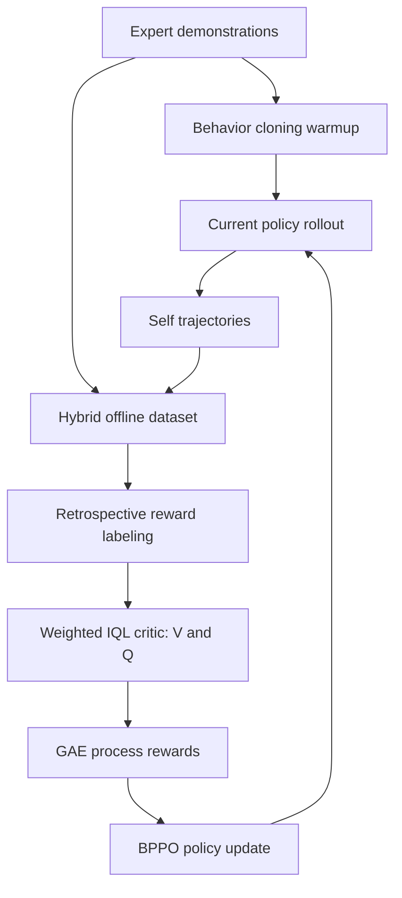

# Q-Evolve：把 Agent 自进化约束在同一分布里的后训练闭环

### 元信息

| 字段 | 内容 |
| --- | --- |
| 论文 | Self-evolving LLM agents with in-distribution Optimization |
| 方法名 | Q-Evolve |
| 类型 | 论文 / Agent 后训练 |
| 方向 | 大模型 Agent、大模型后训练 |
| 原始链接 | [https://arxiv.org/abs/2606.07367](https://arxiv.org/abs/2606.07367) |
| PDF | [https://arxiv.org/pdf/2606.07367](https://arxiv.org/pdf/2606.07367) |
| 本周证据 | arXiv API 显示 `published=2026-06-05T15:09:52Z`、`updated=2026-06-05T15:09:52Z` |
| 作者 | Yudi Zhang, Meng Fang, Zhenfang Chen, Mykola Pechenizkiy |
| 会议标记 | arXiv comment 标记为 ICML 2026 |

### TL;DR

- **这篇论文解决什么**：LLM Agent 在 AlfWorld、WebShop、ScienceWorld 这类长程交互任务里，常常只有终局奖励；失败可能来自早期一步格式错、无效动作、重复观察或后续连锁错误，但训练信号直到 episode 结束才出现，导致 credit assignment 很弱。
- **核心方法是什么**：Q-Evolve 把专家轨迹和当前 Agent 自采样轨迹合成一个 hybrid offline dataset，在这个数据支持上训练 weighted IQL critic，再用 GAE 从 value function 推出 step-wise process reward，最后用 behavior-proximal policy optimization 更新策略。
- **关键不是“再训练一次”**：论文的中心主张是 _process reward 的生成分布_ 和 _policy improvement 的使用分布_ 必须一致；不要把 critic 当作测试时的外部分数器去重排 OOD 候选，而是在同一批数据支持内把优势信号转成策略更新。
- **实验数字**：主表中 Q-Evolve 在 WebShop、ScienceWorld seen/unseen、ALFWorld seen/unseen 上分别得到 70.5、76.3、69.7、90.7、89.6，平均 79.4；QLASS 平均 74.5，ETO 平均 69.4。
- **样本效率证据**：在 Qwen2.5-7B-Instruct + ALFWorld 比较里，在线 RL baselines 使用 320K environment steps；Q-Evolve 1-iter 使用 13K steps，并达到 88.6 seen、87.3 unseen。
- **消融结论**：去掉 GAE 后 ALFWorld seen/unseen 从 87.9/86.6 掉到 74.3/74.6；去掉 policy improvement 只做 critic test-time scaling 会掉到 58.6/59.0，说明“同分布训练更新”比“外部 critic 重排”更关键。
- **局限**：retrospective reward 依赖结构化环境反馈；greedy rollout 会降低轨迹多样性；每一轮内的 in-distribution 约束稳定，但跨迭代仍可能积累分布漂移，论文没有显式校正这个跨轮漂移。
- **研究意义**：它把 Agent 自进化从“多跑几轮采样和筛选”推进到“critic、process reward、policy update、dataset refresh 共同演化”的训练系统问题，也提醒后训练框架必须同时关心奖励可信度和数据支持边界。

### 研究问题：为什么 Agent 的 process reward 比数学题更难？

- **数学推理里的 PRM**：
  - 状态通常是中间推导文本；
  - 错误可以通过人工标注、搜索树或验证器定位；
  - reward model 的输入分布相对容易控制。
- **交互式 Agent 的 PRM**：
  - 状态是任务描述、历史观察、历史动作和环境反馈的组合；
  - 动作是多 token 自然语言，既包含思考也包含可执行命令；
  - 环境会把一步错误放大成后续状态漂移；
  - 最终 reward 往往只有成功/失败或稀疏分数。
- **论文真正要回答的问题**：
  - 能不能不用人工 step label、不靠环境 backtracking，也给每一步动作生成可用于训练的过程监督？
  - 能不能让这个监督不变成 OOD critic，即只在它可靠的数据支持上发挥作用？
  - 能不能让 Agent 多轮自采样和自更新，而不是只做一次离线拟合？

### 论文主张与论证路线

| Claim | Mechanism | Evidence | Boundary |
| --- | --- | --- | --- |
| 长程 Agent 需要 step-wise credit assignment | 用 Bellman backup 和 GAE 从终局 reward 推回每一步 | 三环境主结果平均 79.4，高于 QLASS 74.5 | 仍依赖环境能给出终局 reward |
| process reward 不能脱离生成它的数据分布 | critic、reward assignment、policy update 都放在同一 hybrid offline buffer | w/o PI test-time scaling 仅 58.6/59.0 | 每轮内部稳定，不等于跨轮无漂移 |
| sparse reward 下普通 IQL 不够稳 | weighted IQL 上调成功轨迹和近终局 transition | w/o W-IQL unseen 76.1，完整方法 86.6 | 权重规则是启发式，未证明最优 |
| heuristic auxiliary reward 可以帮助 critic，但不该直接支配 policy advantage | critic 训练用 `r_env + r_aux`，GAE policy target 只用 `r_env` | GAE with `r_env` 87.9/86.6，加入 `r_aux` 后 81.4/82.8 | 依赖辅助 reward 规模较小 |
| policy improvement 必须能压低坏动作概率 | BPPO 用 signed advantage，上调正优势、压低负优势 | AWR 替代 BPPO 只有 64.3/67.9 | 对 clip 参数敏感，附录需调参 |

### Figure 1：这篇论文反对的三类捷径


- **左侧问题：传统 PRM 很容易贵且偏**。
  - 人工 step label 成本高；
  - search-based rollout 可能需要离散状态、环境回退或大量交互；
  - 当 policy 改进后产生新动作，PRM 的打分分布可能已经不可靠。
- **中间问题：普通 online RL 不自动解决稀疏 reward**。
  - PPO/GRPO 这类方法可以更新策略；
  - 但如果 episode 成功很少，critic 与 policy 会一起在低信号区域里 bootstrap；
  - 结果是步级 credit 仍然弱。
- **右侧主张：Q-Evolve 要把效率和分布约束放在一起看**。
  - 它不是完全不交互，而是少量自采样；
  - 它不是完全静态离线，而是每轮刷新 self trajectories；
  - 它的训练信号来自当前 hybrid buffer 内部，而不是测试时对任意候选动作打分。

### Figure 2：Q-Evolve 的闭环结构




- **数据层**：专家数据提供成功路径和关键子程序；self trajectories 暴露当前 policy 的真实错误分布。
- **critic 层**：weighted IQL 在固定数据上学习 `V` 和 `Q`，避免显式最大化 OOD actions。
- **reward 层**：GAE 把 value 估计转成 step-wise advantage，作为过程监督。
- **policy 层**：BPPO 在数据支持内做策略更新，尤其要压低负优势动作，而不是只模仿所有出现过的动作。
- **迭代层**：更新后的 policy 再去环境采样，刷新 hybrid dataset；论文在 SciWorld 和 ALFWorld 跑两轮，在 WebShop 跑三轮。

### 方法机制一：Hybrid data 不是数据拼盘，而是稳定 Bellman backup 的前提

- **专家轨迹的作用**：
  - 覆盖可成功的状态-动作区域；
  - 给 sparse reward 任务提供非零回报锚点；
  - 防止 critic 在几乎全失败数据里学到“所有步骤都差不多”。
- **自采样轨迹的作用**：
  - 反映当前 Agent 真正会犯的错；
  - 收集专家数据里没有的无效动作、格式错误、重复观察；
  - 让 process reward 贴近 policy update 将要面对的分布。
- **组合后的含义**：
  - 数据集不是越大越好，而是要同时有成功支撑和失败覆盖；
  - process reward 的可靠性来自“它只服务于这个 buffer 内的 actions”；
  - 如果把 critic 拿到测试时给新候选动作打分，就回到了分布不匹配问题。

### 方法机制二：Retrospective reward 只做“轻量纠偏”

论文先用环境反馈给每一步加辅助惩罚，形式可以写成：

```text
r_aux(t) =
  r_fmt      如果下一步 observation 表明动作格式错误
  r_inv      如果下一步 observation 表明动作不可执行
  r_repeat   如果 observation 没变化，说明动作无意义或重复
  0          其他情况
```

| 环境 | `r_fmt` | `r_inv` | `r_repeat` | 设计含义 |
| --- | ---: | ---: | ---: | --- |
| ALFWorld | -0.3 | -0.2 | -0.1 | 格式错最严重，重复动作轻一些 |
| WebShop | -0.3 | 0 | 0 | 商品导航里无效/重复观察不总是坏信号 |
| SciWorld | -0.3 | -0.2 | -0.1 | 任务更长，但仍惩罚协议和执行错误 |

- **为什么要小幅度**：
  - 如果辅助惩罚太大，policy 会学习“避免格式错”而不是“完成任务”；
  - 附录里 `RR-high-fmt (-1,-0.2,-0.1)` 在 ALFWorld 掉到 69.3/64.2；
  - 完整 Q-Evolve 单轮是 87.9/86.6。
- **为什么它不是最终 advantage**：
  - 这些 reward 来自启发式解析；
  - 它适合帮助 critic 学会“哪些步骤明显坏”；
  - 但如果直接进入 policy-side GAE，会把任务目标从环境成功偏向惩罚规避。

### 方法机制三：Weighted IQL 如何在稀疏 reward 下训练 critic？

IQL 的基本目标可以拆成两块：

```text
V loss:
  L_V = E[ L2_m( Q_bar(s,a) - V(s) ) ]

Q loss:
  L_Q = E[ ( r + gamma * V(s') - Q(s,a) )^2 ]
```

Q-Evolve 在这个基础上给每个 transition 加权：

```text
w_t = (t / T + d) * 0.5 + 0.5

变量：
- t / T：越靠近 episode 结束，TD target 越少依赖长链 bootstrap
- d：轨迹是否有非零终局 reward，成功轨迹更值得上调
- w_t：同一 trajectory 内后段更重，成功 trajectory 整体更重
```

- **直觉解释**：
  - sparse reward 下，失败轨迹数量很多；
  - 如果每个 transition 等权，critic 会被大量低信号 transition 淹没；
  - 成功轨迹和近终局步骤更能告诉模型“哪些动作真的推进了任务”。
- **消融证据**：
  - w/o W-IQL：83.6 seen / 76.1 unseen；
  - W-IQL w/o temporal term：83.6 / 79.1；
  - W-IQL w/o success term：85.0 / 83.6；
  - 完整 Q-Evolve：87.9 / 86.6。
- **读法**：
  - success term 对 seen/unseen 都有帮助；
  - temporal term 对 unseen 特别重要，因为泛化场景更依赖可靠的 reward propagation；
  - 这不是一个复杂权重函数，但它对 sparse episodic feedback 的偏置是明确的。

### 方法机制四：为什么 GAE 只用环境 reward？

论文用 critic 的 value function 做 GAE：

```text
delta_t = r_env(t+1) + gamma * V(s_{t+1}) - V(s_t)
A_t     = delta_t + lambda * gamma * A_{t+1}, A_T = 0
```

- **关键选择**：
  - critic 训练时 reward 是 `r_env + r_aux`；
  - policy advantage 计算时只使用 `r_env`；
  - `r_aux` 不进入 policy-side GAE。
- **附录里的形式化理由**：
  - 如果把 `r_aux` 也放进 GAE，`A_full - A_env` 会多出一串折扣后的辅助 reward；
  - 这会改变 policy 优化目标；
  - 只用 `r_env` 更接近原始任务成功目标。
- **实验对比**：

| Process reward 选择 | ALFWorld Seen | ALFWorld Unseen |
| --- | ---: | ---: |
| `Q - V` | 74.3 | 74.6 |
| `r_env + gamma V' - V` | 80.0 | 74.6 |
| GAE with `r_env` | **87.9** | **86.6** |
| GAE with `r_env + r_aux` | 81.4 | 82.8 |

### 方法机制五：BPPO 比 AWR 更适合“纠错”

- **AWR 的问题**：
  - 它仍然是在模仿数据里的 actions；
  - 正 advantage 的动作学得更快；
  - 负 advantage 的动作也可能被继续模仿，只是权重不同。
- **BPPO 的变化**：
  - 用 signed advantage；
  - 对正优势动作提高概率；
  - 对负优势动作显式降低概率；
  - 通过 clip 和 KL regularization 控制偏离。
- **目标函数可以读成**：

```text
L_pi = E[ min( eta_t * A_t,
               clip(eta_t, 1 - eps_low, 1 + eps_high) * A_t ) ]
       + alpha * KL(policy || reference)

其中：
- eta_t：当前 policy 相对 old policy 的概率比
- A_t：来自 GAE 的 step-wise advantage
- eps_low > eps_high：允许更强地压低坏动作，谨慎放大好动作
```

- **为什么 `eps_low > eps_high` 有意义**：
  - LLM Agent 的坏动作常常是格式错、不可执行动作或无意义重复；
  - 这些动作不是“少学一点”就够，而是需要直接压低；
  - 但正向动作不能无限放大，否则容易离开数据支持。

### 公式细读：这套方法如何把“终局成败”拆到每一步？

#### 1. IQL 里的 `V` 不是普通平均值

- 论文沿用 IQL 的 expectile 思想：`V(s)` 近似数据动作分布里的高价值部分，而不是对所有动作做显式最大化。
- 这个选择对 LLM Agent 很重要：
  - 动作空间不是离散按钮，而是多 token 语言序列；
  - 如果显式搜索 `max_a Q(s,a)`，就会很快离开离线数据支持；
  - expectile 让 critic 学“数据里较好的动作长什么样”，而不是幻想任意动作。
- 因此，`V` 的角色更像一个 _in-support best-case surrogate_：
  - 它承认数据集限制；
  - 它避免对未见语言动作做高置信估值；
  - 它给 GAE 提供可用 baseline。

#### 2. `Q` 学的是带辅助惩罚的 shaped return

- critic 训练时用 `r_env + r_aux`，这有两个效果：
  - 终局成功信号负责告诉模型“任务是否完成”；
  - 辅助惩罚负责告诉模型“这一步已经破坏交互协议或探索质量”。
- 这不是把辅助规则当作任务目标，而是让 value propagation 更容易启动：
  - 格式错误可以立即给负反馈；
  - invalid action 可以避免整个 episode 到最后才知道失败；
  - repeated observation 可以提醒模型不要在原地循环。
- 如果没有这层 shaped reward，critic 要从极少数成功 episode 中把信号倒推到早期步骤，样本效率会很差。

#### 3. GAE 又把 `r_aux` 拿掉，是为了不污染最终目标

- 这一步容易被误读：既然 `r_aux` 帮 critic，为什么不帮 policy？
- 论文的回答是：
  - critic 可以用辅助信号稳定估计；
  - policy 的 advantage 仍要对齐环境定义的成功；
  - 否则模型可能学会过度规避某类表面错误，而不是真正完成任务。
- 可以把它理解成两层目标：
  - **critic learning objective**：允许加入工程化提示，帮 value function 看清明显坏步骤；
  - **policy improvement objective**：尽量保持和 `J_env(pi)` 同方向，避免辅助规则改写最优策略。

#### 4. BPPO 的不对称 clip 是对 Agent 错误类型的结构假设

- 在普通 PPO 里，clip 往往是对称的，重点是防止策略步子太大。
- Q-Evolve 使用 `eps_low > eps_high`，实际表达了一个判断：
  - 提高好动作概率要保守，因为好动作可能只是当前数据中的局部好；
  - 降低坏动作概率可以更激进，因为格式错、无效动作、重复动作在多任务中更稳定地坏。
- 这和 Agent 训练的经验相符：
  - 一个可执行动作未必总是最优；
  - 一个不可解析动作几乎总是坏；
  - 因此负向纠错应该比正向放大更果断。

### 关键证据逐项解读

#### Table 1：方法能力对比不是装饰表

- 论文把 BC、PPO、ETO、QLASS、GiGPO、Q-Evolve 放在六个维度里比较：
  - 是否支持 self-evolve；
  - 是否不需要离散状态；
  - 是否用 Bellman backup 做 credit assignment；
  - 是否分配 process rewards；
  - 是否不需要大量 online interaction；
  - 是否从自采样经验学习。
- 这张表的论证功能是把 Q-Evolve 放到一个明确空位上：
  - PPO 有 Bellman backup 和 self-train，但没有 process reward，也需要大量 online interaction；
  - QLASS 有 Bellman 和 process reward，但需要离散/搜索结构，也依赖大量交互；
  - ETO 可以 self-train，但没有 step-wise credit assignment；
  - Q-Evolve 试图同时满足六项。
- 这并不意味着它在所有方面都“免费”：
  - 它仍要训练 critic；
  - 它仍要有专家轨迹；
  - 它仍要环境能产生可解析反馈。

#### Table 2：主结果最强信号来自 ALFWorld

- WebShop 的提升较小：
  - QLASS 70.3；
  - Q-Evolve 70.5；
  - 这说明在短 horizon、商品属性 reward 相对直接的任务上，search-style Q scoring 已经很接近。
- ScienceWorld 有中等提升：
  - seen 从 75.3 到 76.3；
  - unseen 从 66.4 到 69.7；
  - 这说明 step-wise advantage 对有子目标的稀疏任务有泛化帮助。
- ALFWorld 提升最大：
  - seen 从 77.9 到 90.7；
  - unseen 从 82.8 到 89.6；
  - 这与论文的核心问题最吻合：长动作链、二值终局 reward、错误动作会造成连续状态偏移。

#### Table 3：w/o PI 是最有说服力的反例

- 如果去掉 policy improvement，只用 critic 做 test-time scaling，结果是 58.6/59.0。
- 这个反例非常关键，因为它直接挑战一种常见直觉：
  - “既然 critic 能判断动作好坏，那推理时用它重排候选不就行了？”
- 论文给出的经验答案是否定的：
  - 候选动作来自 policy 的即时生成；
  - 它们可能不在 critic 的可靠分布内；
  - critic 分数越被外推，越可能把模型带向错误状态。
- 因此 Q-Evolve 的关键不是“有 critic”，而是“critic 产生的 advantage 被用来训练同分布内已有 actions 的概率结构”。

#### Table 4：GAE with `r_env` 是最干净的 reward bridge

- `Q - V` 的 seen/unseen 都是 74 左右，说明单步优势太噪。
- potential-based shaping 在 seen 上到 80.0，但 unseen 仍是 74.6，说明它可能更吃训练分布。
- GAE with `r_env + r_aux` 到 81.4/82.8，比只用 `r_env` 差：
  - 这支持附录命题；
  - 辅助规则可以帮助 value estimation；
  - 但不该直接进入最终 policy objective。
- GAE with `r_env` 的 87.9/86.6 说明多步 credit assignment 与目标对齐同时成立时，收益最大。

#### Table 5：样本效率表在比较“轨迹利用率”

- 在线 RL baseline 都给了 320K environment steps；
- Q-Evolve 只给 13K steps；
- 但它并不是魔法式少样本，而是提高了每条轨迹的信息密度：
  - 每条轨迹被 retrospective reward 初步解析；
  - 每个 transition 被 weighted IQL 训练 critic；
  - 每一步又通过 GAE 得到 advantage；
  - 最后 advantage 进入 BPPO 更新 token/action 概率。
- 这张表最适合给后训练工程团队看的结论是：
  - 先别急着扩 rollout 集群；
  - 先确认你的轨迹是否被转成可靠、对齐、可追溯的训练信号。

### 和近期 Agent 后训练方向的关系

- **和 agentic RL framework 的关系**：
  - 工程框架关心 rollout、reward、verifier、trainer、weight sync；
  - Q-Evolve 关心同一条轨迹如何从终局 reward 变成 step advantage；
  - 两者结合时，最重要的合同是 trajectory schema 和 reward provenance。
- **和 coding agent 安全的关系**：
  - coding agent 的错误常常不是单步失败，而是多步后才显露；
  - Q-Evolve 的思路可以启发 sabotage / permission violation 的 step-level credit；
  - 但安全 reward 不能只靠环境返回字符串，必须包含文件 diff、权限边界、测试结果、sandbox side effects。
- **和自进化 harness 的关系**：
  - harness evolution 更新 prompt、memory、tool 或 skill；
  - Q-Evolve 更新模型参数；
  - harness 方法更轻、更快、更可审计；
  - 参数后训练更有可能把行为固化进 policy，但也更难回滚和归因。
- **和 PRM 研究的关系**：
  - 数学 PRM 主要判断推理步骤是否正确；
  - Agent PRM 还要判断动作是否可执行、是否推进状态、是否破坏后续可达性；
  - 因此 Agent PRM 更需要环境语义和轨迹级动态信息。

### 如果要复现，最该先检查哪些点？

- **轨迹格式**：
  - 是否保存 task description、history、observation、action、reward、terminal；
  - action 中 `think` 与可执行命令是否可分离；
  - tokenization 后是否还能映射回 step。
- **辅助 reward 规则**：
  - format error 是否有明确判定；
  - invalid action 是否由环境可靠返回；
  - repeated observation 是否真的代表无效探索；
  - 不同环境是否需要不同 penalty。
- **critic 输入**：
  - 是否把多轮 chat transcript 按 policy 相同模板编码；
  - `V(s)` 和 `Q(s,a)` 是否共享 backbone 但使用不同 head；
  - Double-Q 或 target network 是否稳定。
- **policy update**：
  - old policy backup 是否与 self trajectories 对齐；
  - advantage 是否按 step 或 token 正确广播；
  - KL reference 是否防止语言能力漂移。
- **审计证据**：
  - 每个 policy checkpoint 对应哪批 self trajectories；
  - 每批 trajectories 对应哪次 critic；
  - 每个 advantage 文件是否能追溯到原始 reward 和 value；
  - 否则所谓 in-distribution loop 在工程上不可验证。

### Algorithm 1：完整训练流程重写成伪代码

```text
Input:
  D_expert: expert demonstrations
  Env: interactive environment
  K: self-evolving iterations

State:
  pi_theta: LLM agent policy
  D_self: trajectories generated by current policy
  D: hybrid offline buffer
  V, Q: in-distribution critic
  A_t: step-wise process advantage

Procedure:
  1. Warm up pi_theta with behavior cloning on D_expert

  2. For k in 1..K:
       D_self <- rollout(pi_theta, Env)
       D      <- D_expert union D_self

       For every step in D:
         assign r_aux by parsing format errors,
         invalid actions, and repeated/no-op observations

       Train V and Q on D with weighted IQL

       For every trajectory in D:
         compute A_t with GAE using r_env and V

       Update pi_theta with BPPO on D

       If policy collapses, data diversity vanishes,
       or cross-iteration drift grows:
         this is outside the paper's explicit correction mechanism

Output:
  evolved pi_theta
```

### 实验设置：三个环境都在考验 delayed reward

| 环境 | Train | Test Seen | Test Unseen | Avg. Steps | 任务特点 |
| --- | ---: | ---: | ---: | ---: | --- |
| WebShop | 1938 | 200 | - | 4.9 | 商品属性匹配，点击购买后才得到结果 |
| ScienceWorld | 1483 | 194 | 241 | 14.4 | 科学实验子目标，终局给 0 到 1 的稀疏成功信号 |
| ALFWorld | 3321 | 140 | 134 | 10.1 | 文本 embodied household tasks，终局二值成功/失败 |

- **基础模型**：
  - 主实验使用 Llama-2-7B-Chat；
  - 泛化实验使用 Llama-3-8B-Instruct；
  - 样本效率比较使用 Qwen2.5-7B-Instruct。
- **自采样设置**：
  - 每个任务采样 3 条 self trajectories；
  - WebShop 最大 episode length 10；
  - ScienceWorld 最大 24；
  - ALFWorld 最大 30。
- **训练开销**：
  - 单节点 4xH100；
  - behavior cloning 每 epoch 约 5 分钟；
  - critic training 每 epoch 约 1 小时；
  - policy learning 每 epoch 约 15 分钟；
  - 主要成本在 critic。

### 主结果：Q-Evolve 赢在哪里？

| Method | WebShop | SciWorld Seen | SciWorld Unseen | ALFWorld Seen | ALFWorld Unseen | Average |
| --- | ---: | ---: | ---: | ---: | ---: | ---: |
| GPT-4 | 63.2 | 64.8 | 64.4 | 42.9 | 38.1 | 54.7 |
| Reflexion | 64.2 | 60.3 | 64.4 | 45.7 | 55.2 | 58.0 |
| SFT | 63.1 | 67.4 | 53.0 | 60.0 | 67.2 | 62.1 |
| RFT | 63.6 | 71.6 | 54.3 | 62.9 | 66.4 | 63.8 |
| PPO | 64.2 | 59.4 | 51.7 | 22.1 | 29.1 | 45.3 |
| Best-of-N | 67.9 | 70.2 | 57.6 | 62.1 | 69.4 | 65.4 |
| ETO | 67.4 | 73.8 | 65.0 | 68.6 | 72.4 | 69.4 |
| QLASS | 70.3 | 75.3 | 66.4 | 77.9 | 82.8 | 74.5 |
| **Q-Evolve** | **70.5** | **76.3** | **69.7** | **90.7** | **89.6** | **79.4** |

- **相对 QLASS**：
  - WebShop 只高 0.2；
  - ScienceWorld unseen 高 3.3；
  - ALFWorld seen 高 12.8；
  - ALFWorld unseen 高 6.8；
  - 平均高 4.9。
- **相对 ETO**：
  - 平均从 69.4 到 79.4；
  - 说明 trajectory-level preference pair 不是 Agent credit assignment 的充分答案；
  - step-wise advantage 和同分布 policy update 才是论文强调的增益来源。
- **相对 PPO**：
  - PPO 在 ALFWorld seen/unseen 只有 22.1/29.1；
  - 这说明“在线 RL”本身不是稀疏终局 reward 的解药；
  - 如果 reward 太少，policy 和 critic 会共同陷在弱信号里。

### 消融：每个模块都不是装饰

| Variant | RR | W-IQL | GAE | PI | Seen | Unseen |
| --- | --- | --- | --- | --- | ---: | ---: |
| Q-Evolve 1-iter | yes | yes | yes | yes | **87.9** | **86.6** |
| SFT | no | no | no | no | 60.0 | 67.2 |
| w/o RR | no | yes | yes | yes | 83.6 | 82.7 |
| w/o W-IQL | yes | no | yes | yes | 83.6 | 76.1 |
| w/o GAE | yes | yes | no | yes | 74.3 | 74.6 |
| w/o PI | yes | yes | yes | no | 58.6 | 59.0 |
| w/o PI + AWR | yes | yes | yes | yes/AWR | 64.3 | 67.9 |

- **最重的掉点来自 w/o PI**：
  - critic test-time scaling 不能替代 policy update；
  - 这直接支持论文的分布论证；
  - 如果只是拿 critic 给候选动作重排，候选动作可能已经超出 critic 可靠分布。
- **GAE 是 critic 到 policy 的桥**：
  - 只用 `Q - V` 或去掉 GAE，都会让 step signal 过于局部；
  - 长程任务需要多步 advantage，而不是单步差值。
- **RR 的作用较温和但稳定**：
  - w/o RR 仍有 83.6/82.7；
  - 说明核心不是规则惩罚本身；
  - RR 更像让 critic 更早识别明显坏步骤的辅助支架。

### 样本效率：13K steps 对 320K steps

| Method | Env. Steps | ALFWorld Seen | ALFWorld Unseen |
| --- | ---: | ---: | ---: |
| PPO | 320K | 59.4 | 67.7 |
| RLOO | 320K | 56.4 | 36.6 |
| GRPO | 320K | 39.7 | 32.2 |
| SFT | 0 | 74.9 | 62.3 |
| SFT + PPO | 320K | 72.6 | 77.6 |
| SFT + RLOO | 320K | 75.0 | 51.4 |
| SFT + GRPO | 320K | 66.7 | 74.1 |
| **Q-Evolve 1-iter** | **13K** | **88.6** | **87.3** |

- **这张表的含义不是“少交互一定更好”**：
  - Q-Evolve 仍然用了专家数据和自采样数据；
  - 它的优势来自把少量环境交互转成更密的 step supervision；
  - 13K steps 的价值在于每一步被 critic、GAE、BPPO 多次利用。
- **对后训练系统的启发**：
  - 当环境交互昂贵时，不能只扩 rollout；
  - 要问每条轨迹是否被充分“解释”；
  - 也要问解释出的 reward 是否仍在可靠分布内。

### 泛化：不是只绑在 Llama-2-7B-Chat 上

| Method | WebShop | SciWorld Seen | SciWorld Unseen | ALFWorld Seen | ALFWorld Unseen |
| --- | ---: | ---: | ---: | ---: | ---: |
| SFT | 63.3 | 65.3 | 57.0 | 79.3 | 80.6 |
| ETO | 68.4 | 81.3 | 74.1 | 77.1 | 76.4 |
| KnowAgent | 64.8 | 81.7 | 69.6 | 80.0 | 74.9 |
| WKM | 66.9 | 82.1 | 76.5 | 77.5 | 78.2 |
| SFT + MPO | 65.5 | 70.2 | 65.9 | 80.7 | 81.3 |
| ETO + MPO | 70.2 | 83.4 | 80.8 | 85.0 | 79.1 |
| **Q-Evolve** | **71.1** | **86.4** | **82.4** | **89.6** | **90.3** |

- **Llama-3-8B-Instruct 实验说明**：
  - 方法不是特定初始化的偶然收益；
  - 在 planning-based baselines 前也有稳定提升；
  - ALFWorld unseen 从 ETO+MPO 的 79.1 到 90.3，尤其能说明长程泛化收益。

### 失败案例和边界：论文自己承认的三处风险

- **结构化环境反馈依赖**：
  - retrospective reward 要解析格式错误、无效动作、重复观察；
  - 如果真实环境反馈没有这些结构，或者“重复观察”未必代表停滞，就要重写规则；
  - WebShop 已经体现这一点：`r_inv` 和 `r_repeat` 被设为 0。
- **greedy rollout 降低多样性**：
  - 自进化循环依赖当前 policy 采样新轨迹；
  - 如果 rollout 太贪婪，数据会越来越集中；
  - policy 可能收敛到局部最优行为，而不是继续探索更优策略。
- **跨迭代漂移未显式校正**：
  - 每一轮内部通过同分布 buffer 保持稳定；
  - 但 policy 更新后会生成新分布；
  - 多轮之后 drift 仍会累积，论文没有加入显式 cross-iteration correction。

### 这篇论文在相关工作中的位置

- **相对 QLASS / search-style PRM**：
  - QLASS 依赖大量在线 rollouts 和 search 来估 Q；
  - Q-Evolve 把 value learning 放进 hybrid offline buffer；
  - 重点从“测试时找更好动作”转向“训练时让 policy 吸收 step signal”。
- **相对 PPO / GRPO / RLOO**：
  - online RL 能更新 policy；
  - 但 sparse terminal reward 下，环境步数多不等于 credit assignment 好；
  - Q-Evolve 的 weighted critic 和 GAE 是专门为稀疏 episodic reward 设计的。
- **相对 SFT / RFT / ETO**：
  - SFT 只模仿专家；
  - RFT 合并成功轨迹；
  - ETO 用 trajectory-level preference；
  - Q-Evolve 的差异在 step-level value propagation 与 signed policy correction。
- **相对 self-evolving agents**：
  - 许多自进化 Agent 通过记忆、反思、工具或经验库更新外部 harness；
  - Q-Evolve 更新的是模型策略；
  - 它更接近“agentic post-training”而不是“运行时 scaffold 改写”。

### 研究者视角：这篇论文最值得追问什么？

- **问题一：in-distribution 到底该如何定义？**
  - 本文把同一轮 hybrid buffer 视为可靠支持；
  - 但 LLM action 是多 token 语言对象；
  - 一个动作在 token 层看似 in-support，在语义层可能已经组合出新行为。
- **问题二：辅助 reward 能否从规则升级为可验证器？**
  - 当前 RR 依赖环境反馈模板；
  - 更真实的 coding/browser/robotic Agent 可能需要 verifier、sandbox、state diff 或 human-in-the-loop；
  - 但 verifier 也会带来自己的分布偏差。
- **问题三：跨轮漂移能否被显式监控？**
  - 如果每一轮都“局部同分布”，多轮后仍可能远离初始专家支持；
  - 需要类似 drift meter、coverage metric 或 critic uncertainty；
  - 否则 self-evolution 可能在局部闭环里稳定地走偏。
- **问题四：安全后训练如何接入？**
  - BPPO 能压低负优势动作，这对 sabotage、权限越界、工具误用都很诱人；
  - 但安全任务的 `r_aux` 不能只靠格式/无效动作；
  - 需要把 policy violation、access-deny signal、sandbox side effects 和 long-horizon harm 都变成 step-level evidence。
- **问题五：工程系统如何保存证据链？**
  - Q-Evolve 假设 trajectory、reward、critic estimate、advantage、policy token 都能对齐；
  - 实际后训练系统里，这要求 rollout logs、tokenization、reward postprocess、old policy backup 和 checkpoint 同步都可追溯；
  - 否则“同分布”会在工程层面被破坏。

### 结论

- **Q-Evolve 的核心贡献**不是提出一个新 reward trick，而是把 Agent 后训练里的三个不稳定环节绑在一起：
  - 过程监督如何从终局 reward 自动产生；
  - 过程监督如何只在可靠数据支持内被使用；
  - policy 如何真正吸收 step signal，而不是只让 critic 在测试时打分。
- **实验支持了这条路线**：
  - 主结果平均 79.4，高于 QLASS 74.5；
  - ALFWorld 单轮消融显示 PI、GAE、W-IQL 都有必要；
  - 13K steps 对 320K steps 的样本效率表明，少量交互如果被充分转成过程监督，可以比粗放在线 RL 更有效。
- **边界也很清楚**：
  - 环境反馈越不结构化，RR 越需要改造；
  - rollout 多样性不足会限制自进化；
  - 跨迭代 drift 仍是开放问题。
- **放到 Agent 研究里看**：
  - 这篇论文把“Agent 会从经验中变强”具体化为可训练的 critic-policy-data 闭环；
  - 它给后续工作留下的关键题目，是如何在更开放、更不确定、更安全敏感的环境里，让这种闭环仍然可验证、可控、可复现。
