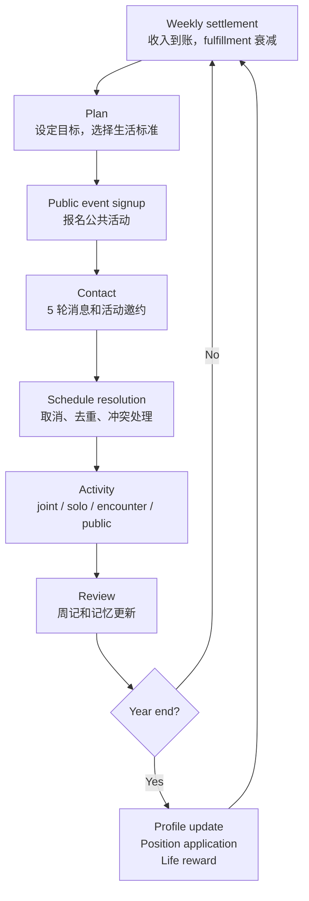

# Agentopia：让 100 个 LLM Agent 过完 10 年社会生活，再用“人生回报”训练模型

### 元信息

| 字段 | 内容 |
|---|---|
| 标题 | Agentopia: Long-Term Life Simulation and Learning in Agent Societies |
| 论文 | [arXiv:2606.07513](https://arxiv.org/abs/2606.07513) |
| 版本 | v1，2026-06-05 17:59:31 UTC 提交；arXiv 本周 recent 页面在 2026-06-08 仍列为当前周候选 |
| 作者 | Xintao Wang, Sirui Zheng, Hongqiu Wu, Weiyuan Li, Jen-tse Huang, Minghao Zhu, Can Zu, Qi Deng, Jiawei Wang, Qianyu He, Heng Wang, Xiaojian Wu, Yunzhe Tao |
| 类型 | 论文，79 页，19 图 |
| 方向 | 大模型 Agent、长程社会仿真、角色扮演后训练 |

### TL;DR

- **这篇论文做什么**：Agentopia 把 LLM Agent 从“几天的小镇模拟”推进到“100 个角色、3 个世界、每个世界 10 个模拟年”的长期社会生活仿真。
- **核心问题**：作者不是只问 Agent 会不会聊天，而是问 Agent 能否在长期关系、职业竞争、经济约束、记忆积累和需求满足中表现出社会生活智能。
- **怎么做**：系统把一年拆成 10 周，每周走 `Plan -> Contact -> Activity -> Review`，再在年末更新 profile、竞聘职位、计算 life reward。
- **关键机制**：每个 Agent 有 profile、动态状态、长期 memory files；环境模型负责事件、反馈、可行性判断、活动叙事、位置和职位，而不是靠大量硬编码规则。
- **训练方法**：作者定义 life reward，包括 social、subjective、economy 三类回报；再用高 advantage 轨迹做 rejection-sampling 式 SFT，并混入 50% Tulu V3 自蒸馏样本防止遗忘。
- **实验规模**：3 个世界，每个 100 个 Agent，跑 10 年；总计 3,000 个 agent-year 观察点。单个 10 年世界平均消耗 13.7B tokens、567K LLM calls、约 186.2 小时。
- **关键数字**：训练后的 Qwen3.5-397B-Agentopia 在仿真中被尊重人数平均 +24.2%、被喜欢人数 +15.9%、社会满足 +9.7%；CoSER Test 平均分从 42.51 提到 49.16，即约 +15.6%。
- **局限**：reward 设计会诱导省钱牺牲 material fulfillment；社会 reward 依赖 Agent 互评和 PageRank；仿真成本极高；主要结果依赖 Qwen3.5-397B、环境模型和封闭世界设定，不能直接证明真实人类社会有效。

### 研究问题：为什么“长程社会生活”比“会聊天”更难？

- 以往 LLM Agent 社会模拟常见目标是：
  - 在小镇里安排一天活动；
  - 根据记忆和时间表做交互；
  - 展示类似人类的对话、计划和反思。
- Agentopia 认为这些还不够，原因有三点：
  - **时间太短**：几天模拟很难观察关系沉淀、职业变化、贫富分化、长期目标和人格变化。
  - **反馈太弱**：单次对话的角色扮演质量不能说明 Agent 是否懂“长期生活中的取舍”。
  - **训练信号太依赖人类数据**：如果未来高质量人类数据趋近耗尽，Agent 需要从经验中学习，而不只是模仿语料。

论文的问题可以压缩成一个更尖锐的问法：

> 如果 LLM Agent 在一个可持续运转的社会里生活多年，它们能不能从自己的社会经验中产生可训练的信号？

这个问题有两层：

- **仿真层**：怎样构造足够长、足够稳定、足够社会化的 Agent society？
- **学习层**：怎样把长期社会生活转化为 reward，再转化为模型训练数据？

### 论文主张与论证路线

| Claim | Mechanism | Evidence | Boundary |
|---|---|---|---|
| 长期社会仿真需要周/月/年的抽象时间，而不是实时物理世界 | 每周四阶段：Plan、Contact、Activity、Review；年末做 profile update、position application、life reward | 3 个世界、每个 100 Agent、10 年模拟；出现计划、关系维护、合作、竞争、经济压力等案例 | 抽象时间牺牲了实时感知，不能验证 embodied agent 或真实社会动力学 |
| Agent 关系最好由记忆自然承载，而不是预设关系类型 | 每个 Agent 维护 `characters/<name>.txt` 或 JSONL memory files，关系由对他人的文本记忆表达 | 案例表显示导师关系、创作合作、长期问候、多周项目延续自然出现 | 关系质量依赖 LLM 写入和检索记忆的可靠性，可能漂移或强化幻觉 |
| 社会生活可以转成 reward，但 reward 必须覆盖多维幸福感 | Social reward 用 affection/respect 图和 Weighted PageRank；Subjective reward 用 mood/material/social/esteem；Economy reward 用资产变化 | reward-behavior correlation 显示 subjective、social、economy 各自受不同指标驱动 | reward 是作者建模选择，不等于真实 well-being，也可能产生省钱等副作用 |
| life reward 可用于后训练 | 用折扣回报和自我基线 advantage 选 top 25% agent trajectories；混入 Tulu V3 自蒸馏数据做 SFT | Qwen3.5-397B-Agentopia 在仿真和 CoSER Test 上都提升 | 没有证明比 PPO/GRPO 等方法更优；训练成本很高；reward hacking 未充分展开 |

### 框架总览：Agentopia 到底由哪些部件组成？


这张总览图承载的是论文的系统边界。它把 Agentopia 分成四段：

- **World and character construction**：
  - 作者人工设计世界观和参考故事；
  - 用 Claude Opus 4.6 增量生成角色；
  - 用 Claude Code 做一致性检查；
  - 每个世界生成 100 个角色，并让社区足够封闭，避免 Agent 频繁提到不可交互人物。
- **Role-playing agent**：
  - Agent 有 profile、dynamic states、social memories；
  - 记忆不只是短期对话历史，而是可由 Agent 自主管理的文件系统。
- **Life simulation in agent society**：
  - 一周由计划、联系、活动、复盘构成；
  - 一年结束后更新角色、职位和 reward。
- **Life reward training**：
  - 用年度 reward 估计回报；
  - 选出相对自身过去改善最大的轨迹；
  - 做 supervised fine-tuning，而不是端到端强化学习。

### Agent 设计：一个角色不是 prompt，而是会变化的状态机

Agentopia 里的 Agent 至少包含三层状态：

| 层 | 内容 | 作用 |
|---|---|---|
| Profile | 背景、性格、天赋、技能、职位、资产 | 保持角色身份和长期稳定性 |
| Social Relationships | 每个角色对其他人的记忆文本 | 让朋友、恋人、竞争者、陌生人都由同一套记忆机制表达 |
| Dynamic States | vitality、fulfillment、skills、position、assets | 让活动产生连续后果，而不是只产生日志 |

值得注意的是，论文没有显式存储“朋友”“恋人”“敌人”这类关系标签。

- 关系存在于 Agent 对另一个人的 memory file 中。
- 关系可以单向，比如 A 记得 B，但 B 不怎么记得 A。
- 关系可以随活动和 contact 更新。
- 这种设计降低了规则复杂度，但也把关系质量交给了 LLM 的记忆写入能力。

长期记忆文件有三个主要类别：

- `general.txt`：个人计划、一般笔记、生活目标。
- `characters/<who>.txt`：关于特定人物的认识和关系记忆。
- `others/<name>.txt`：其他主题。

系统还加入一个关键约束：

- Agent 要更新某个 memory file，必须在同次调用中先读该文件。
- 这个 read-before-write 规则防止 Agent 直接覆盖旧记忆。
- 它相当于给长期记忆加了一个很轻量的事务前置条件。

### 仿真流程：为什么用“周”作为基本单位？

论文的一个基本判断是：

- LLM 以 turn 生成，不会像人一样连续感知世界；
- 如果硬做实时环境，成本会被位置、物品、观察细节吞掉；
- 作者关心的是社会生活，而不是低层移动和物理操作。

所以 Agentopia 采用抽象时间：



这里有几个具体参数：

- `n_year = 10`：每次实验跑 10 个模拟年。
- `n_week = 10`：每个模拟年 10 周。
- `n_day = 5`：每周 5 个活动日。
- `n_contact_slot = 5`：每周 Contact 阶段有 5 轮通信。
- `max_future_schedule_weeks = 4`：活动可提前最多 4 周预约。
- `joint_activity_min/max_turns = 5 / 20`：联合活动有最小和最大轮数。

这种设计牺牲了真实时间，但换来了两个能力：

- **长程可跑**：100 个 Agent 可以过 10 年。
- **社会信号密集**：每周都迫使 Agent 做计划、联系别人、活动、复盘。

### Contact 与 Activity：社会关系怎样被制造出来？

Contact 阶段不是普通聊天，而是一个带动作解析的调度系统。

Agent 可以生成四类 `<role_action>`：

| Action | 功能 | 关键约束 |
|---|---|---|
| `contact` | 给某人发消息 | 每轮最多 10 个 action |
| `propose_joint_activity` | 提出联合活动 | 需要活动名、时间、地点、受邀者 |
| `respond_invitation` | 接受或拒绝邀请 | 同一邀请只保留最后一次回复 |
| `cancel_joint_activity` | 取消已提出活动 | 取消后通知邀请对象 |

Schedule resolution 也很具体：

1. 先处理取消。
2. 再对同一邀请的回复去重。
3. 再处理时间冲突。
4. 最后判断活动是否创建。

冲突优先级是：

```text
existing joint activity
> newly proposed joint activity
> newly accepted joint activity
> existing public / encounter activity
```

Activity 阶段有四种活动：

- **Joint activity**：
  - 多 Agent 多轮互动；
  - 环境模型选择下一位发言者；
  - 支持 private、selective visibility、gift、early exit。
- **Solo activity**：
  - 没有其他日程时的默认活动；
  - 可以学习、工作、休息、消费；
  - 环境模型判断可行性和收益。
- **Encounter activity**：
  - 环境模型给空闲 Agent 安排偶遇；
  - 优先已有关系，也可安排陌生人初识。
- **Public activity**：
  - 环境模型生成公开事件；
  - Agent 独立报名；
  - 活动后可观察其他参与者，并建立新关系。

### 环境模型：它不是裁判插件，而是生成式社会引擎

Agentopia 中的 environment model 做很多事：

- 生成公共活动和偶遇场景；
- 在联合活动中描述环境、选择下一位发言者；
- 判断行为是否可行；
- 给活动结果和状态变化反馈；
- 过滤不符合角色扮演原则的回答；
- 年末更新 profile；
- 处理职位申请排序；
- 生成地点和周边物品。

这带来一个重要取舍：

- 好处是规则不用写死，社会生活更开放。
- 风险是环境模型本身会把偏好、幻觉和判断误差注入仿真。

论文用 16 条 roleplay principles 做响应过滤，覆盖：

- 不能控制他人行为；
- 不编造上下文不存在的物品和事件；
- 保持角色一致；
- 认知边界符合身份；
- 情绪变化要连续；
- 关系进展不能突变；
- 不像 AI 助手说话；
- 对话要有实质推进。

这些原则一方面提升训练数据质量，另一方面也说明 Agentopia 不是纯开放世界。它的“自然社会行为”仍被一组规范强约束。

### Life reward：把社会生活压缩成三个回报维度

Agentopia 的 reward 不是一个分数，而是三类信号：

| Reward | 衡量什么 | 主要来源 |
|---|---|---|
| Social reward | 社会地位 | 他人对自己的 affection 和 respect |
| Subjective reward | 主观满足 | mood、material、social、esteem 的年度轨迹 |
| Economy reward | 经济表现 | 年末资产变化 |

### 公式 1：社会回报中的互惠加权 PageRank

论文先让每个 Agent 私下给社交圈里的人打两类分：

- affection：喜欢程度，对应 warmth。
- respect：尊重程度，对应 competence。

然后把评分排序归一到 0-100，再构造有向加权图。

社会地位更新公式是：

```math
S_i' = \sum_{j \in \mathcal{N}_{in}(i)} w_{ji} \cdot (1 + \alpha \cdot w_{ij}) \cdot S_j
```

变量解释：

- `S_i'`：Agent `i` 的互惠修正后社会分。
- `N_in(i)`：认识并评价 `i` 的 Agent 集合。
- `w_ji`：`j -> i` 的归一化评价权重。
- `w_ij`：`i -> j` 的反向评价权重。
- `alpha`：互惠 affection 系数，论文配置里是 `2.0`。
- `S_j`：`j` 的原始 PageRank 分。

这个公式的关键不是 PageRank 本身，而是互惠项：

- 被高社会地位的人喜欢，权重更高；
- 如果你也重视对方，这段关系对 reward 影响更大；
- 它模拟的是“被我重视的人重视”的心理价值。

### 公式 2：主观回报中的满足度和惩罚

Subjective reward 使用 mood、material、social、esteem 四个维度。

```math
r_{subj} = \frac{\sum_{w=1}^{n_w} \sum_{d=1}^{D} f_{w,d} - n_p \cdot \lambda_p}{n_w \cdot D}
```

变量解释：

- `n_w`：一年中的周数，实验中为 10。
- `D`：fulfillment 维度数，为 4。
- `f_w,d`：第 `w` 周、第 `d` 个 fulfillment 维度。
- `n_p`：低于阈值的惩罚次数。
- `lambda_p`：每次惩罚扣分，配置中为 5。

惩罚阈值用当周全体 Agent 的 25th percentile。

- 这避免绝对阈值过硬。
- 但它也让 reward 变成相对社会中的位置。
- 如果整个群体都过得差，底部 25% 仍会被罚。

### 公式 3：总 life reward

```math
r = \lambda_{social} z_{social}
  + \lambda_{subj} z_{subj}
  + \lambda_{econ} z_{econ}
```

配置权重是：

- `lambda_social = 0.4`
- `lambda_subjective = 0.4`
- `lambda_economy = 0.2`

三个 reward 先做 z-score，再加权求和。

这意味着：

- 社会和主观幸福感各占 40%；
- 经济只占 20%；
- 但经济仍可能改变行为，因为它和 material fulfillment 存在消费/储蓄张力。

### Life reward training：为什么不用 PPO，而用 rejection sampling？

作者没有做端到端 RL，理由很实际：

- 每个 Agent 一年包含数百次 LLM 调用。
- 完整生命轨迹跨多个模拟年。
- 学 critic 或做多 rollout baseline 的成本极高。

所以他们采用类似“从高质量人生片段中学习”的策略：

```text
Input:
  agents i = 1..N
  yearly rewards r_i,t
  discount gamma = 0.90
  simulated years T
  selection fraction = 25%

State:
  G_i,t = discounted future return
  G_norm_i,t = horizon-normalized return
  A_i,t = G_norm_i,t - G_norm_i,t-1

Loop over each reward period t:
  1. compute G_i,t for every agent
  2. normalize by discounted effective horizon
  3. compute advantage against the agent's own previous return
  4. rank agents within this period only
  5. select top 25%
  6. include all selected trajectories from that period
  7. filter malformed or roleplay-principle-violating responses

Output:
  SFT dataset = 50% Agentopia role-playing data + 50% Tulu V3 self-distillation data
```

这里最重要的设计是“自我基线”：

- 不是让所有 Agent 按绝对 reward 排名；
- 而是看某个 Agent 相比自己的过去是否变好；
- 这样可以减少“初始设定更富、更受欢迎的人永远被选中”的偏差。

训练设置：

| 项 | 设置 |
|---|---|
| 基座模型 | Qwen3.5-397B-A17B |
| 数据来源 | 三个世界前四年模拟数据 |
| 选择比例 | 每个 period top 25% advantage |
| 混合数据 | 50% role-playing data + 50% Tulu V3 self-distillation |
| 学习率 | `1e-5`，minimum `1e-6` |
| batch size | 256 |
| 训练资源 | 30 nodes × 8 H100 80GB |
| epoch | 1 |

### 实验设置：三个世界分别测什么？

| 世界 | 场景 | 想观察的社会现象 |
|---|---|---|
| The Apartment | 纽约共享公寓，年轻职业人、学生、艺术家 | 陌生人如何形成社区关系 |
| Arcane Academy | 魔法学院，学生和教师 | 制度化学校里的复杂关系和成长 |
| The Campus | 中国高中，中文仿真 | 校园社交网络、压力和成长轨迹 |

主实验使用：

- 100 个 Agent / 世界；
- 10 个模拟年 / 世界；
- 3 个世界；
- 共 3,000 个 agent-year 观察点。

模型设置：

- Agent 和 environment model 主体使用 Qwen3.5-397B-A17B；
- 输出失败时 fallback 到 Gemini 3 Flash；
- 世界与角色生成环节用 Claude Opus 4.6；
- 自动质量检查用 Claude Code。

### 主结果 1：reward 与行为的相关性不是单一路径


这张相关性热图是理解 Agentopia reward 是否合理的关键证据。

论文报告了几组主要相关：

| 关系 | 数字 | 解释 |
|---|---:|---|
| penalties 与 total reward | `r = -0.50` | 被低满足/低 vitality 惩罚会明显拖累总 reward |
| respected by / liked by 与 social reward | `r = 0.68` | social reward 基本由声誉图驱动，符合设计 |
| active contacts 与 social reward | `r = 0.09` | 主动联系对社会地位有轻微正相关 |
| passive contacts 与 social reward | `r = 0.15` | 被联系更能反映社会吸引力 |
| joint proposed 与 social reward | `r = 0.15` | 提出联合活动和社会地位相关 |
| joint participated 与 social reward | `r = 0.19` | 参与社会活动也有正相关 |
| material fulfillment 与 subjective reward | `r = 0.73` | material 是主观 reward 最强驱动项 |
| social fulfillment 与 subjective reward | `r = 0.52` | 社交满足也显著影响主观 reward |
| mood 与 subjective reward | `r = 0.54` | 情绪状态是主观 reward 关键来源 |
| deposit 与 economy reward | `r = 0.56` | 经济 reward 主要由存款积累驱动 |

这说明 reward 体系有一个优点：

- 不同维度确实捕获了不同社会行为。

但它也暴露出风险：

- social reward 的高相关项与其计算定义高度重叠；
- subjective reward 被 material fulfillment 强烈影响；
- economy reward 容易诱导减少消费。

### 主结果 2：life reward training 改善社会关系，但牺牲材料满足

训练后的 Qwen3.5-397B-Agentopia 与原 Qwen3.5-397B 做四年仿真对比。


跨世界平均表的关键结果是：

| 指标 | Base Avg | Tuned Avg | Delta |
|---|---:|---:|---:|
| Economy Reward | 1077 | 1104 | +2.5% |
| Subjective Reward | 49.9 | 50.8 | +1.8% |
| Respected By | 9.5 | 11.8 | +24.2% |
| Liked By | 6.9 | 8.0 | +15.9% |
| Mutual Respect | 7.2 | 8.3 | +15.3% |
| Mutual Like | 5.1 | 5.4 | +5.9% |
| Material Fulfillment | 43.2 | 36.8 | -14.8% |
| Mood Fulfillment | 85.8 | 87.4 | +1.9% |
| Social Fulfillment | 63.7 | 69.9 | +9.7% |
| Esteem Fulfillment | 43.4 | 45.5 | +4.8% |
| Public Activities | 8.7 | 9.3 | +7.1% |
| Solo Activities | 19.3 | 15.5 | -19.8% |
| Skill Advances | 13.3 | 9.3 | -29.6% |

这不是一个单纯“全面变好”的结果。

更准确的读法是：

- 训练让 Agent 更擅长获得社会认可。
- Agent 在 mood、social、esteem 上变好。
- 但它们减少消费，material fulfillment 明显下降。
- 它们减少 solo activity 和 skill advances，说明 reward 可能让行为向特定模式收缩。

### 主结果 3：社会优势是多年后才显现


附录解释了一个重要现象：

- Year 1 时两种模型的社会指标差距不大；
- 到 Year 4，训练模型被尊重人数 +35.7%；
- 被喜欢人数 +22.2%；
- mutual-respect ties +21.7%。

这支持论文的主张：

- life reward training 的收益不是单轮对话风格变化；
- 它更像长期交互中的策略变化；
- 只有把 Agent 放回多年社会里，差距才明显。

但这里也要谨慎：

- 评估环境和训练环境同源；
- 训练目标和评估指标高度相关；
- 泛化需要看外部 benchmark。

### 主结果 4：CoSER Test 上有外部泛化，但仍不是顶尖模型

CoSER Test 是角色扮演 benchmark，评估四个维度：

- Storyline Consistency
- Anthropomorphism
- Character Fidelity
- Storyline Quality

论文使用 Qwen3-235B 作为 judge。

关键结果：

| 模型 | Average | Anthropomorphism | Character Fidelity | Storyline Quality |
|---|---:|---:|---:|---:|
| Claude-4.5-Opus | 62.43 | 64.28 | 58.45 | 63.24 |
| Gemini-3-Pro | 61.80 | 60.42 | 58.34 | 62.49 |
| Qwen3.5-397B-Agentopia | 49.16 | 49.67 | 46.93 | 59.01 |
| Claude-4.5-Sonnet | 45.21 | 36.02 | 47.55 | 50.09 |
| Qwen3.5-397B | 42.51 | 40.16 | 40.32 | 49.97 |
| CoSER-70B | 35.95 | 31.16 | 32.28 | 45.33 |
| GPT-5-Mini | 32.97 | 24.60 | 27.20 | 42.00 |

相对基线：

- Average：42.51 -> 49.16，约 +15.6%。
- Anthropomorphism：40.16 -> 49.67，约 +23.7%。
- Character Fidelity：40.32 -> 46.93，约 +16.4%。

这个结果说明：

- life reward training 不只是记住 Agentopia 世界；
- 它可能提升了更一般的角色扮演能力。

但也要看到：

- 它仍明显低于 Claude-4.5-Opus 和 Gemini-3-Pro。
- judge 模型本身可能偏好某类表达。
- CoSER Test 仍是文本角色扮演，不等价于真实社会智能。

### 模型比较：不同 LLM 在同一社会规则下表现出不同“人格”

附录还比较了五个模型在 Campus 和 Academy 中控制 20 个 Agent 的四年表现。

| 模型 | 特征 |
|---|---|
| Gemini-3-Flash | total reward 最高 `+0.10`，subjective `+0.31`，esteem `+0.52`；但 public participation `-0.96` |
| GPT-5-mini | deposit `+0.38`、skills `+0.71` 最高；但 social fulfillment `-0.62`、mood `-0.44` 最低 |
| Qwen3.5-397B | adjusted social reward `+0.13` 最高，public event participation `+0.64` |
| DeepSeek-v3.2 | public events `+0.80`，mood `+0.56`，但 joint proposals `-0.61` |
| Qwen3.5-27B | total reward `-0.07`，esteem `-0.36`，material `-0.27`，整体最弱 |

这个比较的意义不在于给模型排名，而在于说明：

- 同一社会规则下，模型会表现出不同长期行为偏好。
- 经济能力、社交能力、公共活动偏好、技能增长并不总是同向。
- 这为 Agent benchmark 提供了比单轮问答更丰富的观测面。

### 成本：长程 Agent 社会的真实瓶颈是上下文增长

主文表 3 给出三个世界的总成本：

| 世界 | Input tokens | Output tokens | Total tokens | Calls | Time |
|---|---:|---:|---:|---:|---:|
| The Campus | 19,041M | 425M | 19,466M | 544K | 201.3h |
| Arcane Academy | 11,302M | 315M | 11,617M | 572K | 174.2h |
| The Apartment | 9,699M | 317M | 10,016M | 584K | 183.2h |
| Average | 13,347M | 352M | 13,700M | 567K | 186.2h |

附录进一步拆分：

- role-playing agents 占约 95% input tokens；
- environment model 平均 input 665M；
- role-playing agents 平均 input 12,683M；
- joint activity 占 environment model input 的 70% 以上。

这说明真正的瓶颈不是输出，而是：

- persona；
- memory summary；
- recent history；
- stage prompt；
- 多轮活动上下文。

Agentopia 因此也可以被读成一篇关于 long-context memory cost 的论文。

### 案例证据：所谓“涌现行为”具体是什么？

论文附录列了约 60 个案例，覆盖 13 类主题。

几个代表性行为：

- **计划行为**：
  - Agent 会根据强技能选择活动；
  - 会因为经济压力改为 frugal；
  - 会在 vitality 很低时安排休息。
- **关系维护**：
  - 有角色连续四周给低 vitality 朋友发 check-in message；
  - 对方每次都温暖回复，并引用之前说过的话。
- **多周项目连续性**：
  - herbology mentorship 从 pH 调整延续到繁殖、采收指标、效力测试；
  - 邀约不是每周重启，而像项目状态更新。
- **地点选择承载情绪语义**：
  - 音乐人分享未完成歌曲时选择屋顶而不是排练室；
  - 因为屋顶代表低压力，而排练室暗示表演标准。
- **跨领域合作**：
  - 剧作家和吉他手从文本与音乐的意外协同发展出共同创作。

这些案例不是严格的 causal proof。

更合适的定位是：

- 它们说明系统能产生可读、可追踪、带长期上下文的社会行为片段；
- 但每个案例仍可能是 LLM 叙事能力、prompt 约束和环境模型反馈共同塑造的结果。

### 消融与失败：论文没有充分做什么？

这篇论文有大量附录分析，但有几个关键缺口：

| 缺口 | 为什么重要 |
|---|---|
| 没有完整 ablation 掉 memory files | 不能定量判断长期记忆机制究竟贡献多少 |
| 没有系统比较不同 reward 权重 | `0.4/0.4/0.2` 的权重可能强烈影响行为 |
| 没有把环境模型换成非 LLM 或不同 LLM 做主 ablation | 环境模型偏差可能直接决定社会结果 |
| 没有深入分析 reward hacking | material fulfillment 下降已经显示 reward 会改变策略 |
| 没有真实人类行为对齐验证 | “像人”主要通过 benchmark、case 和 LLM judge 支撑 |
| 训练只覆盖一种主基座模型 | Qwen3.5-397B-Agentopia 的结论不必然推广到其他模型 |

一个尤其值得注意的失败边界是消费/储蓄 trade-off：

- Economy reward 奖励资产增长；
- Tuned Agent 减少消费；
- material fulfillment 下降 14.8%；
- skill advances 也下降 29.6%。

这说明 reward 并没有自动产生“全面健康人生”。

它产生的是：

- 在当前 reward 权重和环境反馈下更优的策略；
- 其中一部分策略可能牺牲未被足够奖励的生活维度。

### Figure 与 Table 逐项证据解读

| 图表 | 支持什么 | 不能证明什么 |
|---|---|---|
| Figure 1 framework | Agentopia 是 world construction、agent、simulation、training 的闭环系统 | 不能证明每个模块都必要 |
| Reward distribution | 三个 reward 维度在 10 年中有不同趋势 | 不能证明 reward 等同真实幸福感 |
| Reward-behavior correlation | 行为指标和 reward 有可解释相关 | 相关不是因果，且部分相关由公式定义决定 |
| SFT cross-world table | life reward training 改善社交认可和部分 fulfillment | 同源评估可能放大训练收益 |
| CoSER table | 训练收益能转移到外部角色扮演 benchmark | 不能证明真实人类行为对齐 |
| Cost table | 长程社会仿真成本巨大，input token 主导 | 不能说明这是最优工程实现 |
| Case study tables | 可观察到连续关系、项目、经济压力、活动选择 | 案例是定性证据，不是统计因果 |

### 相关工作位置：它和 Generative Agents、AgentSociety、CoSER 的区别

Agentopia 所在的位置大致是：

- 与 **Generative Agents** 相比：
  - 共同点是用记忆、计划、反思驱动社会互动；
  - 区别是 Agentopia 把时间尺度推到多年，并加入 reward 和训练闭环。
- 与 **AgentSociety** 相比：
  - 共同点是大规模 LLM-driven social simulation；
  - 区别是 Agentopia 更强调个人长期生活、well-being reward 和 role-playing 能力提升。
- 与 **CoSER** 相比：
  - CoSER 更像角色扮演评测；
  - Agentopia 用 CoSER 的 given-circumstance acting 思想来组织活动，并把 CoSER Test 作为外部评估。
- 与后训练工作相比：
  - Agentopia 不是通用 RLHF 或偏好学习；
  - 它把“社会生活中的长期改善”转成 SFT 数据选择准则。

### 结论：这篇论文真正推进了什么？

Agentopia 的贡献不只是“做了一个大模拟”。

更关键的是三件事：

1. **把 Agent society 从展示系统变成训练数据生成系统**。
   - 过去很多 Agent 社会是 demo 或 benchmark。
   - Agentopia 明确把生活轨迹转成 reward，再转成模型训练数据。

2. **把角色扮演能力和长期社会反馈连接起来**。
   - 角色扮演不再只是“像某个人说话”。
   - 它变成“在多年社会关系中维持动机、记忆、关系和取舍”。

3. **暴露了 long-horizon agent learning 的成本和 reward 风险**。
   - 13.7B tokens / world 是非常重的实验。
   - reward 的任何偏置都会在多年生活中被放大。

### 局限与可复现性判断

- **工程可复现性有限**：
  - 论文公开 TeX 和图表；
  - 但完整仿真系统、世界数据、训练数据和运行脚本是否完全开放，需要看作者后续仓库发布。
- **成本门槛很高**：
  - 30 nodes × 8 H100 的训练设置；
  - 单个 10 年世界约 186 小时；
  - 一般实验室很难完整复现。
- **外部有效性有限**：
  - 封闭社区降低了不可交互人物问题；
  - 但真实社会是开放的、制度化的、强约束的。
- **评估依赖 LLM judge 和环境模型**：
  - 这会引入模型偏好；
  - 也可能让“像人”的结论过度依赖文本叙事流畅度。
- **reward 仍是价值选择**：
  - social、subjective、economy 的权重不是客观真理；
  - material fulfillment 下降说明训练已出现目标取舍问题。

### 领域延伸：Agent 研究接下来该追问什么？

- **长期 Agent benchmark 不能只看任务完成率**：
  - Agentopia 展示了关系、声誉、满足度、经济、技能等多维指标；
  - 这对 coding agent、research agent、personal agent 都有启发。
- **Agent memory 需要从“能记住”走向“能负责地遗忘”**：
  - Agentopia 允许 Agent 自主管理文件；
  - 但长期运行中，错误记忆、过时关系、隐私和偏见会持续积累。
- **reward 设计必须有反事实审计**：
  - 如果奖励经济，Agent 就会更省钱；
  - 如果奖励社交，Agent 可能迎合别人；
  - 如果奖励 esteem，Agent 可能选择更外显的成就行为。
- **AI 安全视角下，社会仿真也是风险放大器**：
  - 长期社会环境可能训练出更强操纵、结盟、声誉管理和策略性披露能力；
  - 这些能力对 companion agent 有价值，对高自治 Agent 也有安全风险。
- **后训练不应只问“分数是否提升”**：
  - 还要问哪些行为被压低；
  - 哪些长期偏好被强化；
  - 哪些未显式 reward 的价值被牺牲。

最终看，Agentopia 是一篇把 **LLM Agent、社会仿真、角色扮演和后训练** 接到同一条链路上的论文。它最有价值的地方不是证明“Agent 已经像人”，而是提出了一个更难、也更接近未来 Agent 系统的问题：

- 当 Agent 的经验来自长期生活而不是静态语料时，什么样的 reward 才值得被优化？
- 当 reward 被优化多年后，我们怎样确认变好的不是表演，而是真正更稳健的社会行为？
