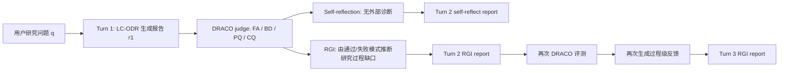

# Deep Research Agent 的多轮反馈为什么不稳定：过程级反馈能救第一轮，救不了全文重写

## 元信息与 TL;DR

- 原文：Rishabh Sabharwal, Hongru Wang, Amos Storkey, Jeff Z. Pan, [Multi-Turn Evaluation of Deep Research Agents Under Process-Level Feedback](https://arxiv.org/abs/2606.09748)
- 类型：论文，arXiv:2606.09748，cs.AI / cs.CL / cs.LG
- 提交时间：2026-06-08 17:08:36 UTC
- 会议状态：SCALE - ICML 2026 workshop oral
- 代码与结果：[sabharwalrishabh/Multi-Turn-Evaluation-of-DRAs](https://github.com/sabharwalrishabh/Multi-Turn-Evaluation-of-DRAs)
- 实验脚手架：[LangChain Open Deep Research](https://github.com/langchain-ai/open_deep_research)
- 评测基准：DRACO，50 个抽样任务，覆盖 10 个研究域

### TL;DR

- **这篇论文问什么？**
  - 现有 Deep Research Agent 评测大多只看单次报告。
  - 真实使用里，用户会要求补充、修订、再查证。
  - 作者因此问：这些 Agent 能不能在多轮反馈下稳定改进，而不是一边补新内容、一边丢旧内容？
- **作者怎么做？**
  - 在 LangChain Open Deep Research 的同一 scaffold 内测试 GPT-4.1-mini、GPT-4.1、DeepSeek-V4-Flash。
  - 每个模型先写 Turn 1 报告，再比较两种 Turn 2：
    1. self-reflection：不给外部诊断，只让 Agent 自我反思。
    2. RGI process-level feedback：用 Research Gap Inference 从 DRACO rubric 的通过/未通过模式推断研究过程缺口。
  - RGI 不是告诉模型“补某条 rubric 答案”，而是告诉它研究策略哪里偏了，例如 source type、主题深度、时间范围、比较维度。
- **关键结果是什么？**
  - self-reflection 几乎没净收益：GPT-4.1 归一化分数只 +0.09，DeepSeek-V4-Flash 反而 -0.54。
  - 第一轮 RGI 很有效：GPT-4.1-mini +15.35，GPT-4.1 +11.42，DeepSeek-V4-Flash +8.15。
  - 第二轮 RGI 不稳定：GPT-4.1 Turn 3 反跌 -4.97，GPT-4.1-mini 只 +1.34，DeepSeek-V4-Flash +4.01。
  - 失败机制是全文重写：GPT-4.1 Turn 3 只保留 27.01% 的 Turn 2 citations，5-gram overlap 只有 1.79%，回归率升到 23.57%。
- **最重要的解释是什么？**
  - 过程级反馈能让 Agent 找到漏查的方向。
  - 但当前 DRA 架构通常每轮重新 plan-search-write，没有显式“保留已满足证据”的机制。
  - 当 Turn 2 已经中等偏好时，Turn 3 的新增空间变小，旧内容暴露在全文重写风险中，回归会抵消补充。
- **局限是什么？**
  - 只测 3 个模型、LC-ODR 一个 scaffold、DRACO 50 个抽样任务。
  - 未直接比较 criterion-level feedback 与 process-level feedback。
  - judge、feedback generator、研究 agent 都依赖 LLM，结果仍受评测模型、搜索工具和成本预算影响。

## 研究问题：为什么单次报告分数不足以评估 Deep Research Agent？

### 论文反对的隐含假设

- 许多 deep research benchmark 默认：
  1. 用户给出开放问题；
  2. Agent 搜索、阅读、写一篇长报告；
  3. judge 按 rubric 打分；
  4. 分数代表系统能力。
- 作者指出，这漏掉了真实工作流里最关键的一步：
  - 用户不会把第一稿当终稿；
  - 研究报告常常经过补证据、改范围、追问、删错源、重算数字；
  - Agent 的可靠性不只取决于能否写第一稿，也取决于能否在反馈后保住旧证据并补齐新缺口。

### 多轮改写的真正风险

| 风险 | 表面现象 | 对研究型 Agent 的意义 |
|---|---|---|
| 自我诊断失败 | Agent 多搜了网页，却没搜到真正缺口 | 说明“更多 tool calls”不是改进本身 |
| 局部补充导致全局回归 | 补了新主题，丢了旧 citation 或旧数字 | 说明改写不是单调累加 |
| 反馈粒度错位 | rubric 失败项只告诉“缺什么”，不告诉“为什么缺” | 说明评测信号需要转成研究过程信号 |
| 架构无记忆 | 每轮重新 plan-search-write | 说明模型必须重新满足所有旧标准 |

### 这篇论文的切入点

- 作者不是简单问“反馈有没有用”。
- 它把反馈拆成两个层次：
  - **criterion-level feedback**：某条 rubric 没满足，去补这条。
  - **process-level feedback**：为什么这些 rubric 一起失败？研究策略哪里出问题？
- 论文关注后者，因为 deep research 的失败经常来自：
  - source selection 错；
  - scope framing 太窄；
  - 只看二手聚合源，没看 primary source；
  - 覆盖了主题名，但没覆盖可验证细节。

## 论文主张与论证路线

### Claim -> Mechanism -> Evidence -> Boundary

| Claim | Mechanism | Evidence | Boundary |
|---|---|---|---|
| Deep Research Agent 不能可靠自我修正 | self-reflection 只给常量式反思 prompt，无外部诊断 | 三个模型 Turn 2 分数变化分别为 +2.42、+0.09、-0.54；incorporation 与 regression 接近 | 只说明无外部信号时不稳，不否定带 verifier 的自我修正 |
| 过程级反馈能显著改善第一轮修订 | RGI 从 FA/BD/CQ 的通过与失败模式推断研究缺口 | RGI Turn 2 分数提升 +15.35、+11.42、+8.15；BD 提升最大 | 反馈由 LLM 生成，仍依赖 judge 与 rubric 质量 |
| 多轮收益不会自然累积 | LC-ODR 每轮完整重写，旧内容没有结构性锁定 | GPT-4.1 Turn 3 -4.97；GPT 模型 regression 达 18.59%-23.57% | DeepSeek-V4-Flash 保留更多旧内容，说明模型行为会调节结果 |
| 第三轮只在低 headroom 任务上更可能有用 | Turn 2 低分说明仍有较多未满足 criteria | GPT-4.1 Turn 3 gains 的 mean T2 为 44.73，drops 为 66.24 | 这不是可部署策略，还需要动态停止和局部编辑机制 |

### 论文的核心判断

- RGI 证明了一件积极的事：
  - **Agent 确实能根据“研究过程缺口”改变搜索与写作策略。**
- Turn 3 证明了一件更重要的事：
  - **当前全文重写式 DRA 架构没有“单调改进”属性。**
- 因此，未来系统不能只加更强模型或更多搜索预算，还要设计：
  - coverage lock；
  - citation retention；
  - local patching；
  - rubric-aware diff；
  - revision memory；
  - stop / continue policy。

## 方法机制：RGI 如何从 rubric 失败变成过程级反馈？


### DRACO 的四类评测轴

| 轴 | 含义 | RGI 是否使用 | 原因 |
|---|---|---:|---|
| FA: Factual Accuracy | 事实是否正确、可验证 | 是 | 能暴露缺数字、错时间、错实体、错结论 |
| BD: Breadth and Depth | 覆盖是否全面、分析是否深入 | 是 | 能暴露漏主题、浅覆盖、比较维度不足 |
| CQ: Citation Quality | claim 是否由合适来源支撑 | 是，但只作诊断信号 | 能解释 FA/BD 为什么失败，例如源类型不对 |
| PQ: Presentation Quality | 结构、格式、表达 | 否 | 这更像写作问题，不反映研究过程缺口 |

### RGI 的输入不是“失败项列表”

- 作者强调，RGI 同时看通过项与失败项。
- 通过项的作用是 contrast signal：
  - 如果一个大主题通过，但子主题失败，缺口可能是“覆盖浅”；
  - 如果某个事实方向通过，但 citation quality 失败，缺口可能是“源类型不可靠”；
  - 如果正向 criteria 失败，负向 criteria 没出错，缺口可能是“遗漏”而不是“编造”。
- 这种设计避免了简单把 rubric failure 改写成待办清单。

### RGI 的两步生成

1. **research-process gap analysis**
   - 按主题或实体聚类通过项与失败项；
   - 用通过项解释失败项；
   - 识别主要研究缺口；
   - 检查 CQ 是否解释 FA/BD 的下游失败。
2. **process-level feedback**
   - 输出 2-3 个研究主题；
   - 说明下一轮该深入哪些方向；
   - 指明应优先查哪类证据或做哪类分析；
   - 不直接复述 rubric，也不把 evaluator explanation 原样贴回去。

### 用公式看四个指标

```text
Incorporation_t =
  |{i: criterion i 在 t-1 未满足, 在 t 满足}|
  / |{i: criterion i 在 t-1 未满足}|

Regression_t =
  |{i: criterion i 在 t-1 满足, 在 t 未满足}|
  / |{i: criterion i 在 t-1 满足}|

NetGain_t =
  |新满足的 criteria|
  - |从满足变成未满足的 criteria|
```

- `Incorporation` 回答：这轮补回了多少旧缺口？
- `Regression` 回答：这轮弄丢了多少旧成果？
- `NetGain` 回答：补回来的是否超过丢掉的？
- 论文特别提醒：
  - FA 有 1,052 条 criteria；
  - BD 有 418 条；
  - PQ 有 274 条；
  - CQ 有 254 条。
- 所以百分比会误导：
  - PQ incorporation 看起来能到 30% 左右；
  - 但绝对 net gain 可能只有 +1，甚至是负数。

## 实验设置：作者到底测了什么？

### Agent scaffold

- 使用 LangChain Open Deep Research。
- 该 scaffold 把研究任务拆成四步：
  1. Planner 生成 research brief；
  2. Supervisor 拆分并行子任务；
  3. Researcher agents 搜索网页并萃取证据；
  4. Reporter 汇总为带引用的长报告。
- 每一次调用都是完整 plan-search-write。
- 这点非常关键：
  - Turn 2 和 Turn 3 不是在旧文档上做局部 patch；
  - 而是带着旧报告和反馈重新生成整篇报告。



### 模型与工具

| 组件 | 设置 |
|---|---|
| Research agents | `gpt-4.1-mini-2025-04-14`、`gpt-4.1-2025-04-14`、`deepseek-v4-flash` |
| Feedback generator | `gpt-4.1-2025-04-14`，temperature 0.7 |
| Rubric judge | `gpt-5.2`，reasoning effort 为 none，temperature 0 |
| Search tool | Tavily，max results 5，general topic，include raw content |
| Trace | LangSmith，记录 token、researcher 数、search calls、URLs、latency、phase cost |

### 数据集

- 从 DRACO 的 100 个任务中抽样 50 个。
- 保持原始 domain distribution。
- 覆盖 10 个领域：
  - Finance: 10
  - Shopping/Product Comparison: 8
  - Academic: 6
  - Technology: 5
  - General Knowledge: 5
  - UX Design: 4
  - Law: 3
  - Medicine: 3
  - Needle in a Haystack: 3
  - Personalized Assistant: 3

### 为什么这个设置对 Agent 研究重要？

- 它不是简单 QA。
- 每个任务要求长报告、检索、引用、跨来源综合。
- 评测单位不是一个 final answer，而是：
  - report；
  - rubric criteria；
  - cross-turn criteria dynamics；
  - trace-level behavior；
  - report overlap。

## 主结果：self-reflection 几乎无效，RGI 第一轮有效

### Overall performance

| 模型 | Turn 1 Norm. | Self-reflection Turn 2 | RGI Turn 2 | RGI Turn 3 |
|---|---:|---:|---:|---:|
| GPT-4.1-mini | 37.76 | 40.18 (+2.42) | 53.11 (+15.35) | 54.45 (+1.34) |
| GPT-4.1 | 44.77 | 44.86 (+0.09) | 56.19 (+11.42) | 51.22 (-4.97) |
| DeepSeek-V4-Flash | 57.20 | 56.66 (-0.54) | 65.35 (+8.15) | 69.36 (+4.01) |

### 这个表怎么读？

- **Self-reflection 的问题不是“不努力”。**
  - 论文的 trace 分析显示，self-reflection 下模型会增加研究活动。
  - 但没有外部诊断时，它不知道该把搜索与补充投向哪里。
- **RGI Turn 2 的收益很清楚。**
  - GPT-4.1-mini 从 37.76 到 53.11；
  - GPT-4.1 从 44.77 到 56.19；
  - DeepSeek-V4-Flash 从 57.20 到 65.35。
- **Turn 3 暴露架构问题。**
  - GPT-4.1 不是“涨得少”，而是从 56.19 掉到 51.22。
  - GPT-4.1-mini 还有 +1.34，但已经远低于 Turn 2 的 +15.35。
  - DeepSeek-V4-Flash 能继续涨，论文后面把它解释为更强的内容保留行为和更高计算投入。

### Criterion dynamics：为什么 self-reflection 没净收益？

| 模型 | Self-reflection Inc. | Self-reflection Reg. | Net | RGI Turn 2 Inc. | RGI Turn 2 Reg. | Net |
|---|---:|---:|---:|---:|---:|---:|
| GPT-4.1-mini | 15.40% | 12.90% | +62 | 34.78% | 14.52% | +267 |
| GPT-4.1 | 15.58% | 14.74% | +13 | 36.88% | 16.87% | +208 |
| DeepSeek-V4-Flash | 26.18% | 15.99% | +1 | 39.61% | 13.41% | +135 |

- GPT-4.1 的 self-reflection 几乎是原地打转：
  - 新满足一些 criteria；
  - 同时丢掉几乎同样多的旧 criteria；
  - 最后 net 只有 +13。
- DeepSeek-V4-Flash 更有意思：
  - incorporation 率看起来更高；
  - 但绝对数是 199 个 incorporations vs. 198 个 regressions；
  - net 只有 +1。
- RGI 的差别在于：
  - regression 并没有完全消失；
  - 但 incorporation 大幅增加；
  - 所以净收益显著变正。

## 分轴证据：RGI 主要改善 Breadth/Depth 和事实 grounding

### Axis-wise normalized score gains

| 模型 | FA: RGI Turn 2 - T1 | BD: RGI Turn 2 - T1 | CQ: RGI Turn 2 - T1 | PQ: RGI Turn 2 - T1 |
|---|---:|---:|---:|---:|
| GPT-4.1-mini | +13.51 | +29.96 | +10.27 | +4.41 |
| GPT-4.1 | +10.65 | +22.85 | +8.23 | -1.57 |
| DeepSeek-V4-Flash | +8.04 | +16.28 | +5.16 | -4.32 |

### 为什么 BD 提升最大？

- RGI 反馈的对象是“研究过程缺口”。
- 这类缺口最直接对应 BD：
  - 漏了一个重要子主题；
  - 只做高层综述，没有深入技术细节；
  - 缺少横向比较；
  - 时间范围不完整；
  - 没有覆盖法规、数据、部署边界等必要维度。
- FA 同时提升，说明 Agent 不只是写得更长，而是能找到更多可验证事实。
- CQ 也提升，但论文认为它多半是间接收益：
  - RGI 要求查更合适来源；
  - source quality 变好；
  - citation quality 随之提升。
- PQ 没有稳定提升，因为作者刻意不把 PQ 放进 RGI。

### 这里的边界

- RGI 不是万能 verifier。
- 它不能保证新证据一定找得到。
- 它也不能保证模型不会在全文重写时丢掉旧内容。
- 它证明的是：
  - 过程级诊断比空泛 self-reflection 更能把搜索预算引向正确缺口。

## Turn 3 失败机制：全文重写让旧成果重新暴露在回归风险里

### Figure 2：第三轮不是越多越好


### Headroom 效应

| 模型 | Turn 3 gains 数量 | gains 的平均 T2 分数 | Turn 3 drops 数量 | drops 的平均 T2 分数 | 相关性 |
|---|---:|---:|---:|---:|---:|
| GPT-4.1-mini | 27 | 45.45 | 19 | 60.92 | -0.34 |
| GPT-4.1 | 21 | 44.73 | 27 | 66.24 | -0.50 |

- 如果 Turn 2 仍然低分，说明还有大量未满足 criteria。
- 这时 Turn 3 有足够“可补空间”，新增收益可能超过回归。
- 如果 Turn 2 已经中等或较好：
  - 可补 criteria 变少；
  - 已满足 criteria 变多；
  - 全文重写会把更多旧成果放回风险区；
  - regression 更容易抵消 incorporation。

### Turn 3 criterion balance

| 模型 | Turn 3 incorporated criteria | Turn 3 regressed criteria | Net |
|---|---:|---:|---:|
| GPT-4.1-mini | 237 | 211 | +26 |
| GPT-4.1 | 219 | 281 | -62 |
| DeepSeek-V4-Flash | 197 | 123 | +74 |

- GPT-4.1 的问题尤其明显：
  - 它不是没有补新内容；
  - 它补了 219 个 criteria；
  - 但丢了 281 个旧 criteria。
- DeepSeek-V4-Flash 的 incorporation 不比 GPT 模型夸张：
  - 31.52% vs. GPT 的 27.17%-27.46%；
  - 真正区别是 regression 少得多。

## 为什么 DeepSeek-V4-Flash Turn 3 更稳？

### Cross-turn overlap

| 模型 | Citation retention | 5-gram recall | 7-gram recall | Turn 3 regression |
|---|---:|---:|---:|---:|
| GPT-4.1-mini | 37.22% | 6.59% | 5.09% | 18.59% |
| GPT-4.1 | 27.01% | 1.79% | 0.82% | 23.57% |
| DeepSeek-V4-Flash | 53.96% | 26.68% | 22.47% | 8.96% |

### 论文的解释

- GPT-4.1 更像“重做一篇报告”：
  - citation retention 只有 27.01%；
  - 5-gram recall 只有 1.79%；
  - 说明 Turn 3 几乎重新写作。
- DeepSeek-V4-Flash 更像“在旧报告上继续扩展”：
  - citation retention 53.96%；
  - 5-gram recall 26.68%；
  - 旧 evidence base 保留得更多。

### 但稳定不是免费的

| 模型与轮次 | 输入 tokens / task | 输出 tokens / task | 成本 / task | latency | searches | URLs | words | citations |
|---|---:|---:|---:|---:|---:|---:|---:|---:|
| GPT-4.1 Turn 2 | 1,091,321 | 67,252 | $49.71 | 230.9s | 8.4 | 121.2 | 2,550.0 | 32.4 |
| GPT-4.1 Turn 3 | 984,427 | 61,026 | $43.35 | 289.1s | 7.9 | 111.0 | 2,510.0 | 30.1 |
| DeepSeek-V4-Flash Turn 2 | 3,854,629 | 217,629 | $46.25 | 789.0s | 31.8 | 630.7 | 9,295.1 | 65.5 |
| DeepSeek-V4-Flash Turn 3 | 4,040,899 | 248,395 | $50.98 | 683.1s | 35.5 | 369.3 | 10,184.2 | 75.6 |

- DeepSeek-V4-Flash 的 Turn 3 更稳，但它：
  - 输入 tokens 达 4.04M；
  - 搜索调用约 35.5；
  - 报告均长超过 10k words；
  - latency 仍在 683s。
- 论文据此提出一个更强的架构判断：
  - 当前系统没有显式 preservation mechanism；
  - 模型只能靠更长上下文、更大搜索、更保守改写来隐式保留；
  - 这会把可靠性成本转嫁到计算预算上。

## Case studies：反馈能救“漏查”，救不了“找不到证据”


### Case 1：deepfake detection 任务，反馈驱动恢复

- 任务要求：
  - 研究 2022 年以来 deepfake detection；
  - 覆盖技术进展；
  - 讨论伦理；
  - 梳理监管环境。
- Turn 1 问题：
  - 主题覆盖宽，但技术细节浅；
  - 缺少具体系统；
  - 法规部分没有扎到 primary legislative text；
  - benchmark-to-deployment 差距缺量化。
- RGI 反馈指向三个过程缺口：
  1. detection method 太综述化；
  2. regulatory coverage 太高层；
  3. benchmark 与部署差距缺数字。
- Turn 2 结果：
  - overall normalized score 从 50.0 到 79.0，提升 +29.0；
  - 补回 EU AI Act formal identifier；
  - 补回 Article 50 obligations；
  - 补回 August 2026 compliance date；
  - 加入 45%-50% AUC benchmark-to-deployment drop；
  - 加入 multimodal 与 audio detection 方法。
- 仍有回归：
  - Turn 1 中一个 gender-harm statistic 在重写中丢失。

### Case 2：CME Group 财务任务，检索失败限制恢复

- 任务要求：
  - 定量分析 CME Group 的 cash-generation efficiency；
  - 需要 quarterly figures；
  - 来源应优先官方 SEC filings。
- Turn 1 问题：
  - Agent 使用第三方聚合源；
  - 使用 annualized data；
  - 没有正确抓 quarterly filings。
- RGI 反馈要求：
  1. 查季度 filings；
  2. 查完整 debt disclosures；
  3. 聚合 committed liquidity sources。
- Turn 2 部分恢复：
  - 找到 Q1 2024 OCF: $892.7M；
  - 找到 corporate revolver capacity；
  - 补回一个 missing note。
- 但核心失败仍在：
  - 声称 Q1 2025 OCF unavailable；
  - downstream OCF calculations 失败；
  - BD 从 28.6 掉到 0.0；
  - Turn 2 overall 从 14.0 掉到 10.1。
- 这个案例说明：
  - 反馈可以告诉 Agent “该查哪里”；
  - 但如果 Agent 检索不到关键 primary source，反馈无法凭空创造证据；
  - 全文重写还会让旧正确值回归，例如 Q1 2024 net income 错掉、$500M 2028 note 消失。

## 相关工作位置：它和多轮修订、过程评测有什么区别？

### 与 Mr Dre / criterion-level feedback 的区别

- Chen et al. 2026 的 multi-turn report revision 更关注：
  - 用户或 rubric 层面的具体内容反馈；
  - Agent 能否加入特定缺失项；
  - 回归比例 16%-27%。
- 这篇论文的差异：
  - 不是告诉 Agent “补某个内容点”；
  - 而是把多条通过/失败 criteria 归纳为研究策略问题；
  - 同时加入 trace-level 解释：searches、URLs、tokens、citations、overlap。

### 与 DRACO / DeepResearchBench 的区别

- DRACO 提供强 rubric 与跨域任务。
- DeepResearchBench 等提供 long-form deep research 的单次评测。
- 本文把问题推进到：
  - 同一 rubric 在多轮之间的 dynamics；
  - criteria 从 unmet 到 met，或从 met 到 unmet；
  - 反馈是否能形成稳定策略更新。

### 与 LLM self-correction 研究的关系

- 论文呼应一个已有结论：
  - 模型常常能“在知道错误位置后修正”；
  - 但不能可靠自己发现错误。
- 在 DRA 场景里，这表现为：
  - self-reflection 会让 Agent 多搜、多写；
  - 但缺少诊断信号，补的不是最关键缺口；
  - 于是 incorporation 与 regression 抵消。

## 证据边界与可复现性

### 可复现性强的部分

- 代码仓库公开了：
  - `ablations/scripts/`：运行 turns、评测、生成反馈、比较 turns、citation analysis、trace metric extraction；
  - `ablations/tasks/`：任务 JSON；
  - `ablations/reports/`：各模型各轮生成报告；
  - `ablations/evaluations/`：per-report judge scores；
  - `ablations/analysis/`：模型 summary、domain breakdown、self-reflect comparison、trace metrics；
  - `ablations/fig2_code.py`：复现 Figure 2。
- 仓库 README 明确实验使用 LangChain Open Deep Research。
- GitHub HEAD 在本次采集时为 `99114aa9971ab2d7f1e167bafe2e9593394e3237`。

### 仍需谨慎的部分

| 证据点 | 可相信什么 | 不能推出什么 |
|---|---|---|
| 50 个 DRACO 抽样任务 | 说明跨 10 个 domain 的初步趋势 | 不能替代 full DRACO 或更多 benchmark |
| 3 个模型 | 能比较不同 rewrite behavior | 不能代表所有 frontier DRA |
| LC-ODR scaffold | 让模型在同一模块化多 Agent 框架内受控比较 | 不等于所有商业 Deep Research 系统 |
| RGI feedback | 证明 process-level signal 有第一轮收益 | 不证明 RGI 是最优反馈策略 |
| LLM-as-judge | 可规模化评测 criteria dynamics | 不等于人类专家最终裁决 |

### 论文没有解决的关键问题

- 如何做局部修订，而不是全文重写？
- 如何锁定已满足 criteria 对应的证据？
- 如何在 Turn 2 分数已经中等时自动停止？
- 如何让 feedback granularity 随 headroom 变化？
- 如何区分：
  - 模型能力不足；
  - 搜索工具没找到；
  - scaffold 没保留；
  - judge 把真实改进误判为失败？

## 进一步细读：这篇论文真正把“反馈”拆成了三个不同对象

### 对象一：用户想补什么

- 在真实研究场景里，用户的反馈常常是内容导向的：
  - “再补一下监管部分”；
  - “比较一下 2024 和 2025 的数据”；
  - “把引用换成官方来源”；
  - “解释为什么这个 benchmark 到部署会掉分”。
- 这类反馈对人类作者很自然。
- 但对当前 DRA 来说，它可能被理解成：
  - 重新搜索所有东西；
  - 重写完整报告；
  - 在新报告里尝试覆盖反馈；
  - 同时没有专门机制检查旧报告哪些 claim 不能动。
- 所以“用户想补什么”并不等于“系统应该怎么改”。

### 对象二：评测 rubric 说哪里失败

- DRACO rubric 的优点是可细粒度打分。
- 但单条 rubric failure 本身仍然偏结果层：
  - 它能说“缺少 EU AI Act Article 50”；
  - 却不一定说明为什么缺：
    1. 是没查法规原文？
    2. 是查了但没抽取条款？
    3. 是写作时丢了？
    4. 是 citation 不合格导致 judge 不承认？
- 如果直接把失败项喂给 Agent，Agent 可能只做局部补丁式响应。
- 论文选择 RGI 的原因正是在这里：
  - 它试图从多条 rubric 的共同模式里推断研究流程问题。

### 对象三：研究过程哪里偏了

- RGI 关注的问题更接近研究方法论：
  - 是否把官方文档和二手博客混用了？
  - 是否只覆盖概念，没有覆盖指标？
  - 是否遗漏某个时间窗口？
  - 是否把 benchmark 结果当成部署结果？
  - 是否只看领域综述，没有看 primary source？
- 这种反馈更像给研究助理布置下一轮调研策略，而不是给作文批改意见。
- 论文的 Turn 2 结果说明：
  - DRA 能理解这类策略性反馈；
  - 至少能把搜索和写作投向更相关的缺口；
  - 尤其对 BD 和 FA 有明显帮助。

### 三者之间的错位

| 层次 | 典型表达 | 对 Agent 的风险 | RGI 的处理 |
|---|---|---|---|
| 用户反馈 | “补监管部分” | 太宽泛，可能全篇重写 | 需要转成研究主题与证据类型 |
| Rubric failure | “缺 Article 50 obligations” | 太局部，可能只补一个点 | 与其他通过/失败项聚类 |
| 过程缺口 | “没有用 primary legislative text 约束监管叙述” | 更可操作，但仍需检索能力 | 生成 2-3 个研究主题 |

## 失败模式清单：为什么“多轮”比“一轮”难得多？

### 失败模式一：补新内容时丢旧 evidence

- GPT-4.1 Turn 3 的 citation retention 只有 27.01%。
- 这意味着 Turn 2 中超过七成 URL 没进入 Turn 3。
- 对长报告来说，citation 不只是脚注：
  - 它绑定具体 factual claims；
  - 它支撑 judge 对 FA 和 CQ 的判断；
  - 它也是读者复核的入口。
- 一旦 citation 图断裂，旧 claim 即使语义相似，也可能不再被 judge 认可。

### 失败模式二：搜索活动增加但目标不准

- self-reflection 下，三个模型都增加了研究活动。
- 但分数没有相应提升。
- 这说明 DRA 的瓶颈不是简单的 search budget：
  - 多搜不等于搜对；
  - 多 citation 不等于 citation 对；
  - 多字数不等于覆盖缺口。
- 这对后训练也有启发：
  - 如果 reward 只看最终分数，模型可能学会扩写；
  - 如果没有 process-level credit，它不一定学会定位缺口。

### 失败模式三：高分状态下的负期望改写

- Figure 2 的 headroom 结果可以理解为一个风险收益问题。
- 当 Turn 2 分数低时：
  - 可补内容多；
  - 旧满足项少；
  - 全文重写的收益更可能超过损失。
- 当 Turn 2 分数中高时：
  - 可补内容少；
  - 旧满足项多；
  - 每一次重写都可能破坏既有证据。
- 因此，多轮 DRA 需要一个 stop policy：
  - 不应默认“再来一轮”；
  - 应估计剩余 headroom 与 regression exposure。

### 失败模式四：检索失败会被写作放大

- CME Group 案例最能说明这一点。
- RGI 已经指出应该查季度 filings。
- Agent 仍然没拿到关键 Q1 2025 OCF。
- 这导致：
  - 下游 OCF-dependent calculations 失败；
  - 原先正确的 Q1 2024 net income 也被改错；
  - 一个债务 note 被写丢。
- 这不是 feedback 设计一个环节的问题，而是 agentic pipeline 的连锁失效：
  1. retrieval 找不到；
  2. synthesis 仍然要产出完整报告；
  3. rewrite 改动无关区域；
  4. judge 同时惩罚遗漏与回归。

## 如果把这篇论文放到后训练视角看

### 它隐含了一个 process reward 设计问题

- 多轮 DRA 可以被看成长程决策过程：
  - 选择研究计划；
  - 分配 researcher；
  - 发起搜索；
  - 选择来源；
  - 抽取证据；
  - 写入章节；
  - 在反馈后决定保留或改写。
- 论文目前不是训练论文，但它给出了非常清楚的奖励信号候选：
  - incorporation 是正向 reward；
  - regression 是负向 reward；
  - citation retention 是 preservation reward；
  - low-headroom rewrite 是风险项；
  - unresolved gap 标注可以是诚实性 reward。

### 为什么只用最终报告分数不够？

- 如果 reward 只看 Turn 3 final score，训练可能学到：
  - 写更长；
  - 搜更多；
  - 覆盖更多常见主题；
  - 但不一定学到保留旧证据。
- 更好的 reward 应该拆开：

```text
R_total =
  alpha * NewCriteriaMet
  - beta * OldCriteriaRegressed
  + gamma * CitationRetained
  + delta * VerifiedPatchLocality
  - lambda * ExtraCost
```

- 变量含义：
  - `NewCriteriaMet`：新增满足的 rubric criteria；
  - `OldCriteriaRegressed`：旧满足项回归数量；
  - `CitationRetained`：旧证据图保留比例；
  - `VerifiedPatchLocality`：改动是否局限于相关章节；
  - `ExtraCost`：额外 token、search、latency。

### 对 Agent RL 的具体启发

- 不要只训练“更会搜索”。
- 还要训练：
  - 何时不搜索；
  - 何时保留旧段落；
  - 何时只 patch 一个 section；
  - 何时向用户报告 source unavailable；
  - 何时停止多轮修订。
- 这类能力更接近 process control，而不是单纯语言生成质量。

## 对安全与可靠性的含义

### Deep Research Agent 的风险不只是 hallucination

- 传统可靠性讨论常说：
  - 模型会编造；
  - 引用会错；
  - 搜索结果会旧。
- 本文补上另一个风险：
  - **模型曾经写对了，后来又写错了。**
- 这对高风险研究场景尤其重要：
  - 医疗综述；
  - 金融分析；
  - 法规解释；
  - 安全事件复盘；
  - 科研证据综述。

### 为什么 regression 比普通错误更难发现？

- 用户看到 Turn 2 到 Turn 3 的新增内容，容易关注“是否补到了反馈点”。
- 但 regression 往往发生在别处：
  - 一个旧数字变了；
  - 一个旧 citation 消失；
  - 一个边界条件删了；
  - 一个 previously satisfied criterion 不再满足。
- 这要求系统有 cross-turn audit，而不是只对最终版本做一次检查。

### 可靠 DRA 的最低审计对象

| 审计对象 | 为什么需要 |
|---|---|
| claim graph | 检查旧 claim 是否仍被保留 |
| citation graph | 检查旧证据是否仍支撑旧 claim |
| criteria state | 检查哪些 rubric 从 met 变 unmet |
| section diff | 检查改动是否局部化 |
| retrieval log | 判断失败是没搜到、没读到还是没写入 |
| cost log | 判断稳定性是否靠不可接受预算换来 |

## 领域延伸：下一代 Deep Research Agent 应该从“会改”转向“可保真地改”

### 设计方向一：coverage-preserving memory

- 当前系统的问题不是没有 memory 文本，而是没有可验证 coverage state。
- 更合理的 state 可能包含：
  - criteria -> evidence mapping；
  - claim -> citation mapping；
  - source -> supported facts；
  - unresolved gaps；
  - locked facts；
  - regression tests。

### 设计方向二：rubric-aware diff，而不是 report rewrite

```text
Input:
  q: 原始研究问题
  r_t: 当前报告
  E_t: 当前 evidence graph
  C_t: 已满足 criteria set
  G_t: RGI 推断的研究缺口

Loop:
  for gap in G_t:
    search only if evidence is missing
    add candidate claims
    verify candidate claims against sources
    patch affected sections
    run regression check on C_t

Output:
  r_{t+1}: 局部修订后的报告
  E_{t+1}: 增量 evidence graph
  C_{t+1}: 更新后的 criteria state
Failure boundary:
  if new evidence cannot be found:
    preserve old report
    mark unresolved gap
    do not rewrite unrelated sections
```

### 设计方向三：把 Turn 3 变成策略决策

- 根据论文的 headroom 结果，第三轮不应该默认执行。
- 可以把继续修订写成一个决策：

| 条件 | 建议动作 |
|---|---|
| Turn 2 分数低，未满足 criteria 多 | 继续 RGI，但优先补大缺口 |
| Turn 2 分数中等，旧 evidence 多 | 局部 patch，不全文重写 |
| Turn 2 分数高，剩余缺口少 | 停止或只做 verification |
| 关键 source 找不到 | 明确 unresolved，不生成假完整 |
| citation retention 低 | 先锁 citation graph，再允许改写 |

### 对 Agent 评测的启发

- 评测不应只看最终报告分。
- 还应看：
  - incorporation；
  - regression；
  - citation retention；
  - evidence overlap；
  - claim-level preservation；
  - cost-to-preserve；
  - multi-turn monotonicity。
- 真正可靠的 Deep Research Agent 应该满足：
  - 能补新内容；
  - 能保旧内容；
  - 能承认检索失败；
  - 能在收益小于回归风险时停止。

## 结论：过程反馈证明“诊断有用”，Turn 3 证明“架构还不够”

- 这篇论文最有价值的不是提出 RGI 本身。
- 更重要的是它把 Deep Research Agent 的多轮修订拆成了可测的动态：
  - 新 criteria 是否被 incorporated；
  - 旧 criteria 是否 regressed；
  - citation 是否保留；
  - report 是否几乎重写；
  - 额外搜索是否真的打到缺口。
- RGI 的第一轮收益说明：
  - 空泛 self-reflection 不够；
  - 过程级诊断能显著提升覆盖和事实 grounding。
- Turn 3 的不稳定说明：
  - 当前 DRA 架构没有天然的单调改进机制；
  - full-rewrite pipeline 会让旧正确内容持续暴露在回归风险下。
- 对研究者来说，下一步不是简单加更多 feedback，而是重新设计多轮研究状态：
  - 让 evidence graph、criteria state、citation graph 和局部 patch 成为一等对象；
  - 让“保真地修改”成为和“继续搜索”同等重要的 Agent 能力。
