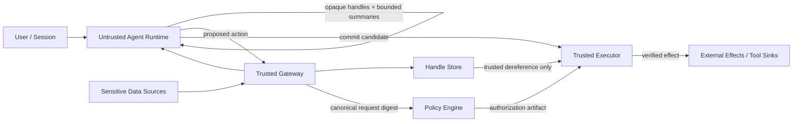

# SecureClaw：把工具型 Agent 的“能读什么”和“能做什么”拆成两道边界

## 元信息与 TL;DR

- 原文：Yuhan Ma, Stefan Schmid, [SecureClaw: Clawing Back Control of LLM Agents](https://arxiv.org/abs/2606.09549)
- 类型：论文，arXiv:2606.09549，cs.CR / cs.AI
- 提交时间：2026-06-08 14:29:01 UTC
- 本文主题：工具型大模型 Agent 的运行时安全、权限边界、明文泄露与外部动作授权
- 相关材料：
  - [AgentDojo](https://proceedings.neurips.cc/paper_files/paper/2024/hash/97091a5177d8dc64b1da8bf3e1f6fb54-Abstract-Datasets_and_Benchmarks_Track.html)：97 个真实任务、629 个安全测试案例，用于评测工具型 Agent 的 prompt injection 风险。
  - [AgentLeak](https://arxiv.org/abs/2602.11510)：把多 Agent 泄露拆到 C1 到 C7 多个通道，特别强调 inter-agent message 与 shared memory。
  - [Agent Security Bench](https://luckfort.github.io/ASBench/)：覆盖 10 个场景、400 多个工具、多类攻击与防御，用于 Agent 安全基准评测。

### TL;DR

- **这篇论文解决什么问题？**
  - 工具型 LLM Agent 的失败不只是“回答错了”，而是可能：
    1. 把邮件、支付、文件共享、工单更新等外部动作提交到错误对象；
    2. 在执行过程中读到隐私明文，再通过内部消息、共享记忆、日志或最终回答泄露。
- **作者的核心判断是什么？**
  - 只在 prompt、planner、tool argument 或最终输出上做过滤不够。
  - 安全边界必须拆成两道：
    1. **effect surface**：外部动作必须在真正触达 sink 前被授权；
    2. **plaintext surface**：敏感明文不能进入不可信 Agent runtime。
- **SecureClaw 怎么做？**
  - 读路径：trusted gateway 把敏感值存入 handle store，runtime 只拿到 opaque handle 和受限摘要。
  - 写路径：runtime 只能提出动作，trusted executor 通过 `PREVIEW -> COMMIT` 校验规范化请求、授权 artifact、新鲜度、重放状态和确认 token 后才提交。
- **实验数字是什么？**
  - AgentDojo：ASR 从 Plain 的 31.48% 降到 SecureClaw 的 0.64%。
  - AgentLeak attacked parity lane：Any leak 从 Plain 的 93.95% 降到 3.23%，C2 为 0.20%，C5 为 0.00%。
  - ASB：SecureClaw 达到 0.00% ASR，同时保留 88.90% utility。
  - bypass suite：29/29 结果符合预期，25 个攻击型 commit 被拒绝，4 个正控制被允许。
- **局限是什么？**
  - 它不保证 policy 允许区域内的语义一定正确。
  - 它依赖完整 sink mediation、正确敏感字段分类、可信 gateway / handle store / policy engine / executor。
  - 受限摘要仍是显式 declassification channel；摘要越有用，潜在区分信息越多。

## 研究问题：为什么“让模型更听话”不是 Agent 安全的主战场？

### 论文关心的不是普通聊天安全

- 传统 LLM 安全常把风险放在：
  - 最终输出是否有害；
  - 用户 prompt 是否越狱；
  - 模型是否遵守系统指令。
- 但工具型 Agent 多了两个结构性变化：
  - **它会读外部世界**：邮件、网页、issue、日历、票据、客户记录、代码仓库。
  - **它会改外部世界**：发送消息、分享文件、改数据库、创建支付、提交工单。

### 作者把风险重写成两个问题

| 问题 | 失败发生在哪里 | 传统防御为什么不够 |
|---|---|---|
| 外部动作授权 | effect sink，即真实 API 或工具提交点 | runtime 如果还能直接调用 sink，argument filter 可以被绕过或出现 TOCTOU |
| 明文驻留与泄露 | read boundary，即敏感数据第一次进入 runtime 的位置 | 明文一旦进入 runtime，后续输出过滤挡不住 C2、C5、日志、工具参数等内部通道 |

### 这个拆分为什么重要？

- AgentDojo 与 ASB 这类 benchmark 主要暴露“动作被劫持”的问题：
  - 攻击文本藏在工具返回的数据里；
  - agent 把攻击者指令误当任务指令；
  - 最终向错误收件人、错误工具或错误对象发起动作。
- AgentLeak 则补上另一半：
  - 泄露可能发生在最终回答之前；
  - 多 Agent 系统里的 inter-agent message、shared memory、tool I/O、log 都可能携带敏感信息。
- SecureClaw 的研究问题因此不是“能否检测 prompt injection”，而是：
  - **如果 runtime 已经被 prompt injection 或直接被攻陷，架构还能不能让它既拿不到明文，又提交不了未授权动作？**

## 论文主张与论证路线

### Claim -> Mechanism -> Evidence -> Boundary

| 层次 | 作者的论证内容 |
|---|---|
| Claim | 工具型 Agent 至少有 effect surface 与 plaintext surface 两个不可互相替代的安全面。 |
| Mechanism | effect surface 放到 executor-side `PREVIEW -> COMMIT`；plaintext surface 放到 gateway-side opaque handle confinement。 |
| Evidence | 三个 benchmark、机制消融、compromised-runtime bypass suite、recovery ablation、延迟测量。 |
| Boundary | 只保证请求绑定授权与 raw plaintext confinement，不保证 policy 允许动作一定符合用户真实意图。 |

### 论文的关键新意不在“又一个 guardrail”

- SecureClaw 不把 LLM runtime 当 reference monitor。
- 它把 runtime 降级成：
  - 可以规划；
  - 可以组合工具；
  - 可以搬运 symbolic reference；
  - 但不能直接 dereference secret；
  - 也不能直接 commit effect。
- 这更接近系统安全里的能力引用、最小权限、complete mediation，而不是 prompt engineering。

## 方法机制：两道边界分别管什么？

### 读路径：opaque handle confinement

- 当工具返回敏感内容时，trusted gateway 不把原始内容交给 runtime。
- 它做三件事：
  1. 把 protected plaintext 存到 handle store；
  2. 生成高熵 opaque handle；
  3. 在需要规划时返回有上限的 schema-aware summary。
- runtime 之后可以把 handle 放进 memory、传给其他 agent、带到后续工具调用里。
- 但 runtime 不能把 handle 解成明文；真正 dereference 只能在可信端点发生。

### handle 不是普通 hash

```text
hid = HMAC-SHA256(k_handle, nonce || session || object)
```

- 变量含义：
  - `k_handle`：gateway / store 持有的 secret key；
  - `nonce`：新鲜随机数，避免从值本身反推；
  - `session`：把 handle 绑定到交互上下文；
  - `object`：被保护对象或版本。
- 设计意义：
  - handle 是 capability-like symbolic reference；
  - 它不是敏感值的裸 hash；
  - 它可以被 runtime 搬运，但不能被 runtime 解析。

### 摘要是显式 declassification，不是假装安全

- 论文没有声称 bounded summary 不泄露信息。
- 相反，作者把摘要定义为显式 declassification interface：
  - 摘要允许模型做任务规划；
  - 摘要也可能携带内容相关信息；
  - 因此必须被测量、限长、限项、审计。
- 这点很关键，因为很多 Agent 系统会把“摘要”当作安全处理后的自然语言上下文。
- SecureClaw 的说法更严格：
  - 摘要不是零泄露；
  - 摘要只是被明确批准的、可计量的泄露平面。

### 写路径：PREVIEW -> COMMIT execution boundary

- runtime 不能直接调用 effectful sink。
- 它只能提交一个候选动作：
  - `intent`
  - runtime-visible `inputs`
- gateway 或部署上下文补齐认证字段：
  - caller；
  - session；
  - sink context；
  - recipient / channel / object id；
  - policy version；
  - confirmation class；
  - mutable object version。

```text
rho = (intent, caller, session, inputs, ctx)
h = HMAC-SHA256(k_bind, Canon(rho))
```

- `Canon(rho)` 是确定性序列化。
- `h` 把授权决定绑定到这一个规范化请求。
- executor commit 前重新计算 `h`，检查：
  - 授权 artifact；
  - freshness；
  - replay state；
  - confirmation token；
  - handle resolution restriction。

### 协议伪代码

```text
Input:
  Runtime proposal: (intent, inputs)
  Authenticated context: caller, session, ctx
  Policy engine, trusted executor, handle store

State:
  replay table
  handle metadata
  policy/schema version
  confirmation state

Loop:
  1. Gateway constructs rho = (intent, caller, session, inputs, ctx)
  2. Gateway computes h = HMAC-SHA256(k_bind, Canon(rho))
  3. Policy engine returns an artifact bound to h
  4. Executor recomputes h from the commit request
  5. Executor checks artifact, freshness, replay, confirmation, handle scope

If all checks pass:
  Output: commit exact external effect

Else:
  Output: fail closed + deny-aware recovery hint

Failure boundary:
  If sink is unmediated, or ctx omits a sink-relevant field, request binding no longer proves the realized effect is authorized.
```

## 架构图：不可信 runtime 被夹在读边界和写边界之间



- 图中最重要的不是组件数量，而是权力分布：
  - runtime 不拥有 raw protected value；
  - runtime 不拥有 commit path；
  - gateway 与 executor 是两个不同安全控制点；
  - policy 的授权对象是 canonical request，而不是自然语言意图。

## 实验设置：作者怎样证明两道边界不可互相替代？

### 原文论证逐段展开

- 引言段先把 Agent 从“聊天系统”移动到“工作流执行系统”：
  - 邮件、票据、日历、仓库和客户记录都不是普通上下文；
  - 它们同时可能包含攻击者写入的指令和用户希望保护的数据；
  - 因此一次失败可能同时表现为错误动作和隐私泄露。
- 第二步，作者把已有研究分成两条证据链：
  - AgentDojo / ASB 说明 prompt injection 能劫持工具动作；
  - AgentLeak 说明多 Agent 的内部通信会绕过最终输出审计。
- 第三步，作者提出“不可替代性”：
  - 如果只保护 action sink，runtime 仍可能已经读到明文；
  - 如果只保护 runtime 内部信息流，runtime 仍可能提交未授权外部动作；
  - 所以架构必须把读边界和写边界分开。
- 第四步，作者用运行例子统一解释：
  - invoice 原文不进入 runtime；
  - runtime 只看到“供应商、金额、到期日”这类受限摘要；
  - 如果 invoice 文本诱导发送到攻击者邮箱，executor 仍会按 recipient、channel、session、policy version 重新绑定请求。
- 第五步，实验不只跑 prompt injection：
  - 主 benchmark 测行为攻击；
  - ablation 测哪个机制带来哪种收益；
  - bypass suite 假设 runtime 已恶意，直接篡改授权材料和请求字段；
  - 形式化附录再写清哪些前提一旦失效，证明随之失效。

### detail inventory

| 维度 | 论文中可提取的具体内容 |
|---|---|
| 方法名 | SecureClaw；opaque-handle confinement；PREVIEW -> COMMIT；deny-aware recovery |
| 输入 | runtime proposal、caller、session、tool inputs、sink context、policy/schema version、confirmation class |
| 状态 | handle store、replay table、authorization artifact、object version、policy version |
| 输出 | authorized external effect、structured denial、safe continuation hint、bounded summary |
| 关键变量 | `hid`、`rho`、`ctx`、`Canon(rho)`、`h`、`k_handle`、`k_bind`、`Delta(D(v0),D(v1))` |
| Benchmark | AgentDojo、AgentLeak、Agent Security Bench |
| Baseline | Plain、IPIGuard、DRIFT、Faramesh |
| 主指标 | ASR、utility、benign success、Any leak、C1/C2/C5 leak、bypass accept/deny |
| 消融项 | Full、-Boundary、-Handles、-Both、recovery on/off |
| 失败案例 | wrong principal、wrong object/workspace scope、C1 authorized output pressure、isolated C2 residual |
| 部署前提 | complete mediation、protected-field classification、semantic canonicalization、freshness、crash-safe replay |

### 为什么 bounded summary 是论文里最容易被误读的设计？

- 很多系统会把“摘要”当作安全层：
  - 先读完整文档；
  - 让模型总结；
  - 再把摘要交给执行 Agent。
- SecureClaw 没有这么乐观：
  - 摘要由可信组件生成；
  - 摘要有 item cap 和 character cap；
  - 摘要被明确定义为 declassification；
  - 摘要的区分能力还要用 `Delta` 测量。
- 这个处理方式更接近信息流安全：
  - 不是说“模型看不见原文就安全”；
  - 而是说“模型只看见被授权释放的那部分信号”。
- 论文给出的平均 `Delta = 0.287` 有两层含义：
  - 在 122 对测量输入上，很多摘要不会因为单个敏感位置变化而改变；
  - 但 worst-case 仍可达到 1.000，说明某些摘要类别可以完全区分 secret。
- 因此，部署者不能把摘要当作固定安全等级：
  - 对金额、收件人、主体、正文片段要分别建模；
  - 对不同 workflow phase 要限制不同字段；
  - 对多次 read 要累积计算暴露预算。

### 为什么 request binding 不是普通审批？

- 普通审批常见流程是：
  - runtime 生成动作；
  - 系统检查动作类型；
  - 用户或 policy 说允许；
  - runtime 再执行工具调用。
- 这里存在一个时间差：
  - 检查时的请求和执行时的请求可能不完全相同；
  - runtime 可以改 recipient、channel、object id；
  - mutable object 也可能在 preview 后变化。
- SecureClaw 的 `Canon(rho)` 试图把这些 sink-relevant fields 全部纳入绑定：
  - recipient 变了，digest 变；
  - channel 变了，digest 变；
  - session 变了，digest 变；
  - object version 变了，digest 变。
- executor 只接受“被预览和授权过的 exact canonical request”。
- 所以它不是“批准某类动作”，而是“批准这一次、这个主体、这个上下文、这个对象版本、这个外部效果”。

### 作者没有回避的工程难题

- sink inventory：
  - 哪些工具是 effectful；
  - 哪些零参数工具仍会产生外部动作；
  - 哪些日志、通知、共享链接也算 sink。
- protected-field classification：
  - 邮件正文、附件、票据字段、客户记录、访问 token 需要不同处理；
  - 分类漏掉一个字段，runtime 就可能重新拿到明文。
- canonicalization completeness：
  - 规范化必须覆盖所有会改变真实外部效果的字段；
  - 如果某个隐含默认值没有进入 `ctx`，digest 绑定就可能只保护了表面参数。
- recovery templates：
  - denial 不能泄露被保护内容；
  - 但又要给 runtime 足够信息继续任务；
  - 这需要把“安全下一步”也设计成协议，而不是自由文本。

### 三个主 benchmark 的角色

| Benchmark | 主要测什么 | SecureClaw 在这里验证什么 |
|---|---|---|
| AgentDojo | 工具型 Agent 的 prompt injection 和任务执行 | 未授权外部动作是否被拦住，同时保留任务 utility |
| AgentLeak | 多 Agent 系统的 C1/C2/C5 等泄露通道 | 明文是否从内部消息和共享记忆里消失 |
| ASB | 多场景 Agent 攻击与防御 | effect-side attack 是否被 executor boundary 归零 |

### baseline 为什么选这些？

- `Plain`：无防御。
- `IPIGuard`：偏工具依赖图和 indirect prompt injection 防御。
- `DRIFT`：偏动态规则与注入隔离。
- `Faramesh`：更接近 execution control plane，能代表 action boundary 类方法。

### 评测条件

- 主表使用 `gpt-4o-mini-2024-07-18`，temperature 0。
- AgentDojo：629 个 attacked rows，97 个 benign rows。
- AgentLeak：parity lane 有 496 个 attacked scenarios 和 500 个 benign scenarios。
- ASB：5 类 direct prompt injection styles，每类 400 行，总计 2000 行。
- SecureClaw 的 mediated outputs 在评分前做 alias resolution 和必要 confirmation handling。

## 主结果：SecureClaw 的数字到底说明什么？

### Table 2 的核心结果

| System | AgentDojo ASR ↓ | AgentLeak Any leak ↓ | AgentLeak C2 ↓ | AgentLeak C5 ↓ | ASB ASR ↓ | ASB Utility ↑ |
|---|---:|---:|---:|---:|---:|---:|
| Plain | 31.48% | 93.95% | 92.74% | 51.61% | 91.65% | 0.85% |
| IPIGuard | 15.26% | 78.63% | 50.00% | 57.06% | 99.60% | 22.05% |
| DRIFT | 2.38% | 72.18% | 47.98% | 53.63% | 87.75% | 0.45% |
| Faramesh | 22.89% | 93.95% | 92.74% | 51.61% | 0.00% | 3.70% |
| SecureClaw | 0.64% | 3.23% | 0.20% | 0.00% | 0.00% | 88.90% |

### 这张表最值得读的不是单个第一名

- Faramesh 在 ASB 上也达到 0.00% ASR。
- 但它在 AgentLeak 的 C2 / C5 与 Plain 一样高。
- 这正好支持作者的中心论点：
  - action boundary 可以挡未授权 commit；
  - 但如果明文已经在 runtime，内部消息和 memory 仍然能泄露。
- SecureClaw 同时做两件事：
  - executor boundary 管 effect；
  - handle confinement 管 plaintext。

### exact counts 提供了更强证据

| 指标 | SecureClaw | Comparator | Fisher p |
|---|---:|---:|---:|
| AgentDojo ASR | 4/629 = 0.64% | DRIFT 15/629 = 2.38% | 1.83e-2 |
| AgentLeak Any leak | 16/496 = 3.23% | DRIFT 358/496 = 72.18% | 1.27e-128 |
| ASB ASR | 0/2000 = 0.00% | DRIFT 1755/2000 = 87.75% | <1e-700 |
| ASB Utility | 1778/2000 = 88.90% | Faramesh 74/2000 = 3.70% | <1e-700 |

- 这组 exact counts 说明：
  - AgentDojo 的改进不是只靠百分比好看；
  - AgentLeak 的内部泄露下降幅度极大；
  - ASB 的 0 ASR 不是小样本偶然；
  - utility 不是靠拒绝所有任务换来的。

## 消融：哪一个机制负责哪一种安全收益？

### AgentLeak matched slice 消融

| Config | Boundary | Handles | C2 Leak | C5 Leak |
|---|---|---|---:|---:|
| Full | yes | yes | 0.0% | 0.0% |
| -Boundary | no | yes | 0.0% | 0.0% |
| -Handles | yes | no | 20.8% | 8.3% |
| -Both | no | no | 25.0% | 4.2% |

### 这组消融的逻辑

- 去掉 write boundary，但保留 handles：
  - C2 / C5 仍然为 0；
  - 说明内部泄露下降不是 executor 偶然挡住的。
- 保留 boundary，但去掉 handles：
  - C2 与 C5 重新出现；
  - 说明明文驻留问题必须在 read boundary 解决。
- 反过来，handles 不会自然阻止 effectful sink：
  - 如果 runtime 还能直接 commit，或者 executor 没有请求绑定，外部动作仍然危险。

### 论文的“不可替代性”在这里成立

- 一道边界不是另一道边界的加强版。
- 它们保护的失败时间点不同：
  - plaintext surface 失败在第一次敏感值进入 runtime；
  - effect surface 失败在请求触达外部 sink。
- 因此，架构上要把这两件事放到两个不同可信组件上。

## bypass suite：如果 runtime 已经是恶意的，还能挡住什么？

### 攻击类别

- authorization artifact tampering：
  - MAC bit flip；
  - wrong share version；
  - cross-commit mixup。
- binding violation：
  - request hash mismatch；
  - recipient tampering；
  - channel tampering；
  - domain tampering；
  - action id mismatch。
- session / caller attack：
  - session mismatch；
  - caller mismatch；
  - cross-session replay。
- temporal attack：
  - expired authorization；
  - future timestamp；
  - replay consumed action id。
- confirmation attack：
  - missing confirmation；
  - confirmation-gated path with valid confirmation。

### 结果

| Suite | 攻击型案例 | 正控制 | 结果 |
|---|---:|---:|---|
| Commit-path bypass suite | 25 | 4 | 25 个攻击全部 DENY，4 个合法控制全部 ALLOW |
| Payment case study | 4 个未授权变体 | 1 个合法支付 | amount、recipient、forged auth、replay 都被挡住 |

### 这部分支撑的是 Theorem 1

- 如果 attacker 改了 recipient：
  - `Canon(rho)` 改变；
  - `h` 改变；
  - 原授权 artifact 不再匹配；
  - executor fail closed。
- 如果 attacker 重放旧授权：
  - replay check-and-mark 必须是 atomic 且 crash-safe；
  - 否则 Theorem 1 的部署前提不成立。

## deny-aware recovery：为什么 0 ASR 没有把 utility 一起杀死？

### 拒绝不是终止

- executor 拒绝 commit 后，返回固定模板的结构化 denial。
- denial 只能包含：
  - coarse action class；
  - reason code；
  - safe next-step hints。
- denial 不包含 dereferenced protected content。

### recovery ablation

| Benchmark | Recovery | n | ASR | Utility | Refusals / Extra turns |
|---|---|---:|---:|---:|---:|
| ASB | on | 50 | 0.0% | 86.0% | 8.0% refusals |
| ASB | off | 50 | 0.0% | 70.0% | 30.0% refusals |
| AgentLeak-style | on | 30 | 0.0% | 66.7% | 1.33 turns/task |
| AgentLeak-style | off | 30 | 0.0% | 40.0% | 1.00 turns/task |

### 这说明什么？

- SecureClaw 的 utility 不是靠放松 commit invariant 换来的。
- 它靠的是：
  - 攻击动作被挡住；
  - workflow 得到安全替代路径；
  - 例如从“发送”退到“草稿等待确认”。
- 对真实 Agent 系统来说，这一点比单纯拒绝更重要：
  - 用户需要任务继续推进；
  - 安全系统不能只会说不。

## 形式化边界：论文证明了什么，没有证明什么？

### Theorem 1：request-bound authorization integrity

```text
Pr[A wins] <= Adv_EUF-CMA_MAC(B) + epsilon_bind(q_bind)
```

- 直观含义：
  - 只要 MAC 不可伪造；
  - request-binding digest 碰撞概率可忽略；
  - canonicalization 覆盖所有 sink-relevant fields；
  - executor 完整中介所有 effectful sinks；
  - 那么 adversarial runtime 不能让未授权的不同请求通过 commit。
- 它不证明：
  - policy 本身一定正确；
  - 用户真实意图一定被表达；
  - 未列入 `ctx` 的语义字段也被保护。

### Theorem 2：handle-only confinement

```text
Adv <= min(1, q_h * N_live / 2^kappa) + epsilon_hid
```

- 直观含义：
  - 如果 runtime 只得到 handle 和非敏感元数据；
  - handle 至少 128 bit，且不可预测；
  - 未授权 dereference 只返回 generic denial；
  - 那么 runtime 猜中有效 handle 的概率可忽略。
- 它证明的是 raw plaintext confinement。
- 它不说明摘要泄露，因为 handle-only 是参考情形。

### Theorem 3：bounded summary 的暴露量

```text
Adv_sm,D <= min(1, sum_i Delta(D(v0_i), D(v1_i)))
            + 2 * (min(1, q_h * N_live / 2^kappa) + epsilon_hid)
```

- `D(v)` 是摘要接口。
- `Delta` 是两个摘要输出分布的 total variation distance。
- 如果摘要是常量，`Delta = 0`，接近 handle-only。
- 如果摘要等于原文，`Delta = 1`，保密性项退化。
- 实际系统介于两者之间。

### 摘要接口的测量很诚实

- 部署中的 deterministic summary core：
  - item cap `M = 8`；
  - character cap `C = 512`。
- 作者在 122 对输入、19 类 secret-location 上测量。
- 总体平均 `Delta = 0.287`。
- 最坏类别达到 `1.000`。

### 这给研究者的提醒

- “摘要后再给模型”不是安全证明。
- 摘要必须被当作一个可量化泄露源。
- 如果任务需要更强 confidentiality：
  - 缩小 summary；
  - 符号化 identifier；
  - 分阶段 declassification；
  - 对每个 read event 记账。

## 残差失败：SecureClaw 没解决的地方在哪里？

### 残差分类

| 来源 | 数量 | 类型 | 含义 |
|---|---:|---|---|
| AgentDojo | 3/629 | foreign-principal / missing contextual bind | 动作类型允许，但目标 principal 被攻击者选中 |
| AgentDojo | 1/629 | broader-scope workspace action | workspace 动作本身允许，但对象或范围不对 |
| AgentLeak | 16/496 | authorized-output-dominant residual | 15 个 C1，1 个 C2，没有 C5 系统性回流 |

### 为什么这不是小问题？

- effect boundary 只能证明“提交的是被授权的 canonical request”。
- 如果 policy 太粗：
  - 它可能允许同类动作；
  - 但没有绑定正确 principal；
  - 或没有绑定正确 object version；
  - 或没有区分 workflow phase。
- 这类失败不再是 runtime bypass，而是 policy expressiveness 问题。

### 真正的边界条件

- SecureClaw 依赖：
  - effectful sink 完整盘点；
  - sensitive read 完整中介；
  - protected-field classification 正确；
  - canonicalization 语义完整；
  - replay protection crash-safe；
  - gateway / policy / executor 不被攻陷。
- 如果这些前提不成立，安全结论会降级。

## 延迟与部署成本

| 配置 | 平均延迟 | p50 | p95 |
|---|---:|---:|---:|
| Executor only | 0.22 ms | 0.09 ms | 0.55 ms |
| Single policy service + executor | 15.4 ms | 12.8 ms | 32.2 ms |
| Distributed policy engine + executor | 148.6 ms | 159.7 ms | 166.6 ms |

- 相比 500 到 2000 ms 级别的 LLM inference，executor 本身不是瓶颈。
- 真正的部署挑战不在毫秒级校验，而在：
  - sink inventory；
  - schema 审计；
  - policy 维护；
  - handle 生命周期；
  - declassification budget；
  - 用户确认体验。

## Figure / Table 证据解读

### 如何复核这篇论文的证据链？

- 先看摘要和 Table 2：
  - 它给出跨 benchmark 的总图；
  - 但不要只看百分比；
  - 继续核对 Appendix A.1 的 exact counts 和 confidence intervals。
- 再看 Table 3 / Table 14：
  - 它们回答“到底是哪一个机制有效”；
  - 如果去掉 handles 后 C2 / C5 回来，说明 read boundary 是明文泄露的关键；
  - 如果只保留 handles 不能证明 effect safety，就要看 bypass suite。
- 接着看 Table 17 / Table 18：
  - 它们不依赖模型是否被 prompt injection 诱导；
  - 而是假设 runtime 直接作恶；
  - 这比普通 benchmark 更贴近系统安全证明。
- 最后看 Appendix B：
  - Theorem 1 对应 commit path；
  - Theorem 2 对应 handle-only reference；
  - Theorem 3 对应 bounded summary 暴露量；
  - Table 23 对应 trusted component compromise 后保证如何降级。

### 这篇论文最强的证据是什么？

- 最强证据不是“某个 benchmark 第一”。
- 最强证据是四块证据互相咬合：
  1. 主表显示跨 effect 与 plaintext 两类问题同时下降；
  2. 消融显示 handles 与 boundary 分别负责不同收益；
  3. bypass suite 显示恶意 runtime 不能绕过 request binding；
  4. 形式化附录说明证明只覆盖明确前提，不把 policy 语义正确性偷偷塞进结论。
- 这种写法比很多 Agent 安全论文更清楚：
  - 它没有把 prompt injection 分类器当成根防线；
  - 它没有把最终输出过滤当成隐私审计；
  - 它把 runtime 明确视作不可信对象。

### 这篇论文最弱的证据是什么？

- 弱点一：policy richness 仍然靠部署者。
  - 论文发现 4 个 AgentDojo 残差都在 policy-allowed region；
  - 这说明 executor 再严格，也不能弥补 policy 没绑定正确 principal / object / phase。
- 弱点二：summary 的测量是局部校准。
  - 122 对输入和 19 类 secret-location 有价值；
  - 但它不是任意生产数据的 worst-case 上界；
  - 真实系统里的摘要模板、字段顺序、语言、格式都可能改变 `Delta`。
- 弱点三：benchmark 与真实集成仍有距离。
  - benchmark 可以做 auto-confirmation；
  - 真实用户确认有延迟、疲劳、误点和上下文不足；
  - denial-aware recovery 在真实 UI 中还需要更细的交互设计。
- 弱点四：可信组件本身需要高保障工程。
  - gateway、handle store、policy service、executor 都成为高价值目标；
  - 论文说清了 compromise degradation，但没有给出完整运维方案。

### 如果把它放到更宽的 Agent 研究脉络中

- Agent 评测正在从“模型会不会规划”转向“系统会不会失控”。
- 早期 benchmark 更关心：
  - 任务成功率；
  - 工具调用正确率；
  - 推理链质量。
- 现在的安全 benchmark 开始关心：
  - 攻击文本能否跨工具传播；
  - 内部消息是否泄露；
  - memory 是否成为隐形旁路；
  - executor 是否真的不可绕过。
- SecureClaw 的贡献在于把这些问题重新写成系统边界问题：
  - 哪些组件可信；
  - 哪些数据可以进入 runtime；
  - 哪些动作必须在 sink 前重新绑定；
  - 哪些泄露是明确 declassification，哪些是 accidental leak。

### 对后续论文的具体追问

- 能不能把 policy synthesis 和 request binding 结合？
  - 现在 SecureClaw 依赖人工或外部 policy；
  - 未来可能需要从 workflow spec 自动生成 principal / object / phase binding。
- 能不能把 declassification budget 做成 benchmark 指标？
  - 现在 utility 与 leak rate 分开报；
  - 更理想的指标应同时衡量“完成任务需要释放多少信息”。
- 能不能在多 Agent 编排里做端到端 provenance？
  - handles 解决 protected plaintext；
  - 但 artifact、memory entry、intermediate file 还需要 lineage tagging。
- 能不能验证更复杂的 mutable object？
  - 论文已经要求 object version 进入 `ctx`；
  - 真实代码仓库、数据库行、共享文档可能有并发修改和 partial update。
- 能不能把 user confirmation 从 benchmark accommodation 变成真实交互实验？
  - 安全确认如果过多，会变成疲劳；
  - 如果过少，又会把风险塞给默认 policy。

### Figure 1：架构对照的意义

- unprotected agent architecture：
  - runtime 直接读 sensitive data；
  - runtime 直接调用 effectful API；
  - 攻击一旦进入 runtime，读写两面都失守。
- SecureClaw architecture：
  - read boundary 前置到 gateway；
  - effect sink 前置到 executor；
  - runtime 只处于 symbolic planning 位置。

### Table 1：两个 surface 的控制点

- effect surface：
  - 控制点是 executor-side request binding、freshness、replay protection。
  - 主证据来自 AgentDojo、ASB、bypass suite。
- plaintext surface：
  - 控制点是 gateway-side handles、sink-scoped dereference、bounded summaries。
  - 主证据来自 AgentLeak 与 ablation。

### Table 2：为什么必须看跨 benchmark

- 如果只看 ASB，Faramesh 已经很好。
- 如果只看 AgentLeak，可能会忽略 external effect。
- SecureClaw 的强处是跨两个问题同时成立：
  - action attack 被压住；
  - internal relay 被压住；
  - utility 仍保留。

### Table 21：摘要接口的边界

- 最容易泄露的类别：
  - free-text body within 512 chars；
  - subject line within preview cap；
  - list items within cap；
  - plaintext counterparty name。
- 最不容易泄露的类别：
  - beyond-window body；
  - beyond-index list / dict keys；
  - stripped prompt-injection payload。
- 这说明 summary cap 有实际作用，但不能替代数据最小化。

## 相关工作位置：它和 AgentDojo / AgentLeak / Faramesh 的关系

### AgentDojo

- AgentDojo 强调工具返回的不可信数据可以劫持后续工具调用。
- 它的价值在于真实工作流任务：
  - banking；
  - slack；
  - travel；
  - workspace。
- SecureClaw 用 AgentDojo 证明：
  - 即使 prompt injection 进入上下文，外部动作仍需经过 executor authorization。

### AgentLeak

- AgentLeak 的关键贡献是把泄露通道拆开。
- C1 是最终回答。
- C2 是 inter-agent messages。
- C5 是 shared / persistent memory。
- SecureClaw 用 AgentLeak 证明：
  - output-only audit 不够；
  - handle confinement 能把 C2 / C5 从明文通道变成 symbolic-reference 通道。

### ASB

- ASB 的优势是场景广、工具多、攻击/防御类型多。
- SecureClaw 在 ASB 上 0% ASR 与 88.90% utility 说明：
  - action sink enforcement 可以强；
  - 但必须配 recovery，否则工具型任务会变成拒绝机器。

### Faramesh

- Faramesh 代表 action authorization boundary 类工作。
- 它与 SecureClaw 接近，但差异在：
  - Faramesh 更偏 execution control plane；
  - SecureClaw 进一步把 plaintext residency 拎出来单独做 read boundary。
- 论文中 Faramesh 的 ASB 表现说明 action boundary 有效。
- 但 AgentLeak 表现说明 action boundary 不会自动解决内部明文泄露。

## 结论与局限

### 最值得带走的判断

- 工具型 Agent 安全不能只问：
  - “模型是否被注入？”
  - “输出是否安全？”
  - “工具参数是否看起来合理？”
- 更应该问：
  1. raw sensitive value 是否曾经进入不可信 runtime；
  2. external effect 是否只能由可信 executor 提交；
  3. policy artifact 是否绑定到 exact canonical request；
  4. denial 后是否有安全 continuation，而不是简单中止。

### 论文局限

- 语义正确性仍是开放问题：
  - policy 允许的动作可能还是错对象；
  - principal / object / phase binding 不足会留下残差。
- 摘要接口是泄露平面：
  - 平均 `Delta = 0.287` 不是 worst-case guarantee；
  - 最坏类别可达 `1.000`。
- 可信组件被攻陷时保证会降级：
  - gateway 被攻陷，read confidentiality 失败；
  - executor 被攻陷，effect authorization 失败；
  - policy engine 被攻陷，错误授权可能通过；
  - handle store 被攻陷，protected plaintext 直接暴露。

### 对 Agent 安全研究的延伸问题

- **第一，policy language 会成为 Agent 安全的核心基础设施。**
  - 如果 policy 只能表达 action type，它挡不住 wrong-principal / wrong-object。
  - 未来需要更接近 Zanzibar 式的 principal-object-relation binding。
- **第二，declassification budget 需要进入 benchmark。**
  - AgentLeak 让我们看到内部通道。
  - SecureClaw 进一步提示：摘要本身也要被算作有预算的泄露事件。
- **第三，Agent runtime 的角色会继续被降权。**
  - 高风险系统里，runtime 应该更像 planner；
  - 可信执行、可信读写、可信审计要在模型外部。
- **第四，安全可用性不该只用 refusal rate 衡量。**
  - deny-aware recovery 说明：安全系统要能把危险动作转成安全草稿、确认流或替代计划。
  - 这比“拦截成功”更接近真实部署中的用户体验。
