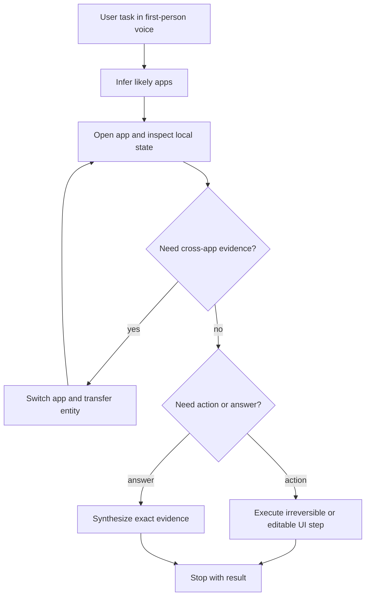
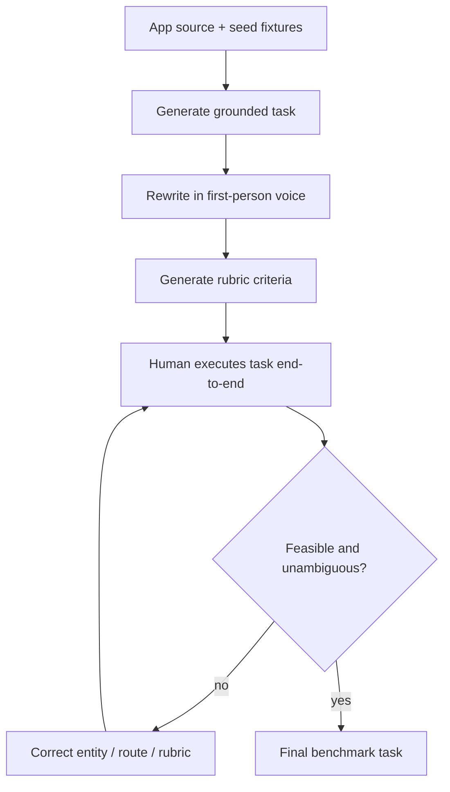
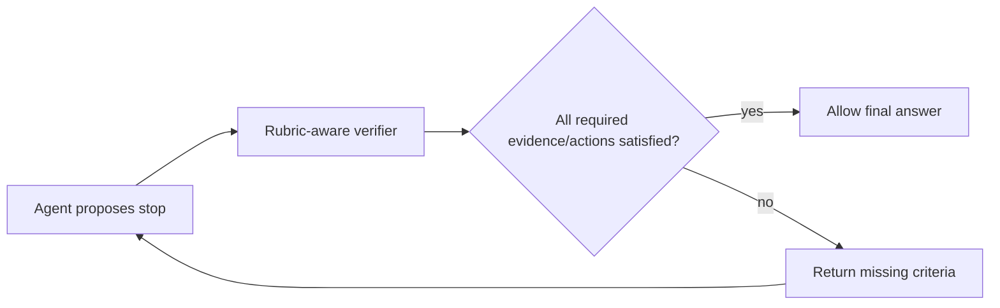

# iOSWorld：个人化手机 Agent 的难点，不在点按钮，而在读懂同一个人的 26 个 App

### 元信息

| 字段 | 内容 |
| --- | --- |
| 论文 | iOSWorld: A Benchmark for Personally Intelligent Phone Agents |
| 类型 | 论文 / Benchmark / Computer-use Agent / iOS Simulator |
| 方向 | 大模型 Agent、手机 Agent、个人化记忆、跨 App 任务评测 |
| 作者 | Lawrence Keunho Jang, Mareks Woodside, Geronimo Carom, Andrew Keunwoo Jang, Jing Yu Koh, Ruslan Salakhutdinov |
| 原始链接 | [https://arxiv.org/abs/2606.09764](https://arxiv.org/abs/2606.09764) |
| 代码与数据 | [https://github.com/ljang0/iOSWorld](https://github.com/ljang0/iOSWorld) |
| 项目页 | [https://iosworld.io](https://iosworld.io) |
| 日期证据 | arXiv v1 提交于 2026-06-08 17:27:13 UTC |
| 相关背景 | AndroidWorld、MobileWorld、OSWorld、macOSWorld、AppWorld、GUI Odyssey、Qwen mobile-use cookbook |

### TL;DR

- **这篇论文做什么**：iOSWorld 把手机 Agent 评测从“在干净沙箱里按指令点按钮”推进到“围绕同一个虚构用户 Jordan Avery，在 26 个原生 iOS App 中读取交易、消息、旅行、饮食、运动、文档和社交关系，再完成跨 App 或个人化任务”。
- **为什么重要**：真实手机不是空白网页。用户身份、历史订单、邮件回执、银行流水、群聊和偏好分散在多个 App 中；如果 Agent 只会识别按钮，却不能把这些状态合成用户语境，就还没有证明“个人智能”。
- **怎么做**：作者构建 26 个 SwiftUI App，注入同一个 persona 的互相关联数据，设计 133 个任务：27 个单 App、60 个跨 2 到 8 个 App、46 个记忆与个性化任务。评测同时比较 vision-only 和 privileged vision+XML 两种观测。
- **实验/证据**：最佳设置是 Claude Opus 4.6 + vision+XML，总体 pass rate 为 51.9%；单 App 可到 81.5%，但多 App 只有 36.7%，记忆任务 54.3%。Sonnet 4.6 + XML 的单 App 达 92.6%，但跨 App 仍只有 35.0%。
- **关键数字**：XML 对强模型帮助很大：Opus 总体从 26.3% 升到 51.9%，Sonnet 从 28.6% 升到 46.6%，GPT-5.4 从 20.3% 升到 39.8%。但 GPT-5.4 Mini 从 26.3% 降到 15.8%，Qwen3.5 从 12.8% 降到 10.5%，说明更多 UI 文本不等于更好推理。
- **评测可靠性**：每个任务有 rubric，轨迹级 GPT-5.4 Mini judge 与人工在 128 条 Opus 轨迹上达到 task-level Cohen's kappa = 0.77、准确率 89%。这不是完美标注，但足以支撑论文主结论。
- **局限**：iOSWorld 只含一个虚构 persona；vision+XML 依赖 XCUITest，是开发者权限下的上界，不代表消费级部署；LLM judge 仍可能错判语义性回答；生态需要 macOS、Xcode 和 iOS Simulator。
- **最值得带走的判断**：<u>手机 Agent 的核心难题不是“能否点击正确坐标”，而是能否在长步骤、跨 App、带私人历史的部分可观测环境里维持用户模型、行动预算和证据链。</u>

### 研究问题：什么叫 personally intelligent phone agent？

- 论文把“个人智能”定义成一个更具体的能力集合：
  - 能识别同一个用户在不同 App 里的身份线索；
  - 能把邮件、支付、聊天、旅行和文档中的实体对齐；
  - 能从历史行为里推断偏好或规律；
  - 能在没有直接提示“去哪个 App 查”的情况下选择证据来源；
  - 能把最终动作或回答绑定到用户真正关心的任务。
- 这个定义刻意区别于两类已有 benchmark：
  - **Web/desktop benchmark**：强调开放网页、桌面软件、文件系统或企业工具；
  - **Android mobile benchmark**：强调动态手机环境和真实控件，但通常不构造长期身份和跨 App 个人历史。
- iOSWorld 的主张可以写成一个简单式子：

```text
Phone-Agent Capability
  = UI grounding
  + long-horizon planning
  + cross-app state transfer
  + personal-memory inference
  + safe action completion
```

- 其中 `UI grounding` 只是第一层。
- 也就是说，视觉能力只是入口，不是完整答案。
- 论文的难点放在后三层：
  - **state transfer**：Chipotle 订单、MyBank 扣款、Mail 回执、Notes 记录必须能串起来；
  - **memory inference**：常去路线、常点餐厅、跑步时间不是现成字段；
  - **action completion**：Agent 不能只“找到信息”，还要发消息、下单、预约、写文档或确认闹钟。

### Benchmark 设计：26 个 App 为什么不是装饰？

作者没有直接把真实 App 放进模拟器，而是构建一套原生 iOS App。

| 设计选择 | 论文里的做法 | 它在论证中的作用 |
| --- | --- | --- |
| 用户身份 | Jordan Avery，一个旧金山职业人士，住址、工作、运动目标固定 | 让跨 App 数据能以同一人视角关联 |
| App 数量 | 26 个 SwiftUI App，覆盖金融、消息、旅行、外卖、购物、生产力、娱乐、运动等 | 避免任务只是单一工具调用，迫使 Agent 做源选择 |
| 数据关系 | 订单会对应银行扣款和邮件回执，航班会对应酒店和提醒 | 测试实体对齐，而不是孤立页面导航 |
| 任务集合 | 133 个任务，按 single / multi / memory 分层 | 把难度从点击、跨 App，到个人规律推断逐级拉高 |
| 评测方式 | 每个任务配 rubric，轨迹级 LLM judge 判断 pass/fail | 允许评估部分进度，同时保留二元 pass rate |
| 开源内容 | Apps、seed data、tasks、rubrics、evaluation code、AWS runner | 让其他研究者能复现或扩展 persona |

### 任务层级：从“打开一个 App”到“理解我这个人”

| 类别 | 数量 | 典型任务 | 需要的能力 |
| --- | ---: | --- | --- |
| Single-app | 27 | 在 DineSpot 搜索带户外座位的餐厅并预约 | 控件识别、表单填写、单 App 状态维护 |
| Multi-app | 60 | 查 QuickBite 最近 Chipotle 订单，再到 MyBank 找扣款、Mail 找回执，并把差异写进 Notes | App 切换、信息搬运、实体匹配、长步骤预算 |
| Memory / personalization | 46 | 从 CityRide saved locations 推断最常见路线并叫车 | 模式发现、偏好推断、隐含目标解释 |

- 这个层级设计让论文能回答三个不同问题：
  - 模型是否能使用 iOS UI？
  - 模型是否能在多个 App 间保持任务状态？
  - 模型是否能从用户历史中抽取未明说的模式？
- 论文最有价值的地方在第三问。
- 很多 Agent benchmark 只要求“按自然语言目标行动”。
- iOSWorld 要求 Agent 先把自然语言目标转成“应该查哪些个人数据源”。

### 环境形式化：为什么作者把它写成 POMDP？

论文把环境写成：

```text
E = (S, A, Omega, T)
```

变量含义：

| 符号 | 含义 | 在 iOSWorld 中的对应 |
| --- | --- | --- |
| `S` | simulator states | 26 个 App、seed data、当前屏幕、输入框状态 |
| `A` | action space | tap、type、swipe、home、wait、stop，以及 XML 模式下的 launch_app / tap by identifier |
| `Omega` | observation space | screenshot，或 screenshot + XCUITest accessibility XML |
| `T` | deterministic transition | Appium + XCUITest 驱动模拟器后产生的新状态 |

- POMDP 视角很重要，因为 Agent 永远只看到当前屏幕。
- 它不知道：
  - Mail 里是否有某张回执；
  - MyBank 中某笔交易是否对应外卖订单；
  - CloudDocs 里是否已有预算表；
  - QuickChat 群里是否出现过同一个实体。
- 因此，正确策略不是“直接回答”，而是一个信息收集过程：



### 观测设置：vision-only 与 vision+XML 不是同一个能力问题

- **vision-only**：
  - Agent 只看 screenshot；
  - 需要自己估计点击坐标；
  - 需要视觉识别图标、控件、列表项和文字；
  - 更接近一个部署在消费级手机上的视觉 Agent。
- **vision+XML**：
  - Agent 同时拿到 XCUITest accessibility tree；
  - interactive element 有类型、label、value、identifier、坐标；
  - 还能用 `launch_app` 打开 app；
  - 更像开发者权限下的 privileged upper bound。
- 论文没有把 XML 当成“普通文本输入增强”。
- 它强调 XML 改变的是可行动作空间：
  - `tap_xy` 从视觉坐标估计变成 identifier targeting；
  - home-screen search 失败可被 `launch_app` 消除；
  - 小控件、隐藏 label、列表值更容易读取；
  - 但每步多出约 3100 tokens，会压迫小模型上下文。

### 主结果：最强模型也没有接近饱和

| Model | +XML | Single | Multi | Memory | Overall | Avg steps |
| --- | --- | ---: | ---: | ---: | ---: | ---: |
| Opus 4.6 | no | 70.4% | 20.0% | 8.7% | 26.3% | 42.3 |
| Opus 4.6 | yes | 81.5% | 36.7% | 54.3% | 51.9% | 34.1 |
| Sonnet 4.6 | no | 77.8% | 18.3% | 13.0% | 28.6% | 43.7 |
| Sonnet 4.6 | yes | 92.6% | 35.0% | 34.8% | 46.6% | 37.5 |
| GPT-5.4 | no | 63.0% | 11.7% | 6.5% | 20.3% | 45.2 |
| GPT-5.4 | yes | 81.5% | 26.7% | 32.6% | 39.8% | 32.1 |
| GPT-5.4 Mini | no | 70.4% | 18.3% | 10.9% | 26.3% | 42.7 |
| GPT-5.4 Mini | yes | 66.7% | 1.7% | 4.3% | 15.8% | 37.2 |
| Gemini 3 Flash | no | 70.4% | 13.3% | 21.7% | 27.8% | 21.2 |
| Gemini 3 Flash | yes | 70.4% | 18.3% | 17.4% | 28.6% | 31.0 |
| Qwen3.5 35B-A3B | no | 40.7% | 6.7% | 4.3% | 12.8% | 32.6 |
| Qwen3.5 35B-A3B | yes | 48.1% | 0.0% | 2.2% | 10.5% | 39.3 |

几个结论要分开读：

1. **单 App 已经不是最硬的瓶颈**
   - Sonnet + XML 可到 92.6%；
   - Opus / GPT-5.4 + XML 都到 81.5%；
   - 这说明强模型在许多普通控件任务上已经相当可用。
2. **Multi-app 是真正的压力测试**
   - 最好也只有 36.7%；
   - 任务平均跨 2 到 8 个 App；
   - 失败常来自预算耗尽、状态丢失、回到错误 App、没把实体匹配到底。
3. **Memory 不是简单检索**
   - Opus + XML 从 8.7% 跳到 54.3%；
   - 但其他模型没有同样幅度；
   - 说明记忆任务依赖可读 UI 和模型容量共同作用。
4. **Gemini 的速度与成功率分离**
   - Gemini vision-only 平均 21.2 steps，明显少于 Anthropic/OpenAI；
   - 但总体 pass 只有 27.8%；
   - 这可能意味着更短轨迹不一定更完整，也可能更早停止。

### 为什么 XML 对强模型帮助大，对小模型会伤害？

论文给出的解释不是“XML 总是好”。

| 现象 | 支持证据 | 可能机制 |
| --- | --- | --- |
| Opus + XML 大幅提升 | Overall 26.3% -> 51.9%，Memory 8.7% -> 54.3% | 强模型能利用 label、identifier、launch_app 和精准 tap |
| Sonnet + XML 单 App 接近饱和 | Single 77.8% -> 92.6% | 结构化控件减少视觉坐标误差 |
| GPT-5.4 Mini + XML 下降 | Overall 26.3% -> 15.8%，Multi 18.3% -> 1.7% | 每步额外约 3100 tokens，可能让目标与历史被稀释 |
| Qwen + XML 多 App 归零 | Multi 6.7% -> 0.0% | action loop 与工具语义未对齐更严重 |
| Qwen + MCP 有改善 | Pass 12.8% -> 24.8%，rubric 0.33 -> 0.683 | typed per-app tools 比通用 mobile_use 更适合弱视觉/弱规划模型 |

- 这给 Agent 研究一个重要提醒：
  - 给模型更多界面状态，不等于提升能力；
  - 状态表达必须和模型的计划能力、工具调用能力、上下文容量匹配。
- 对小模型来说，XML 可能把原本清晰的视觉目标变成一大段噪声。
- 对强模型来说，XML 相当于把“找按钮”和“打开 App”的摩擦拿掉，让它把算力用于跨 App 推理。

### 失败分析：Agent 不是不会开始，而是不能收束

论文把 frontier vision+XML 的 422 个失败分成三类：

| Failure mode | Single | Multi | Memory | All |
| --- | ---: | ---: | ---: | ---: |
| Budget exhausted | 14% | 55% | 52% | 51% |
| Gave up | 38% | 21% | 31% | 26% |
| Premature stop | 48% | 24% | 18% | 23% |

- **Budget exhausted**：
  - 50 步用完；
  - 在 multi 和 memory 中最高；
  - 说明主要难点是长程状态管理，而不是第一步不会做。
- **Gave up**：
  - 提前停止且 rubric score 低于 0.67；
  - GPT-5.4 Mini 在失败中有 47% 属于这一类；
  - 可能是小模型在复杂状态下形成了“完成幻觉”或放弃策略。
- **Premature stop**：
  - 提前停止但已满足相当多 criteria；
  - 单 App 中占 48%；
  - 说明简单任务里很多失败不是完全跑偏，而是最后确认、提交或回答缺一环。
- 这比只看 pass rate 更有研究价值：
  - 如果失败主要是 `budget exhausted`，需要更强计划、记忆压缩、进度追踪；
  - 如果失败主要是 `premature stop`，需要 stop 策略校准和 completion verifier；
  - 如果失败主要是 `loop`，需要 action-level recovery 和重复检测。

### Judge 与 rubric：为什么这套评测不是纯主观打分？

论文使用轨迹级 LLM-as-a-judge。

评测输入包括：

- 任务目标；
- 每一步 screenshot；
- 每一步 action JSON；
- agent 最终回答；
- 任务 rubric criteria。

输出包括：

- `success: true / false`；
- overall reasoning；
- 每条 rubric 是否满足。

人工验证结果：

| 对比 | Cohen's kappa | F1 | Accuracy | 备注 |
| --- | ---: | ---: | ---: | --- |
| Human vs trajectory judge，task success | 0.77 | 0.86 | 0.89 | 128 条 Opus + XML 轨迹 |
| Human vs trajectory judge，rubric criteria | 0.69 | 0.90 | 0.86 | 1094 条 criteria |
| Human vs per-step judge，task success | 0.61 | 0.79 | 0.80 | per-step 更宽松 |
| Human vs per-step judge，rubric criteria | 0.51 | 0.87 | 0.81 | false positive 更多 |

- 轨迹级 judge 比 per-step judge 更保守。
- per-step judge 容易把“某个屏幕出现过相关信息”误当作任务完成。
- 对 iOSWorld 这类 50 步以内任务，轨迹级 judge 已经足够判别。
- 但它仍有边界：
  - report / answer 类 criteria 最容易出现语义争议；
  - judge 对 single-app 有过度接受倾向；
  - 对 multi-app 有过度拒绝倾向；
  - GPT-5.4 full 作为 judge 反而过度拒绝，不比 mini 更好。

### 与已有 benchmark 的位置关系

| Benchmark | 平台 | 任务重点 | iOSWorld 相比它补了什么 |
| --- | --- | --- | --- |
| WebArena / VisualWebArena | Web | 网站导航、网页状态、视觉网页操作 | 手机原生 App、iOS 控件、个人数据 |
| AndroidWorld | Android | 动态 Android 任务、程序化 reward | iOS 平台、跨 App persona、个人记忆 |
| MobileWorld | Android | 更复杂移动任务、MCP / user interaction | 原生 iOS + 单一用户身份的长期一致性 |
| OSWorld / macOSWorld | Desktop OS | 桌面软件、文件与多语言 GUI | 手机触控、App 间个人状态、移动 UI 摩擦 |
| AppWorld | API / Apps | 多 App API 世界和代码 Agent | 图形手机界面、screenshot / XML 观测差异 |

- iOSWorld 的独特性不只是 iOS。
- 更关键的是“同一个 persona 的数据图”。
- 如果未来只把 iOSWorld 扩成更多 App，但不扩 persona 多样性，它仍会有训练/评测过拟合风险。

### 细读一个关键设计：Jordan Avery 的数据图

Jordan Avery 不是人物设定装饰。

它承担三类评测功能：

1. **实体对齐**
   - Maya Patel、Leo Chen、Kai Santos 等联系人出现在 QuickChat、SplitPay、Mail、LockedIn、TeamChat 中；
   - Agent 需要知道同一个人跨 App 的表现形式。
2. **事件对齐**
   - 外卖订单对应银行扣款和邮件回执；
   - 航班记录对应酒店预订和 Notes 提醒；
   - 运动计划可能对应 Weather 和 QuickChat 跑团。
3. **偏好归纳**
   - 常见路线、常点餐厅、跑步时间、预算状态不是单个字段；
   - Agent 必须先探索，再归纳，再行动。

这让 iOSWorld 接近一个小型“个人数字孪生”。

但它也带来局限：

- 单一 persona 可能让任务分布太集中；
- App 都是 purpose-built，不代表真实 App 的复杂广告、弹窗、权限、登录和网络错误；
- seed data 静态且可控，不能覆盖真实用户数据的脏格式；
- persona schema 如果被模型看到，可能形成捷径。

### 方法机制：任务不是手写口号，而是从 seed data 反推

论文的任务构造流程值得细看。

它不是让作者凭空想 133 条手机指令，而是让 coding agent 读取：

- App source code；
- seeded JSON / Swift fixtures；
- view controllers 与导航流；
- 真实可达的列表、详情页、编辑页；
- 每个任务对应的 rubric criteria。

这个流程有两层意义：

1. **降低不可达任务**
   - 如果任务引用不存在的航班、餐厅、金额或联系人，Agent 再强也无法完成；
   - 作者最初有 175 个候选任务，其中 44 个需要修正；
   - 修正类型包括不存在航线、食物名称不匹配、rubric 指向不可达状态。
2. **让 rubric 和 UI 状态绑定**
   - 任务不是只写“完成订餐”；
   - rubric 会拆成打开哪个 App、找到哪个实体、输入什么内容、是否确认提交；
   - 这让失败可以落到具体 criteria，而不是只得到一个模糊的失败标签。

可以把任务生成看成下面的管线：



- 这里的人类验证不是形式主义。
- 它直接决定 benchmark 是否测 Agent 能力，而不是测数据集错误。
- 对手机 Agent 尤其关键，因为 UI 任务失败常常有三种来源：
  - App 状态真的不可达；
  - Agent 操作错误；
  - 评测脚本或 rubric 错误。
- iOSWorld 试图把第一类和第三类压低，留下第二类作为主要研究对象。

### 算法流程：一个 iOSWorld Agent 回合实际发生什么？

论文没有提出新模型，但它定义了一个可复用的 Agent loop。

伪代码可以重写为：

```text
Input:
  task_instruction
  initial_simulator_state
  mode in {vision, vision+XML}
  max_steps = 50

State:
  trajectory = []
  current_observation = screenshot or screenshot + XML

Loop for t = 1..50:
  prompt = system_prompt + task_instruction + current_observation + history
  action = model(prompt)
  execute action through Appium / XCUITest adapter
  next_observation = capture simulator state
  append (observation, action, next_observation) to trajectory
  if action == stop:
    break

Output:
  trajectory
  final_answer
  rubric-level judge result
  binary pass/fail
```

关键约束：

- `stop` 是模型自己发出的动作；
- 评测不是只看最终屏幕，也看完整轨迹；
- 50 步是硬预算；
- screenshot 分辨率统一压到最长边 1536；
- XML tree 只保留可见、可交互元素，深度与数量有上限；
- provider action space 会被映射到统一 iOS action schema。

这个流程暴露了一个研究难点：

| Agent 子问题 | 失败时的表现 | 可能改进 |
| --- | --- | --- |
| 观测压缩 | XML 太长，目标被稀释 | task-relevant UI pruning |
| 行动选择 | 重复 swipe 或点错小控件 | action memory + repeated-action detector |
| 任务进度 | 已查过的信息被忘掉 | external progress state |
| App 切换 | 回 home 后找不到正确 App | app launcher / symbolic app graph |
| 停止判断 | 差一步确认就停止 | rubric-aware stop verifier |

### 实验设置：为什么同一模型要跑两种观测？

如果只跑 vision-only，论文只能回答：

- 当前 computer-use model 在像素手机上表现如何？

如果只跑 vision+XML，论文只能回答：

- 有结构化 accessibility tree 的情况下上界如何？

两者一起跑，才能拆出三个差异：

1. **视觉 grounding 差异**
   - vision-only 要靠截图估计坐标；
   - XML 可以用 element identifier 或精确中心点；
   - 论文用 near re-tap 估计 vision-only 坐标 miss rate，强模型约 10% 到 12%。
2. **App navigation 差异**
   - vision-only 需要找 home screen、Spotlight、图标；
   - XML 模式可用 `launch_app`；
   - Opus 的 26 个 vision-only fail / XML pass 任务中，约 70% 包含 home-screen 或 app-switching failure。
3. **上下文负载差异**
   - XML 每步多出大量控件文本；
   - 强模型能利用；
   - 小模型容易把它变成噪声。

因此，vision+XML 不应被理解成“更公平的输入”。

它更像一个干预实验：

```text
If UI friction is reduced,
does planning and personal-memory reasoning become the bottleneck?
```

从结果看，答案是肯定的：

- 单 App 成功率大幅提高；
- 但 multi-app 仍不到 40%；
- 说明去掉一部分 UI 摩擦后，跨 App 计划仍然困难。

### 消融：MCP tools 为什么能救一部分 Qwen？

论文附录中的 MCP ablation 很重要，因为它说明：

- Qwen3.5 并非完全不会理解任务；
- 它更不擅长用通用 `mobile_use` 动作在 GUI 中稳定执行；
- 当每个 App 暴露 typed operations 时，它的 rubric progress 大幅提升。

| Qwen3.5 35B-A3B 设置 | Pass rate | Rubric score | 解读 |
| --- | ---: | ---: | --- |
| cookbook mobile_use，7 个通用动作 | 12.8% | 0.33 | 视觉与动作循环严重限制完成率 |
| structured per-app MCP tools | 24.8% | 0.683 | 工具语义更贴近任务，部分绕过 UI grounding |
| 提升 | +12.0pp | +0.353 | 说明低层 UI 操作是弱模型的重要瓶颈 |

但这不是说 MCP 取代 GUI benchmark。

更准确的结论是：

- GUI benchmark 测的是“模型能否操作真实界面”；
- MCP ablation 测的是“如果行动空间更语义化，模型推理还剩多少能力”；
- 两者共同定位失败来源。

对后续研究来说，可以设计三层评测：

1. **GUI-only**：测视觉、坐标、低层动作；
2. **GUI + XML**：测结构化 UI 能否改善 grounding；
3. **App tools / MCP**：测语义行动空间下的计划和个人化推理。

如果一个模型只在第三层好，说明它更像 API Agent。

如果三层都好，才更接近真实手机 Agent。

### 相关工作：iOSWorld 与 PhoneWorld 的差异也值得留意

同一时间段还有 PhoneWorld 这类工作，关注如何扩展 phone-use environments 的供给。

二者问题意识不同：

| 方向 | 主要问题 | 代表性关注 |
| --- | --- | --- |
| iOSWorld | 如何评测一个 Agent 是否理解同一个人的跨 App 数字生活 | persona、personalization、iOS 原生 App、memory tasks |
| PhoneWorld | 如何从真实 GUI 轨迹规模化构造可运行手机环境 | trajectory mining、mock Android apps、automatic verifiers、training rollouts |
| AndroidWorld | 如何在动态 Android 环境中提供可复现任务和 reward | real Android emulator、dynamic task instantiation、programmatic checks |
| AppWorld | 如何用 API 世界评测交互式 coding agents | 多 App API、状态变化、代码生成与单元测试 |

- iOSWorld 的强项是个人化语境；
- PhoneWorld 的强项是环境构造扩展；
- AndroidWorld 的强项是动态任务模板；
- AppWorld 的强项是可程序化验证和 API 层交互。

未来更完整的手机 Agent benchmark 可能需要合并这些路线：

- 用 PhoneWorld 式方法扩展环境；
- 用 iOSWorld 式 persona 构造个人数据；
- 用 AndroidWorld 式动态参数化避免记忆测试集；
- 用 AppWorld 式程序化 verifier 降低 LLM judge 争议。

### 论文里的 Figure / Table 证据怎么读？

| 图表 | 支持什么结论 | 不能证明什么 |
| --- | --- | --- |
| Figure 1 overview | 26 个 App 与 133 任务构成一个跨 App 用户世界 | 不证明任务覆盖真实手机生活全部场景 |
| Jordan digital life graph | Mail 等 App 是个人数据 hub，多个实体共享边 | 不证明真实用户也有同样图结构 |
| Main results table | XML 对强 frontier models 有显著提升，多 App 仍难 | 不证明 XML 是部署可用方案 |
| XML advantage trajectory | 同一任务下 Opus vision-only 卡在支付确认，XML 版 22 步完成 | 单例轨迹不能代表所有失败原因 |
| Failure trajectory | 50 步预算耗尽是跨 App / memory 的主要失败之一 | 不说明加大步数一定能解决 |
| Human agreement table | trajectory judge 有可接受的一致性 | 不等于 judge 对所有模型族、所有语义任务都可靠 |
| MCP ablation | 结构化 per-app tools 能显著帮助 Qwen | 不说明工具化 Agent 可以替代 GUI Agent |

### 可复现性与工程门槛

GitHub 仓库公开的信息显示，iOSWorld 包含：

- `iphone/apps/`：26 个 SwiftUI benchmark apps；
- `tasks.json`：133 个任务、目标、App scope、difficulty 和 rubrics；
- `scripts/run_task_by_id.sh`：单任务运行；
- `scripts/bootstrap_release.sh` 与 `scripts/run_parallel.sh`：全套评测；
- `mcps/`：每个 App 对应的 MCP tool server；
- `scripts/judge_trajectories.py`：轨迹重评分；
- `scripts/aws/`：EC2 Mac 支持。

运行门槛也很明确：

| 依赖 | 原因 |
| --- | --- |
| macOS + Xcode 26+ | iOS Simulator 和 XCUITest |
| iOS 26 simulator runtime | 运行原生 App |
| Python 3.10+ | Agent runner 和 judge pipeline |
| Node.js | Appium / tooling |
| OpenAI / Anthropic / Gemini / vLLM key | 不同模型后端 |
| OPENAI_API_KEY | 默认 judge 使用 OpenAI |

- 这说明 iOSWorld 不是轻量文本 benchmark。
- 它更像 OSWorld / AndroidWorld 一类“环境即资产”的 benchmark。
- 它的可复现性取决于：
  - Apple 工具链版本；
  - Appium / XCUITest 稳定性；
  - 模型 API 版本；
  - judge 模型可用性；
  - seed data 与任务文件是否冻结。

### 对后续 Agent 研究的启发

#### 1. 需要显式的任务进度状态

- 很多失败不是不会点击，而是忘了还剩什么。
- 一个可行方向：

```text
State = {
  goal,
  completed_criteria,
  pending_criteria,
  evidence_by_app,
  current_app,
  unresolved_entities,
  irreversible_actions
}
```

- 如果 Agent 每 5 步更新一次这个状态，可能降低 multi-app budget exhaustion。
- 这类状态不应只存在对话上下文里，应该可校验、可压缩、可回放。

#### 2. XML 与视觉需要分工，而不是简单拼接

- 强模型可以吃下 screenshot + XML；
- 小模型会被 XML 干扰；
- 未来可以尝试：
  - 先用轻量 UI parser 选出 task-relevant elements；
  - 把 accessibility tree 变成 candidate action set；
  - 只给模型 top-k 控件和证据片段；
  - 用 verifier 检查坐标与截图是否一致。

#### 3. 手机 Agent 需要 stop verifier

- Premature stop 在 single-app 失败里占比高。
- 一个简单结构：



- 这不是让模型无限跑。
- 它是把“我觉得完成了”改成“rubric 上哪些条件还有缺口”。

#### 4. 个人化 benchmark 需要隐私边界

- iOSWorld 使用全合成数据，避免真实隐私风险。
- 但真实部署时，个人化能力和隐私风险是同一枚硬币：
  - Agent 越能整合银行、邮件、聊天和位置；
  - 它越可能泄露、误发、误购或错误推断用户意图。
- 因此，未来 benchmark 需要同时测：
  - task success；
  - sensitive data minimization；
  - irreversible action confirmation；
  - cross-app data flow policy；
  - user correction handling。

### 证据边界与局限

- **单 persona**：
  - Jordan Avery 让任务可控；
  - 但多 persona、多语言、多文化、多设备习惯尚未覆盖。
- **模拟 App**：
  - SwiftUI App 可复现；
  - 但真实 App 有登录、网络错误、广告、A/B UI、权限弹窗、通知打断。
- **vision+XML 的部署含义有限**：
  - XCUITest 是开发工具；
  - 消费级 Agent 不一定能拿到同等 accessibility tree；
  - 因此 XML 结果更像“如果结构化 UI 可用，模型上界是多少”。
- **LLM judge 仍有误差**：
  - kappa = 0.77 是强信号；
  - 但语义回答、报告总结、部分完成判断仍需人工抽检。
- **模型版本时间敏感**：
  - 论文评测的是特定 API / 模型版本；
  - computer-use 模型迭代快，绝对榜单会过时；
  - 更稳定的价值是任务结构和失败 taxonomy。

### 结论：iOSWorld 把手机 Agent 的研究问题重新摆正

- 这篇论文最重要的贡献不是“做了第一个 iOS benchmark”。
- 更重要的是它把手机 Agent 的评测单位从“屏幕任务”改成“一个人的数字生活”。
- 结果显示：
  - 单 App 任务对强模型已经接近可用；
  - 跨 App 任务仍没有突破 40%；
  - 记忆任务只有 Opus + XML 表现出明显跃迁；
  - 小模型不一定能利用更丰富的结构化 UI。
- 研究者视角下，下一步最值得追问：
  1. 如何让 Agent 维护可验证的跨 App 证据链？
  2. 如何在不暴露完整隐私明文的情况下支持个人化推理？
  3. 如何把 accessibility tree 变成稀疏、任务相关的 action candidates？
  4. 如何设计 stop verifier，避免“差一步完成”的失败？
  5. 如何从单 persona 扩展到多 persona，同时保持可复现评测？
- 如果说 AndroidWorld 证明了手机 Agent 需要动态环境，那么 iOSWorld 进一步说明：
  - 真正的个人手机 Agent 不能只会操作 UI；
  - 它必须在个人历史、跨 App 状态、隐私边界和行动确认之间做长期权衡。

### 参考链接

- [arXiv:2606.09764 - iOSWorld: A Benchmark for Personally Intelligent Phone Agents](https://arxiv.org/abs/2606.09764)
- [GitHub: ljang0/iOSWorld](https://github.com/ljang0/iOSWorld)
- [AndroidWorld](https://google-research.github.io/android_world/)
- [AppWorld](https://appworld.dev/)
- [OSWorld](https://github.com/xlang-ai/OSWorld)
