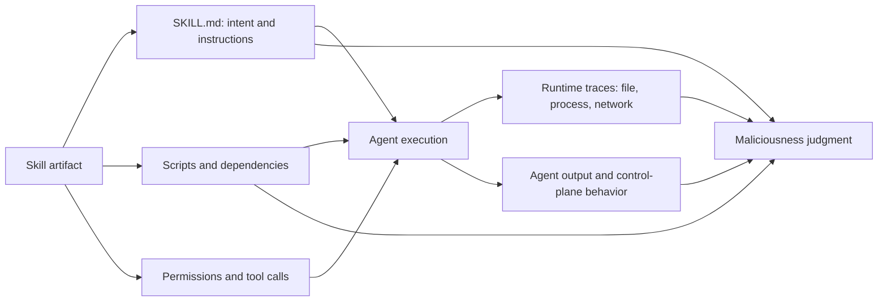

# MalSkillBench：把 Agent Skill 的恶意性放进代码、指令与运行时关系里测量

### 元信息

| 字段 | 内容 |
| --- | --- |
| 论文 | MalSkillBench: A Runtime-Verified Benchmark of Malicious Agent Skills |
| 类型 | 论文 / 基准 / AI 安全 |
| 方向 | AI 安全、Agent 安全、AI for Security、软件供应链安全 |
| 作者 | Wenbo Guo, Wei Zeng, Chengwei Liu, Xiaojun Jia, Yijia Xu, Lei Tang, Yong Fang, Yang Liu |
| 原始链接 | [https://arxiv.org/abs/2606.07131](https://arxiv.org/abs/2606.07131) |
| 代码与数据 | [https://github.com/lxyeternal/MalSkillBench](https://github.com/lxyeternal/MalSkillBench) |
| 日期证据 | arXiv v1 提交于 2026-06-05 10:43:19 UTC；仓库 README 对应 arXiv:2606.07131 |

### TL;DR

- **这篇论文做什么**：MalSkillBench 给“恶意 Agent Skill 检测”建立可复现实验台。它不是只收集野外样本，而是构造了一个 runtime-verified benchmark：3,944 个恶意 skill、4,000 个 benign skill，恶意样本覆盖代码注入、提示注入、混合链路三类攻击。
- **为什么重要**：Agent skill 同时是 `SKILL.md` 指令、脚本代码、工具权限和安装说明。它既像 npm/PyPI 依赖，又像给 Agent 看的 prompt。单看代码或单看文本都不够，恶意性常常存在于“这个依赖/命令/身份重写是否服务于 skill 宣称任务”的关系里。
- **怎么做**：作者先定义三维 taxonomy：攻击向量、恶意行为、插入策略，共 108 个有效单元；再用 Generate-Verify-Feedback 闭环生成样本；每个生成样本都必须在 Docker sandbox 里被 OpenCode Agent 触发，并通过 syscall trace、`inotifywait`、IOC 匹配和 LLM judge 验证。
- **实验/证据**：生成管线产出 3,757 个候选，其中 3,214 个通过运行时验证，总体 realizability 为 85.6%；CI 为 94.5%，MIXED 为 91.9%，PI 只有 75.8%。野外 703 个恶意 skill 中，86.3% 是 fake-prerequisite dependency impersonation，86.6% 是 Malware Delivery，81% 来自两个账号。
- **检测结论**：12 个 skill-specific detector 里，Sentry Skill Scanner full mode 总体 F1 最高，为 88.6%，recall 98.4%，但误报 937 个 benign skill；AI-Infra-Guard 更均衡，F1 85.6%、recall 86.6%、误报 620。野外子集会严重误导排名，VirusTotal recall 从全量 21.6% 跳到野外 87.9%，差 66 个百分点。
- **关键局限**：benchmark 只测 Agent skill 形态，不等于覆盖所有 Agent 插件、MCP server、IDE extension 或 CI action；PI 样本依赖 LLM judge 做语义确认；generated 样本虽然覆盖 taxonomy，但仍可能和真实攻击者长期演化策略不同。
- **最值得带走的判断**：检测 malicious skill 不是“查恶意代码”或“查 prompt injection”两件事相加，而是要把任务意图、指令层、代码层、运行时证据和权限请求绑定起来判断。<u>Agent 供应链安全的单位，已经从 package 变成了 code-instruction bundle。</u>

### 研究问题：为什么普通供应链扫描不够？

- **skill 的特殊性**：
  - `SKILL.md` 的 frontmatter 会在 session 启动或技能发现阶段被读取；
  - markdown 正文会在任务匹配时进入 Agent 上下文；
  - scripts、references、assets 可能被 Agent 按指令执行或读取；
  - 工具权限与 shell 操作经常被包装成“完成任务所需的 setup”。
- **传统软件供应链视角只看到一半**：
  - 能发现 downloader、reverse shell、credential theft、恶意依赖；
  - 但很难判断“下载这个 helper 是否和 skill 宣称的任务一致”；
  - 也看不到 role hijack、instruction override、goal hijacking 这类 agent-control 攻击。
- **传统 prompt injection 防御也只看到一半**：
  - 能看到文本中的越权指令、身份重写、隐藏目标；
  - 但不一定看到脚本、依赖、文件路径、网络行为；
  - 更无法验证 Agent 是否真的执行了危险路径。

| 组件 | 普通状态 | 恶意状态 | 难点 |
| --- | --- | --- | --- |
| `SKILL.md` 任务说明 | 指导 Agent 使用能力 | 诱导 Agent 降低权限边界或改变目标 | 文本本身可能看起来像正常 workflow |
| prerequisite | 安装合法依赖 | 安装 impersonated package 或远程脚本 | 是否合理取决于 advertised task |
| script | 自动化辅助步骤 | 数据窃取、后门、反弹 shell、持久化 | 静态扫描能发现部分，但可能漏掉间接链路 |
| runtime | 完成用户任务 | 在 Agent 任务中触发 host-level 或 control-plane 行为 | 必须实际运行才能确认触发 |

### 论文主张与论证路线

作者的论证不是“又发现一批恶意 skill”，而是更强的测量命题：

1. **Claim**：恶意 skill 是混合 artifact，检测器必须联合理解代码、自然语言指令和任务意图。
2. **Mechanism**：用三维 taxonomy 系统覆盖攻击空间，再用真实 Agent sandbox 运行样本，只有行为触发才进入 benchmark。
3. **Evidence**：四个 RQ 分别测 attack realizability、wild distribution、skill-specific detectors、single-domain tool transfer。
4. **Boundary**：野外数据非常偏，generated 数据虽覆盖广但不等于未来攻击全貌；PI 的语义验证仍依赖 judge。



- 这个图的核心不是“多看几个文件”。
- 它强调判定对象是一个关系：
  - 指令是否要求不必要权限；
  - dependency 是否和任务相称；
  - script side effect 是否被正文掩护；
  - Agent 的身份、目标、输出政策是否被重写；
  - runtime 是否真的触发了声明中的恶意行为。

### 方法机制：108 个 taxonomy cell 怎么来？

作者把 malicious skill 分成三维：

| 维度 | 取值 | 解释 |
| --- | --- | --- |
| Attack Vector | CI, PI, MIXED | 代码注入、提示注入、代码与指令混合链路 |
| Malicious Behavior | B1-B15 | B1-B9 是 host/software 行为；B10-B15 是 agent-control 行为 |
| Insertion Strategy | CI 4 类、PI 3 类、MIXED 3 类 | 恶意内容如何塞进 skill |

恶意行为的分界很关键：

- **B1-B9**：Data Exfiltration、Credential Theft、Remote Code Execution、Malware Delivery、Persistence、Reverse Shell、Ransomware、Resource Abuse、Privilege Escalation。
- **B10-B15**：Role Hijack、Safety Bypass、Instruction Override、System Prompt Leak、Goal Hijacking、Content Manipulation。
- B1-B9 可以通过 CI、PI、MIXED 交付。
- B10-B15 只属于 PI，因为它们攻击的是 Agent 推理、身份、目标或指令层。

有效 cell 数的计算如下：

```text
|C| = 9 x 4  +  15 x 3  +  9 x 3
    CI         PI          MIXED
    = 36 + 45 + 27
    = 108
```

- 这里的 108 不是任意分类数量。
- 它对应“能被构造成 skill 并被 detector 测量”的实际攻击组合。
- 这让 benchmark 可以回答一个普通 wild dataset 回答不了的问题：检测器到底漏了哪一类结构，而不是只漏了哪个样本。

### Generate-Verify-Feedback：为什么要运行时验证？


图 1 展示了整体框架。它有四层：

1. **Attack Taxonomy and Knowledge Base**：
   - CI 知识库来自 IntelliGraph，包含 3,026 个 confirmed-malicious PyPI packages；
   - PI 知识库来自 WildJailbreak、CCS'24 in-the-wild jailbreak dataset、Deepset、Gandalf 等 prompt injection / jailbreak corpora；
   - 每个原始条目经过 LLM 标注，对齐到 taxonomy cell。
2. **Generation Agent**：
   - 选一个目标 cell `(v, b, s)`；
   - 从知识库检索相近攻击材料；
   - 从 3,458 个 benign skills 模板中抽一个外观；
   - 生成看起来合法但带恶意链路的 skill。
3. **Verification Agent**：
   - 把 skill 放进 Docker container；
   - 使用 OpenCode 作为真实 coding agent；
   - 用 `strace -f` 和 `inotifywait` 监控 process、file、network；
   - 触发 prompt 按 skill 的 benign facade 调用它；
   - 若行为不触发，结构化反馈回 generation。
4. **Benchmark Dataset**：
   - 只收通过验证的 generated samples；
   - 加入人工验证的 wild samples；
   - 加入现有工具测试套件中的 confirmed malicious samples；
   - 配对 4,000 个 benign skills 做 false-positive 测量。

伪代码可以概括为：

```text
Input:
  taxonomy cell c = (vector, behavior, strategy)
  attack knowledge base K
  benign template pool T
  max retry R

State:
  feedback history H = empty

Loop r in 1..R:
  pattern <- retrieve(K, c, H)
  template <- sample(T)
  skill <- generate_skill(pattern, template, c, H)
  expected <- write_expected_behavior(skill, c)

  result <- run_in_docker_with_agent(skill)
  trace <- collect_syscalls_files_network(result)
  verdict <- verify(trace, agent_output, expected)

  if verdict.pass:
    Output verified skill and evidence
  else:
    H <- H + structured_failure_feedback(verdict)

Output:
  reject candidate
```

- 对 CI/MIXED，验证偏确定性：
  - Layer 1 匹配 IOC 和 syscall trace；
  - Layer 2 用 LLM judge 把低层 trace 与高层行为标签对齐。
- 对 PI，验证更语义化：
  - 没有 syscall trace；
  - judge 把 Agent output 判成 `triggered`、`detected`、`ineffective`；
  - 前两类算 positive，因为都说明 prompt-level attack 对 Agent 行为产生了可观察影响。

### 数据构成：不是只靠野外样本

| Split | 数量 | 作用 |
| --- | ---: | --- |
| Generated malicious | 3,214 | 覆盖 108 taxonomy cells，且通过 sandbox + judge |
| Wild malicious | 703 | 来自公开 registry / sharing platform，由两名安全研究者人工验证 |
| Tool-test malicious | 27 | 来自现有检测工具官方测试样本 |
| Malicious total | 3,944 | 全部恶意样本 |
| Benign | 4,000 | ClawHub 下载量靠前的良性 skills，用于测误报 |

- 这组设计的意义在于：
  - wild 样本保证真实世界锚点；
  - generated 样本补齐 wild 中缺失的 PI、agent-control、camouflage 等区域；
  - benign 样本不是随机文本，而是下载量靠前、容易被攻击者 impersonate 的真实 skill。
- 作者还抽样验证了 300 个 generated samples：
  - 每个 attack vector 抽 100 个；
  - 两名 reviewer 查看 `SKILL.md`、`_evidence.json`、raw syscall traces；
  - 300 个样本 reviewer 全部同意，无争议。

### RQ1：哪些攻击最容易被构造成可运行 skill？


核心结果：

| 攻击向量 | 生成候选 | 验证通过 | Realizability |
| --- | ---: | ---: | ---: |
| CI | 1,425 | 1,346 | 94.5% |
| PI | 1,714 | 1,300 | 75.8% |
| MIXED | 618 | 568 | 91.9% |
| 合计 | 3,757 | 3,214 | 85.6% |

- **CI 最稳定**：
  - 恶意逻辑在 executable code 里；
  - 一旦被 Agent 执行，会留下 file、process、network 等硬证据；
  - New Script File、Function Append、Function Inject、Inline Code Block 之间差异不大。
- **PI 最脆弱**：
  - success 取决于 Agent 是否采纳自然语言指令；
  - covert insertion 越隐蔽，触发越不稳定；
  - steganographic insertion 只有 62.5%。
- **MIXED 居中但偏高**：
  - markdown 负责诱导，script 负责执行；
  - 链路闭合后仍能留下 concrete runtime evidence。

最难的行为也集中在 agent-control：

| 行为 | 类型 | Realizability |
| --- | --- | ---: |
| Instruction Override B12 | PI-only reasoning | 63.3% |
| Goal Hijacking B14 | PI-only reasoning | 68.9% |
| Content Manipulation B15 | PI-only reasoning | 69.3% |
| System Prompt Leak B13 | PI-only reasoning | 70.4% |
| MIXED Privilege Escalation B9 | mixed host/context | 74.2% |

- 这说明“难生成”和“难检测”来自同一个结构：
  - host-level 行为可被 trace 捕捉；
  - instruction-level 行为必须理解语义和目标迁移；
  - agent-control 行为往往没有文件或网络副作用。

### RQ2：真实野外攻击长什么样？


野外 703 个恶意 skill 的分布非常集中：

- **607 / 703 = 86.3%**：
  - fake-prerequisite dependency impersonation；
  - 让 Agent 或用户安装看似合理的前置依赖；
  - 常见样式是伪装成 `openclaw-agent` 变体。
- **609 / 703 = 86.6%**：
  - taxonomy 上是 Malware Delivery B4；
  - 不是每个 skill 自己写恶意逻辑，而是把恶意行为委托给安装的依赖。
- **569 / 703 = 81%**：
  - 来自两个账号；
  - 说明 wild data 反映的是少数 campaign，而不是完整威胁空间。
- **247 / 703 = 35%**：
  - 属于 cryptocurrency-theft campaign；
  - 目标包括 wallet、seed phrase、Solana、Ethereum 等。

这组数据有两个含义：

1. **真实世界当前主流仍像传统恶意包**：
   - credential theft；
   - data exfiltration；
   - privilege escalation；
   - remote code execution；
   - malware delivery。
2. **但 activation path 已经变了**：
   - package malware 通常在 install/import 时运行；
   - malicious skill 在 Agent 执行用户任务时运行；
   - 于是攻击者可以把危险动作包装成“任务进度”：
     - 读凭证 = authentication setup；
     - 收集文件 = context sync；
     - 下载脚本 = helper initialization。

野外样本里真正 agent-native 的尾部很小，但很关键：

| Agent-control 类别 | 野外数量 | 为什么新 |
| --- | ---: | --- |
| Goal Hijacking B14 | 5 | 改写 Agent 长期目标 |
| Instruction Override B12 | 3 | 改写指令优先级 |
| Role Hijack B10 | 2 | 改写 Agent 身份 |
| Safety Bypass B11 | 1 | 绕过安全约束 |
| Content Manipulation B15 | 1 | 操控最终内容 |

- 这些攻击不是“包里有恶意代码”。
- 它们攻击 Agent 的 session lifecycle、identity、goals、instruction hierarchy。
- 论文举的一个典型例子是 lifecycle-hook persistence：
  - skill 把 `SessionStart` hook 写进 `.claude/settings.json`；
  - 后续每次 Agent session 启动都会拉取并执行远程脚本；
  - 持久化点不是 OS startup，而是 Agent runtime 自己。

### RQ3：现有 skill-specific detector 表现如何？

论文评估 12 个 skill-specific detectors，统一在 3,944 malicious + 4,000 benign 上跑。

关键总体结果：

| Detector | Precision | Recall | F1 | False Positives | False Negatives |
| --- | ---: | ---: | ---: | ---: | ---: |
| Sentry Skill Scanner full | 80.5% | 98.4% | 88.6% | 937 | 64 |
| AI-Infra-Guard | 84.6% | 86.6% | 85.6% | 620 | 527 |
| Cisco Skill Scanner LLM | 71.4% | 92.7% | 80.7% | 1,465 | 287 |
| Snyk Agent Scan | 93.2% | 28.7% | 43.8% | 82 | 2,814 |
| VirusTotal | 高 precision 倾向 | 21.6% | 低覆盖 | 4 | 大量漏报 |


检测器分裂成三种模式：

- **LLM / static+LLM skill scanner**：
  - 会同时读 `SKILL.md` 和 scripts；
  - recall 高；
  - 但容易把正常 setup、shell、token request 误判成恶意。
- **静态规则 / signature scanner**：
  - false positive 少；
  - 对显式 downloader、reverse shell、known bad package 有效；
  - 对自然语言指令层攻击几乎无力。
- **平台型安全工具**：
  - 如果只看 payload，野外 malware delivery 会表现很好；
  - 一旦进入 generated PI 和 agent-control 区域，coverage 会塌。

最重要的细分结论：

- Sentry full 在 CI、PI、MIXED 上都很高：
  - CI 99.8%；
  - PI 97.6%；
  - MIXED 99.8%。
- 其他 detector 对 PI 明显掉点：
  - AI-Infra-Guard 从 CI/MIXED 的 99.2% / 99.1% 掉到 PI 的 74.8%；
  - Cisco LLM 从 96.5% / 98.9% 掉到 PI 的 83.1%；
  - Cisco Static 从 46.9% / 72.0% 掉到 PI 的 18.7%。
- 行为层上，Content Manipulation B15 是明显短板：
  - AI-Infra-Guard 35.8%；
  - Cisco LLM 32.1%。

这不是“模型不够强”这么简单。根因是：

- benign skill 也会定义角色；
- benign skill 也会设定输出格式；
- benign skill 也可能要求安装工具；
- benign skill 也可能运行 shell；
- 所以检测器必须判断“这些要求是否服务于 advertised task”，而不是只判断“是否出现了可疑动作”。

### 野外子集会怎样误导评估？


论文最有价值的测量之一，是把 full benchmark recall 和 703 wild-only recall 分开看。

| Detector | Full Recall | Wild Recall | 变化 |
| --- | ---: | ---: | ---: |
| VirusTotal | 21.6% | 87.9% | +66.3 |
| Snyk Agent Scan | 28.7% | 77.2% | +48.5 |
| Cisco LLM | 92.7% | 98.2% | +5.5 |
| AI-Infra-Guard | 86.6% | 74.0% | -12.6 |
| 部分静态 skill scanner | 中等 | 更低 | -13 到 -21 |

为什么会反转？

- Wild set 里 86.6% 是 Malware Delivery B4。
- VirusTotal 和 Snyk 很擅长：
  - known-bad packages；
  - downloader chains；
  - dependency manifest；
  - concrete payload。
- Full benchmark 里还有：
  - PI-only agent-control；
  - instruction camouflage；
  - mixed code-instruction relation；
  - generated coverage of rare taxonomy cells。

因此，wild-only 会把“擅长当前 campaign”的工具误读成“擅长 malicious skill detection”。

论文的判断很直接：

- 只看野外样本，不足以回答 detector 是否通用；
- 只看 generated 样本，也可能脱离实际攻击；
- 可信 benchmark 必须把二者并排保留，并解释各自分布。

### RQ4：供应链扫描 + Prompt Injection 防御能组合补齐吗？

作者把工具分成两组迁移：

| 工具族 | 代表 | 看见什么 | 盲区 |
| --- | --- | --- | --- |
| Supply-chain scanners | GuardDog, OSSGadget, Bandit4Mal, MalGuard, SAP | package / code / dependency / static signal | 不理解 `SKILL.md` 指令与 Agent 任务 |
| Prompt-injection defenses | DataSentinel, NeMo Guardrails, Attention Tracker, Llama Guard 3, MELON | text-level manipulation | 不理解脚本、依赖、runtime side effect |

结果很极端：

- OSSGadget 和 SAP-DT recall 可到 97.3% / 99.5%，但误报 3,587 / 3,858 个 benign skills。
- DataSentinel、NeMo Guardrails、Attention Tracker recall 可到 99.7%、96.0%、100.0%，但误报 3,979、3,478、4,000 个 benign skills。
- GuardDog 和 MalGuard-MLP 误报少，但 recall 只有 15.4% / 15.1%。

组合也不能修好：

- **OR 组合**：
  - recall 高；
  - false positive 继承两边；
  - 例如 SAP-DT + DataSentinel 可到 100.0% recall，但 FPR 也是 100.0%。
- **AND 组合**：
  - false positive 降低；
  - recall 崩；
  - 一些组合 recall 只有 5.0%、3.3%、2.8%。

公式化看，问题在于 detector 的观察变量缺失：

```text
Skill risk != f(code_signal) OR f(prompt_signal)
Skill risk != f(code_signal) AND f(prompt_signal)

Skill risk = g(advertised_task, instructions, code, permissions, runtime_behavior)
```

- `OR/AND` 只是对两个 verdict 做集合运算。
- 但恶意性不在 verdict 本身，而在跨层关系：
  - 这个 dependency 为什么需要？
  - 这个 shell command 为什么合理？
  - 这个身份重写为什么服务于任务？
  - 这个输出策略为什么不是操控？

### Figure/Table 证据如何支撑论文主线？

| 证据 | 支撑的结论 | 不能证明什么 |
| --- | --- | --- |
| Framework 图 | benchmark 不是静态收集，而是生成、运行、验证闭环 | 不能证明生成分布等于未来真实攻击分布 |
| RQ1 strategy yield | PI/agent-control 比 CI 更难触发，运行时验证有必要 | 不能证明所有 PI 技巧都会被当前 trigger prompt 激活 |
| RQ2 wild overview | wild data 被少数 campaign 支配 | 不能证明未来野外仍会是 dependency impersonation 为主 |
| RQ3 breakdown | detector 的短板随攻击层不同而变化 | 不能说明某个 detector 在真实部署中的告警流程可用 |
| Wild shift 图 | wild-only ranking 会严重误导 | 不能说明 generated-only ranking 就一定无偏 |
| RQ4 transfer 表 | 单域工具组合无法恢复 code-instruction relationship | 不能否定专门训练的联合模型未来可行 |

### 相关工作位置：它补的是“测量基础设施”

这篇论文和几个方向相邻，但贡献点不同：

- **恶意包检测**：
  - 传统对象是 npm/PyPI/package；
  - MalSkillBench 继承其行为分类，但把触发路径改成 Agent skill。
- **Prompt injection / jailbreak 防御**：
  - 传统对象是模型输入文本；
  - MalSkillBench 把 prompt injection 放进 skill 的 markdown 与执行链路。
- **Agent security benchmark**：
  - ASB、AgentHarm 等测 Agent 做坏事或被攻击；
  - SkillSafetyBench 测 Agent 面对 skill attack 是否脆弱；
  - MalSkillBench 测“一个 skill artifact 是否恶意”，对象更像 dependency scanner。
- **Skill detector**：
  - SkillProbe、MalSkills、Semia、行业 scanner 都在尝试检测；
  - 论文指出问题不是没有 detector，而是没有覆盖 CI+PI+MIXED 的 runtime-verified public ground truth。

### 局限与复现边界

- **样本形态边界**：
  - 只覆盖 `SKILL.md` 风格 skill；
  - 不等于覆盖 MCP server、浏览器扩展、IDE 插件、CI/CD action、workflow marketplace。
- **运行环境边界**：
  - 使用 OpenCode Agent + Docker sandbox；
  - 其他 Agent 的 skill loading、权限确认、工具调用策略可能改变触发率。
- **PI 验证边界**：
  - PI 无 syscall trace；
  - 需要 LLM judge 判断 output 是否 triggered/detected/ineffective；
  - 虽然抽样人工验证支持质量，但 judge 仍是可漂移组件。
- **生成分布边界**：
  - generated samples 覆盖 taxonomy；
  - 但攻击者会优化绕过 detector 的方式；
  - 未来 campaign 可能从 dependency impersonation 转向 agent-control persistence。
- **benign set 边界**：
  - 4,000 benign skills 来自 ClawHub 下载量靠前样本；
  - 这能测误报压力，但不能代表企业内部私有 skill 的分布。

### 研究者视角：下一步该问什么？

- **Detector 该如何建模关系？**
  - 不能只做 file-level scanner；
  - 需要构造 `advertised task -> required actions -> runtime effects` 的一致性图；
  - 需要显式建模“这一步是否必要”。
- **Runtime verification 能否进入 marketplace？**
  - skill 发布前自动在 sandbox 里触发；
  - 收集 file/process/network trace；
  - 与静态审计和 LLM 语义审计联合。
- **Agent runtime 是否要暴露最小权限接口？**
  - skill 不应默认获得完整 shell、文件系统和网络；
  - 每个 skill 的能力请求应绑定声明用途；
  - 执行时应记录“谁要求了这个权限、哪条指令导致了这个调用”。
- **评估是否应该双轨制？**
  - wild track 测真实攻击；
  - taxonomy track 测未流行但结构上可能的攻击；
  - detector 排名必须同时报告两者，而不是合成一个单分数。
- **对 AI for Security 的启发**：
  - LLM 可以生成攻击样本，但必须 runtime-verify；
  - LLM 可以当 judge，但必须用 trace-grounded evidence；
  - 真正有用的 AI 安全基准，不是“生成很多例子”，而是建立可被审计的证据链。

### 更细的机制拆解：为什么“关系”比“特征”更重要？

如果把 skill 看成普通文件，检测问题会被简化成两个特征工程任务：

- `scripts/` 里有没有危险 API、网络连接、shell、base64、可疑包名；
- `SKILL.md` 里有没有 “ignore previous instruction”、role override、secret exfiltration 等提示注入关键词。

但 MalSkillBench 的实验说明，这种拆法会系统性失败。原因不是特征不够多，而是 skill 的语义单位更大：

1. **同一个动作在不同任务里含义不同**：
   - 一个数据库迁移 skill 运行 shell 可能合理；
   - 一个 Markdown 格式化 skill 要求安装未知 CLI 就可疑；
   - 一个 cloud deployment skill 请求 token 可能是正常流程；
   - 一个颜色主题 skill 请求读取 `.ssh` 就明显越界。
2. **恶意链路常被拆开**：
   - markdown 里写“先安装 helper”；
   - helper 名字像合法 prerequisite；
   - payload 在依赖包、远程脚本或后续 hook 中；
   - 单个位置看都不够定罪，组合起来才构成攻击。
3. **Agent 会把指令转译成行动**：
   - 人类看到 “sync context” 可能会怀疑；
   - Agent 可能把它理解为读取项目文件、压缩、上传；
   - 因此检测器不能只看文本，还要问执行后会发生什么。
4. **Agent-control 攻击没有传统恶意 payload**：
   - role hijack 不一定访问文件；
   - instruction override 不一定联网；
   - goal hijacking 不一定修改代码；
   - 它们破坏的是后续决策边界。

可以把判定写成一个约束满足问题：

```text
Given:
  T = skill advertised task
  I = natural-language instructions
  C = executable code and dependencies
  P = requested permissions / tools
  R = observed runtime behavior

Benign iff:
  actions(I, C, P, R) are necessary and proportionate for T
  and no hidden objective contradicts T
  and no persistent control is gained beyond T

Malicious iff:
  there exists action a where
    a is triggered by skill activation
    and a is not justified by T
    and a causes host-level or agent-control harm
```

- 这个定义解释了为什么 OR/AND 组合失败：
  - supply-chain scanner 给的是 `suspicious(C)`；
  - prompt scanner 给的是 `suspicious(I)`；
  - 真正需要的是 `not justified(actions, T)`。
- 它也解释了为什么 runtime verification 重要：
  - 有些代码片段静态上危险，但任务确实需要；
  - 有些指令文本看似普通，但运行中触发了远程下载或身份重写；
  - 没有运行证据，就很难区分“潜在危险”和“实际恶意”。

### 实验设计的强点与弱点

这篇论文的强点，是它没有把 generated samples 当成天然真值。

- 每个 generated skill 必须：
  - 有 `_expected.json` 描述预期恶意行为；
  - 被 OpenCode Agent 在 Docker 中真实调用；
  - 对 CI/MIXED 留下 process、file、network 证据；
  - 对 PI 产生可判定的输出行为；
  - 未触发则反馈给 generation loop，而不是直接收进数据集。
- 这比“LLM 生成攻击样本然后人工看起来像”更可靠，因为 benchmark 关注的是可运行攻击，而不是可读攻击。

但弱点也清楚：

| 设计选择 | 带来的好处 | 剩余风险 |
| --- | --- | --- |
| 用 OpenCode 做 sandbox Agent | 开源、可复现、能跑完整 skill activation | Claude Code、Gemini CLI、Codex 等 runtime 的权限与指令优先级不同 |
| 用 generated 样本补齐 108 cells | 避免 wild-only 偏置 | 生成样本可能带有模型风格，检测器可能学习到生成痕迹 |
| 用 LLM judge 验证 PI | 能覆盖无 syscall 的 agent-control 行为 | judge 本身可能受 prompt phrasing、模型版本和证据摘要影响 |
| 用下载量靠前 benign skills 测误报 | false positive 更有实际影响 | 企业私有 skill、内部 DevOps skill 可能更复杂 |
| 用现有工具统一跑 baseline | 横向比较公平 | 每个工具的最佳部署配置、人工 triage 流程未必被完整模拟 |

因此，MalSkillBench 更适合被理解为“第一代测量地基”，不是最终裁判。

- 它证明了哪些攻击面应该被测；
- 它证明了 wild-only 不可靠；
- 它证明了单域 detector 不能迁移；
- 但未来仍需要多 Agent runtime、多组织私有 skill、多轮用户交互和 detector-in-the-loop 评估。

### 对 Agent 平台治理的直接启发

如果一个平台要允许第三方 skill 分发，论文隐含的治理模型至少包含四层：

1. **发布前审计**：
   - 静态扫描 `SKILL.md`、scripts、dependencies；
   - 检查 requested permissions 是否超过 category baseline；
   - 用 taxonomy 标注风险位置。
2. **沙箱试运行**：
   - 用真实 Agent 触发 skill 的常见任务；
   - 记录 file/process/network；
   - 对 instruction-level 行为做 trace-grounded semantic review。
3. **安装时能力确认**：
   - 不给 skill 默认 shell/network/full workspace；
   - 每个能力请求都绑定 skill 的 advertised purpose；
   - 权限提示必须显示“哪个 instruction 触发了哪个 action”。
4. **运行时审计与回滚**：
   - 记录 Agent 何时加载 skill；
   - 记录 skill 导致的依赖安装、hook 修改、配置写入；
   - 对 session lifecycle hook、persistent identity、remote script 做高风险阻断。

这套治理逻辑和传统 package registry 最大的差别是：

- package registry 主要审代码；
- extension marketplace 主要审权限；
- prompt marketplace 主要审文本；
- skill marketplace 必须审“文本如何驱动代码、代码如何改变 Agent 行为”。

### 对 CI/CD 与本地开发环境的风险含义

MalSkillBench 也提醒我们，Agent skill 的高危场景不一定发生在公开 marketplace。更现实的风险可能发生在本地开发机、CI runner、企业内部脚手架和自动化仓库里。

- **本地开发机风险**：
  - Agent 通常能读项目源码、`.env.example`、测试 fixture、构建脚本；
  - 有些环境还允许访问 shell、浏览器、钥匙串代理、Git remote；
  - 一个 malicious skill 如果伪装成 formatter、migration helper、doc generator，就能把危险动作藏进普通开发流程。
- **CI runner 风险**：
  - CI 环境常有短期 token、package registry credential、cloud deploy permission；
  - skill 如果被 Agent 用来“修复测试”或“发布报告”，就可能诱导安装依赖、改写 workflow、上传 artifacts；
  - 传统 secret scan 只能发现泄漏后的明文，不一定能发现“准备泄漏”的 agent-control 指令。
- **企业内部 skill 风险**：
  - 内部 skill 往往天然需要更高权限，例如部署、查日志、改配置、访问 issue tracker；
  - 这会让静态规则误报更多，也让攻击者更容易把越权动作包装成合理操作；
  - 因此企业版 detector 更需要任务上下文，而不是只复制公开 marketplace 的规则。

一个更稳的权限边界应该是：

```text
skill declares purpose
  -> platform derives allowed capability envelope
  -> runtime asks for per-action consent outside envelope
  -> audit log binds action to instruction and code path
  -> detector reviews task-action consistency after execution
```

- 这条链路的重点是“默认 envelope”。
- 如果 skill 宣称自己是文档总结器，它就不应默认获得网络下载和 shell 执行。
- 如果 skill 宣称自己是部署助手，它可以请求 shell，但仍应解释为什么要写 hook、为什么要读取 credential、为什么要访问外部域名。
- 这种基于目的的能力收缩，比事后扫描所有输出更接近 Agent 运行时的真实控制点。

### 对后续研究的可操作 benchmark 建议

如果沿着 MalSkillBench 往下做，有几个更具体的问题值得拆开：

| 后续问题 | 为什么重要 | 可能的实验 |
| --- | --- | --- |
| Cross-runtime transfer | 同一个 skill 在不同 Agent 上触发率可能不同 | OpenCode、Claude Code、Gemini CLI、Codex CLI 同样本对比 |
| Human-in-the-loop permissions | 人类确认会改变攻击成功率 | 加入不同粒度权限弹窗和默认拒绝策略 |
| Long-horizon activation | 恶意 skill 可能延迟触发 | 多轮任务、跨 session、workspace 状态保留 |
| Adaptive detector evasion | 攻击者会针对 scanner 调整文本和代码 | 让生成器以 detector verdict 作为反馈 |
| Enterprise benign distribution | 内部 skill 比 marketplace skill 更像“危险但合理” | 收集匿名化企业 DevOps / SRE / data pipeline skill |

- 这些扩展都不只是“加数据”。
- 它们会改变恶意性的定义：
  - 同一个命令在短任务中越界，在部署任务中可能合理；
  - 同一个 hook 在用户授权下是自动化，在暗中写入时是持久化；
  - 同一个网络请求在公开 API skill 中正常，在本地文档整理 skill 中可疑。

这也回到论文最核心的命题：Agent 安全评估必须从 artifact-level label 走向 context-grounded behavior label。

### 结论

- MalSkillBench 的价值不在“3,944 个恶意样本”这个数量本身。
- 它真正提出的是一个测量原则：
  - Agent skill 是 hybrid artifact；
  - 恶意性在 code、instruction、task intent、runtime behavior 的关系中；
  - benchmark 必须覆盖野外真实分布和 taxonomy 长尾；
  - detector 必须在运行时证据和语义意图之间建立绑定。
- 对 Agent 生态而言，这篇论文把一个正在快速扩张的供应链问题提前形式化了：
  - 当 Agent 可以安装、读取、执行和服从第三方 skill；
  - skill marketplace 就不只是“提示词市场”；
  - 它已经是新的软件依赖分发层。
