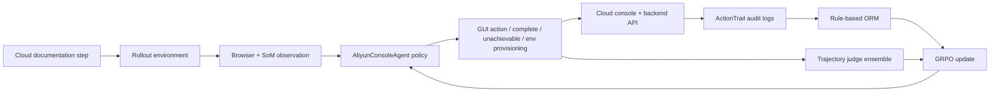

# AliyunConsoleAgent：把云控制台文档校验变成真实环境里的 Agent RL

### 元信息

| 字段 | 内容 |
| --- | --- |
| 论文 | AliyunConsoleAgent: Training Web Agents in Real-World Cloud Environments via Distillation and Reinforcement Learning |
| 类型 | 论文 / Web Agent / 后训练 / 真实云环境评测 |
| 方向 | 大模型 Agent、大模型后训练、云控制台自动化、Agent RL |
| 作者 | Bojie Rong, Zheyu Shen, Qiaoping Wang, Pengfei Kang, Yang Xu, Yawen Wei, Hanyu Wu, Zhi Zhao, Leihao Pei, Linquan Jiang |
| 原始链接 | [https://arxiv.org/abs/2606.09447](https://arxiv.org/abs/2606.09447) |
| 日期证据 | arXiv v1 提交于 2026-06-08 12:55:42 UTC |
| 相关背景 | WebAgent-R1、ZeroGUI、CUARewardBench、GRPO/DeepSeekMath、ReAct、Set-of-Mark |

### TL;DR

- **这篇论文做什么**：AliyunConsoleAgent 把“云产品文档是否还能按当前控制台端到端执行”建成一个真实云环境里的 Web Agent 训练与评测问题。目标不是通用网页浏览，而是自动验证云控制台文档步骤是否和真实 UI、真实后端状态一致。
- **为什么重要**：云平台有数百个产品，UI 和后端能力持续迭代，文档会漂移。作者估计完整周期性校验需要每年约 400 万次检查，单次人工约 1.6 小时，而当前人工覆盖率低于 1%。这使“执行即校验”成为工业级 Agent 任务，而不是 demo。
- **怎么做**：训练分两阶段。第一阶段用 frontier model 成功轨迹蒸馏做 SFT；第二阶段在真实云控制台里用 GRPO 继续训练，并用 ActionTrail 审计日志与双 LLM judge 组成 dual-channel ORM，过滤不可靠 reward。
- **环境机制**：核心不是简单放一个浏览器，而是四层 rollout 环境：账号池、Kubernetes 沙箱、Resource META 离线 Terraform 预置、ResourceCoder 运行时补资源。它试图把“缺资源导致失败”和“Agent 决策错误”分离。
- **实验/证据**：在 278 个真实云产品文档任务上，AliyunConsoleAgent-32B SFT+GRPO 的 pass@1 为 63.52%，比 Qwen3-VL-32B base 高 20.24 个百分点；与 Gemini 3 Pro Preview 的 65.34% 只差 1.82 个百分点，bootstrap 95% CI 为 [-1.27, 7.39]。
- **关键成本数字**：32B 私有部署单任务约 0.56 CNY；Gemini 3 Pro Preview 约 7.00 CNY，GPT-5.5 约 15.50 CNY。论文主张在接近 best frontier model 的同时，推理成本降低约 92%。
- **局限**：失败仍主要来自三类：资源预置缺口、前端交互非确定性、Agent 真实推理错误。系统依赖静态 Terraform 模板和 DOM/Set-of-Mark 标注，云 API 与 UI 一更新就需要维护。
- **最值得带走的判断**：这篇论文的价值不只在“32B 模型接近闭源模型”，而在它把 Agent RL 的 reward 信号工程化到真实后端审计日志。<u>对真实业务 Agent 来说，训练环境的确定性本身就是模型能力的一部分。</u>

### 研究问题：为什么云控制台文档校验适合做 Agent RL？

- **普通 Web Agent benchmark 的问题**：
  - 常见环境可以重置，任务边界相对清晰；
  - reward 往往来自页面状态、脚本检查或人工/模型 judge；
  - 很多任务不需要真实付费资源、真实审计日志、跨产品依赖。
- **云控制台文档校验不同**：
  - 文档步骤依赖真实资源，例如 ECS 实例、RDS 白名单、VPC、vSwitch、安全组；
  - 资源状态会影响 UI 路径，例如开关已关闭时，“关闭自动续费”无法直接验证；
  - 后端异步事件可能延迟出现，截图成功不等于 API 层成功；
  - 多任务并发会污染共享账号状态，前一个任务留下的资源会改变后一个任务。
- **作者真正要解决的问题**：
  - 不是让模型“看懂按钮”；
  - 而是让模型在真实云平台里完成一个可审计目标；
  - 同时让训练系统知道失败到底来自资源缺失、UI 非确定性，还是策略错误。

| 难点 | 如果不处理 | 论文里的处理方式 |
| --- | --- | --- |
| 前置资源缺失 | Agent 失败，但 reward 把它误当作决策错误 | Resource META 离线预置 + ResourceCoder 运行时补资源 |
| 共享账号状态污染 | 并发训练互相干扰，结果不可复现 | 独立测试账号池、凭证轮换、财务健康监控 |
| 截图/LLM judge 误判 | reward hacking 或幻觉判断 | ActionTrail 规则审计优先，LLM judge 只用于无确定 API 的任务 |
| 文档 UI 漂移 | Agent 按文档走会卡死 | GRPO 学到目标导向替代路径 |
| 成本与隐私 | frontier API 无法全量周期性跑 | 32B 私有部署，单任务成本约 0.56 CNY |

### 论文主张与论证路线

作者的论证可以拆成四步：

1. **Claim**：文档校验可以被定义成可执行、可审计的 Web Agent 任务。
2. **Mechanism**：用高确定性 rollout 环境隔离资源噪声，再用 SFT+GRPO 让模型从模仿变成目标导向决策。
3. **Evidence**：用 278 个文档级任务、400 个单步动作样本、ActionTrail 规则 reward、三次独立运行给出 pass@1/pass@3。
4. **Boundary**：剩余误差来自资源模板维护、复杂前端组件、Agent 决策缺口，未来需要更强资源模板生成、纯视觉 grounding 和更密 reward。



- 这个图的关键不是“Agent 接浏览器”。
- 关键在于 reward 从后端审计日志回来，而不是只看页面。
- 这样才能减少两类错觉：
  - 页面看起来成功，但后端 API 没有产生正确状态；
  - 模型 judge 被轨迹叙述说服，但真实云资源没有变化。

### 方法机制一：Agent 动作空间为什么多了 `a_env`？

论文把每一步状态写成：

```text
z_t = 当前截图 + Set-of-Mark 标注 + 文档步骤 + 历史动作 + 资源报告
```

Agent 每步先输出 Thought，再从四类动作中选择：

| 动作 | 含义 | 为什么需要 |
| --- | --- | --- |
| `a_gui` | 用 Playwright 操作 headless Chromium | 执行点击、输入、选择、导航等控制台动作 |
| `task_complete` | 声明任务成功 | 让 Agent 在后端目标达成后主动结束 |
| `task_unachievable` | 声明当前环境无法继续 | 避免在缺资源或文档错误时无限循环 |
| `a_env` | 暂停 GUI，触发 ResourceCoder 补资源 | 处理文档没写清的隐式依赖 |

- `a_env` 是这篇论文很重要的设计。
- 它把“我需要一个前置资源”从 GUI 操作里显式分离出来。
- ResourceCoder 会写 Terraform 或 Aliyun CLI 脚本，在沙箱里执行、报错、修正。
- 成功后，它返回结构化资源报告，注入 Agent 上下文。

这意味着 Agent 不只是网页点击器，而是有一个受控的环境修复通道：

```text
Input:
  documentation sub-step, current UI, missing-resource signal

State:
  account credentials, Resource META, existing cloud resources

Loop:
  if UI can proceed:
      choose GUI action
  else if missing prerequisite is inferred:
      call ResourceCoder via a_env
      inject resource report into context
  else if goal impossible:
      emit task_unachievable

Output:
  verified backend state change or documented inconsistency

Failure boundary:
  provisioning script stale, quota exhausted, async resource not ready, UI component unstable
```

### 方法机制二：四层 rollout 环境如何清洗 reward 信号？


论文把 rollout 环境分成四层：

| 层 | 作用 | 训练意义 |
| --- | --- | --- |
| Account Pool Management | 隔离账号、轮换凭证、监控财务状态 | 防止并发任务共享状态，减少 cross-task interference |
| Sandbox Execution | 用 ACK / StatefulSet 管理容器化任务 | 让大规模 rollout 可弹性并行 |
| Resource META Offline Provisioning | 为文档生成资源依赖五元组 | 让任务开始前已有必要云资源 |
| Runtime On-demand Provisioning | 处理运行时发现的隐式依赖 | 补齐离线模板没覆盖的资源缺口 |

Resource META 被定义成五元组：

```text
M = <D, K, C_create, C_verify, C_destroy>
```

变量解释：

- `D`：自然语言资源依赖描述。
- `K`：结构化关键属性，例如付费类型、实例规格、镜像、可用区、磁盘类型。
- `C_create`：创建依赖资源的 Terraform / CLI 代码。
- `C_verify`：验证依赖是否满足的代码。
- `C_destroy`：按依赖顺序清理资源的代码。

这套机制的意义在于：

- 如果资源不存在，Agent 失败不应被当作坏策略；
- 如果资源状态不对，reward 反馈会污染梯度；
- 如果 cleanup 不完整，下一条轨迹会继承脏状态；
- 如果模板不可跨账号复用，rollout 无法并行扩大。

论文给出的环境实验很直接：

| 环境方案 | 结果 |
| --- | --- |
| 空账号并行执行 | ECS 成功率 33.81% |
| 加入资源预置 | ECS 成功率 84.39%，提升 50.58pp |
| 顺序共享账号 | 全文档树审核约 5 天 |
| 足够账号与机器并行 | 全文档树审核约 1 小时 |
| 10 产品交叉验证 | 平均成功率 80%，比顺序 baseline 高 4pp |

- 这些数字说明 rollout 环境不是外围工程。
- 它直接决定 RL 看到的 reward 是否可信。
- 如果环境失败占主导，GRPO 只是在学习噪声。

### 方法机制三：SFT 数据为什么要有两种来源？

SFT 阶段目标是让 Qwen3-VL-32B-Instruct 学会云控制台交互格式。

作者用了两类数据：

1. **Frontier model 轨迹蒸馏**：
   - 收集成功执行轨迹；
   - task-level 只保留完成任务或发现真实文档不一致的轨迹；
   - step-level 用 LLM 过滤无效动作和绕路。
2. **自主 self-exploration**：
   - 从 ECS、RDS 等产品入口自由探索；
   - 自动提出 CRUD 类任务；
   - 覆盖蒸馏数据没有出现的 UI 长尾状态。

训练设置：

| 项 | 设置 |
| --- | --- |
| Base model | Qwen3-VL-32B-Instruct |
| 样本 | 约 160K single-step samples |
| 训练 | full-parameter fine-tuning |
| Epoch | 1 |
| 资源 | 64 GPUs |
| 并行/优化 | DeepSpeed ZeRO-2 |
| Learning rate | 1.0e-5 |
| Precision | BF16 |

SFT 的贡献很清楚：

- 在 400 个单步云控制台样本上，Qwen3-VL-32B base 是 83.00%；
- AliyunConsoleAgent-32B SFT 达到 92.75%；
- 已接近 Gemini 3 Pro Preview 的 95.25% 和 GPT-5.5 的 94.75%；
- 但 SFT 常败在“文档写得太粗”或“步骤有隐式前提”的场景。

### 方法机制四：GRPO 与 dual-channel ORM 怎么避免 reward hacking？

GRPO 阶段解决的问题是：

- SFT 会忠实模仿文档；
- 但真实云环境里，文档可能不完整、按钮可能不存在、资源状态可能不满足；
- Agent 需要从“按步骤执行”变成“围绕目标完成后端状态变化”。

论文的 reward 分两路：

| 通道 | 适用任务 | 机制 | 风险控制 |
| --- | --- | --- | --- |
| Rule-Based ActionTrail | 有确定后端事件的任务 | 查询审计日志，检查 API 事件与参数约束 | ground-truth binary reward，零假阳性目标 |
| LLM-as-Judge Ensemble | 无确定 ActionTrail 事件的任务 | 两个强模型做 trajectory-level 判断 | 只有一致时接受；分歧标记 `r=-1` 并排除 |

reward 公式可以写成：

```text
r_i =
  1.0  if ActionTrail confirms success
  1.0  if both LLM judges agree on success
  0.0  if both LLM judges agree on failure
 -1.0  otherwise, excluded from training
```

验证集细节：

- 作者用 308 条 expert-labeled trajectories 验证 reward model；
- 双模型 ensemble 对人工判断 accuracy 为 96.7%；
- 单模型 judge 为 91.9%；
- 这支持“共识才训练”的保守策略。

GRPO 的 advantage 做了两层归一化：

```text
Per-task:
  A_hat(k,i) = (r(k,i) - mu_k) / (sigma_k + epsilon)

Global:
  A_final(i) = (A_hat(i) - mu_batch) / max(sigma_batch, epsilon)
```

为什么要这样做：

- 不同云文档任务难度差异很大；
- 同一 batch 里，容易任务和困难任务的 reward 分布不能直接混；
- per-task normalization 消掉任务难度；
- global normalization 让 batch 内 advantage 尺度统一；
- 如果某个任务 16 条 rollout 全成功或全失败，`sigma_k=0`，该任务没有区分度，会被自然跳过。

policy loss 是 clipped surrogate + KL：

```text
L = - min(rho_t * A_hat_t, clip(rho_t, 1-epsilon, 1+epsilon) * A_hat_t)
    + beta * L_KL

rho_t = pi_theta(a_t | s_t) / pi_old(a_t | s_t)
```

训练超参：

| 项 | 设置 |
| --- | --- |
| clip range | 0.2 |
| KL coefficient | 0.1 |
| group size | 16 |
| oversampling | 1.25x |
| learning rate | 5e-7 |
| checkpoint | 每 5 steps 验证，最佳在 step 25 |

### 实验设置：278 个任务到底怎么测？


评测有两层：

1. **单步动作预测**：
   - 400 个 state-action pairs；
   - 覆盖所有云产品；
   - screenshot 带 SoM 标注；
   - 每个样本允许多个正确动作；
   - 每个模型跑 3 次取平均。
2. **端到端生产任务**：
   - 278 个真实云产品文档校验任务；
   - 覆盖 12 个 Alibaba Cloud 产品；
   - 76 个 standard，202 个 hard；
   - benchmark 与训练数据按文档 URL 隔离；
   - 评测全部用 rule-based ActionTrail，不用 LLM-as-judge；
   - 每个任务独立执行 3 次，报告 pass@1 和 pass@3。

`pass@1` 和 `pass@3` 的意义不同：

| 指标 | 解释 | 对生产的含义 |
| --- | --- | --- |
| pass@1 | 三次独立运行的平均成功率 | 单次校验成本与稳定性 |
| pass@3 | 三次里任意一次成功 | 允许失败重试的生产通过率 |

作者强调 pass@3 是生产相关指标，因为文档校验失败可以重试。

但 pass@1 更能看出模型本体与环境稳定性的结合能力。

### 主结果：32B 私有模型接近 best frontier，但不是无条件胜出

| Model | Deployment | Cost / task | pass@1 | pass@3 |
| --- | --- | ---: | ---: | ---: |
| Qwen3-VL-32B-Instruct Base | Private | 0.56 CNY | 43.28±0.50% | 60.79% |
| AliyunConsoleAgent-32B SFT | Private | 0.56 CNY | 56.89±0.83% | 72.66% |
| AliyunConsoleAgent-32B SFT+GRPO | Private | 0.56 CNY | 63.52±1.86% | 75.18% |
| Qwen3.6-Plus | API-only | 0.97 CNY | 57.69±1.50% | 72.66% |
| Kimi K2.6 | API-only | 2.70 CNY | 60.79±0.72% | 73.38% |
| Gemini 3 Pro Preview | API-only | 7.00 CNY | 65.34±2.15% | 79.86% |
| GPT-5.5 | API-only | 15.50 CNY | 62.08±2.00% | 76.09% |

读这张表要注意三点：

1. **GRPO 的增益是真实的**：
   - Base 到 SFT：+13.61pp；
   - SFT 到 GRPO：+6.63pp；
   - Base 到 SFT+GRPO：+20.24pp。
2. **和 Gemini 的差距没有统计显著到可断言落后**：
   - pass@1 差 1.82pp；
   - paired bootstrap 95% CI 是 [-1.27, 7.39]；
   - 论文报告 `p > 0.05`。
3. **成本是论文主张的核心变量**：
   - AliyunConsoleAgent-32B 单任务 0.56 CNY；
   - Gemini 3 Pro Preview 单任务约 7.00 CNY；
   - GPT-5.5 单任务约 15.50 CNY；
   - 所以“接近 frontier”必须和“私有部署、低成本、隐私约束”一起理解。

### 难度拆分：hard task 上仍有稳定差距

| Model | Standard (76) pass@3 | Hard (202) pass@3 |
| --- | ---: | ---: |
| Qwen3-VL-32B Base | 71.05% | 56.93% |
| AliyunConsoleAgent-32B SFT | 81.58% | 69.31% |
| AliyunConsoleAgent-32B SFT+GRPO | 84.21% | 71.78% |
| Gemini 3 Pro Preview | 88.16% | 76.73% |

- Standard 上，SFT+GRPO 距 Gemini 3.95pp。
- Hard 上，SFT+GRPO 距 Gemini 4.95pp。
- 这个差距不是只在 easy task 被抹平。
- 说明 frontier model 的优势仍存在，但相对均匀。
- 也说明 RL 的收益不只来自简单任务：
  - Standard 比 base +13.16pp；
  - Hard 比 base +14.85pp。

### 消融与质性分析：GRPO 学到的不是“更会点按钮”


论文的消融很简洁：

| Training Stage | pass@1 | vs. SFT |
| --- | ---: | ---: |
| Qwen3-VL-32B Base | 43.28% | — |
| SFT | 56.89% | baseline |
| SFT → GRPO | 63.52% | +6.63pp |

更有意思的是两个质性案例：

1. **构造前提状态**：
   - 任务要求“关闭自动续费”；
   - 但当前开关已经是 OFF；
   - SFT 模型会无事可做，最后失败；
   - GRPO 模型先开启自动续费，再执行关闭；
   - 后端审计日志因此能验证“关闭”动作。
2. **替代路径完成目标**：
   - 文档要求点击 RDS 的 “Batch Modify”；
   - 当前 UI 没有这个按钮；
   - SFT 模型进入循环；
   - GRPO 模型改为逐个实例修改参数；
   - 2/3 次成功。

这两个例子说明：

- SFT 学到的是过程模仿；
- GRPO 强化的是目标可达性；
- reward 来自后端目标，所以模型可以偏离文档表面步骤；
- 这也解释了为什么它适合“文档漂移检测”：
  - 如果替代路径成功，文档可能只是 UI 路径老了；
  - 如果后端目标无法达成，才更像真实缺陷。

### 失败分析：剩余问题不是一个模型继续训就能全解

论文把失败分三类：

| 失败类型 | 表现 | 性质 | 可能改进 |
| --- | --- | --- | --- |
| Resource provisioning gaps | 缺依赖、备份要等 24 小时、规格不匹配、资源状态错误 | 多为确定性失败，3 次都失败 | 扩展 META 模板，加入 post-creation state conditioning |
| UI interaction failures | 级联 dropdown 竞态、弹窗干扰、按钮灰掉、日期选择器/上传组件异常 | 多为间歇性失败 | retry、wait-for-stability、组件级策略 |
| Agent decision errors | 过早 complete、参数选错、反向操作、导航失败 | 真正模型能力 ceiling | 更密过程 reward、更强规划与反思 |

这部分很重要，因为它把“还差 24.82% pass@3 没过”的原因拆开了：

- 一部分是环境工程；
- 一部分是前端自动化；
- 一部分才是模型策略。

如果把所有失败都归因于模型，下一步只会继续堆 RL。

但论文实际暗示：

- Resource META 的生命周期管理可能比多训几轮更关键；
- UI 稳定等待与组件策略能提升 intermittent failures；
- 真正需要模型能力的，是目标理解、反向操作识别、替代路径规划。

### detail inventory：这篇论文真正可复用的细节有哪些？

如果把论文拆成可迁移组件，可以得到下面这张清单。

| 模块 | 论文里的具体实现 | 可迁移到哪里 |
| --- | --- | --- |
| 任务定义 | 文档步骤能否在当前控制台端到端执行 | SaaS 帮助文档、DevOps runbook、内部 SOP |
| 环境状态 | 云账号、资源实例、区域、规格、异步 API 事件 | CI/CD 沙箱、数据库测试环境、企业应用租户 |
| 观测 | 截图、SoM 元素编号、文档步骤、历史动作、资源报告 | Web automation、desktop automation、IDE agent |
| 动作 | GUI 操作、完成、不可达、环境补资源 | Coding agent 的启动依赖、数据 agent 的测试数据准备 |
| reward | ActionTrail 审计规则 + LLM judge consensus | 审计日志、数据库变更、工单状态、API event log |
| cleanup | `C_destroy` 按依赖顺序清理 | 临时云资源、测试租户、fixture 数据 |
| 数据闭环 | 成功 runtime template 回流到离线 META | 环境模板库、任务 fixture 库、自动修复脚本库 |

这张清单说明两个事实：

- **Agent 训练样本不是孤立 trajectory**：
  - 它还包含环境准备代码；
  - 包含 reward rule；
  - 包含 cleanup 逻辑；
  - 包含失败归因标签。
- **业务 Agent 的 benchmark 不是一份题目表**：
  - 它是任务、账号、资源、审计、清理、成本的组合；
  - 缺任何一层，评测都会偏离真实部署。

### claim → mechanism → evidence → boundary

| Claim | Mechanism | Evidence | Boundary |
| --- | --- | --- | --- |
| 云文档校验可以自动化 | 执行即校验，把文档步骤映射到真实控制台操作 | 54,000+ procedures 生产背景，4,399 confirmed defects | 只覆盖能被 agent 执行和审计的文档流程 |
| 高确定性环境能提升训练信号 | 账号池 + 沙箱 + Resource META + ResourceCoder | ECS 成功率从 33.81% 到 84.39% | Terraform 模板会老化，资源成本不均 |
| SFT 学会基础交互 | frontier 轨迹蒸馏 + self-exploration | 单步准确率从 83.00% 到 92.75% | SFT 仍按过程模仿，遇到隐式前提会失败 |
| GRPO 学会目标导向 | ActionTrail/LLM dual-channel ORM + two-layer advantage normalization | pass@1 从 56.89% 到 63.52% | GRPO 有震荡，需要验证集选 checkpoint |
| 32B 私有部署可替代部分 frontier API | 同一 rollout 环境下比较成本和成功率 | 与 Gemini 只差 1.82pp，成本低约 92% | pass@3 仍低 4.68pp，且只在 Alibaba Cloud 场景验证 |

### 复现与迁移边界：外部团队要补哪些东西？

这篇论文看起来像一个模型训练故事，但外部团队真正要复现，难点会落在系统侧。

必须补齐的组件包括：

1. **可重置环境**：
   - 每个任务要能独立启动；
   - 资源创建和销毁要可脚本化；
   - 脏状态不能泄漏到下一条轨迹。
2. **客观 reward**：
   - 最好来自审计日志、数据库状态、API 事件；
   - 如果只能用截图或 LLM judge，必须做一致性和人工抽检；
   - reward rule 本身要版本化，否则平台 API 变化会让旧规则误判。
3. **成本预算器**：
   - 真实云资源不是免费的 simulator；
   - 每类任务应有预估成本、最大并发、最大时长；
   - premium resource 任务不能和普通 ECS/RDS 文档同频运行。
4. **安全控制**：
   - ResourceCoder 写 IaC 代码，需要权限边界；
   - 账号池要限制资源类型、区域、额度；
   - cleanup 失败要进入人工或自动补偿队列。
5. **失败归因数据**：
   - 只记录 reward 不够；
   - 要区分资源缺口、UI 非确定性、模型决策错误；
   - 否则下一轮训练不知道应该改模板、改自动化层，还是改模型。

迁移到其他领域时，可以抽象成一个公式：

```text
Useful Agent RL = Policy Update x Environment Determinism x Reward Verifiability x Cleanup Reliability
```

变量解释：

- `Policy Update`：SFT、GRPO、DPO、offline RL 等模型优化方法。
- `Environment Determinism`：同一任务多次 rollout 是否面对可比状态。
- `Reward Verifiability`：成功是否能被外部系统客观确认。
- `Cleanup Reliability`：一次训练是否会破坏下一次训练。

这个乘法形式刻意保守：

- 任一项接近 0，整体训练价值都会接近 0；
- 这比只比较 RL 算法更符合真实业务 Agent 的失败模式。

### 生产部署证据：论文不只是离线 benchmark

作者给了一个 production pipeline 背景：

| 项 | 数字 |
| --- | ---: |
| 中国站产品 | 151 |
| 国际站产品 | 123 |
| 时间 | 2025-06 到 2026-01 |
| 审核过程 | 54,000+ procedures |
| confirmed defects | 4,399 |
| defect-confirmation rate | 91% |
| end-to-end success | 76% |
| rollout throughput | 约 300 tasks/hour，200+ concurrent sandboxes |
| 迁移到 32B 预估降本 | 约 92%，约 350K CNY |

这组数字支撑论文的实际动机：

- 不是为了在公开 benchmark 上刷分；
- 而是 frontier API 的成本与隐私约束阻止了全量周期性检查；
- 私有 32B 模型哪怕略低于最佳 frontier，也可能是可部署方案。

### 和相关工作的关系：它站在 Web Agent RL 的哪一侧？

| 工作 | 关注点 | AliyunConsoleAgent 的差异 |
| --- | --- | --- |
| WebAgent-R1 | 多轮网页环境的端到端 RL，binary reward | AliyunConsoleAgent 的 reward 更强绑定真实云后端审计日志 |
| ZeroGUI | 自动生成 GUI 任务与自动 reward，降低人工成本 | AliyunConsoleAgent 更强调真实云资源依赖和 Terraform 预置 |
| CUARewardBench | 评估 computer-use reward model 的可靠性 | AliyunConsoleAgent 用 ActionTrail 规则 reward 避免纯 RM 误判 |
| UI-TARS / GUI agent 系列 | GUI interaction 与多轮 RL | AliyunConsoleAgent 的主要难点是云资源状态和文档漂移 |

可以把它放在一个更窄但更硬的坐标里：

- 不是 open-domain web browsing；
- 不是 desktop GUI benchmark；
- 不是只靠 synthetic environment；
- 而是“付费资源 + 生产控制台 + 后端审计 + 文档漂移”的受控真实环境。

### 图表证据逐项解读


- **Figure 1**：
  - 横轴是 per-task inference cost；
  - 纵轴是 pass@1；
  - 蓝色区域强调高性能、低成本、私有部署；
  - 论文要证明 32B SFT+GRPO 进入这个区域。
- **Figure 2**：
  - 展示 SFT 数据构造、rollout 执行/清理、dual-channel ORM；
  - 它不是单一训练 loop，而是数据、环境、reward、cleanup 的工程闭环。
- **Figure 3**：
  - RDS 自动续费案例说明 GRPO 会主动创建可验证前提；
  - 这是从 process-following 到 goal-oriented 的关键证据。
- **Figure 4**：
  - 展示四层 rollout environment；
  - 它对应论文最核心的“高确定性训练环境”主张。
- **Table 2**：
  - 证明 SFT 已能把 32B base 单步动作能力拉到接近 frontier；
  - 但单步不等于端到端，后续仍需要 GRPO。
- **Table 3/4/5**：
  - 主结果、难度拆分、训练消融形成完整证据链；
  - 其中 Table 5 最能证明 GRPO 不是装饰性步骤。

### 证据边界与局限

论文的局限可以更尖锐地读：

1. **Terraform 模板会老化**：
   - 云 API、规格、区域、资源约束持续变化；
   - 静态模板要周期性再生成；
   - 用 frontier API 重生成会重新带来成本问题。
2. **Set-of-Mark 依赖 DOM 解析**：
   - 云控制台页面组件复杂；
   - DOM 抽取和可点击元素编号很脆；
   - 纯视觉交互可能是未来方向，但当前 VLM 坐标 grounding 还不够稳。
3. **真实资源成本不是小事**：
   - GPU 实例、高规格数据库、跨区资源都可能很贵；
   - 不同文档应有不同检测频率；
   - 这要求调度系统把业务重要性、历史漂移率、资源价格一起建模。
4. **评测任务来自 Alibaba Cloud 场景**：
   - 结论对“云控制台文档验证”很强；
   - 对任意企业 SaaS、桌面软件、普通网页导航不能直接外推；
   - 但 Resource META + audit-log reward 的范式可迁移。
5. **LLM judge 仍存在于训练中**：
   - 评测全部用 ActionTrail 规则，这是优点；
   - 训练中仍有部分任务靠双 LLM judge；
   - ensemble 准确率高，但不是绝对 ground truth。

### 研究者视角：它对 Agent 与后训练有什么启发？

- **第一，Agent RL 的难点从算法移到环境**：
  - GRPO 公式本身不是论文最原创的部分；
  - 真正难的是让 rollout 的失败可归因；
  - 在真实世界里，reward engineering 先于 policy optimization。
- **第二，业务系统的审计日志可能是比 screenshot 更好的 reward**：
  - GUI agent 常被页面状态误导；
  - 后端审计日志能直接对应业务动作；
  - 这对财务、云管控、DevOps、CRM、ERP Agent 都有启发。
- **第三，SFT 与 RL 的分工更清楚**：
  - SFT 学格式、动作、产品知识、常规路径；
  - RL 学目标导向、前提构造、替代路径、异常恢复；
  - 这比“先 imitation 再 RL”口号更具体。
- **第四，环境修复动作值得成为 Agent 动作空间的一等公民**：
  - `a_env` 把缺资源问题显式暴露；
  - 未来 coding agent、data agent、DevOps agent 也可能需要类似动作：
    - 创建测试数据；
    - 启动服务依赖；
    - 修复沙箱状态；
    - 生成可清理的临时资源。
- **第五，安全边界要和 reward 一起设计**：
  - Agent 可以调用 ResourceCoder 写 Terraform；
  - 这意味着权限、成本、cleanup、审计必须硬绑定；
  - 否则训练过程本身可能制造资源泄漏、越权操作或费用风险。

### 继续追问

1. **能否开源任务规格和 reward functions 的可复现子集？**
   - 论文称 278 任务数据与 reward functions 可公开；
   - 真正复现仍依赖云账号、资源额度和控制台状态；
   - 如果只有规格没有可运行 sandbox，外部验证会受限。
2. **ResourceCoder 生成的 Terraform 如何做安全审计？**
   - 它既能创建资源，也能运行 CLI；
   - 训练环境要防止越权、费用爆炸和 cleanup 失败；
   - 这里需要 policy-as-code 或 IaC scanner 接入。
3. **能否把 ActionTrail reward 扩展成过程 reward？**
   - 当前主要是 outcome reward；
   - 过程 reward 可能帮助导航错误、参数错误、过早 complete；
   - 但过密 reward 也可能引入新的 reward hacking 面。
4. **不同成本任务如何调度？**
   - GPU、数据库、跨区网络资源成本不同；
   - 全量同频检测不可持续；
   - 更实际的系统可能需要风险评分和自适应采样。
5. **纯视觉 Agent 何时能替代 SoM？**
   - 作者承认 DOM/SoM 维护成本高；
   - 但云控制台元素密集，直接坐标点击仍不稳；
   - 这里是 VLM grounding 与 UI automation 的交叉缺口。

### 参考链接

- [AliyunConsoleAgent arXiv](https://arxiv.org/abs/2606.09447)
- [WebAgent-R1 arXiv](https://arxiv.org/abs/2505.16421)
- [ZeroGUI arXiv](https://arxiv.org/abs/2505.23762)
- [CUARewardBench arXiv](https://arxiv.org/abs/2510.18596)
