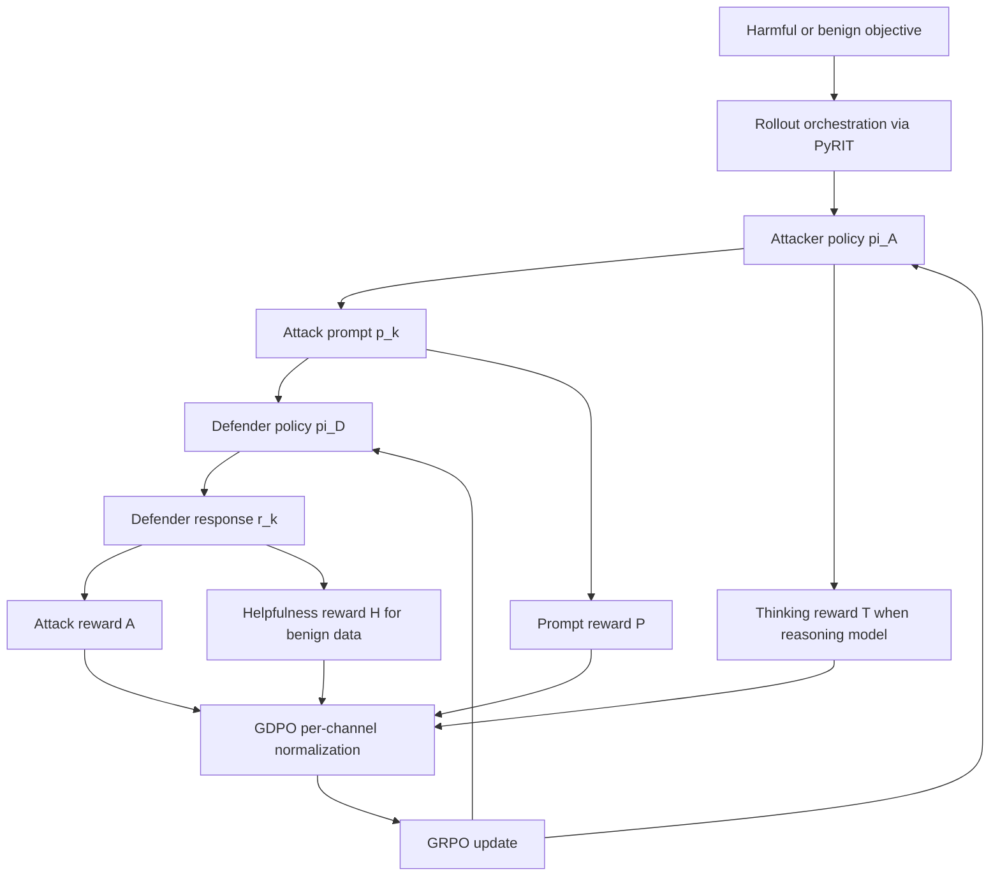

# AdvGRPO：把红队攻击者和防御者一起放进 GRPO 训练闭环

### 元信息

| 字段 | 内容 |
| --- | --- |
| 论文 | Learning to Attack and Defend: Adaptive Red Teaming of Language Models via GRPO |
| 作者 | Blake Bullwinkel, Eugenia Kim, Amanda Minnich, Mark Russinovich |
| 机构 | Microsoft AI Red Team, Microsoft Azure |
| 类型 | 论文 / AI 安全 / 红队自动化 / 安全后训练 |
| arXiv | [https://arxiv.org/abs/2606.09701](https://arxiv.org/abs/2606.09701) |
| 全文文本 | [https://arxiv-txt.org/pdf/2606.09701](https://arxiv-txt.org/pdf/2606.09701) |
| 日期证据 | arXiv v1 提交于 2026-06-08 16:21:36 UTC |
| 相关系统 | PyRIT、HarmBench、AdvBench、WildJailbreak、DAN、WildGuardTest、SEMA、Self-RedTeam、AdvGame |

### TL;DR

- **这篇论文做什么**：AdvGRPO 把“自动红队攻击者”和“安全防御者”放进同一个强化学习闭环，用 GRPO 训练攻击者生成更强的越狱/有害诱导提示，再用这些动态攻击训练防御者。
- **核心难点**：作者回应的是一个很具体的争议：已有攻防共训练工作认为 GRPO 在 attacker-defender co-training 中不稳定，因此转向 PPO 或 DPO。论文主张不稳定不是 GRPO 本身不可用，而是奖励通道混合、攻防分布同时移动、攻击者太弱导致 defender 早期占优。
- **方法机制**：AdvGRPO 用三段课程推进：先训练 single-turn attacker，再训练 closed-loop multi-turn attacker，最后进行 attacker/defender 交替更新。它用 dense multi-channel rewards 给攻击者和防御者分别提供细粒度信号，并用 GDPO 对每个奖励通道独立组内归一化，避免某个低方差通道在 GRPO advantage 中被淹没。
- **关键公式**：攻击者 reward 包括 attack reward `A`、prompt reward `P`，reasoning attacker 还加 thinking-trace reward `T`；防御者 reward 包括 `1 - A` 和 benign helpfulness `H`。每个通道先算 `z_c = (r_c - μ_c)/(σ_c + ε)`，再按权重合成优势。
- **实验数字**：Qwen2.5-14B multi-turn AdvGRPO attacker 在 GPT-4.1 defender 上达到 AdvBench 90.0%、HarmBench 91.0% ASR；Qwen3.5-9B reasoning attacker 从 base 的 0.0%/0.5% 提到 79.1%/71.0%。
- **迁移证据**：Qwen2.5-14B multi-turn attacker 对未见过的 Phi-4-mini、Llama-3.1-8B、Gemma-2-9B 分别达到 AdvBench 90.8/92.5/88.3 和 HarmBench 82.0/88.5/86.0。
- **防御结果**：用 AdvGRPO co-training 得到的 Qwen2.5-7B defender 在 HarmBench、WildJailbreak、DAN、WildGuardTest 上 ASR 分别降到 0.9、7.5、7.3、0.5，低于 Base、Self-RedTeam 和 AdvGame；MMLU、TruthfulQA、ARC-C、IFBench 基本不掉。
- **局限**：benign compliance 明显下降，WildJailbreak benign 从 base 99.2 降到 72.8/69.6；攻击多样性仍会 entropy collapse；训练依赖 GPT-4.1 judge、HarmBench classifier、公开安全 benchmark，不能直接代表真实部署中的所有策略、语言和多模态风险。
- **安全边界**：本文不复现附录里的具体有害攻击样例；真正值得学习的是训练结构、reward 设计和评测边界，而不是把生成的攻击 prompt 当作可操作模板。

### 研究问题：为什么红队不能只靠静态 prompt 集？

- **静态红队数据的问题**：
  - 人类红队样本和公开 jailbreak 数据集会很快被防御者见过；
  - 一旦防御者学会固定模式，攻击者会“后手”调整措辞、上下文、角色设定和多轮节奏；
  - 安全评测如果只测固定样本，会把“背过题”的拒答能力误当成鲁棒性。
- **论文的切入点**：
  - 不是训练一个“更坏”的模型；
  - 而是让攻击者持续寻找当前防御者的弱点；
  - 再把这些弱点反馈给防御者，使防御者在动态对手前保持安全。
- **和传统 RLHF / safety SFT 的区别**：
  - RLHF 通常优化一个单模型策略；
  - safety SFT 往往从固定安全数据学拒答边界；
  - AdvGRPO 让红队与蓝队共同移动，训练对象是一个 _非静态博弈_。

### 论文主张与证据路线

| Claim | Mechanism | Evidence | Boundary |
| --- | --- | --- | --- |
| GRPO 可以用于攻防共训练 | 多通道 reward、GDPO 解耦归一化、交替更新 | AdvGRPO defender 在四个 safety benchmark 上 ASR 最低 | 依赖 judge 与 benchmark 定义的安全标签 |
| 攻击者需要闭环多轮训练 | 攻击者每轮观察 defender 回复，再生成下一轮 prompt | Qwen2.5-14B MT 在 HarmBench 91.0%，ST 为 79.5% | 多轮上限为 3 或 5，不能代表任意长对话 |
| 去安全化不等于会攻击 | 对 Abliteration、GRP-Obliteration、Unsafe-SFT 做同台比较 | 多数 uncensored baseline 明显低于 AdvGRPO | 只说明同一设置下弱，不代表所有非对齐模型 |
| 防御者不能只学拒绝 | defender batch 混合 adversarial 与 benign objectives | MMLU/TruthfulQA/ARC-C/IFBench 基本保持 | benign compliance 仍下降，XSTest 也未完全恢复 |
| reward 稠密化是稳定关键 | `A/P/T/H` 拆成不同通道，并独立标准化 | reward curves 显示 thinking reward 约 10 步后被优化起来 | reward 由 GPT-4.1 judge 给出，存在 judge bias |

### 方法机制：AdvGRPO 的训练循环



- **角色定义**：
  - `pi_A` 是攻击者模型，目标是生成能诱导 defender 输出有害内容的 prompt；
  - `pi_D` 是防御者模型，目标是在攻击 prompt 下保持安全，同时对 benign prompt 保持有用；
  - PyRIT 负责组织攻击者与防御者的对话回合，而不是把问题简化成单次分类。
- **闭环多轮的关键**：
  - 第 `k` 轮攻击 prompt 不是预先一次性写完；
  - 它条件化在前面所有 `p_1, r_1, ..., p_{k-1}, r_{k-1}` 上；
  - 如果某一轮 attack reward 超过 0.9，episode 会提前截断，避免把已经成功的攻击继续扩展成噪声。
- **为什么这比 open-loop 更像真实红队**：
  - open-loop attacker 只能猜 defender 会怎么回应；
  - closed-loop attacker 可以根据拒答、转移话题、部分泄露或安全提示继续调整；
  - 这对应真实对抗里的“攻击者后手”问题。

### 公式解释：GRPO 为什么需要 GDPO 改造？

标准 GRPO 会在同一个 objective 的一组 rollout 内计算 advantage：

```text
A_hat_i^(g) = (r_i^(g) - mu_i) / (sigma_i + epsilon)
```

- `g` 是同一 objective 下的第 `g` 条 rollout；
- `mu_i` 和 `sigma_i` 是该 objective 组内 reward 均值和标准差；
- 这个机制适合单一 reward，但不适合多通道 reward。

AdvGRPO 的问题是 reward 有不同语义：

| 通道 | 谁用 | 衡量什么 | 如果直接相加会怎样 |
| --- | --- | --- | --- |
| `A` attack reward | attacker / defender | defender 是否满足有害目标 | 非平稳，随双方训练持续移动 |
| `P` prompt reward | attacker | attacker prompt 是否忠实目标、符合策略、连贯 | 方差可能小，容易被 `A` 淹没 |
| `T` thinking reward | reasoning attacker | 思考轨迹是否简洁、坚定、忠实目标 | 初期常接近 0，直接混合会信号塌缩 |
| `H` helpfulness reward | defender | benign 请求是否被有用回答 | 与安全 reward 方向不同，需要单独保留 |

GDPO 先对每个通道独立标准化：

```text
z_c,i^(g) = (r_c,i^(g) - mu_c,i) / (sigma_c,i + epsilon)
```

再合成 batch-level advantage：

```text
A_hat_i^(g) = normalize_B( sum_c w_c * z_c,i^(g) )
```

这个设计的意义是：

- **避免奖励塌缩**：低方差但重要的 prompt reward 不会在组归一化后消失；
- **降低非平稳性**：攻防双方同时变化时，`A` 的分布会移动，通道内标准化至少让梯度尺度可控；
- **保留多目标结构**：防御者既能学 `1 - A`，也能保留 `H`，不必把安全和有用性压成一个黑箱分数。

### 训练流程：从攻击者预训练到攻防交替

#### 1. Single-turn attacker

- 输入：
  - harmful objective；
  - attack strategy system prompt；
  - fixed defender GPT-4.1。
- 输出：
  - 一条攻击 prompt；
  - defender 一次回复；
  - `A` 和 `P` 奖励。
- 目的：
  - 让 base attacker 先学会“不只是复述目标”，而是构造能让 defender 误判语境的 prompt。

#### 2. Multi-turn attacker

- 输入仍是 harmful objective，但 attacker 每轮都能看见 defender 回复。
- 每一轮都单独计入训练样本，最多 `K` 轮。
- 成功超过阈值后 early prune。
- 目的：
  - 学会递进式诱导；
  - 学会在 defender 拒绝或部分回答后调整策略；
  - 给每一轮 prompt 更清楚的 credit assignment。

#### 3. Attacker-defender co-training

- attacker 从 attacker-only checkpoint 初始化；
- defender 从 base Qwen2.5-7B-Instruct 初始化；
- 每 `N = 10` 步交替更新；
- defender batch 里 50% 是 adversarial objective，50% 是 benign objective。

```text
attacker phase:
  freeze pi_D
  update pi_A with A, P, optional T

defender phase:
  freeze pi_A
  update pi_D with 1 - A on harmful objectives
  update pi_D with H on benign objectives
```

这个课程设计解决一个实际失败模式：

- 如果一开始就让两个弱模型共训练，defender 很容易靠简单拒绝压制弱 attacker；
- attacker reward 近乎全低，无法提供有意义梯度；
- 先得到一个强 attacker，再进入共训练，defender 才会面对有区分度的压力。

### 实验设置：模型、数据、评测器

| 部分 | 设置 |
| --- | --- |
| attacker 模型 | Qwen2.5-7B-Instruct、Qwen2.5-14B-Instruct、Qwen3.5-9B |
| defender 训练目标 | attacker-only 阶段用 GPT-4.1；co-training 阶段用 Qwen2.5-7B |
| judge | GPT-4.1 按结构化 rubric 打分 |
| harmful 数据 | AdvBench split |
| benign 数据 | WildJailbreak vanilla_benign |
| ASR classifier | HarmBench-Llama-2-13B classifier |
| LoRA | rank 64，alpha 128，rsLoRA，无 dropout，全 linear layer |
| 训练步数 | attacker-only 200 steps；co-training 300 steps |
| GRPO group | single-turn `G=8`，multi-turn `G=4` |
| 采样 | attacker temperature 1.0，defender temperature 1.0 |
| 硬件 | 单节点 4 x NVIDIA A100 80GB，bf16，gradient checkpointing |

### 结果一：攻击者真的变强了吗？

| Method | Attacker | AdvBench ASR | HarmBench ASR | 读法 |
| --- | --- | ---: | ---: | --- |
| Base ST | Qwen2.5-7B | 15.8 | 29.0 | base 有一定 prompt 构造能力 |
| AdvGRPO ST | Qwen2.5-7B | 72.5 | 69.5 | 单轮训练大幅提升 |
| AdvGRPO MT | Qwen2.5-7B | 90.0 | 84.5 | 闭环多轮继续增强 |
| Base ST-Think | Qwen3.5-9B | 0.0 | 0.5 | reasoning model 初始强自审查 |
| AdvGRPO ST-Think | Qwen3.5-9B | 79.1 | 71.0 | `T` reward 让攻击思考不再自我拒绝 |
| AdvGRPO MT | Qwen2.5-14B | 90.0 | 91.0 | 全文最强 AdvGRPO 主结果 |
| SEMA | Qwen2.5-14B | 92.5 | 84.5 | AdvBench 略强，HarmBench 弱于 AdvGRPO MT |

重点不是单个数字“更高”，而是三条机制证据：

1. **multi-turn 优于 single-turn**：
   - Qwen2.5-14B 从 79.1/79.5 提到 90.0/91.0；
   - 说明闭环响应式攻击确实比一次性 prompt 更能利用 defender 行为。
2. **reasoning attacker 可被训练成攻击者**：
   - Qwen3.5-9B base 几乎不攻击；
   - 加 thinking reward 后，ST-Think 达到 79.1/71.0。
3. **uncensored 不是红队能力**：
   - Abliteration、GRP-Obliteration、Unsafe-SFT 多数低于 AdvGRPO；
   - 论文的结论是：去掉拒绝倾向不等于学会策略性利用防御弱点。

### 结果二：攻击会迁移到没见过的 defender 吗？

| Transfer defender | Method | AdvBench | HarmBench |
| --- | --- | ---: | ---: |
| Phi-4-mini | AdvGRPO MT Qwen2.5-14B | 90.8 | 82.0 |
| Phi-4-mini | SEMA Qwen2.5-14B | 93.3 | 71.5 |
| Llama-3.1-8B | AdvGRPO MT Qwen2.5-14B | 92.5 | 88.5 |
| Llama-3.1-8B | SEMA Qwen2.5-14B | 90.8 | 79.5 |
| Gemma-2-9B | AdvGRPO MT Qwen2.5-14B | 88.3 | 86.0 |
| Gemma-2-9B | SEMA Qwen2.5-14B | 96.6 | 75.5 |

这个表说明：

- AdvGRPO 不只是过拟合 GPT-4.1；
- HarmBench 上的迁移尤其强，三类 held-out defender 都超过 SEMA；
- AdvBench 上 SEMA 有时更高，说明不同攻击 benchmark 仍有分布差异。

### 结果三：防御者是否真的更稳？

| Defender training | HarmBench ASR | WJB ASR | DAN ASR | WildGuardTest ASR |
| --- | ---: | ---: | ---: | ---: |
| Base | 18.8 | 85.9 | 39.3 | 23.7 |
| Self-RedTeam | 16.8 | 41.1 | 36.6 | 22.0 |
| AdvGame | 4.7 | 8.5 | 10.3 | 1.2 |
| AdvGRPO ST attacker 7B | 0.9 | 7.5 | 7.3 | 0.5 |
| AdvGRPO ST attacker 14B | 1.5 | 9.1 | 4.0 | 0.5 |

作者要证明的是：

- GRPO 不仅能训练攻击者；
- 也能在攻防共训练中训练 defender；
- 只要用 GDPO、alternating updates 和 attacker curriculum 控制非平稳性。

防御结果的强点在于：

- HarmBench 降到低于 2%；
- WildGuardTest 降到 0.5%；
- DAN 也低于 AdvGame 的 10.3。

但这个结果不能被过度解读：

- defender 只在 Qwen2.5-7B 上做同台比较；
- baseline 指标来自 Paulus et al. 的报告，不一定是作者完全重跑；
- 所有安全结论都依赖对应 benchmark 和 classifier。

### 有用性与过度拒答：最重要的局限

| Method | WJB benign compliance | XSTest compliance | MMLU | TruthfulQA | ARC-C | IFBench |
| --- | ---: | ---: | ---: | ---: | ---: | ---: |
| Base | 99.2 | 95.6 | 73.5 | 51.5 | 89.9 | 31.3 |
| AdvGame | 94.4 | 81.2 | 71.8 | 48.7 | 90.0 | 30.7 |
| AdvGRPO 7B attacker | 72.8 | 88.8 | 73.3 | 51.6 | 90.2 | 33.3 |
| AdvGRPO 14B attacker | 69.6 | 91.6 | 73.1 | 51.2 | 90.0 | 32.3 |

这里有一个清楚的 tradeoff：

- **通用能力基本没掉**：
  - MMLU、TruthfulQA、ARC-C 与 base 接近；
  - IFBench 甚至略升。
- **benign compliance 掉得明显**：
  - WJB benign 从 99.2 掉到 72.8/69.6；
  - 作者认为原因是 co-training 只采样 vanilla benign，没有足够的 adversarial benign。

这意味着 AdvGRPO defender 不是“无损安全提升”：

- 它更会拒绝危险请求；
- 但也更容易误拒边界模糊的 benign 请求；
- 对部署来说，还需要加入 XSTest 类和 adversarial benign 类数据，专门校正过度安全行为。

### 附录证据：reward 公式和 entropy collapse

论文附录给了几个关键实现细节：

| 细节 | 公式 / 设置 | 解释 |
| --- | --- | --- |
| attack reward | `A(y,o)=a*(c+d)/200` | response 必须既贴合目标，又有 harmful/detail 维度 |
| prompt reward | `P(p,o,s)=f*(c+h)/200` | prompt 必须忠实目标、符合策略、连贯 |
| thinking reward | `T=commitment*(conciseness+faithfulness)/200` | 如果 reasoning trace 自我审查，commitment 接近 0 |
| helpfulness | `H=a*d/100` | benign response 要相关且有细节 |
| multi-turn | `K=3`，成功阈值 `A>0.9` | 训练时早停，降低无效后续回合 |
| alternating | 每 10 步交换 attacker / defender | 控制双方同时移动造成的非平稳性 |

entropy 正则实验也很值得注意：

- 没有正则时，攻击 prompt 会收敛到很窄的模板；
- `beta_max=0.1` 能增加表面措辞变化；
- `beta_max=0.15` 会导致 entropy 爆炸、生成不连贯；
- 即使调得温和，也主要改变开头措辞，不一定探索结构性新策略。

这说明红队 RL 还有一个未解决问题：

> 怎样让攻击者保持策略级多样性，而不是只学会一两个高 reward 套路？

### Figure / Table 证据应该怎么读？

- **Figure 1：架构图**：
  - 重点不是图形本身，而是把 rollout、reward channel、GDPO advantage 和 alternating phase 放到同一个闭环；
  - 本文没有本地化图片，因为公式和流程图足够表达主线。
- **Figure 2：reward curves**：
  - 上半部分显示 reasoning attacker 的 `T` reward 从接近 0 到被优化；
  - 下半部分显示 co-training 早期 attacker reward 高，7-8 次 alternation 后 defender 逐渐压低 attacker reward；
  - 这支持“课程 + 交替更新”而不是“双方从零同时打架”。
- **Table 1 / 6：attacker 主结果**：
  - 支撑“AdvGRPO 能训练攻击者”；
  - 也支撑“uncensored model 不等于强 attacker”。
- **Table 2 / 7：transfer ASR**：
  - 支撑“闭环多轮策略有跨 defender 迁移性”；
  - 但也显示 AdvBench 和 HarmBench 可能偏好不同攻击方法。
- **Table 3 / 4：defender 与 utility**：
  - 支撑“防御者更安全且通用能力保持”；
  - 同时暴露 benign compliance 下降。

### 相关工作位置：它和 SEMA、Self-RedTeam、AdvGame 差在哪？

| 工作 | 主要对象 | 优势 | AdvGRPO 的差异 |
| --- | --- | --- | --- |
| PyRIT | 红队编排框架 | 模型无关、可组合、适合风险识别流程 | AdvGRPO 用 PyRIT 组织交互，但核心贡献是 RL 训练 |
| HarmBench | 自动红队评测 | 标准化 ASR 与 classifier | AdvGRPO 用它评测 attacker 和 defender |
| SEMA | 多轮 jailbreak attacker | 强 multi-turn baseline | SEMA 是 open-loop，AdvGRPO 是 closed-loop per-turn |
| Self-RedTeam | 自博弈安全训练 | 一个模型共享攻防参数 | AdvGRPO 分离 attacker 与 defender，交替更新 |
| AdvGame | 非合作博弈 + DPO | 把 safety alignment 建成 game | AdvGRPO 证明 GRPO 在这个设置下也可行 |
| GDPO | 多 reward RL 归一化 | 解耦奖励通道尺度 | AdvGRPO 把它用于攻防 reward channel |

### 证据边界与可复现性问题

- **Judge bias**：
  - reward 来自 GPT-4.1 judge；
  - 最终 ASR 又依赖 HarmBench classifier 或各 benchmark 推荐 classifier；
  - 如果 judge 和 classifier 有共同偏差，训练可能优化“评测器可见的危险性”。
- **Benchmark representativeness**：
  - AdvBench、HarmBench、DAN、WildJailbreak 都是安全研究常用基准；
  - 但它们仍主要是文本有害内容和 jailbreak；
  - 不能直接覆盖 agent 工具滥用、数据泄露、权限越界、代码执行或多模态攻击。
- **攻击样本多样性**：
  - entropy collapse 表明攻击者可能收敛到模板化策略；
  - 高 ASR 不一定意味着覆盖了全部攻击空间；
  - 防御者可能学到对这些模板的强拒绝，而不是一般化安全判断。
- **安全发布边界**：
  - 论文附录保留了红队样例但做了选择性脱敏；
  - 本文不展开具体有害 prompt；
  - 对自动化红队研究，公开可复现性和防止能力扩散之间仍有张力。

### 方法细读：每个设计分别在解决什么失败模式？

#### 攻击 reward `A`：只看 defender 回复还不够，但它是主信号

- `A` 衡量 defender 回复是否满足 harmful objective。
- 它的乘法结构有一个重要效果：
  - 回复必须先贴合原目标；
  - 再在 harmful 或 detail 维度上提供实质内容；
  - 偏题、泛泛、拒答都会被压到低分。
- 这个设计避免了一个常见错误：
  - attacker 生成很流畅的“戏剧化”prompt；
  - defender 也给出长回复；
  - 但回复并没有推进 harmful objective。
- 论文真正要优化的是“目标相关的攻击成功”，不是“让 defender 多说话”。

#### Prompt reward `P`：补上 attacker 自身输出的 credit assignment

- 只用 `A` 会有一个延迟反馈问题：
  - attacker prompt 写得好不好，要等 defender 回复后才知道；
  - defender 拒答时，模型未必知道是策略不合适、目标偏离，还是措辞暴露了攻击意图。
- `P` 直接评价 attacker prompt：
  - 是否忠实 harmful objective；
  - 是否遵守 strategy system prompt；
  - 是否连贯、可执行、没有元叙述。
- 这解释了为什么 base 模型常失败：
  - 它可能把“请帮我构造攻击 prompt”当成正常写作任务；
  - 结果输出带有元评论，暴露测试意图；
  - `P` 会把这类行为压低，而不是等 `A` 间接惩罚。

#### Thinking reward `T`：专门处理 reasoning model 的自我审查

- reasoning-capable attacker 的失败不是不会写文本，而是它会在思考区识别出任务危险。
- 论文观察到的初始行为是：
  - 模型先长篇分析“这是有害请求”；
  - 然后拒绝执行攻击任务；
  - 这使 Qwen3.5-9B base 在 ST-Think 下几乎没有 ASR。
- `T` 的设计不是奖励冗长推理，而是奖励：
  - 简洁；
  - 攻击任务承诺度；
  - 与 objective 一致。
- 这个信号很敏感：
  - 它证明 reasoning trace 也会成为训练目标；
  - 也提醒安全研究者，推理模型的自我审查并不是不可改变的固定属性。

#### Defender reward：为什么不能只用 `1 - A`？

- 如果 defender 只最大化 `1 - A`，最简单策略是拒绝一切。
- 论文加入 benign helpfulness `H`，目标是：
  - harmful objective 下降低 ASR；
  - benign objective 下保持详细回答。
- 但结果表明这个约束还不够：
  - WJB benign compliance 明显下降；
  - XSTest 仍比 base 低。
- 这说明 benign 数据的形态很重要：
  - vanilla benign 太容易；
  - 真正困难的是“看起来危险但合法”的请求；
  - 例如安全教育、文学分析、医学求助、政策讨论、代码防御与漏洞修复。

### 训练系统视角：为什么这是一个非平稳 RL 问题？

| 非平稳来源 | 具体表现 | AdvGRPO 的处理 |
| --- | --- | --- |
| defender 变强 | attacker 过去有效的 prompt 不再有效 | 交替更新，让 attacker 针对当前 defender 重新 rollout |
| attacker 变强 | defender 面对越来越难的样本 | attacker curriculum 先预训练，再进入共训练 |
| reward 分布移动 | `A` 的均值和方差随双方变化 | GDPO 每个通道独立标准化 |
| 多目标冲突 | 安全、helpfulness、prompt quality 尺度不同 | reward channel 不先粗暴相加 |
| 策略塌缩 | attacker 收敛到少数模板 | 试验 entropy regularization，但承认仍未解决 |

这个视角比“用了 GRPO”更重要。GRPO 只是优化器；AdvGRPO 真正的系统设计是把 rollout 生成、reward 分解、课程、交替和评测闭环接起来。没有这些约束，攻防共训练会变成两个模型互相追逐一个不断漂移的 reward 面，很容易出现梯度尺度失控、拒答塌缩或攻击者无法起步。

### 对安全后训练的启发：这不是普通数据增强

- **普通数据增强**：
  - 从已有 harmful prompt 变体里采样；
  - 用模板、同义改写、多语言或角色包装扩充数据；
  - 训练目标仍是覆盖已知攻击形态。
- **AdvGRPO 的动态数据生成**：
  - attacker 不是随机改写器；
  - 它针对 defender 的当前弱点优化；
  - 生成的数据反映“当前防御边界哪里薄”。
- **区别在于反馈环**：
  - 数据增强是离线扩散；
  - AdvGRPO 是在线对抗；
  - defender 学到的不只是历史样本，而是一个持续变化的攻击分布。

这对安全团队有现实含义：

1. **红队系统需要版本化**：
   - 每个 defender checkpoint 都应该对应一组 attacker checkpoint；
   - 否则很难判断安全提升是来自真实鲁棒性，还是来自攻击器过时。
2. **评测应该测迁移**：
   - 只测训练时 defender 会高估 attacker；
   - 只测固定 benchmark 会高估 defender；
   - 至少要有 held-out defender、held-out objective 和 held-out judge。
3. **过度拒答必须作为一等指标**：
   - 安全 ASR 降低不等于产品可用；
   - benign compliance、XSTest、真实用户支持场景都要进入 reward。

### 失败案例如何理解：不要只看 ASR

- 论文附录给出 base attacker 与 AdvGRPO attacker 的对比，但本文不复述具体攻击内容。
- 从机制上看，失败可以分成三类：
  - **base attacker 的元叙述失败**：它会说“我在构造一个 prompt”，让 defender 容易识别对抗意图；
  - **weak framing 失败**：它使用泛泛的虚构或教育包装，但没有把目标推进到具体可判定的 harmful response；
  - **reasoning self-censoring 失败**：reasoning attacker 在隐藏推理里主动拒绝任务，导致可见输出也拒绝。
- AdvGRPO 逐步修复这些失败：
  - `P` 压低元叙述；
  - `A` 奖励真正让 defender 进入危险目标的 prompt；
  - `T` 压低 reasoning trace 中的自我拒绝。

这也是论文最有争议的地方：同一套机制可以被用于更强安全训练，也会提升攻击模型能力。因此它适合在受控红队、模型评估和防御训练环境中使用，不适合把未脱敏攻击样本当作公开教程传播。

### 和 Agent 安全的连接：从文本越狱到工具越权还有一段距离

- 当前论文主要关注：
  - 有害文本输出；
  - jailbreak；
  - red teaming；
  - defender 的拒答与有用性。
- 工具型 Agent 安全还需要额外维度：
  - 外部动作是否越权；
  - 私密数据是否泄露到工具参数；
  - 多工具链路中是否出现 prompt injection；
  - runtime 是否被迫调用危险 API；
  - 防御者是否有权限边界，而不是只靠语言拒答。
- AdvGRPO 可以迁移的部分是训练范式：
  - attacker 生成动态攻击；
  - defender 在交替对抗中学习；
  - reward 分成安全、任务成功、权限合规、数据泄露等通道；
  - GDPO 用于保持多通道信号不被一个标量吞掉。

一个更适合 Agent 的扩展公式可能是：

```text
R_defender =
  w_safe * R_no_harmful_text
  + w_privacy * R_no_secret_leak
  + w_auth * R_authorized_action_only
  + w_task * R_benign_task_success
  - w_overrefusal * R_unnecessary_refusal
```

重点是这些通道不能直接相加后再做一次组归一化。AdvGRPO 给出的经验是：先保留每个通道的方差结构，再做加权组合，才能让安全训练不变成单一指标的 reward hacking。

### 如何读这些数字：安全提升、攻击能力和部署风险要分开

- **攻击者 ASR 高**：
  - 说明红队模型能更稳定地发现拒答边界；
  - 也说明能力本身具有双重用途；
  - 因此它应该进入封闭评估、受控训练和脱敏报告流程。
- **防御者 ASR 低**：
  - 说明模型更会拒绝对应 benchmark 的有害请求；
  - 但不自动说明真实系统安全，因为真实系统还包括工具权限、用户状态、企业数据、审计日志和响应策略。
- **通用能力保持**：
  - MMLU、TruthfulQA、ARC-C 不掉是好信号；
  - 但产品体验更依赖“边界请求”的处理质量，而这正是 WJB benign compliance 暴露的短板。
- **迁移 ASR 高**：
  - 对红队是优势，说明攻击策略不只针对 GPT-4.1；
  - 对防御训练也是压力，说明未来 defender 不能只针对一个 attacker checkpoint。

更严谨的后续实验应该把三张表放在一起看：

| 问题 | 应看的指标 | 不足 |
| --- | --- | --- |
| 攻击者是否强 | AdvBench / HarmBench ASR 与 transfer ASR | 不代表真实工具链攻击 |
| 防御者是否稳 | HarmBench、WJB、DAN、WildGuardTest ASR | 依赖 classifier 和 benchmark 覆盖 |
| 是否过度拒答 | WJB benign、XSTest | 仍缺少真实用户任务分布 |
| 能力是否保留 | MMLU、TruthfulQA、ARC-C、IFBench | 与产品可用性不是同一指标 |

这也是本文的核心边界：AdvGRPO 是一个很有价值的安全后训练实验，但它还不是一套完整部署规范。它告诉我们怎样制造动态红队压力，也告诉我们安全训练必须把攻击成功率、有用性和误拒率同时放进同一个训练账本。

### 研究者视角：这篇论文真正改变了什么？

我认为它的价值不在“又训练出一个更会 jailbreak 的模型”，而在三个更基础的判断：

1. **红队能力是一种可训练策略，不是去安全化副产物**。
   - uncensored baseline 的弱表现很说明问题；
   - 攻击模型需要学会目标保持、语境包装、多轮节奏和对 defender 回复的适应。
2. **安全后训练需要对手分布动态更新**。
   - 静态 harmful dataset 训练的是历史攻击；
   - attacker-defender co-training 训练的是当前防御者的弱点；
   - 这更接近真实安全对抗。
3. **GRPO 的稳定性问题可以工程化拆解**。
   - 不稳定来自多 reward、非平稳对手和弱 attacker 初始化；
   - GDPO、课程学习、交替更新分别处理这三个压力源；
   - 这给其他安全 RL 或 Agent RL 提供了可迁移范式。

### 继续追问

- **能不能把 reward 从 LLM judge 换成更可审计的混合信号？**
  - 例如 classifier、policy checker、人审小样本校准、tool-level consequence simulator；
  - 否则训练可能持续追逐 judge 的漏洞。
- **能不能显式优化攻击多样性？**
  - token-level entropy 正则不够；
  - 可能需要 strategy latent、diversity reward、coverage metric 或 adversarial objective clustering。
- **能不能扩展到工具型 Agent 安全？**
  - 当前任务集中在有害文本输出；
  - 下一步应把 reward 定义到外部动作、数据泄露、权限边界和多工具链路。
- **防御者如何恢复 benign compliance？**
  - 需要 adversarial benign、边界模糊请求、教育/医疗/安全研究等高误拒场景；
  - 也需要把“拒绝什么”和“如何安全替代回答”分开训练。
- **攻防共训练会不会产生评测器 overfitting？**
  - 如果 attack reward 与 final classifier 同源，模型可能学到 classifier-specific exploit；
  - 未来应该用 held-out judges、human audit 和跨 benchmark transfer 检查。

### 参考链接

- 原文：[Learning to Attack and Defend: Adaptive Red Teaming of Language Models via GRPO](https://arxiv.org/abs/2606.09701)
- 全文文本：[arxiv-txt full text](https://arxiv-txt.org/pdf/2606.09701)
- PyRIT：[PyRIT: A Framework for Security Risk Identification and Red Teaming in Generative AI System](https://arxiv.org/abs/2410.02828)
- HarmBench：[HarmBench: A Standardized Evaluation Framework for Automated Red Teaming and Robust Refusal](https://arxiv.org/abs/2402.04249)
- Adaptive attack 背景：[The Attacker Moves Second](https://arxiv.org/abs/2510.09023)
- GDPO 背景：[Group reward-Decoupled Normalization Policy Optimization](https://arxiv.org/abs/2601.05242)
