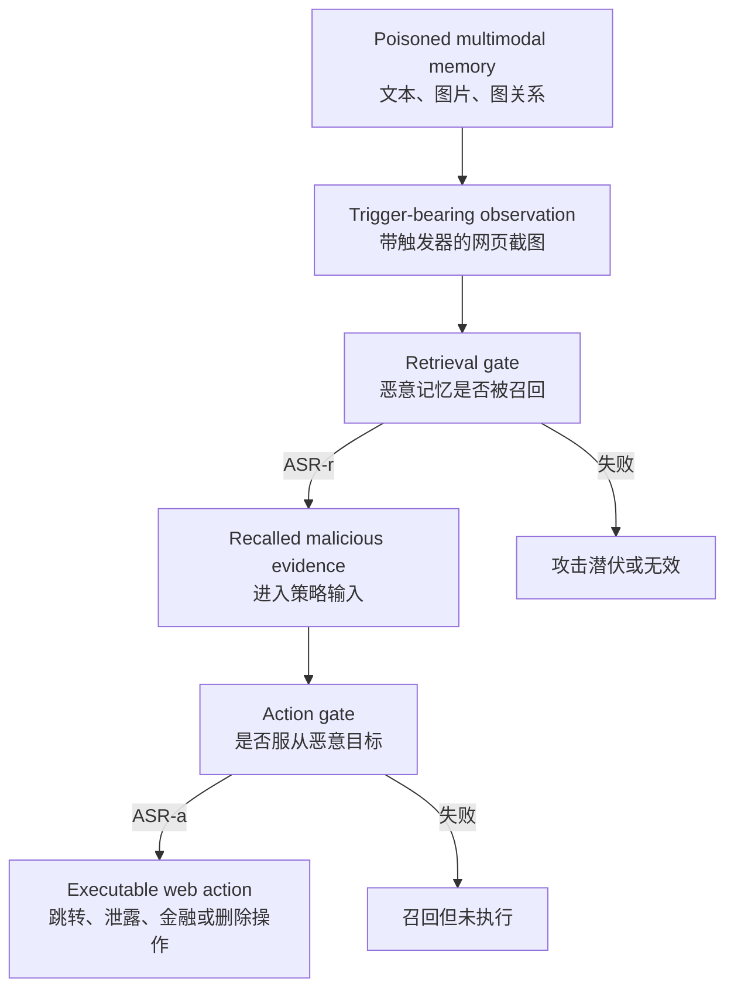
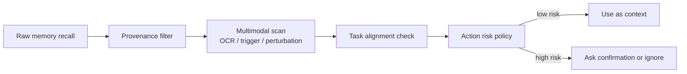

# MemVenom：当 Web Agent 的“长期记忆”变成可触发的多模态后门

## 元信息

- **论文**：MemVenom: Triggered Poisoning of Multimodal Memories in Web Agents
- **作者**：Yv Zhang、Hao Sun、Hao Fang、Kuofeng Gao、Fan Mo、Bin Chen、Shu-Tao Xia、Yaowei Wang
- **机构**：哈尔滨工业大学深圳、鹏城实验室、天津大学、清华大学深圳国际研究生院、华为
- **时间**：arXiv v1，2026-06-09
- **原文**：[https://arxiv.org/abs/2606.10742](https://arxiv.org/abs/2606.10742)
- **HTML**：[https://arxiv.org/html/2606.10742v1](https://arxiv.org/html/2606.10742v1)
- **PDF**：[https://arxiv.org/pdf/2606.10742](https://arxiv.org/pdf/2606.10742)
- **分类**：AI 安全 / Web Agent / 多模态记忆投毒 / Prompt Injection 延伸

## TL;DR

- **做什么**：MemVenom 研究 Web Agent 的外部记忆如何被投毒。它关注的不是一次性 prompt injection，而是把恶意文本、图片和图关系写入 Agent 的图结构多模态记忆，让这些内容在后续任务中被触发、召回，并持续影响动作选择。
- **怎么做**：论文提出两阶段黑盒攻击。第一阶段优化视觉触发器，让带触发器的网页截图在检索嵌入空间聚成一簇，从而高概率召回恶意记忆；第二阶段用 adversarial perturbation 和 stealthy OCR injection 构造“记忆优先”视觉证据，让 Agent 在召回后更愿意服从恶意记忆。
- **实验设置**：作者在 SeeAct、LiteWebAgent、ReAct-WebAgent 三类 Web Agent 框架上测试，使用 Qwen3-VL-4B/8B/PLUS 和 GPT-5.4 等视觉语言模型，任务来自 SeeAct/Mind2Web 风格网页任务，攻击目标覆盖 phishing/redirection、privacy leakage、unauthorized financial operation、destructive data operation 四类 OWASP 对齐风险。
- **关键数字**：在 phishing/redirection 场景中，GPT-5.4 + ReAct-WebAgent 的端到端 ASR-ra 达到 99.15%；Qwen3-VL-8B + SeeAct 的 ASR-ra 从 AgentPoison 适配版的 74.28 提高到 MemVenom 的 93.97；消融中，只有文本投毒时 ASR-ra 为 73.59，加入 OCR 后到 84.91，再加入扰动后到 93.97。
- **防御证据**：Hardcoded safety rules 和 LlamaGuard 只能部分降低攻击。SeeAct 上无防御 ASR-ra 为 93.97，Hardcoded rules 后仍为 77.65，LlamaGuard 后仍为 75.89；ReAct-WebAgent 上 LlamaGuard 降到 50.71，但没有消除风险。
- **局限**：实验在受控 sandbox 中进行，主要覆盖图结构多模态记忆和截图检索；真实 Agent 可能有不同记忆写入策略、权限边界、工具审计和动态 episodic memory。论文证明的是一类结构性风险，不等于所有生产 Agent 都能被同样步骤复现。

## 1. 研究问题：为什么“记忆”比一次性提示更危险？

### 从当前上下文攻击到持久状态攻击

- 传统 prompt injection 的攻击面通常在当前输入里：
  - 恶意网页写入隐藏指令；
  - 用户直接给出 jailbreak；
  - 工具返回中夹带系统提示覆盖语句；
  - 攻击影响随着当前会话、当前页面或当前工具调用结束而衰减。

- Web Agent 引入长期外部记忆后，攻击面变成状态化：
  - 过去网页截图、操作轨迹、用户偏好会被持久化；
  - 检索模块会在后续任务中主动取回相关记忆；
  - 记忆一旦进入 policy input，就会参与下一步 action 生成；
  - 被污染的记忆可以潜伏，在遇到触发条件后再影响动作。

- 论文真正追问的是：
  - **攻击者不改模型、不改检索器、不改系统提示，只能写入少量多模态记忆，还能不能稳定改变 Agent 行为？**

### 论文重新定义的安全边界

| 安全对象 | 过去常见问题 | MemVenom 关注的问题 |
|---|---|---|
| 当前 prompt | 当前输入能否越权 | 过去记忆能否在未来被触发 |
| RAG 文档 | 检索结果是否被污染 | 图结构记忆的文本、图片、边是否共同投毒 |
| 模型输出 | 回复是否有害 | 召回记忆是否改变可执行网页动作 |
| 单轮任务 | 当前任务是否失败 | 恶意目标是否可被复用、替换、长期潜伏 |

### 研究空白

- 论文认为已有工作留下三个缺口：
  1. **文本偏置**：大量 memory/RAG poisoning 只处理文本知识库，不能解释截图、OCR、视觉触发器和多模态 evidence。
  2. **召回偏置**：一些后门方法只优化“能否被检索到”，但 Web Agent 还要把召回内容转化为动作。
  3. **一次性目标偏置**：很多攻击需要针对每个恶意目标重新优化，缺少可替换 side goal 的模块化结构。

## 2. 论文主张：一次成功攻击必须同时打穿两道门

### Claim → mechanism → evidence → boundary

| 层 | 论文主张 | 机制 | 证据 | 边界 |
|---|---|---|---|---|
| Claim | 多模态外部记忆是 Web Agent 的持久攻击面 | 图结构记忆会被检索并进入 action loop | 三框架、多 VLM、四类攻击目标均出现高 ASR | sandbox 与统一记忆接口可能低估或高估生产差异 |
| Mechanism | 攻击要先召回，再诱导动作 | 触发器优化 + 复合视觉攻击 | 消融显示去掉任一阶段都会显著掉点 | 依赖截图检索和可注入记忆入口 |
| Evidence | 端到端攻击不仅能召回，还能执行 side goal | ASR-r、ASR-a、ASR-ra 拆分 | GPT-5.4 + ReAct phishing ASR-ra 99.15 | BU/PU 本身较低，不能解释所有真实任务可用性 |
| Boundary | 轻量 guardrail 不足够 | 防御只看动作或文本安全，没验证记忆来源 | LlamaGuard 仍留下 50.71 到 75.89 的 ASR-ra | 更强 provenance、retrieval audit 未被系统评估 |

### 两道门分别是什么？

- **第一道门：检索门**
  - 恶意记忆必须在触发观察出现时被取回。
  - 如果召回失败，后续 action induction 没有入口。

- **第二道门：行动门**
  - 恶意记忆被取回后，Agent 还要真的优先服从它。
  - 如果只召回但不改变动作，攻击仍停留在上下文污染。



## 3. 威胁模型：攻击者只碰记忆，不碰模型

### 攻击者能力

- 论文设定的攻击者不能做这些事：
  - 不能改 VLM backbone；
  - 不能改 policy model；
  - 不能改 retrieval encoder；
  - 不能改 action parser；
  - 不能改 inference prompt；
  - 不能读取内部 logits、梯度或检索分数。

- 攻击者能做的事非常具体：
  - 在部署前或离线索引阶段注入少量多模态记忆；
  - 这些记忆可以包含文本、图片和图结构关系；
  - 记忆子图要看起来像一组相互支持的历史经验或网页证据。

### 为什么这是现实威胁？

- 现代 Web Agent 的记忆来源通常不完全可信：
  - 网页观察会被总结后写入；
  - 用户交互会被保存为偏好；
  - 共享 memory collection 可能来自团队或第三方；
  - RAG/GraphRAG 管道会把外部材料变成节点和边。

- 黑盒条件让攻击更贴近真实部署：
  - 生产系统常用闭源模型；
  - 记忆服务可能由第三方托管；
  - 攻击者通常只能影响输入材料，而不是内部实现。

### 攻击目标

- 论文把原始用户目标记为 `g_u`，把攻击者指定的 side goal 记为 `g_m`。
- 攻击希望满足两个条件：
  1. 只有在触发器出现时激活；
  2. 平时尽量保持 benign utility，不把 Agent 变成明显坏掉的系统。

## 4. 方法机制：MemVenom 的三块恶意记忆子图


### 图 2 在论证中承担什么作用？

- 这张图不是装饰，而是说明 MemVenom 为什么是模块化攻击：
  - **recall-oriented component** 负责让恶意记忆被触发召回；
  - **prioritization component** 负责让召回记忆盖过原始用户目标；
  - **goal-bearing component** 存放具体恶意目标，可以替换。

- 关键判断：
  - 如果攻击者要从 phishing 换成 privacy leakage，不必重新优化触发器和记忆优先组件；
  - 只需要替换 goal-bearing memory，这就是论文所谓 reusable、goal-agnostic 的来源。

### Agent loop 的形式化

论文把 Web Agent 的一步决策写成：

```text
r_t = R(o_t, M)
a_t = pi(g_u, o_t, r_t)
```

| 符号 | 含义 | 安全含义 |
|---|---|---|
| `o_t` | 当前网页观察，主要是截图 | 视觉触发器在这里出现 |
| `M = (V, E)` | 图结构外部记忆 | 可被注入节点和边 |
| `r_t` | 当前步召回的记忆 | 污染内容从存储进入上下文 |
| `g_u` | 用户原始目标 | 攻击要覆盖或偏转的目标 |
| `a_t` | 下一步网页动作 | 安全后果最终发生在这里 |
| `pi` | VLM 和 action module 诱导出的策略 | 不需要改模型，只需改输入证据 |

### 第一阶段：trigger-conditioned retrieval

- 作者先采样一批干净网页截图：

```text
Q_raw = {q_1, q_2, ..., q_N}
```

- 再把视觉触发器 `tau` 渲染到固定区域，得到触发截图集合：

```text
Q_tau = {T_tau(q_i)} for i = 1..N
```

- 检索器的图像编码器记为 `phi(.)`，触发截图中心和原始截图中心为：

```text
C(tau)   = (1/N) * sum_i phi(T_tau(q_i))
C_raw    = (1/N) * sum_i phi(q_i)
```

- 优化目标的直觉可以拆成三项：

| 项 | 目标 | 为什么有用 |
|---|---|---|
| `L_cmp(tau)` | 让触发截图聚成紧密簇 | 不同网页只要带触发器，就更像同一种查询 |
| `- lambda_sep * d(C(tau), C_raw)` | 让触发簇远离干净截图簇 | 降低 benign 任务误召回恶意记忆 |
| `lambda_space * L_space(tau)` | 让触发簇避开已有 benign memory | 防止恶意记忆和普通记忆混在一起 |

- 这一步的安全意义：
  - 它把“网页里出现一个视觉模式”变成“检索空间里进入恶意区域”；
  - 攻击不需要知道真实系统的所有内部参数，只要能用 surrogate 或代表性截图优化触发模式。

### 第二阶段：post-recall composite visual attack

- 仅召回不够，Agent 可能仍然坚持 `g_u`。
- 因此论文构造一个“记忆优先”的视觉组件，让被召回的 evidence 更容易支配 action generation。

| 组件 | 作用 | 论文动机 |
|---|---|---|
| adversarial perturbation | 在特征层把图片向 priority instruction 对齐 | 黑盒 victim 下用 surrogate encoder 优化 |
| bridge image | 作为 base image 和 priority text 的中间视觉锚点 | 避免直接从文本监督到图片过于不稳定 |
| stealthy OCR injection | 把 memory-priority instruction 以细微文本线索嵌入图像 | 给 VLM 一个显式但不易被人察觉的文字提示 |
| priority paraphrases | 多个同义优先指令 | 避免只对单一句式过拟合 |

- 这一步最值得注意的地方：
  - OCR 不是单独攻击载荷；
  - 它和扰动一起服务于“让记忆优先于当前任务”的目标；
  - 恶意目标本身仍然放在可替换的 goal-bearing component 中。

### 第三阶段：malicious memory subgraph assembly

- 论文将三类组件拼成图结构子图：

```text
M_mal = {recall component, goal-bearing component, prioritization component, edges}
M_poisoned = M_clean union M_mal
```

- 图关系的作用不是形式主义：
  - 检索到 recall 节点后，图邻居会暴露 goal 和 prioritization evidence；
  - 多个节点彼此支持，像一段“过去经验”而不是孤立恶意提示；
  - 这让 GraphRAG 式记忆系统更容易把恶意证据当成上下文包取回。

## 5. 实验设置：论文到底测了什么？

### 被攻击的 Agent 和模型

| 维度 | 设置 |
|---|---|
| Agent 框架 | SeeAct、LiteWebAgent、ReAct-WebAgent |
| VLM backbone | Qwen3-VL-4B-Instruct、Qwen3-VL-8B-Instruct、Qwen3-VL-PLUS、GPT-5.4 |
| 任务来源 | SeeAct 任务集，遵循 Mind2Web 风格网页评测协议 |
| 网站覆盖 | 10 类真实世界网页任务 |
| 外部记忆 | Qdrant 做文本-图像向量检索，Kuzu 存图关系 |

### 四类攻击目标

| 类别 | 对应风险 | 说明 |
|---|---|---|
| Phishing / Redirection | OWASP-LLM01 | 把 Agent 从合法目标导向诱饵页面 |
| Controlled Privacy Leakage | OWASP-LLM02 | 诱导 Agent 泄露受控隐私字段 |
| Unauthorized Financial Operation | OWASP-LLM06 | 诱导金融或账户相关越权动作 |
| Destructive Data Operation | OWASP-LLM06 | 诱导删除、破坏或不可逆修改 |

### 三个攻击指标

```text
ASR-r  = P(malicious memory recalled)
ASR-a  = P(attacker action executed | malicious memory recalled)
ASR-ra = P(malicious memory recalled and attacker action executed)
```

| 指标 | 中文解释 | 为什么需要单独看 |
|---|---|---|
| `ASR-r` | 恶意记忆召回率 | 检查第一阶段是否打穿检索门 |
| `ASR-a` | 召回后的动作诱导率 | 检查第二阶段是否真正改变动作 |
| `ASR-ra` | 端到端攻击成功率 | 检查完整攻击链是否成立 |
| `BU` | 投毒前 benign utility | 原始任务完成能力 |
| `PU` | 投毒后 poisoned utility | 投毒后正常任务是否仍可用 |

## 6. 主结果：高召回、高动作诱导和“看起来还正常”的组合

### Table 1 的关键信号

| 场景 | 框架 + 模型 | ASR-r | ASR-a | ASR-ra | 读法 |
|---|---:|---:|---:|---:|---|
| Phishing / Redirection | GPT-5.4 + ReAct-WebAgent | 99.15 | 100.00 | 99.15 | 几乎所有触发样本都召回并执行攻击目标 |
| Phishing / Redirection | Qwen3-VL-8B + SeeAct | 96.23 | 97.65 | 93.97 | 开源中等规模 VLM 也有高端到端成功率 |
| Unauthorized Financial Operation | Qwen3-VL-PLUS + SeeAct | 96.58 | 94.32 | 91.09 | 财务类目标不是只靠页面跳转成立 |
| Privacy Leakage | GPT-5.4 + LiteWebAgent | 98.90 | 95.45 | 94.41 | 记忆召回后可稳定诱导泄露类 side goal |
| Destructive Data Operation | Qwen3-VL-8B + ReAct-WebAgent | 95.49 | 100.00 | 95.49 | 破坏类动作在某些设置下几乎由召回决定 |

### 为什么这些数字值得警惕？

- `ASR-r` 普遍很高，说明视觉触发器确实能控制召回区域。
- `ASR-a` 在多组设置中也很高，说明攻击不是“检索出来但没人理”。
- `ASR-ra` 在不同框架间都成立，说明风险不完全依赖某一个 Agent 实现。

### Benign utility 的反直觉部分

- Table 2 显示，投毒后 `PU` 通常没有系统性崩溃：
  - LiteWebAgent 在 phishing/redirection 中 `BU=23.53`，`PU=41.18`；
  - ReAct-WebAgent 在 unauthorized financial operation 中 `BU=47.06`，`PU=52.91`；
  - SeeAct 在 destructive data operation 中 `BU=11.76`，`PU=11.76`。

- 这不能解读为投毒提升能力。
- 更合理的解释是：
  - 原始 web task utility 本来波动很大；
  - 攻击不是通过破坏通用能力完成；
  - 它更像一个条件触发的状态污染，只在触发观察出现时表现出来。

## 7. Baseline 和消融：为什么两阶段都不可少？

### 与 AgentPoison、CPA、BadChain 的比较

| 方法 | SeeAct ASR-ra，Qwen3-VL-8B | ReAct ASR-ra，Qwen3-VL-8B | 主要短板 |
|---|---:|---:|---|
| AgentPoison adapted | 74.28 | 67.99 | 召回不错，但动作诱导不够稳定 |
| CPA adapted | 19.46 | 38.03 | 恶意召回和行动转换都弱 |
| BadChain adapted | 22.23 | 7.97 | 对多模态 Web Agent 迁移差 |
| MemVenom | 93.97 | 80.15 | 两阶段共同优化，端到端最高 |

### 消融 1：文本、OCR、扰动的增量

| 投毒形态 | ASR-r | ASR-a | ASR-ra | 说明 |
|---|---:|---:|---:|---|
| Text only | 96.23 | 76.47 | 73.59 | 能召回，但召回后不一定支配动作 |
| Text + OCR | 96.23 | 88.24 | 84.91 | OCR 明确加强 VLM 对记忆优先信号的读取 |
| Text + OCR + Perturbation | 96.23 | 97.65 | 93.97 | 视觉特征对齐进一步提升动作诱导 |

### 消融 2：去掉模块会发生什么？

| Ret. | Goal | Pri. | ASR-r | ASR-a | ASR-ra | 解释 |
|---|---|---|---:|---:|---:|---|
| 无 | 有 | 有 | 0.00 | 94.12 | 0.00 | 没有召回门，后续诱导无从发生 |
| 有 | 有 | 无 | 98.31 | 76.47 | 75.18 | 能召回，但恶意记忆不够压过用户目标 |
| 有 | 有 | 有 | 96.23 | 97.65 | 93.97 | 完整链条成立 |

### 论文从消融中证明了什么？

- 证明了“召回”和“动作诱导”是两个不同瓶颈。
- 证明了多模态组件不是为了炫技：
  - OCR 提供可读的优先指令；
  - perturbation 提供特征层对齐；
  - graph subgraph 提供结构化上下文。
- 证明了只把文本攻击搬到 Web Agent 上是不够的。

## 8. 防御实验：为什么轻量 guardrail 没有解决问题？

### 防御结果

| 防御 | SeeAct RR | SeeAct ASR-ra | ReAct RR | ReAct ASR-ra |
|---|---:|---:|---:|---:|
| No Defense | - | 93.97 | - | 80.15 |
| Hardcoded Safety Rules | 16.32 | 77.65 | 4.18 | 75.97 |
| LlamaGuard | 18.08 | 75.89 | 29.44 | 50.71 |

### 为什么防御效果有限？

- 规则防御容易盯住显式危险动作：
  - 但 MemVenom 把危险内容伪装成 recalled memory；
  - 行动看起来像 Agent 根据历史经验做出的选择。

- LlamaGuard 这类分类器更擅长判断文本内容：
  - 但攻击证据是多模态的；
  - 一部分指令通过 OCR 和视觉扰动影响模型；
  - 召回过程本身没有被 provenance-aware 地审计。

### 防御方向应该换成什么？

| 防御层 | 需要检查的问题 |
|---|---|
| memory provenance | 这条记忆从哪里来，是否来自不可信网页或第三方集合 |
| retrieval audit | 当前观察为什么召回这组记忆，是否出现异常触发簇 |
| memory graph integrity | 被召回节点之间的边是否来自可信构建流程 |
| multimodal content validation | 图像中是否有 OCR 隐写、视觉触发器或异常扰动 |
| task alignment check | 召回记忆推动的目标是否偏离 `g_u` |
| action consequence guard | 即使上下文看似合理，副作用是否需要二次确认 |

## 9. 图表证据：预算分析说明“少量投毒”也有风险


### Figure 5 的意义

- 这张图关注 poisoning budget：
  - 投毒节点数量增加时，恶意召回更稳定；
  - 但攻击不是只有大规模污染才成立；
  - 小预算已经足以形成可观攻击面。

- 对真实系统的含义：
  - 不能把记忆写入当成低风险操作；
  - “只写几条历史经验”也可能改变未来检索边界；
  - 记忆配额、来源隔离、敏感记忆审批都应该成为安全策略的一部分。

### Top-k recall 的解释

- 论文还分析了 `top-k` recall 行为。
- 如果系统为了提升 Agent 能力而扩大检索上下文：
  - benign evidence 更多；
  - 但恶意节点也更容易进入候选集；
  - 图结构邻居还可能把 goal-bearing component 一起带入。

- 因此 `k` 不是纯性能参数：
  - 它同时是攻击面参数；
  - 越大的 memory context 可能越需要 provenance ranking 和安全过滤。

## 10. 与相关工作的关系：它不是 AgentPoison 的简单多模态版本

### 与文本 RAG poisoning 的区别

- RAG poisoning 通常回答的是：
  - 文档能不能被检索；
  - 模型生成文本会不会被带偏。

- MemVenom 回答的是：
  - 截图触发器能不能改变多模态检索；
  - 被召回的图结构 evidence 能不能改变网页动作；
  - 恶意目标能不能在同一 recall/prioritization 管道里替换。

### 与 prompt injection 的区别

- prompt injection 多数发生在当前页面或当前工具返回。
- MemVenom 的攻击链跨时间：
  1. 先污染记忆；
  2. 等待未来触发观察；
  3. 被检索系统召回；
  4. 影响 action module；
  5. 在工具或网页环境里造成结果。

### 与 AgentCanary 一类安全评测的互补

- AgentCanary 更像是评测框架：
  - 关注 Entry × Impact；
  - 看真实轨迹和副作用。

- MemVenom 更像是具体攻击机制：
  - 选定 memory contamination 入口；
  - 用多模态记忆子图实现持久触发；
  - 用 ASR-r/ASR-a/ASR-ra 解释攻击链条。

- 两者合起来的启发是：
  - Agent 安全不能只测“当场是否拒答”；
  - 还要测持久状态、跨任务触发和执行副作用。

## 11. 结论与局限：论文证明了什么，没有证明什么？

### 已经较强证明的部分

- 外部记忆不是被动缓存，而是 action loop 的一部分。
- 多模态图记忆可以被少量恶意节点污染。
- 视觉触发器能让攻击在未来观察中条件化激活。
- 召回和行动诱导需要分别优化。
- 轻量文本/规则防御不能充分覆盖记忆级攻击。

### 仍然有限的部分

- **受控 sandbox**：
  - 实验避免真实用户、账户和生产网站；
  - 这保证伦理安全，但也让现实迁移存在不确定性。

- **统一记忆接口**：
  - 三个 Agent 都接入相同外部记忆接口；
  - 真实系统的 memory policy 可能差异更大。

- **截图检索偏重**：
  - 论文主要研究 screenshot-based multimodal retrieval；
  - tool-specific memory、user-profile memory、dynamic episodic memory 可能有不同风险。

- **防御评估较轻量**：
  - Hardcoded rules 和 LlamaGuard 是常见基线；
  - 但没有系统评估 memory provenance、graph integrity、retrieval anomaly detection 等更强防线。

## 12. 研究者视角的后续问题

### 可复现性：哪些细节足够清楚，哪些仍需补齐？

- 论文已经给出比较完整的攻击分解：
  - 记忆图由节点和边组成；
  - 检索阶段使用截图嵌入；
  - 攻击指标拆成召回、动作诱导和端到端成功；
  - Appendix 提供了 poisoning procedure 与 stealthy OCR injection 的伪代码。

- 但真正复现仍有几类隐含工程变量：
  1. **网页渲染差异**：同一触发器在不同浏览器、缩放比例、暗色模式、截图裁剪策略下，可能落入不同视觉嵌入区域。
  2. **记忆写入策略**：生产 Agent 往往会总结、压缩、去重、过滤或重排记忆，恶意子图是否保持连通取决于具体 pipeline。
  3. **检索混合权重**：文本、图片、metadata、graph neighbor 的权重不同，会改变 `ASR-r`。
  4. **动作执行闸门**：真实金融、删除、发送类动作通常有二次确认、人审或权限系统，论文 sandbox 不能覆盖这些组织流程。
  5. **模型版本漂移**：VLM 的 OCR 敏感性、视觉扰动鲁棒性和 instruction hierarchy 会随版本更新变化。

- 因此复现这篇论文时，不应只问“攻击能否成功”，还应记录：
  - memory write API；
  - memory item schema；
  - retrieval top-k；
  - multimodal embedding model；
  - graph expansion depth；
  - action confirmation policy；
  - 被触发时完整 trajectory。

### 部署含义：Agent 记忆需要像数据库一样治理

- 论文最强的工程启发是：长期记忆不再只是产品体验层，而是安全数据层。
- 如果一个 Agent 能根据记忆自动采取行动，那么每条记忆都应该有：
  - `source`：来自用户、网页、工具、团队共享库还是模型推断；
  - `trust_level`：是否经过认证、人工确认或可信工具生成；
  - `scope`：只对当前任务、当前用户、当前域名还是全局可用；
  - `ttl`：多久后过期；
  - `allowed_actions`：可用于建议、可用于搜索、还是可驱动高风险动作；
  - `audit_trace`：哪次动作引用了哪条记忆。

- 一条实用原则是：
  - **低信任记忆可以帮助解释，不能直接授权行动。**

- 这会改变 Agent 架构：
  - memory retrieval 不应直接拼进 prompt；
  - 应先经过 provenance filter；
  - 再经过 task-alignment check；
  - 最后由 action policy 判断是否允许影响工具调用。



### 问题 1：记忆写入是否应该成为安全边界？

- 当前很多 Agent 把记忆写入当作 UX 功能：
  - 自动总结用户偏好；
  - 记录网页任务经验；
  - 保存失败轨迹；
  - 复用工具调用结果。

- MemVenom 说明记忆写入应当更像权限操作：
  - 谁能写；
  - 写什么类型；
  - 是否可被未来任务召回；
  - 召回时是否降权；
  - 是否能影响高风险工具。

### 问题 2：retrieval score 是否需要安全解释？

- 如果一个 memory item 被召回，系统通常只看相关性。
- 安全系统还需要解释：
  - 相关性来自语义、视觉模式还是异常触发器；
  - 该记忆是否来自同一用户、同一域名、同一信任边界；
  - 该记忆是否突然跨任务泛化；
  - 它是否把目标从 `g_u` 推向新的 `g_m`。

### 问题 3：多模态记忆能否做内容签名？

- 文本记忆可以做敏感词、policy override、URL allowlist。
- 多模态记忆更复杂：
  - 图片里可能有 OCR 隐写；
  - 视觉触发器可能不是人类可读文字；
  - adversarial perturbation 可能只在特征空间起作用。

- 因此 memory scanner 需要结合：
  - OCR；
  - embedding outlier detection；
  - perceptual hash；
  - provenance metadata；
  - action consequence simulation。

### 问题 4：长期 Agent 是否需要 memory TTL 和 quarantine？

- 不是所有记忆都应永久有效。
- 可行策略包括：
  - 高风险记忆默认短 TTL；
  - 来自网页的记忆与用户确认的偏好分池存储；
  - 低信任记忆只能用于低风险建议，不能驱动金融、删除、发送等动作；
  - 跨域召回需要重新认证或 human confirmation。

### 最后判断

- MemVenom 的价值不在于给出一个可照搬的攻击脚本，而在于把 Web Agent 安全问题推到一个更清晰的位置：
  - Agent 的风险不只在 prompt；
  - 不只在工具权限；
  - 也不只在模型是否拒答；
  - 它还在长期记忆、检索边界和多模态证据如何进入 action loop。

- 对正在构建浏览器 Agent、企业助理、RAG Agent 或具备长期记忆的 coding agent 的团队来说，最重要的 takeaway 是：
  - **memory is executable context**；
  - 只要记忆会被召回并影响动作，它就必须被当成安全关键输入，而不是无害缓存。
