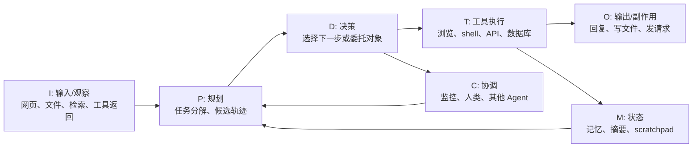
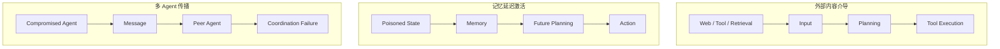

# Toward Secure LLM Agents：把 Agent 安全从 prompt injection 扩展到权限、状态与评测

## 元信息

- **论文**：Toward Secure LLM Agents: Threat Surfaces, Attacks, Defenses, and Evaluation
- **作者**：Yuchen Ling、Shengcheng Yu、Zhenyu Chen、Chunrong Fang
- **机构**：Nanjing University、Technical University of Munich
- **时间**：arXiv v1，2026-06-09
- **原文**：[https://arxiv.org/abs/2606.10749](https://arxiv.org/abs/2606.10749)
- **HTML**：[https://arxiv.org/html/2606.10749v1](https://arxiv.org/html/2606.10749v1)
- **项目页**：[https://ling-yuchen.github.io/LLMAgentSecuritySurvey/](https://ling-yuchen.github.io/LLMAgentSecuritySurvey/)
- **分类**：AI 安全 / LLM Agent 安全 / 系统安全综述

## TL;DR

- **做什么**：这篇论文系统梳理 LLM Agent 安全，覆盖 247 篇论文，试图把 prompt injection、工具滥用、记忆污染、多 Agent 传播、防御和 benchmark 放进同一个系统框架。
- **怎么做**：作者把 Agent 建模为 `A = <I, P, D, T, M, O, C>`，分别对应输入、规划、决策、工具执行、记忆状态、输出与协调通道；安全问题被解释为信息流、委托权限和持久状态之间的交互。
- **实验/证据**：论文不是提出一个新攻击或新模型，而是做结构化综述。语料来自 2023-01-01 到 2026-04-27 的 247 篇论文，其中 169 篇是 arXiv 预印本，占 68.42%。攻击论文 66 篇，防御论文 64 篇，benchmark 论文 47 篇。
- **关键数字**：prompt injection 出现在 142 篇论文中，indirect prompt injection 出现在 86 篇；工具使用安全相关论文 156 篇；AgentDojo 是最常复用 benchmark，但也只占 benchmark 标注的 12.82%。
- **核心判断**：LLM Agent 安全不能只理解为“模型有没有被提示词骗到”。真正的问题是低权限内容如何变成高权限动作，临时上下文如何进入持久记忆，以及一个 Agent 的污染如何通过协作链传播。
- **局限**：这是一篇频次型、编码型综述，不是防御有效性的因果证明。语料高度依赖预印本，人工编码没有保存独立 coder 的一致性统计，因此所有数量都应理解为研究注意力分布，而不是现实风险概率。

## 1. 研究问题：为什么 Agent 安全不能继续停在 prompt 层？

### 论文真正反对什么？

- 作者反对的不是 prompt injection 研究本身。
- 论文反对的是把 Agent 安全简化为：
  - 用户给了坏 prompt；
  - 模型生成了坏文本；
  - 防御只要过滤输入或输出。

### Agent 的风险对象已经变了

| 对比维度 | 普通聊天模型 | LLM Agent |
|---|---|---|
| 主要行为 | 生成文本 | 规划、调用工具、写状态、执行动作 |
| 风险结果 | 有害回复、泄露文本、越狱 | 工作流被劫持、权限被误用、记忆被污染、外部状态被改变 |
| 攻击入口 | 用户 prompt 为主 | 网页、文件、工具返回、检索结果、长期记忆、Agent 消息 |
| 防御难点 | 指令遵循和输出安全 | 数据和控制混在自然语言上下文中 |

### 论文的核心问题

- **RQ1**：LLM Agent 安全如何被建模成软件系统问题？
- **RQ2**：当前主导的威胁面和攻击家族是什么？
- **RQ3**：已有防御机制分别保护哪里，又引入什么代价？
- **RQ4**：现在的评测实践缺什么，为什么还不能支持部署级保证？

### 研究路线的意义

- 这四个问题形成一条递进链：
  1. 先定义 Agent 安全对象；
  2. 再看攻击如何进入和传播；
  3. 再看防御应该在哪些转换点介入；
  4. 最后问 benchmark 是否真的测到了这些风险。

- 这也是论文最有价值的地方：
  - 它不把安全事件当成孤立漏洞；
  - 它把安全事件放回 Agent 执行循环；
  - 它追问“信息什么时候变成控制，控制什么时候变成外部后果”。

## 2. 方法：247 篇论文如何进入这篇综述？

### 语料构建

- 时间窗口：
  - 2023-01-01 到 2026-04-27。

- 检索来源：
  - ACM Digital Library；
  - IEEE Xplore；
  - Scopus；
  - Web of Science；
  - arXiv；
  - Google Scholar。

- 补全方式：
  - 数据库检索；
  - LLM 辅助候选扩展；
  - backward / forward citation snowballing；
  - 人工筛选和版本归并。

### PRISMA 式筛选流

| 步骤 | 数量 | 解释 |
|---|---:|---|
| 进入详细 relevance audit 的记录 | 275 | 初始候选经过规范化后进入人工审核 |
| 标题、摘要或全文筛除 | 25 | 不满足 Agent 安全边界 |
| relevance audit 后暂留 | 251 | 进入最终归并前集合 |
| 版本或重复归并 | 4 | 合并预印本和正式发表版本 |
| 最终编码语料 | 247 | 论文全部后续统计基于此集合 |

### 纳入标准为什么严格？

- 一篇论文必须同时满足两个条件：
  1. 和 LLM Agent 安全有实质关系；
  2. 至少涉及一个显式 Agentic surface。

- 典型可纳入对象：
  - 工具调用；
  - 外部动作；
  - 规划；
  - 持久记忆或状态；
  - 运行时基础设施；
  - embodied interaction；
  - MCP 或 skill 接口；
  - 多 Agent 通信。

- 典型排除对象：
  - 只有普通 prompt injection，没有 Agent 执行循环；
  - 泛化 LLM 安全、隐私或治理，Agent 只是背景；
  - Agent 能力 benchmark，但安全不是核心问题。

### 编码维度

- 单标签字段用于粗粒度分布：
  - primary paper type；
  - single-agent 或 multi-agent setting。

- 多标签字段用于技术分析：
  - threat surface；
  - lifecycle stage；
  - threat model；
  - defense method；
  - benchmark；
  - metric。

### 方法局限先说清楚

- 作者没有宣称 inter-rater agreement。
- 早期 raw search hit count 没有完整保留。
- LLM 辅助检索只用于扩大候选，最终纳入仍靠人工确认。
- 因此，论文的数量结果主要表示 **研究注意力**，不能直接等同于：
  - 现实攻击概率；
  - 防御成熟度；
  - benchmark 充分性；
  - 部署安全保证。

## 3. 趋势观察：这个领域正在快速长大，但还没有稳定中心

### 年份分布

| 年份 | 论文数 | 解释 |
|---|---:|---|
| 2023 | 3 | 早期探索阶段 |
| 2024 | 42 | Agent 安全问题开始集中出现 |
| 2025 | 121 | 明显爆发，攻击、防御、benchmark 并行增长 |
| 2026 截至 04-27 | 81 | 半年不到已有 32.79% 的语料 |

### 发表渠道

| 渠道 | 数量 | 占比 |
|---|---:|---:|
| arXiv preprint | 169 | 68.42% |
| Web report / blog / advisory | 12 | 4.86% |
| ICLR | 12 | 4.86% |
| ACL | 10 | 4.05% |
| EMNLP | 8 | 3.24% |
| NeurIPS | 6 | 2.43% |
| ICML | 5 | 2.02% |

### 这组数字说明什么？

- **第一**：Agent 安全是一个预印本驱动的高速领域。
- **第二**：安全、NLP、软件工程、系统、AI ethics、行业报告都在贡献材料。
- **第三**：领域还没有稳定 venue 中心，所以术语、威胁模型和实验协议仍然会快速漂移。
- **第四**：不能把“某类论文很多”误读为“某类防御已经成熟”。

### 论文类型分布

| 类型 | 数量 | 解释 |
|---|---:|---|
| Attack | 66 | 漏洞发现和攻击构造仍是最大类之一 |
| Defense | 64 | 防御并没有明显滞后于攻击 |
| Benchmark | 47 | 评测已经形成可见分支 |
| Survey | 32 | 领域自我整理需求很强 |
| Evaluation | 26 | 测量和比较开始增加 |
| Report | 12 | 行业实践进入语料 |

### 单 Agent 与多 Agent

- 单 Agent：200 篇，占 80.97%。
- 多 Agent：47 篇，占 19.03%。

- 年份趋势值得注意：
  - 2024 年多 Agent 占 9.52%；
  - 2025 年升到 23.97%；
  - 2026 年截至 04-27 仍有 17.28%。

- 这说明多 Agent 安全还不是主流证据基础，但已经不是边缘问题。

## 4. RQ1：Agent 安全的系统模型是什么？

### 论文给出的轻量公式

论文把 LLM Agent 记为：

```text
A = <I, P, D, T, M, O, C>
```

| 变量 | 含义 | 安全问题 |
|---|---|---|
| `I` | inbound context / observations | 低权限内容如何进入上下文 |
| `P` | planning over candidate trajectories | 输入如何影响分解和路径选择 |
| `D` | decision / delegation | 计划如何变成具体下一步 |
| `T` | tool or environment execution | 决策如何跨越权限边界 |
| `M` | transient or persistent memory / state | 污染如何被保存和复用 |
| `O` | outputs and side effects | 外部可见回复和副作用 |
| `C` | coordination channels | 监控、人类、peer agent、消息拓扑 |

### 关键不是组件，而是转换



### 为什么这个建模有用？

- prompt injection 可以理解为：
  - `I -> P` 或 `I -> D` 的控制流污染。

- 工具滥用可以理解为：
  - `D -> T` 的权限边界失效。

- 记忆投毒可以理解为：
  - `I/T -> M` 后，在未来通过 `M -> P` 重新激活。

- 多 Agent 传播可以理解为：
  - `C -> P`、`C -> D` 或 `C -> C` 的信任扩散。

### 论文报告的高频建模维度

| 维度 | 论文数 | 为什么重要 |
|---|---:|---|
| Planning | 227 | 被污染的任务分解会把错误传到后续动作 |
| Input | 225 | 非可信内容从多个入口进入系统 |
| Tool Execution | 209 | 真正的外部后果常在工具边界发生 |
| Decision | 166 | 局部动作选择把推理变成行为 |
| Memory | 82 | 使一次性攻击变成延迟或重复攻击 |
| User Prompts | 82 | 直接用户输入仍重要，但不是全部 |
| Web Content | 55 | 浏览环境把任务数据和隐藏指令混在一起 |
| Tool Outputs | 54 | 工具返回常被过度信任 |
| Retrieved Content | 37 | RAG 证据也可能携带攻击 |
| Memory / Scratchpads | 25 | 内部状态同时是资产和攻击面 |

### RQ1 的结论

- LLM Agent 安全应被建模为三者交互：
  1. information flow；
  2. delegated authority；
  3. persistent state。

- 这比“系统级安全”更具体：
  - 它解释了信息如何跨越权限；
  - 它解释了状态如何改变未来行为；
  - 它解释了为什么单点输入过滤不够。

## 5. RQ2：攻击家族从 prompt injection 走向持久化与传播

### 主导威胁仍然是 prompt injection

| Threat family | Count | 常见表面 | 传播模式 |
|---|---:|---|---|
| Prompt Injection | 142 | 用户 prompt、对话上下文 | 本地指令操纵，重定向规划或动作 |
| Indirect Prompt Injection | 86 | 网页、工具返回、检索内容、文件 | 隐藏指令通过任务相关内容进入 |
| Unsafe User Instructions | 43 | 浏览、编码、具身任务 | 有害任务被接受 |
| Malicious Tools | 34 | 工具输出、metadata、插件/API | 工具介导的误导或危险调用 |
| Data Exfiltration | 31 | 工具、文件、检索内容、外部服务 | 敏感信息通过工具或状态泄露 |
| Memory Poisoning | 24 | 记忆、摘要、scratchpad | 延迟污染在未来计划中复现 |
| Coordination Failures | 14 | Agent 间消息、角色、委托 | 局部失败通过协作放大 |

### Prompt injection 为什么在 Agent 里更严重？

- 在普通聊天里，prompt injection 主要改变模型输出。
- 在 Agent 里，它可能改变：
  - 计划；
  - 下一步动作；
  - 工具参数；
  - 文件读写；
  - 长期记忆；
  - 给其他 Agent 的消息。

### 三种传播逻辑



### Web、工具与检索内容为什么要分开？

- 它们都可以表现为“文本”，但安全语义不同：
  - Web content 来自开放浏览环境；
  - Tool output 是被 Agent 主动调用后返回；
  - Retrieved content 常被当作 grounding evidence；
  - File/code 可能被读取、执行或修改；
  - Memory/scratchpad 是 Agent 自己产生或保存的状态。

- 如果全部叫“非可信文本”，就会丢掉关键差异：
  - 谁有权写入；
  - 是否持久；
  - 是否会被后续复用；
  - 哪个环节可以加控制。

### 高后果领域不一定是研究最多的领域

- 论文指出：
  - Web browsing 有 93 篇；
  - software engineering 有 63 篇；
  - finance tools 有 34 篇；
  - healthcare assistance 有 28 篇；
  - embodied robotics 有 28 篇。

- 这意味着：
  - 当前证据中心在网页和软件工程；
  - 但最高后果场景可能在金融、医疗和具身执行；
  - 论文频次不能直接当作风险严重性排序。

### RQ2 的结论

- 当前研究仍由 prompt injection 和 indirect control-flow hijacking 主导。
- 但真正值得关注的转向是：
  1. **persistence**：污染可以进入长期状态；
  2. **authority abuse**：Agent 用自己的权限替攻击者行动；
  3. **propagation**：污染可以穿过协作和委托链。

## 6. RQ3：防御不是没有，而是缺少可组合栈

### 三类防御思路

- **Source handling and instruction ordering**
  - 目标：让低权限内容不被当成高权限指令。
  - 好处：易部署，成本低。
  - 问题：仍依赖模型在复杂上下文中正确理解 source precedence。

- **Runtime scrutiny**
  - 目标：在计划、工具调用、执行轨迹附近检查风险。
  - 好处：接近后果发生点。
  - 问题：增加延迟、误拦截和系统复杂度。

- **Capability control and containment**
  - 目标：限制被污染推理能影响什么。
  - 好处：更接近传统系统安全的 least privilege、mediation、sandboxing。
  - 问题：需要框架暴露细粒度权限、provenance 和隔离能力。

### 防御家族对照

| Defense family | 关注转换 | 保护目标 | 主要代价 |
|---|---|---|---|
| Input-trust management | `I -> P`, `I -> D` | prompt / indirect prompt injection | 依赖模型或 wrapper 保持来源区分 |
| Runtime monitoring and guard agents | `P -> D`, `D -> T`, `T -> O` | 不安全计划、工具调用、策略违规 | 延迟、误拦截、策略质量依赖 |
| Access control and least privilege | `D -> T`, `T -> O` | 权限提升、恶意工具、危险能力使用 | 权限粒度和框架支持难 |
| Information-flow and state isolation | `I <-> M`, `M -> P`, `T -> M` | 记忆污染、跨上下文泄漏、数据控制混淆 | 长程协作中难维护 |
| Execution containment | `T -> O` | 代码执行和外部副作用后的损害控制 | 工程成本、兼容性、自主性下降 |
| Topology-aware multi-agent containment | `C -> P`, `C -> D`, `C -> C` | 跨 Agent 传播、角色混淆 | 需要可见通信拓扑，难防隐蔽协作 |

### 为什么单一防御不够？

- source ordering 没有 capability control，仍挡不住权限滥用。
- runtime monitoring 没有 containment，出事后的外部损害仍可能扩大。
- sandboxing 没有 provenance 和 state policy，无法处理延迟记忆污染。
- 多 Agent 系统没有 topology-aware containment，单点污染会沿消息链传播。

### 场景化最小防御栈

| Agent class | 暴露路径 | 可能必要层 | 主要开放问题 |
|---|---|---|---|
| Browser / web agents | `I -> P -> D -> T -> O`，且输入来自不可信网页 | 输入信任管理、计划/动作检查、工具 gating、高权限动作 containment | 真实浏览中的来源分离和高可用防御 |
| Coding agents | `I -> P -> D -> T -> O`，外加文件、代码和本地执行 | 文件/shell/package 最小权限、危险工具监控、隔离执行 | 安全默认工具 API、依赖和 skill provenance、长工具链回归测试 |
| Memory-augmented assistants | `I <-> M -> P -> D -> T` | 状态 provenance、撤销/衰减、基于记忆动作前检查 | 状态信任标签、延迟触发评测、记忆 benchmark 保真 |
| Multi-agent workflows | `C -> P/D/T`, `M <-> C` | 角色权限、通信监控、拓扑 containment、per-agent 权限 | 隐蔽合谋、消息 provenance、分布式 rollback |

### RQ3 的结论

- 领域不缺防御组件。
- 缺的是稳定的组合逻辑：
  - 哪类 Agent 必须有哪些层；
  - 哪些层可以替代，哪些层不能替代；
  - 不同防御如何共同保持任务效用；
  - 如何把 prompt 级防御提升为系统级 assurance。

## 7. RQ4：benchmark 很多，但还不足以支撑部署保证

### Benchmark 复用情况

| Benchmark | Papers | Share |
|---|---:|---:|
| AgentDojo | 30 | 12.82% |
| InjecAgent | 11 | 4.70% |
| MMLU | 5 | 2.14% |
| ASB | 4 | 1.71% |
| SafeAgentBench | 4 | 1.71% |
| R-Judge | 3 | 1.28% |
| OSWorld | 3 | 1.28% |
| JailbreakBench | 3 | 1.28% |

### 怎么解读 AgentDojo 的第一名？

- AgentDojo 的复用率最高，但也只有 12.82%。
- 这说明它是重要 benchmark，不说明它已经成为事实标准。
- 现状更像一个 patchwork：
  - AgentDojo 和 InjecAgent 强于工具化 prompt injection；
  - ASB 扩展到记忆投毒和 backdoor；
  - WASP 强调真实 web hijacking 目标；
  - AgentHarm 聚焦有害多步 Agent 任务；
  - AgentDyn、AgentLeak 等开始推向开放环境和多 Agent。

### 指标分布暴露的问题

| Metric | Count | 擅长捕捉 | 常遗漏 |
|---|---:|---|---|
| Attack Success Rate | 129 | 攻击是否立即达成目标 | utility loss、延迟危害、部署成本 |
| Success Rate | 59 | 任务是否完成 | 完成后的行为是否安全 |
| Accuracy | 41 | 标注任务正确性 | 动作风险和系统后果 |
| Utility | 22 | 防御下的可用性 | 细粒度安全失败 |
| Recall | 19 | 风险覆盖 | precision 和下游运维代价 |
| F1 | 15 | 分类平衡 | latency、cost、任务效用 |
| Precision | 14 | 误报敏感性 | 漏报和长程影响 |
| Refusal Rate | 13 | 防御保守程度 | 拒绝是否合理 |
| False Positive Rate | 13 | 不必要阻断 | 更广任务成功和延迟破坏 |
| Latency | 8 | 防御运行时开销 | 安全质量和长期效用 |
| Cost | 7 | 额外控制资源负担 | 成本是否真的换来保护 |

### 评测为什么还不够？

- 攻击成功率高，不一定说明系统不可部署。
- 攻击成功率低，也不一定说明系统安全。
- 一个严肃 Agent 安全评测至少需要同时回答：
  1. 攻击是否成功；
  2. 合法任务是否仍能完成；
  3. 防御是否引入过度拒绝；
  4. 延迟和成本是否可接受；
  5. 记忆污染是否会延迟激活；
  6. 多 Agent 消息是否会传播污染；
  7. 高权限工具是否受到约束。

### RQ4 的结论

- 当前评测生态很活跃，但不够标准化。
- 更强评测需要五个条件：
  1. 覆盖多威胁面，而不只测 prompt-level compromise；
  2. 联合报告 safety 和 utility；
  3. 纳入长程任务，使记忆污染和延迟触发可见；
  4. 包含权限敏感的外部效果场景；
  5. 稳定报告 latency、cost 和 oversight burden。

## 8. Figure / Table 证据如何支撑论文主张？

### Figure 1：论文的分析框架

- 作用：
  - 把语料构建、Agent 生命周期模型、四个 RQ 和工程主题放到一张图。

- 支撑的 claim：
  - 这不是普通安全综述，而是围绕 Agentic loop 组织的系统安全综述。

- 不能证明什么：
  - 它不能证明任何防御有效；
  - 它只是解释论文如何组织证据。

### Figure 2：语料分布

- 支撑的 claim：
  - 领域高速增长；
  - arXiv 占主导；
  - single-agent evidence 仍明显更多。

- 不能证明什么：
  - 不能证明 single-agent 风险更重要；
  - 不能证明 arXiv 论文质量低或高；
  - 只能说明研究分布和成熟度风险。

### Figure 3 与 Table 3：生命周期和威胁面

- 支撑的 claim：
  - Agent 安全不只是输入输出安全；
  - planning、decision、tool execution、memory 都是安全对象。

- 关键数字：
  - Planning 227；
  - Input 225；
  - Tool Execution 209；
  - Memory 82。

### Figure 4 与 Table 4：攻击传播逻辑

- 支撑的 claim：
  - 威胁正在从单步 prompt compromise 转向跨阶段传播。

- 三个典型传播模式：
  1. 外部内容介导；
  2. 记忆延迟激活；
  3. 多 Agent 消息传播。

### Figure 5、Table 5、Table 6：防御栈

- 支撑的 claim：
  - 防御组件很多，但缺少 compositional logic。

- 关键判断：
  - 防御最密集处在 `I -> P` 和 `D -> T`；
  - `M` 和 `C` 相关防御更薄；
  - provenance、revocation、inter-agent trust、topology-aware containment 是明显缺口。

### Figure 6、Table 7、Table 8：评测缺口

- 支撑的 claim：
  - benchmark 活跃但碎片化；
  - metric 更偏向 attack success，而不是部署级 assurance。

- 关键数字：
  - AgentDojo 30；
  - Attack Success Rate 129；
  - Utility 22；
  - Latency 8；
  - Cost 7。

## 9. 和已有相关工作的关系

### 为什么不是又一篇普通 survey？

- 论文自己也承认语料里已有 32 篇 survey。
- 它的增量不是“又列更多论文”，而是把已有工作按以下维度重新组织：
  - lifecycle framing；
  - tools/runtime；
  - memory/state；
  - multi-agent；
  - benchmark synthesis；
  - software engineering / assurance framing。

### 相关 benchmark 的位置

- **AgentDojo**
  - 贡献：把工具化任务和 prompt injection 防御放进动态环境。
  - 在本文中的角色：最常复用 benchmark，但覆盖仍偏 `I/P/D/T`。

- **WASP**
  - 贡献：为 web agent prompt injection 提供更接近真实网页劫持的目标和隔离环境。
  - 在本文中的角色：说明 web agent 安全评测正在从静态注入走向可执行环境。

- **AgentHarm**
  - 贡献：用 110 个恶意 Agent 任务和 440 个增强样本衡量 harmful multi-step behavior。
  - 在本文中的角色：代表从聊天安全转向 Agent 行为安全的 benchmark。

### 论文的领域位置

- 如果把领域分成三层：
  1. 攻击证明；
  2. 防御机制；
  3. 部署保证。

- 这篇论文站在第 2 层和第 3 层之间：
  - 它整理已有攻击与防御；
  - 但真正想推动的是 deployment-oriented assurance。

## 10. 结论与局限

### 最值得带走的判断

- **第一**：prompt injection 仍是 Agent 安全研究的中心，但不应再被当作唯一问题。
- **第二**：工具权限是后果发生点，`D -> T` 必须被当作安全边界。
- **第三**：记忆不是辅助模块，而是长期 Agent 的一等攻击面。
- **第四**：多 Agent 协作不是简单复制单 Agent 风险，而是引入传播、角色和拓扑语义。
- **第五**：benchmark 不能只报告 ASR，还要报告 utility、latency、cost、长程状态和高权限动作。

### 论文自己的局限

| 局限 | 具体含义 | 阅读时如何处理 |
|---|---|---|
| Construct validity | 威胁面和生命周期阶段有重叠 | 不要把类别边界看成绝对 |
| Internal validity | 人工筛选和编码存在主观性 | 关注趋势，不要过度精读小差异 |
| External validity | 检索可能漏掉工业内部资料和特殊术语论文 | 把语料看成高覆盖而非全集 |
| Conclusion validity | 频次不是有效性或真实风险概率 | 数字表示研究注意力 |
| LLM-assisted retrieval bias | GPT-5.4 参与候选扩展可能偏向可见论文 | 最终纳入仍靠人工验证，但召回仍可能偏 |

### 还需要补上的证据层

- **第一层：复现实验层**
  - 论文保留 workbook 和编码结果，但没有提供完整检索会话、每个搜索引擎的原始命中数和独立 coder 的并行标注。
  - 这意味着读者可以审计最终集合，却较难完整重放从检索到筛选的每一步。

- **第二层：防御组合层**
  - 论文能指出 access control、runtime monitoring、information-flow control、sandboxing 都重要。
  - 但它没有给出一个经过实验验证的组合策略，例如浏览 Agent 到底应使用哪些层、顺序如何、冲突时谁优先。

- **第三层：部署经济层**
  - 论文强调 latency、cost、oversight burden 报告不足。
  - 但它自身也没有真实部署成本模型，只能说明这个缺口存在。

- **第四层：高风险场景层**
  - 金融、医疗、具身机器人等场景在语料中可见，但数量少于网页和软件工程。
  - 因此论文对这些场景的判断更像研究议程，而不是已有充分证据的结论。

### 如何避免误读这篇综述？

- 不要把 `142` 篇 prompt injection 论文读成“prompt injection 一定是所有部署里最高风险”。
- 不要把 `64` 篇 defense 论文读成“防御已经接近成熟”。
- 不要把 AgentDojo 第一名读成“AgentDojo 覆盖了 Agent 安全全部问题”。
- 更准确的读法是：
  1. 哪些问题最被研究；
  2. 哪些组件已经有防御原型；
  3. 哪些 benchmark 被复用；
  4. 哪些部署级证据仍缺失。

## 11. 研究者视角：后续真正要追的问题

### 1. 状态 provenance 如何成为 Agent 框架默认能力？

- 论文指出 provenance-aware state management 是核心研究优先级。
- 但真正困难在于：
  - 记忆项来自哪里；
  - 谁授权写入；
  - 何时过期；
  - 被污染后如何撤销；
  - 哪些未来动作允许引用它。

- 一个可研究方向：

```text
memory_item = {
  content,
  source,
  authority_level,
  created_at,
  expires_at,
  trust_decay,
  revocation_state,
  allowed_action_scope
}
```

### 2. 工具权限能否从提示词策略变成类型系统？

- 当前很多 Agent 框架把工具权限交给：
  - prompt；
  - runtime guard；
  - 用户确认。

- 更系统的问题是：
  - 工具是否有 capability type；
  - 参数是否有敏感度；
  - 返回值是否带 provenance；
  - 某个计划是否能静态或动态证明不越权。

### 3. 多 Agent 安全需要拓扑级回滚

- 如果一个 Agent 被污染，问题不是只重启它。
- 还要追踪：
  - 它发给谁；
  - 谁引用过它的消息；
  - 哪些记忆由它写入；
  - 哪些工具调用受它影响；
  - 哪些下游 Agent 需要 quarantine。

### 4. Benchmark 应该向 CI 安全门禁靠近

- 论文提到安全 regression suite 的方向。
- 这意味着未来 benchmark 不只是论文排行榜，而应像测试集：
  - replay prompt injection traces；
  - replay malicious tool outputs；
  - replay poisoned memory states；
  - replay multi-agent communication failures；
  - 在 prompt、工具、策略、编排升级后重复运行。

### 5. 最终目标不是“没有攻击成功”，而是 assurance case

- 对高权限 Agent，部署前需要回答：
  - 威胁模型是什么；
  - 权限边界在哪里；
  - 运行时控制是什么；
  - benchmark 证据覆盖哪些路径；
  - 没覆盖哪些路径；
  - 事故发生后如何 containment 和 replay；
  - 成本、延迟和人工 oversight 是否可接受。

- 这也是论文最后的核心转向：
  - 从攻击中心的安全研究；
  - 走向可治理 Agent 系统的工程保证。

## 参考链接

- [Toward Secure LLM Agents: Threat Surfaces, Attacks, Defenses, and Evaluation](https://arxiv.org/abs/2606.10749)
- [论文 HTML 版本](https://arxiv.org/html/2606.10749v1)
- [LLM Agent Security Survey 项目页](https://ling-yuchen.github.io/LLMAgentSecuritySurvey/)
- [AgentDojo: A Dynamic Environment to Evaluate Prompt Injection Attacks and Defenses for LLM Agents](https://arxiv.org/abs/2406.13352)
- [WASP: Benchmarking Web Agent Security Against Prompt Injection Attacks](https://arxiv.org/abs/2504.18575)
- [AgentHarm: A Benchmark for Measuring Harmfulness of LLM Agents](https://arxiv.org/abs/2410.09024)
