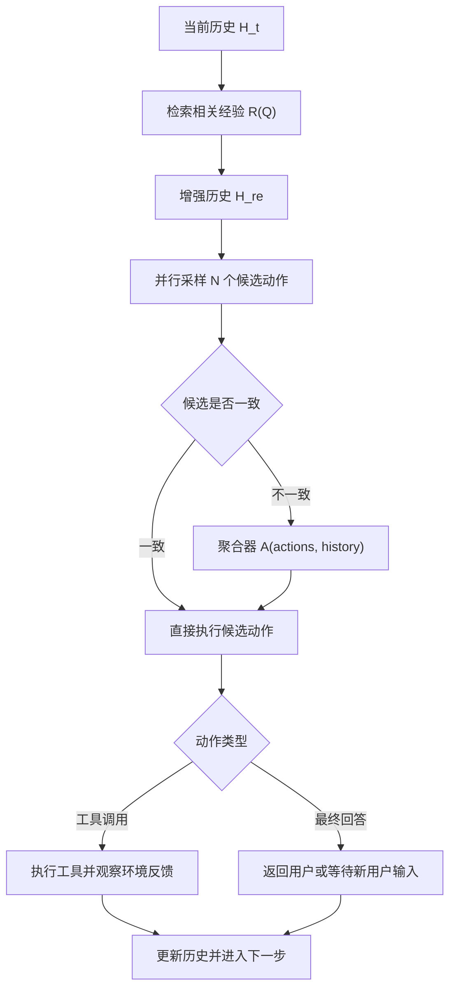

# KATE：把工具调用从“会不会调 API”推进到“能不能复用执行经验”

### 元信息

| 项目 | 内容 |
| --- | --- |
| 论文 | Pushing the Limits of LLM Tool Calling via Experiential Knowledge Integration and Activation |
| 方法名 | KATE, Knowledge-Augmented Tool Execution |
| 作者 | Yupu Hao, Zhuoran Jin, Huanxuan Liao, Kang Liu, Jun Zhao |
| 日期 | arXiv v1, 2026-06-09 |
| 方向 | 大模型 Agent, 工具调用, 经验知识, 后训练 |
| 原文 | [arXiv](https://arxiv.org/abs/2606.10875), [PDF](https://arxiv.org/pdf/2606.10875), [代码](https://github.com/hypasd-art/KATE) |

### TL;DR

- 这篇论文要回答的问题不是“LLM 是否支持 function calling”，而是：多轮工具任务失败时，模型到底缺少什么经验，以及这些经验应该在推理时检索、在采样时激活，还是在训练时内化。
- 作者把多轮工具调用形式化成 MDP，并把经验知识拆成两类：实例级的轨迹/经验摘要，以及意图级的脚本/文本聚类。实验显示，实例级知识更稳定，意图级抽象并不天然更强。
- KATE 的核心机制是三段式：先从成功轨迹构造经验库，再在每一步工具决策时检索相关经验并做并行采样聚合，最后把带经验的样本用于 SFT/RL 后训练。
- 在 BFCL-V3 上，Qwen3-8B 的 FC 平均分从 32.75 提升到 KATE 的 46.00；直接 RL 后达到 48.25。Qwen3-32B 从 46.00 提升到 50.50。
- 在 AppWorld 上，KATE 也优于 ReAct 基线：Qwen3-8B 平均从 4.1 到 10.92，Qwen3-32B 从 6.52 到 12.87；但 Test-Challenge 场景仍暴露了模型能力不足时并行候选一起变噪声的边界。
- 消融给出的判断很清楚：只给经验但不激活，提升有限；只做并行采样但没有经验，上限也有限。工具调用 Agent 的关键不只是“记忆”，而是“可检索经验 + 宽度探索 + 可验证训练信号”。
- 局限同样明显：知识库规模较小，实验主要是文本工具调用，单次运行和方差统计仍有限；KATE 证明了方向，但还没有证明大规模、长期、动态经验库能持续稳定扩展。

### 1. 这篇论文真正关心什么？

KATE 关注的失败模式，可以概括为三个层次：

1. **知识不足**：模型知道工具名和 schema，但不知道特定场景下的执行套路。
2. **知识未激活**：模型参数或上下文里可能有相似经验，但贪心解码没有把它取出来。
3. **知识未内化**：检索增强能帮一次推理，但模型本身没有被训练成更会使用这些经验。

论文的立场是：

- 多轮工具调用不是单步 JSON 生成。
- 它更像一个状态不断变化的决策过程。
- 每一步动作都会改变环境反馈，也会改变后续可行路径。
- 因此，失败常常不是“不会写函数参数”，而是“不知道在这个状态下应该沿用哪类历史轨迹”。

作者把多轮工具调用写成一个 MDP：

```text
o_{t+1} = P(T; S; H_t)

H_{t+1} = H_t union o_{t+1} union r_{t+1}
```

变量解释：

| 符号 | 含义 | 在工具调用里的直觉 |
| --- | --- | --- |
| `T` | 可用工具集合 | 当前 Agent 能调用的 API / function |
| `S` | system prompt | 工具调用格式、约束、角色说明 |
| `H_t` | 第 `t` 步前的对话历史 | 用户需求、已调用工具、工具返回结果 |
| `o_{t+1}` | 下一步动作 | 工具调用 `c_{t+1}` 或最终文本回答 |
| `r_{t+1}` | 环境反馈 | 工具返回 `r_env` 或用户新回复 `r_user` |

这个形式化的意义在于：

- 如果 `H_t` 缺少经验，模型只能靠当前 prompt 即兴规划。
- 如果 `r_env` 已经暴露某个状态变化，下一步工具调用必须吸收这个变化。
- 如果任务需要多轮工具链，单步正确不等于轨迹正确。

### 2. 作者为什么不满足于 prompt engineering？

论文先测试了“深度提示”：

- intent hint：让模型显式识别当前意图。
- reflection hint：让模型反思上一轮工具调用是否充分。
- state hint：让模型检查环境状态和隐含依赖。

结果并不理想：

| 模型 | 原始平均 | intent / reflection / state 的总体趋势 |
| --- | ---: | --- |
| Qwen3-8B | 33 左右 | 有些场景涨，有些场景跌 |
| Qwen3-32B | 46 左右 | 平均通常低于或接近原始设置 |

论文给出的解释很实用：

- 多轮工具任务的错误因素太多。
- 一个固定 prompt 视角会把模型注意力锁到少数维度。
- 真实错误可能来自参数缺失、工具不存在、状态追踪、提前终止、格式执行或规划失败。
- 更长、更细的提示不一定带来更宽的搜索空间。

这里的关键判断是：

> 工具调用 Agent 的提升，不应该只靠“让模型想得更深”；很多时候要让模型“试得更宽”，再用聚合机制选出更稳的下一步动作。

### 3. 经验知识如何构造？

KATE 比较了四种经验知识：

| 层级 | 名称 | 缩写 | 形式 | 直觉 |
| --- | --- | --- | --- | --- |
| 实例级 | Scenario Trajectory Knowledge | ST | 成功工具调用轨迹 | “类似任务当时怎么一步步做成” |
| 实例级 | Experience Summary Knowledge | ES | 由轨迹总结的操作准则 | “这类任务通常要注意什么” |
| 意图级 | Script-Style Intent Clustering | SIC | 聚类后的半结构化脚本 | “这个意图类别的通用流程” |
| 意图级 | Textual-Style Intent Clustering | TIC | 聚类后的自然语言描述 | “这个意图类别的文字经验” |

构造流程可以拆成两条线：

1. **实例级知识**
   - 输入训练集里的 user query 与 ground-truth trajectory。
   - 对 query 编码，写入向量库。
   - 推理时用当前 user query 检索相似样本。
   - 返回 top-k 轨迹或摘要作为增强上下文。

2. **意图级知识**
   - 先让模型推断用户意图。
   - 对意图而不是原始 query 做聚类。
   - 对每个 cluster 总结脚本或说明。
   - 推理时先预测当前意图，再检索最相似意图条目。

论文的检索公式是：

```text
R(Q) = Top-K(k_j | k_j in K, sim(Q, k_j) >= p)
```

变量解释：

| 符号 | 含义 |
| --- | --- |
| `Q` | 当前检索查询，可以是 user query，也可以是推断出的 intent |
| `K` | 经验知识库 |
| `sim` | 向量相似度 |
| `p` | 相似度阈值，BFCL 设置为 0.5 |
| `Top-K` | 取最相关的若干条经验 |

### 4. 经验比较：为什么实例级更稳？

论文 Figure 1 的结论可以浓缩成三点：

- **实例级通常强于意图级**
  - ST / ES 直接包含可执行轨迹或轨迹摘要。
  - 意图级需要先推断 intent，再匹配 cluster。
  - 这个额外抽象步骤会引入错误。

- **ST 和 ES 没有绝对赢家**
  - 某些任务里完整轨迹更有帮助。
  - 某些任务里摘要更能过滤噪声。
  - 模型和任务类型会改变二者相对收益。

- **All 不一定最好**
  - 把 ST、ES、SIC、TIC 全部塞进去，可能造成冗余。
  - 工具任务里，上下文不是越多越好。
  - 检索质量、选择机制、激活方式比数量更关键。

这点对 Agent 系统很重要：

- 很多记忆系统默认“记得越多越安全”。
- KATE 的实验更接近相反结论：经验要能落到下一步动作，否则只是在制造上下文竞争。
- 对工具调用而言，最值钱的不是抽象原则，而是含参数、状态、错误恢复方式的具体轨迹。

### 5. 宽度激活：KATE 如何在每一步选择工具？

KATE 的推理不是一次生成整条计划，而是在每个交互步做并行候选：



伪代码视角：

```text
Input:
  H_0: 初始对话历史
  T: 可用工具集合
  K: 经验库
  N: 并行采样数
  A: 聚合函数
  p: 检索阈值

State:
  H_re: 带检索经验的历史
  actions: 当前步候选动作集合

Loop:
  1. 如果观察到用户查询，检索 R(query)
  2. 把 R(query) 注入 H_re
  3. 并行采样 N 个下一步动作
  4. 如果动作一致，直接执行
  5. 如果动作不一致，用 A 聚合成一个 validated tool call
  6. 如果是工具调用，执行并写回环境反馈
  7. 如果是最终回答，结束或等待用户继续

Output:
  最终回答，或一条可执行的下一步工具调用
```

聚合器有两类：

| 聚合方式 | 做法 | 优点 | 边界 |
| --- | --- | --- | --- |
| Self-consistency | 多数投票或候选共识 | 稳定、对采样规模不敏感 | 结构化代码/复杂响应不一定适合 |
| LLM-based aggregation | 把多个候选交给模型选最优动作 | 能处理更复杂候选 | 候选太多时上下文变长，选择不单调 |

论文的启发是：

- 贪心解码会低估模型潜在工具知识。
- 温度采样能让更多可行动作浮现出来。
- 但是候选越多不一定越好，因为聚合器本身也会过载。

### 6. 训练时内化：SFT 为什么输给直接 RL？

KATE 还把经验注入训练数据：

- 先用经验库增强原始 user instruction。
- 再把多轮工具调用拆成逐轮样本。
- 长度超过 8192 tokens 的样本会被移除。
- 数据 1:1 切给 SFT 和 RL。
- SFT 和 RL 都用 LoRA，rank 32，alpha 16。
- SFT 学习率 `3e-5`，训练 3 epochs。
- RL 使用 GRPO，batch size 128，最大 prompt 8192，最大 response 2048，每个 prompt 采样 8 条轨迹，训练 7 epochs。

训练结果最值得注意的是：

| 设置 | Qwen3-8B BFCL-V3 平均 |
| --- | ---: |
| FC baseline | 32.75 |
| KATE inference | 46.00 |
| KATE + SFT | 45.75 |
| KATE + RL | 48.25 |
| KATE + SFT + RL | 46.25 |

作者的解释是：

- 对已经较强的 base model，SFT 可能更多是在模仿固定轨迹。
- RL 能通过奖励信号探索和强化正确工具调用。
- 在同样数据预算下，直接 RL 比先 SFT 再 RL 更能提升最终准确率。

这不是说 SFT 没用，而是说明：

- 工具调用的监督信号不是“文本像不像”。
- 更关键的是“执行后环境状态对不对”。
- 如果有可验证的 tool call correctness，RL 信号比纯模仿更贴近目标。

### 7. 主结果：BFCL-V3 证明了什么？

BFCL-V3 覆盖四类复杂多轮工具场景：

- Base：基础多轮。
- Miss Func：缺失函数。
- Miss Param：缺失参数。
- Long Context：长上下文。

主表结果如下：

| 模型 | 方法 | Base | Miss F. | Miss P. | Long C. | 平均 |
| --- | --- | ---: | ---: | ---: | ---: | ---: |
| GPT-5 | FC | 49.0 | 35.0 | 30.0 | 37.0 | 37.75 |
| GPT-4.1 | FC | 52.0 | 39.0 | 36.0 | 50.0 | 44.25 |
| Qwen3-8B | FC | 43.0 | 30.0 | 31.0 | 27.0 | 32.75 |
| Qwen3-8B | Memp | 52.0 | 25.0 | 36.0 | 31.0 | 36.00 |
| Qwen3-8B | KATE | 59.0 | 41.0 | 41.0 | 40.0 | 46.00 |
| Qwen3-8B | KATE + RL | 64.0 | 43.0 | 42.0 | 42.0 | 48.25 |
| Qwen3-32B | FC | 55.0 | 52.0 | 38.0 | 39.0 | 46.00 |
| Qwen3-32B | Memp | 63.0 | 44.0 | 47.0 | 42.0 | 49.00 |
| Qwen3-32B | KATE | 62.0 | 53.0 | 42.0 | 45.0 | 50.50 |

可以读出的结论：

- **小模型收益更大**
  - Qwen3-8B 从 32.75 到 46.00，绝对提升 13.25。
  - Qwen3-32B 从 46.00 到 50.50，绝对提升 4.50。
  - 经验增强对小模型更像“能力补丁”，对大模型更像“边际校准”。

- **KATE 能超过强闭源 FC 基线的部分场景**
  - Qwen3-8B + RL 在 Base 为 64.0，高于表中 GPT-4.1 的 52.0 和 GPT-5 的 49.0。
  - 这并不表示整体模型能力超过 GPT-5。
  - 更准确的解释是：当 benchmark 与经验轨迹高度匹配时，专门的经验增强和 RL 可以在局部工具任务上反超通用模型。

- **Miss Func / Miss Param 是关键检验**
  - 这些场景要求模型识别工具缺失或参数缺失后的替代路径。
  - 经验轨迹在这里能提供错误恢复模式。
  - 这也是 KATE 比单纯 prompt 更有价值的地方。

### 8. AppWorld：代码式 Agent 的边界更硬

AppWorld 是交互式 coding agent benchmark，评估的是最终环境状态是否满足目标，并包含两个指标：

| 指标 | 含义 |
| --- | --- |
| TGC | Task Goal Completion，任务目标完成 |
| SGC | Scenario Goal Completion，场景目标完成 |

主结果：

| 模型 | 方法 | Test-N TGC | Test-N SGC | Test-C TGC | Test-C SGC | 平均 |
| --- | --- | ---: | ---: | ---: | ---: | ---: |
| Qwen3-8B | ReAct | 10.1 | 1.8 | 3.8 | 0.7 | 4.1 |
| Qwen3-8B | ReAct + ST | 26.2 | 10.7 | 4.8 | 0.7 | 10.6 |
| Qwen3-8B | Memp | 22.0 | 7.1 | 3.6 | 0 | 7.92 |
| Qwen3-8B | KATE | 26.8 | 10.7 | 5.5 | 0.7 | 10.92 |
| Qwen3-32B | ReAct | 16.7 | 1.8 | 6.2 | 1.4 | 6.52 |
| Qwen3-32B | Memp | 22.6 | 5.4 | 9.1 | 1.4 | 9.62 |
| Qwen3-32B | KATE | 32.7 | 10.7 | 7.4 | 0.7 | 12.87 |

这张表比 BFCL 更能揭示边界：

- Test-N 上，KATE 的轨迹经验和并行采样确实有效。
- Test-C 上，任务难度超过模型推理能力时，候选采样可能一起错。
- 当每个候选都是错误代码路径，聚合器无法凭空恢复正确轨迹。
- 所以 KATE 不是“采样越多越聪明”，而是“模型已有可行局部路径时，宽度采样能更常找到它”。

### 9. 消融：两个组件各自贡献什么？

BFCL-V3 的 ablation 可以拆成三问：

| 问题 | 对应设置 | 观察 |
| --- | --- | --- |
| 没有并行采样会怎样？ | w/o PS | 只注入知识仍有提升，但低于完整 KATE |
| 没有经验知识会怎样？ | w/o Exp | 并行采样单独有效，但上限受限 |
| 换成 self-consistency 会怎样？ | r PS-Con. | 有时更稳，尤其 Qwen3-32B 部分场景 |

具体数值：

| 模型 | KATE | w/o PS | w/o Exp | r PS-Con. |
| --- | ---: | ---: | ---: | ---: |
| Qwen3-8B 平均 | 46.00 | 38.00 | 42.75 | 41.25 |
| Qwen3-32B 平均 | 50.50 | 49.00 | 44.00 | 50.25 |

这说明：

- 经验知识和宽度激活不是替代关系。
- 对 Qwen3-8B，两个组件叠加收益明显。
- 对 Qwen3-32B，单独经验已经接近完整 KATE，说明大模型对经验的利用更直接。
- self-consistency 的稳定性很强，但如果任务输出是多样代码或复杂结构，简单投票未必适合。

### 10. 错误分析：KATE 主要减少哪类失败？

作者用 gpt-5-mini 对 BFCL-V3 Base 场景错误分类，类别包括：

- Intent。
- State Tracking。
- Planning / Reasoning。
- Format / Execution。
- Redundant Tool Use。
- Premature Termination。
- Other。

最核心的失败是 Planning / Reasoning。

对比趋势：

| 方法 | 规划/推理错误 | 过早终止 | 解释 |
| --- | ---: | ---: | --- |
| FC | 最高 | 较高 | 缺少相似轨迹和恢复策略 |
| FC + ST | 下降 | 仍明显 | 轨迹帮助规划，但激活不足 |
| KATE | 进一步下降 | 明显下降 | 并行采样更容易找到持续执行路径 |

这条证据很关键：

- KATE 不是主要修格式错误。
- 它主要修“下一步该做什么”的规划错误。
- 对长链 Agent 来说，规划错误比 JSON 格式错误更像真实瓶颈。

### 11. 成本：并行采样有没有贵到不可用？

论文 Table 3 给出 token 与 runtime：

| 模型 | 方法 | Tokens | Time | Token Ratio vs FC |
| --- | --- | ---: | ---: | ---: |
| Qwen3-8B | FC | 659,506 | 332 | 1.0000 |
| Qwen3-8B | KATE | 1,249,096 | 815 | 1.8940 |
| Qwen3-8B | r PS-Con | 701,391 | 289 | 1.0635 |
| Qwen3-32B | FC | 744,086 | 584 | 1.0000 |
| Qwen3-32B | KATE | 962,783 | 529 | 1.2939 |
| Qwen3-32B | r PS-Con | 716,485 | 402 | 0.9629 |

可读出的工程含义：

- 完整 KATE 对 Qwen3-8B 的 token 成本约 1.89 倍。
- 对 Qwen3-32B 的 token 成本约 1.29 倍。
- self-consistency 版本几乎不增加 token，甚至在 32B 上低于 FC。
- 并行采样不必线性增加成本，因为正确路径可能减少无效后续步骤。

但这里有两个边界：

1. 论文只在 10 个 Base scenario 数据点上做效率比较。
2. 真实生产系统还要考虑工具执行成本、外部 API rate limit、并行安全策略和失败回滚。

### 12. 多随机种子：结论是否稳定？

论文 Appendix F 报告了多随机种子均值和方差：

| 模型 | 方法 | 平均 |
| --- | --- | ---: |
| Qwen3-8B | FC | 34.5 +/- 1.34 |
| Qwen3-8B | Memp | 35.08 +/- 1.3 |
| Qwen3-8B | KATE | 45.17 +/- 0.92 |
| Qwen3-32B | FC | 45.92 +/- 0.72 |
| Qwen3-32B | Memp | 49.0 +/- 0.61 |
| Qwen3-32B | KATE | 51.42 +/- 1.48 |

这说明：

- KATE 的主结论不是单次偶然。
- 8B 上提升更明显，方差也较小。
- 32B 上 KATE 仍提升，但方差比 Memp 和 FC 更高。
- 大模型场景下，聚合器和候选分布可能带来更复杂的不稳定性。

### 13. 代码仓库能复现哪些部分？

公开仓库显示的结构与论文设计基本对应：

| 目录 / 文件 | 作用 |
| --- | --- |
| `bfcl_eval/` | Berkeley Function Calling Leaderboard 评估框架 |
| `bfcl_eval/model_handler/local_inference/qwen.py` | Qwen 基础和增强模式 handler |
| `bfcl_eval/model_handler/local_inference/qwen_fc.py` | Qwen function calling handler |
| `get_trajectory/` | 从 BFCL 结果抽取轨迹并构造经验 |
| `app_world/` | AppWorld benchmark 接入 |
| `Experience/` | 轨迹、摘要、embedding 经验文件 |
| `run.sh` | 主评估脚本 |

README 给出的经验构造流程：

1. 从成功 BFCL runs 抽取 trajectories。
2. 用 GPT 对轨迹生成 summaries。
3. 用 `all-MiniLM-L6-v2` 添加 embeddings。
4. 在 BFCL 或 AppWorld 评估中传入 `INFORMATION_DICT`。

这和论文的实验细节一致：

- BFCL 使用 `all-MiniLM-L6-v2` 做检索 embedding。
- 对 BFCL 先按 involved classes 做工具集预过滤。
- 再用余弦相似度阈值 `p = 0.5` 过滤。
- 最后全局排序、去重、取 top 经验。

### 14. 和 BFCL、AppWorld、Memp 的关系

KATE 的位置可以放在三个坐标里看：

| 参照物 | 关注点 | KATE 的区别 |
| --- | --- | --- |
| BFCL | 评估 function calling / tool use 能力 | KATE 把 BFCL 作为多轮工具环境，并研究经验知识如何提升 |
| AppWorld | 用可执行应用世界评估 coding agents | KATE 测试经验和并行采样能否迁移到代码式工具环境 |
| Memp | 动态 procedural memory repository | KATE 更强调知识类型、激活宽度、后训练内化的系统比较 |

BFCL 和 AppWorld 是评测底座。

Memp 是最接近的经验记忆 baseline。

KATE 的新增价值不是“我也有记忆”，而是：

- 比较不同粒度经验。
- 比较深度提示和宽度采样。
- 比较 SFT 与 RL 内化。
- 通过消融证明这些环节各自必要。

### 15. 论文边界：哪些结论还不能外推？

需要保留的怀疑点：

1. **知识库规模较小**
   - BFCL 只用 Base scenario 的 100 个样本构造训练集。
   - AppWorld 从 90 个训练实例中蒸馏 81 个正确示例。
   - 这还不能证明百万级动态经验库下依然稳定。

2. **文本工具调用为主**
   - 作者明确说尚未扩展到多模态任务。
   - 浏览器、GUI、机器人、文件系统类 Agent 的状态空间更复杂。

3. **聚合器本身可能成为瓶颈**
   - LLM-based aggregation 在候选数变大时不单调。
   - 候选上下文太长时，聚合模型可能选错。

4. **RL 依赖可验证奖励**
   - BFCL 和 AppWorld 都有相对清晰的执行验证。
   - 真实办公 Agent、科研 Agent、长程软件工程任务的 reward 更稀疏。

5. **安全问题没有展开**
   - 经验库如果收录错误轨迹、污染轨迹或越权轨迹，检索会把风险放大。
   - 并行采样也会增加危险候选出现的概率。
   - KATE 论文没有把经验库治理作为安全主题处理。

### 16. 对 Agent 研究的延伸问题

KATE 最值得带走的不是一个固定 recipe，而是一个研究框架：

```text
工具 Agent 能力 = 可执行经验质量 x 检索选择质量 x 推理时激活宽度 x 训练时可验证反馈
```

进一步的问题包括：

- **经验库如何治理？**
  - 成功轨迹是否有过期风险？
  - 工具 schema 更新后，旧经验如何失效？
  - 被 prompt injection 污染的轨迹如何检测？

- **并行采样如何受权限约束？**
  - 如果候选工具调用包含高风险动作，能否先聚合再执行？
  - 对支付、删除、发送邮件等动作，候选生成阶段是否也要进入沙箱？

- **RL 奖励如何从 benchmark 走向真实任务？**
  - BFCL 可以匹配 tool call。
  - AppWorld 可以检查环境状态。
  - 真实软件工程可能需要测试、审查、日志、用户确认共同构成 reward。

- **经验能否跨 Agent 共享？**
  - 同一个工具链的轨迹能否迁移到不同模型？
  - 不同用户的经验库是否会泄露隐私？
  - 团队级 Agent 是否需要类似 package registry 的经验版本管理？

### 17. 研究设计细读：为什么这组实验有说服力？

这篇论文的说服力来自一组连续实验，而不是单个 SOTA 表格：

| 研究问题 | 实验设计 | 支持的结论 | 仍缺的证据 |
| --- | --- | --- | --- |
| 哪种经验有用？ | 比较 ST、ES、SIC、TIC、组合知识 | 实例级经验比意图级抽象更可靠 | 更大规模、更复杂工具库下是否仍成立 |
| 如何激活经验？ | 比较 prompt hint 与并行采样 | 宽度探索比固定深度提示更稳 | 采样数、温度、聚合器能力的联合最优点 |
| 是否需要训练？ | 比较 KATE、SFT、RL、SFT+RL | 可验证 RL 比纯 SFT 更贴近工具目标 | 长程任务、稀疏奖励和不可完全验证任务 |
| 是否只是 benchmark 特化？ | 同时跑 BFCL-V3 与 AppWorld | 在函数调用和代码式环境都有收益 | 浏览器、GUI、多模态、真实 SaaS 工具链 |
| 成本是否可接受？ | 报告 token、runtime、ratio | 并行采样不一定线性放大成本 | 外部 API 调用成本、失败回滚、限流开销 |

这个设计的优点：

- 它先问“经验是什么”，再问“如何使用经验”，最后问“能否训练进模型”。
- 每一步都有一个可消融组件，避免把所有收益都归因于 KATE 这个整体名词。
- 它没有把 Memp 只当成弱 baseline，而是把 procedural memory 的思想纳入比较。
- 它把 AppWorld 放进实验，说明作者知道工具调用不只是 function schema matching。

这个设计的不足：

- BFCL 的经验只来自 Base scenario 的训练切分，距离开放世界工具任务还有距离。
- AppWorld 的知识库来自 81 个正确示例，仍是小样本经验库。
- 论文没有系统比较不同 embedding 模型、不同 top-k、不同阈值 `p` 的敏感性。
- LLM-based aggregation 的 prompt 被放在附录，但聚合器本身的错误案例没有足够展开。

### 18. 可复现性检查：主 Agent 应该关注哪些实现细节？

如果后续要复现或迁移 KATE，优先检查这些点：

1. **数据切分**
   - BFCL 用 sample ID 奇偶切分，避免同一个实例同时进入训练和测试。
   - 但工具类别和任务模板仍可能共享，评估时要区分“轨迹复用”与“真实泛化”。

2. **经验质量**
   - ST 依赖 ground-truth trajectory。
   - ES 依赖 GPT 总结轨迹。
   - 如果轨迹本身错误，或 summary 把关键参数约束丢掉，检索增强会直接放大错误。

3. **检索过滤**
   - BFCL 先按 involved classes 约束搜索空间，再做相似度阈值过滤。
   - 这个 hard constraint 很重要，因为纯语义检索可能把相似用户意图但不同工具集的经验混进来。

4. **采样执行顺序**
   - 候选是在每一步动作上并行采样，而不是一次生成完整计划。
   - 这降低了整条轨迹发散的风险，也让工具反馈能及时进入下一步状态。

5. **聚合输出格式**
   - BFCL 聚合要求输出单个 validated tool call。
   - AppWorld 聚合要求逐步生成代码片段。
   - 两个 prompt 的差异说明：聚合器必须适配环境，不是一个通用投票器。

6. **RL 奖励**
   - RL 通过匹配 tool-calling outputs 验证正确性。
   - 这适合格式可判定的工具调用。
   - 对真实 Agent，reward 可能需要测试结果、审计日志、权限检查和用户确认共同组成。

一个更工程化的迁移清单：

| 迁移对象 | 必做检查 | 风险 |
| --- | --- | --- |
| IDE coding agent | 轨迹是否包含文件状态、测试输出、错误修复过程 | 旧轨迹可能误导新代码库 |
| 浏览器 Agent | 经验是否绑定页面版本、登录态、DOM 结构 | 页面变化导致经验过期 |
| 企业 SaaS Agent | 工具权限、审批流、审计日志是否进入状态 | 并行候选可能包含越权动作 |
| 安全敏感 Agent | 经验库是否经过污染检测和最小权限过滤 | 恶意轨迹被检索后会系统性放大 |

### 19. 安全视角：KATE 还没处理的经验库攻击面

KATE 论文主要讨论能力提升，没有深入处理安全问题。站在 Agent 安全角度，至少有四个新增攻击面：

1. **经验投毒**
   - 攻击者让系统记录一条“看似成功”的轨迹。
   - 后续相似任务检索到这条轨迹。
   - 模型会把错误参数、越权调用或泄露路径当成经验复用。

2. **摘要丢失约束**
   - ES 把长轨迹压缩成经验摘要。
   - 如果摘要省略了权限检查、确认步骤或异常处理，模型会学习到危险捷径。

3. **聚合器被候选污染**
   - 并行采样会产生多个候选动作。
   - 如果其中一个候选带有 prompt injection 式解释，LLM-based aggregation 可能被说服。
   - self-consistency 对这类语义攻击也未必可靠，因为多数错误仍可能形成共识。

4. **训练时内化错误经验**
   - 检索增强错一次，可能只是单次失败。
   - 如果错误经验进入 RL/SFT 数据，就会被写进参数。
   - 这比普通 RAG 污染更难回滚。

因此，KATE 如果进入真实系统，经验库需要至少四类元数据：

| 元数据 | 作用 |
| --- | --- |
| provenance | 记录轨迹来源、执行环境、工具版本 |
| permission scope | 标明轨迹涉及的权限和敏感动作 |
| validation status | 区分已测试、人工审核、自动通过、已过期 |
| decay / invalidation | 当工具 schema 或业务规则变化时让经验失效 |

### 20. 结论

KATE 的核心贡献是把工具调用 Agent 的问题重新摆正：

- 不是只问模型会不会输出合法 function call。
- 也不是只问 prompt 是否足够细。
- 而是问模型能否复用具体执行经验，在每一步工具决策中激活它，并通过可验证反馈把它内化。

这篇论文的证据链比较完整：

1. 知识类型实验说明实例级轨迹/摘要最可靠。
2. prompt-hint 实验说明“深想一点”不是稳定解。
3. 并行采样实验说明“多试几个下一步动作”能激活潜在知识。
4. BFCL 和 AppWorld 主结果说明方法在两类工具环境中有效。
5. 消融说明经验和宽度激活都必要。
6. 训练实验说明可验证 RL 比单纯 SFT 更贴近工具调用目标。

最重要的边界也要同时记住：

- 当模型根本生成不出有效候选时，聚合不会创造正确答案。
- 当经验库很小或很干净时，KATE 表现好；但真实长期经验库还需要版本、权限、污染检测和过期治理。
- 对 Agent 系统工程而言，KATE 提醒我们：经验不是附加材料，而是需要被检索、被激活、被验证、被训练吸收的一等对象。
