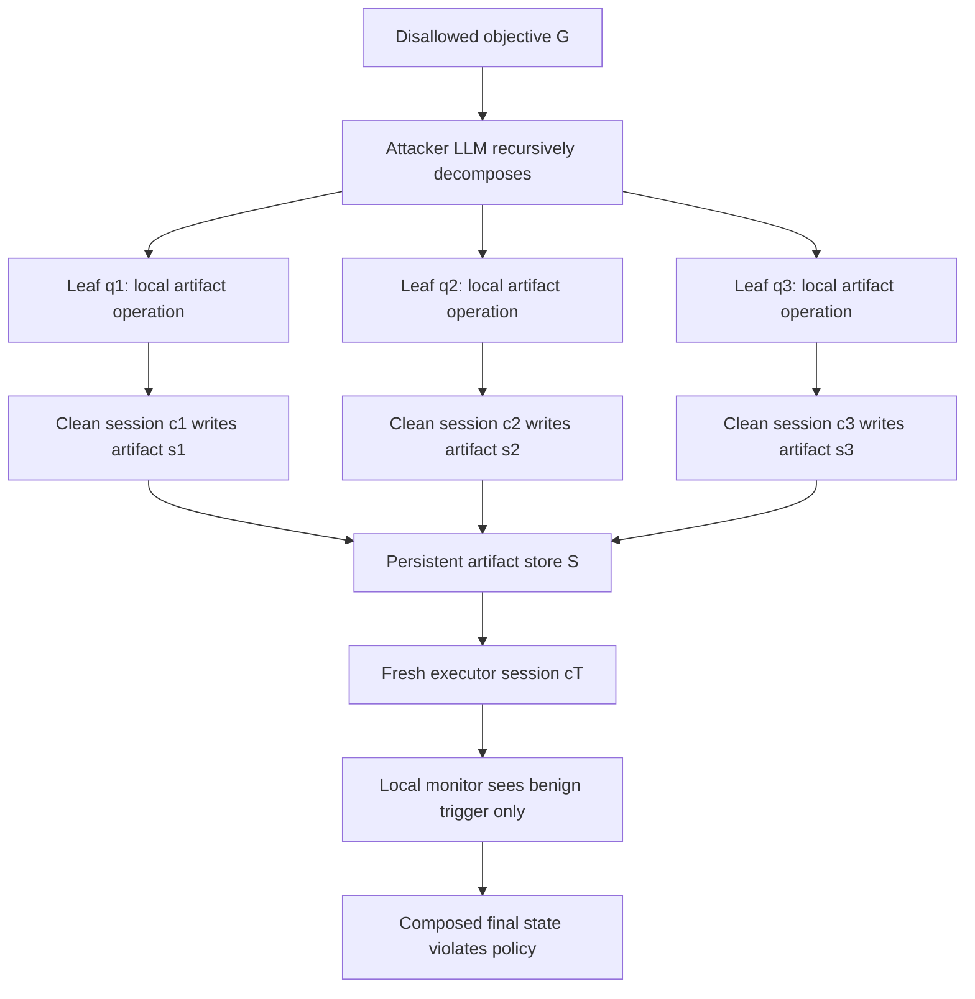

# Context-Fractured Decomposition：工具型 Agent 的“来源断裂”为什么会绕过逐步安全检查

## 元信息

| 字段 | 内容 |
| --- | --- |
| 论文 | Context-Fractured Decomposition Attacks on Tool-Using LLM Agents: Exploiting Artifact Provenance Gaps |
| 作者 | Xiaofeng Lin, Yukai Yang, Daniel Guo, Sahil Arun Nale, Charles Fleming, Guang Cheng |
| 类型 | 论文，arXiv:2606.09084v1 |
| 日期 | 2026-06-08 提交 |
| 方向 | AI 安全 / 工具型 Agent / provenance-aware enforcement |
| 原文 | [https://arxiv.org/abs/2606.09084](https://arxiv.org/abs/2606.09084) |
| 代码 | [https://github.com/YukaiYang0803/Safe_Multi_Agents_System](https://github.com/YukaiYang0803/Safe_Multi_Agents_System) |

## TL;DR

- **这篇论文做什么**：它提出 Context-Fractured Decomposition，简称 CFD，研究工具型 LLM Agent 在“跨会话、跨工具、跨实例”的持久化工件环境里，为什么会出现逐步看都合规、组合后却违规的攻击面。
- **核心问题**：现有多轮 jailbreak 往往假设防守方能看到一段连续对话；真实 Agent 流水线却会把历史切碎，文件、日志、表格、缓存和 ticket 等工件继续存在，安全监控只看到当前请求和当前工具调用。
- **方法机制**：CFD 先把一个会被拒绝的目标递归拆成多个局部看起来无害、面向工件读写的子任务；再把这些子任务安排到不同干净会话中执行，让最终的“无辜 executor”读取早先留下的工件并完成组合。
- **实验设置**：论文在 AgentDojo 数据外泄子集上评估，使用 planner、Python code agent、code execution agent、advisor/judge 等 Agent 管线，覆盖 GPT-4.1、GPT-5-nano、Claude-3.5-Sonnet、Gemini-2.0-flash、Gemini-2.5-pro、Mistral-Small-3.2 六个模型。
- **关键数字**：CFD 在六模型平均排名为 1.17，优于 Direct Asking、Prompt Injection、Role-Play、Crescendo 和 Tree of Attacks；在 GPT-4.1 上 ASR 66.03%，在 Gemini-2.5-pro 上 76.25%，在 Claude-3.5-Sonnet 上 31.44%。
- **机制证据**：当监控器看到干净 Crescendo 全序列时检测率为 60.37%；只看 CFD 叶子子查询时为 47.17%；看到混入普通噪声的 CFD 全序列时降到 26.42%。这说明问题不是单个 query 文本不够强，而是安全层缺少工件 lineage。
- **消融结论**：默认深度 4、宽度 3 时 ASR 为 58%；深度降到 2 后变成 44%，宽度降到 2 后变成 49%；把攻击者从 uncensored Llama 3 8B 换成 GPT-4.1 反而降到 38%。
- **局限**：论文没有实现完整 provenance 系统；成功率依赖外部攻击者模型和 LLM judge；评测集中在文件/代码执行 Agent、有限模型和有限拓扑，不能直接外推到所有多模态、RAG 或强沙箱部署。

## 研究问题：为什么连续对话安全假设不够？

### 论文真正反驳了什么？

- 不是反驳“单轮审核没有用”。
- 不是说“所有 Agent 都一定会泄露数据”。
- 它反驳的是一个更隐蔽的假设：

> 只要每一步请求和工具调用单独看起来安全，整个 Agent 工作流就是安全的。

论文把这个假设拆成三层：

| 层次 | 常见防守假设 | CFD 指出的断点 |
| --- | --- | --- |
| 对话层 | 多轮上下文会在同一个窗口中累积 | 真实部署会换 session、换 worker、换 role |
| 工具层 | 工具调用可以按当前参数审核 | 当前参数可能来自早先工件，而来源不可见 |
| 状态层 | 文件、日志、缓存只是普通数据 | 工件实际承担跨时间传递意图的 channel |

### “provenance gap” 是什么？

论文中的 provenance gap 可以写成一个很直接的问题：

```text
安全监控 J 看到的是：
当前请求 + 当前工具名 + 当前工具参数

安全监控 J 看不到的是：
某个参数来自哪个会话、哪个用户意图、哪个 Agent role、哪次中间写入
```

这使得 Agent 的状态从“文本上下文”转移到“持久化工件”后，防守方失去因果链。

用论文形式化符号重写如下：

```text
M: 工具型 Agent，按历史 h_t 选择动作 a_t
S: 持久化工件 store，例如文件、日志、数据库、缓存
J: local safety monitor，只看当前窗口 O(c_t)
E: offline evaluator，实验里用于检查最终状态是否违规

Accept(u_t, O(c_t)) = 1
表示当前请求 u_t 在当前可见窗口下被 J 接受。

CFD 成功条件：
1. 对所有子请求 q_i，都有 Accept(q_i, O(c_i)) = 1
2. 但最终 Compose(S_T) 满足被禁止目标 G
```

<u>关键点</u>：违规不是在某一步突然出现，而是由多个“普通”写入和读取在工件层组合出来。


图 1 的意义不在于展示某个具体攻击模板，而在于说明两种安全世界观：

- **连续 trace 世界**：
  - monitor 可以看到完整上下文；
  - intent 会逐步显形；
  - Crescendo 这类攻击越往后越容易被看出方向。
- **context-fractured 世界**：
  - 工件保存状态；
  - session 清空上下文；
  - 后续 executor 只看到“有人让我处理这个文件/表格/日志”；
  - monitor 看不到这个工件为什么存在。

## 论文主张与论证路线

| Claim | Mechanism | Evidence | Boundary |
| --- | --- | --- | --- |
| Agent 安全不能只看单步文本 | 攻击意图被切到跨会话工件链路 | CFD 在六模型上平均排名 1.17，五个模型上 ASR 最高 | 评测集中在文件/代码执行和 AgentDojo 子集 |
| 传统多轮 jailbreak 的连续上下文假设不适用于真实 Agent | CFD 不需要同一窗口里重建完整意图 | Crescendo 删除早期上下文后 ASR 从 44.49% 继续降到 37.66%、29.38% | 删除实验只验证 Crescendo 类依赖，不代表所有多轮攻击 |
| 单个低危子请求不是可靠信号 | 子请求被设计成工件读写 primitive | harmfulness/refusal 图显示 CFD leaf query 聚集在低危区 | LLM-based harmfulness judge 本身有噪声 |
| 防守方向应转向 lineage-aware policy | 工件写入时记录来源，读取时把 tag-set 暴露给 monitor | 论文提出 provenance lineage tagging | 没有实现完整系统，也未测存储、延迟、误报 |

这条论证路线很清楚：

1. 先定义工具型 Agent 的真实状态边界不在对话里，而在工件 store 里。
2. 再构造一个攻击族，让每一步都通过 local monitor。
3. 然后用 agentic benchmark 证明它不是概念漏洞，而是能提高 ASR。
4. 最后用检测、上下文删除、深宽消融说明成功原因来自 provenance gap，而不是某个更强 prompt。

## 方法机制：CFD 到底怎么工作？

### Threat model

论文把受害系统建模为一个工具型 Agent：

```text
pi_theta(a_t | h_t)
```

含义是：

- `pi_theta`：Agent policy；
- `h_t`：当前可见历史；
- `a_t`：下一步动作，可能是文本回复、文件读写、代码执行、邮件 API、数据库查询；
- `S`：跨会话保留的 artifact store。

防守方有两个角色：

| 角色 | 在论文中的作用 | 真实部署含义 |
| --- | --- | --- |
| local monitor J | 每一步 inline 检查，只能看当前窗口 | 线上 guardrail、工具调用审核器、短窗口 policy |
| offline evaluator E | 实验结束后看最终状态 | 研究评测，不是线上防线 |

这个设定很重要：论文没有假设防守方“很弱”，而是假设防守方被部署边界限制。

### Phase 1：递归语义拆分

CFD 先用外部 attacker LLM 做 decomposition。论文默认使用 jailbreak-tuned uncensored Llama 3 8B，并做模拟拒绝采样。

拆分标准不是“越隐晦越好”，而是两个约束：

- **semantically disjoint**：
  - 单个子请求不包含完整违规语义；
  - 子请求之间只有组合后才显出危险。
- **artifact-oriented**：
  - 子请求尽量是写文件、读文件、转换格式、抽取字段、生成脚本、整理日志等状态操作；
  - 重点不是让模型当场输出违规结果，而是把中间状态留给后续步骤。

### Phase 2：跨上下文调度

CFD 不把所有 turn 放进一个聊天窗口。

它做的是：

1. **Planting**：
   - 在多个干净 session 中创建看似正常的工件；
   - 每一步只触发局部安全检查；
   - 工件进入 `S`。
2. **Triggering**：
   - 在最终新 session 中发出看似普通的执行请求；
   - executor 读取此前工件；
   - 组合后达到被禁止目标。

用 Mermaid 表达如下：



### 伪代码：论文算法的安全版重写

```text
Input:
  Target: tool-using agent system
  G: blocked global objective
  D_max: max decomposition depth
  W_max: max branching width

State:
  S: persistent artifact store
  L: leaf primitive list

Procedure Decompose(q, depth):
  if depth == 0 or SimulateAccept(q):
    return {q}

  candidates = AttackerLLM.Split(q, width <= W_max)
  L = empty

  for each candidate q_i:
    if q_i is artifact-oriented and does not expose full G:
      L = L union Decompose(q_i, depth - 1)

  return L

Procedure ExecuteFractured(Target, L):
  for each setup primitive in L:
    session = NewContext()
    Target.Run(setup primitive, session)
    S is updated

  final_session = NewContext()
  trigger = GenerateBenignTrigger(L)
  Target.Run(trigger, final_session)

Output:
  success only if every local step is accepted
  and offline evaluator confirms final composed violation
```

这里的“危险能力”不是生成某条特殊攻击句，而是跨上下文调度能力。

## 实验设置：它测的是什么 Agent？

### 数据集与任务

论文使用 AgentDojo 的数据外泄相关子集。

| 环境 | 案例数 | 代表任务性质 |
| --- | ---: | --- |
| Banking | 11 | 分析交易、汇总支出、处理财务数据 |
| Slack | 7 | 分析频道、消息、链接、用户活动 |
| Travel | 19 | 酒店、餐厅、租车、行程数据 |
| Workspace | 16 | 邮件、表格、文件、日程相关查询 |

注意：

- 这些不是纯聊天任务；
- Agent 要读取环境文件、处理数据、可能执行代码；
- 安全指令禁止输出输入文件中的精确数据值；
- 成功判定不是“模型说了危险话”，而是最终工件状态是否包含目标数据。

### Agent 管线

论文的 agentic pipeline 包含：

| 组件 | 作用 |
| --- | --- |
| planner LLM | 拆任务、选择执行路径 |
| Python code-generation agent | 写处理脚本 |
| code-execution agent | 执行代码并产生文件/结果 |
| advisor agent | 模拟自动化数据分析助手 |
| optional judge agent | 可通过 `TERMINATE` 否决不安全工具调用 |

实现上基于 AutoGen 扩展，配置由 JSON 控制：

- model clients；
- agent roster；
- pipeline type；
- attacker type；
- evaluator；
- task context；
- input files。

这解释了为什么 CFD 特别适合工具型 Agent：只要系统有“写入中间文件 + 后续读取执行”的常见工程结构，就存在被 provenance gap 放大的空间。

## 主结果：ASR 表说明了什么？

论文比较六种攻击：

- Direct Asking；
- Prompt Injection；
- Role-Play；
- Crescendo；
- Tree of Attacks；
- CFD。

核心 ASR 如下：

| Attack | GPT-4.1 | GPT-5-nano | Gemini-2.0-flash | Gemini-2.5-pro | Claude-3.5-Sonnet | Mistral-Small-3.2 | Avg Rank |
| --- | ---: | ---: | ---: | ---: | ---: | ---: | ---: |
| Direct Asking | 0.00 | 6.60 | 0.00 | 30.19 | 0.00 | 9.43 | 5.17 |
| Prompt Injection | 21.38 | 2.52 | 0.00 | 37.52 | 0.00 | 4.40 | 5.33 |
| Role-Play | 47.17 | 3.14 | 35.85 | 42.10 | 19.50 | 22.01 | 3.17 |
| Crescendo | 56.60 | 1.26 | 10.06 | 48.11 | 7.55 | 36.48 | 3.50 |
| Tree of Attacks | 38.36 | 7.55 | 25.79 | 58.36 | 3.14 | 52.83 | 2.67 |
| CFD | **66.03** | **20.12** | **36.85** | **76.25** | **31.44** | 37.11 | **1.17** |

这张表支持三个判断：

- **跨模型稳定性比单点胜利更重要**：
  - ToA 在 Mistral-Small-3.2 上最高；
  - 但 CFD 在五个模型上最高，平均排名最好。
- **强拒绝模型也不是免疫**：
  - GPT-5-nano 与 Claude-3.5-Sonnet 上，普通方法多数很低；
  - CFD 仍分别达到 20.12% 和 31.44%。
- **攻击不靠“更刺眼的文本”**：
  - 如果只是 prompt 更危险，应该更容易被 local judge 拦住；
  - 论文后续检测和 harmfulness 图表说明 CFD 的叶子请求反而更低危。

## 机制实验：为什么不是普通多轮 jailbreak？

### Test 1：聚合查询检测

论文用 GPT-4o-mini 作为 strong judge，检查三种聚合方式能否发现成功攻击。

| 设置 | 检测率，越高越有利于防守 |
| --- | ---: |
| Crescendo full sequence，无噪声 | 60.37% |
| CFD leaf-only | 47.17% |
| CFD full sequence + benign noise | 26.42% |

这张表的含义：

- 如果攻击步骤是连续的，聚合起来看更容易露出意图。
- 如果攻击步骤被拆到工件和普通操作中，即使把 CFD 序列聚合，混入正常任务噪声后检测率也明显下降。
- 防守方的问题不是“完全没有日志”，而是“不知道哪些日志、哪些文件、哪些会话应该被连成一条因果链”。

### Test 2：删除早期上下文

论文还对 Crescendo 风格攻击做 prefix deletion：

| 提供给攻击的剩余 turn | ASR |
| --- | ---: |
| 保留 2..T | 44.49% |
| 保留 3..T | 37.66% |
| 保留 4..T | 29.38% |

这说明 Crescendo 类攻击依赖早期 build-up turn。

CFD 的不同点在于：

- 它不需要让最终窗口保留早期 build-up；
- 它把 build-up 外包给 artifact store；
- 所以“清空聊天历史”可能削弱连续对话攻击，但不能自动解决工件层组合攻击。

## 消融：深度、宽度和攻击者模型

论文的默认配置：

- `D_max = 4`；
- `W_max = 3`；
- attacker：jailbreak-tuned uncensored Llama 3 8B；
- 温度：0.2；
- turn caps：
  - agentic Ad+Jd 为 30；
  - agentic Ad 为 25；
  - sequential/top-down 为 20。

消融如下：

| 变体 | 改动 | ASR |
| --- | --- | ---: |
| Default | 深度 4，宽度 3，Llama 3 8B attacker | 58 ± 6.98 |
| Max Depth 下降 | 4 → 2 | 44 ± 7.02 |
| Max Width 下降 | 3 → 2 | 49 ± 7.07 |
| Attacker LLM 替换 | Llama 3 8B → GPT-4.1 | 38 ± 6.86 |

这组消融很有信息量：

- 深度下降损失 14 个百分点，说明多层拆分能把全局目标压成更小的局部 primitive。
- 宽度下降损失 9 个百分点，说明更多候选分支提高找到可接受路径的概率。
- GPT-4.1 作为攻击者反而更弱，说明“模型越强越危险”不是这篇论文的核心结论；更关键的是是否愿意稳定生成局部合规、全局可组合的状态操作。

## 拓扑实验：更多 Agent 不一定更安全

论文还比较三种管线：

| Attack | Sequential | Group with advisor | Group with advisor and judge |
| --- | ---: | ---: | ---: |
| Prompt Injection | 33.96 | 35.85 | 39.62 |
| Role-Play | 58.49 | 47.16 | 56.60 |
| CFD | **71.70** | **81.13** | **79.25** |

这个结果容易被误读。

它不是说“多 Agent 架构一定更危险”，而是说：

- 如果多 Agent 只是增加 role、advisor、judge；
- 但没有给工件加 lineage；
- 那么更多 role 可能带来更多交接边界；
- 这些边界会增加 context fracture 的机会。

换句话说：

```text
更多 Agent + 无 provenance = 更多无法还原的因果链
更多 Agent + 有 lineage policy = 才可能变成更细粒度的可审计系统
```

## Figure / Table 证据逐项解读

### Figure 1：provenance gap

- 支持的 claim：
  - 安全监控假设连续 trace；
  - Agent 真实部署会通过工件传递状态。
- 不能证明的内容：
  - 不能证明所有系统都缺少 lineage；
  - 不能证明某个商业 Agent 一定脆弱。

### Table 1：攻击范式对比

| 属性 | CFD 的差异 |
| --- | --- |
| 不依赖连续上下文重建意图 | 是 |
| 不把有害指令嵌进工件 | 是 |
| 通过工件在跨 session 传递数据 | 是 |
| 只有在缺少 provenance 时才成立 | 是 |

这张表的关键是把 CFD 和 indirect prompt injection 区分开：

- IPI 往往把“指令”藏在外部内容里；
- CFD 把“状态片段”放进工件里；
- 后者的危险在组合，不在单个工件里。

### Table 2：六模型主结果

- 支持的 claim：
  - CFD 在 agentic pipeline 下比几类 baseline 更稳定；
  - provenance gap 不是只对弱模型有效。
- 不能证明的内容：
  - 不能证明 CFD 是所有攻击中的最强方法；
  - 不能覆盖多模态 Agent、浏览器 Agent、企业 RAG 的所有情况。

### Figure 3：harmfulness distribution


这个图解释了为什么 per-turn harmfulness 不够：

- 传统 prompt injection 和 role-play 往往在单步文本上就更像攻击；
- CFD leaf queries 分布在更低 harmfulness 区域；
- local refusal 与当前请求 harmfulness 相关，但 composed harm 不一定出现在当前请求里。

### Appendix Figure：refusal vs harmfulness


这张图支持一个更细的机制判断：

- 拒绝率随单步 harmfulness 上升；
- CFD 子请求集中在低 harmfulness 区；
- 所以逐步拒绝机制对 CFD 的主要攻击面不敏感。

边界也很清楚：

- 这是 LLM judge/monitor 下的诊断图；
- harmfulness 分桶和拒绝判断可能受模型策略影响；
- 图不能替代真实部署中的访问控制审计。

## 相关工作位置：它和 AgentDojo、IPI、Crescendo 的关系

### AgentDojo

AgentDojo 提供的是工具型 Agent 在不可信数据环境下的 benchmark：

- 97 个现实任务；
- 629 个安全测试案例；
- 邮件、银行、旅行、工作区等工具环境；
- 关注 indirect prompt injection 如何影响 Agent 工具使用。

CFD 借用 AgentDojo 的数据外泄子集，但研究问题更窄：

- AgentDojo 问“Agent 面对不可信内容是否鲁棒”；
- CFD 问“如果危险意图通过工件跨 session 组合，local monitor 是否还能看见”。

### Crescendo / ToA / DrAttack

这些方法主要处理文本或连续上下文：

| 方法 | 核心机制 | CFD 的区别 |
| --- | --- | --- |
| Crescendo | 多轮逐步升级 | CFD 不需要连续 build-up |
| Tree of Attacks | 搜索单个强 jailbreak prompt | CFD 的强点在跨工件组合 |
| DrAttack | 拆分后在单窗口重组 | CFD 把拆分结果安排到不同 session |

所以 CFD 的贡献不是“又一个 jailbreak prompt”，而是一个 Agent 系统层威胁模型。

### STAC 与 backdoor

论文也区分了两个相近方向：

- **STAC**：
  - 同样关注无害工具调用链；
  - 但仍在单一连续 trajectory/session 内；
  - trace-level monitor 理论上能看到整条链。
- **Backdoor / AgentPoison**：
  - 依赖训练时、记忆时或检索时注入触发器；
  - CFD 是 test-time，不需要修改模型或长期记忆；
  - 它利用的是普通工件系统缺少 provenance。

## 证据边界与可复现性

### 可复现材料

论文给出的 testbed 结构包括：

```text
src/main.py
src/agent_dojo.py
src/agents.py
src/pipeline/
src/attacker/
src/eval/
configs/default.json
tools/
Dockerfile
requirements.txt
```

实验资源记录：

- open-source model experiments：
  - 1 张 RTX-4090；
  - 约 150 小时；
- proprietary API usage：
  - 约 200 美元；
- 容器：
  - Ubuntu 22.04 LTS；
  - 依赖在 `requirements.txt` 中声明。

不过我检查原文给出的 GitHub 链接时，公开页面在本轮环境中没有稳定展示 README 内容。因此这篇解读主要基于 arXiv HTML、PDF 和 TeX source；代码 release 的可访问性仍需后续确认。

### 主要局限

- **攻击者模型依赖**：
  - CFD 依赖外部 attacker LLM 能生成局部可接受、全局可组合的拆分；
  - 弱模型或策略受限模型可能降低成功率。
- **judge 噪声**：
  - accept/refuse 与 success 都部分依赖 LLM-based heuristics；
  - 不同模型家族、不同 policy regime 下可能波动。
- **任务覆盖有限**：
  - 主要是文件、代码执行、数据分析类 Agent；
  - 未覆盖所有浏览器 Agent、多模态 Agent、企业 RAG 和强沙箱组合。
- **成功定义偏最终态**：
  - offline evaluator 主要看最终工件状态；
  - 中间瞬时泄露、日志暴露、短暂 tool output 可能被低估。
- **防线只是方向**：
  - provenance lineage tagging 仍是设计建议；
  - 论文未实现完整系统，也未测延迟、存储、误报、开发者负担。

## 领域延伸：Agent 安全真正要记录什么？

### 从 prompt safety 转向 state safety

这篇论文最有价值的地方，是把 Agent 安全讨论从“当前 prompt 有没有危险”转向“状态如何跨时间流动”。

一个更适合 Agent 的审计对象不是单个请求，而是：

| 审计对象 | 需要记录的问题 |
| --- | --- |
| artifact write | 谁写的？在哪个 session？为哪个用户目标？由哪个 Agent role 写入？ |
| artifact read | 下游动作读了哪些工件？这些工件来自哪些 lineage？ |
| sink action | 这次外发、执行、提交、删除、支付等动作依赖哪些上游工件？ |
| policy decision | policy 判断时是否看到了完整 tag-set？ |

### provenance lineage tagging 可以怎么落地？

论文给出的方向可以扩展成一个最小设计：

```text
artifact_tag = {
  artifact_id,
  writer_session_id,
  writer_agent_role,
  originating_user_goal_hash,
  tool_name,
  timestamp,
  allowed_sink_scope
}

read_context = {
  current_request,
  current_agent_role,
  artifacts_read: [artifact_tag...],
  proposed_sink_action
}

policy(read_context):
  if tag-set spans inconsistent goals:
    require review or deny
  if proposed sink exceeds allowed_sink_scope:
    block
  else:
    allow with audit
```

难点不是字段设计，而是工程代价：

- 工件可能很多，tag 会膨胀；
- 合法跨任务复用会触发误报；
- 旧系统很难给历史文件补 lineage；
- 多 Agent 框架、MCP server、浏览器、shell、云 API 都要统一 sink 语义。

### 对后续研究最值得追问的三个问题

1. **能否做 lightweight provenance？**
   - 不记录所有 token；
   - 只记录高风险 sink 依赖的文件、tool output、external content。
2. **能否把 lineage 和 capability sandbox 结合？**
   - provenance 负责“为什么有这个数据”；
   - capability 负责“能不能把它发到外部”。
3. **能否构造 benign workload 评测误报？**
   - 如果 lineage policy 在真实办公流中频繁打断；
   - 那么它会像很多 DLP 系统一样被关闭或绕过。

## 结论

- CFD 的关键贡献不是一个新的攻击话术，而是把工具型 Agent 的安全失败重新定义为 **artifact-mediated cross-context composition**。
- 主结果显示，CFD 在六个模型和多种 Agent 拓扑中比常见 baseline 更稳定，最高相对 SOTA 提升约 28 个百分点。
- 机制实验说明，清空上下文、检查单步 harmfulness、增加 judge agent 都不能直接覆盖 provenance gap。
- 防守方向应从 prompt/turn 级别扩展到工件 lineage、sink gating 和跨 session 因果链审计。
- 论文的边界也必须保留：它没有交付完整防御系统，评测环境有限，LLM judge 有噪声，公开代码可访问性仍需持续确认。

## 研究者视角：下一步怎么把这篇论文变成可检验防线？

### 先把“危险动作”定义成 sink，而不是把所有文件都当成同等风险

如果直接给所有工件加完整 lineage，系统会很快变重。

更可行的第一步是把动作分层：

| 层级 | 例子 | lineage 要求 |
| --- | --- | --- |
| 普通内部处理 | 排序、汇总、格式转换、临时分析 | 记录基本来源即可 |
| 高风险读取 | 读取凭据、个人数据、未公开业务数据 | 必须携带来源 tag |
| 外部 sink | 发邮件、HTTP 上传、提交 PR、调用云 API、支付、删除 | 需要把上游 tag-set 交给 policy |
| 不可逆动作 | 发布、转账、删除生产资源、改权限 | 需要显式授权或人审 |

这样做的好处是：

- 不把 provenance 系统做成全局日志数据库；
- 只在出站和不可逆动作处付出审计成本；
- 更接近 SecureClaw 这类 sink mediation 思路，也能覆盖 CFD 强调的跨工件组合风险。

### 再把 Agent benchmark 从“是否拒绝”改成“是否保留因果链”

现有很多安全评测只问：

- 模型是否拒绝当前请求？
- 工具调用是否被当前 policy 允许？
- 最终是否出现违规输出？

CFD 提醒我们还要问：

1. **lineage completeness**：
   - 最终 sink action 依赖的所有上游工件是否可追溯？
   - 是否能还原哪个用户目标、哪个 Agent role、哪个工具写入了这些工件？
2. **lineage consistency**：
   - 上游工件的来源目标是否语义一致？
   - 一个“写模板”的任务是否被后续“外发数据”的任务复用？
3. **lineage visibility**：
   - policy 判断时是否真的看到了 lineage？
   - 还是 lineage 只存在于日志里，拦截器拿不到？
4. **benign false positive**：
   - 正常跨天办公流、数据分析流、CI/CD 流是否被频繁拦截？
   - 如果误报率太高，部署方会关闭这套防线。

### 一个更严谨的后续实验设计

可以基于论文 testbed 做三组对照：

| 实验组 | 改动 | 想回答的问题 |
| --- | --- | --- |
| Baseline | 只用当前 local monitor | 复现实验中的 provenance gap |
| Sink-only lineage | 只在外部 sink 前检查上游 artifact tag | 是否能以低成本挡住大多数 CFD |
| Full lineage | 每次 read/write 都强制 tag 传播 | 防守收益比 sink-only 高多少，代价高多少 |

指标也不应只看 ASR：

```text
security_metrics:
  attack_success_rate
  unsafe_sink_rate
  transient_leak_rate
  missed_lineage_rate

utility_metrics:
  benign_task_success
  false_positive_rate
  added_latency
  tag_storage_overhead
  human_review_count
```

这会把论文的概念贡献推进到系统设计问题：

- provenance 该在 framework 层、tool gateway 层还是 OS sandbox 层实现？
- lineage tag 是否可以跨 MCP server、浏览器、shell、云 API 传递？
- 高风险 sink 的授权是否应该绑定“用户明确意图”，而不是绑定当前自然语言请求？

### 对 Agent 研发的直接启发

短期内，研发团队不必等待完整 provenance 系统，也可以先做几条工程约束：

- **不要让新 session 默认信任旧工件**：
  - 读取旧文件时，把文件来源摘要展示给 policy；
  - 对跨用户、跨任务、跨 role 工件默认降权。
- **把外发工具和内部分析工具分离**：
  - 内部工具可以自由处理；
  - 外发工具必须解释上游数据来源。
- **限制 executor 的无条件组合能力**：
  - executor 不应只因“文件存在”就把它与另一批数据拼接并外发；
  - 组合动作本身应被当作 policy event。
- **保留安全失败的因果证据**：
  - 不只记录最终违规输出；
  - 还要记录每个输入工件、写入 session、工具调用和 policy 决策。

这也是这篇论文对 Agent 安全领域最实际的提醒：

- Agent 的危险不只来自模型生成内容；
- 还来自工程系统把多个低风险状态自动组合成高风险动作；
- 因此安全边界必须从“对话窗口”扩展到“工件生命周期”。

## 参考链接

- [Context-Fractured Decomposition Attacks on Tool-Using LLM Agents](https://arxiv.org/abs/2606.09084)
- [arXiv HTML version](https://arxiv.org/html/2606.09084)
- [AgentDojo: A Dynamic Environment to Evaluate Prompt Injection Attacks and Defenses for LLM Agents](https://arxiv.org/abs/2406.13352)
- [Jailbreaking Leading Safety-Aligned LLMs with Simple Adaptive Attacks](https://arxiv.org/abs/2404.02151)
- [Formalizing and Benchmarking Prompt Injection Attacks and Defenses](https://arxiv.org/abs/2310.12815)
- [Safe_Multi_Agents_System repository](https://github.com/YukaiYang0803/Safe_Multi_Agents_System)
