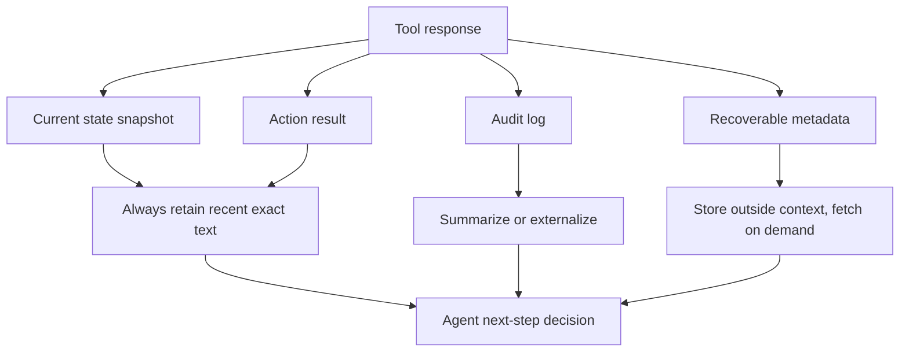

# Less Context, Better Agents：长程工具 Agent 不是缺上下文，而是缺上下文治理

> 研究者精读：这篇论文的关键价值，是把“上下文工程”从经验口号落到一个可测的企业工具工作流里。它证明在 D365 F&O 这类 verbose MCP 工具环境中，完整历史不一定帮助 Agent，反而可能把过期表单状态变成错误证据。

## 元信息

| 字段 | 内容 |
|---|---|
| 论文 | Less Context, Better Agents: Efficient Context Engineering for Long-Horizon Tool-Using LLM Agents |
| 作者 | Abhilasha Lodha, Mahsa Pahlavikhah Varnosfaderani, Abir Chakraborty, Abhinav Mithal |
| 机构 | Microsoft |
| 日期 | arXiv v1：2026-06-08 22:01:28 UTC |
| 链接 | [arXiv](https://arxiv.org/abs/2606.10209) / [PDF](https://arxiv.org/pdf/2606.10209) / [HTML](https://arxiv.org/html/2606.10209) |
| 任务域 | Microsoft Dynamics 365 Finance and Operations, D365 F&O |
| 工具协议 | Model Context Protocol, MCP |
| 核心问题 | 企业工具响应太长，Agent 把过期状态塞进上下文后反而更容易错 |

## TL;DR

- **这篇论文做什么**：研究长程工具型 LLM Agent 在企业 ERP 工作流中，应该保留完整对话历史，还是只保留最近工具交互并摘要旧交互。
- **怎么做**：作者在 D365 F&O 酒店报销 itemization 任务上比较四种配置：`C1` 无 user model、`C2` full context、`C3` 最近 5 个 tool call/response pairs、`C4` 最近 5 个工具对加自动摘要。
- **实验设计**：主实验是 50 个酒店报销任务，每种配置跑 5 次；成功必须把剩余未分配金额精确做到 `$0.00`，不是“差不多完成”。
- **关键数字**：`C2` full context 完成率 `71.0%`，消耗 `1,480,996` tokens、`14.56` 小时；`C3` 完成率升到 `79.0%`，tokens 降到 `535,274`；`C4` 完成率达到 `91.6%`，平均金额 itemized `99.64%`，tokens 仍只有 `553,374`。
- **失败证据**：full context 的 stale-state reference 有 `34` 次；剪枝后降到 `6` 次，但 pure pruning 会增加 premature termination；加入摘要后 premature termination 从 `18` 降到 `3`。
- **局限**：任务集中在 D365 F&O expense workflow，数据是内部 benchmark；摘要器是单次自由文本 LLM pass；`N=5, W=3` 是该任务结构下的 knee point，不能直接推广为所有 Agent 的常数。
- **研究意义**：它把上下文策略变成可评估系统变量：影响可靠性、成本、状态一致性和失败模式。

## 研究问题：为什么“更多上下文”会让工具 Agent 更差？

### 1. 企业工具响应为什么特别长？

D365 F&O 这类 ERP 系统的工具响应不是简短 JSON。

- 它会返回：
  - 表单字段值；
  - 控件元数据；
  - 导航 breadcrumb；
  - 当前 tab、grid、row 状态；
  - 系统状态和可操作控件。
- 单次 tool response 可能有 `500-3,000` tokens。
- 一个报销拆分任务需要 `15-30` 次工具交互。
- 完整历史会快速累计到 `50,000-150,000+` tokens。

这不是传统 RAG 的“资料太多”问题，而是执行环境每一步都产生大量新状态。

### 2. 为什么完整历史不是可靠性保障？

在工具型 Agent 里，旧上下文经常描述的是**已经失效的世界**。

- 第 3 步看到的 remaining amount，到了第 11 步已经不成立。
- 第 5 步打开的 form control，到了第 14 步可能已关闭或保存。
- 第 7 步 grid row 的 index，后面可能因插入新行而改变。
- 早期 tool response 的完整快照，会和最新 tool response 竞争注意力。

所以 full context 的问题不是浪费 token，而是混入 stale state。

### 3. 作者测试的真正假设

| 假设 | 机制 | 可观察证据 |
|---|---|---|
| 最近工具交互比完整历史更决策相关 | 保留当前 form state 和最近动作结果 | C2 -> C3 成功率上升、token/time 下降 |
| 摘要能补回剪枝丢掉的全局进度 | 压缩旧动作，不保留旧表单快照 | C3 -> C4 premature termination 降低 |

这两条合在一起，才是论文标题里的 “Less Context, Better Agents”。

## 论文主张与论证路线

| Claim | Mechanism | Evidence | Boundary |
|---|---|---|---|
| Full context 会伤害长程工具 Agent | 旧工具响应携带过期表单状态 | C2 完成率 `71.0%`，stale-state failure `34` 次 | 只在 D365 F&O expense workflow 中直接验证 |
| 最近 5 个工具对足以覆盖局部工作记忆 | 一个 itemization line 大约需要 2-3 次工具调用 | C3 完成率 `79.0%`，token 从 `1,481.0K` 降到 `535.3K` | `N=5` 依赖该任务结构 |
| 摘要旧交互能保留全局进度 | 摘要记录表单、控件、已录入数据和进度 | C4 完成率 `91.6%`，`<10% remaining` 达 `99.6%` | 摘要质量依赖 LLM |
| 上下文工程能同时提效和提质 | 减少输入 token，也减少状态噪声 | C4 比 C2 token 少 `62.7%`，耗时少 `60.2%` | 不等于所有任务都应固定剪枝 |
| 策略有一定迁移迹象 | 跨类别和 Sonnet 4.5 都符合排序 | Travel `76.0 -> 95.0`，Sonnet `92.0 -> 94.5` | 跨模型矩阵仍很窄 |

## 方法机制：C2、C3、C4 到底差在哪里？

论文最容易被误读的地方，是把 `C1 -> C2` 也看成上下文工程收益。

- `C1` 移除了 user model，也没有 context policy。
- `C2-C4` 都有 user model。
- 真正隔离上下文策略的是 `C2 -> C3 -> C4`。

| 配置 | User model | Context policy | 作用 |
|---|---:|---|---|
| C1: GPT-5 only | 无 | 无特殊策略 | 说明非交互 harness 下 GPT-5 会停住 |
| C2: GPT-5 + User | 有 | full conversation history | 标准 full-context baseline |
| C3: GPT-5 + User | 有 | 只保留最近 5 个 tool call/response pairs | 测试 recency pruning |
| C4: GPT-5 + User | 有 | 最近 5 个工具对 + 旧交互摘要窗口 3 | 测试 pruning + summarization |

这里的 user model 是 `GPT-4.1`，作用是在非交互 harness 中回答 Agent 的确认或追问，避免主 Agent 卡住。

### Context construction algorithm

论文的算法单位不是 token，而是 whole tool call/response pair。

- token-level compression 可能破坏字段名、金额、控件 ID；
- tool-pair-level pruning 至少保留最近交互的原始精度；
- 摘要只进入被移除区域，不改写保留区。

```text
Input:
  H = full message history
  N = number of recent tool messages to keep
  W = summary window

Process:
  1. Count tool messages in H.
  2. Evict the oldest max(0, count - N) tool messages.
  3. If the evicted tool message has a preceding assistant tool-call message,
     evict that assistant tool-call message together.
  4. If W != 0 and E is not empty:
       summarize the last W evicted messages
       insert one summary message at the earliest evicted position.
  5. Return compact context.
```

对应到实验：

| 配置 | 参数 |
|---|---|
| C2 | `N = infinity` |
| C3 | `N = 5, W = 0` |
| C4 | `N = 5, W = 3` |

## 任务设计：为什么酒店报销 itemization 是好压力测试？

每个任务要求 Agent：

1. 打开指定公司下的 D365 F&O expense line；
2. 根据 `PurchasedItems` 创建 itemization lines；
3. 为每个项目选择正确 expense subcategory；
4. 输入金额；
5. 持续操作，直到 remaining amount 精确变成 `$0.00`。

### 代表性样例

论文给出的样例总额是 `$333.05`：

| Item | Amount | 难点 |
|---|---:|---|
| Daily Room Rate | `$138.10` | 常规房费 |
| Hotel Tax | `$6.82` | 与下一项同名不同金额 |
| Hotel Tax | `$10.23` | 容易被 Agent 当成重复项跳过 |
| Entertainment External | `$101.58` | 需要映射到 Business entertainment |
| Room Service & Meals | `$76.32` | 需要映射到 Room service |

这说明两个核心失败源：

- **重复 subcategory 不等于重复 line item**：`Hotel Tax` 可以出现两次。
- **自然语言 item 不等于 F&O category enum**：需要业务映射，而不是照抄。

### 指标定义

```text
CompletelyItemized = 1[remaining_amount = 0.00]

LessThan10Percent = 1[remaining_amount / total_amount <= 0.1]

AtLeastOne = 1[num_itemized > 0]

PercentAmountItemized = 100 * itemized_amount / total_amount
```

在 ERP 里，`99%` 金额被拆完但剩 `$3.00`，仍然不能算生产可用，因为报销单不能 finalize。

## 主结果：C4 为什么不是“小幅优化”？

### 50-task 酒店 benchmark 主表

| 配置 | 完全 itemized | <10% remaining | >=1 itemized | % amount itemized | Total tokens | Time |
|---|---:|---:|---:|---:|---:|---:|
| C1: GPT-5 only | `8.0%` | `37.2%` | `99.6%` | `58.89%` | `532.6K` | `3.08h` |
| C2: Full Context | `71.0%` | `74.0%` | `100.0%` | `92.03%` | `1,481.0K` | `14.56h` |
| C3: Last 5 TC | `79.0%` | `87.0%` | `100.0%` | `96.92%` | `535.3K` | `5.39h` |
| C4: Last 5 + Summary | `91.6%` | `99.6%` | `100.0%` | `99.64%` | `553.4K` | `5.79h` |

### C1：不是上下文实验，而是 harness 诊断

C1 的 `>=1 itemized` 是 `99.6%`，但完全完成只有 `8.0%`。

这说明 GPT-5 能开始任务，但常在中途停下来：

- 询问确认；
- 不确定是否继续；
- 认为已经完成；
- 没有把 remaining amount 追到零。

### C2：full context 能做事，但代价很高

C2 从 `8.0%` 到 `71.0%`，主要来自 user model 和完整任务协议。

代价也非常大：

- token 从 `532.6K` 到 `1,481.0K`；
- time 从 `3.08h` 到 `14.56h`；
- input/output token ratio 接近 `595:1`。

这说明生产瓶颈不在模型输出，而在把越来越长的工具历史反复塞回输入。

### C3：剪掉上下文反而更准

C3 相比 C2：

- 完成率：`71.0% -> 79.0%`；
- token：`1,481.0K -> 535.3K`；
- time：`14.56h -> 5.39h`。

这个结果支持一个强机制判断：

> 对工具 Agent，早期环境快照会变成过期证据。删除它们不是损失信息，而是降低错误注意力竞争。

### C4：最近精确状态 + 紧凑全局进度

C4 相比 C3：

- 完成率：`79.0% -> 91.6%`；
- token：`535.3K -> 553.4K`，只多 `3.4%`；
- time：`5.39h -> 5.79h`，多 `7.4%`；
- `<10% remaining` 达到 `99.6%`。

它说明 pure recency 有一个缺陷：Agent 可能忘记全局进度。

摘要补的是：

- 已经创建了哪些 line；
- 哪些控件已经打开；
- 哪些金额已经输入；
- 是否还有 remaining balance；
- 下一步应该继续 itemize 还是保存/关闭。

## 统计证据：C4 的优势是否只是噪声？

| 配置 | 完全 itemized mean +/- SD | Wilson 95% CI |
|---|---:|---:|
| C2 | `71.0 +/- 4.4` | `[65.1, 76.3]` |
| C3 | `79.0 +/- 8.2` | `[73.5, 83.6]` |
| C4 | `91.6 +/- 1.7` | `[87.5, 94.4]` |

关键读法：

- C2 和 C3 的 Wilson 区间略有重叠，所以作者没有夸大这一步。
- C3 和 C4 的区间分离明显，说明摘要带来的提升更稳。
- C3 的 SD 最大，说明 aggressive pruning 会引入不稳定。
- C4 的 SD 只有 `1.7`，说明摘要不仅提高均值，也降低 run-to-run variance。

这和失败 taxonomy 一致：C3 减少 stale state，但会产生 premature termination；C4 用摘要补回全局任务状态。

## 敏感性实验：为什么是 N=5, W=3？

### Pruning window N

| 设置 | 完全 itemized | Tokens |
|---|---:|---:|
| `N=3, W=0` | `74.0%` | `425K` |
| `N=5, W=0` | `79.0%` | `535.3K` |
| `N=10, W=0` | `80.0%` | `820K` |
| `N=infinity` | `71.0%` | `1,481.0K` |

解释：

- `N=3` 太短，局部操作链不够；
- `N=5` 覆盖约两个 itemization cycles；
- `N=10` 只多 `1` 个点，却多约 `53%` tokens；
- full history 更贵且更差。

### Summary window W

| 设置 | 完全 itemized | Tokens |
|---|---:|---:|
| `N=5, W=1` | `86.4%` | `540K` |
| `N=5, W=3` | `91.6%` | `553.4K` |
| `N=5, W=5` | `92.0%` | `575K` |
| full-history summarization | `92.0%` | `615K` |

解释：

- `W=1` 摘要太短，不能稳定保留任务进度；
- `W=3` 到达 knee point；
- `W=5` 和 full-history summarization 准确率几乎不涨，只增加成本。

## 失败分析：它到底修了哪类错误？

| 失败模式 | C2 | C3 | C4 |
|---|---:|---:|---:|
| Stale-state reference | `34` | `6` | `4` |
| Wrong subcategory mapping | `8` | `9` | `6` |
| Duplicate / skipped repeat item | `12` | `11` | `5` |
| Premature termination | `9` | `18` | `3` |
| Tool / form navigation error | `6` | `5` | `2` |
| Residual amount mismatch | `4` | `4` | `1` |
| Total non-completions | `73` | `53` | `21` |

### C2 的主要问题是 stale state

Full context 下，失败中 `34/73` 是 stale-state reference。

这验证了作者的核心机制：

- Agent 没有缺历史；
- Agent 是被过期历史干扰；
- 长上下文不等于高质量工作记忆。

### C3 修掉 stale state，但带来 premature termination

剪枝后 stale-state reference 从 `34` 降到 `6`。

但 premature termination 从 `9` 升到 `18`。

这说明只看最近状态有副作用：

- Agent 知道当前页面；
- 但忘了全局 itemization 进度；
- 它可能误以为任务已经完成。

### C4 证明摘要补的是全局任务状态

加入摘要后：

- premature termination：`18 -> 3`；
- total non-completions：`53 -> 21`；
- stale-state reference 没有反弹。

所以摘要不是“把旧上下文塞回来”，而是把旧上下文转成低噪声任务状态。

## 跨类别结果：不只是酒店任务

| 类别 | n | C2 完成率 | C3 完成率 | C4 完成率 | C2->C4 提升 |
|---|---:|---:|---:|---:|---:|
| Hotel | `50` | `71.0%` | `79.0%` | `91.6%` | `+20.6` pts |
| Travel | `30` | `76.0%` | `86.6%` | `95.0%` | `+19.0` pts |
| Meals & Gifts | `32` | `75.6%` | `89.4%` | `96.1%` | `+20.5` pts |

作者把复杂度排序为：

```text
Hotel > Travel > Meals & Gifts
```

三类都出现 `C2 < C3 < C4` 的排序。

这说明策略不是只记住了酒店数据集，而是在“verbose MCP tool responses + strict workflow completion”这一类任务中有可迁移性。

## 跨模型结果：Claude Sonnet 4.5 说明什么？

| Sonnet 4.5 配置 | 完全 itemized | Tokens | Time |
|---|---:|---:|---:|
| No CE full context | `88.0%` | `3,562K` | `6.20h` |
| Pruning Last 5 TC | `92.0%` | `2,161K` | `10.70h` |
| Pruning + Summary | `94.5%` | `2,235K` | `11.30h` |

这里有两个信息。

### 1. GPT-5 的 C1 失败不是所有模型都会有

Sonnet 4.5 没有 user model 也能做到 `88.0%`。

这支持作者对 C1 的限定：

- GPT-5 C1 的 `8.0%` 主要是非交互 harness 下的 stalling；
- 不是“没有 context engineering 所以必然只会 8%”。

### 2. 上下文工程排序仍然成立

Sonnet 上：

- full context：`88.0%`；
- pruning：`92.0%`；
- pruning + summary：`94.5%`。

但边界也要看清：

- Sonnet 的 token 基数更高；
- pruning 后 time 反而更长；
- 论文没有给更多模型、多温度、多 provider 的完整矩阵。

## Figure/Table 证据逐项解读

论文没有外部图片素材；核心可视化由 LaTeX/TikZ 生成。这里按证据功能解读。

### Performance bar chart

它展示三条质量指标：

- Completely Itemized；
- `<10% Remaining`；
- `% Amount Itemized`。

它支撑的 claim 是：

> C4 不是只改善一个主指标，而是同时把接近完成和金额覆盖推到接近满分。

不能证明的是：

- C4 在所有工具环境都最优；
- summary window 的自然语言内容一定稳定；
- 生产系统没有额外合规成本。

### Efficiency panels

两个 panel 分别画 token usage 和 wall-clock time。

它支撑的 claim 是：

> C2 的额外上下文主要变成输入 token 成本，而没有换来最高成功率。

关键数字：

- C2 tokens：`1,481.0K`；
- C4 tokens：`553.4K`；
- C2 time：`14.56h`；
- C4 time：`5.79h`。

不能证明的是：

- 所有模型的 latency 都会按相同比例下降；
- token 成本和实际 API 价格完全线性；
- 摘要调用在高并发生产环境没有调度成本。

### Failure taxonomy table

这是最关键的机制表。

它把“为什么 C4 更好”拆成失败模式：

- full context 主要错在 stale state；
- pure pruning 主要错在 premature termination；
- pruning + summary 同时压住两者。

这比只报告成功率更有价值，因为它说明上下文工程不是 prompt trick，而是状态管理策略。

## 与相关工作的关系

### 1. Token-level prompt compression

代表工作包括 LLMLingua 和 Selective Context。

差别在于：

- token compression 删除低信息 token；
- 本文删除或摘要 whole tool pair；
- ERP 表单字段、金额和 enum 不适合被 token-level 模糊压缩。

### 2. External memory / long-term memory

MemoryBank、LongMem、LoCoMo、LongMemEval 等更关注跨会话事实记忆。

本文关注的是：

- 单会话工具执行；
- 当前 form state；
- stale-state avoidance；
- hard completion criterion。

也就是说，它不是“Agent 缺长期记忆”，而是“Agent 需要工作记忆过滤”。

### 3. Agentic context management

更接近的是 ACON、Context as a Tool、以及平台侧 compaction/tool-result-clearing。

本文的选择更简单：

- 固定最近窗口；
- 单次摘要；
- 真实 ERP 端到端评测；
- 用业务成功率、token、time 和失败模式一起衡量。

这个简单性是优点，也是边界。

## 证据边界与可复现性问题

### 已经比较扎实的地方

- 同一 50-task benchmark 每种配置跑 5 次；
- C2-C4 持有相同 user model；
- 主指标是独立 read-back，不依赖 Agent 自报；
- 有 Wilson CI、run-level SD、敏感性、跨类别、跨模型；
- 失败 taxonomy 和机制假设一致。

### 仍然薄弱的地方

1. **数据不可完全复现**
   - D365 F&O 环境、MCP proxy、内部 harness 和具体任务数据没有完整开放。
   - 外部读者无法直接重跑主结果。

2. **摘要器没有结构化约束**
   - 摘要是 free-form LLM pass。
   - 没有证明摘要不会遗漏关键金额、控件或状态。

3. **任务类型仍然集中**
   - 都是 expense itemization 相关任务。
   - 没覆盖采购、库存、审批、合同、财务结账等企业流程。

4. **安全问题没有充分展开**
   - 摘要可能成为新的 state corruption surface。
   - 如果工具响应中含攻击性文本，摘要器可能把 prompt injection 压缩进更高置信的系统状态。

5. **自适应窗口没有实现**
   - `N=5,W=3` 是经验 knee point。
   - 更一般的系统可能需要根据任务阶段、工具类型、错误率动态调节。

## 对 Agent 研究的进一步启发

### 1. Context policy 应该被当成 Agent policy 的一部分

很多 Agent 论文只报告：

- 模型；
- 工具；
- prompt；
- benchmark；
- pass rate。

但这篇论文说明，context policy 本身会改变结果。

以后评测长程 Agent 时，至少应该报告：

| 维度 | 需要披露什么 |
|---|---|
| 保留单位 | token、message、tool pair、trajectory segment |
| 窗口策略 | full history、recent window、importance pruning、learned compression |
| 摘要策略 | 无、自由文本、schema summary、tool-state summary |
| 更新频率 | 每步、每 N 步、milestone、context overflow 触发 |
| 失败审计 | stale state、lost progress、tool misuse、premature stop |

### 2. 工具响应应该分成“当前状态”和“历史证据”

工具返回给 Agent 的内容，不应该只有一个 append-only transcript。



这比“所有工具输出都进聊天历史”更接近真实操作系统的状态管理。

### 3. 摘要不是记忆，而是状态压缩

本文的摘要不应该被理解为长期记忆。

它更像一个临时工作状态：

- 当前任务做到了哪里；
- 哪些动作已经成功；
- 哪些金额已处理；
- 哪些控件/表单曾被操作；
- 下一步仍需满足什么停止条件。

一个更可审计的 schema 可能是：

```yaml
task_state:
  current_form: TrvExpenseLines
  target_total: 333.05
  itemized_lines:
    - label: Daily Room Rate
      amount: 138.10
      status: saved
    - label: Hotel Tax
      amount: 6.82
      status: saved
  remaining_amount: 188.13
  unresolved_items:
    - Hotel Tax: 10.23
    - Entertainment External: 101.58
    - Room Service & Meals: 76.32
  stop_condition:
    - remaining_amount == 0.00
    - expense line saved
    - itemization form closed
```

### 4. AI 安全角度：摘要器会成为新的信任边界

如果工具响应可能含不可信内容，摘要器不是中立组件。

它可能：

- 把恶意工具输出压缩成“已验证事实”；
- 丢掉原始来源，破坏 provenance；
- 把旧攻击指令带入未来上下文；
- 让 Agent 对错误状态更自信。

因此，生产系统中摘要器至少需要：

- 来源标注；
- 工具信任级别；
- 不能把不可信外部文本改写成系统事实；
- 对金额、权限、外部收款方等高风险字段保留原始可追踪证据；
- 摘要变更进入 audit log。

## 结论

这篇论文最值得带走的判断是：

- 长程工具 Agent 的上下文不是越多越好；
- 旧工具响应会制造 stale-state reference；
- pure pruning 会损失全局进度；
- recent exact state + compact progress summary 是一个强基线；
- 上下文策略必须和模型、工具协议、任务停止条件一起评估。

从研究角度看，它把上下文工程推进了一步：不只是说“上下文是有限资源”，而是用真实工具执行任务证明，上下文策略能改变失败类型、成功率和成本曲线。

下一步更值得问的是：

1. 能否把自由文本摘要换成可验证的 structured tool-state summary？
2. 能否让 Agent 自己决定什么时候压缩、保留、回查上下文？
3. 能否在 prompt injection、恶意工具输出和权限变更场景下验证摘要安全？
4. 能否把 stale-state detection 变成运行时 monitor，而不是事后 taxonomy？
5. 能否在 coding agent、browser agent、cloud console agent、workflow agent 中统一比较 context policy？

如果这些问题继续推进，“context engineering”就不会只是 prompt engineering 的新名字，而会成为 Agent 系统里的状态管理层。
