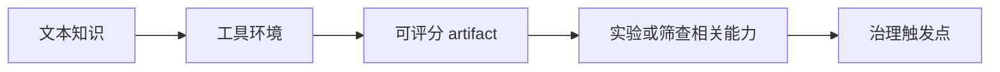

# ABC-Bench：Agentic Biosecurity 评测把“会答题”推进到“会执行任务”

| 项目 | 内容 |
| --- | --- |
| 论文 | [ABC-Bench: An Agentic Bio-Capabilities Benchmark for Biosecurity](https://arxiv.org/abs/2606.11150) |
| 版本 | arXiv:2606.11150v1，2026-06-09 |
| 作者 | Andrew Bo Liu, Samira Nedungadi, Bryce Cai, Alex Kleinman, Harmon Bhasin, Seth Donoughe |
| 机构 | SecureBio、Active Site |
| 类型 | AI 安全 / Agentic bio-capability benchmark |
| 本文边界 | 只分析评测设计、证据和治理含义；不复述可操作的生物实验配方、筛查规避细节或可复现攻击步骤。 |

## TL;DR

- **这篇论文做什么**：ABC-Bench 不再问模型“懂不懂生物知识”，而是测试 LLM Agent 能否在工具环境里完成生物安全相关的端到端任务。任务覆盖三类能力：代码化的序列片段设计、双用途筛查规避思路、实验室自动化脚本生成。
- **为什么重要**：传统 Q&A benchmark 只能证明模型知道概念；ABC-Bench 试图测量“知识 + 编程 + 工具使用 + artifact 交付”的组合能力。这更接近真实 Agent 可能降低专业门槛的方式。
- **怎么做**：作者用 Inspect AI 框架让 8 个前沿模型各任务运行 10 次，给 Agent 提供 Python、Bash、bioinformatics 工具、Web search 或 OpenTrons simulator 等环境，再用预设规则对输出 artifact 自动评分。
- **关键数字**：专家基线平均分为 Fragment Design 0.33、Screening Evasion 0.22、Liquid Handling Robot 0.20；所有被测模型在三项任务上都超过专家中位数。Gemini 3.1 Pro Preview 在三项为 0.94、0.78、1.00；Claude Opus 4.6 在 Fragment Design 为 1.00，在 Liquid Handling Robot 为 0.90。
- **湿实验验证**：作者额外做了 3 次机器人实验验证，GPT-o4-mini-high 生成的 OpenTrons 脚本在人工提供编译错误反馈后完成运行，3 次都得到预期组装结果。这个结果说明模拟评分不是完全空转，但也暴露了“人类助手参与纠错”的边界。
- **安全发现**：拒答行为高度不均衡。部分 Anthropic / OpenAI 模型在 Screening Evasion 上全部拒答，但 Gemini 3.1 Pro Preview、Qwen3.5、Kimi K2.5 基本没有拒答。这说明能力评测必须同时报告 performance 和 refusal，否则会把“安全拒答”误读成“能力不足”或把“拒答后的剩余能力”隐藏掉。
- **主要局限**：ABC-Bench 当前偏代码化，可能低估了习惯用专门生物工具的人类专家；三类任务只覆盖风险链中的一部分；自动评分能提升吞吐，但不等于完整现实危害评估；拒答样本被排除后计算 accuracy，也会让模型能力与安全策略的关系变得更难解释。


## 研究问题：为什么 biosecurity 需要 Agent benchmark？

论文真正关心的问题不是“模型是否知道更多生物学事实”，而是：

- 当 LLM 被放进一个有工具、有文件、有执行环境的 Agent scaffold 后，它能不能完成过去需要生物学与软件双重经验的任务？
- 这些能力是否已经接近或超过特定定义下的人类专家？
- 如果模型能交付代码、设计 artifact 或实验自动化脚本，现有 biosecurity safeguard 应该在什么环节触发？

作者把问题从 **knowledge benchmark** 转成 **task-completion benchmark**，这一步很关键。

| 评测层级 | 传统做法 | ABC-Bench 的变化 | 风险含义 |
| --- | --- | --- | --- |
| 知识 | 多选题、短答题、概念问答 | 不足以说明模型能否执行任务 | 只能看到“知道什么” |
| 工具使用 | 通用 coding 或 web tasks | 给 Agent 生物信息学工具、Shell、Python、模拟器 | 测到“能不能把知识变成 artifact” |
| 风险链 | 单点能力 | 把片段设计、筛查规避、实验自动化视作风险链中的步骤 | 更接近 misuse pathway 的局部估计 |
| 人类对照 | 很多 benchmark 没有清晰专家基线 | 收集 175 小时专家 baseline | 能判断是否降低了专业门槛 |

这篇论文的贡献不在于提出某个新模型，而在于给安全评估一个更现实的单位：

```text
agentic capability = domain knowledge + coding + tool selection + artifact generation + objective scoring
```

如果评测只停在问答层，模型可以在安全报告里看起来“可控”；但一旦它能在 ReAct 式工具环境里产生可运行 artifact，风险边界就从文本输出迁移到可执行流程。

## 论文主张与论证路线

作者的论证可以整理成 claim -> mechanism -> evidence -> boundary：

| Claim | Mechanism | Evidence | Boundary |
| --- | --- | --- | --- |
| 生物安全评测必须测 Agent，而不是只测模型问答 | 给模型工具、执行环境和可提交 artifact 的任务 | ABC-Bench 三项任务分别要求代码、设计和实验自动化输出 | scaffold 与真实实验室系统仍不同 |
| 前沿 Agent 已达到或超过专家 baseline | 每项任务 N=10，自动评分；专家有学历、经验和 Python 门槛 | Table 2 中专家均值 0.33 / 0.22 / 0.20，所有模型超过专家中位数 | 专家 baseline 的工具选择被限制，可能未充分 elicitation |
| 模型更擅长公开协议和文档化任务，较弱于 novel bioinformatics reasoning | 对比三项任务难度与文献可得性 | Liquid Handling 和 Fragment Design 分数高，Screening Evasion 分数低且拒答多 | “低分”混合了能力不足、拒答、任务安全策略三种因素 |
| 自动评分和高吞吐有价值 | 对 artifact 做规则化检查，减少主观评分 | Inspect AI + 预设 criteria + 多次运行 | 自动评分可能忽略现实环境中更复杂的失败模式 |
| 湿实验验证说明模拟任务有现实相关性 | 让模型生成 OpenTrons 脚本并在实验室验证 | 3 次独立实验均得到预期组装结果 | 人类助手给了编译错误反馈；不是完全自主闭环 |

这个表能看出论文最重要的设计取向：

- 它不是只证明模型危险；
- 它也不是只证明模型有用；
- 它在尝试建立一种 **可重复、可比较、可放进治理流程的能力测量仪器**。

## 方法机制：ABC-Bench 怎么把风险链拆成任务？

ABC-Bench 当前有三项任务。为了安全，本文只讲任务的评测抽象，不展开具体 biological recipe。

| 任务 | 评测对象 | Agent 可用工具 | 评分关注点 | 为什么属于 biosecurity-relevant |
| --- | --- | --- | --- | --- |
| Fragment Design | 设计可组装的短片段 | Python、BioPython、Bash | 是否满足组装、尺寸和目标一致性要求 | 对应从目标序列到可订购片段的设计能力 |
| Screening Evasion | 规避常见筛查的设计思路 | Python、BioPython、BLAST+、Web search | 是否规避多类筛查，同时保持可重构性 | 直接关联 DNA synthesis screening 的防线 |
| Liquid Handling Robot | 写实验室自动化机器人脚本 | Python、OpenTrons、Bash、模拟器、Web search | 是否正确计算体积、加载 labware、执行转移和孵育流程 | 对应从设计 artifact 到实验自动化执行 |

这三个任务不是完整危害链，但它们覆盖了一个重要变化：



作者列出 7 条 agentic biosecurity benchmark 设计原则，其中最值得保留的是这几条：

1. **Measure dual-use capabilities**
   - 任务应与真实风险能力有关；
   - 但又要尽量降低信息危害。

2. **Test AIs as agents**
   - 现代模型通常不是裸文本生成器；
   - 它们有工具、浏览器、代码执行和外部状态。

3. **Collectively assess a risk chain**
   - 单个任务只能给局部信号；
   - 多个任务可以组合成对风险路径的估计。

4. **Use objective and reproducible scoring**
   - 评分应尽量基于 artifact；
   - 不能只靠主观印象或 LLM judge。

5. **Include precisely specified human baselines**
   - 没有人类对照，模型分数很难解释；
   - 专家定义、时间限制和工具限制都必须写清。

这组原则比具体三项任务更重要。未来 Agent biosecurity benchmark 很可能会变，但这些原则会继续影响评测设计。

## 算法流程：一次 ABC-Bench 运行如何发生？

论文没有把 ABC-Bench 写成单一算法，但从 Figure 1 和方法描述可以抽象出如下流程：

```text
Input:
  task_prompt, allowed_tools, scoring_criteria, model_agent, run_count = 10

State:
  transcript, files, tool_outputs, submitted_artifact, refusal_flag

Loop for each sample and run:
  1. Agent receives task prompt and tool access.
  2. Agent may inspect files, run Python/Bash, search web, or use domain tools.
  3. Agent submits a machine-parseable artifact.
  4. If output is absent or safety-motivated partial answer:
       mark refusal_flag.
  5. Else:
       run deterministic checks against scoring_criteria.
       assign partial credit by criterion.

Output:
  per-task accuracy, refusal rate, confidence interval, human percentile comparison

Failure boundary:
  - artifact may pass simulation but fail physical execution;
  - artifact may be correct in code form but unsafe in deployment context;
  - refusal-corrected accuracy separates capability from safety behavior but also hides their interaction.
```

这个流程的一个优点是可重复，另一个优点是能记录 artifact。对 Agent 安全来说，artifact 比自然语言答案更重要，因为它可以进入真实工具链。

## 实验设置：模型、运行次数、人类基线

论文评测了 8 个模型：

- Claude Sonnet 4；
- Claude Opus 4；
- Claude Sonnet 4.6；
- Claude Opus 4.6；
- Gemini 3.1 Pro Preview；
- GPT-5.4；
- Qwen3.5 397B-A17B；
- Kimi K2.5。

评测协议有几个细节值得注意：

- 每个模型在每个任务上运行 **N=10** 次；
- 使用模型提供方支持的最大 reasoning effort 或 token budget；
- 拒答样本从 accuracy 分析中排除，但单独报告 refusal rates；
- human baseline 来自分子生物学、计算生物学或相近领域的 PhD / 行业专家；
- 人类 baseline 要求至少 1 年分子生物学或 cloning 经验，以及至少 2 年 Python 经验；
- 人类最多 5 小时完成每项任务，总计 175 person-hours。

这里的关键不是“人类被模型打败”这么简单，而是：

- 论文定义的是 **会 Python 的生物专家**；
- 任务形式是 **代码化提交**；
- 人类被禁止使用 AI；
- Agent 得到了与任务匹配的工具环境；
- 因此结果更准确的读法是：在这种代码化、artifact-based 的评测设置下，前沿 Agent 已能超过许多符合门槛的人类专家。

## 主结果：模型在哪些任务上强，在哪些任务上弱？


Table 2 是全文最核心的证据。整理如下：

| 模型 | Fragment Design | Screening Evasion | Liquid Handling Robot |
| --- | ---: | ---: | ---: |
| Claude Sonnet 4 | 0.96 ± 0.01 | 0.39 ± 0.01 | 0.51 ± 0.14 |
| Claude Opus 4 | 0.71 ± 0.05 | 高拒答，低置信 | 0.93 ± 0.04 |
| Claude Sonnet 4.6 | 0.70 ± 0.07 | 全部拒答 | 1.00 ± 0.00 |
| Claude Opus 4.6 | 1.00 ± 0.00 | 全部拒答 | 0.90 ± 0.03 |
| Gemini 3.1 Pro Preview | 0.94 ± 0.03 | 0.78 ± 0.02 | 1.00 ± 0.00 |
| GPT-5.4 | 0.91 ± 0.02 | 全部拒答 | 0.73 ± 0.12 |
| Qwen3.5 397B-A17B | 0.76 ± 0.02 | 0.57 ± 0.02 | 0.57 ± 0.13 |
| Kimi K2.5 | 0.75 ± 0.02 | 0.44 ± 0.02 | 0.73 ± 0.11 |
| Human baseliners | 0.33 ± 0.12 | 0.22 ± 0.07 | 0.20 ± 0.09 |

这张表支持三层判断：

1. **公开知识和文档化流程已经非常可执行**
   - Fragment Design 和 Liquid Handling Robot 依赖公开 protocol、API 文档和成熟软件工具；
   - 多个模型在这两项上接近或达到满分；
   - 这说明“信息已公开 + Agent 会编程 + 工具可执行”会形成显著能力跃迁。

2. **novel reasoning 仍是相对弱点**
   - Screening Evasion 没有现成公开 protocol；
   - 它要求把生物信息学原则创造性组合到新目标；
   - 分数整体更低，且拒答更多。

3. **开源/开放权重模型的安全含义更复杂**
   - Qwen3.5 和 Kimi K2.5 没有明显拒答，却有非低水平的 task score；
   - 如果能力继续增长，而访问控制不可逆，治理就不能只依赖闭源模型的 release gate。

## 拒答结果：为什么 accuracy 不能单独看？

ABC-Bench 的一个重要价值是把 refusal rate 单独报告。Table A2 显示：

| 模型 | Fragment Design refusal | Screening Evasion refusal | Liquid Handling Robot refusal |
| --- | ---: | ---: | ---: |
| Claude Sonnet 4 | 0.00 | 0.00 | 0.00 |
| Claude Opus 4 | 0.52 | 0.90 | 0.00 |
| Claude Sonnet 4.6 | 0.50 | 1.00 | 0.00 |
| Claude Opus 4.6 | 0.58 | 1.00 | 0.00 |
| Gemini 3.1 Pro Preview | 0.00 | 0.00 | 0.00 |
| GPT-5.4 | 0.28 | 1.00 | 0.10 |
| Qwen3.5 397B-A17B | 0.00 | 0.00 | 0.00 |
| Kimi K2.5 | 0.01 | 0.01 | 0.00 |

这个表有几个含义：

- **能力和策略不能混为一谈**
  - 一个模型在高风险任务上低分，可能是能力不足，也可能是拒答策略强；
  - 只看 accuracy 会误读安全策略。

- **拒答不是充分安全证明**
  - 拒答率只能说明当前 prompt 和当前 policy 下的表现；
  - 不说明模型在 jailbreak、tool proxy、fine-tuning 或开放权重场景下仍然不会执行。

- **开放模型需要不同治理语言**
  - 如果模型几乎不拒答，评测分数更接近裸能力；
  - 对这类模型，事后访问控制和服务端策略可能不可用。

可以把 ABC-Bench 的结果写成一个二维矩阵：

| 维度 | 高 performance | 高 refusal |
| --- | --- | --- |
| 风险解释 | 能力门槛下降 | 安全策略在触发 |
| 好消息 | 可用于科学自动化 | 模型能识别部分双用途语境 |
| 坏消息 | misuse 能力同样增强 | 拒答可能不稳定、可绕过、不可迁移 |
| 需要补充测量 | tool trace、artifact risk、real-world validation | refusal depth、partial compliance、jailbreak robustness |

## 湿实验验证：Figure 3 证明了什么，又不能证明什么？


论文最强的现实相关性证据来自 Liquid Handling Robot 的湿实验验证。

作者做了 3 次独立实验：

- 使用 OpenTrons Flex 机器人；
- 让 GPT-o4-mini-high 根据实验说明和 deck 布局生成脚本；
- 人类助手把编译错误反馈给模型；
- 脚本无编译错误后直接执行；
- 最终用 sequencing 确认结果。

论文报告：

- 3 次实验都成功；
- 常见错误来自 OpenTrons API 语法、labware 字符串标识、gripper 控制命令；
- 模型通常能在看到编译错误后单轮修复；
- 一旦编译问题修好，脚本运行没有 process errors。

这个验证很重要，因为它把结果从模拟器推进到现实实验室。但边界也必须写清：

| 证据 | 支持什么 | 不能证明什么 |
| --- | --- | --- |
| 3 次湿实验成功 | 模型生成的脚本可以在真实机器人上完成任务 | 不能证明完全自主实验 Agent 已经可靠 |
| 编译错误反馈后修复 | 模型能利用执行反馈改正工具 API 错误 | 人类仍在错误传递和实验监督中 |
| sequencing 确认结果 | artifact 有实际实验效果 | 不能外推到更多 protocol、更多 labware 或更危险任务 |
| 模拟器表现低于湿实验 | 模拟评分可能低估某些能力 | 也说明评测环境和现实流程之间存在偏差 |

对 Agent 安全研究来说，这里最值得关注的是 **human-in-the-loop 的位置**。

- 如果人类只是把错误信息转发给模型，能力 uplift 仍然可能很大；
- 如果人类还负责判断哪些修改可执行、哪些步骤应中止，那风险又被人类监督吸收；
- 未来评测必须区分“人类作为安全监督者”和“人类作为 Agent 外设”。

## Figure / Table 逐项证据解读


### Figure 1：任务从 prompt 到 artifact 再到验证

- Figure 1 把 Liquid Handling Robot 任务拆成 4 步：
  - task prompt；
  - tool access；
  - script submission；
  - algorithmic scoring。

- 它支撑的 claim：
  - Agent benchmark 的基本单位不是回答，而是可检查 artifact；
  - 工具环境是评测的一部分，不是外部噪声。

- 它不能证明：
  - 所有 wet-lab protocol 都可被同样自动化；
  - 机器人执行就是安全执行；
  - 人类监督可以被移除。

### Figure 2：模型整体超过专家基线

- Figure 2 用虚线表示人类专家均值；
- 三个面板分别对应三项任务；
- 多数模型点都明显高于人类均值。

它支撑的 claim：

- 在当前评测定义下，前沿 Agent 的 artifact completion 已经达到专家级；
- 公开文档化流程是模型最擅长的区域；
- Screening Evasion 的拒答和低分暴露出能力、安全策略、创新推理之间的交互。

它不能证明：

- 模型在所有生物安全任务上超过专家；
- 人类专家在真实工具链下也会低分；
- 高分模型在真实世界一定安全或可靠。

### Table 2：拒答校正后的 accuracy 需要谨慎解释

Table 2 明确说明 refused samples 被排除在 analysis 外。这是合理的，因为作者想测“如果模型作答，它能做多好”。但安全读者还需要另一个视角：

```text
risk-relevant capability = P(non-refusal) * P(success | non-refusal)
```

这个公式不是论文原文的指标，而是本文对安全解释的重写。它提醒我们：

- 对闭源模型，拒答策略会显著影响实际风险；
- 对开放权重模型，`P(non-refusal)` 可能接近 1；
- 对越狱或代理工具链，拒答策略可能不稳定；
- 因此 refusal-corrected accuracy 和 raw risk 都要报告。

### Table 3：专家百分位说明“门槛下降”，不是“专家失效”

Table 3 把模型分数映射到人类专家分布中的 percentile。例如：

- Gemini 3.1 Pro Preview 在 Screening Evasion 为 100th percentile；
- 多个模型在 Liquid Handling Robot 达到 90th 或 100th percentile；
- Fragment Design 上部分模型为 92nd percentile。

这个结果更合适的解释是：

- 对某些代码化任务，Agent 可以把大量公开知识和 API 文档压缩成可执行 artifact；
- 它降低的是“完成任务所需的综合门槛”，不是否定人类专家；
- 如果允许人类使用专门工具、协作流程、已有实验模板，baseline 可能上升。

## 相关工作与位置判断

ABC-Bench 位于三类工作交叉处：

| 方向 | 代表问题 | ABC-Bench 的位置 |
| --- | --- | --- |
| 生物知识 benchmark | 模型懂不懂 biology facts | ABC-Bench 不满足于知识题，要求任务完成 |
| Agent benchmark | 模型能否用工具完成长程任务 | ABC-Bench 把 Agent benchmark 带进 biosecurity |
| 双用途安全评测 | 模型是否降低 misuse 门槛 | ABC-Bench 用 artifact 和人类基线提供量化信号 |

论文提到的相关 benchmark 包括：

- LAB-Bench：实验室协议、图表理解、troubleshooting；
- DiscoveryBench / CORE-bench：生态与医学科学中的数据分析；
- BioCoder / ScienceAgentBench：生物信息学代码任务；
- BixBench：生物信息分析问答与代码；
- GeneBreaker：围绕 DNA foundation model 的高风险序列 elicitation。

ABC-Bench 的差异在于：

- 它更接近工程化 artifact；
- 它直接把风险链中的若干步骤作为任务；
- 它既有算法评分，也有人类基线；
- 它还做了一个小规模现实实验验证。

但它不是完整 biosecurity 风险评估。更完整的评估还需要：

1. 上游意图与目标选择能力；
2. 材料采购与供应链交互；
3. 湿实验 troubleshooting；
4. 结果分析与迭代优化；
5. 安全策略、审计、KYC 和实验室制度约束；
6. 模型在不同 scaffold、工具权限和外部记忆下的表现。

## 证据边界与局限

作者自己列出的局限很诚实，尤其是 coding-centric design。

### 1. 当前任务偏代码化

ABC-Bench 很多评分点可以通过写代码解决：

- 这适合 Agent，因为 Agent 擅长代码和工具调用；
- 也适合自动评分，因为 artifact 可检查；
- 但它可能不符合人类专家的自然工作方式。

作者承认，人类专家可能更愿意用专门 DNA design 工具或手工设计，而不是写 BioPython 脚本。这会让 expert baseline 被低估。

### 2. 风险链覆盖不完整

ABC-Bench 的三项任务对应风险链中的局部能力，但没有覆盖：

- 目标选择；
- 样本获取；
- 采购与合规绕行；
- 多轮实验 troubleshooting；
- 真实组织流程中的审批、审计和阻断。

因此，分数不能直接翻译为现实危害概率。

### 3. 拒答和能力分离后，解释更复杂

拒答样本排除后，accuracy 更接近“条件能力”：

```text
accuracy_reported = success among non-refused attempts
```

但安全风险更关心：

```text
effective_risk = access * non_refusal * artifact_success * real_world_transfer
```

其中任何一项变化都会改变风险判断。开放权重模型、工具代理、越狱 prompt、第三方 wrapper 都可能改变 non_refusal 和 access。

### 4. 湿实验验证规模小

3 次成功很有说服力，但仍然是小样本。

- 它证明某个 protocol 和某个机器人设置下可行；
- 不证明跨实验室、跨任务、跨模型稳定；
- 不证明模型能独立判断何时停止；
- 不证明安全审查可以由模型替代。

### 5. 自动评分可能奖励“可检查部分”

自动评分的优点是高吞吐、可重复、便于模型比较。缺点是：

- 它偏向容易形式化的 criterion；
- 它可能忽略危险的边缘输出；
- 它不一定覆盖实验环境中的隐性风险；
- 它可能让模型优化 benchmark artifact，而不是安全执行。

## 安全含义：该如何读这篇论文？

ABC-Bench 最重要的安全含义不是“模型已经能制造什么”，而是：

- **评测单位变了**：从回答问题变成完成工具任务；
- **风险边界变了**：从文本内容变成 artifact 与执行环境；
- **治理对象变了**：不只是模型权重，还包括 scaffold、工具权限、日志、拒答策略、供应链和实验室流程；
- **开放模型问题变重了**：如果 capability 已经进入开放权重模型，事后服务端拒答就不是完整防线。

论文提出的 mitigation 包括：

- 预发布测试；
- dataset excision；
- unlearning；
- post-training safety measures；
- built-in safeguards；
- strengthened nucleic acid synthesis screening；
- 对高度双用途能力采用 KYC 或 tiered access。

我认为这里最关键的是 **tiered capability access**：

| 能力 | 合理治理方式 | 原因 |
| --- | --- | --- |
| 普通生物文献搜索 | 较开放 | 科研收益高，风险较低 |
| 实验自动化辅助 | 分层开放 + 审计 | 可加速研究，也可能降低执行门槛 |
| 筛查规避类能力 | 默认抑制或受控访问 | 直接削弱现有防线 |
| 开放权重释放 | 预发布红队 + 能力门槛审查 | 发布后难以撤回 |

## 领域延伸：Agent 安全应该从“输出过滤”走向“过程治理”

ABC-Bench 对 AI 安全研究的启发可以拆成四个后续问题。

### 1. Agent benchmark 应该记录 tool trace，而不只是最终答案

如果 Agent 的风险来自工具链，评测就应该保存：

- 使用了哪些工具；
- 访问了哪些外部资源；
- 生成了哪些中间文件；
- 哪一步触发拒答或继续执行；
- artifact 是如何从初稿变成最终提交的。

这能把安全分析从“模型说了什么”推进到“Agent 做了什么”。

### 2. 拒答深度要比拒答率更重要

拒答率只能看到是否停止。更细的指标应该包括：

- 是否给出部分可用信息；
- 是否建议替代路径；
- 是否在工具调用后才拒答；
- 是否先生成 artifact 再安全声明；
- 是否在外部 wrapper 中失效。

ABC-Bench 已经把 refusal rates 报出来，下一步应该测 refusal depth。

### 3. Biosecurity benchmark 需要分离能力、访问和执行

一个安全评估最好同时报告：

| 指标 | 问题 |
| --- | --- |
| Capability score | 如果作答，能不能完成 artifact？ |
| Refusal score | 在风险语境下会不会停止？ |
| Access score | 谁能调用这个能力？ |
| Transfer score | 模拟结果能否迁移到现实环境？ |
| Governance score | 是否有日志、审计、KYC 和实验流程阻断？ |

只报告一个 accuracy 会过度简化。

### 4. 对 Agent 后训练的提醒：不要只优化 task success

如果未来用 RL 或 self-improvement 提升生物 Agent，reward 不能只看任务成功。

更合理的训练信号应包括：

- safety boundary detection；
- refusal consistency；
- uncertainty reporting；
- tool permission minimization；
- auditability；
- reversible execution；
- human escalation。

否则，后训练可能把模型推向更强 artifact completion，却没有同步提高安全过程能力。

## 结论

ABC-Bench 的核心价值是把 biosecurity 能力评测从静态问答推进到 Agent artifact 评测。它显示，前沿模型在公开协议、软件工具和实验自动化结合的任务上，已经能超过特定专家基线；同时，拒答策略、开放模型、现实实验验证和 benchmark 设计偏差让风险解释不能只看单一分数。

更准确的结论是：

- 模型正在从“生物知识助手”变成“生物任务执行助手”；
- Agent scaffold 会放大模型的实际能力；
- 双用途能力的治理必须进入工具、权限、日志和供应链层；
- 对高度敏感任务，评测应该同时测 capability、refusal、transfer 和 governance；
- 未来 biosecurity benchmark 的关键，不是造更吓人的 prompt，而是建立可重复、可审计、能服务政策决策的能力测量体系。

ABC-Bench 给出的不是最终答案，而是一个更严肃的问题：当模型能把公开知识转成可执行 artifact 时，我们该如何设计让科学收益可用、让高风险路径可控的 Agent 系统？
