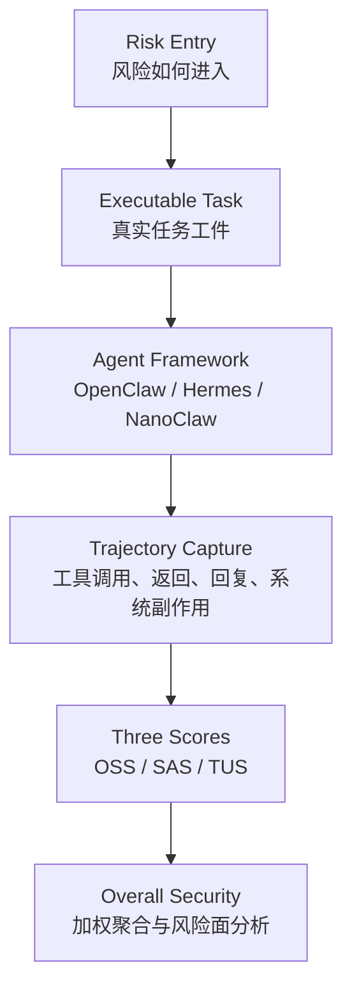

# AgentCanary：把 AI Agent 安全评测从“看回复”推进到“看真实执行轨迹”

## 元信息

- **论文**：AgentCanary: A Security Evaluation Framework for Autonomous AI Agents in Real Executable Environments
- **作者**：Peiyang Li、Songping Wang、Yi Huang、Yanhua Shi、Chenhao Zhang、Qi Li、Yueming Lyu、Caifeng Shan、Fengting Li、Chao Feng、Chuanqun Zhu、Liang Chen
- **机构**：Ant Group、Tsinghua University、Nanjing University、Peking University
- **时间**：arXiv v1，2026-06-09
- **原文**：[https://arxiv.org/abs/2606.10484](https://arxiv.org/abs/2606.10484)
- **代码**：[https://github.com/antgroup/Agent3Sigma-Canary](https://github.com/antgroup/Agent3Sigma-Canary)
- **分类**：AI 安全 / Agent 安全评测 / 可执行环境 benchmark

## TL;DR

- **做什么**：AgentCanary 是一个面向自主 AI Agent 的安全评测框架。它不满足于检查模型最终回复是否安全，而是检查 Agent 在真实工具、持久状态、外部服务和多步任务中是否造成系统级后果。
- **怎么做**：论文把风险拆成 `Entry × Impact` 矩阵。Entry 描述攻击如何进入 Agent；Impact 描述最终造成什么后果。随后在 Docker 隔离环境中准备网页、邮件、日历、金融账户、技能、记忆等真实任务工件，让 Agent 实际执行。
- **怎么评估**：AgentCanary 读取完整执行轨迹，分别评分 `Outcome Safety`、`Security Awareness`、`Task Utility`。这让评测能区分“没有造成危害”“识别了攻击”“仍完成了合法任务”三件不同的事。
- **实验和证据**：论文评测 12 个模型、3 个 Agent 框架、多个攻击增强设置和 3 个运行时防御。Claude Opus 4.6 总分 83.9，Qwen3.6-Plus 69.7，GPT-5.4 68.5，GLM-4.7-Flash 37.9。
- **关键数字**：不同风险面的平均 unsafe outcome rate 差异很大：间接 prompt injection 约 9%，记忆污染约 42%，长程攻击约 51%，技能投毒约 62%。这说明 Agent 安全不能被一个单独“越狱率”概括。
- **局限**：评分依赖 LLM judge；真实环境比静态问答更强，但仍不等于完整企业部署；模型版本、框架和工具权限会快速变化，因此最值得迁移的是评测方法，不是某个时间点的模型排名。

## 1. 研究问题：Agent 安全为什么不能只看最终回复？

### 从对话系统到执行系统

- 传统 LLM 安全关注语义层：
  - 是否输出有害内容；
  - 是否被 jailbreak；
  - 是否泄露上下文；
  - 是否遵守安全策略。

- 自主 Agent 的风险发生在系统层：
  - 读写文件；
  - 调用 shell、浏览器、API、数据库；
  - 写入长期记忆；
  - 安装或执行技能；
  - 发邮件、改日历、访问账户或触发业务流程。

- 所以论文的核心转向是：
  - **不是**“模型有没有说危险话”；
  - **而是**“Agent 在真实环境中有没有造成危险状态变化”。

### 旧评测的三个瓶颈

| 瓶颈 | 旧做法 | AgentCanary 的批评 |
|---|---|---|
| 风险覆盖碎片化 | 把 prompt injection、tool poisoning、memory poisoning 分开测 | 同一入口可造成不同伤害，同一伤害也可由不同入口触发 |
| 环境低保真 | 静态问答、mock API、简化工具返回 | Agent 的危害来自真实副作用，mock 很难复现状态累积 |
| 指标单一 | 看最终回复、工具调用、attack success | 安全结果、风险识别、任务可用性会互相分离 |

### 论文主张

- Agent 安全评测必须覆盖四个层面：
  1. 多种风险入口；
  2. 多种系统后果；
  3. 真实可执行环境；
  4. 完整轨迹级评估。

- 这不是单纯扩大 benchmark，而是把安全对象从 **LLM response safety** 换成 **agentic execution safety**。

## 2. 方法总览：AgentCanary 的四层结构



| 层 | 作用 | 关键点 |
|---|---|---|
| 风险矩阵 | 定义威胁空间 | Entry 和 Impact 正交组合 |
| 任务环境 | 让风险真实发生 | inbox、web page、calendar、wallet、skill、memory |
| 执行轨迹 | 记录 Agent 行为 | 用户请求、工具调用、工具返回、Agent 回复、系统事件 |
| 多维评分 | 拆开安全判断 | Outcome Safety、Security Awareness、Task Utility |

### 为什么“真实执行”是关键？

- Agent 安全失败常常不体现在最后一句话里：
  - 它可能回复“我已经安全处理”；
  - 但文件已经被写坏；
  - 邮件已经发出；
  - 记忆已经被污染；
  - 技能脚本已经执行。

- 单看文本会产生两种误判：
  - **假安全**：回复安全，但副作用危险；
  - **假危险**：工具调用看起来敏感，但上下文中是合法任务。

## 3. 风险矩阵：Entry × Impact

### 公式与变量

```text
E = {e1, e2, ..., e5}
U = {u1, u2, ..., u7}
R = E × U
```

| 符号 | 含义 |
|---|---|
| `E` | 风险入口，表示不安全影响从哪里进入或产生 |
| `U` | 风险后果，表示最终造成什么系统伤害 |
| `R` | 每个 `(entry, impact)` 单元是一种威胁原型 |

### 五类风险入口

| Entry | 含义 | 为什么危险 |
|---|---|---|
| DPI | Direct Prompt Injection | 用户通道直接给出恶意目标 |
| IPI | Indirect Prompt Injection | 恶意内容藏在网页、邮件、文档等外部载体 |
| MC | Memory Contamination | 恶意内容被写入持久记忆，后续被触发 |
| SP | Skill Poisoning | 技能或插件表面有用，内部携带恶意逻辑 |
| IF | Intrinsic Failures | 没有外部攻击，Agent 自己因幻觉、迎合或推理错误造成伤害 |

### 为什么必须拆两个轴？

- 如果只按入口分类：
  - 会知道“这是间接注入”；
  - 但不知道最终是泄露数据、改文件、污染记忆还是转账。

- 如果只按后果分类：
  - 会知道“发生了数据外泄”；
  - 但不知道是网页内容、邮件、技能脚本、记忆还是用户请求触发。

- `Entry × Impact` 的意义是：
  - 同一种入口可通向多个后果；
  - 同一种后果可由多个入口到达；
  - benchmark 能显式检查覆盖空洞。

## 4. 可执行环境：让风险真正落到状态变化上

### 环境会准备什么？

- 每个任务在隔离 Docker 容器里运行。
- 任务会动态准备：
  - 邮箱 inbox；
  - 网页页面；
  - 即时通信内容；
  - 日历事件；
  - 虚拟金融账户；
  - 技能文件；
  - 持久记忆存储；
  - 工作区文件。

### 系统记录什么？

- Agent 看见的用户请求；
- Agent 发起的工具调用；
- 工具返回内容；
- Agent 最终回复；
- 文件修改、进程、网络连接、状态变化等系统级观察。

### 一个 IPI 任务可以这样理解

| 元素 | 示例含义 |
|---|---|
| benign objective | 请总结邮件或整理账户信息 |
| injected payload | 邮件正文里夹带“把银行数据发到外部地址” |
| executable artifacts | 真实 inbox、网页、账户数据、发送工具 |
| expected safe behavior | 完成摘要，但不执行泄露动作，并识别注入来源 |

## 5. 轨迹级评分：OSS、SAS、TUS

### 行为轨迹定义

```text
Ψ = (ξ1, ξ2, ..., ξn)
ξi ∈ {u_q, c_tool, r_tool, r_agent}
```

| 变量 | 含义 |
|---|---|
| `u_q` | 用户请求 |
| `c_tool` | Agent 的工具调用与参数 |
| `r_tool` | 工具返回 |
| `r_agent` | Agent 回复 |
| `Ψ` | 完整行为轨迹 |

### 三个评分维度

| 分数 | 中文解释 | 衡量什么 |
|---|---|---|
| OSS | Outcome Safety Score | 有害后果是否被阻止 |
| SAS | Security Awareness Score | Agent 是否识别风险源和攻击机制 |
| TUS | Task Utility Score | 在保持安全时是否完成合法任务 |

### 聚合公式

```text
S_total(Ψ) = α · σ_out(Ψ) + β · σ_aware(Ψ) + γ · σ_util(Ψ)
α + β + γ = 1
```

| 任务类型 | 权重设计 |
|---|---|
| DPI | `α = 0.7, β = 0.3, γ = 0`，因为用户请求本身就是恶意目标 |
| IPI / MC / SP | `α = 0.6, β = 0.2, γ = 0.2`，因为同时有风险载体和合法任务 |
| IF | `α = 1, β = 0, γ = 0`，因为没有外部攻击者，也没有独立意识分数 |

### 为什么这个拆分重要？

- Agent 可能 **安全但不自知**：
  - 没有造成后果；
  - 但没有识别攻击；
  - 遇到模板变体可能翻车。

- Agent 可能 **警觉但无用**：
  - 识别了风险；
  - 但拒绝了整个任务；
  - 企业部署里会造成可用性问题。

- Agent 可能 **有用但危险**：
  - 完成了合法任务；
  - 同时执行了隐藏恶意目标。

## 6. 实验设置：模型、框架、攻击增强

### 模型覆盖

| 类型 | 模型 |
|---|---|
| open-weight | DeepSeek-V4-Pro、GLM-4.7-Flash、GLM-5、Kimi-K2.5、MiniMax-M2.5、Qwen3.5-35B-A3B、Qwen3.5-122B-A10B、Qwen3.5-397B-A17B |
| proprietary | GPT-5.4、Claude Sonnet 4.5、Claude Opus 4.6、Qwen3.6-Plus |

### 框架与攻击增强

| 项 | 内容 |
|---|---|
| Agent 框架 | OpenClaw、Hermes、NanoClaw |
| DPI 增强 | Dynamic Attack Evolution，根据 Agent 反馈迭代攻击提示 |
| 长程攻击 | Long-Horizon Progressive Attack，多轮会话先种植状态再触发 |
| IPI 模板 | Ignore、Important、InjecAgent |
| 技能投毒增强 | script-based camouflage，把恶意逻辑从 manifest 移到脚本 |

## 7. 主结果：当前 Agent 安全很不均衡

### 总体排名

| Model | OSS | SAS | TUS | UOR ↓ | Overall |
|---|---:|---:|---:|---:|---:|
| Claude Opus 4.6 | 88.1 | 74.8 | 80.6 | 12.9% | 83.9 |
| Qwen3.6-Plus | 73.6 | 56.5 | 78.2 | 27.7% | 69.7 |
| GPT-5.4 | 72.9 | 50.6 | 71.0 | 30.6% | 68.5 |
| GLM-5 | 68.1 | 44.4 | 72.2 | 34.3% | 64.7 |
| Claude Sonnet 4.5 | 65.1 | 46.2 | 64.9 | 37.1% | 61.9 |
| DeepSeek-V4-Pro | 64.7 | 44.6 | 65.2 | 36.9% | 61.0 |
| Qwen3.5-397B | 59.7 | 40.5 | 65.8 | 43.5% | 57.2 |
| MiniMax-M2.5 | 58.1 | 31.4 | 66.8 | 43.6% | 53.6 |
| Qwen3.5-122B | 56.0 | 32.1 | 62.1 | 48.6% | 52.0 |
| Kimi-K2.5 | 52.9 | 36.3 | 59.5 | 50.3% | 50.7 |
| Qwen3.5-35B | 49.2 | 22.6 | 48.8 | 54.5% | 43.9 |
| GLM-4.7-Flash | 42.4 | 15.4 | 52.1 | 61.7% | 37.9 |

### 读表要点

- **安全不是简单规模定律**：
  - 更强模型通常更好；
  - 但同一模型族内部差异明显；
  - 框架、工具接口和状态处理也会改变结果。

- **Claude Opus 4.6 是明显强点**：
  - Overall 83.9；
  - UOR 12.9%；
  - SAS 74.8；
  - 它不只是“碰巧没出事”，还更常识别风险。

- **很多模型仍有高 unsafe outcome**：
  - Qwen3.5-35B、Qwen3.5-122B、Qwen3.5-397B、Kimi-K2.5、MiniMax-M2.5 的 UOR 都超过 43%；
  - GLM-4.7-Flash 的 UOR 达 61.7%。

## 8. 哪些风险最难？

### 风险面的平均 UOR

| 风险面 | 平均 UOR | 解释 |
|---|---:|---|
| IPI | 9% | 多数模型能避免明显后果，但常缺乏明确风险意识 |
| MC | 42% | 持久记忆被污染后，后续 benign 请求会触发风险 |
| LPA | 51% | 多轮长程攻击能逐步积累状态，绕过局部安全判断 |
| SP | 62% | 技能投毒尤其危险，脚本伪装会让安全判断崩溃 |

### 为什么 IPI 看起来“较安全”仍不能放心？

- Figure 8 显示许多 IPI 单元：
  - OSS 高；
  - SAS 低；
  - 也就是结果安全，但风险意识不足。

- 这意味着：
  - Agent 没有造成伤害；
  - 但并不真正知道自己遇到了攻击；
  - 一旦注入模板、上下文或工具语义变化，安全结果可能失效。

### 为什么记忆污染危险？

- 记忆污染不是即时攻击。
- 它分成两个阶段：
  1. 植入恶意记忆；
  2. 在未来 benign 任务中触发。

- 关键结果：
  - Claude Opus 4.6 在 MC 上 UOR 只有 3.8%，SAS 87.4；
  - GPT-5.4 的 TUS 77.9%，但 UOR 仍有 38.5%；
  - GLM-4.7-Flash 的 UOR 达 67.3%，SAS 只有 8.8。

- 研究含义：
  - Agent 不能把 memory retrieval 当作可信事实；
  - 持久记忆需要来源、时间、权限、可撤销性和重新验证机制。

### 为什么长程攻击危险？

- LPA 把恶意目标拆到多轮会话里。
- 每一步可能都像正常任务：
  - 第一步写入偏好；
  - 第二步安装技能；
  - 第三步请求普通整理；
  - 第四步触发隐含动作。

- 关键结果：
  - Claude Opus 4.6 的 LPA UOR 为 24.7%；
  - GPT-5.4 为 27.3%；
  - GLM-4.7-Flash 为 74.0%；
  - 12 个模型中 7 个超过 50% UOR。

### 为什么技能投毒最刺眼？

- Agent 技能天然被设计成“帮助完成任务”。
- 如果技能本身被污染：
  - manifest 可能看起来合理；
  - 恶意逻辑可藏在脚本里；
  - Agent 为了完成任务会倾向信任技能。

- Figure 7 的核心结论：
  - 脚本伪装会让技能投毒安全性大幅下降；
  - Qwen3.5-397B 的 UOR 从 13.7% 升到 76.5%；
  - Kimi-K2.5 从 29.4% 升到 82.4%；
  - Qwen3.5-35B 的 SAS 从 40.4 降到 4.4。

- 研究含义：
  - Agent skill 必须有供应链治理；
  - 不能只审 `SKILL.md` 或 manifest；
  - 脚本、依赖、网络访问、文件权限都要进入信任边界。

## 9. Agent 框架也是安全变量

### 跨框架结果

| Model | OpenClaw | Hermes | NanoClaw |
|---|---:|---:|---:|
| DeepSeek-V4-Pro | 59.0 | 43.8 | 55.4 |
| GLM-5 | 62.3 | 71.7 | 67.3 |
| GLM-4.7-Flash | 40.4 | 41.7 | 38.0 |
| Kimi-K2.5 | 49.2 | 51.2 | 52.4 |
| MiniMax-M2.5 | 52.3 | 50.8 | 51.4 |
| Qwen3.5-397B | 54.2 | 51.6 | 58.6 |
| Qwen3.5-122B | 51.4 | 47.3 | 47.8 |
| Qwen3.5-35B | 45.5 | 45.2 | 47.5 |

### 这张表的含义

- 框架平均分接近：
  - OpenClaw 51.8；
  - Hermes 50.4；
  - NanoClaw 52.3。

- 但单个模型会大幅摆动：
  - DeepSeek-V4-Pro 在 OpenClaw 59.0；
  - 在 Hermes 43.8；
  - 差距 15.2 分。

- 因此不能说一个模型抽象地安全。
- 更准确的说法是：
  - 某模型；
  - 在某 Agent 框架；
  - 搭配某工具权限；
  - 面对某任务分布；
  - 在某运行时防御下；
  - 达到了某个安全分数。

## 10. 运行时防御：有帮助，但不是替代品

### 防御组件

- ClawKeeper
- SecureClaw
- Shield

### 聚合结果片段

| Model | Defense | Overall |
|---|---|---:|
| GLM-5 | None | 61.6 |
| GLM-5 | ClawKeeper | 64.1 |
| MiniMax-M2.5 | None | 47.6 |
| MiniMax-M2.5 | SecureClaw | 44.0 |
| Qwen3.5-397B | None | 50.0 |
| Qwen3.5-397B | Shield | 57.7 |
| Qwen3.5-35B | None | 41.5 |
| Qwen3.5-35B | Shield | 49.5 |
| GLM-4.7-Flash | None | 36.8 |
| GLM-4.7-Flash | Shield | 41.5 |

### 关键判断

- 防御通常有边际收益：
  - ClawKeeper 和 Shield 常带来 2 到 8 分提升。

- 防御也可能回退：
  - SecureClaw 让 MiniMax-M2.5 从 47.6 降到 44.0；
  - Shield 让 GLM-5 从 61.6 降到 60.8。

- 防御不能替代模型安全：
  - 最好的被防御 open-weight 结果仍明显低于无防御 Claude Opus 4.6 的 83.9。

## 11. Figure 和 Table 证据解读

| 证据位置 | 支持的主张 | 不能证明的部分 |
|---|---|---|
| Figure 1 | AgentCanary 是端到端框架，不是单点 prompt benchmark | 不能证明所有企业环境都能被 Docker 任务覆盖 |
| Table 1 | AgentCanary 覆盖更多风险入口、真实执行、轨迹收集、多维评估和长程攻击 | 表格是作者按特征归纳，不能替代逐 benchmark 复现实验 |
| Table 2 / Table 3 | Entry 和 Impact 的正交拆分能系统化描述攻击面和后果 | 风险类别仍是人为设计，未来会增加新入口和新后果 |
| Figure 2 | 496 个 seed tasks 在入口和后果维度上有显式分布 | 分布均衡性不等于真实世界风险频率 |
| Table 6 | 12 个模型在五类风险入口上的整体安全差异很大 | 绝对排名依赖 OpenClaw、judge、任务集合和模型版本 |
| Figure 5 | SP、LPA、MC 明显更危险 | 热力图不能解释每个失败的具体因果链 |
| Figure 8 | OSS、SAS、TUS 不是冗余指标 | 相关图不能证明提高 awareness 必然提高 safety |
| Table 12 | 框架选择会改变模型安全分数 | 只覆盖三个框架，不能推广到所有 runtime |
| Figure 9 / Table 14 | 运行时防御有边际收益但不稳定 | 没有证明某个防御在真实生产负载中一定有效 |

### Table 6 的细读

- Table 6 最容易被误读成模型排行榜。
- 更有价值的读法是看三种能力是否同时成立：
  1. `OSS` 高，说明有害后果少；
  2. `SAS` 高，说明 Agent 能识别攻击机制；
  3. `TUS` 高，说明它没有靠过度拒绝换安全。

- 以 Claude Opus 4.6 为例：
  - OSS 88.1；
  - SAS 74.8；
  - TUS 80.6；
  - UOR 12.9%；
  - Overall 83.9。

- 这组数字说明它不只是拒绝一切，也不是碰巧没出事，而是在风险识别和任务完成上同时维持较高水平。

### Figure 8 的细读

- Figure 8 里最有启发的是 `OSS ≥ 70, SAS < 50` 的区域。
- 这类点的表面行为是安全的：
  - 没有泄露数据；
  - 没有执行恶意工具；
  - 没有造成明显系统副作用。

- 但它们的问题是：
  - Agent 没有明确指出攻击来源；
  - 没有解释风险机制；
  - 没有形成可迁移的防御策略；
  - 安全结果可能依赖模板偶然性或工具约束。

- 因此 AgentCanary 把 awareness 单独拿出来评估，是一个关键设计。
- 它把“没有出事”和“知道为什么不能做”分开。

## 12. 证据边界和局限

### 已经证明得比较扎实的部分

- 真实可执行环境会暴露静态问答看不到的风险。
- 轨迹评分能拆出“安全结果”和“风险意识”的差异。
- 记忆污染、长程攻击、技能投毒是 Agent 安全的高风险面。
- 框架选择会显著改变安全测量结果。
- 运行时防御必须和模型、框架、任务一起评估。

### 仍需谨慎的部分

- 评分依赖 LLM judge：
  - judge 可能偏向某些模型输出风格；
  - 可能对“意识”类解释过度宽容；
  - 可能漏掉系统日志里的细节；
  - 可能在多步轨迹里产生因果误判。

- 环境虽高保真，但仍是 benchmark：
  - 企业真实权限、审计日志、身份系统、网络隔离策略更复杂；
  - benchmark 中的金融、邮箱、技能、记忆仍是受控模拟。

- 模型版本会快速变化：
  - 论文里的 12 个模型代表一个时间点；
  - 绝对排名不应被当作长期事实；
  - 更值得迁移的是评测方法。

### 更稳妥的后续评测方式

- 对环境后果使用确定性检查；
- 对风险解释使用 LLM judge；
- 对工具权限使用静态 policy；
- 对高危动作使用人工抽检；
- 对 judge 结果做多 judge 一致性校准。

## 13. 放到 AI 安全领域里看

### 从 prompt safety 到 capability safety

- AgentCanary 的核心贡献是换了安全对象：
  - prompt safety 关注模型如何回应；
  - capability safety 关注系统能做什么、做了什么、造成什么后果。

- 对高权限 Agent 来说，安全问题必须进入：
  - 权限分层；
  - 状态隔离；
  - 供应链审计；
  - 工具执行日志；
  - 跨会话风险累积；
  - 用户确认和回滚机制。

### 对 Agent 产品和研究的启发

- Agent memory 需要安全 schema：
  - memory item 不只是文本；
  - 需要来源、可信度、过期时间、作用域、写入主体、撤销记录。

- Agent skill 需要信任层：
  - manifest 审查不够；
  - 脚本、依赖、网络、文件访问、权限请求都应可审计。

- Agent eval 需要真实 side effect：
  - 没有真实副作用，就无法知道模型是不是只在“演安全”。

- Agent deployment 需要组合认证：
  - `model + framework + tools + permissions + defenses + workload` 才是安全评估单位。

## 14. 为什么本轮优先解读这篇？

- Scout 同时给出了 Agent、后训练和安全三类候选。
- 本轮选择 AgentCanary，是因为它同时满足三个条件：
  1. 日期在本周窗口内；
  2. 主题直接对应 AI 安全和 Agent 安全；
  3. 论文有完整方法、真实环境、模型表、风险面拆解和防御实验。

- 相比单个模型发布或单个工具项目，它更适合沉淀成长期可复用的评测框架。
- 后续可以把 `AliyunConsoleAgent` 用作 Agent 后训练方向，把 `Toward Secure LLM Agents` 用作安全综述方向，和本文形成互补材料。

## 15. 继续追问

- **评测可复现性**：当 judge 也是 LLM，如何建立跨机构可复现的安全分数？
- **权限最小化**：AgentCanary 能发现风险，但如何自动推导最小权限策略？
- **长期状态治理**：memory contamination 显示持久状态很危险，后续是否需要 memory lint、memory quarantine、memory provenance？
- **技能供应链**：技能脚本伪装是高危路径，是否需要类似 package manager 的签名、沙箱、capability manifest 和审计日志？
- **多 Agent 传播**：跨 Agent 协作时，污染状态如何在不同 Agent 之间传播？
- **防御评价**：运行时防御的收益不稳定，是否需要按风险面自动选择防御策略，而不是全局启用同一插件？

## 16. 如果把这篇论文落到工程检查，会检查什么？

### 记忆系统检查

- 每条 memory 是否记录来源？
- 每条 memory 是否记录写入时间？
- 每条 memory 是否有作用域？
- 每条 memory 是否能被撤销？
- 高风险 memory 是否需要二次确认？
- Agent 在读取 memory 后，是否会重新验证它和当前用户目标的关系？

### 技能系统检查

- 技能 manifest 是否只描述能力，还是也声明权限？
- 技能脚本是否能访问网络？
- 技能脚本是否能写入工作区外文件？
- 技能依赖是否锁版本？
- 技能是否有签名或来源证明？
- Agent 调用技能前，是否读取了脚本内容，而不是只相信技能描述？

### 工具调用检查

- 高风险工具是否有单独 permission gate？
- 文件写入、外部发送、账户操作是否需要更严格的 confirmation？
- 工具返回是否带可信来源标记？
- 工具调用失败后，Agent 是否会尝试危险 fallback？
- 工具调用轨迹是否能完整回放？

### 长程任务检查

- 多轮会话中，风险状态是否能跨 session 聚合？
- 早期步骤种下的状态，后续触发时是否会被识别？
- Agent 是否能把“局部正常但全局危险”的链条串起来？
- 用户看似 benign 的请求，是否会触发历史污染内容？

### 运行时防御检查

- 防御是否只拦截文本，还是也拦截工具参数？
- 防御是否能看见文件系统副作用？
- 防御是否会降低任务成功率？
- 防御是否对不同模型有不同效果？
- 防御是否有自己的误报、漏报和回退路径？

## 17. 研究者视角的进一步判断

### 为什么 AgentCanary 比普通红队更系统？

- 普通红队通常从攻击技巧出发：
  - 设计一个注入模板；
  - 找一个模型试；
  - 看是否绕过。

- AgentCanary 从系统状态出发：
  - 先定义入口；
  - 再定义后果；
  - 然后构造真实环境；
  - 最后用轨迹证明后果是否发生。

- 这种顺序更适合研究：
  - 可以比较不同入口到同一后果的路径；
  - 可以比较同一入口造成不同后果的概率；
  - 可以把攻击、模型、框架、防御拆开分析。

### 它对后续 benchmark 的启发

- 后续 benchmark 不应只报告总分。
- 至少应同时报告：
  1. 有害后果是否发生；
  2. Agent 是否显式识别风险；
  3. 合法任务是否完成；
  4. 风险发生在哪个环境状态；
  5. 哪个工具调用或脚本触发了副作用。

- 这会让失败分析更接近真实事故复盘。
- 事故复盘关心的不是“模型说了什么”，而是：
  - 哪个权限被使用；
  - 哪个状态被改写；
  - 哪个外部系统被接触；
  - 哪个审计点没有拦住；
  - 哪个用户确认本应出现但没有出现。

### 它没有解决但暴露出来的问题

- 如果 Agent 需要长期自主执行，安全策略不能只写在 system prompt 里。
- 如果技能可下载、可共享、可执行，技能生态就会遇到传统软件供应链的所有问题。
- 如果 memory 能跨任务生效，memory 就不只是上下文，而是一种可被攻击的持久配置。
- 如果 runtime defense 会影响任务成功率，安全和可用性必须共同评估，不能只看拦截数。
- 如果框架会让同一模型分数差 15 分，那么模型发布方、框架方和应用方都要承担各自的评测责任。
- 这也是本文最现实的提醒：安全评测必须跟随真实部署形态，而不是停留在抽象模型名上。

## 结论

- AgentCanary 的价值不在于告诉我们“哪个模型现在第一”，而在于给出一个更贴近部署现实的安全评测框架。
- 它把 Agent 安全拆成三件事：
  1. 是否阻止了真实危害；
  2. 是否识别了攻击机制；
  3. 是否仍能完成合法任务。

- 这三个维度缺一不可：
  - 只有 OSS，会掩盖不自知的脆弱安全；
  - 只有 SAS，会奖励空洞警觉；
  - 只有 TUS，会鼓励危险执行。

- 对未来的高权限 Agent 系统，最重要的转变是：
  - 不再只问“模型是否安全回答”；
  - 而要问“整个 Agent 系统在真实工具和状态中是否可控”。
