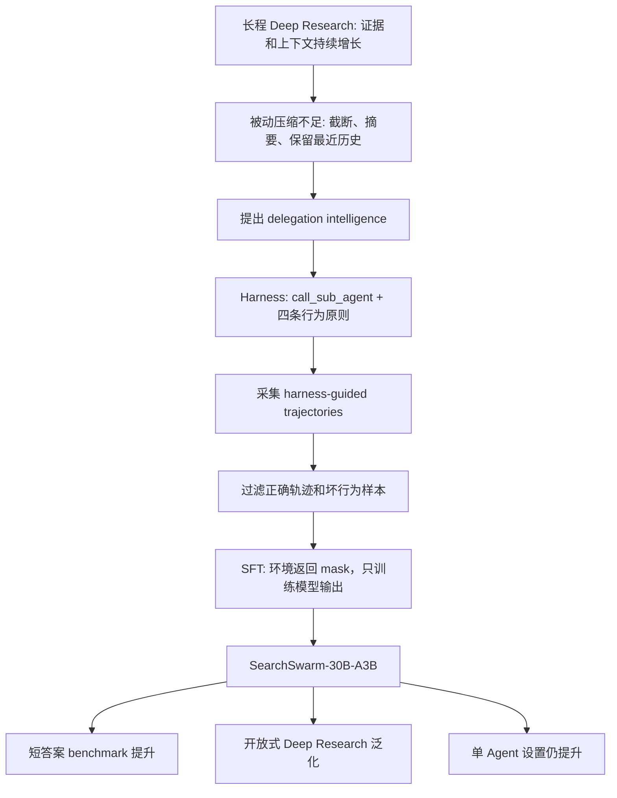

# SearchSwarm：把“多 Agent 调度”重新定义为主动上下文管理

> 研究者精读 · 这篇论文不是单纯展示一个 Deep Research 系统，而是在回答一个更底层的问题：当长程任务的证据量超过主模型上下文时，模型能否学会“什么时候委派、如何写 brief、如何验证返回结果”。

## 元信息

| 字段 | 内容 |
|---|---|
| 原文 | [SearchSwarm: Towards Delegation Intelligence in Agentic LLMs for Long-Horizon Deep Research](https://arxiv.org/abs/2606.09730) |
| 版本 | arXiv:2606.09730v1，2026-06-08 提交 |
| 项目页 | [search-swarm.github.io](https://search-swarm.github.io/) |
| 作者 | Pu Ning、Quan Chen、Kun Tao、Xinyu Tang、Tianshu Wang、Qianggang Cao、Xinyu Kong、Zujie Wen、Zhiqiang Zhang、Jun Zhou |
| 机构 | Tsinghua University、Peking University、Ant Group、Renmin University of China |
| 类型 | 大模型 Agent / Deep Research / delegation intelligence / supervised fine-tuning |
| 本文分类 | 大模型 Agent 相关 |

## TL;DR

- **问题**：长程 Deep Research 任务会不断产生搜索结果、网页内容、候选假设和反证，主模型上下文再大也有限。传统截断、压缩或保留最近若干轮是被动上下文管理；SearchSwarm 追问模型能否主动把低层检索工作委派给独立上下文的 subagents。
- **核心概念**：作者把这种能力命名为 **delegation intelligence**，包括三件事：判断何时委派、把复杂任务拆成有边界的子任务、把 subagent 的压缩报告整合回主线并独立验证。
- **方法**：SearchSwarm 先设计一个 harness，让主 Agent 拥有 `call_sub_agent` 工具；subagent 只有搜索、访问网页、Google Scholar 和 Python 等普通工具。harness 强制四条原则：鼓励委派、写完整 brief、主 Agent 保留核心判断、subagent 报告必须有引用。
- **训练**：作者用 harness 采集 Deep Research 轨迹，再做 SFT。数据来自 RedSearcher 和 OpenSeeker 查询；主 Agent 上下文为 **128K**，subagent 为 **64K**；只保留最终答案正确的主轨迹，并过滤重复工具调用、伪造引用、通过 Python 访问网页等坏模式。
- **结果**：SearchSwarm-30B-A3B 在四个短答案 Deep Research benchmark 上达到 **BrowseComp 68.1**、**BrowseComp-ZH 73.3**、**GAIA 82.5**、**xbench-DeepSearch 80.8**，在同规模开源轻量模型中四项最佳。相对 Tongyi DeepResearch base，BrowseComp 从 **43.4** 到 **68.1**，绝对提升 **24.7**。
- **关键消融**：只给 DeepSeek V3.2 增加 `call_sub_agent` 参数 schema，BrowseComp 200 题子集从 **47.7** 到 **50.0**；使用完整 harness 后到 **57.7**。这说明工具入口不是主要贡献，brief、职责边界和引用约束才是行为诱导的关键。
- **局限**：论文报告的是初步探索，不是完整的 RL 调度策略；训练数据规模、成本、失败轨迹比例没有充分展开；Open-ended benchmark 中 HealthBench 和 ResearchQA 只取 **200 题子集**；很多 baseline 数字来自技术报告或 model card，跨系统工具、搜索 API、judge 细节仍可能影响可比性。

## 研究问题：为什么 Deep Research 需要“委派智能”？

### 作者不是在重复“多 Agent 更强”

- 普通多 Agent 叙事常说：
  - 多个 Agent 可以并行搜索；
  - coordinator 可以汇总结果；
  - 团队结构能覆盖更多视角。

- SearchSwarm 的切入更精确：
  - 不是把 subagent 当成额外模型能力；
  - 不是让多个不同专家模型互补；
  - 而是把 subagent 视为 **同一模型在新上下文里执行一个有边界任务**。

- 因此论文的重点变成：
  - 主 Agent 如何把“当前上下文里的研究状态”压缩成 brief；
  - subagent 如何在只看 brief 的情况下完成检索；
  - 返回的 report 如何作为压缩后的证据重新进入主上下文。

### “委派”在论文里本质上是一种上下文压缩

作者明确说，SearchSwarm 只使用单一模型：

- subagents 是同一个模型在独立 fresh contexts 中被调用；
- subagent 看不到主 Agent 的完整历史；
- 主 Agent 看不到 subagent 的中间步骤；
- 重新进入主上下文的只有 subagent 最终报告。

这使 delegation 可以写成一个上下文管理过程：

| 传统上下文管理 | SearchSwarm 的对应物 | 差异 |
|---|---|---|
| 固定规则截断历史 | brief 选择要传给 subagent 的上下文 | brief 由模型生成，内容感知 |
| 工具结果摘要 | subagent report 汇总整段子轨迹 | report 来自独立检索过程 |
| 最近窗口保留 | 主 Agent 保留全局假设和判断 | 不是保留最近，而是保留主线 |
| 被动压缩 | 主动委派 | 在上下文爆掉前规划 |

### 论文重新定义了“谁该花 token”

- subagent 适合花 token 的工作：
  - 多轮搜索；
  - 打开网页；
  - 交叉验证来源；
  - 查找局部事实；
  - 排除某个候选分支。

- 主 Agent 应保留 token 的工作：
  - 判断任务分解；
  - 比较候选假设；
  - 检查 subagent 报告是否冲突；
  - 决定何时停止；
  - 写最终证据链。

这背后的假设是：

> 主上下文是稀缺资源；低层检索可以外包，高层判断不能外包。

## 论文主张与论证路线

### Claim → Mechanism → Evidence → Boundary

| 层次 | SearchSwarm 怎么说服读者 | 证据边界 |
|---|---|---|
| Claim | 长程研究任务需要 delegation intelligence，而不是只靠更长上下文或被动摘要 | 只在 Deep Research 类任务上验证 |
| Mechanism | `call_sub_agent` 让主 Agent 把检索成本移到独立上下文；brief/report 是内容感知压缩 | subagent 仍由同一模型驱动，不等同异构专家系统 |
| Evidence | 四个短答案 benchmark、开放式 benchmark、harness 消融、跨 base model 训练、单 Agent 泛化 | baseline 使用不同技术报告来源，系统层实现未完全统一 |
| Boundary | 论文证明 SFT 能内化一部分委派行为 | 没证明 RL 调度最优，也没给出真实部署成本曲线 |

### 论证路线图



## 方法机制：SearchSwarm 到底训练了什么？

### 形式化：ReAct 轨迹加一个委派动作

论文把 Deep Research 看成工具环境里的多轮交互：

- 用户问题：`q`
- 每一步：
  - `Thought τ_t`：当前证据、缺口、假设和计划；
  - `Action a_t`：搜索、访问网页、Python、Google Scholar 或 `call_sub_agent`；
  - `Observation o_t`：工具返回结果。
- 最终回答：`y`

如果 `a_t = call_sub_agent(brief)`：

- subagent 在只看 `brief` 的情况下运行独立子轨迹；
- 子轨迹结束后输出 `report`；
- 主 Agent 只能看到 `report`，看不到中间工具结果。

可以把这个过程写成一个压缩算子：

```text
主上下文 H_t = (q, τ_1, a_1, o_1, ..., τ_t)

brief b_t = Compress_for_task(H_t, subtask)
sub-trajectory S_t = RunAgent(context=b_t, tools={search, visit, scholar, python})
report r_t = Summarize_with_citations(S_t)

H_{t+1} = H_t + r_t
```

变量解释：

- `H_t`：主 Agent 到第 `t` 步为止的研究状态；
- `b_t`：主 Agent 写给 subagent 的任务 brief；
- `S_t`：subagent 的独立检索轨迹；
- `r_t`：带引用的压缩报告；
- `Compress_for_task` 不是固定算法，而是模型学到的 brief 写作行为。

### Harness 的四条原则


#### 1. 鼓励委派：把检索成本从主上下文移走

- harness 告诉主 Agent：
  - 多步信息收集会消耗上下文；
  - 这些工作 token 成本高但认知层级低；
  - 主 Agent 的核心价值是分解、验证和综合。

- 这不是无脑委派：
  - 如果子任务很浅，委派开销可能超过收益；
  - 主 Agent 仍可自己访问少数页面；
  - 关键在于学会判断“值得委派”的边界。

#### 2. 完整 brief：像给新加入的协作者写任务

论文认为 brief 是 delegation 的单点瓶颈：

- brief 只写“去查 X”会导致 subagent 漫无目标搜索；
- brief 不交代已确认事实，会造成重复检索；
- brief 不交代未决问题，会让返回结果无法推进主线。

一个合格 brief 至少要包含：

| brief 组成 | 作用 |
|---|---|
| 子任务目标 | 让 subagent 明确要查什么 |
| 为什么重要 | 让 subagent 理解它服务于哪个上层问题 |
| 已确认事实 | 避免重复劳动 |
| 仍不确定的点 | 指向真正的证据缺口 |
| 已尝试或排除的方向 | 避免回到错误分支 |
| 需要返回的证据形态 | 让 report 更容易被主 Agent 验证 |

#### 3. 主 Agent 保留核心判断

subagent 不应替主 Agent 决定研究方向：

- subagent 可以做：
  - 搜索；
  - 验证；
  - 比较局部候选；
  - 报告证据和不确定性。

- 主 Agent 必须做：
  - 决定哪个假设继续；
  - 判断多个报告是否冲突；
  - 选择最终答案；
  - 对最终证据链负责。

这条原则非常重要，因为它避免了多 Agent 系统常见的错误：

- subagent 报告看似自信；
- coordinator 没有重新理解证据；
- 错误在汇总阶段被放大。

#### 4. 引用驱动报告：让不可见的子轨迹可审计

主 Agent 看不到 subagent 的中间搜索过程，因此 report 必须带引用：

- 每个关键结论都要有 source URL；
- 主 Agent 可以沿引用做验证；
- 最终回答可以继承证据链；
- 没有引用的 report 只能算低可信摘要。

这使 SearchSwarm 的委派不是“相信下属”，而是“让下属交可复查证据包”。

## 训练数据：从 harness 轨迹里蒸馏委派行为

### 数据采集：两种主从配置

论文使用 RedSearcher 和 OpenSeeker 的查询作为 Deep Research 任务来源。

作者采集两类轨迹：

| 配置 | 主 Agent | subagent | 保留哪些轨迹 | 设计动机 |
|---|---|---|---|---|
| 同模型配置 | 同一模型 | 同一模型 | 主 Agent 和 subagent 轨迹都保留 | 同时训练委派者和执行者 |
| 强主弱从配置 | 更强模型 | 较弱 subagent | 只保留主 Agent 轨迹 | 弱 subagent 会迫使主 Agent 更谨慎验证 |

强主弱从配置很有意思：

- 如果 subagent 很可靠，主 Agent 可能学会偷懒；
- 如果 subagent 有噪声，主 Agent 必须写更清楚的 brief；
- 也必须更认真检查返回报告；
- 因此轨迹中会出现更明确的分解、验证和冲突处理模式。

### 上下文和推理设置

| 角色 | 上下文窗口 | 每轮最大生成 | 超限策略 |
|---|---:|---:|---|
| 主 Agent | 128K tokens | 8K tokens | 回滚到上一轮并强制最终回答 |
| subagent | 64K tokens | 8K tokens | 回滚到上一轮并强制最终回答 |

作者没有丢弃这些 forced-answer 轨迹。

这里的理由是：

- 测试时也可能遇到上下文极限；
- 模型需要学会在证据未完全理想时给出高质量最终答复；
- 因此 forced-answer 是部署边界的一部分，不只是脏数据。

### 过滤：只让正确主线进入训练

论文的过滤规则包括：

- 只保留最终答案正确的主 Agent 轨迹；
- subagent 轨迹只有在对应主轨迹正确时保留；
- 过短 subagent 轨迹会被下采样；
- 删除重复相同工具调用；
- 删除伪造不存在引用的样本；
- 删除通过 Python interpreter 访问网页等工具误用。

这说明作者不只是收集“会调用 subagent”的轨迹，而是要收集 **委派后仍能得到正确答案** 的轨迹。

### 训练目标：环境返回不参与 loss

论文用 next-token prediction 做 SFT，但只训练模型输出：

```text
L(θ) = - Σ_t Σ_i log p_θ(x_{t,i} | context_{t,<i})

mask:
  include = model outputs: thoughts, tool calls, final answers
  exclude = environment returns: search results, visit content, subagent reports
```

这个设计的含义是：

- 模型不需要背诵工具返回内容；
- 模型要学会在给定观察后如何继续推理；
- `call_sub_agent` 的使用时机、brief 写法、report 后的验证动作都会进入训练信号；
- subagent 报告本身作为 observation，不被当作要生成的目标。

## 实验设置：作者如何证明 delegation intelligence 有用？

### Benchmark 与评测

论文用四个短答案长程研究 benchmark：

| Benchmark | 侧重点 |
|---|---|
| BrowseComp | 多跳网页检索和短答案 |
| BrowseComp-ZH | 中文多跳检索 |
| GAIA | 工具使用、搜索、计算和推理混合 |
| xbench-DeepSearch-2505 | Deep Search 类长程任务 |

评测细节：

- 按 MiroThinker 的评测方法；
- 使用 DeepSeek-V4-Flash 作为 judge；
- 人工验证 judge 判断；
- BrowseComp-ZH 使用 LongCat 提供的 corrected version。

### 训练和推理超参

| 项目 | 设置 |
|---|---|
| base model | Tongyi DeepResearch-30B-A3B |
| batch size | 128 |
| learning rate | 5e-5 到 1e-6，cosine decay |
| inference temperature | 0.85 |
| top_p | 0.95 |
| presence penalty | 1.1 |
| search API | Serper，每次返回 10 条 |
| visit 工具 | Jina 网页内容抽取 |
| Python 提示 | 明确 stateless，每次调用不保留变量和 import |

这些细节说明 SearchSwarm 不是只改 prompt：

- 它有 harness；
- 有轨迹采集；
- 有 SFT；
- 还有明确的工具环境。

## 主结果：30B-A3B 规模的轻量模型能接近更大系统


### Table 1 的核心数字

| 模型 | 规模 | BrowseComp | BrowseComp-ZH | GAIA | xbench-DeepSearch |
|---|---:|---:|---:|---:|---:|
| Tongyi DeepResearch | 30B-A3B | 43.4 | 46.7 | 70.9 | 75.0 |
| RedSearcher | 30B-A3B | 57.4 | 58.2 | 80.1 | - |
| LongSeeker | 30B-A3B | 61.5 | 62.5 | 77.7 | 78.0 |
| MiroThinker-1.7-mini | 30B-A3B | 67.9 | 72.3 | 80.3 | - |
| **SearchSwarm** | **30B-A3B** | **68.1** | **73.3** | **82.5** | **80.8** |

可以把提升拆成三层看：

1. **相对 base model**：
   - BrowseComp：43.4 → 68.1，提升 24.7；
   - BrowseComp-ZH：46.7 → 73.3，提升 26.6；
   - GAIA：70.9 → 82.5，提升 11.6；
   - xbench：75.0 → 80.8，提升 5.8。

2. **相对同规模开源轻量模型**：
   - SearchSwarm 四项都是同规模最佳；
   - 对 MiroThinker-1.7-mini 的优势不大，但四项方向一致；
   - xbench 上超过 LongSeeker 2.8 分。

3. **相对更大模型**：
   - BrowseComp 上 68.1 接近 Claude-4.5-Opus 67.8；
   - GAIA 上 82.5 超过 GPT-5 的 76.4 和 Seed-2.0-Pro 的 78.6；
   - 但仍低于 Step-3.5-Flash 的 GAIA 84.5。

### 一个重要负结果：只加工具不会自动调用

作者还报告了 Tongyi DR Swarm：

- 它把 SearchSwarm harness 加到 base Tongyi DeepResearch 上；
- 但没有 fine-tuning；
- 结果模型从不调用 `call_sub_agent`；
- 行为等同原始 Tongyi DeepResearch。

这个负结果支撑了论文主张：

- delegation intelligence 不是“工具存在即可涌现”；
- prompt 可能诱导一部分行为，但不保证模型真的学会；
- 需要把正确委派轨迹写入模型权重。

## Harness 消融：工具 schema 不是关键，组织原则才是关键

论文在 BrowseComp 200 题子集上，用 DeepSeek V3.2 做 harness 消融：

| 配置 | 分数 | 相对 base |
|---|---:|---:|
| 原始 Tongyi DeepResearch framework | 47.7 | 0 |
| 只增加 `call_sub_agent` 工具 schema | 50.0 | +2.3 |
| 完整 SearchSwarm harness | 57.7 | +10.0 |

### 这组消融说明什么？

- 只暴露工具接口有帮助，但帮助有限；
- 真正增益来自行为规则：
  - 什么时候委派；
  - brief 里写什么；
  - subagent 返回什么；
  - 主 Agent 怎么验证；
  - 引用如何传递到最终回答。

这也是论文最值得复用的工程点：

> 多 Agent 系统的能力不只来自“能不能 spawn subagent”，而来自“spawn 前后有没有协议”。

## 跨 base model 与单 Agent 泛化

### 同一训练数据也能训练 Qwen3-30B-A3B-Thinking-2507

作者为了隔离训练数据贡献，又用同样数据 fine-tune Qwen3-30B-A3B-Thinking-2507。

结果：

| 模型 | BrowseComp 200 题子集 | BrowseComp-ZH |
|---|---:|---:|
| Qwen3-30B-A3B-Thinking-2507 + SearchSwarm data | 66.5 | 64.0 |

论文的解释是：

- Qwen3-30B-A3B-Thinking-2507 原本没有为 deep search 优化；
- 同一批 delegation 训练数据能带来强 Deep Research 能力；
- 说明数据里包含可迁移的研究流程，而不是只适配 Tongyi base。

边界也要说清：

- 这里不是完整 benchmark；
- BrowseComp 是 200 题子集；
- 论文认为和 RedSearcher、LongSeeker 的相对比较有说服力，但仍不是完全同一评测设置。

### 禁用 `call_sub_agent` 后仍有提升

作者还测试单 Agent 设置：

- 单一 128K 上下文；
- 无上下文管理；
- 禁用 `call_sub_agent`；
- 对比 SearchSwarm 与 Tongyi DeepResearch。

| 模型 | BrowseComp 200 题子集 | BrowseComp-ZH |
|---|---:|---:|
| Tongyi DeepResearch | 43.5 | 46.5 |
| SearchSwarm, no subagent | 52.0 | 53.3 |

这个结果很关键：

- 训练数据不包含“无 subagent 工具”的采集轨迹；
- 但模型仍学到了系统化分解、逐步解决子问题、维护研究主线；
- 因此 delegation training 训练的不只是工具调用格式；
- 它也训练了更一般的长程研究组织能力。

## 开放式 Deep Research 泛化

### Table 2：短答案训练迁移到长报告任务

作者进一步评估四个开放式 Deep Research benchmark：

| 模型 | ScholarQA-v2 | HealthBench | ResearchQA | DeepResearchBench | Average |
|---|---:|---:|---:|---:|---:|
| OpenAI DeepResearch | 79.6 | 53.8 | 79.2 | 46.9 | 64.9 |
| Tongyi DeepResearch | 46.5 | 46.2 | 66.7 | 40.6 | 50.0 |
| WebThinker-32B-DPO | 46.7 | 39.4 | 74.2 | 40.6 | 50.2 |
| Dr.Tulu | 88.3 | 52.8 | 75.7 | 45.4 | 65.6 |
| **SearchSwarm** | **79.2** | **52.8** | **80.2** | **44.4** | **64.2** |

作者强调：

- 训练数据只包含短答案 Deep Research queries；
- 没有 open-ended long-form tasks；
- 但模型仍在开放式任务上从 50.0 平均分提升到 64.2；
- 最大提升来自 ScholarQA-v2，+32.7；
- ResearchQA 提升 +13.5。

### 为什么短答案训练会迁移？

论文给出两个解释：

1. **结构化调查过程可迁移**
   - 短答案任务也需要分解复杂问题；
   - 也要并行探索多个假设；
   - 也要整合多个来源。

2. **引用和解释要求可迁移**
   - harness 要求主 Agent 最终解释带引用；
   - subagent report 也要求每个重要结论有证据；
   - 这种训练会培养组织长答案的能力。

可以理解为：

> SearchSwarm 学到的是“研究过程”，不是只学到“短答案格式”。

## 行为分析：模型真的在委派吗？


### 主 Agent 主要作为 orchestrator

Figure 3 的工具分布显示：

- `call_sub_agent` 是主 Agent 最常用工具；
- BrowseComp 和 BrowseComp-ZH 上超过 70%；
- GAIA 和 xbench 上为 43%-51%；
- 说明模型确实把信息收集委派出去。

### 主 Agent 自己访问网页主要是验证

作者指出：

- 主 Agent 直接使用工具时，`visit` 比 `search` 更突出；
- GAIA 上主 Agent 的 `visit` 为 26.4%，`search` 为 11.1%；
- 这符合预期：主 Agent 常沿 subagent report 里的引用 URL 去验证，而不是重新发起搜索。

### Subagent 承担探索式检索

subagent 的行为相反：

- `search` 占比在 46.5%-76.6%；
- 这说明 subagent 主要做探索式信息获取；
- 主 Agent 更像验证和综合层。

### 计算任务仍由主 Agent 更多承担

GAIA 和 xbench 包含数学计算或数据处理：

- 主 Agent 的 Python 使用率：
  - GAIA：11.6%；
  - xbench：14.8%。
- subagent 的 Python 使用率：
  - GAIA：4.0%；
  - xbench：1.7%。

这说明模型不是所有执行都外包：

- 搜索密集任务更适合 subagent；
- 计算和最终判断仍更多留在主 Agent。

## Appendix case study：为什么 brief 质量是核心机制？

论文附录用一个澳大利亚基础设施问题展示真实轨迹。

### 这个案例的问题结构

用户问题包含七个约束：

- Eastern Australian state；
- Premier co-committed equal federal-state funding；
- first northern section opened；
- partially completed motorway；
- lead construction consortium 与 Inland Rail inaugural segment 有关系；
- 原项目有旧 corridor name；
- 总投资刚过 1.5 billion dollars。

### 主 Agent 第一轮不是自己搜索，而是并行拆分

主 Agent 先把线索拆成几个 cluster：

- motorway opening；
- national rail upgrade；
- former corridor name；
- funding commitment。

然后用 `call_sub_agent` 派出多个 parallel briefs。

这体现了第一条原则：

- early phase 不要过早押注；
- 多个候选分支并行探索；
- 主上下文保留给后续综合。

### 第二轮验证体现“主 Agent 保留判断”

第一轮 subagents 都收敛到 Coomera Connector。

但主 Agent 没有直接接受答案，而是发现一个细节：

- motorway consortium 是 FHHMJV；
- Inland Rail section 是 INLink JV；
- 共同点是 Fulton Hogan；
- 需要确认 Fulton Hogan 是否在两个 JV 中都是 lead。

于是主 Agent 又派 subagent 验证 contractor relationship 和 funding commitment。

这个案例说明：

- subagent 一致不等于证据闭合；
- 主 Agent 要检查问题里的每个 load-bearing constraint；
- 委派系统的正确性来自二次验证，而不是投票。

## 相关工作位置：SearchSwarm 和 Agent Swarm、WideSearch 的区别

### 和 Kimi Agent Swarm 的关系

论文把 Kimi Team 的 Agent Swarm 放在近邻位置：

- Kimi Agent Swarm 训练主 Agent 做任务分配；
- subagent 参数冻结；
- 更偏 RL task allocation。

SearchSwarm 的区别：

- 强调完整 recipe；
- 包括 harness、数据构造和 SFT；
- 把 delegation 理解为上下文管理；
- 用 Deep Research 作为代表任务。

### 和 Anthropic multi-agent research system 的关系

Anthropic 的 multi-agent 架构强调：

- coordinator 分配研究方向；
- parallel subagents 执行；
- synthesis agent 汇总。

SearchSwarm 更像在问：

- 这种架构里的 coordinator 能不能被训练出来；
- 训练数据如何合成；
- prompt/harness 哪些约束真正让委派变好；
- 委派行为是否能迁移到单 Agent。

### 和普通 search agent 的关系

SearchSwarm 仍属于 search agent 谱系：

- 用 search 和 visit 获取实时信息；
- 用多轮检索逼近长尾答案；
- 要处理 citation 和 source quality。

但它新增了一个中间层：

- 搜索不再全部发生在主上下文；
- coherent subtask 由独立 context 处理；
- 主线只接收 condensed evidence report。

## 局限：这篇论文还没有证明什么？

### 1. 没有给出完整成本曲线

论文证明性能提升，但没有系统报告：

- 平均 subagent 数量；
- 总工具调用成本；
- wall-clock latency；
- 并行调度资源消耗；
- 与单 Agent 长上下文方案的 token 账本对比。

这对部署很关键：

- 如果 subagent 可并行，延迟可能可控；
- 如果搜索 API 或访问工具昂贵，总成本可能很高；
- 如果 subagent report 很长，主上下文仍会膨胀。

### 2. 训练数据规模透明度仍不够

论文讲了采集和过滤原则，但没有充分展开：

- 最终训练轨迹数量；
- 主 Agent 与 subagent 轨迹比例；
- 被过滤样本占比；
- hallucinated citation 的发生率；
- forced-answer 样本比例。

这些数字会影响复现者判断：

- 是否能用较小成本复现；
- 哪类过滤最重要；
- 数据质量和数量哪个更关键。

### 3. Open-ended benchmark 有子集限制

Table 2 中：

- HealthBench 只评估 200 题子集；
- ResearchQA 也只评估 200 题子集；
- 平均分只在四项都有结果时计算。

所以结论应读成：

- SearchSwarm 对开放式任务有强迁移信号；
- 但还不是全量、统一成本、统一工具环境的最终结论。

### 4. baseline 可比性仍有系统差异

Table 1 里很多 baseline 来自技术报告或 model card。

这会带来不确定性：

- 搜索工具可能不同；
- 访问工具可能不同；
- judge 可能不同；
- context management 的实现也不同；
- 有些结果带 `*`，表示使用 context management。

作者用同规模轻量模型和同类 context management 做公平比较，但跨系统 benchmark 仍不能视为完全控制变量实验。

### 5. SFT 不是最终的调度学习

SearchSwarm 用 SFT 内化委派轨迹。

这已经证明：

- 好轨迹能教模型何时委派；
- brief 写法可以被学习；
- 验证行为可以迁移。

但它还没有解决：

- subagent 数量的最优控制；
- 委派何时停止；
- report 多长最经济；
- 矛盾报告如何做概率化融合；
- 错误 subagent 是否应被在线降权。

这些更像 RL、bandit、budgeted planning 或 test-time control 的问题。

## 对 Agent 研究的启发

### 1. “多 Agent”应先被视为协议问题

很多系统把多 Agent 当作架构图：

- coordinator；
- workers；
- critic；
- memory；
- tools。

SearchSwarm 提醒我们：

- 架构图不是协议；
- 没有 brief 规范，subagent 会乱查；
- 没有引用规范，主 Agent 无法审计；
- 没有主线判断，汇总会放大错误。

真正值得研究的是：

| 协议环节 | 研究问题 |
|---|---|
| dispatch | 什么任务值得委派？ |
| brief | 传多少上下文最合适？ |
| execution | subagent 能否知道自己证据不足？ |
| report | 怎样压缩而不丢关键反证？ |
| verification | 主 Agent 何时复查引用？ |
| synthesis | 冲突报告如何合并？ |

### 2. 委派数据可能比委派工具更稀缺

论文说自然语料里很少有显式多 Agent 协调轨迹。

这很现实：

- 互联网文本里有问答；
- 有教程；
- 有论文；
- 但很少有“主研究员如何把任务分给协作者，再验证报告”的完整轨迹。

因此未来 Agent 后训练可能需要专门生产：

- decomposition traces；
- subtask briefs；
- report verification traces；
- rejected hypothesis comparisons；
- citation repair traces；
- budget-aware stopping traces。

这些数据比普通 instruction-response 更像“组织过程数据”。

### 3. Deep Research 的瓶颈不只是检索，而是证据治理

SearchSwarm 的四条原则都指向证据治理：

- brief 防止重复和跑偏；
- report 引用防止幻觉；
- 主 Agent 验证防止盲信；
- 工具分工防止上下文污染。

这说明 Deep Research 的核心问题不是“搜得更多”：

- 搜更多会制造更多候选；
- 访问更多页面会制造更多噪声；
- 多开 subagent 会制造更多不一致。

真正的问题是：

> 哪些证据应该进入主线，哪些证据只应留在分支，哪些证据必须复查。

### 4. 单 Agent 泛化结果值得继续追问

禁用 `call_sub_agent` 后仍有提升，说明 delegation training 可能训练了更一般的认知模式。

值得继续研究：

- 是否可以把 delegation traces 蒸馏成单 Agent 的 internal planning；
- 是否能用 hidden scratchpad 模拟 brief/report；
- 是否能在没有真实 subagent 的低成本设置中获得部分收益；
- 是否可以训练模型自己判断“此处不需要外部委派，只需内部拆解”。

## 结论：SearchSwarm 的贡献和边界

### 最值得带走的判断

- SearchSwarm 把多 Agent 研究从“架构组合”推进到“可训练的委派行为”。
- 它证明 `call_sub_agent` 工具本身不够，完整 harness 和正确轨迹才是关键。
- 它用 SFT 让 30B-A3B 模型在四个长程检索 benchmark 上达到同规模最佳。
- 它展示了一个重要迁移信号：短答案 delegation training 可以提升开放式 Deep Research，也能在禁用 subagent 的单 Agent 设置中保留收益。

### 最需要谨慎的地方

- 论文还没有给出完整成本和延迟曲线；
- 训练数据规模和过滤损耗没有充分透明；
- 许多 baseline 不是统一工具环境下重跑；
- SFT 学到的是示范轨迹，不是预算最优调度策略；
- 真正部署时仍要处理 subagent 失误、引用损坏、搜索噪声和报告过长。

### 继续追问

1. **预算感知委派**：能否训练模型在 token、搜索调用、延迟之间做显式权衡？
2. **报告压缩保真**：subagent report 如何保留反证和不确定性，而不是只返回漂亮结论？
3. **引用验证策略**：主 Agent 应该复查所有引用，还是只复查 load-bearing claims？
4. **失败轨迹学习**：错误答案轨迹是否能用于训练“何时怀疑 subagent”？
5. **安全边界**：如果 subagent 可访问更广工具，主 Agent 的权限、沙箱和审计如何设计？

SearchSwarm 最重要的意义不是“又一个 Deep Research 分数更高的模型”，而是把长程 Agent 的一个关键能力拆成可观察、可采集、可训练的过程：**会委派，不等于会甩锅；真正的 delegation intelligence 是让模型在有限上下文里保存判断力，同时把可审计的证据收集外包出去。**
