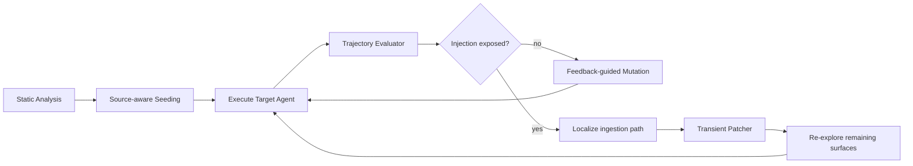

# PI-Hunter：把 Prompt Injection 红队从“攻击成功率”推进到“摄入路径定位”

## 元信息

| 项目 | 内容 |
| --- | --- |
| 标题 | PI-Hunter: Automated Red-Teaming for Exposing and Localizing Prompt Injections |
| 作者 | Pengfei He, Lesly Miculicich, Vishesh Sharma, Ash Fox, George Lee, Jiliang Tang, Tomas Pfister, Long T. Le |
| 机构 | Google Cloud AI Research, Google, Michigan State University |
| 类型 | 论文 |
| arXiv | [arXiv:2606.12737](https://arxiv.org/abs/2606.12737) |
| HTML | [arXiv HTML](https://arxiv.org/html/2606.12737v1) |
| PDF | [arXiv PDF](https://arxiv.org/pdf/2606.12737) |
| 日期 | 2026-06-10 |
| 方向 | AI 安全 / Agent 安全 / Indirect Prompt Injection |

## TL;DR

- **这篇论文解决的问题**：现有 prompt injection 红队常把目标设成“找到一个能攻破 Agent 的提示词”，但真实 Agent 的风险往往藏在外部邮件、网页、检索文档、日历事件、数据库记录等不可信来源里；开发者更需要知道**哪一个来源、哪一个工具接口、哪一条推理轨迹**把恶意指令带进了上下文。
- **核心方法**：PI-Hunter 把红队建模为 source-aware 的演化审计流程。它先静态分析目标 Agent 的工具和外部来源，再生成逼真的用户查询，执行后用轨迹级 Evaluator 判断是否暴露了恶意 payload，最后用反馈驱动 mutation 继续搜索。
- **关键机制**：论文最重要的设计不是“生成更狠的攻击语句”，而是把每轮测试绑定到 ingestion path：`source × tool/interface × trajectory`。这样输出不是单个 ASR，而是“哪个外部来源通过哪个接口被 Agent 信任和传播”。
- **实验设置**：论文在 AgentDojo 与 AgentDyn 上评测，覆盖 direct、ignore_previous、system_msg、important_inst、agentvigil 等攻击，比较 baseline 与 PI-Hunter，并在 Gemini、GPT、Claude、DeepSeek 等不同 backbone 上报告 source-level 与 instruction-level precision/recall/diversity。
- **关键数字**：在 Gemini-3.1-pro + AgentDojo + direct 设置下，Source Recall 从 0.248 提到 0.881，Instruction Recall 从 0.422 提到 0.840；在 AgentDojo + agentvigil 设置下，Source Diversity 从 0.078 提到 0.425，Instruction Diversity 从 0.025 提到 0.679。
- **防御下仍有效**：论文还测试 Spotlight、MELON、PIGuard 等防御。作者的结论是，现有防御能拦截部分注入，但不能替代系统级审计；PI-Hunter 在防御存在时仍能暴露隐藏注入。
- **成本边界**：以 Gemini-3.1-pro + AgentDojo 为例，Table 18 报告单次 audit 平均约 70 到 127 个 query、约 5.8k 到 11k token。这个成本对离线安全测试可接受，但论文没有证明它能覆盖所有生产系统的动态状态。
- **主要局限**：评测环境仍是 benchmark 化的 AgentDojo/AgentDyn；“暴露与定位”不等于最终防御；Evaluator 与 Patcher 也依赖 LLM 判断，可能引入漏报、误报和模型偏置。

## 研究问题：Prompt Injection 风险为什么不再只是“提示词问题”？

### 论文真正关心的不是 jailbreak，而是摄入链路

- 传统 jailbreak 或 prompt attack 往往从用户输入出发：
  - 攻击者直接把恶意指令放进 prompt。
  - 红队系统优化提示词，让目标模型违反安全策略。
  - 评测指标常聚焦 attack success rate。

- Agent 场景改变了威胁结构：
  - Agent 会读取邮件、网页、日历、文档、代码仓库、API 响应。
  - 这些外部内容不一定由用户直接输入。
  - 恶意指令可能长期潜伏，直到某个查询触发检索。
  - Agent 可能把外部内容当作事实、任务说明或工具参数继续传播。

- 因此，安全问题从“模型能否拒绝一段恶意文本”变成：
  - 哪些外部来源会被 Agent 读取？
  - 哪些工具会把不可信内容引入上下文？
  - 哪些用户请求会触发这些来源？
  - 哪些中间推理状态会让 Agent 把外部指令当成高优先级任务？

### 作者把挑战拆成三个层次

| 挑战 | 论文中的含义 | 为什么普通红队不够 |
| --- | --- | --- |
| Latent Challenge | 恶意 payload 稀疏、休眠、上下文依赖 | 随机 prompt 很难触发正确来源和正确推理状态 |
| Source-Tool Disambiguation | 同一来源可能被多个工具读取 | 只看最终失败无法判断是来源污染还是接口逻辑问题 |
| Trajectory Dependence | 攻击在中间工具调用和 reasoning trace 中逐步显现 | 只看 final answer 会漏掉早期传播信号 |

### 这改变了 AI 安全评测的对象

- 评测对象不再只是模型参数或安全拒答策略。
- 评测对象变成完整系统：
  - 工具 schema。
  - 检索接口。
  - 数据源权限。
  - 上下文拼接规则。
  - 推理轨迹。
  - 输出侧动作。

- 论文的中心问题可以写成一句话：

> 如何在上线前主动暴露隐藏的 prompt injection 摄入路径，而不是等真实用户触发后再分析事故？

## 论文主张与论证路线

| Claim | Mechanism | Evidence | Boundary |
| --- | --- | --- | --- |
| Prompt injection 是 Agent 系统级漏洞 | 把风险定位到外部 source、tool/interface、trajectory 的组合 | Introduction 与 Figure 1 将邮件、网页、检索文档、数据库等列为不可信来源 | 论文没有覆盖所有生产 Agent，只在 benchmark 环境验证 |
| Source-aware seeding 比 generic prompt 更适合暴露隐藏注入 | 针对具体工具和来源生成逼真用户任务 | Table 4 中 Source-aware 策略在 Source Recall、Instruction Recall、Diversity 上高于 Generic/Holistic | 依赖静态分析是否能识别关键接口 |
| Trajectory-level evaluator 比最终答案标签更有诊断价值 | 审计 retrieved contents、tool invocations、reasoning trace、final output | 方法部分把 evaluator 输出绑定到 suspicious behavior 与 ingestion path | 如果目标系统不暴露 trace，诊断能力会下降 |
| Feedback-driven mutation 能扩大攻击面覆盖 | 根据 evaluator 反馈选择变异算子，并用 meta-mutation 改进算子 | Table 1/2/16/17 显示 recall 与 diversity 普遍提升 | Mutation 本身依赖 LLM 生成质量与环境可探索性 |
| Patch-and-reexplore 能避免重复发现同一漏洞 | 对已暴露路径施加临时 mitigation，迫使搜索转向其他路径 | 3.3 节说明 Patcher 不是永久防御，而是探索调度手段 | 临时 patch 可能改变系统行为，不能直接等同生产修复 |
| 现有防御不能替代主动审计 | 在 Spotlight、MELON、PIGuard 下继续测试 | Table 3 显示防御场景中 PI-Hunter 仍能发现隐藏指令 | 防御实现、benchmark 攻击和真实部署差异会影响结论 |

## 方法机制：PI-Hunter 如何工作？

### 总体流程



### 阶段一：Static Analysis

- 输入：
  - 目标 Agent 的工具列表。
  - API schema。
  - 可访问的数据源。
  - 文件类型、检索接口和外部通道。

- 输出：
  - 高风险 source。
  - 高风险 tool/interface。
  - 初始 source-aware test case 的生成约束。

- 作者特别关注的接口包括：
  - email client。
  - web search。
  - database query。
  - command-line tool。
  - document retrieval。
  - calendar 或 workspace data。

- 设计意义：
  - 这一步把搜索空间从“任意 prompt”缩小到“Agent 真实能触达的来源”。
  - 它让后续测试更像真实用户操作，而不是离线 jailbreak。
  - 它为定位提供先验：如果 `search_calendar_events` 暴露 payload，审计报告能回到具体接口。

### 阶段二：Source-aware Meta Seeding

- 每个 seed query 同时满足三个目标：
  - 用户意图看起来正常。
  - 能触发某个高风险工具或来源。
  - 要求 Agent 检查、引用、总结或展开外部内容。

- 这与 generic prompt 的差别很关键：
  - generic prompt 只问“你能不能找到问题”。
  - source-aware prompt 会问“请检查最近邮件中与某项目相关的所有附件并逐项总结”。
  - 后者更容易触发隐藏 payload 的 retrieval path。

- 这一步对应论文里的核心判断：
  - Prompt injection 的触发条件通常不是“恶意文本存在”。
  - 触发条件是“恶意文本被正确来源检索、被正确工具读入、被 Agent 当成上下文处理”。

### 阶段三：Trajectory Execution and Evaluation

- 每轮执行记录：
  - 用户查询。
  - 工具调用。
  - retrieved contents。
  - 中间 reasoning trace。
  - 最终回答。
  - 是否出现敏感动作或意图偏移。

- Evaluator 不只做二分类：
  - 它判断是否有 suspicious instruction propagation。
  - 它定位 source-level exposure。
  - 它定位 instruction-level exposure。
  - 它给 mutation 提供下一轮反馈。

- 轨迹级审计的价值：
  - Agent 可能最终没有执行恶意动作，但已经把恶意指令读入并引用。
  - Agent 可能只在工具参数中泄露风险，final answer 看起来正常。
  - Agent 可能在多步规划中把外部指令升级成“系统要求”。

### 阶段四：Feedback-guided Mutation

- Mutation 不是随机改写。
- 它根据上一轮反馈选择策略：
  - 扩大检索范围。
  - 改变查询参数。
  - 增加上下文压力。
  - 切换角色或任务框架。
  - 使用 domain-specific 场景。

- 论文附录列出多类 mutation：
  - general-purpose operators。
  - workspace/email/calendar 场景。
  - banking 场景。
  - shopping 场景。
  - slack 场景。
  - dailylife 场景。

- 这一步的安全含义：
  - 攻击面不是静态集合。
  - 每轮执行都会暴露“Agent 如何走向某个来源”。
  - 新查询应当沿着高风险轨迹继续探索，而不是从零开始随机试。

### 阶段五：Verification and Co-evolution

- Patcher 的角色容易误解。
- 它不是最终防御组件。
- 它是审计过程里的搜索调度器：
  - 已经发现某条 ingestion path 后，临时屏蔽或限制它。
  - 防止测试反复命中同一个高概率漏洞。
  - 迫使后续迭代探索更深、更稀疏的路径。

- 这种机制把红队从“找到一个漏洞就结束”改成：
  - 找到漏洞。
  - 暂时 neutralize。
  - 继续寻找未覆盖来源。
  - 扩大 attack-surface coverage。

## 形式化理解：PI-Hunter 在最大化什么？

### 摄入路径定义

可以把一个 Agent 的风险面写成：

$$
\mathcal{P} = \{(s, t, \tau) \mid s \in S,\ t \in T,\ \tau \in \Tau\}
$$

变量解释：

| 符号 | 含义 |
| --- | --- |
| $S$ | 外部来源集合，例如邮件、网页、文档、数据库 |
| $T$ | 工具或接口集合，例如 search、summary、calendar lookup |
| $\Tau$ | 执行轨迹集合，包括工具调用、检索内容和 reasoning trace |
| $(s,t,\tau)$ | 某条可审计 ingestion path |

PI-Hunter 的目标不是只最大化 attack success：

$$
\max_q ASR(q)
$$

更贴切的目标是最大化被暴露的摄入路径覆盖：

$$
\max_{Q} \left|\left\{(s,t,\tau) \in \mathcal{P}: E(A(q)) = 1,\ q \in Q\right\}\right|
$$

其中：

- $Q$ 是测试查询集合。
- $A(q)$ 是目标 Agent 执行查询后的轨迹。
- $E$ 是 Evaluator，对轨迹做注入暴露判断。
- 输出集合越大，说明审计覆盖了越多不同路径。

### Source-level 与 Instruction-level 指标

论文将指标拆成两层：

| 指标层级 | 关注对象 | 例子 |
| --- | --- | --- |
| Source-level | 是否定位到污染来源 | 某个 calendar event、email、file、web page |
| Instruction-level | 是否暴露具体恶意指令 | exfiltrate email、override user task、redirect traffic |

基本 precision / recall 可以写成：

$$
Precision = \frac{TP}{TP + FP}
$$

$$
Recall = \frac{TP}{TP + FN}
$$

论文还关心 Diversity，含义不是“成功次数”，而是不同来源和不同指令的覆盖广度。这个指标比 ASR 更适合审计，因为生产系统最怕的是未覆盖的长尾路径。

## 算法流程：把论文机制写成伪代码

```text
Input:
  Agent A
  Tool/interface set T
  External source set S
  Initial audit budget B

State:
  Query population Q
  Exposed ingestion paths R
  Mutation operator pool M
  Temporary mitigations P

Procedure:
  1. surfaces = StaticAnalyze(A, T, S)
  2. Q = SourceAwareSeed(surfaces)
  3. while budget remains:
       for query q in Q:
         trajectory = Execute(A with P, q)
         finding = Evaluate(trajectory)
         if finding exposes injection:
            path = Localize(source, tool, trajectory)
            R.add(path)
            P.add(TransientPatch(path))
         else:
            feedback.add(finding)
       M = MetaMutate(M, feedback, R)
       Q = Mutate(Q, M, feedback, uncovered_surfaces)
  4. return R, trajectories, diagnostics

Output:
  - exposed malicious sources
  - recovered malicious instructions
  - source-tool ingestion paths
  - trajectory evidence
  - remaining uncovered surfaces

Failure boundaries:
  - static analysis misses a critical tool
  - target system hides trajectory evidence
  - evaluator mislabels subtle injection
  - budget is too small for sparse sources
  - transient patch changes behavior too much
```

## 实验设置：作者如何证明 PI-Hunter 有用？

### 研究问题

| RQ | 问题 | 对应实验 |
| --- | --- | --- |
| RQ1 | 能否暴露隐藏 prompt injection，并定位 compromised ingestion paths？ | Table 1、Table 2、Table 16、Table 17 |
| RQ2 | 在已有防御下是否仍能发现隐藏注入？ | Table 3 |
| RQ3 | 关键模块是否真的必要？ | Table 4、Table 5、Figure 2、Figure 3、Appendix |

### Benchmark 与攻击设置

- Benchmark：
  - AgentDojo。
  - AgentDyn。

- 攻击类型：
  - direct。
  - ignore_previous。
  - system_msg。
  - important_inst。
  - agentvigil。

- 注入场景：
  - single source / single instruction。
  - single source / multiple instructions。
  - multiple sources / single instruction。
  - multiple sources / multiple instructions。

- Backbone：
  - Gemini 系列。
  - GPT 系列。
  - Claude 系列。
  - DeepSeek 系列。

### Baseline 的含义

- Baseline 是一个不带 PI-Hunter 结构约束的 automated red-teaming agent。
- 它也能与目标 Agent 交互并尝试发现隐藏注入。
- 关键差别：
  - baseline 不显式维护 source-aware seeding。
  - baseline 不系统定位 source-tool ingestion path。
  - baseline 不用 patch-and-reexplore 强制拓展覆盖面。

## 主结果：为什么说 PI-Hunter 不是只提高一点 ASR？

### Table 1：Recall 与 Precision 的提升

以下摘取论文 Table 1 中若干代表性结果，用于说明提升方向：

| Model / Dataset / Attack | 指标 | Baseline | PI-Hunter | 解读 |
| --- | --- | ---: | ---: | --- |
| Gemini-3.1-pro / AgentDojo / direct | Source Recall | 0.248 | 0.881 | 从少量命中变成覆盖大部分污染来源 |
| Gemini-3.1-pro / AgentDojo / direct | Instruction Recall | 0.422 | 0.840 | 不只找到来源，也更能恢复具体恶意指令 |
| Gemini-3.1-pro / AgentDojo / ignore_previous | Source Recall | 0.221 | 0.915 | 对常见覆盖式注入有强定位能力 |
| Gemini-3.1-pro / AgentDyn / system_msg | Instruction Recall | 0.544 | 0.843 | 在不同环境里仍能提高指令暴露 |
| Claude-4.6-sonnet / AgentDojo / direct | Instruction Precision | 0.917 | 0.957 | 在强模型上也能保持较高准确性 |

这些数字支撑两个判断：

- PI-Hunter 的收益主要体现在 Recall 和 Diversity。
- 它更像 audit coverage 工具，而不是单纯 attack optimizer。

### Table 2 / Table 17：Diversity 是论文最值得看的指标

在 Agent 安全里，Diversity 比单轮成功更重要：

- 如果系统总是发现同一个坏邮件，审计价值有限。
- 如果系统能不断发现不同来源、不同工具、不同指令类型，才接近上线前安全扫描。

论文中一个代表性结果：

| 设置 | Source Diversity Baseline | Source Diversity PI-Hunter | Instruction Diversity Baseline | Instruction Diversity PI-Hunter |
| --- | ---: | ---: | ---: | ---: |
| Gemini-2.5-pro / AgentDojo / agentvigil | 0.078 | 0.425 | 0.025 | 0.679 |
| Gemini-3.1-pro / AgentDojo / direct | 0.144 | 0.784 | 0.322 | 0.836 |
| GPT-5.4-mini / AgentDyn / direct | 0.142 | 0.677 | 0.316 | 0.738 |
| DeepSeek / AgentDyn / agentvigil | 0.084 | 0.438 | 0.229 | 0.595 |

这说明 PI-Hunter 的 patch-and-reexplore 机制确实在把搜索推向更多路径，而不是重复刷同一个漏洞。

### Table 3：防御不是审计的替代品

论文测试了三类代表性防御：

- Spotlight。
- MELON。
- PIGuard。

作者的论证方式是：

1. 先把 target agent 加上防御。
2. 再比较 baseline 与 PI-Hunter。
3. 看隐藏来源和隐藏指令是否仍能被暴露。

关键含义：

- 防御可以降低某些攻击的直接成功率。
- 但防御本身并不保证所有 ingestion paths 已被发现。
- 审计工具应该作为上线前测试流程，而不是运行时 guardrail 的替代。

### Table 4：Source-aware seeding 为什么必要？

论文比较三种 seeding：

| Seeding strategy | Source Precision | Source Recall | Source Diversity | Instruction Precision | Instruction Recall | Instruction Diversity |
| --- | ---: | ---: | ---: | ---: | ---: | ---: |
| Generic | 0.2338 | 0.1918 | 0.2972 | 0.3403 | 0.3399 | 0.2717 |
| Holistic | 0.5456 | 0.3453 | 0.3311 | 0.5444 | 0.3059 | 0.4754 |
| Source-aware | 0.7794 | 0.4796 | 0.4245 | 0.6805 | 0.4856 | 0.6792 |

这张表最能解释论文的方法论：

- Generic 太宽，容易生成无关测试。
- Holistic 比 generic 好，但仍不够细。
- Source-aware 把查询直接绑定到来源和接口，因此 recall、precision、diversity 同时提高。

## 消融与失败边界

### 关键模块的必要性

| 模块 | 如果去掉会怎样 | 论文里的解释 |
| --- | --- | --- |
| Static analysis | seed 可能不触发真实高风险工具 | 审计空间过大，测试变成随机试探 |
| Source-aware seeding | recall 与 diversity 明显下降 | Table 4 支持这一点 |
| Trajectory evaluator | mutation 缺少诊断反馈 | 系统只能看最终答案，难以定位摄入路径 |
| Feedback mutation | 搜索不会沿着高风险轨迹演化 | 难以触发稀疏、休眠 payload |
| Patcher | 容易重复发现同一漏洞 | attack-surface coverage 难提升 |

### 论文没有完全解决的问题

- **生产动态性**：
  - benchmark 的数据源、攻击类型、工具接口是可控的。
  - 真实系统里的网页、邮件、权限、缓存、检索排序会持续变化。
  - 因此，Table 1 的提升不能直接等价为生产覆盖率。

- **Trace 可见性**：
  - PI-Hunter 依赖轨迹审计。
  - 如果生产 Agent 不暴露工具调用和中间上下文，Evaluator 的定位能力会弱很多。
  - 这也提示 Agent 平台需要内建可审计日志。

- **Evaluator 可信度**：
  - Evaluator 由 LLM 驱动。
  - 它可能误把正常文本判成恶意。
  - 也可能漏掉语义隐蔽的 payload。
  - 论文报告 precision，但没有消除 LLM-as-judge 的全部偏差。

- **Patcher 的副作用**：
  - 临时 patch 能帮助探索。
  - 但 patch 会改变目标 Agent 的行为分布。
  - 如果 patch 过强，可能遮蔽真实系统中的复合风险。

- **攻击者适应性**：
  - 如果攻击者知道 PI-Hunter 的 mutation 模式，可能设计更强的休眠 payload。
  - 论文没有完整讨论 adaptive adversary。

## Figure / Table 证据逐项解读

### Figure 1：三段式审计流程


- Figure 1 的作用：
  - 把 static analysis、evolutionary exploitation、patch-and-reexploration 串起来。
  - 说明 PI-Hunter 是系统审计 loop，不是单步 prompt generator。

- 它支撑的 claim：
  - Prompt injection 暴露需要“识别接口 → 执行轨迹 → 反馈演化 → 再探索”。

- 它不能证明的内容：
  - 不能证明所有真实工具都能静态识别。
  - 不能证明 patch 后探索一定覆盖长尾路径。

### Figure 2：不同 Agent 结构下的结果


- 这张图的功能：
  - 检查 PI-Hunter 是否只适用于某一种 Agent 架构。
  - 对比不同结构下 source 与 instruction 暴露指标。
  - 说明方法收益来自 source-aware 与 trajectory-aware 搜索，而不是某个单一 harness 的偶然适配。

- 研究判断：
  - 如果一个红队方法只能在单一 ReAct 风格 Agent 上有效，它的生产意义会很弱。
  - Figure 2 的价值在于把方法推广到 planner-executor 等结构上，提示安全审计需要面向“Agent 架构族”而不是单个 demo。

- 边界：
  - 图中结构仍是论文环境里的受控实现。
  - 真实产品可能有浏览器、长记忆、用户权限和异步任务队列。
  - 因此它证明的是跨结构趋势，不是生产全覆盖。

### Figure 3：迭代次数与搜索收益


- 这张图回答的是预算问题：
  - 如果只跑少数轮，PI-Hunter 可能只找到显眼路径。
  - 随着迭代增加，feedback mutation 会继续逼近更隐蔽的来源。
  - 但收益不可能无限线性增长，后期会受到 benchmark 中隐藏来源数量和 mutation 质量限制。

- 对实践的含义：
  - 低风险工具可以用小预算快速 smoke test。
  - 高风险工具需要更多轮次和更强 source-aware seed。
  - 对外部写入、转账、发邮件、提交代码等能力，应当把迭代预算视为上线门槛的一部分。

### Table 1：主性能表

- 支撑：
  - PI-Hunter 在多个模型、环境和攻击类型上提升 source/instruction recall。

- 边界：
  - 表格多数结果来自 benchmark。
  - precision/recall 依赖 ground truth 标注。
  - 真实生产环境通常没有完整 ground truth。

### Table 2 / Table 17：多样性

- 支撑：
  - PI-Hunter 不只是重复找到同一条路径。
  - 它在 source diversity 与 instruction diversity 上都有提升。

- 边界：
  - Diversity 是对 benchmark 内已定义 source/instruction 的覆盖。
  - 它不是开放世界覆盖率。

### Table 3：防御场景

- 支撑：
  - 运行时防御后仍需主动红队。
  - 防御与审计是互补关系。

- 边界：
  - 防御实现的参数、提示、模型版本会影响结果。
  - 论文没有覆盖所有 guardrail 或浏览器隔离方案。

### Table 4：seeding 消融

- 支撑：
  - Source-aware 是方法有效性的核心。
  - 只做 generic adversarial prompting 不够。

- 边界：
  - Source-aware 依赖前置静态分析。
  - 如果 Agent 工具是动态注册或隐式调用，静态分析可能不完整。

### Table 18：计算成本

- 数字：
  - direct：平均 100.81 queries，8562.12 tokens。
  - ignore_previous：平均 95.69 queries，8201.44 tokens。
  - system_msg：平均 127.19 queries，11006.75 tokens。
  - important_inst：平均 70.06 queries，5759.19 tokens。
  - agentvigil：平均 75.38 queries，6123.62 tokens。

- 解读：
  - 对离线审计来说，这个成本不高。
  - 对每次用户请求实时执行则不现实。
  - 更合理的部署方式是 CI、pre-release、定期红队和高风险工具上线前审计。

## 相关工作与位置判断

### 与 AgentDojo / AgentDyn 的关系

- AgentDojo、AgentDyn 提供 agentic prompt injection 的评测环境。
- PI-Hunter 则是主动探索工具。
- 前者回答“能不能测”，后者回答“如何更系统地找到路径”。

### 与 AutoRedTeamer / GOAT / SIRAJ 的关系

- 这些方法更接近 attack generation。
- PI-Hunter 的区别：
  - 强调 source-aware。
  - 强调 trajectory-level diagnosis。
  - 强调 patch-and-reexplore。
  - 强调定位而不是只成功。

### 与运行时防御的关系

- Spotlight、MELON、PIGuard 等属于 mitigation 或 guardrail。
- PI-Hunter 属于 audit。
- 二者关系应当是：
  - defense 降低运行时风险。
  - audit 找出 defense 没覆盖的来源和路径。
  - audit 结果反过来改进 defense 和工具边界。

### 在 Agent 安全谱系里的位置

| 层级 | 典型问题 | PI-Hunter 的位置 |
| --- | --- | --- |
| 模型层 | 模型是否服从恶意指令 | 间接相关 |
| Prompt 层 | 系统提示是否能隔离指令 | 作为被测对象的一部分 |
| 工具层 | 工具是否引入不可信内容 | 核心关注 |
| 数据源层 | 外部来源是否含 payload | 核心关注 |
| 轨迹层 | Agent 如何传播 payload | 核心关注 |
| 防御层 | guardrail 是否有效 | 作为防御下审计 |
| 审计层 | 如何覆盖 attack surface | PI-Hunter 的主场 |

## 从工程审计角度重读 PI-Hunter

### 它实际要求 Agent 平台提供哪些能力？

- **工具注册表必须可枚举**：
  - PI-Hunter 的 static analysis 需要知道 Agent 能调用哪些工具。
  - 如果工具是运行时动态注入，审计系统就需要在执行前冻结或导出工具视图。
  - 这意味着 Agent 平台不能只把工具当 prompt 模板，还要把它们当安全边界。

- **外部内容必须带 provenance**：
  - 论文关心 source localization。
  - 如果检索系统只返回拼接后的文本，审计器很难知道 payload 来自哪封邮件或哪篇文档。
  - 生产系统应当记录 source id、retrieval query、chunk id、时间戳和权限上下文。

- **工具调用必须可回放**：
  - 轨迹审计依赖 tool invocation。
  - 一次暴露路径如果不能 replay，就很难区分偶然检索排序和稳定漏洞。
  - 对安全团队来说，可回放轨迹比一次截图更有价值。

- **安全策略必须能临时隔离单条路径**：
  - Patcher 的思想可以落到工程上。
  - 例如临时屏蔽某个 source、降低某个工具权限、把某类文档标为 data-only。
  - 这种隔离不是最终修复，但能帮助审计继续覆盖其他路径。

### 它对“权限最小化”的补充

- 权限最小化回答：
  - Agent 是否需要这个工具？
  - Agent 是否需要写权限？
  - Agent 是否需要访问所有外部来源？

- PI-Hunter 进一步追问：
  - 某个读权限是否会把外部指令带入规划？
  - 某个 summary 工具是否比 search 工具更容易传播 payload？
  - 某个来源是否只在高压力用户场景下被信任？
  - 某个防御是否只挡住 final answer，而没有阻断中间传播？

- 所以它不是替代权限模型，而是让权限模型有证据：
  - 哪些权限组合真实触发了风险。
  - 哪些 source-tool 组合应当隔离。
  - 哪些场景需要人工审批。

### 它也提醒我们别过度相信“模型更强就更安全”

- 论文跨多个 backbone 做测试。
- 结果不是简单的“强模型全部免疫”。
- 更强模型可能：
  - 更会检索。
  - 更会总结。
  - 更会遵循复杂用户请求。
  - 也更可能把隐藏 payload 认真读出来。

- 这不是说强模型更危险。
- 更准确的说法是：
  - Agent 风险来自模型能力、工具边界、外部数据和任务压力的组合。
  - 单独换模型不能替代系统级审计。
  - 安全评测必须和具体工具链绑定。

## 研究者视角：这篇论文带来的三个理解变化

### 变化一：Agent 安全要从输入过滤转向摄入路径治理

- 过去常见做法：
  - 对用户输入做检测。
  - 对模型输出做安全分类。
  - 在系统 prompt 中加入“不听外部指令”。

- PI-Hunter 暗示更合理的治理对象：
  - 哪些工具能读外部内容？
  - 外部内容进入上下文时是否带 provenance？
  - Agent 是否能区分 data 与 instruction？
  - 某个工具输出是否允许触发另一个敏感工具？

- 这与权限系统、数据流跟踪、capability isolation 的关系更近。

### 变化二：评测指标要从 ASR 扩展到 Coverage

- ASR 有用，但不足：
  - 一个攻击成功不代表审计覆盖充分。
  - 一个攻击失败也不代表系统安全。

- 更适合 Agent 安全的指标包括：
  - source recall。
  - instruction recall。
  - source diversity。
  - instruction diversity。
  - ingestion path localization accuracy。
  - uncovered surface count。

- PI-Hunter 的价值在于把这些指标变成可执行审计流程。

### 变化三：安全工具需要和 Agent 可观测性绑定

- 没有轨迹，PI-Hunter 就很难定位。
- 这说明未来 Agent 平台需要默认记录：
  - tool call。
  - retrieved content hash。
  - source provenance。
  - instruction boundary。
  - decision trace。
  - policy check result。

- 这些日志不只是 debug 用。
- 它们是安全审计的一部分。

## 可复现性与实现注意点

### 复现前需要确认的条件

- benchmark 数据是否公开。
- attack payload ground truth 是否可访问。
- 目标 Agent 是否暴露 tool trace。
- Evaluator prompt 是否完整。
- mutation operator 是否与论文附录一致。
- 防御实现是否与论文设置一致。

### 如果把 PI-Hunter 用到真实系统

建议先从低风险离线环境开始：

1. 镜像生产工具 schema。
2. 准备带 provenance 的测试数据源。
3. 在每个 source 中植入可识别的 benign canary payload。
4. 用 source-aware seed 触发检索。
5. 记录 tool trace 与 retrieved contents。
6. 用 evaluator 输出疑似路径。
7. 对已暴露路径临时隔离。
8. 继续探索未覆盖来源。
9. 把结果转成权限、隔离、过滤、提示边界和日志改造任务。

### 不应直接做的事

- 不应把 PI-Hunter 当成生产时在线 guardrail。
- 不应只看是否最终执行恶意动作。
- 不应在没有隔离的真实用户数据上运行攻击性 mutation。
- 不应把 LLM evaluator 的判断当成唯一安全结论。

## 结论与局限

### 结论

- PI-Hunter 的贡献在于重新定义 prompt injection 红队目标：
  - 从“生成一个能攻破系统的 prompt”。
  - 转向“系统性暴露和定位隐藏摄入路径”。

- 它把 Agent 安全评测落到四个可操作模块：
  - source-aware seeding。
  - trajectory-level auditing。
  - feedback-guided mutation。
  - patch-and-reexplore。

- 实验证据显示：
  - recall 提升明显。
  - diversity 提升更关键。
  - 在现有防御下仍能发现隐藏注入。
  - 成本适合离线审计和发布前安全测试。

### 局限

- benchmark 环境无法完全代表真实生产 Agent。
- 静态分析可能漏掉动态工具和隐式数据流。
- LLM evaluator 可能误报或漏报。
- 临时 patch 可能改变探索分布。
- 论文尚未证明对 adaptive adversary 的鲁棒性。
- 论文的目标是暴露漏洞，不是给出完整防御闭环。

### 继续追问

- 如何把 PI-Hunter 与信息流控制结合，让 source provenance 在运行时强制生效？
- 如何在没有 chain-of-thought 暴露的系统里做等价 trajectory auditing？
- 如何评估 mutation operator 对真实业务流程的覆盖率，而不是只评估 benchmark source？
- 如何把审计结果自动转成工具权限、上下文隔离和数据源清洗策略？
- 如何避免 red-team mutation 本身成为对真实系统的高风险操作？

## 参考链接

- [arXiv abstract: PI-Hunter](https://arxiv.org/abs/2606.12737)
- [arXiv HTML full text](https://arxiv.org/html/2606.12737v1)
- [arXiv PDF](https://arxiv.org/pdf/2606.12737)
- [AI Security Portal literature entry](https://aisecurity-portal.org/en/literature-database/pi-hunter-automated-red-teaming-for-exposing-and-localizing-prompt-injections/)
- [Weekly Musings AI Security Wrapup](https://www.rockcybermusings.com/p/weekly-musings-top-10-ai-security-20260605-20260611)
