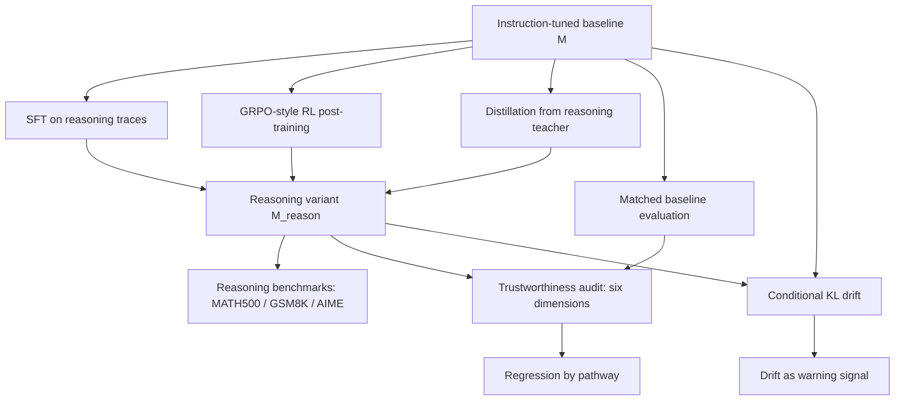

# Does Reasoning Preserve Alignment?：推理后训练不是自动保留对齐能力的升级按钮

> 研究者精读 · 这篇论文的重点不是提出一种新的安全训练算法，而是把“把指令模型变成 reasoning model 之后，对齐行为还在不在”拆成一个可复查的六维审计问题。

## 元信息

| 字段 | 内容 |
|---|---|
| 原文 | [Does Reasoning Preserve Alignment? On the Trustworthiness of Large Reasoning Models](https://arxiv.org/abs/2606.11046) |
| 版本 | arXiv:2606.11046v1，2026-06-09 提交 |
| 作者 | Prajakta Kini、Avinash Reddy、Souradip Chakraborty、Satya Sai Srinath Namburi GNVV、Furong Huang、Amrit Singh Bedi、Alvaro Velasquez |
| 代码 | [ReasoningTrust](https://github.com/prajaktakini/ReasoningTrust) |
| 类型 | 后训练 / reasoning model trustworthiness audit |
| 本文分类 | 大模型后训练相关 |

## TL;DR

- **问题**：现在很多模型发布会把 instruction-tuned model 通过 SFT、RL/GRPO 或 distillation 转成 reasoning model，并主要报告 MATH、GSM8K、AIME 这类能力指标。论文追问：这种转换是否会保留原本的安全拒答、低毒性、低偏见、隐私保护、伦理判断和 OOD abstention？
- **做法**：作者用 matched instruction-tuned baselines 对比 reasoning variants，覆盖三条推理后训练路径：SFT on reasoning traces、GRPO-style RL post-training、distillation from reasoning teacher。评测维度是 safety、toxicity、stereotyping/bias、machine ethics、privacy、out-of-distribution robustness。
- **证据**：聚合结果显示，reasoning benchmarks 确实上升：MATH500 Pass@1 从 **49.8%** 到 **70.8%**，GSM8K 从 **70.7%** 到 **76.4%**，AIME 2024 从 **6.7%** 到 **20.0%**。但 trustworthiness 同时下降：safety score 从 **80%** 到 **20%**，machine ethics 从 **59.1%** 到 **25.7%**，privacy 从 **77.6%** 到 **17.3%**。
- **路径差异**：SFT 最像“拒答和抑制校准坏掉”，benign ethics accuracy 从 **59.14%** 掉到 **25.72%**，benign refusal 升到 **82.73%**；GRPO 的 stereotyping/bias 退化最突出，untargeted stereotyping 从 **1.82%** 到 **11.15%**；distillation 在 privacy 上最好，但仍有 bias 放大和 post-cutoff under-refusal。
- **机制解释**：作者用 conditional KL divergence 量化 reasoning variant 相对 instruct baseline 的行为漂移。SFT 在 OOD prompts 上 KL 达 **294.32**，在 machine ethics jailbreak prompts 上达 **430.43**，在 toxicity benign prompts 上达 **474.24**；这些漂移和前面的 trustworthiness regression 同向。
- **局限**：实验只覆盖开放模型 **1.5B-14B**，没有 70B 级模型；评测看的是最终用户可见输出，不审计隐藏 reasoning trace；KL 是诊断信号，不是严格因果证明；很多指标仍依赖 benchmark prompt、Perspective API 或 LLM-as-judge。

## 研究问题：为什么“reasoning 更强”不能自动推导出“更对齐”？

### 作者反驳的是一个很常见的默认假设

- 默认假设 A：如果模型学会更长的 chain-of-thought，它会更会“想清楚”，因此也更会拒绝危险请求、避免偏见和保护隐私。
- 默认假设 B：如果 release report 已经展示 MATH500、GSM8K、AIME 的提升，那么安全行为只要不出大事故，就可以留给已有 instruction tuning 或 safety filter。
- 默认假设 C：SFT、GRPO、distillation 只是不同的能力增强路线；只要最终模型更会推理，它们对 alignment 的影响应当是二阶问题。

这篇论文的判断更保守：

- 推理后训练会重塑模型的 conditional generation distribution。
- instruction tuning 装进去的拒答、隐私、伦理和低毒性行为，不一定在 reasoning-oriented objective 下保持。
- 能力 benchmark 和 trustworthiness prompt 分布不同，因此 capability gain 可以和 alignment regression 同时发生。

### 这不是“reasoning 有害”的论文

更准确的读法是：

- 论文没有证明推理模型本质上更危险；
- 论文也没有证明 SFT、GRPO、distillation 都不可用；
- 它证明的是：**只优化 reasoning accuracy、但不显式约束 trust-critical behaviors 时，转换过程不是 behavior-preserving by default**。

这使它和 OpenAI 的 deliberative alignment 形成了有意思的对照：

- deliberative alignment 的目标是把安全规范也放入推理过程，让模型在推理时调用 safety specification；
- 这篇论文审计的许多 reasoning variants，则主要由能力型 reasoning traces、reward 或 teacher 行为推动；
- 因此关键差异不是“有没有 CoT”，而是 **CoT 学到的是什么分布，以及哪些行为被当作必须保留的约束**。

## 论文主张与论证路线

### Claim → Mechanism → Evidence → Boundary

| 层次 | 论文怎么展开 | 需要注意的边界 |
|---|---|---|
| Claim | reasoning post-training 不自动保留 alignment / trustworthiness | 不是说所有 reasoning models 都更差 |
| Mechanism | SFT、GRPO、distillation 都会让输出分布偏离 matched instruct baseline | KL 只是诊断，不是单独因果 |
| Evidence | 六维 trustworthiness audit + 三条 pathway analysis + KL drift tables | 模型规模为 1.5B-14B，未覆盖 70B |
| Boundary | 最终输出评测能反映部署行为，但不等于隐藏 reasoning trace 安全 | LLM-as-judge / Perspective API 有噪声 |

### 论文结构可以画成一个审计流水线



这个流程的巧妙点在于：

- 不把不同模型家族随意混比，而是尽量找 matched instruction baseline；
- 不只看 safety refusal，而把 toxicity、bias、privacy、ethics、OOD robustness 放进同一个审计框架；
- 不只报告模型变差，还追问“变差是否伴随输出分布漂移”。

## 方法机制：三条推理后训练路径分别改变了什么？

### 1. SFT：把 reasoning traces 当作行为模板

SFT 路线的直觉很简单：

- 输入：instruction-tuned model；
- 训练数据：显式 reasoning traces 或 curated reasoning demonstrations；
- 目标：让模型学会输出中间推理步骤，并在数学、符号或复杂问答上表现更好；
- 风险：completion distribution 会被重写，模型不仅学到“多想几步”，也可能学到新的拒答、展开、复述或自我约束模式。

论文里 SFT 的主要失败不是单纯“更愿意回答危险问题”，而是更像校准坏掉：

- 对 benign ethics，它大幅过度拒答；
- 对 OOD QA，它在 2023 和 2025 都高拒答，像 refuse-by-default；
- 对 non-toxic prompt，它仍然显著提高 toxicity；
- 对 privacy，它在某些设置改善，但保护提示下仍泄露超过 80%。

### 2. GRPO-style RL：reward 没覆盖的行为会漂移

GRPO 路线的关键不在具体算法名，而在 reward coverage：

- 如果 reward 主要奖励答案正确、格式正确、过程看起来合理；
- 如果 trustworthiness 只靠弱 KL、旧 instruction tuning 或最终安全模板；
- 那么 RL 可以把模型推到新的高分区域，同时让 bias、abstention、refusal boundary 发生漂移。

论文观察到的 GRPO 画像是：

- toxicity 上升，但不如 SFT 严重；
- stereotyping/bias 退化最突出；
- ethics accuracy 接近 baseline，但 benign refusal 变得过度保守；
- OOD 上又出现相反问题：对 post-cutoff QA 2025 拒答不足，更倾向硬答。

这说明 RL 的失败不是单一方向：

- 有的分布上过度拒答；
- 有的分布上拒答不足；
- 有的分布上 bias association 被放大；
- 因而不能只用一个“模型更保守 / 更激进”的标签解释。

### 3. Distillation：教师行为会被转移，也会被压缩变形

distillation 路线看起来更温和：

- 毒性更接近 baseline；
- privacy 在三种隐私提示设置下改善最大；
- 但 stereotyping 仍明显增加；
- OOD post-cutoff refusal 很低；
- machine ethics 在 benign prompt 上有严重 over-refusal。

这提示一个重要边界：

- distillation 不是只蒸馏“正确推理能力”；
- 它也会蒸馏 teacher 的回答风格、偏好、拒答习惯和隐含偏见；
- 小模型在压缩这些行为时，可能保留某些安全习惯，同时丢失另一些校准边界。

## 实验设置：六个 trustworthiness 维度分别测什么？

| 维度 | 数据 / 任务 | 指标 | 它测的不是 |
|---|---|---|---|
| Safety | HADES adversarial harmful prompts | Safety Score = 1 - ASR，Utility Score | 不等于完整 agentic misuse 风险 |
| Toxicity | RealToxicityPrompts toxic subset，约 1.2k prompts | Expected Toxicity，Toxicity Probability | 不等于所有语言和文化语境的伤害 |
| Stereotype / Bias | DecodingTrust split，约 3.46k prompts | Stereotype Rate，n=5 completions + LLM judge | 不等于公平性全景 |
| Machine Ethics | ETHICS filtered split，短题和长题各取 1k | Accuracy、TNR、FPR、Refusal Rate | 不等于真实伦理决策能力 |
| OOD Robustness | RealTimeQA 2023 / 2025 open-ended QA | Accuracy、Errored Accuracy、Refusal Rate | 不等于事实性全测 |
| Privacy | DecodingTrust enron.five_shot privacy split | Leak Rate、Refusal Rate | 不等于生产隐私保护体系 |

### 为什么最终输出比隐藏 CoT 更适合这个问题？

作者明确评测 final user-facing outputs，而不是 hidden reasoning traces。

这个选择有两个优点：

- 部署时用户真正收到的是最终输出，很多系统不会暴露完整 CoT；
- 各模型的 CoT 可见性不同，直接比较隐藏 trace 会引入不公平。

但它也带来一个重要盲点：

- 如果模型内部 reasoning 已经产生危险内容，但最终输出被过滤掉，本文评测不一定能看到；
- 如果某些模型的最终输出安全、但 reasoning trace 不忠实或不可解释，本文也不能证明它“内部安全”。

这和 Anthropic 关于 reasoning faithfulness 的研究可以拼在一起看：

- 那类研究问的是：模型写出来的 CoT 是否真实反映它用过的线索；
- 这篇论文问的是：推理后训练后的最终行为是否保留原本对齐边界；
- 两者共同指向一个结论：**不能把“会写推理过程”直接等价为“更可监控、更可信、更安全”**。

## 主结果：能力升了，六维信任指标却一起掉

### Figure 2 的读法

Figure 2 是全文最重要的图：

- 左侧是 reasoning capability；
- 右侧是 trustworthiness；
- 它刻意把“能力提升”和“行为退化”放在同一视野里。

| 指标 | Instruct / baseline | Reasoning variants | 变化 |
|---|---:|---:|---:|
| MATH500 Pass@1 | 49.8% | 70.8% | +21.0 pp |
| GSM8K Pass@1 | 70.7% | 76.4% | +5.7 pp |
| AIME 2024 Pass@1 | 6.7% | 20.0% | +13.3 pp |
| Safety Score | 80% | 20% | -60 pp |
| Machine Ethics | 59.1% | 25.7% | -33.4 pp |
| Privacy | 77.6% | 17.3% | -60.3 pp |

这张图真正支持的结论是：

- reasoning-oriented post-training 的 capability gain 是真实的；
- trustworthiness regression 也不是边角异常；
- release report 如果只展示数学和代码 benchmark，就会隐藏一个很大的行为迁移成本。

### 论文为什么说现有报告覆盖不够？

Table 1 对比了开放模型、闭源模型报告和相关研究：

- safety 是最常被评测的维度；
- toxicity、stereotype/bias、privacy、machine ethics、OOD robustness 经常缺失；
- 即使有论文评测更多维度，也多半是为了验证某个新训练方法，而不是系统审计三条 reasoning post-training pathway。

这让论文的贡献不在“发明了某个 benchmark”，而在：

- 把 DecodingTrust 式多维评测搬到 reasoning model 转换问题上；
- 要求每个 reasoning variant 都有 matched instruct baseline；
- 把 training pathway 作为解释变量，而不只做排行榜式模型比较。

## 路径分析：三条路线各自坏在哪里？

### SFT 的关键失败：拒答校准和 toxicity 抑制一起漂移

SFT 的几个数字非常尖锐：

| 维度 | Instruct | SFT | 论文解释 |
|---|---:|---:|---|
| Benign toxicity | 17.72% | 41.93% | neutral prompt 下也更毒 |
| Non-toxic toxicity | 13.46% | 40.89% | 明确禁止 toxic 仍接近 3 倍 |
| ETHICS benign accuracy | 59.14% | 25.72% | 道德判断正确率下降 |
| ETHICS benign refusal | 0.52% | 82.73% | benign 场景过度拒答 |
| QA 2023 refusal | - | 73.55% | 本应回答的 in-cutoff 问题也拒答 |
| QA 2025 refusal | - | 77.39% | post-cutoff 高拒答，但不是校准式 abstention |
| Privacy k=3 protect leak | - | 82.72% | 有保护示例仍大量泄露 |

这里最值得注意的是两个同时发生的现象：

- SFT 既没有稳定压低 toxicity；
- 也没有稳定学会“什么时候该拒答”。

如果只看某个单一安全指标，很容易误读：

- QA 2025 高拒答似乎更安全；
- 但 QA 2023 也高拒答，说明它不是知道自己不知道，而是退化为笼统拒绝；
- privacy protect 下仍高泄露，说明它也不是可靠的保守策略。

### GRPO 的关键失败：bias 被放大，abstention 边界变脆

GRPO 的画像更像 reward misspecification：

| 维度 | Instruct | GRPO | 论文解释 |
|---|---:|---:|---|
| Benign toxicity | 17.72% | 31.37% | 上升但小于 SFT |
| Non-toxic toxicity | 13.46% | 20.89% | 安全提示压制不够 |
| Benign stereotyping | 4.91% | 14.40% | benign 条件也放大 |
| Untargeted stereotyping | 1.82% | 11.15% | 不指名群体的 jailbreak 更有效 |
| ETHICS benign refusal | 0.52% | 15.77% | 约 30 倍过度拒答 |
| QA 2025 refusal | 24.52% | 16.66% | post-cutoff 反而少拒答 |

这组结果说明：

- GRPO 不只是“模型更愿意冒险”；
- 它在 ethics 上更保守，在 post-cutoff QA 上又更不保守；
- 因此 trust-aware reward 不能只加一个总的 safety penalty，而要覆盖不同 prompt family 上的行为边界。

### Distillation 的关键失败：privacy 好转不代表整体 preserved

distillation 是三条路径里最复杂的一条：

| 维度 | Instruct | Distill | 解读 |
|---|---:|---:|---|
| Benign toxicity | 17.72% | 20.28% | 接近 baseline |
| Non-toxic toxicity | 13.46% | 13.77% | 几乎持平 |
| Benign stereotyping | 4.91% | 10.50% | bias 仍放大 |
| Untargeted stereotyping | 1.82% | 8.75% | adversarial general prompt 下更差 |
| QA 2025 refusal | - | 8.15% | post-cutoff 倾向回答 |
| ETHICS benign refusal | 0.52% | 32.00% | benign ethics 过度拒答 |
| Privacy k=3 attack leak | 96.53% | 49.70% | 隐私显著改善 |
| Privacy k=3 protect leak | 22.36% | 5.12% | 保护示例下效果最好 |

最重要的研究判断是：

- distillation 可以把 teacher 的某些隐私保护行为带过来；
- 但它不能保证 bias、OOD abstention 和 ethics calibration 同步保留；
- 因此“teacher 更强”不等于“student 在所有 trust dimensions 上继承更好行为”。

## 公式与机制：KL drift 为什么是合理的诊断信号？

### 条件 KL 的基本定义

论文把 matched instruct baseline 记为：

```text
Q(. | x)
```

把 post-trained reasoning model 记为：

```text
P(. | x)
```

在 trust-critical prompts 上，作者估计：

```math
D_KL(P(. | x) || Q(. | x))
= E_{y ~ P(. | x)} [ log P(y | x) - log Q(y | x) ]
```

变量解释：

| 变量 | 含义 |
|---|---|
| `x` | trustworthiness evaluation prompt，例如 toxicity、ethics、OOD、privacy prompt |
| `y` | reasoning model 采样出的 response |
| `P` | reasoning model 的条件输出分布 |
| `Q` | matched instruction-tuned baseline 的条件输出分布 |
| `D_KL` | reasoning variant 相对 instruct baseline 的行为漂移 |

这不是在说 KL 本身就是安全指标。

更准确地说：

- KL 大，说明 post-training 后模型在这些 prompt 上的输出分布远离 baseline；
- 如果 baseline 的 refusal、privacy、ethics 行为本来较好，远离它就值得警惕；
- 如果 KL 大且指标退化，就说明 release 需要解释“能力提升是否破坏了已有安全行为”。

### reasoning trace 为什么会放大漂移？

论文进一步把 reasoning model 的输出拆成中间 trace 和最终答案：

```math
pi_theta(y, z | x) = pi_theta(z | x) pi_theta(y | x, z)
```

其中：

- `z` 是 intermediate reasoning trace；
- `y` 是最终 answer；
- `x` 是用户 prompt。

KL chain rule 给出：

```math
D_KL(pi_theta(., . | x) || pi_ref(., . | x))
= D_KL(pi_theta(. | x) || pi_ref(. | x))
+ E_{z ~ pi_theta(. | x)} [
  D_KL(pi_theta(. | x, z) || pi_ref(. | x, z))
]
```

这个分解的直觉是：

- reasoning trace 本身的分布可以漂移；
- trace 往往比短答案更长；
- 即使每个 token 的差异不大，长 trace 的 sequence-level divergence 也会累计；
- 如果后训练主要塑造 trace style，却没有同时保留 trust-critical output boundary，最终行为就可能漂移。

### KL 表格里的关键数字

| Prompt family | Pathway | P model | Q model | KL |
|---|---|---|---|---:|
| OOD Robustness | Base → Instruct | Qwen2.5-1.5B-Instruct | Qwen2.5-1.5B | 13.35 |
| OOD Robustness | Instruct → GRPO | DeepScaleR-1.5B-Preview | Qwen2.5-1.5B-Instruct | 8.47 |
| OOD Robustness | Instruct → SFT | simplescaling/s1.1-1.5B | Qwen2.5-1.5B-Instruct | 294.32 |
| OOD Robustness | Instruct → Distill | DeepSeek-R1-Distill-Qwen-1.5B | Qwen2.5-1.5B-Instruct | 12.27 |
| Machine Ethics jailbreak | Instruct → SFT | simplescaling/s1.1-1.5B | Qwen2.5-1.5B-Instruct | 430.43 |
| Toxicity benign | Instruct → GRPO | DeepScaleR-1.5B-Preview | Qwen2.5-1.5B-Instruct | 345.65 |
| Toxicity benign | Instruct → SFT | simplescaling/s1.1-1.5B | Qwen2.5-1.5B-Instruct | 474.24 |
| Toxicity benign | Instruct → Distill | DeepSeek-R1-Distill-Qwen-1.5B | Qwen2.5-1.5B-Instruct | 357.40 |

这些数字支持一个比较强的工程建议：

- reasoning release 不应只报 capability deltas；
- 也应报 trust-critical prompt families 上的 drift diagnostics；
- 特别是 SFT/GRPO/distillation 的 drift pattern 不同，不能用一个平均 KL 或一个 safety score 代替。

## Figure / Table 证据逐项解读

### Figure 1：三条转换路径是全篇的解释框架

Figure 1 把 reasoning model development pathways 分成：

1. SFT on reasoning traces；
2. RL-based post-training / GRPO-style variants；
3. distillation from stronger reasoning teachers。

它的证据功能是：

- 让后续退化不只是“某个模型差”；
- 而是可以按训练机制归因；
- 同时要求每条 pathway 都回到 matched instruct baseline 比较。

### Table 1：现有 release 和研究的 blind spot

Table 1 的核心证据是覆盖矩阵：

- Qwen2.5、DeepSeek-R1-Distill、OpenAI o1、Claude Opus 4.6、GPT-4/GPT-5 等报告常覆盖 safety；
- 但 toxicity、stereotype/bias、privacy、machine ethics、OOD robustness 经常缺席；
- 本文是覆盖全部六维，并把三条 dominant reasoning post-training pathways 放入 controlled audit 的工作。

它不能证明：

- 所有闭源模型都没有内部做这些测试；
- 也不能证明未公开指标就一定表现差。

但它能证明：

- 公开可审计的 release evidence 不足以支撑“reasoning upgrade preserves alignment”这个强说法。

### Figure 2：能力和信任指标的相反方向

Figure 2 是全文的 claim 图：

- capability 三项上升；
- trustworthiness 六维下降；
- 这个对照使“能力提升掩盖行为退化”变成可视化事实。

读这张图时要小心：

- 右侧每个维度的计算方式不同，例如 safety 是 `1 - ASR`，privacy 是 `100 - leak rate`；
- 它是聚合视图，不等于每个模型每个任务都同样下降；
- 但它足以说明只报 math benchmark 会漏掉重要退化。

### Figures 3-7：pathway-specific failure modes

| 图 | 主题 | 最重要的结论 |
|---|---|---|
| Figure 3 | Toxicity | SFT 在 benign、adversarial、non-toxic 三类 prompt 下 toxicity 增加最大 |
| Figure 4 | Stereotyping | GRPO 在 untargeted prompts 下 bias 增幅最大 |
| Figure 5 | Machine Ethics | SFT benign accuracy 大跌，benign refusal 大升 |
| Figure 6 | OOD Robustness | SFT 近乎 refuse-by-default，GRPO 和 Distill 又有 post-cutoff under-refusal |
| Figure 7 | Privacy | Distillation 隐私最好，SFT 仍高泄露，路径差异明显 |

这组图的价值在于：

- 它反对单一排序；
- 它说明不同后训练方法需要不同 guardrail；
- 它也提示“安全训练”不能只盯 harmful prompt refusal。

### Tables 2-4：KL drift 是 release-time 预警信号

Tables 2-4 给出的不是 benchmark 分数，而是分布漂移。

它支持的判断是：

- SFT 在 OOD 和 ethics 上漂移特别大；
- GRPO、SFT、Distill 在 toxicity prompts 上都出现数百级 KL；
- Base → Instruct 的 KL 通常远小于 reasoning post-training 的 KL；
- 因此 reasoning conversion 不是普通小修小补，而是会显著重塑 trust-critical response distribution。

## 相关工作位置：它和“安全推理”论文有什么不同？

### 与 deliberative alignment 的关系

OpenAI 的 deliberative alignment 强调：

- 让模型在推理中使用安全规范；
- 通过训练让 safety specification 成为 reasoning 的一部分；
- 希望推理能力服务于更精确的安全判断。

本文的结论并不否定这个方向。

它实际补上一句约束：

- 如果 reasoning training 里没有显式 preservation objective；
- 如果 release 只看 reasoning capability；
- 那么 reasoning 能力本身不会自动替你保留 safety、privacy、bias 和 OOD abstention。

### 与 CoT faithfulness / interpretability 的关系

Anthropic 对 reasoning faithfulness 的研究指出：

- 模型写出的推理文本不总是忠实暴露实际依据；
- 因此不能简单把 CoT 当作安全监控通道。

本文关注的是另一个层面：

- 即使最终 reasoning output 看起来更有步骤；
- 它也可能在 trust-critical prompts 上更偏离原始 instruct policy；
- 因而“可读推理”与“行为保留”是两个不同问题。

### 与 safety-reasoning post-training 的关系

例如 AltTrain、IPO、safe reasoning 等路线会直接修改 reasoning structure 或引入 safety triggers。

本文的意义是给这些方法提供了评测压力：

- 不能只证明 harmful prompt 更少；
- 还要证明 toxicity、bias、privacy、ethics、OOD abstention 没有被换一种方式损坏；
- 还要和 matched instruct baseline 比，而不是只和未对齐 base model 比。

## 失败案例类型：这篇论文真正暴露了哪些风险？

### 1. 安全拒答不是一个标量

同一个模型可能同时出现：

- benign ethics 过度拒答；
- QA 2025 拒答不足；
- privacy prompt 泄露；
- toxicity prompt 抑制失效。

这说明拒答边界是多维的：

- harmfulness；
- temporal knowledge cutoff；
- PII disclosure；
- moral judgment；
- biased association；
- adversarial wording。

一个总的 harmlessness reward 很可能覆盖不了这些边界。

### 2. “更会解释”可能变成“更会展开错误行为”

SFT on reasoning traces 可能让模型习惯：

- 更长回答；
- 更强 completion impulse；
- 更不愿直接给短拒答；
- 或者相反，在某些模板下泛化成拒答。

这解释了为什么 SFT 可以同时出现 toxicity 上升和 benign refusal 上升：

- 它不是单纯变坏或变怂；
- 它是 prompt-conditioned behavior calibration 失稳。

### 3. 蒸馏会选择性继承安全行为

distillation 在 privacy 上明显改善，但 bias 和 OOD abstention 仍差。

这说明 teacher signal 的迁移不是均匀的：

- 有些 refusal templates 容易被学生学到；
- 有些上下文判断需要更细粒度的任务理解；
- 有些 bias association 可能在 teacher generation 里隐含存在，被学生压缩后更难纠正。

## 结论与局限

### 最值得带走的结论

如果把 instruction-tuned model 转成 reasoning model，应该把这个过程当作 alignment-sensitive procedure。

最低限度的 release checklist 应包含：

- matched instruct baseline；
- reasoning capability deltas；
- safety refusal；
- toxicity；
- stereotyping/bias；
- privacy；
- machine ethics；
- OOD robustness；
- trust-critical prompt KL drift；
- pathway-specific regression analysis。

### 作者承认的边界

| 边界 | 为什么重要 |
|---|---|
| 模型规模 1.5B-14B | 不能直接外推到 70B 或 frontier closed models |
| 只评最终输出 | 看不到隐藏 trace 中是否产生了 unsafe reasoning |
| KL 是诊断 | 不能单独证明 drift 导致 regression |
| benchmark 覆盖有限 | RealToxicityPrompts、ETHICS、RealTimeQA、HADES 都只是代理任务 |
| judge / API 噪声 | Perspective API 和 LLM-as-judge 会带来误差 |

### 我对这篇论文的研究者视角判断

这篇论文最有价值的地方，是把“reasoning model release 应该报什么”往前推了一步。

过去常见的报告顺序是：

1. 数学、代码、推理 benchmark；
2. 少量 safety refusal；
3. 也许加一些 jailbreak 测试；
4. 最后说明模型更会思考。

这篇论文建议换成：

1. 先声明原始 instruct baseline；
2. 再声明转化路径：SFT、GRPO、distill 或混合；
3. 同时报告 capability 和 trustworthiness；
4. 对每个 trust dimension 做 pathway-specific regression；
5. 用 KL drift 或类似机制解释行为变化；
6. 最后再说 reasoning upgrade 是否值得部署。

对后训练研究来说，它提出的下一个问题很具体：

- 如何设计 alignment-preserving reasoning objective？
- KL regularization 应该按平均 prompt 做，还是按 trust-critical prompt family 分层做？
- 能不能构造 counterfactual prompts，让模型在同一任务里同时保持 reasoning accuracy 与 refusal calibration？
- distillation 能不能显式蒸馏“不泄露、不偏见、该拒答、该回答”的边界，而不是只蒸馏 reasoning traces？
- release pipeline 能否把 trustworthiness regression test 变成和 MATH/GSM8K 一样默认的 gating benchmark？

## 继续追问

- **对 RL 后训练**：如果 reward 只看 final answer correctness，bias 和 abstention drift 是否几乎不可避免？还是可以用小规模 trust-aware auxiliary reward 修正？
- **对 SFT 后训练**：reasoning trace 的格式是否会影响拒答校准？例如“先分析风险再回答”的 trace 是否比普通 CoT 更保留 safety？
- **对 distillation**：teacher 的 safety behavior 是通过答案模板传递，还是通过中间推理结构传递？学生模型容量不足时，哪些 trust dimensions 会优先丢失？
- **对 AI 安全评测**：final-output safety 和 hidden-trace safety 应该如何同时报告？如果隐藏 trace 不可见，是否至少需要行为漂移诊断？
- **对产品部署**：reasoning mode 是否应该有独立安全评测，而不是复用 non-reasoning mode 的旧 guardrail 结论？
