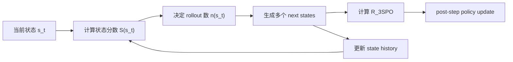

# 3SPO：把多轮 Agent 的 RL 更新从“整条轨迹之后”提前到“每一步之后”

## 元信息

| 字段 | 内容 |
| --- | --- |
| 论文 | 3SPO: State-Score-Supervised Policy Optimization for LLM Agents |
| 作者 | Yu Han, Kailing Li, Yang Jiao, Yulin Dai, Yuqian Fu, Linhai Zhuo, Tianwen Qian |
| 类型 | 论文，arXiv:2606.09961v1 |
| 日期 | 2026-06-08 14:26:05 UTC 提交 |
| 方向 | 大模型 Agent 后训练；多轮环境 RL；step-level credit assignment |
| 原文 | [https://arxiv.org/abs/2606.09961](https://arxiv.org/abs/2606.09961) |
| 代码 | [https://github.com/genalyu/3SPO](https://github.com/genalyu/3SPO) |

## TL;DR

- **这篇论文做什么**：3SPO 研究多轮 LLM Agent 的强化学习训练问题，核心矛盾是现有 GRPO/PPO/RLOO 常在完整 episode 结束后才用整条轨迹的结果更新策略，导致几十步任务里的中间动作很难获得准确 credit。
- **它怎么做**：论文提出 State-Score-Supervised Policy Optimization，用历史访问次数和成功次数给每个状态计算动态分数 `S(s_t)`，再把这个分数同时用于 step-wise reward、adaptive rollout allocation、post-step policy optimization。
- **关键机制**：低成功率但仍可学习的状态分数更高，已经掌握的状态分数下降，反复失败且成功率过低的状态被截断；因此训练预算会流向“还没学会但不是完全不可学”的状态。
- **实验设置**：作者在 ALFWorld 和 WebShop 上训练 Qwen2.5-1.5B/7B-Instruct，并和 GPT-4o、Gemini-2.5-Pro、ReAct、Reflexion、PPO、RLOO、GRPO、GiGPO、HGPO 对比。
- **关键数字**：摘要报告 3SPO 相比 GRPO 在 ALFWorld 上提升 `+22.6%`，在 WebShop 上提升 `+15.6` 个百分点；主表中 Qwen2.5-1.5B 的 3SPO 达到 ALFWorld In/Out `95.42/93.18`，WebShop score/success `91.37/79.46`。
- **效率证据**：3SPO 在相近资源下带来 `2.4x` 更多 unique states 和 `1.8x` 更快收敛；adaptive rollout 在 `2.0e5` rollouts 内超过 `90%` success，而 uniform rollout 约停在 `66%`。
- **消融结论**：去掉状态分数差分奖励 `Delta S(s_t)` 造成最大性能下降；去掉 novelty reward 或 ranked backtracking DFS 也明显退化；去掉 adaptive rollout 性能略升但成本变成 `7.3x`。
- **主要局限**：方法依赖 exact state matching 和离散 action space；在连续 GUI、开放网页和高维视觉状态里，需要状态哈希、聚类或语义等价判断，否则 `S(s_t)` 的统计会碎片化。

## 研究问题：为什么 trajectory-level RL 不适合长程 Agent？

### 问题不是“GRPO 不会优化”，而是“奖励粒度太粗”

- 在数学推理、代码生成等相对单轮任务中：
  - 一条 rollout 的成败通常可以直接对应最终答案；
  - 同一条响应内的 token 可以共享一个 outcome-level advantage；
  - group-normalized advantage 已经能提供足够强的训练信号。

- 在 ALFWorld 或 WebShop 这类多轮 Agent 环境中：
  - 一个 episode 可能有 30 到 50 步；
  - 早期一个错误动作会改变后续可达状态；
  - 终局失败并不说明每一步都错；
  - 终局成功也不说明每一步都值得强化。

- 因此，trajectory-level 方法会把“终局标签”粗暴摊到整条轨迹：
  - 好动作可能被失败 episode 惩罚；
  - 坏动作可能被成功 episode 奖励；
  - 重复点击、无效观察、绕路探索等中间行为难以区分。

### 论文重新定义的训练单位

| 训练视角 | 传统 GRPO/PPO/RLOO | 3SPO |
| --- | --- | --- |
| 更新时机 | 完整 trajectory 结束后 | 当前状态 rollout 后立即更新 |
| 信号来源 | episode-level return | 状态历史统计 + 转移 reward |
| 采样策略 | group size 通常固定 | `n(s_t)=ceil(G_max*S(s_t))` |
| 状态角色 | rollout 中的上下文 | 可复用、可统计、可排序的决策点 |
| 主要风险 | 延迟 credit、稀疏 reward | exact state matching 依赖强 |

## 论文主张与论证路线

| Claim | Mechanism | Evidence | Boundary |
| --- | --- | --- | --- |
| 多轮 Agent 需要 step-level credit assignment | 用 `S(s_t)-S(s_{t+1})` 评价状态转移是否从难到易 | 消融中去掉 `Delta S(s_t)`：ALFWorld 从 `95.42` 降到 `87.34`，WebShop score 从 `91.37` 降到 `82.43` | 只在可精确匹配文本状态的环境中验证 |
| 训练预算应投向 unresolved states | `S(s_t)` 高则分配更多 rollout，低则少采样或截断 | efficiency 表：3SPO 用 `4.5e5` rollouts 覆盖 `9,720` unique states，GRPO 用 `3.4e5` 覆盖 `4,020` | 去掉 adaptive rollout 后性能略高，但成本 `3.3e6` rollouts |
| post-step update 能加快收敛 | 每一步 rollout 后计算 group advantage 并更新策略 | ALFWorld 曲线中 3SPO 到 `60%` success 比 GRPO 快 `1.8x` | 没有在真实浏览器 Web Agent 或多模态 GUI 中验证 |
| 状态分数可兼顾探索与剪枝 | success rate 低则高分，多失败且低成功率则置零 | 阈值敏感性中 `xi=10,zeta=0.1` 最优；过紧/过松都退化 | 阈值是手工超参，迁移到新环境要重调 |
| 不需要额外 value model | 只用历史成功率、novelty、terminal reward | 方法节明确不引入 value function 或辅助模型 | 统计本身仍依赖大量环境交互和稳定状态表示 |

## 方法机制：3SPO 的三个核心部件


### 1. Dynamic State Score：把状态变成可排序的训练对象

论文把状态 `s_t` 视为当前环境 observation。以 ALFWorld 为例，它包含当前房间描述、可见物体列表、inventory 状态、当前任务进度和 admissible actions 约束。状态分数定义为：

```text
S(s_t) =
exp(-lambda(t) * N_success(s_t) / (N_total(s_t) + epsilon))
*
1{ N_fail(s_t) < xi OR success_rate(s_t) > zeta }
```

变量解释：

| 符号 | 含义 | 训练作用 |
| --- | --- | --- |
| `N_total(s_t)` | 历史经过该状态的完成轨迹数 | 判断状态是否已有足够统计 |
| `N_success(s_t)` | 从该状态出发最终成功的次数 | 估计当前 policy 是否掌握这个状态 |
| `N_fail(s_t)` | `N_total - N_success` | 识别长期失败状态 |
| `lambda(t)=alpha log t` | 随深度变化的退火系数 | 后期更强地区分状态 |
| `xi` | 失败次数阈值，默认 `10` | 多次失败后触发剪枝条件 |
| `zeta` | 最低成功率阈值，默认 `0.1` | 避免把完全不可学状态持续采样 |

这个公式的关键不是“低成功率永远高分”。若一个状态从未或很少成功，起初它会得到更多 rollout；如果反复失败且成功率低于 `zeta`，indicator 会把分数置零。若一个状态成功率逐渐升高，指数项下降，它被视为更接近 mastered，后续预算减少。

### 2. Step-Wise Reward：把稀疏终局奖励拆成三项

```text
R_3SPO(s_t, s_{t+1}) =
omega(N_total(s_t)) * R_novel(s_{t+1})
+ (0.5 - omega(N_total(s_t))) * (S(s_t) - S(s_{t+1}))
+ 0.5 * R_success(s_{t+1})
```

| 奖励项 | 直觉 | 为什么必要 |
| --- | --- | --- |
| `R_novel` | 鼓励进入未见过的新状态 | 防止 Agent 原地重复、无效点击或循环观察 |
| `S(s_t)-S(s_{t+1})` | 奖励从高难状态走向低难状态 | 给中间动作 credit，而不是等 episode 结束 |
| `R_success` | 终局任务完成信号 | 保留最终目标，不让探索偏离任务 |

权重 `omega(N)=0.5*exp(-gamma*N)` 表达训练节奏：早期状态访问少，novelty 更重要；后期状态访问多，状态分数差分更重要。也就是说，它先鼓励扩大状态覆盖，再鼓励稳定走向更容易成功的后继状态。

### 3. Adaptive Rollout + Post-Step Policy Optimization


状态分数还决定 rollout 数：

```text
n(s_t) = ceil(G_max * S(s_t))
```

| `n(s_t)` | 行为 |
| --- | --- |
| `0` | 该状态被截断，不再浪费 rollout |
| `1` | 继续向后走，但不做 group policy update |
| `>1` | 从当前状态生成多个 rollout，计算 step reward，做 post-step update |

更新目标仍保留 PPO/GRPO 风格的 clipped ratio 与 KL 项。关键差异是 advantage 不再等整条 trajectory 完成后统一分配，而是用当前状态的多分支 rollout 形成局部 group。

## 算法流程：从当前状态出发的小批量分叉

```text
Input:
  policy pi_theta
  task set D
  max rollout per state G_max
  max episode length T_max

State:
  N_total(s), N_success(s)
  state score S(s)
  frontier stack for backtracking

For each epoch:
  For each task x in D:
    observe initial state s_0
    initialize frontier = []

    While not terminal:
      update N_total(s_cur), N_success(s_cur)
      compute S(s_cur)
      n = ceil(G_max * S(s_cur))
      generate n rollouts from s_cur
      compute R_3SPO for each next state
      rank rollouts by R_3SPO
      update theta with post-step objective
      move to best next state or backtrack from frontier

Output:
  optimized policy pi_theta*
```

这个流程的研究意义在于：它没有把 Agent 训练看成“生成完整答案后再打分”，而是把每个状态都变成一个可复访、可统计、可分配预算的节点，并用 ranked backtracking DFS 保留分叉。

## 理论部分：per-state bandit 抽象证明了什么？

论文把每个决策状态抽象成 finite-arm bandit：

- 每个 action `a` 是一个 arm；
- 每个 action 有未知成功概率 `p*(a)`；
- action 后的 `s_{t+1}` 与该 action 一一对应；
- 状态分数写成 `S(a)=exp(-lambda(t)*p_hat(a))`；
- `a_w` 是最低成功率，也就是最高 unresolved score 的 action。

| 结论 | 含义 |
| --- | --- |
| empirical estimate concentration | 历史成功率会以高概率收敛到真实成功率 |
| score separation | 当样本足够多，不同成功率 action 的分数能被分开 |
| non-worst action allocation | 非 unresolved action 获得的 rollout 比例按 `t^{-alpha*Delta/2}` 衰减 |
| allocation regret | 相对 oracle unresolved-state sampler 的预算浪费是 `O(log I)` |

这个理论结果证明的是 allocation mechanism 的统计性质，不直接证明深度网络 policy optimization 全局收敛。它依赖 finite action、可统计状态和成功概率稳定；在开放网页或视觉 GUI 中，状态等价关系会复杂得多。

## 实验设置：ALFWorld 和 WebShop 分别测什么？

| Benchmark | 数据/任务 | 评价指标 | 为什么适合 3SPO |
| --- | --- | --- | --- |
| ALFWorld | TextWorld 风格 ALFRED 子集；3,553 train，274 validation | in/out success | 长程 household planning，有明确 admissible actions 和文本状态 |
| WebShop | 12,087 条购物指令；评估前 500 条 | task score / task success | 网页式筛选、点击、购买，多步且有延迟成败 |

| 项 | 值 |
| --- | --- |
| Base models | Qwen2.5-1.5B-Instruct；Qwen2.5-7B-Instruct |
| Group size | `8` |
| `G_max` | `8` |
| Learning rate | `1e-6` |
| KL coefficient | `0.01` |
| ALFWorld max steps | `50` |
| WebShop max steps | `30` |
| Total epochs | `400` |
| Compute | 主实验约 `60 GPU-days`，预实验约 `30 GPU-days` |

代码 README 也显示框架基于 `verl`，rollout engine 支持 `vLLM` 和 `SGLang`，ALFWorld 1.5B 脚本使用 2 GPUs，7B 脚本使用 8 GPUs，并提供 MIG/SLURM 环境说明。

## 主结果：3SPO 到底强在哪里？

| Model | Method | ALFWorld In | ALFWorld Out | WebShop Score | WebShop Success |
| --- | --- | ---: | ---: | ---: | ---: |
| Qwen2.5-1.5B | GRPO | 72.8 | 70.1 | 75.8 | 56.8 |
| Qwen2.5-1.5B | GiGPO | 90.16 | 84.76 | 84.95 | 66.53 |
| Qwen2.5-1.5B | HGPO | 92.77 | 90.16 | 85.56 | 71.54 |
| Qwen2.5-1.5B | **3SPO** | **95.42** | **93.18** | **91.37** | **79.46** |
| Qwen2.5-7B | GRPO | 78.64 | 76.82 | 79.3 | 66.1 |
| Qwen2.5-7B | HGPO | 95.44 | 92.05 | 88.96 | 78.51 |
| Qwen2.5-7B | **3SPO** | **96.81** | **95.93** | **90.28** | **80.45** |

### 读表时应注意三层比较

1. **相对 prompting baseline**
   - Qwen2.5、ReAct、Reflexion 在两个环境上明显落后；
   - 这说明参数更新对长程 Agent 任务仍然关键；
   - 单靠 prompt self-reflection 不足以稳定解决 sparse reward。

2. **相对 trajectory-level RL**
   - PPO/RLOO/GRPO 明显弱于 GiGPO/HGPO/3SPO；
   - 这支持论文的核心问题设定：多轮 Agent 需要 step-level signal；
   - GRPO 在 Qwen2.5-1.5B 上比 prompting 好，但无法接近 90% 以上 ALFWorld。

3. **相对 step-level RL**
   - 3SPO 继续超过 GiGPO/HGPO；
   - 差异不只是“有 step-level credit”，而是“每一步后立即更新 + adaptive rollout + 状态分数监督”；
   - 1.5B 的收益更大，说明小模型更依赖细粒度纠偏。

## 训练曲线与状态分数：图 3 说明了什么？


论文对 ALFWorld 的训练动态给出四类证据：

- 3SPO 达到 `60%` success 的速度比 GRPO 快 `1.8x`，比 HGPO/GiGPO 快 `1.3x`。
- mean state score 初期约 70 epochs 保持高位，随后从约 `0.92` 下降到约 `0.35`，表示训练先发现大量新状态，再逐步掌握其中一部分。
- easy/medium/hard task 的 score 分布不同：容易任务快速降到低分，中等任务下降更慢，困难任务长期保持高分。
- adaptive 3SPO 在 `1.0e5` rollouts 内超过 `80%`，在 `2.0e5` rollouts 内超过 `90%`；uniform rollout 同期约 `66%` 且仍未收敛。

## 消融实验：哪些部件真正有用？

| Ablation | ALFWorld In | ALFWorld Out | WebShop Score | WebShop Success | 解释 |
| --- | ---: | ---: | ---: | ---: | --- |
| 3SPO | 95.42 | 93.18 | 91.37 | 79.46 | 完整方法 |
| w/o `R_novel` | 88.42 | 85.70 | 85.12 | 72.06 | 去掉新状态奖励，容易陷入重复或局部路径 |
| w/o `Delta S(s_t)` | 87.34 | 83.58 | 82.43 | 72.46 | 去掉状态分数差分，credit assignment 受损最大 |
| w/o adaptive `omega(N)` | 92.94 | 91.02 | 90.20 | 77.82 | 固定探索/利用权重，性能小幅下降 |
| w/o adaptive `n(s_t)` | 95.88 | 93.42 | 91.56 | 79.82 | 性能略高但成本极高 |
| w/o backtrack | 88.98 | 87.00 | 85.32 | 74.18 | 没有回溯，容易锁死在早期分支 |

### 最值得注意的是 adaptive rollout 的反直觉结果

- 去掉 adaptive `n(s_t)` 后：
  - ALFWorld 与 WebShop 指标略高；
  - 但 rollouts 从 `4.5e5` 增至 `3.3e6`；
  - 成本约 `7.3x`；
  - unique state ratio 从 `2.2e-2` 降至 `3.1e-3`。

- 这说明 adaptive rollout 的价值不是单纯提高最终分数：
  - 它把预算集中到高价值状态；
  - 它提高 state exploration density；
  - 它让相近资源下的训练更有效率。

## 计算效率：状态覆盖比最终分数更能解释 3SPO

| Method | Rollouts | Unique States | Unique/Rollout Ratio |
| --- | ---: | ---: | ---: |
| GRPO | `3.4e5` | 4,020 | `1.2e-2` |
| HGPO | `3.4e5` | 3,890 | `1.1e-2` |
| GiGPO | `3.4e5` | 4,150 | `1.2e-2` |
| **3SPO** | `4.5e5` | **9,720** | **`2.2e-2`** |
| w/o adaptive `n` | `3.3e6` | 10,284 | `3.1e-3` |


图中的 high-score ratio 表示训练中高分 unresolved states 的比例。3SPO 早期约 `75%`，GRPO/GiGPO/HGPO 多在 `55%-60%`。这不是“3SPO 更失败”，而是它主动把采样压到未解决状态；高分状态比例维持较高，说明 rollout budget 没被平均撒到已掌握状态上。

## Figure/Table 证据逐项解读

### Figure 1：为什么“更新时机”是第一层差异？

Figure 1 把 GRPO、GiGPO 和 3SPO 放在同一个时间轴上。

- **GRPO 的问题**
  - 它从同一状态或同一任务生成一组完整轨迹；
  - 所有轨迹走到 terminal 或 max step 后才计算相对优势；
  - 中间状态 `s_2,s_3,s_4...` 的价值被整条轨迹结果遮蔽。

- **GiGPO 的改进**
  - 它引入状态级 grouping；
  - 相同 anchor state 的分支可以做更细的比较；
  - 但策略更新仍主要发生在轨迹完成之后。

- **3SPO 的进一步变化**
  - 它在 `s_1` 的下一步分叉后就能更新；
  - `s_2/s_3/s_4` 可以立刻作为 group 内候选；
  - 成功/失败会写回 state history，影响下次访问同一状态时的分数。

这张图支撑的 claim 是：多轮 Agent 的训练瓶颈不只是 reward 稀疏，还包括“什么时候把 reward 转成梯度”。它不能证明所有环境都能稳定做 post-step update，也不能证明真实浏览器 DOM、图像输入或并发后端状态中仍然直接成立。

### Figure 2：为什么一个状态分数可以同时管三件事？



这个闭环的设计巧思在于：

- `S(s_t)` 不是只做 sampling priority；
- 它还进入 reward；
- 它还决定当前状态是否值得产生多个 rollout；
- 它还通过 history update 被下一轮访问修正。

如果状态成功率提高，分数下降、rollout 数下降、差分奖励变小，训练自然少花预算。如果状态仍高分，rollout 数增加，分叉更充分，ranked backtracking 能保存更多 alternative branches。

### Table 1：主结果里最有信息量的是“小模型收益更大”

Qwen2.5-1.5B 的提升尤其值得看。

- 在 ALFWorld：
  - GRPO In-Success `72.8`；
  - 3SPO In-Success `95.42`；
  - 差距约 `22.62` 个点。

- 在 WebShop：
  - GRPO Task Success `56.8`；
  - 3SPO Task Success `79.46`；
  - 差距约 `22.66` 个点。

这说明 3SPO 对小模型的作用不是微调末端指标。小模型更容易产生冗余、绕路、重复动作；trajectory-level advantage 会把这些噪声混进整条路径；state score 可以在局部状态处把“有用探索”和“无效重复”拆开。

## 失败案例与反例边界

### 状态分数差分为什么可能误导？

`S(s_t)-S(s_{t+1})` 默认把“从高分状态走向低分状态”视为好转移。在 ALFWorld 中通常合理，因为高分状态表示尚未掌握，低分后继可能表示更接近已掌握路径，terminal success 最终会校准这个方向。

但在更开放环境里，可能出现反例：

- Agent 从复杂但关键的状态跳到简单但无关的页面；
- 状态文本变短导致哈希命中旧状态；
- 后继状态低分只是因为历史上常见，不代表当前任务正确；
- 某个危险动作进入“稳定成功”状态，但实际违反权限或安全约束。

这意味着 state score 应与 task relevance 一起建模。安全关键任务还需要 action risk；真实 Web Agent 可能需要把 URL、DOM、后端审计日志、权限主体一起纳入状态定义。

### Ranked backtracking 为什么不能替代规划？

3SPO 的 backtracking DFS 保存 alternative branches。它能减少早期错误路径锁死，也能提高 state coverage。但它不是完整规划器。

- 分支排序依赖当前 `R_3SPO`；
- 若 reward 对任务目标理解错，排序也会错；
- 若状态空间爆炸，frontier 仍可能快速增长；
- 若环境有 irreversible actions，回溯不一定能恢复真实后端状态。

因此，把 3SPO 用到真实云控制台或生产后台时，需要 sandbox、reversible preview、dry-run API、backend reset、action audit 和 hard permission gate。

## Detail Inventory：本轮可提取的论文细节

| 维度 | 细节 |
| --- | --- |
| 方法名 | State-Score-Supervised Policy Optimization，简称 3SPO |
| 核心输入 | 当前环境 observation `s_t`、动作 `a_t`、历史成功/失败统计 |
| 核心状态 | `N_total(s)`, `N_success(s)`, `N_fail(s)`, `S(s)` |
| 核心输出 | 经过 step-wise reward 与 post-step update 优化的 policy |
| 训练环境 | ALFWorld、WebShop |
| Base model | Qwen2.5-1.5B-Instruct、Qwen2.5-7B-Instruct |
| Baseline | GPT-4o、Gemini-2.5-Pro、ReAct、Reflexion、PPO、RLOO、GRPO、GiGPO、HGPO |
| 关键超参 | `alpha=50`, `xi=10`, `zeta=0.1`, `omega_k=0.1`, `G_max=8` |
| 主要指标 | success rate、task score、unique states、rollout ratio、convergence speed |
| 理论工具 | per-state bandit、Hoeffding concentration、score separation、allocation regret |
| 主要局限 | exact state matching、discrete action space、复现算力高、真实安全边界未覆盖 |

## 超参敏感性：为什么默认阈值是 `xi=10,zeta=0.1,alpha=50`？

| 设置 | 结果 | 解释 |
| --- | --- | --- |
| `xi=5,zeta=0.05` | success `90.1` | 太严格，过早把有学习潜力的状态判为不可学 |
| `xi=10,zeta=0.1` | success `95.4` | 默认最优，失败剪枝与学习潜力平衡较好 |
| `xi=20,zeta=0.2` | success `93.3` | 更宽松，部分难状态保留过久 |
| `xi=50,zeta=0.3` | success `92.1` | 太宽松，预算浪费在低回报状态 |

`alpha` 控制 `lambda(t)=alpha log t`：

| `alpha` | In-Success | Out-Success | 解释 |
| ---: | ---: | ---: | --- |
| 35 | 93.0 | 86.9 | 分数区分度弱，接近均匀分配 |
| 50 | 95.4 | 93.2 | 默认最优 |
| 70 | 91.8 | 86.3 | 分配过激，部分可学 action 被饿死 |

## 与近期 Agent 后训练工作的关系

### 与 on-policy distillation 的关系

本周已有一些候选围绕 OPD、tokenizer barrier、warm-start entropy regime 展开。3SPO 的关注点不同：

- OPD 更关心从 teacher 或强策略中蒸馏行为分布；
- warm-start 研究更关心 SFT/OPD 如何影响后续 RL 的 entropy；
- 3SPO 直接研究 RL 过程中 step-level credit 和 rollout allocation。

它们可以组合，而不是互斥。OPD 可以提供初始 policy，3SPO 可以在环境交互中继续优化，state score 可以告诉系统哪些状态仍需 on-policy 探索，entropy regime 可以解释为什么某些 warm-start 会让 adaptive rollout 过早收缩。

### 与真实环境 Web Agent 训练的关系

AliyunConsoleAgent 证明真实云控制台任务可以结合 SFT、GRPO 和后端审计日志。3SPO 提供另一个方向：不只给终局 outcome reward，还给中间状态转移 reward；不只依赖 LLM judge 或后端规则，还利用交互历史里的成功率统计。

若把两者合并，可能形成如下训练信号：

| 信号来源 | 作用 |
| --- | --- |
| 前端 observation state | 定义 `S(s_t)` 与局部分叉 |
| 后端审计日志 | 校准真实资源是否创建、修改、删除 |
| 文档步骤 | 约束目标路径 |
| human approval | 过滤高风险动作 |
| state score | 决定哪些状态值得继续 rollout |

这类组合会比单纯 outcome reward 更接近真实 Agent 生产训练。

## 相关工作位置：3SPO 与 GiGPO/HGPO 的差别

| 方法 | 解决的问题 | 与 3SPO 的关系 |
| --- | --- | --- |
| ReAct | prompt 中交错 reasoning 与 action | 不更新参数，靠 prompt 组织行为 |
| Reflexion | 用自反馈改进后续尝试 | 仍主要是 inference-time 修正 |
| GRPO | group rollout 中做相对 advantage | 多用于 trajectory-level 或单轮任务 |
| GiGPO | anchor state grouping 做 step-level advantage | 仍偏 post-trajectory；3SPO 提前到 post-step |
| HGPO | 层级/step credit 更细 | 3SPO 加入状态分数、adaptive rollout 和回溯 |
| STEP | 用状态成功率指导 resampling | 3SPO 把状态分数统一用于 reward、rollout 和更新 |

论文的真正定位不是“又一个 GRPO 变体”，而是把 multi-turn agent training 的核心对象从 trajectory 改成 state，把状态历史统计变成训练时可用的监督信号，并把 rollout budget、reward construction、policy update 三者用同一个 `S(s_t)` 绑起来。

## 可复现性与工程边界

### 代码层面可确认的信息

项目 README 给出：

- `examples/3spo_trainer/run_alfworld_1.5B.sh`；
- `examples/3spo_trainer/run_alfworld_7B.sh`；
- `examples/3spo_trainer/run_alfworld_grpo.sh`；
- `examples/data_preprocess.prepare`；
- `vLLM` / `SGLang` rollout engine 入口；
- `model_merger.py` 用于合并 LoRA checkpoint；
- MIG/SLURM 下的 GPU UUID、`CUDA_VISIBLE_DEVICES` 和 NCCL 设置说明。

训练脚本里的关键设置和论文附录一致：

- `spo3_alpha=50`；
- `spo3_xi=10`；
- `spo3_zeta=0.1`；
- `spo3_omega_k=0.1`；
- `group_size=8`；
- `learning_rate=1e-6`；
- `max_steps=50`；
- `trainer.total_epochs=400`。

### 仍然不完整的复现点

- README 当前把 arXiv badge 写成 `XXXX.XXXXX`，说明仓库文档还未完全同步论文编号。
- GitHub API 目录读取本轮遇到 403，因此没有系统遍历所有文件。
- 论文报告主实验总计约 `60 GPU-days`，再加约 `30 GPU-days` 预实验；这对普通复现者仍是高门槛。
- WebShop 和 ALFWorld 的环境状态较规整；开放浏览器、真实 SaaS 后台、移动端 UI 等场景会引入更复杂的状态等价问题。

## 局限：3SPO 最容易在哪些地方失效？

### 1. Exact state matching 可能碎片化

论文明确承认 `S(s_t)` 依赖识别“同一个状态”。文本环境可以用完整 observation 近似，连续或高维状态需要 approximate hashing 或 embedding clustering。

风险包括：

- 语义相同但字符串不同的状态被拆开统计；
- 字符串相似但实际约束不同的状态被错误合并；
- 状态 hash 被无关噪声污染；
- 训练后期出现新 UI 或新 inventory 字段时，历史统计失效。

### 2. 离散 action space 假设限制迁移

当前形式假设每个状态有离散 admissible actions。ALFWorld 符合这个假设，WebShop 也有较明确的 action schema。真实 GUI 中的点击坐标、拖拽、滚动、文件操作更接近混合动作空间。

若要扩展，需要重新定义：

- action grouping；
- state transition equivalence；
- failed action penalty；
- rollout branch ranking；
- irreversible action 的回滚机制。

### 3. State score 不是安全边界

3SPO 让训练更高效，但不直接解决工具调用权限、prompt injection、数据外泄、irreversible action、sandbox escape。在真实 Agent 系统中，它应与权限控制、effect preview、审计日志和 human approval 配合，而不是替代安全层。

## 领域延伸：这篇论文对 Agent 后训练意味着什么？

### 从“结果监督”走向“状态监督”

过去很多 LLM RL 工作把 reward 绑定到最终答案：数学题是否正确、代码是否通过测试、用户偏好是否选择该回答。3SPO 的贡献在于提示我们：

- 对 Agent 而言，状态本身就是训练资产；
- 状态访问历史能变成 credit assignment 信号；
- 训练系统应显式记录状态、转移、成功率、失败率和可学习性；
- replay buffer 可能需要从 trajectory buffer 升级为 state-transition memory。

### 对真实 Web Agent 的下一步问题

如果把 3SPO 放到真实浏览器或企业后台，需要继续回答：

1. **状态怎么归一化？**
   - URL、DOM、可见文本、表单状态、权限上下文、后端资源是否都算状态？
   - 哪些字段应进入 exact matching，哪些应进入语义聚类？

2. **失败怎么分类？**
   - 是 policy 错了？
   - 是环境非确定性？
   - 是权限不足？
   - 是任务本身不可完成？

3. **安全动作怎么采样？**
   - high-score unresolved state 可能也是高风险状态；
   - adaptive rollout 不应直接放大删除、支付、发信等 irreversible actions；
   - 需要把 action risk 与 state score 联合建模。

4. **能否把审计日志变成 state score 的一部分？**
   - AliyunConsoleAgent 用云审计日志做 outcome reward；
   - 3SPO 用状态历史做 step reward；
   - 二者结合后，可以形成“前端状态 + 后端事实”的更强 Agent 训练信号。

### 工程落地时应额外记录什么？

如果把 3SPO 从论文环境迁移到真实 Agent 训练系统，最先要补的不是更复杂的 reward，而是更可靠的日志结构。

| 日志字段 | 为什么重要 |
| --- | --- |
| `state_fingerprint` | 保证同一状态可复访、可聚合、可回放 |
| `state_semantic_key` | 处理文本不同但语义等价的页面或任务状态 |
| `action_schema` | 区分普通点击、表单填写、API 调用、文件写入等动作类型 |
| `effect_preview` | 在不可逆动作前记录预期外部副作用 |
| `backend_audit_id` | 把前端观察与真实后端资源变化对齐 |
| `failure_class` | 区分模型错误、环境错误、权限错误、任务不可完成 |
| `risk_level` | 防止 high-score 状态诱导系统反复采样高风险动作 |

这张表背后的判断是：

- 3SPO 的 state score 只有在状态记录可信时才有意义；
- 如果状态定义漂移，`N_success/N_total` 会变成噪声；
- 如果失败类型混在一起，算法会把“不可学”与“尚未学会”混淆；
- 如果没有风险字段，adaptive rollout 可能把训练预算集中到危险状态。

因此，真实系统里的 3SPO 更像一个训练调度层。

- 它负责回答“哪里值得继续探索”；
- 它不负责回答“哪些动作被允许执行”；
- 它也不负责回答“外部世界是否可逆恢复”；
- 这些问题仍需要权限系统、沙箱、审计日志和任务级 policy。

## 结论

- 3SPO 的核心不是一个孤立公式，而是一套多轮 Agent 训练观：
  - 状态可统计；
  - 状态可排序；
  - 状态可分配预算；
  - 状态转移可给 step-level credit。

- 它在 ALFWorld/WebShop 上给出了强结果：
  - 1.5B 模型的提升尤其明显；
  - 相比 GRPO 的收益足够大；
  - 相比 HGPO/GiGPO 仍有稳定增益。

- 它的边界也很清楚：
  - exact state matching；
  - discrete actions；
  - 高算力复现成本；
  - 安全机制缺位。

- 对研究者来说，最值得带走的问题是：
  - **Agent 后训练是否应该把 replay buffer 从 trajectory buffer 升级为 state-transition memory？**
  - 如果答案是肯定的，3SPO 提供了一个非常清晰的起点。

## 参考链接

- [3SPO arXiv abstract](https://arxiv.org/abs/2606.09961)
- [3SPO arXiv PDF](https://arxiv.org/pdf/2606.09961)
- [3SPO GitHub repository](https://github.com/genalyu/3SPO)
- [ALFWorld](https://arxiv.org/abs/2010.03768)
- [WebShop](https://arxiv.org/abs/2207.01206)
- [GRPO / DeepSeekMath](https://arxiv.org/abs/2402.03300)
