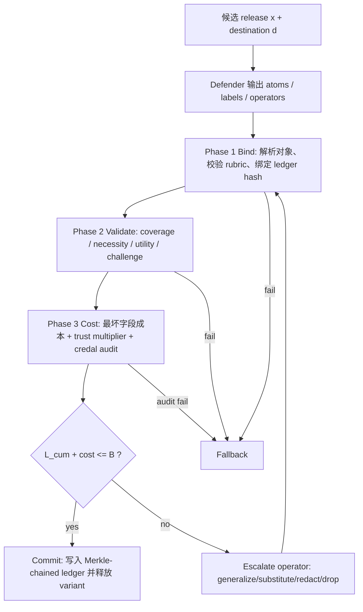

# OCELOT：把 LLM Agent 隐私从“单次过滤”改成“跨轨迹泄露预算”

### 元信息

| 字段 | 内容 |
|---|---|
| 论文 | OCELOT: Inference-Leakage Budgets for Privacy-Preserving LLM Agents |
| 作者 | Jin Xie, Songze Li |
| 日期 | 2026-06-10 |
| 类型 | AI 安全 / LLM Agent 隐私 |
| 原文 | [arXiv:2606.12341](https://arxiv.org/abs/2606.12341) |

### TL;DR

- 这篇论文讨论的不是“模型会不会记住隐私”，而是 **LLM Agent 在连续行动中会不会把用户隐私逐步泄露给多个外部 sink**。
- 作者指出 Agent 隐私有三类传统过滤器很难处理的问题：
  - **累计泄露**：每一次披露看起来都没问题，但多次组合后能反推出秘密。
  - **双向泄露**：外部工具返回的内容也能注入指令，诱导后续步骤泄露更多。
  - **任务依赖**：同一个字段对航空公司可能必要，对搜索代理或日志系统则不必要。
- OCELOT 的核心机制是 **Witness-Verified Declassification, WVD**：
  - 一个本地微调的 LLM defender 只负责标注候选释放内容中的隐私 atom，并提出降级释放方案。
  - 一个确定性 verifier 重新检查标签、计算最坏字段成本、审计后验泄露、写入 Merkle 链式 ledger。
  - defender 可以被越狱，但 verifier 把未验证或错误标注的 atom 当作最高风险处理，所以失败路径是 fallback，而不是静默泄露。
- 实验覆盖 5 个 benchmark：
  - OCELOT-Traj-500、AgentDojo、AgentDAM-Bench、AgentLeak-2026、ConfAIde。
  - 主表显示 OCELOT 在全部 benchmark 上同时取得最低累计 min-entropy 泄露和最高任务成功率。
  - 例如 OCELOT-Traj-500 上泄露为 **0.31 bits**、任务成功率 **91.3%**；CaMeL 泄露接近但成功率只有 **62.3%**。
- 关键数字：
  - 22,585 个 authorized trajectory-instances 中预算超限为 **0.0%**。
  - OCELOT 在攻击表中 injection success **3.8%**、累计推断 top-1 recovery **4.2%**、4 个串谋 sink 下 top-1 recovery **6.8%**。
  - 校准覆盖率在 calibration pool 为 **96.6%**，在更强 stress pool 降到 **92.1%**；加 margin 和 credal audit 后 stress coverage 升到 **95.3%**。
- 局限同样重要：
  - Layer 1a 的预算不超限是确定性 ledger 保证。
  - Layer 2 的语义隐私仍是校准相对的经验声明，不能对任意背景知识、任意强攻击者做数学完备保证。

### 研究问题：为什么 Agent 隐私不能按“单条输出”处理？

- 传统 LLM 隐私问题常问：
  - 模型是否记住训练数据。
  - 单次回答是否包含敏感字段。
  - prompt injection 是否让模型吐出秘密。

- Agent 场景改变了问题对象：
  - Agent 会读本地文件。
  - Agent 会调用远程工具。
  - Agent 会写入 memory。
  - Agent 会把不同字段发给不同外部服务。
  - Agent 会在后续步骤复用前面的观察和记忆。

- 作者用订机票作为例子：
  - 用户的姓名、出生日期、支付 token 都在本地环境里。
  - 航空公司确实需要姓名和出生日期。
  - 机票搜索 broker 不需要出生日期。
  - 支付处理器需要 payment token，但日志、搜索服务、任意第三方 MCP server 不该看到它。

- 因此，隐私问题变成一个轨迹级问题：
  - 不是“这一条消息能不能发”。
  - 而是“在当前任务、当前 sink、历史已释放内容、剩余预算下，最少泄露但仍可完成任务的变体是什么”。

### 三个失败模式

| 编号 | 问题 | 论文中的含义 | 为什么单次过滤不够 |
|---|---|---|---|
| P1 | 累计泄露 | 多个看似无害字段组合后能反推 secret | 单条消息检查不到跨步骤组合 |
| P2 | 双向泄露 | 外部 observe 内容可注入指令，影响后续 act | 只查 outbound 不够，inbound 也要去权威化 |
| P3 | 任务依赖 | 同一字段对不同 sink 的必要性不同 | 静态 allow/deny 无法表达粒度 |

### OCELOT 的核心主张

- 作者把 Agent 隐私重新定义为 **posterior-risk control**：
  - 控制攻击者看到轨迹后，对 protected secret 的后验信念最多能提高多少。
  - 不再只判断输出中有没有 PII 字符串。

- 这个定义把“隐私损失”写成 min-entropy advantage：

```text
L_inst(op(x)) = log2( max_s P_hat(S=s | op(x)) / max_s P(S=s) )
```

- 变量解释：
  - `S`：用户的 protected secret，例如 DOB、payment token、diagnosis。
  - `P(S)`：任务开始前攻击者对 secret 的先验。
  - `P_hat(S | op(x))`：攻击者看到某个降级释放结果后的后验估计。
  - `op(x)`：对候选内容 `x` 应用某个 declassification operator 后的可见内容。
  - 结果单位是 bits；0 表示攻击者没有比先验获得更多优势。

### 两层安全目标

| 层级 | 论文承诺 | 依赖什么 | 该如何理解 |
|---|---|---|---|
| Layer 1a | ledger 记录的累计 cost 不超过预算 B | verifier 和 ledger 算术 | 确定性保证，不依赖 LLM 是否诚实 |
| Layer 1b | 已授权 release 的模型相对泄露不超过 cost | 校准模型和残余逃逸率 δ | 经验保证，需要测量 |
| Layer 2 | 真实攻击者的语义隐私也被 B 限制 | 校准 cost 能 upper-bound 真实推断 | 作者明确不做绝对证明，只报告覆盖率 |

- 最核心的不等式是：

```text
Σ_i cost_i <= B
```

- 这只说明 **账本上的 certified cost 不超限**。
- 它不自动说明真实世界任何攻击者都推不出 secret。
- 论文的严谨点在于：
  - 把确定性保证和经验性隐私保证分开。
  - 不把校准模型下的结论包装成绝对安全。

### 系统设定：谁可信，谁不可信？

| 组件 | 信任假设 | OCELOT 的处理方式 |
|---|---|---|
| 用户 | 可信任务发起者 | 提供 task 和本地 secret |
| 本地 harness | 可信执行环境 | 拦截所有跨边界 flow |
| 远程 LLM | task-aligned 但不可信 | 只能提出，不负责授权 |
| 外部 sink | 按 REQUIRED / SEMI / ADVERSARIAL 加权 | 不可验证 sink 默认 adversarial |
| defender LLM | honest-but-jailbreakable | 只当 witness，不当裁判 |
| verifier | 可信确定性裁判 | 决定授权、成本、ledger commit |

### WVD：Witness-Verified Declassification

- WVD 的设计可以理解为一句话：
  - **让 LLM 做语义标注，但不让 LLM 决定安全性。**

- defender 的输出是证据对象，不是授权结论：
  - atom 集合 `A`。
  - 每个 atom 的 field label。
  - 直接 / 隐含 / 可推断关系。
  - 对当前 destination 的 necessity。
  - 建议使用哪个降级 operator。

- verifier 做确定性检查：
  - rubric 是否签名且匹配。
  - coverage obligation 是否覆盖所有应标字段。
  - operator 是否满足 necessity 和 trust class。
  - cost 是否按最坏字段集合计算。
  - ledger 累计是否仍在 budget 内。

### 五个 declassification operators

| Operator | 作用 | 泄露粒度 |
|---|---|---|
| IDENTITY | 原样释放 | 最大 |
| GENERALIZE | 替换成更粗粒度值 | 中等 |
| SUBSTITUTE | 用 rubric 模板和非 secret 字段生成替代文本 | 较低 |
| REDACT | 替换为 `[REDACTED]` | 很低 |
| DROP | 删除 atom | 最低 |

- 论文特意不加入 paraphrase：
  - 如果 paraphrase 保留任务语义，泄露可能仍然保留。
  - 如果不保留任务语义，任务又失败。

### 四阶段 verifier 流程



### Phase 1：Bind

- Bind 负责确认：
  - defender 产出的对象符合 typed schema。
  - rubric 是注册且签名验证过的版本。
  - 当前对象绑定到 ledger 的 `prev_hash`。
  - `σ(x)` 的 hash 与 proposal 中声明的 variant 一致。

- 这个阶段的意义：
  - defender 不能伪造 rubric。
  - defender 不能伪造 ledger 状态。
  - defender 不能把“看起来低风险的 proposal”指向另一个实际 release。

### Phase 2：Validate

- Validate 检查五件事：
  - coverage：rubric 触发的敏感字段必须对应到 atom。
  - necessity：字段对 destination 的必要性要符合规则。
  - operator coverage：不必要 direct secret 不能裸发。
  - challenge consistency：第二轮挑战回答必须和第一轮 label 一致。
  - utility preservation：必要字段被过度删除时任务不能算通过。

- 论文把 rubric clause 编译到 QF_UFLRA，用 Z3 类 SMT 求解器检查。
- 这不是为了追求形式化炫技，而是为了让“安全判定”离开自然语言解释。

### Phase 3：Cost

- verifier 对每个 operator 的成本取最坏字段：

```text
c_i = max_{f in F_V(a_i) ∪ F_D(a_i)} C(o_i, f)
```

- 变量解释：
  - `F_V(a_i)`：verifier 侧根据结构和 rubric 得到的可能字段集合。
  - `F_D(a_i)`：defender 声称的字段。
  - `C(o_i, f)`：operator 对 field 的校准 min-entropy cost。

- 这条规则解决一个关键攻击：
  - 如果 defender 把 DOB 错标成 EMAIL，不能因此降低成本。
  - verifier 会在可能字段和 defender 字段的并集上取最大 cost。

- release 总成本再乘以 trust multiplier：

```text
cost = μ(z) * Σ_i c_i
```

- `μ(z)` 是政策风险权重：
  - REQUIRED-SERVICE 可以较低。
  - SEMI-TRUSTED 更高。
  - ADVERSARIAL 最高。

### Phase 4：Commit

- Commit 只做一件硬事：
  - 如果 `L_cum + cost <= B`，允许释放并写 ledger。
  - 否则沿 operator fallback 顺序降级。

- fallback 顺序：

```text
IDENTITY -> GENERALIZE -> SUBSTITUTE -> REDACT -> DROP
```

- 如果降级后 utility predicate 不成立：
  - 释放被拒绝。
  - 或转入 user channel，让用户显式确认。

### 为什么 defender 越狱不等于静默泄露？

- defender 被设定为 honest-but-jailbreakable。
- OCELOT 不要求它绝对可靠。
- 关键 backstop 是：
  - 未标注 atom 会被加入 conservative default。
  - malformed label 会被当作 top-risk。
  - top-risk atom 只允许 DROP 或 REDACT，除非可信 rubric 证明必要。

- 这和很多 prompt-based 防线不同：
  - prompt-based 防线把模型回答当作边界。
  - OCELOT 把模型回答当作需要审计的证据。

### 主实验：五个 benchmark 的 privacy-utility frontier

| 系统 | OCELOT-Traj L / U | AgentDojo L / U | AgentLeak L / U | ConfAIde L / U | Bud.Exc |
|---|---:|---:|---:|---:|---:|
| OCELOT | 0.31 / 91.3 | 0.44 / 88.7 | 0.49 / 89.1 | 0.27 / 92.6 | 0.0 |
| FlexGuard | 2.13 / 87.4 | 3.42 / 74.6 | 5.21 / 78.3 | 0.81 / 90.2 | 41.3 |
| PrivacyChecker | 1.97 / 86.1 | 3.18 / 72.9 | 4.83 / 76.8 | 0.72 / 89.4 | 37.9 |
| AGENTDAM | 2.84 / 89.8 | 4.27 / 79.2 | 6.14 / 81.4 | 1.94 / 91.7 | 52.6 |
| CaMeL | 0.52 / 62.3 | 0.71 / 51.7 | 0.83 / 48.6 | 0.43 / 67.4 | 0.0 |
| RTBAS | 1.18 / 80.5 | 1.74 / 70.1 | 2.31 / 72.4 | 0.89 / 83.8 | 16.4 |

注：`L` 为累计 min-entropy leakage bits，越低越好；`U` 为任务成功率百分比，越高越好。

- 这个表的主要信息不是某个单点数字，而是边界形状：
  - CaMeL 的泄露低，但靠大量拒绝换来，任务成功率明显低。
  - AGENTDAM 的 utility 接近，但作为 monitor 不能约束累计预算。
  - per-release filters 在长轨迹和 AgentLeak 上泄露明显升高。
  - OCELOT 同时处在低泄露和高成功率区域。

### 机制归因：不是“有预算”就够

| 配置 | 含义 | 结果 |
|---|---|---|
| AGENTDAM+L | 给 AGENTDAM 外包一层 ledger | Bud.Exc 从 52.6% 降到 7.2%，但不为零 |
| OCELOT- | 用规则 declassifier 替代 learned defender | Bud.Exc 为 0.0%，但 utility 和 leakage 弱于完整 OCELOT |
| OCELOT | ledger + operator algebra + learned defender | 全部 benchmark 最优 |

- 论文的归因链条是：
  1. ledger 带来 deductive budget guarantee。
  2. operator algebra 带来粒度化释放，避免二元 deny。
  3. learned defender 提高语义标注和最小泄露变体选择的精度。

- 这比“加一个风险分数阈值”更强：
  - 阈值仍是 per-release 估计。
  - 累计和串谋场景需要 trajectory-level odometer。

### 长轨迹证据：泄露为什么会“线性增长”

- Figure 4 的结果可以用下面的简化图理解：


- 没有 ledger 的系统：
  - 每一步都可能局部合规。
  - 总泄露仍随轨迹近似线性增长。
  - AGENTDAM、FlexGuard、PrivacyChecker 在 18 到 24 步附近越过 4-bit 对比预算。

- OCELOT：
  - 对相同 secret 的重复或近似披露不再无限增加。
  - 最小粒度释放后，后续 re-reference 不应再贡献相同级别泄露。
  - 长轨迹 stress set 中累计泄露在约 1.0 bit 附近趋于饱和。

### 泛化实验：不是只背 rubric 吗？

| 设置 | Leakage | Utility | δ | Coverage | Exceedance |
|---|---:|---:|---:|---:|---:|
| In-distribution | 0.31 | 91.3 | 1.7 | 92.1 | 0.0 |
| LORO | 0.39 | 89.6 | 2.4 | 91.3 | 0.0 |
| LOCO | 0.52 | 86.8 | 3.6 | 90.1 | 0.0 |
| Real-200 | 0.61 | 85.4 | 4.1 | 89.4 | 0.0 |

- LORO：留出一个 rubric，不让 defender 在训练和校准中见到。
- LOCO：留出一个完整任务类别。
- Real-200：用真实风格 agent trajectories，由独立标注者标注字段和必要性。

- 结果含义：
  - 泄露和 utility 都变差，说明泛化不是免费的。
  - 但超限仍为 0.0%，因为这来自 ledger 和 verifier。
  - Real-200 上仍保持最低泄露和最高 utility，说明主效果不是纯 synthetic artifact。

### 校准有效性：Layer 2 的薄弱处在哪里？

| Operator | Calibration coverage | Stress coverage |
|---|---:|---:|
| IDENTITY | 96.2 | 90.4 |
| GENERALIZE | 95.8 | 89.7 |
| SUBSTITUTE | 99.1 | 97.6 |
| REDACT | 99.7 | 99.3 |
| DROP | 100.0 | 100.0 |
| Overall | 96.6 | 92.1 |

- 这张表很关键，因为它暴露了 OCELOT 的经验假设：
  - 在 calibration pool 上达到 95% 目标。
  - 在更强 stress pool 上降到 92.1%。
  - 主要问题集中在 IDENTITY 和 GENERALIZE。

- 作者没有掩盖这个缺口：
  - stress violation rate 为 7.9%。
  - 三组高风险 field-operator pair 最突出：
    - IDENTITY-PAYMENT-TOKEN。
    - IDENTITY-DOB。
    - GENERALIZE-DIAGNOSIS。
  - 加入 `ε(R)` margin 和 credal audit 后，stress coverage 升到 95.3%。
  - 对残余高风险组合，rubric 对非 REQUIRED-SERVICE sink 强制 SUBSTITUTE/DROP-only。

### 攻击鲁棒性

| 系统 | Injection | δ escape | Cumulative top-1 | Collusion@4 | Exceedance |
|---|---:|---:|---:|---:|---:|
| OCELOT | 3.8 | 1.7 | 4.2 | 6.8 | 0.0 |
| FlexGuard | 41.2 | 19.4 | 52.6 | 61.3 | 58.7 |
| PrivacyChecker | 38.7 | 16.8 | 48.1 | 57.2 | 54.2 |
| AGENTDAM | 67.4 | 28.3 | 64.8 | 71.5 | 69.3 |
| CaMeL | 8.1 | 6.2 | 9.7 | 12.4 | 0.0 |
| RTBAS | 22.5 | 14.1 | 27.3 | 33.6 | 31.8 |

- inbound injection：
  - OCELOT 不主要依赖“识别注入文本”。
  - 它先把 observe channel 包成 quoted-data wrapper，剥离 authority semantics。
  - residual injection 主要来自合法 release 内容中的 exfiltration。

- defender jailbreak：
  - δ 为 1.7%，说明确实存在 omission/relabel attack 通过 validate。
  - 但 exceedance 仍为 0.0%，因为 cost 和 conservative default 不由 defender 最终决定。

- collusion：
  - 多个 sink 串谋时，OCELOT 的 top-1 recovery 从单 sink 的 1.2% 增到 8 sink 的 11.9%。
  - 增长没有消失，但明显低于没有共享预算的系统。

### 消融：哪些组件真正承重？

| 配置 | Leakage | Utility | δ | Injection | Exceedance |
|---|---:|---:|---:|---:|---:|
| Full OCELOT | 0.31 | 91.3 | 1.7 | 3.8 | 0.0 |
| 去掉 rubric coverage | 0.94 | 90.8 | 11.3 | 6.2 | 2.1 |
| 去掉 structural fields | 0.71 | 91.0 | 7.8 | 5.1 | 1.3 |
| 去掉 credal audit | 0.58 | 91.4 | 1.8 | 4.0 | 0.0 |
| 去掉 two-pass challenge | 0.49 | 91.3 | 5.4 | 4.1 | 0.0 |
| 去掉 GRPO | 0.34 | 83.7 | 2.6 | 4.3 | 0.0 |
| 去掉 conservative default | 2.18 | 91.6 | 1.7 | 12.7 | 14.3 |

- 最承重的安全组件：
  - conservative default。
  - rubric coverage。
  - structural-field obligations。

- GRPO 的作用更像 utility optimizer：
  - 去掉 GRPO 后，泄露变化不大。
  - utility 从 91.3 降到 83.7。
  - 说明 learned defender 的价值主要是减少 fallback、选择更好的最小泄露变体。

- credal audit 的作用：
  - 不改变 Layer 1a。
  - 但降低 Layer 2 校准风险。

### 延迟与工程成本

| 组件 | p50 | p95 | p99 |
|---|---:|---:|---:|
| Defender pass | 142 ms | 318 ms | 487 ms |
| Validate | 23 ms | 61 ms | 98 ms |
| Credal audit | 37 ms | 89 ms | 143 ms |
| Ledger append | 2 ms | 5 ms | 8 ms |
| End-to-end | 204 ms | 473 ms | 736 ms |

- 工程含义：
  - 最大成本来自 defender pass。
  - verifier 不是主要瓶颈。
  - 论文报告相对 unmediated trajectory 增加 18.3% wall-clock，token overhead 为 1.4 倍。
  - 在生产 Agent 中，这个开销不是可以忽略，但比“所有敏感步骤都人工审批”更可部署。

### 论文相对已有工作的定位

| 工作类型 | 代表 | 优点 | OCELOT 认为的缺口 |
|---|---|---|---|
| Contextual integrity filters | FlexGuard / PrivacyChecker | 单次 release 易部署 | 无跨轨迹状态，二元判断 |
| IFC / capability controls | CaMeL / RTBAS | worst-case 安全强 | 过度 deny，缺少语义粒度 |
| Posterior leakage monitor | AGENTDAM | 能估计信息增益 | monitor 不等于 enforce |
| Training-time privacy | information-theoretic regularization | 可减少模型自身泄露 | 不控制运行时字段流向 |
| OCELOT | WVD + ledger | 轨迹预算 + 粒度释放 + 确定性 verifier | 需要 rubric、校准和可信 harness |

### 研究者视角：这篇论文真正改变了什么？

- 它把 Agent 安全从“模型是否拒绝”推进到“系统是否有 reference monitor”：
  - LLM 不再是安全边界。
  - LLM 只是证据生产者。
  - 安全边界是 verifier、rubric、ledger、预算。

- 它把隐私从“敏感词检测”推进到“后验推断预算”：
  - 没有明文 PII 的输出也可能泄露。
  - 多个 sink 的组合是核心风险。
  - memory channel 也必须计入预算。

- 它给 Agent harness 提出一个可复用模式：
  - semantic witness。
  - deterministic checker。
  - conservative fallback。
  - tamper-evident audit trail。

### 仍然值得追问的边界

- rubric authoring 能否规模化？
  - 论文有预注册流程和 red-team 过程。
  - 但真实企业系统中，tool schema 和数据字段变化很快。
  - rubric 漏洞可能首先表现为 utility 损失，也可能在高风险 field 上表现为校准缺口。

- 校准攻击者是否足够强？
  - stress pool 已比 calibration pool 强。
  - 但未来模型或特定领域攻击器可能显著提高 inference power。
  - OCELOT 的 Layer 2 必须持续重校准。

- trust multiplier 如何治理？
  - `μ(z)` 是政策权重，不是信息论常数。
  - 不同组织对 REQUIRED-SERVICE、SEMI-TRUSTED、ADVERSARIAL 的定义会不同。
  - 这意味着 OCELOT 需要合规和安全团队共同配置，而不是纯模型团队独立决定。

- user escalation 如何设计？
  - 当任务必要字段超过预算时，系统会拒绝或请求用户确认。
  - 如果用户频繁确认，预算机制可能变成人机弹窗疲劳。
  - 这需要 UI、审计和默认策略配合。

### 一个更宽的结论

- OCELOT 最有价值的不是具体数值，而是架构原则：
  - **不要让模型自己证明自己安全。**
  - **让模型提出结构化证据。**
  - **让小而确定的 verifier 做授权。**
  - **把失败默认成降级或拒绝，而不是继续执行。**

- 这条原则可迁移到更多 Agent 风险：
  - 工具调用权限。
  - 代码执行沙箱。
  - 数据库写操作。
  - multi-agent 间消息转发。
  - 长期 memory 写入和检索。

- 对 AI 安全研究而言，这篇论文的核心启发是：
  - Agent 安全不该只依赖更强的 safety prompt。
  - 越是长期、自主、跨工具的 Agent，越需要可审计、可组合、可保守失败的系统边界。
