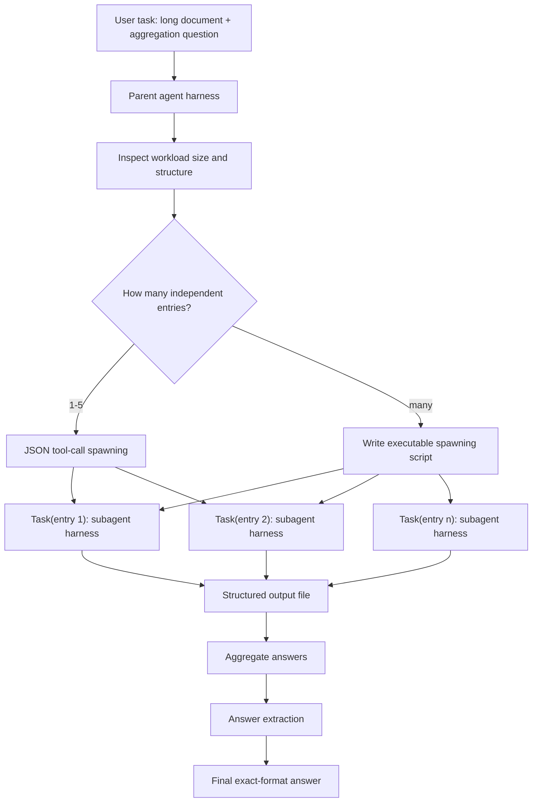

# Recursive Agent Harnesses：当递归的不再是模型调用，而是一整套 Agent Harness

### 元信息

| 字段 | 内容 |
|---|---|
| 论文 | Recursive Agent Harnesses |
| 作者 | Elias Lumer, Sahil Sen, Kevin Paul, Vamse Kumar Subbiah |
| 机构 | PricewaterhouseCoopers, U.S. |
| 日期 | 2026-06-11 |
| 原文 | https://arxiv.org/abs/2606.13643 |
| HTML | https://arxiv.org/html/2606.13643v1 |
| 方向 | 大模型 Agent、长上下文推理、递归工作流、multi-agent harness |

### TL;DR

- 这篇论文命名并评测 **Recursive Agent Harness, RAH**：递归单元不再是一个裸模型调用，而是带有文件系统、代码执行、规划、搜索和子 Agent 生成能力的完整 Agent harness。
- 作者的问题意识很明确：长上下文任务常常不是“找一个 span”，而是要对成百上千个独立条目做逐项推理、计数、比较和聚合；单个 coding agent 往往退化成正则脚本，RLM 又缺少工具和文件系统。
- RAH 的核心机制是：父 Agent 写一段可执行脚本，通过 `Task()` 批量生成子 Agent harness，并用并发执行、共享输出文件和结构化聚合完成任务；少量子任务时也可以走 JSON tool-call 路径。
- 实验只在 Oolong-Synthetic 上做控制评测：199 个样本、13 个上下文长度 bucket、最高 4M tokens；GPT-5 backbone 下，RAH 从 Codex baseline 的 71.75% 提升到 81.36%，Claude Sonnet 4.5 backbone 达到 89.77%。
- 证据最强的地方是模型固定后的架构对比：Codex baseline、RLM、RAH GPT-5 都围绕同一 Oolong-Synthetic 协议比较，使增益更像来自 harness 递归，而不是模型能力换代。
- 局限也很清楚：没有跑 Oolong-Real；没有开源实现和评测脚本；没有 ablate recursion depth、每个子 Agent 处理多少条、代码执行路径 vs JSON tool-call 路径；GPT-5 配置的 token 成本和墙钟时间没有精确 instrumentation。
- 对 Agent 研究的启发是：未来评测不应只问“一个 Agent 会不会用工具”，还要问“harness 是否能作为可组合计算单元被递归调度”，以及这种调度如何受权限、缓存、成本和失败恢复约束。

### 研究问题：为什么单个长上下文 Agent 还不够？

论文要回答的不是“能不能把上下文窗口继续做大”，而是一个更工程化的问题：

> 当任务需要对大量独立条目逐项推理时，递归应该发生在哪一层？

可以把现有路线拆成三类：

| 路线 | 递归单元 | 强项 | 盲点 |
|---|---|---|---|
| 长上下文直接输入 | 单次模型调用 | 简单、接口统一 | 对数百万 token 的分布式聚合不稳定 |
| Coding agent | 单个 harness + 文件系统 | 会搜索、写脚本、用工具 | 容易把逐条推理压缩成正则和启发式 |
| Recursive Language Model | 裸模型调用 | 能递归切片长输入 | 没有文件系统、代码执行和工具环境 |
| RAH | 完整 Agent harness | 每个子问题都有工具、上下文和推理循环 | 成本、权限、脚本可靠性和调度策略更复杂 |

作者把这个差异称为 <u>harness recursion</u>：

- RLM 递归的是 `LM(prompt_slice)`。
- RAH 递归的是 `AgentHarness(task_slice, tools, filesystem, planner)`。
- 关键变化不是“多叫几个模型”，而是“把工具环境也复制到递归单元里”。

这解释了为什么论文选 Oolong-Synthetic：

- Oolong 不是普通检索问答，而是要求在长文档里做聚合、分类、计数、日期和用户关系推断。
- 很多问题需要处理成百上千个 key-value 或事件条目。
- 如果只靠一个 agent 读文件，很容易写一段 regex 扫过去。
- 如果只靠 RLM 切片，子调用又没有文件系统和程序化检查能力。

### 论文主张与论证路线

作者的论证可以压缩成一张 claim → mechanism → evidence → boundary 表：

| Claim | Mechanism | Evidence | Boundary |
|---|---|---|---|
| 递归单元应该升级为完整 harness | 父 Agent 写脚本批量生成子 Agent，每个子 Agent 带工具和上下文 | GPT-5 固定时，RAH 81.36% 高于 Codex 71.75% 和 RLM 64.38% | 只在 Oolong-Synthetic 验证 |
| 代码执行路径比逐个 tool-call 更适合大规模 fan-out | 生成 Python 脚本，`asyncio.gather` 并发运行 `Task()` | 论文说明所有 Oolong 样本都走 code-execution spawning | 未消融 code path 与 JSON path 的独立贡献 |
| RAH 的增益不是模型换代 | RAH GPT-5 与 Codex baseline 都使用 GPT-5 backbone | Table 1 的可控比较 | baseline per-instance score 不可得，只能把已发表结果当固定参照 |
| 增益主要来自逐条语义推理 | USER、COMPARISON、LABEL 均超过 86% | Table 2 answer type breakdown | NUMERIC 仍低，DATE 样本太少 |
| 长上下文上不只看 token 长度 | 子任务数量、answer type、entry 分布都会影响结果 | Table 3 中 262K、1M bucket 的波动 | 每个 bucket 只有约 14-16 个样本，置信区间宽 |

这条论证路线的强处是“机制和评测任务贴合”：

- 任务需要大量独立条目。
- 机制正好提供大量独立子 harness。
- 指标又按 answer type 和上下文长度拆开。

弱处也同样明显：

- 论文没有证明 RAH 对所有长上下文任务都有效。
- 它证明的是：在 Oolong-Synthetic 这种可被分解为许多局部条目的任务上，harness 递归比单 harness 和裸模型递归更合适。

### 方法机制：RAH 到底递归了什么？

RAH 的执行流程可以画成这样：



RAH 的关键设计可以拆成四层：

| 层 | 设计 | 作用 |
|---|---|---|
| 父 Agent | 接收完整任务，判断是否需要分解 | 避免预先固定 decomposition schema |
| 生成脚本 | 用普通程序表达并发、路径、参数和聚合 | 绕过 per-turn tool-call 数量限制 |
| 子 Agent harness | 每个子任务都有 read/write/grep/execute/web 等工具 | 让局部条目也能做语义推理和程序化核对 |
| 聚合与抽取 | 子 Agent 写结构化 JSON，父脚本聚合，再做答案格式抽取 | 把多 Agent 输出压回 benchmark 所需格式 |

可以用伪代码重写作者的机制：

```text
Input:
  D = long document or structured long context
  Q = aggregation / classification / counting question
  B = budget and recursion-depth limit

State:
  depth <= 3 by default
  entries = parent_agent.inspect(D, Q)
  outputs = []

Loop:
  if len(entries) <= 5:
    outputs = call_subagents_with_json_tool(entries)
  else:
    script = parent_agent.write_spawning_script(entries, Q)
    outputs = run(script)  # parallel Task() calls

For each subagent:
  receive assigned entry or group
  use filesystem, grep, code execution and reasoning
  write structured JSON result
  optionally spawn grandchildren if task is still decomposable

Output:
  parent aggregates outputs
  extractor maps raw result into exact answer format

Failure boundary:
  if parent answers directly, recursion collapses
  if subagents count incorrectly, NUMERIC score drops sharply
  if scripts fail or costs explode, harness recursion becomes brittle
```

这里最值得注意的是“代码作为调度语言”：

- JSON tool-call 适合少量子任务，但会受单轮 parallel tool call 预算限制。
- 可执行脚本把 fan-out 变成普通程序参数，理论上能创建上百上千个子 Agent。
- 子 Agent 之间没有共享记忆和聊天频道，降低互相污染风险。
- 聚合通过文件完成，牺牲了一部分实时协作，换来确定性和可审计性。

### 实验设置：为什么这个评测能支撑作者的主张？

作者的实验不是大而全，而是控制变量明确：

| 维度 | 设置 |
|---|---|
| Benchmark | Oolong-Synthetic validation split |
| 样本 | 199 个 |
| 长度 | 13 个 context-length bucket，1K 到 4M tokens |
| 平均长度 | 629K tokens per instance |
| Baseline | Full-context、RLM、Codex No Retriever |
| 主模型 | RAH GPT-5，匹配 Codex baseline |
| 额外模型 | RAH Claude Sonnet 4.5 |
| 温度 | 0 |
| 评分 | Exact match + NUMERIC 近似计分 |
| 置信区间 | 10,000 次 bootstrap |

核心控制点是：

- Codex baseline 与 RAH GPT-5 使用同一 backbone。
- RLM 和 full-context baseline 来自同一 Oolong-Synthetic 协议。
- 评分不是 LLM judge，而是程序化 exact match 和数值公式。
- 答案抽取虽然用了模型调用，但最后仍由程序化评分决定。

NUMERIC 的评分公式可以按论文描述理解为：

```text
如果预测值与真实值相差 d：

score_numeric = 0.75 ^ d

例子：
  d = 0  -> 1.0000
  d = 1  -> 0.7500
  d = 2  -> 0.5625
  d = 3  -> 0.4219
```

这个公式解释了为什么 NUMERIC 类别会拖后腿：

- 子 Agent 即使找到大部分相关条目，少数计数误差也会被指数式放大。
- 对 answer type 的拆分比总分更重要，因为它能区分“语义分类强”和“精确计数弱”。

### 主结果：RAH 赢在哪里？

Table 1 是全文最重要的证据：

| Method | Oolong Score |
|---|---:|
| Full-context baseline | 59.22% |
| RLM | 64.38% |
| Codex, No Retriever | 71.75% |
| RAH, GPT-5 | 81.36% |
| RAH, Sonnet 4.5 | 89.77% |

可以从三个层面读这张表：

- **相对 Codex baseline**：同为 GPT-5，RAH 多出 9.61 个百分点，说明不是“换更强模型”带来的提升。
- **相对 RLM**：RAH 多出 16.98 个百分点，说明递归本身不够，递归单元有没有工具很关键。
- **相对 Sonnet 4.5**：同一 harness 换更强 backbone 到 89.77%，说明 harness recursion 与模型能力可以叠加。

如果把提升写成公式：

```text
RAH_gain_over_Codex = 81.36 - 71.75 = 9.61 percentage points
RAH_gain_over_RLM   = 81.36 - 64.38 = 16.98 percentage points
Sonnet_gain_over_RAH_GPT5 = 89.77 - 81.36 = 8.41 percentage points
```

这组数字支持一个更细的判断：

- RAH 不是在否定 coding agent。
- 它是在说：单个 coding agent 的文件系统和脚本能力很好，但遇到大量需要 LLM 判断的 entry 时，不能只写一个 regex loop。
- 让每个 entry 或 entry group 拥有自己的 harness，才把“工具导航”和“逐条语义推理”结合起来。

### Answer type 证据：语义任务强，计数任务仍脆

Table 2 展示了不同答案类型：

| Answer Type | Score | 95% CI | 样本数 |
|---|---:|---|---:|
| USER | 87.27% | [78.2, 94.5] | 55 |
| COMPARISON | 89.29% | [78.6, 100.0] | 28 |
| LABEL | 86.54% | [76.9, 94.2] | 52 |
| DATE | 60.00% | [20.0, 100.0] | 5 |
| NUMERIC | 69.33% | [57.9, 80.1] | 59 |
| Overall | 81.36% | [76.0, 86.5] | 199 |

这张表说明 RAH 的能力边界不是“能不能读 4M tokens”，而是：

- **USER / COMPARISON / LABEL**：适合分派给子 Agent 做局部语义判断，再由父 Agent 聚合。
- **NUMERIC**：适合程序化聚合，但要求子 Agent 的漏检率非常低；少数错误会影响最终分数。
- **DATE**：样本数只有 5，不应过度解释。

更研究化地说：

- RAH 提升的是“分布式局部判断的召回”。
- RAH 没有自动解决“全局计数一致性”和“精确去重”。
- 对需要严格算术闭包的任务，父 Agent 的聚合器可能要比子 Agent 的语义判断更重要。

### Context length 证据：长度不是唯一变量

Table 3 的 bucket 结果很有意思：

| Context | RAH GPT-5 | RAH Sonnet 4.5 |
|---|---:|---:|
| 1K | 100.0% | 93.8% |
| 8K | 94.5% | 96.9% |
| 64K | 92.3% | 100.0% |
| 131K | 73.3% | 87.6% |
| 262K | 57.1% | 92.0% |
| 524K | 80.0% | 86.7% |
| 1M | 53.3% | 80.0% |
| 2M | 66.7% | 86.7% |
| 4M | 66.7% | 76.7% |

不要把这张表读成“越长越差”：

- 262K 比 524K 更低。
- 1M 比 2M 更低。
- Sonnet 4.5 在 262K 反而达到 92.0%。

作者的解释是：

- 原始 token 长度不是唯一难度来源。
- 每个 bucket 里的 entry 数量、answer type 分布、NUMERIC 占比都会影响分数。
- 每个 bucket 只有约 14-16 个实例，所以 bucket-level 结果要看趋势，不要当精密估计。

这对 Agent benchmark 设计有一个提醒：

- “上下文长度”不应是唯一横轴。
- 更好的横轴可能包括：
  - 独立条目数量；
  - 每个条目的局部证据长度；
  - answer type；
  - 子任务之间是否独立；
  - 聚合是否需要全局一致性。

### 失败模式：RAH 不是免费午餐

论文列出三个主要失败模式：

| 失败模式 | 发生机制 | 对结果的影响 | 后续改进 |
|---|---|---|---|
| 父 Agent 直接回答 | 没有生成 spawning script | RAH 退化成单个 coding agent | 加入触发规则或验证器 |
| NUMERIC 误差 | 少数漏检、重复计数或边界判断错误 | 0.75^d 使小错误被放大 | 聚合器做一致性检查 |
| 小样本 answer type | DATE 只有 5 个样本 | 单个错误导致大幅波动 | 扩大 eval split |

还可以补上论文限制里的系统风险：

- **脚本可靠性**：父 Agent 必须写出语法正确、资源可控、可恢复的并发脚本。
- **成本不可见**：论文没有给 GPT-5 配置的精确 token profile 和 wall-clock profile。
- **无关键 ablation**：没有比较 recursion depth、entry grouping、JSON path、code path 的独立贡献。
- **实现未发布**：代码和评测脚本承诺稍后发布，当前复现性依赖论文附录 prompt 和 Oolong baseline。

这意味着 RAH 的工程落地需要额外约束：

```text
RAH_safety_contract:
  max_depth: bounded
  max_subagents: bounded
  workspace: isolated
  filesystem: least privilege
  output_schema: strict
  aggregation: deterministic
  cache_policy: explicit
  recovery: retry and partial-result accounting
```

没有这些约束，harness recursion 可能从“高效分治”变成“不可控的并发 Agent 树”。

### 相关工作位置：它和 RLM、coding agent、dynamic workflow 的差别

这篇论文最重要的定位不是“又一个 multi-agent 框架”，而是把几条线接起来：

| 相关线索 | RAH 借鉴什么 | RAH 区别在哪里 |
|---|---|---|
| RLM | 递归处理超长输入 | 递归单元升级为完整 harness |
| Coding agent long-context processing | 文件系统、grep、脚本和外部化上下文 | 不让单个 agent 独自承担所有逐条语义判断 |
| CodeAct | 把代码执行视为 action | 代码不是解题脚本本身，也是子 Agent 调度脚本 |
| Dynamic workflows | 脚本化生成大规模 subagents | 论文给出命名、任务边界和控制评测 |
| AutoGen / AgentVerse | 多 Agent 协作 | RAH 强调 sibling isolation 和文件聚合，而非共享对话 |
| MemGPT / memory paging | 解决上下文限制 | RAH 选择分布式子 harness，而不是单 Agent 外部记忆 |

这也是论文的“设计巧思”：

- 它没有把多 Agent 做成群聊。
- 它把多 Agent 当成一种可编程并发原语。
- 它让父 Agent 用熟悉的代码表达 fan-out、路径、参数、重试和聚合。
- 它把结果重新压回 deterministic scorer，而不是用另一个 Agent 做主观评审。

### Figure 与 Table 逐项细读

论文的图表并不多，但每一张都在回答一个具体反驳。与其把图直接贴进正文，不如把它们还原成证据链：

| 图表 | 它支持的主张 | 它没有证明的事 |
|---|---|---|
| Figure 1 | RAH 的递归单元是完整 harness，父 Agent 可在代码生成和 JSON tool-call 两条路径间选择 | 没有证明真实系统中所有父 Agent 都会稳定选择正确路径 |
| Table 1 / Figure 2 | 固定 GPT-5 backbone 时，RAH 高于 Codex baseline 和 RLM baseline | 没有给出 baseline per-instance 结果，无法逐样本分析谁错谁对 |
| Table 2 | RAH 在 USER、COMPARISON、LABEL 上稳定强于 NUMERIC 和 DATE | 没有说明 NUMERIC 错误来自子 Agent 漏检、聚合错误还是答案抽取 |
| Table 3 | 上下文长度不是单调难度，entry 分布和 answer type 更关键 | 每个 bucket 样本少，不能当作精细 scaling law |
| Table 4 | coding agent、RLM、dynamic workflow、RAH 的递归单元不同 | 这是一张概念表，不是实验消融 |

Figure 1 的意义在于把“多 Agent”从聊天协作里拉出来：

- 父 Agent 不是给几个角色发消息。
- 父 Agent 是写一个可执行调度器。
- 子 Agent 不是共享聊天室里的同事，而是隔离 workspace 里的独立 worker。
- 聚合不是投票，而是结构化文件和答案抽取。

Table 1 的意义在于避免常见的模型替换混淆：

- 如果只报告 Sonnet 4.5 的 89.77%，读者无法判断提升来自模型还是 harness。
- GPT-5 对 GPT-5 的比较才是关键证据。
- 71.75% 到 81.36% 的差距，把问题从“模型更强了吗”移动到“同一模型被放进不同 runtime 后会怎样”。

Table 2 的意义在于提醒读者：

- RAH 更像一种“并发语义判断机器”。
- 它不天然等于“完美计数器”。
- 对 NUMERIC 任务，真正需要研究的是子结果校验、重复条目处理、全局一致性检查和可解释计数链。

Table 3 的意义在于反驳一种简单叙事：

- 不是 4M tokens 一定最难。
- 不是 1K tokens 一定最容易。
- 对 Agent 来说，难度常常来自任务结构，而不是文件大小本身。

### 变量与机制解释：把 RAH 写成一个研究对象

如果把 RAH 抽象成系统变量，至少有这些可控项：

| 变量 | 含义 | 对质量的影响 | 对成本的影响 |
|---|---|---|---|
| `d` | recursion depth | 深层任务可继续分解 | 增加树形 fan-out 风险 |
| `g` | entries per subagent | 影响局部上下文密度 | g 越小，子 Agent 越多 |
| `c` | concurrency limit | 降低尾延迟 | 太高会触发预算和速率限制 |
| `p` | prompt prefix cache hit rate | 共享文档前缀越高，成本越低 | 依赖 provider cache 机制 |
| `v` | verifier strictness | 降低错误聚合 | 增加二次检查调用 |
| `s` | script success probability | 决定是否能稳定 fan-out | 失败会产生重试和人工诊断成本 |

一个更完整的质量模型可以写成：

```text
FinalQuality
  ≈ LocalReasoningRecall(g, model, tools)
    × AggregationCorrectness(v, schema)
    × ParentRoutingReliability(s, d)
    × ExtractionFaithfulness
```

这个公式的作用不是给出精确数值，而是提示：

- 只提升模型能力，不一定修复聚合错误。
- 只增加子 Agent 数量，不一定提升 NUMERIC。
- 只扩大上下文窗口，不一定获得逐条 reasoning。
- 没有 verifier，局部正确也可能被全局聚合破坏。

成本也可以粗略拆成：

```text
TotalCost
  ≈ ParentPlanningCost
    + N_subagents × SharedContextCost × (1 - CacheDiscount)
    + N_subagents × LocalReasoningCost
    + AggregationCost
    + RetryCost
```

因此，RAH 的工程优化重点不会只在 prompt 上，而会落到：

- 共享上下文前缀能否稳定命中缓存；
- 子 Agent 是否需要全文，还是只需要局部摘录；
- 聚合器能否在不调用大模型的情况下发现不一致；
- 父 Agent 能否根据样本结构决定 `g` 和 `c`；
- 失败时是否能保留 partial results，而不是全量重跑。

### 附录 Prompt 的意义：为什么它不是 benchmark-specific hack？

论文附录给出父 Agent、子 Agent 和答案抽取 prompt。这里最值得关注的不是具体措辞，而是 prompt 的“通用性主张”：

- 父 Agent prompt 没有写入 Oolong 专用规则。
- 父 Agent 被告知拥有文件系统、shell 和生成子 Agent 的能力。
- 它需要自己决定是否分解、怎样分解、是否写脚本。
- 子 Agent prompt 也保持通用，只要求完成用户消息里的自包含任务。
- 答案抽取 prompt 只把 raw output 映射到 benchmark 所需格式，不参与评分。

这支撑了作者的一个隐含论点：

- RAH 不是为了 Oolong 手写的 pipeline。
- RAH 是一种 harness 级能力暴露方式。
- Oolong 只是一个能放大这种能力差异的测试场。

但这个主张仍有边界：

- 通用 prompt 不等于通用成功。
- 父 Agent 在少数长上下文样本上仍会直接回答，说明 routing 不是完全可靠。
- 子 Agent 的隔离虽然减少互相干扰，但也会失去跨子任务协同。
- 答案抽取虽然全部成功，但没有人工验证抽取是否从不改变语义。

### 对 Agent runtime 的启发：权限和审计必须前置

RAH 把 harness 作为递归单元之后，安全和治理问题会被放大：

| 风险 | 为什么在 RAH 中更突出 | 需要的 runtime 机制 |
|---|---|---|
| 权限扩散 | 每个子 Agent 都可能继承文件和 shell 能力 | capability attenuation |
| 预算失控 | 脚本可以生成大量 Task | quota、rate limit、depth limit |
| 输出污染 | 某个子 Agent 可能写入错误结构或恶意内容 | schema validation、signed output |
| 上下文泄漏 | 父上下文不该默认传给所有子 Agent | minimal context packaging |
| 调试困难 | 并发树的失败不易复现 | trace、run id、per-task logs |

这也是我认为论文最有价值的地方：

- 它把 Agent 能力问题变成 runtime contract 问题。
- 一旦允许 Agent 递归生成 Agent，系统设计就必须默认每个节点可审计、可限权、可重放。
- 否则 RAH 的扩展性会先变成运维风险，再变成安全风险。

从这个角度看，RAH 和 AI 安全也有交集：

- prompt injection 不再只攻击一个 Agent，而可能污染一棵任务树。
- malicious output 不再只影响一次回答，而可能进入聚合文件。
- 子 Agent 的工具权限如果没有裁剪，攻击面会随 fan-out 线性或超线性增长。
- 父 Agent 生成的脚本本身需要静态检查和沙箱执行。

所以，RAH 的下一步不应只是“更大规模生成子 Agent”，而应该是：

- 可证明的 depth bound；
- 可配置的 capability profile；
- deterministic aggregation；
- per-subagent provenance；
- partial failure semantics；
- cost-aware scheduling。

### 研究核查清单：读这篇论文时应保留的判断

可以用下面这份清单判断 RAH 的证据强度：

| 核查项 | 当前答案 |
|---|---|
| 是否有明确新概念 | 有，核心是 harness recursion |
| 是否有同模型控制实验 | 有，GPT-5 对 GPT-5 是主证据 |
| 是否有多任务泛化 | 暂时不足，主要是 Oolong-Synthetic |
| 是否有可复现代码 | 论文说稍后发布，当前还不足 |
| 是否有成本曲线 | 不足，只有定性讨论和缓存引用 |
| 是否有失败模式 | 有，但还不是完整 taxonomy |
| 是否有安全治理讨论 | 论文不是安全论文，需要读者补上 runtime 边界 |

因此，最合理的读法是：

- 把 RAH 当成一个值得命名的 Agent runtime pattern。
- 把 81.36% 当成 Oolong-Synthetic 上的强信号。
- 不要把 89.77% 直接外推到所有长上下文任务。
- 不要把“能生成很多子 Agent”误解成“系统自动更可靠”。
- 真正值得迁移的是递归单元的选择，而不是某个具体 prompt。
- 工程实现时必须先定义权限、预算、日志、输出 schema 和失败恢复。

如果未来有开源实现，我会优先复查四件事：

- 父 Agent 生成的脚本是否经过静态限制和沙箱化执行。
- 子 Agent 的输入包是否只包含完成局部任务所需的最小上下文。
- 聚合文件是否有 schema、来源标记和冲突处理。
- 失败样本是否能追溯到具体 entry、子 Agent 和脚本片段。

### 我会如何继续追问？

如果站在研究者角度，RAH 后续最值得补的不是更花哨的 demo，而是四类实验：

| 追问 | 为什么重要 | 可能实验 |
|---|---|---|
| entry grouping 怎么选？ | 一个子 Agent 处理 1 条、10 条、100 条会改变成本和准确率 | 固定模型，扫描 group size |
| recursion depth 真有用吗？ | 论文默认 depth 3，但 Oolong 中是否真的用到孙 Agent 不清楚 | depth 1/2/3 ablation |
| code path 比 JSON path 强多少？ | 所有样本都走 code-execution，无法分离机制贡献 | 构造小规模与中规模任务 |
| 聚合器该不该学习？ | NUMERIC 失败可能来自聚合而非局部理解 | deterministic aggregator vs learned verifier |

也可以从安全角度追问：

- 子 Agent 是否能访问父 Agent 的敏感上下文？
- 并发脚本是否会把权限扩大到所有任务？
- 如果某个子 Agent 被 prompt injection 污染，结构化输出文件如何标记不可信？
- 父 Agent 如何处理冲突输出、超时输出和部分失败？

从 Agent 产品角度看，RAH 指向一个很具体的未来：

- Agent 不只是“会调用工具的聊天模型”。
- Agent harness 会变成一种可组合、可递归、可限权的计算节点。
- 真正的能力差异可能来自 harness runtime：调度、缓存、隔离、审计、失败恢复和预算控制。

### 结论与证据边界

这篇论文的核心贡献可以简化成一句话：

> 对超长、可分解、逐条推理密集的任务，递归裸模型调用不如递归完整 Agent harness；但这种优势目前只在 Oolong-Synthetic 上得到初步控制验证。

我认为它值得放进 Daily Report 的原因有三点：

- 它命名了一个已经在生产 coding agent workflow 中出现的模式。
- 它给出了同模型 backbone 下的控制比较，而不是只展示更强模型结果。
- 它把 Agent 研究从 prompt 和 tool-use 推向 runtime architecture：什么被复制、什么被隔离、什么被聚合、什么被审计。

同时，不能把它读成“多开子 Agent 就一定更强”：

- 任务必须能分解为相对独立条目。
- 子 Agent 的局部判断必须能被可靠聚合。
- 成本和延迟必须受缓存、并发上限和深度上限约束。
- 代码和数据还未发布，严格复现仍要等待实现。

最稳妥的结论是：

- RAH 是长上下文 Agent 的一个重要架构候选。
- 当前证据支持它在 Oolong-Synthetic 上超过单 harness 和裸模型递归。
- 下一步研究应把 focus 从“有没有递归”推进到“递归单元、调度策略、权限边界和聚合验证分别贡献多少”。
