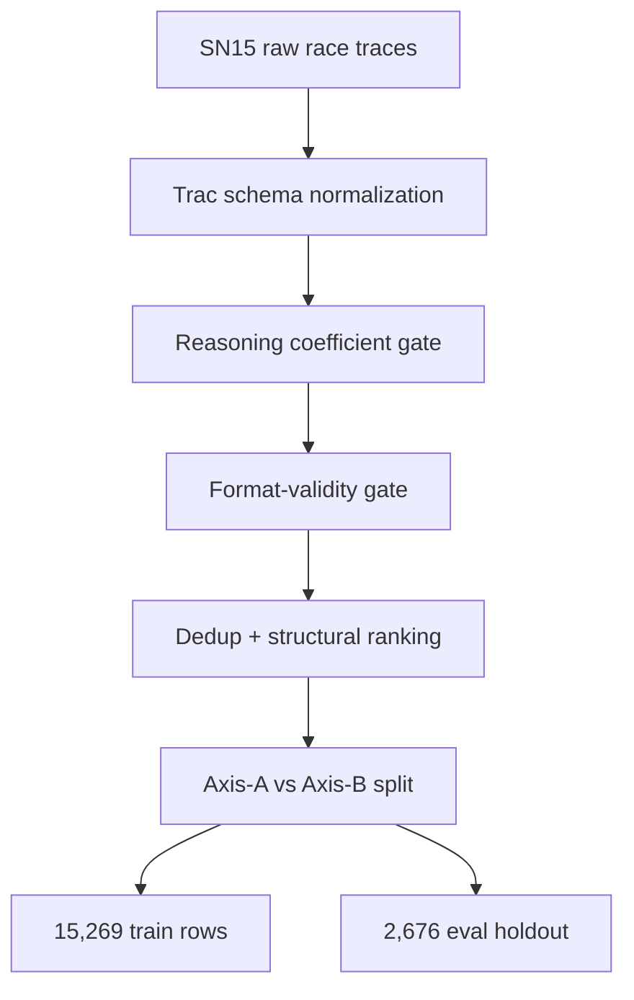
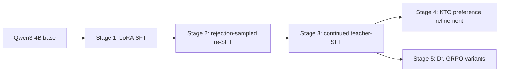

# Bittensor Agent Arenas：把 Agent 竞技场变成后训练轨迹工厂

> 研究者精读 · 这篇论文的核心不是“Bittensor 又做了一个购物 Agent”，而是提出一种后训练数据观：小模型 Agent 的瓶颈可能不在算法名字，而在能否持续获得带评审、带 provenance、带 held-out 防泄漏的多轮工具调用轨迹。

| 字段 | 内容 |
|---|---|
| 原文 | [Bittensor Agent Arenas as a Trajectory Primitive](https://arxiv.org/abs/2606.10064) |
| 作者 | Shardul Bansal, Seth Schilbe, Jarrod Barnes |
| arXiv 时间 | 2026-06-08 18:39:15 UTC |
| 配套博客 | [ORO 论文页](https://oroagents.com/blog/oro-trajectory-paper) |
| 代码 | [ORO-AI/shoppingbench-trajectory-primitive](https://github.com/ORO-AI/shoppingbench-trajectory-primitive) |
| 数据与模型 | [Hugging Face Collection](https://huggingface.co/collections/oro-ai/shoppingbench-sn15-trajectory-primitive) |
| 分类 | 大模型后训练、Agent 轨迹数据、工具调用评测 |

## TL;DR

- **问题**：Agent 后训练需要多轮工具调用轨迹，但合成数据会继承教师模型偏差，生产日志又常常没有逐条评分、混入捷径行为。
- **方法**：作者把 ORO Subnet 15 这个 Bittensor ShoppingBench 竞技场，重新解释为一个持续生产训练轨迹的机制。
- **核心机制**：SN15 同时提供三件事：独立矿工的激励式多样性、LLM reasoning judge 的逐轨迹过程评分、leak-cluster guarded 的轮换 held-out 题库。
- **数据过滤**：raw firehose 先转成 OpenAI tool-call schema，再经过 reasoning coefficient gate、格式硬拒绝、去重/排序、Axis-A/Axis-B 切分。
- **训练对象**：Qwen3-4B，在过滤后的 15,269 条 SFT train 轨迹上做 SFT、rejection re-SFT、continued teacher-SFT、KTO，并尝试 Dr. GRPO。
- **关键数字**：Qwen3-4B base 从 18.0% ASR 提升到 42.7%；接近 synthetic SFT-only baseline 的 43.6%，但仍低于 SFT+GRPO bar 的 48.7%。
- **证据边界**：KTO 没有提高 overall ASR；Dr. GRPO 改善过程指标，但 exact-match success 还没有被转化出来。
- **局限**：当前训练只用 Axis-A agentic slice；SN15 大量高分轨迹其实是 Axis-B sub-task pattern，尚未被有效转成可模仿的 Agent policy。


## 研究问题：后训练到底缺算法，还是缺轨迹基底

作者开头先把争论从“用哪种 RL 算法”挪到 <u>trajectory substrate</u>：

- RLVR、group-relative RL、rejection-sampled re-SFT 都不是凭空训练。
- 它们需要多轮轨迹、逐轨迹监督、可执行 verifier、失败样本和部分成功样本。
- 对购物 Agent 这类工具调用任务，单条样本不是一问一答，而是一棵搜索树：
  - 搜索商品；
  - 读取店铺；
  - 检查价格、服务、SKU、属性；
  - 处理 voucher；
  - 最终只推荐一个 product。

这篇论文真正提出的问题可以写成：

| 维度 | 传统做法 | 论文指出的问题 |
|---|---|---|
| 合成轨迹 | 用 frontier model 生成用户、Agent、工具调用 | 会继承 synthesizer 偏差，长尾容易坍缩 |
| 生产日志 | 从真实部署里拿多样轨迹 | 没有可靠逐轨迹 judge，且常混入捷径和污染 |
| 竞技场轨迹 | 让独立策略在同一任务面竞争 | 如果机制设计正确，可同时制造多样性、评分和 held-out 防泄漏 |

因此论文主张不是“Bittensor 比合成数据更好”，而是：

> 一个设计得足够具体的 Agent arena，可以成为 Agent 后训练里的数据 primitive。

### 为什么这个问题在 2026 年变得更尖锐

过去的指令微调数据，常常把任务压缩成“用户问题 → 助手答案”。但工具 Agent 的行为不是这种形状。

- 它必须在不完整观察下选择下一步工具。
- 它必须判断某次检索失败是 query 写错、索引没有结果，还是约束本身不可能满足。
- 它必须在多个局部满足条件的候选之间做取舍。
- 它必须知道什么时候继续查、什么时候停、什么时候提交最终动作。

这意味着后训练样本如果只保存最终答案，会丢掉最值钱的部分：中间决策。

论文把这个问题压到 ShoppingBench 上，是因为购物任务天然包含多约束：

| 约束类型 | 例子 | 失败形态 |
|---|---|---|
| 商品属性 | 黑色、材质、防水、容量 | 找到相似商品但漏掉关键属性 |
| 价格 | 低于 20 美元、含 voucher 后价格 | 未计算优惠，或把原价当成交价 |
| 店铺服务 | 评分、配送、COD、免邮 | 商品对了但店铺条件不对 |
| SKU | 颜色/尺码/款式组合 | 商品页对了但 SKU 变体不对 |

在这种任务里，trajectory quality 不等于 answer quality。一个轨迹最终失败，可能仍包含好的搜索策略；一个轨迹最终成功，也可能靠 deterministic wrapper 直接枚举出来，LLM 并没有学到可迁移策略。

### 本文的 detail inventory

| 类别 | 论文给出的具体对象 |
|---|---|
| 方法名 | SN15 agent arena、structural-quality filter、Axis-A/Axis-B split、Dr. GRPO turn-level RL |
| 数据规模 | 146K race-phase extract、18,043 raw traces、15,269 train rows、2,676 eval holdout |
| 模型 | Qwen3-4B base、Qwen3-4B SFT/rejection/KTO variants、Claude Sonnet 4.6 teacher |
| benchmark | ShoppingBench / ORO 7-tool harness / 75-problem leak-cluster-guarded held-out |
| 指标 | ASR、price/service/SKU/attribute 四轴、pass@1、pass@8、per-bucket ASR |
| baseline | Qwen3-4B base 18.0%、synthetic SFT 43.6%、synthetic SFT+GRPO 48.7%、Sonnet 4.6 64.0% |
| 消融/负结果 | KTO overall 不增、tighter beta KTO 退化、outcome-only Dr. GRPO 不稳定或无 reward climb |
| 失败案例类型 | Axis-B firehose 不可直接模仿、exact-match conversion 失败、harness/prompt 差异影响比较 |

## 论证路线：claim → mechanism → evidence → boundary

| 层次 | 论文主张 | 机制 | 证据 | 边界 |
|---|---|---|---|---|
| 数据来源 | SN15 firehose 不是普通日志 | 竞赛、token emissions、validator 评分 | 146K race-phase extract，18,043 raw traces | 不是所有 subnet 都自然满足这个条件 |
| 数据质量 | 轨迹要能被训练，必须过滤 | reasoning coefficient + structural filter | 15,269 train + 2,676 eval holdout | filter 保留的是小的 Axis-A 切片 |
| 防泄漏 | ShoppingBench 不能 naive split | leak cluster 按问题变体成组切分 | train/eval product-ID intersection audit 为空 | 仍依赖聚类质量和 harness 定义 |
| 后训练效果 | 竞技场轨迹能蒸馏小模型 | Qwen3-4B 多阶段 post-training | 18.0% → 42.7% ASR | 没有超过 48.7% SFT+GRPO published bar |
| 后续空间 | 主要瓶颈在数据切片和 RL 抽取 | Axis-B 转 Axis-A，dense tool-match reward | pass@8 53.3% vs pass@1 34.8% | exact-match conversion 尚未完成 |

## SN15 竞技场机制：为什么它不是普通榜单

### 1. Bittensor 三个基础角色

- **miner**：提交候选 Agent 或模型。
- **validator**：运行任务、评分、把分数回报链上。
- **emissions**：链上按近期共识评分分发的 token 奖励。

这个结构的关键是：每次提交和评测都有 hotkey，可追溯到参与者、validator、问题和 scoring pipeline 版本。

### 2. SN15 增加的三层约束

| 机制 | 具体做法 | 为什么对训练数据重要 |
|---|---|---|
| race | 每日 promote top agent，矿工提交有 cooldown，获胜代码有 embargo | 鼓励不同团队探索不同策略，而非单一模型自举 |
| reasoning judge | outcome score 之外，再由 LLM judge 读完整轨迹并给 reasoning coefficient | 让每条轨迹带过程监督信号，而不仅是最终成功/失败 |
| held-out rotation | open / held-out / never-touch 题池轮换，并按 leak cluster 防 paraphrase 泄漏 | 减少记住表面题目变体造成的虚假泛化 |

### 3. 每条轨迹包含什么

一条可用记录不是只有最终答案，而是至少包括：

- agent version 和 miner hotkey；
- validator hotkey；
- problem identifier；
- 完整多轮 think/tool-call trace；
- outcome score 和 price/service/SKU/attribute 四轴分解；
- reasoning coefficient；
- judge 引用的 trace spans；
- scoring pipeline version。

这使得它比普通生产日志更接近训练数据：

```text
普通日志 = 发生了什么
SN15 轨迹 = 谁提交 + 谁验证 + 做了什么 + 为什么被认为好/坏 + 属于哪个防泄漏题簇
```

## ShoppingBench 任务面：ASR 为什么难

ShoppingBench 是 index-based agentic commerce benchmark。Agent 面对的是结构化商品索引，而不是浏览器网页。

任务要求可以拆成：

1. 输入自然语言购物意图。
2. 多轮调用 catalog tools。
3. 综合商品、店铺、voucher 和属性约束。
4. 只用一次 `recommend_product` 提交最终商品。
5. 用 `terminate` 结束。

ASR 的形式可以写成：

```math
ASR = \frac{1}{N}\sum_{i=1}^{N}\mathbf{1}[
price_i \land service_i \land SKU_i \land attribute_i
]
```

变量解释：

| 变量 | 含义 |
|---|---|
| `N` | held-out problem 数量，这篇主结果用 75-set |
| `price_i` | 推荐商品满足价格区间 |
| `service_i` | 满足配送、COD、免邮等服务要求 |
| `SKU_i` | 满足 SKU 级属性 |
| `attribute_i` | 满足颜色、材质、功能等自由文本属性 |

这个指标苛刻的地方在于：四轴必须同时满足。一个 Agent 可能找到接近的商品，但只要 voucher 算错、店铺服务错、SKU 不匹配，最终 ASR 仍为 0。

## 结构过滤：从 firehose 到可训练语料

论文最值得细读的是第 5 节，因为它决定了“竞技场轨迹”能否进入后训练。

### 1. 两步转换

- **规范化**：用 Trac converter front-end 把 raw trajectory 转成 canonical OpenAI tool-calls schema。
- **结构过滤**：只留下真正可模仿的 agentic 轨迹。

Hugging Face 上的发布物给了具体数量：

| 数据集 | 行数 | 作用 |
|---|---:|---|
| raw traces | 18,043 | winners-only, unanimous-50, 过滤前 SFT input |
| filtered train | 15,269 | leak-cluster-clean SFT corpus |
| eval holdout | 2,676 | leak-cluster-clean eval holdout |
| raw race extract | 146K | README 中说明的 SN15 race-phase extract |

### 2. 过滤器四个阶段



### 3. 五个格式硬拒绝

| hard reject | 含义 | 训练风险 |
|---|---|---|
| tool-call / response 不配对 | assistant tool call 后没有对应 tool response | 会让模型学习断裂格式 |
| `recommend_product` 非一次 | 多次推荐或没有推荐 | 与任务终止协议冲突 |
| 推荐参数不可解析 | JSON 无效或 product id 不可查 | reward 无法准确计算 |
| 超过 token budget | `max_length = 14336` | 训练时静默截断 |
| think-then-stop | 只思考但没有推荐/terminate | 没有可执行 policy endpoint |

### 4. 结构质量排序

同一问题上可能有多条候选轨迹。论文用几个 signals 排序：

- think-and-tool-call depth：是否真的进行了多步搜索；
- search-query reformulation count：是否迭代改写查询；
- verification step presence：最终推荐前是否检查匹配；
- step-shape regularity：是否陷入重复调用或病态循环。

这组 signals 的意义是：作者不只按最终成功筛样本，还在筛“是否像一个可学习的 Agent policy”。

### leak-cluster guard 为什么不是可选项

ShoppingBench 的问题可以被 paraphrase：

- “找一个黑色腰包”可以改写成“推荐黑色 waist bag”。
- 属性顺序可以调整。
- 商家或商品表达可以替换。
- voucher 条件可以以不同自然语言出现。

如果只按 trajectory id 或 problem id 做随机切分，训练集里可能出现 held-out 问题的近邻变体。模型并不需要学会泛化，只要记住商品或路径就能得分。

论文采用 leak-cluster guard 的意义在于：

1. 先把同一底层 reward specification 的变体聚成 cluster。
2. 再按 cluster 切成 training pool、evaluation pool、never-touch pool。
3. 最后验证 train/eval product-id intersection 为空。

这对 Agent 后训练很关键：

- 如果 held-out 不干净，ASR 提升可能只是商品记忆。
- 如果 held-out 太远，评测又会变成跨分布泛化，而非同任务 family 内泛化。
- leak-cluster 是折中：防表面泄漏，但仍保持 ShoppingBench 任务族一致。

### 过滤器真正筛掉了哪种“高分坏数据”

Axis-B 不是低质量日志。相反，它常常是高分工程策略。

典型 Axis-B 形态可以描述为：

```text
Python wrapper:
  parse intent
  enumerate candidate products
  call deterministic search / ranking code
  ask LLM to classify, score, or narrate
  submit recommendation
```

这种系统对线上 leaderboard 很有用，但对训练一个会自主工具调用的小模型不够直接。因为 token stream 里没有“模型决定调用哪个工具”的动作。

换句话说：

- 对系统评测，它是好 Agent。
- 对行为克隆，它是坏 demonstration。
- 对后训练数据，它必须先被转写、归因或拆解。

这也是本文比普通榜单文章更有研究价值的地方：它没有把 leaderboard performance 和 trainability 混为一谈。

## Axis-A / Axis-B：这篇论文最关键的负结果

论文把轨迹分成两类：

| 类型 | 谁发出工具调用 | 模型学到什么 | 是否进入本轮训练 |
|---|---|---|---|
| Axis-A | LLM 自己输出 tool-call blocks | 搜索、验证、何时提交推荐的 Agent policy | 是 |
| Axis-B | Python harness 发出工具调用，LLM 只做分类/评分/叙述 | intent classifier、match scorer、narrator | 否 |

这不是命名游戏，而是训练目标问题：

- 如果训练目标是一个能独立调用工具的 shopping agent，Axis-B 轨迹会给出错误归因。
- 模型会学会解释工具结果，却学不会“下一步该调用哪个工具、带什么参数”。
- 高分 leaderboard policy 反而可能偏向 Axis-B，因为确定性 Python search strategy 更稳定。

论文承认：

- 当前 SN15 firehose 的大部分高分数据是 Axis-B。
- Axis-A 是更小切片。
- 因此 42.7% ASR 应读成“用小的 agentic 切片能达到什么”，而不是整个 subnet firehose 的上限。

## 后训练管线：五阶段，但最后并不全成功

作者从 Qwen3-4B base 出发，训练栈如下：



### Stage 1：SFT

- base model：Qwen3-4B。
- 训练：1 epoch LoRA。
- learning rate sweep：`1e-5, 3e-5, 1e-4`。
- `max_length = 14336`。
- 用 PrimeIntellect `renderers==0.1.7` 处理 assistant loss mask。

这一段看似工程细节，但很重要：

- Qwen3 chat template 的 stop token 行为会导致 mask drift。
- 如果 assistant loss mask 错，模型会学错位置。
- 论文把这类 bug 放进附录，说明结果不是只靠宏观 pipeline。

### 附录里的工程故障为什么重要

论文附录 B.2 列了 practice-run bug catalog。它们看似琐碎，但直接决定结果是否可信。

| 故障 | 具体问题 | 如果不修会怎样 |
|---|---|---|
| dropout during generation | rollout sampling 时模型处在 `train()` 模式 | on-policy 数据被随机 dropout 污染 |
| loss-mask drift | TRL collator 在 Qwen3 trace 上 mask 到错误边界 | 模型可能学用户/工具内容，而不是 assistant 动作 |
| mask validation | GRPO 前必须检查 mask=1 位置能解码成 assistant content | 防止 silent corruption |
| stop-token off-by-one | Qwen3 去掉非 final assistant turn 的结束 token | reward 计算和 step counter 可能错位 |

这些细节说明：Agent 后训练不是把 JSONL 扔进 SFT 脚本就结束。多轮工具调用的 renderer、mask、stop token、turn counter、reward step 对齐，都会影响“模型到底在学什么”。

### 训练管线的因果链

可以把五阶段训练理解成四种信号的叠加：

| 信号 | 来自哪里 | 作用 | 局限 |
|---|---|---|---|
| imitation | Axis-A SFT corpus | 让模型学会工具调用格式和基本策略 | 只模仿已有切片 |
| self-success | rejection re-SFT | 强化模型自己已能跑通的路径 | 只保留满分 rollout，可能变窄 |
| teacher outcome | Sonnet 4.6 continued SFT | 注入强教师成功轨迹 | 不是 step-wise KL 的等价替代 |
| preference/process | KTO / Dr. GRPO | 尝试把失败差异和 per-step 工具选择变成梯度 | KTO 不扩能力，Dr. GRPO 未转成 exact ASR |

这条链路解释了为什么 42.7% 不是单一组件的功劳。它来自数据过滤、renderer 修正、teacher rollout、评测 parity、bucket balancing 等一整套细节。

### Stage 2：rejection-sampled re-SFT

公式化写法：

```text
For each training problem x:
  sample k = 8 rollouts at temperature 0.9, top_p = 0.95
  score each rollout with bucket-aware ShoppingBench reward
  keep rollout if reward = 1.0
  concatenate kept rollouts with original SFT corpus at 50/50 ratio
```

这里的目标是把模型自己已经能做对的 rollouts 加回训练集，强化可执行成功路径。

### Stage 3：continued teacher-SFT

原 ShoppingBench recipe 在这一阶段用 step-wise OPD。作者因为 per-step KL 成本太高，替换成：

- Claude Sonnet 4.6 teacher；
- 498 个 race-bank training problems；
- production-strict scoring；
- 约 210 条成功 teacher trajectories；
- voucher bucket 上采样 3 倍以贴近 shop count。

这个 substitution 是重要边界：

- 它让训练更可运行。
- 但它不等价于原论文 step-wise OPD。
- 所以对比 48.7% SFT+GRPO bar 时，不能说算法完全复现。

### Stage 4：KTO

KTO 的适配理由是：

- 不需要成对 preference；
- desirable / undesirable 都来自 production-strict scoring；
- 适合成功和失败轨迹格式一致、但规则满足度不同的场景。

但实验结果很克制：

| KTO 版本 | overall ASR | 变化 |
|---|---:|---|
| SFT stack | 42.7% | 32/75 |
| SFT stack + KTO, beta=0.02 | 42.7% | overall 不变 |
| tighter beta, beta=0.01, 2 epoch | 35.1% | 负结果 |

bucket 层面，KTO 只是重新分配概率：

| bucket | SFT stack | +KTO | 变化 |
|---|---:|---:|---:|
| product | 67.9% | 64.3% | -3.6pp |
| shop | 29.2% | 29.2% | 0 |
| voucher | 26.1% | 30.4% | +4.3pp |

作者的解释很合理：KTO 移动了 bucket 内概率质量，但没有扩张模型能力边界。

### Stage 5：Dr. GRPO

论文尝试了三组 Dr. GRPO：

| 版本 | reward | 观察 |
|---|---|---|
| v17 | outcome-only | 40-43% plateau，KL spike 到 17-21 |
| v18 | outcome-only + 稳定超参 | KL 降到 1.0-2.0，但 mean reward 不涨 |
| v19 | outcome + per-step tool-match | rule score 0.02 → 0.42，product-ID hallucination 14 → 0 |

v19 最有价值，但也暴露核心失败：

- 过程指标在变好。
- 轨迹更靠近正确 catalog neighborhood。
- strict exact-match success 在 20 step 内仍为 0。

这说明 dense per-step teacher-grounded reward 的方向对，但还没把 pass@k headroom 变成 pass@1 ASR。

## 主结果：42.7% 是强信号，但不是胜利宣言

| 模型 / 变体 | 75-set ASR | 备注 |
|---|---:|---|
| Qwen3-4B base | 18.0% | ShoppingBench published baseline |
| Qwen3-4B + synthetic SFT | 43.6% | 原 ShoppingBench synthetic GPT-4.1 trajectories |
| Qwen3-4B + synthetic SFT+GRPO | 48.7% | 原论文 bar |
| ORO SFT stack final | 42.7% | 本文主结果 |
| ORO SFT stack + KTO | 42.7% | overall 不变 |
| Sonnet 4.6 teacher | 64.0% | frontier teacher |
| SN15 top miner | 77.3% | multi-LLM ensemble，不是小模型蒸馏结果 |

结果可以分三层读：

1. **已证明**：SN15 竞技场轨迹经过过滤后，可以把 Qwen3-4B 从 18.0% 拉到 42.7%。
2. **接近但未超过**：42.7% 接近 synthetic SFT-only 43.6%，说明 arena traces 至少不是劣质日志。
3. **未完成**：距离 48.7% SFT+GRPO bar 仍有差距，RL extraction 没有完全闭环。

### 为什么 75-set 上 0.9pp 不该被过度解释

论文自己提醒，主结果是在 75 个 held-out problem 上报告的。这个规模下，一个问题约等于：

```math
1 / 75 = 1.33pp
```

因此 42.7% 与 43.6% 的 0.9pp 差距，比单题波动还小。合理读法是：

- 本文方法达到 synthetic SFT-only baseline 的同一量级。
- 它没有统计上压倒 synthetic SFT。
- 它的价值在数据来源不同：不是 frontier-synthesised trajectories，而是 subnet-generated and judge-filtered trajectories。

这也是为什么作者把 48.7% SFT+GRPO bar 当作真正的下一目标。那个差距约 6.0pp，已经超过单题噪声，更能代表训练栈未完成的问题。

## pass@8 与 pass@1：为什么作者说还有 headroom

论文报告：

```math
Headroom = pass@8 - pass@1 = 53.3\% - 34.8\% = 18.5pp
```

这个数字的意义是：

- 模型在多次采样里能找到正确或更接近正确的策略。
- 但单次贪心或温度 0 推理还不能稳定落到正确 product。
- RL 阶段应该做的是把这种 latent capability 压缩进 pass@1。

用 Agent 语言说：

| 能力状态 | 解释 |
|---|---|
| pass@8 高 | 策略空间里存在成功路径 |
| pass@1 低 | 默认 policy 不会稳定选中成功路径 |
| dense reward 有效 | 过程反馈能推近正确路径 |
| exact match 未涨 | 最后一跳 grounding 或 credit assignment 仍失败 |

## Figure / Table 证据解读

### Figure 1：从竞技场到模型的闭环

本地化图展示了四段：

- SN15 Agent Arena：独立矿工在 ShoppingBench 上连续 race。
- Data Pipeline：Trac normalization、judge coefficient gate、structural filter、leak-cluster split。
- Policy Training：Qwen3-4B 经 SFT、rejection、teacher-SFT、KTO、Dr. GRPO。
- Distilled Agent：回到 held-out ASR，再作为 miner 重入竞技场。

虚线箭头是论文最有野心的部分：

- 模型不是一次性训练产物。
- 更强 miner 会改变竞技场 firehose。
- 下一代轨迹质量又会提高。

### Figure 2：整体 ASR 比较

Figure 2 支持的是“arena traces 能接近 synthetic SFT-only baseline”，不是“已经超过原 recipe”。

关键对比：

- 18.0% → 42.7% 是大幅提升。
- 42.7% 与 43.6% 只差 0.9pp，属于 75-problem 上的单题级差异。
- 42.7% 与 48.7% 仍差 6.0pp。
- Sonnet 4.6 64.0%、top miner 77.3% 说明 task surface 还远没有被小模型吃满。

### Figure 3：KTO 的 bucket redistribution

Figure 3 的价值在负结果：

- voucher 涨；
- product 跌；
- shop 不变；
- overall 不变。

这比“又加一个 preference stage 就提升”更诚实。它说明偏好优化在这个任务里可能只是移动已有能力，而不是产生新工具调用策略。

### Table 1：把所有变体放在一个坐标系

Table 1 让读者看到：

- 训练栈中每一步并不单调提升；
- renderer/parity/harness 细节会显著影响测量；
- published bar 与本文结果之间仍存在 harness 和 recipe substitution 差异；
- Dr. GRPO 的过程改善还没变成最终 ASR。

## 相关工作位置：它和 ToolBench、ToolACE、Tulu、DeepSeek-R1 的区别

论文把自己放在三条线里：

| 线索 | 代表 | 本文区别 |
|---|---|---|
| 工具调用合成数据 | ToolLLM, ToolBench, ToolACE | 本文不是一次性合成，而是持续竞技场 firehose |
| verifier-grounded RL | Tulu 3, DeepSeek-R1 | 本文把 verifier 信号落到多轮 shopping trajectory |
| 生产轨迹后训练 | Cursor Composer, Cognition SWE-1.5 | 本文用公开 subnet 竞赛代替公司内产品遥测 |

这里最值得注意的是与 coding agent 的类比：

- Cursor / Cognition 的论点是生产轨迹和可执行 grading 让 coding agent 训练有效。
- ORO 的论点是 commerce agent 也需要类似轨迹，只是来源不是 IDE 产品遥测，而是公开竞技场。
- 这让 Bittensor 从“挖矿榜单”变成“可审计数据生成机制”的候选形态。

## 局限：这篇论文自己承认了什么

### 1. Axis-A 样本太少

训练只用 agentic Axis-A。问题是，当前 leaderboard 高分策略大量是 Axis-B：

- Python 负责确定性搜索；
- LLM 做 intent classifier、match scorer、narrator；
- 这种策略在当前 scoring 下更容易得高分。

论文估计 SN15 每日产生约 12K 到 27K trajectories，但可直接用于 Agent policy 模仿的 Axis-A 是小部分。

### 2. harness 差异会影响比较

本文使用 ORO 7-tool ShoppingBench harness。published baselines 来自 4-tool harness 和不同 system prompt nudges。

因此：

- 42.7% vs 43.6% 可读作接近；
- 不应过度解释 0.9pp；
- 与 48.7% 的差距也必须带着 harness caveat 看。

### 3. reasoning coefficient 不是金标

LLM judge 提供过程监督，但它仍是模型判断。

风险包括：

- judge 可能偏好看起来合理但不可执行的推理；
- 高 reasoning coefficient 不等于可模仿 policy；
- judge 与 miner 之间可能出现适配或投机。

### 4. Dr. GRPO 还没闭环

v19 的结果证明 dense reward 有方向，但没有证明它能完成 exact-match conversion。

更严格地说：

- 已看到 rule score 上升；
- 已看到 hallucination 下降；
- 没有看到 strict success 上升；
- 需要更长训练、policy refresh、细粒度 reward 或 process reward head。

### 5. 数据发布是加分项，但还不是完全复现实验

配套 Hugging Face collection 和 GitHub 仓库公开了很多关键资产：

- raw 18K traces；
- filtered 15K train corpus；
- 2.7K eval holdout；
- SFT、rejection、KTO 模型；
- structural filter code；
- Dr. GRPO、rollout harness、reward 代码；
- vLLM eval pipeline 说明。

但完整复现实验仍有门槛：

- 训练和评测脚本依赖 Modal、vLLM、H200、OpenRouter/teacher API、ShoppingBench 本地 checkout。
- Sonnet 4.6 teacher rollouts 并非一个便宜的可重复过程。
- SN15 的长期 firehose 和 scoring 生态会随矿工策略变化。
- paper 中部分结果依赖 ORO 7-tool harness，与原 ShoppingBench 4-tool harness 不完全一致。

因此可复现性应分层看：

| 层级 | 当前状态 |
|---|---|
| 数据检查 | 较好，公开 row counts、metadata、leak audit 文件 |
| 过滤逻辑 | 较好，代码仓库列出核心模块和测试 |
| 模型加载 | 较好，发布 merged full model |
| 完整训练复跑 | 中等偏难，依赖外部服务、GPU 和私有运行环境 |
| 持续 arena 复现 | 困难，依赖 SN15 经济机制和矿工生态 |

## 研究者视角：这篇论文真正推进了什么

### 1. 后训练数据的单位从“样本”变成“轨迹制度”

这篇论文最有价值的地方，是把数据来源看成制度设计：

- 谁为了什么激励产生轨迹；
- 谁评分；
- 分数是否能追溯；
- held-out 是否会被 paraphrase 泄漏；
- 失败样本和捷径样本如何被识别；
- 轨迹能不能回流成下一代 Agent。

这比单纯问“有多少条 JSONL”更接近 Agent 后训练的真实瓶颈。

### 2. Agent 评测不能只看榜单分

SN15 top miner 有 77.3% ASR，但这不代表可以直接蒸馏出 77.3% 小模型。

原因很简单：

- 高分策略可能是工程 harness；
- 工具调用 policy 可能不在 LLM token stream 里；
- 可执行成功不等于可模仿成功。

后训练关心的是“模型能学到什么”，不是“系统能跑到多少分”。

### 3. Axis-B 转 Axis-A 会成为关键技术问题

论文提出两个方向：

| 路径 | 做法 | 风险 |
|---|---|---|
| corpus-side transformation | 用强模型把 Axis-B trace + open-source agent code 改写成 Axis-A agentic trace | 生成的 reasoning 可能合理化既有工具路径 |
| subnet-side scoring reweight | 给 LLM 自己发出工具调用的 agentic-richness 加权 | 可能降低当前榜单效率，改变矿工策略生态 |

这其实是一个更普遍的问题：

- 很多生产 Agent 系统由代码、检索、规则、LLM 混合完成。
- 日志里成功的动作不一定是 LLM 决策。
- 后训练必须区分“可归因给模型的动作”和“系统外壳做的动作”。

### 4. 这篇文章对 AI 安全也有间接意义

虽然它不是安全论文，但它对安全评测有启发：

- 竞技场可以制造连续行为轨迹，也可能制造对抗性捷径。
- LLM judge 如果成为训练 gate，就必须监测 judge gaming。
- held-out rotation 和 leak clusters 对安全 benchmark 同样重要。
- provenance 字段让审计更可行，但也需要隐私和滥用治理。

## 还值得继续追问什么

1. **reasoning judge 是否可被 miner 适配**  
   如果 token rewards 依赖 reasoning coefficient，长期竞赛会不会诱导“写给 judge 看的轨迹”？

2. **Axis-B 到 Axis-A 的改写如何验证**  
   改写后的轨迹必须证明 tool calls 与自然语言 reasoning 因果一致，而不是事后解释。

3. **pass@8 headroom 是否能稳定压进 pass@1**  
   需要看到更长 Dr. GRPO run、policy refresh 和 exact-match ASR 变化，而不只是过程指标。

4. **竞技场数据能否跨任务泛化**  
   ShoppingBench 是 index-based commerce；浏览器 Agent、coding Agent、research Agent 的轨迹质量条件可能完全不同。

5. **公开 subnet 与公司内部 telemetry 的取舍**  
   公开竞赛有可审计性和多样性；内部 telemetry 有真实用户分布。二者可能需要组合，而不是互相替代。

## 结论

这篇论文的最好读法是：它给 Agent 后训练提出了一个数据基础设施假设。

- 如果只看 42.7% ASR，它像是一篇小模型蒸馏实验。
- 如果看 SN15 的 race、judge、leak cluster、provenance 和 Axis-A/Axis-B 分析，它更像是在定义“什么样的 Agent 轨迹值得训练”。
- 它没有证明 Bittensor arena 是通用答案，也没有超过 published SFT+GRPO bar。
- 但它清楚证明了：一个带激励、带评审、带防泄漏 held-out 的连续 Agent arena，已经可以产出接近 synthetic SFT baseline 的训练材料。

对后训练研究来说，最重要的问题可能变成：

```text
不是“再换一个 RL 算法会不会涨分”，
而是“我们能否持续制造、审计、过滤并归因到模型决策的高质量工具调用轨迹”。
```

## 参考链接

- [arXiv:2606.10064](https://arxiv.org/abs/2606.10064)
- [ORO 论文博客页](https://oroagents.com/blog/oro-trajectory-paper)
- [Hugging Face Collection](https://huggingface.co/collections/oro-ai/shoppingbench-sn15-trajectory-primitive)
- [Raw 18K traces](https://huggingface.co/datasets/oro-ai/sn15-shoppingbench-traces-18k)
- [Filtered 15K + eval holdout](https://huggingface.co/datasets/oro-ai/sn15-shoppingbench-sft-15k)
- [Qwen3-4B ShoppingBench KTO model](https://huggingface.co/oro-ai/qwen3-4b-shoppingbench-kto)
- [Code companion repository](https://github.com/ORO-AI/shoppingbench-trajectory-primitive)
