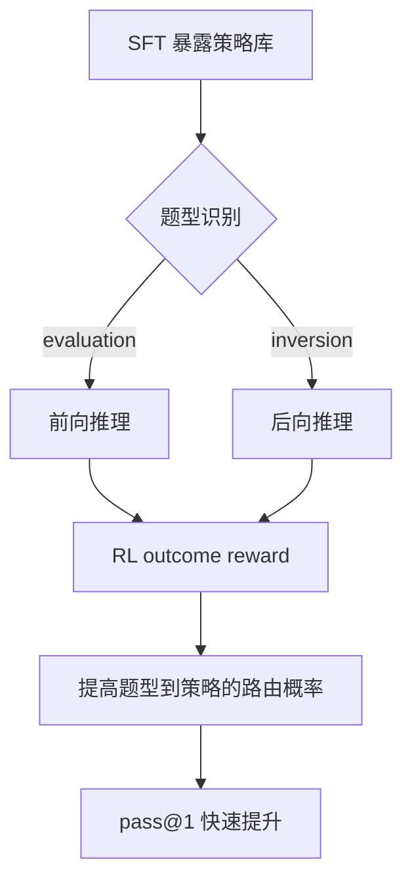
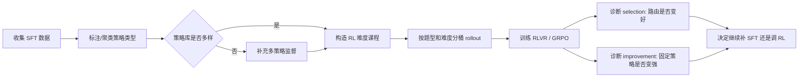

# Select and Improve：后训练不是凭空发明推理，而是在选择与打磨已有策略

### 元信息

| 项目 | 内容 |
| --- | --- |
| 标题 | Select and Improve: Understanding the Mechanics of Post-Training for Reasoning |
| 作者 | Akshay Krishnamurthy、Audrey Huang、Nived Rajaraman |
| 机构 | Microsoft Research NYC、UIUC |
| 日期 | 2026-06-11 |
| 原文 | https://arxiv.org/abs/2606.13125 |
| 主题 | 大模型后训练、RLVR、数学推理、机制分析 |

### TL;DR

1. 这篇论文问的是：**RL 后训练为什么能提升推理模型？** 作者没有直接提出新算法，而是用可控的有限域算术任务，把后训练收益拆成两个机制：`strategy selection` 和 `strategy improvement`。
2. `strategy selection` 指模型在 SFT 阶段已经见过多种解题策略后，RL 学会把不同题型路由到更合适的策略。论文中，混合前向/后向推理的模型在 6-9 步难题上接近完美，而单一策略模型只能提升自己的天然题型。
3. `strategy improvement` 指 RL 在更难的数据上继续打磨已有策略，使策略能推广到更长链条、更难问题。它不是从零创造新能力，而是把已存在的模式延展到更困难的分布。
4. 关键数字来自 Table 1：混合策略模型在 6-9 步验证集上的 pass@1 从 SFT 的 47.0% 到 RL(2-5) 的 60.0%，再到 RL(6-9) 的 95.7%。这说明“容易 RL 数据”主要触发选择，“更难 RL 数据”才触发改进。
5. 实验模型是 Qwen2.5-1.5B-Instruct，SFT 数据 2048 条，RL 数据 1024 个 prompt，使用 GRPO、outcome reward、LoRA rank 64、`alpha=128`、dropout 0.05。设置足够小，但控制变量非常清楚。
6. 局限也明确：任务是合成的有限域算术，不能直接推出真实数学、代码或通用 Agent 的全部后训练规律；论文没有证明 RL 永远不能产生新能力，只是在这组实验里没有观察到“从零涌现”。
7. 对后训练实践的启发是：不要只调 RL recipe。若 SFT/预训练没有提供足够多样的策略库，RL 很可能只能放大已有偏置；若 RL 数据难度没有超过 SFT 分布，泛化改进也会很有限。

### 研究问题：RL 后训练到底在学什么？

作者把问题压缩成两个可检验的问题：

1. **机制问题**：RL 带来的能力提升，是因为模型学会了新策略，还是因为它更会使用已有策略？
2. **数据问题**：SFT 数据和 RL 数据分别控制哪些机制？多样性、难度、题型比例会如何改变训练动态？

这两个问题重要，是因为当前后训练讨论常把现象混在一起：

| 常见说法 | 论文想拆开的部分 |
| --- | --- |
| RL 让模型会“反思” | 反思样式可能只是已有轨迹被放大 |
| RL 提高数学能力 | 可能是题型到策略的路由变好了 |
| RL 产生新推理能力 | 至少在本文设置里，更像是选择和改进已有模式 |
| 更多 RL 数据一定更好 | 数据难度和 SFT 策略覆盖度决定收益边界 |

论文的判断可以概括为：

```text
RL 后训练收益 = 策略库是否足够多样 + RL 数据是否迫使策略变强
```

这个式子不是论文的正式定理，而是对实验结论的抽象：

1. **策略库** 来自预训练和 SFT。
2. **路由能力** 由 RL 在反馈中学习。
3. **泛化提升** 依赖更难的 RL 数据。
4. **所谓涌现现象** 需要先排除选择、放大、组合这些更朴素机制。

### 实验任务：为什么选择有限域算术？

作者没有直接拿 GSM8K 或代码题做分析，而是构造一个有限域算术任务。这个选择是全文的关键，因为它让策略、题型和难度都可控。

任务包含两类问题：

| 题型 | 直觉策略 | 例子式描述 | 机制意义 |
| --- | --- | --- | --- |
| Evaluation | 前向推理 | 给定起点和一串操作，按顺序算结果 | 检查模型能否执行顺序计算 |
| Inversion | 后向推理 | 给定最终结果和操作链，反推未知输入 | 检查模型能否逆向撤销操作 |

有限域使用抽象符号，例如 `e0, e1, ...`，再把它们映射到模运算元素。这样做有三个好处：

1. **削弱预训练记忆捷径**：模型不能只靠熟悉的自然数算术模板答题。
2. **保留推理结构**：前向、后向、组合、长链条仍然能模拟数学推理里的关键动作。
3. **方便定义分布外难度**：SFT 用 2-5 步，RL 或验证用 6-9 步、甚至 6-15 步。

可以把任务抽象成一个状态转移问题：

```text
输入:
  field_map: 符号 e_i 到 GF(p) 元素的置换
  problem_type: evaluation 或 inversion
  operations: Add / Multiply 序列
  steps: 操作步数

前向策略:
  state = 起点
  for op in operations:
    state = op(state)
  output = symbol(state)

后向策略:
  state = 已知结果
  for op in reversed(operations):
    state = inverse(op)(state)
  output = symbol(state)
```

这个抽象说明，论文关心的不是“模型会不会算术”，而是：

1. 模型是否知道**什么时候用前向策略**。
2. 模型是否知道**什么时候用后向策略**。
3. 模型是否能把一个短策略延展到更长链条。
4. RL 是否能在反馈中改变这些行为。

### 训练设置：小模型、小数据，但变量控制很干净

实验基座是 `Qwen2.5-1.5B-Instruct`。作者采用 LoRA 训练，而不是全参训练。

| 阶段 | 关键设置 |
| --- | --- |
| SFT | 2048 个 prompt-response pair |
| SFT 轮数 | 20 epochs |
| SFT optimizer | AdamW |
| SFT 学习率 | `2 x 10^-4` |
| SFT batch size | 16 |
| LoRA | rank 64, `alpha=128`, dropout 0.05 |
| RL | 1024 个 prompt |
| RL 方法 | GRPO + outcome reward |
| RL batch size | 32 |
| RL group size | 8 |
| KL 参数 | `beta=0.05` |
| rollout temperature | 0.7 |
| RL 学习率 | `1 x 10^-5` |
| RL 步数 | 500-1000 steps |
| checkpoint | 每 25 steps 保存 |

训练设计里有三种 SFT 策略配置：

1. **F-only**：只监督前向解法。
2. **B-only**：只监督后向解法。
3. **FB mixed**：同一类题可以看到前向或后向风格，策略来源更丰富。

然后作者改变 RL 数据分布：

| RL 数据 | 与 SFT 的关系 | 用来检验什么 |
| --- | --- | --- |
| 2-5 步 | 与 SFT 难度相同 | 是否只靠同分布 RL 就能提升泛化 |
| 6-9 步 | 比 SFT 更难 | 是否触发策略改进 |
| 6-15 步 | 更强分布外难度 | 结论是否在极端难度下仍成立 |
| 题型倾斜 | evaluation/inversion 比例改变 | 策略放大是否只是策略选择的外显结果 |

### 机制一：Strategy Selection 是“会选策略”

`strategy selection` 的核心不是创造新推理模式，而是把问题匹配到已有模式。

在这篇论文里：

1. evaluation 题最适合前向推理。
2. inversion 题最适合后向推理。
3. 如果 SFT 只教一种策略，模型在另一类题上有天然短板。
4. 如果 SFT 同时暴露多种策略，RL 可以学会路由。

作者在 Figure 2-4 中展示了这个动态：

| 证据位置 | 支持的结论 |
| --- | --- |
| Figure 2 | GF(11) 主实验中，混合策略模型的提升主要来自正确路由 |
| Figure 3 | B-only 在 inversion 上提升明显，F-only 在 evaluation 上近饱和；混合模型 aggregate 接近完美 |
| Figure 4 | 分题型和步数的 reward 曲线显示，单策略模型在不适配题型上没有改善 |

这里最值得注意的是：混合模型不是因为 RL 发现了第三种神秘策略，而是因为 SFT 给了它两个候选策略。

用流程图表示：



这个图解释了为什么作者说选择是“最大驱动因素”：

1. 选择机制发生得快。
2. 它能在已有策略正确但使用不稳定时迅速提高准确率。
3. 它解释了许多“某种推理痕迹变多”的现象。

### Strategy Amplification：放大不是独立机制

论文还讨论了 `strategy amplification`，也就是某些推理模式在 RL 后更常出现。

作者用倾斜数据集验证这个现象：

| RL 数据比例 | 观察到的现象 |
| --- | --- |
| 50-50 evaluation/inversion | 前向生成比例接近 evaluation 比例 |
| 75-25 evaluation/inversion | 前向生成比例随 evaluation 倾斜而上升 |
| 90-10 evaluation/inversion | 前向生成比例进一步贴近数据分布 |

作者的解释是：

1. 如果 RL 数据里 evaluation 更多，正确策略更多时候是前向。
2. RL 学到的是题型路由。
3. 结果上看，前向风格被“放大”了。
4. 因而 amplification 是 selection 的可见副作用，而不是第三个独立机制。

这对理解 DeepSeek-R1 之后常说的“aha moment”“backtracking 变多”很有帮助：

1. 某种行为出现得更多，不等于 RL 从零发明了这种行为。
2. 需要检查这种行为是否已经存在于预训练或 SFT 分布。
3. 还要检查 reward 是否只是把高收益轨迹的概率质量集中起来。

### 机制二：Strategy Improvement 是“把已有策略练强”

`strategy improvement` 的定义更严格：

1. 模型已经有某个策略。
2. RL 数据比 SFT 数据更难。
3. 后训练后，模型在更难验证集上的同一策略执行能力变好。

最清楚的证据来自 Table 1。作者比较了 SFT、同难度 RL(2-5)、更难 RL(6-9) 在 6-9 步验证集上的 pass@1。

| 模型/训练 | All | Inv | Eval | 解读 |
| --- | ---: | ---: | ---: | --- |
| B-only SFT | 24.5 | 38.9 | 11.9 | 后向策略只适配 inversion，evaluation 很弱 |
| B-only RL(2-5) | 18.4 | 25.6 | 10.1 | 同难度 RL 没带来泛化，甚至下降 |
| B-only RL(6-9) | 50.8 | 96.0 | 11.6 | 更难 RL 显著强化了后向策略在 inversion 上的表现 |
| F-only SFT | 57.0 | 10.7 | 97.1 | 前向策略对 evaluation 已接近饱和 |
| F-only RL(2-5) | 48.0 | 9.3 | 91.7 | 同难度 RL 不提升 |
| F-only RL(6-9) | 58.3 | 11.0 | 99.3 | evaluation 略升，inversion 仍无改善 |
| FB mixed SFT | 47.0 | 27.1 | 64.3 | 有策略库，但初始路由和执行还弱 |
| FB mixed RL(2-5) | 60.0 | 32.2 | 91.5 | 主要是选择机制改善，evaluation 明显提升 |
| FB mixed RL(6-9) | 95.7 | 94.1 | 97.1 | 选择和改进同时出现，接近完美 |

这张表有三个强结论：

1. **同难度 RL 不够**：`RL(2-5)` 对单策略模型没有泛化收益。
2. **更难数据触发改进**：`RL(6-9)` 让 B-only 在 inversion 上从 38.9 到 96.0。
3. **策略多样性和难度课程叠加最强**：FB mixed 在 `RL(6-9)` 后达到 95.7 aggregate pass@1。

用一个公式式解释：

```text
令 R(s, x) 表示策略 s 在问题 x 上的成功概率。

Strategy selection:
  学习 argmax_s R(s, x)
  重点是选择哪个 s。

Strategy improvement:
  在固定或已选策略 s 上提高 R(s, x_hard)
  重点是让 s 能处理更难的 x。

论文观察:
  若 SFT 没有提供 s，RL 很难从零创造 s。
  若 RL 数据没有 x_hard，R(s, x_hard) 很难提升。
```

### Composition 实验：组合能力也需要种子

作者进一步引入 composition problems：

1. 一个 prompt 串联多个 evaluation/inversion 子问题。
2. 模型必须顺序解决每个子问题。
3. 前一个子问题的结果会传到下一个子问题。
4. 这比单题型更像真实推理里的中间状态传播。

他们比较两种 SFT 配置：

| SFT 配置 | RL 数据 | 结果 |
| --- | --- | --- |
| 含 2-part composition 样例 | 3-5 part composition | RL 能把组合能力延展到更长链条 |
| 不含 composition 样例，只含 evaluation/inversion | 3-5 part composition | RL 没有学会组合，尽管单个子技能存在 |

这部分的意义很大：

1. 单个技能存在，不代表模型自然会组合这些技能。
2. RL 可以延展组合技能，但需要 SFT 阶段提供组合种子。
3. “会 f(x)” 和 “会 g(x)” 不自动推出“会 f(g(x))”。
4. 后训练是否能组合旧技能，可能取决于预训练/SFT 中有没有组合轨迹。

用伪代码表示 composition 的难点：

```text
Input:
  subproblems = [p1, p2, ..., pn]
  shared_field_map
  initial_state

State:
  carry = initial_state

for p in subproblems:
  local_answer = solve(p, carry)
  if local_answer is wrong:
    return failure
  carry = transform(local_answer)

Output:
  final_symbol(carry)

Failure boundary:
  单步策略正确不足够；
  中间状态传递错误会累积；
  未见过组合轨迹时，RL reward 很稀疏。
```

### 消融与鲁棒性：不是单个超参偶然

附录里有两类鲁棒性检查。

第一类是 SFT 学习率：

| 模型 | lr=1e-4 | lr=2e-4 默认 | lr=5e-4 |
| --- | ---: | ---: | ---: |
| B | 0.0856 | 0.0859 | 0.0863 |
| F | 0.0857 | 0.0858 | 0.0862 |
| FB | 0.0879 | 0.0879 | 0.0884 |

这些 validation cross-entropy 很接近，说明 SFT 结论不太依赖某个学习率点。

第二类是 RL 超参：

| 配置 | B | F | FB | 观察 |
| --- | ---: | ---: | ---: | --- |
| lr=1e-5, group=8, beta=0.05 | 53% | 60% | 97% | 默认配置，整体强 |
| lr=1e-5, group=8, beta=0.1 | 53% | 58% | 96% | 接近默认 |
| lr=1e-5, group=16, beta=0.05/0.1 | 58%/53% | 51%/52% | 98%/97% | FB 仍强 |
| lr=5e-5 变体 | 波动较大 | 波动较大 | 部分退化 | 学习率过高更不稳定 |

作者还把 GF(11) 扩展到 GF(13)，并把难度从 6-9 步扩展到 6-15 步：

1. GF(13) 中，三类模型在 2-5 步 SFT 验证上都能到 70-80%。
2. 进入 6-9 步 RL 后，只有 mixed reasoning 模型接近完美。
3. 6-15 步更难设置下，mixed reasoning 仍有明显提升。
4. inversion 子集的提升继续支持 strategy improvement 的解释。

### 相关工作位置：它把几条后训练解释线合在一起

论文与近两年 RL 后训练机制研究的关系，可以这样放置：

| 相关线索 | 代表问题 | 本文的位置 |
| --- | --- | --- |
| Policy sharpening | RL 是否只是压低熵、集中概率 | 本文承认放大存在，但把它归入选择的外显现象 |
| Echo chamber / origin dependence | RL 是否逃不出预训练来源 | 本文提供控制实验支持“策略依赖 SFT/预训练” |
| Skill composition | RL 是否能组合旧技能 | 本文认为可以延展，但需要组合种子 |
| RLVR 扩展边界 | RL 是否真正扩展能力边界 | 本文给出更保守答案：至少本设置中主要是选择与改进 |
| 数据课程 | 更难数据是否必要 | 本文用 RL(2-5) vs RL(6-9) 给出清楚对照 |

这种定位让论文比普通 benchmark 报告更有价值：

1. 它不是只说“方法 A 比方法 B 高几点”。
2. 它把观察到的后训练收益拆成可复现实验因素。
3. 它提供了一个解释框架，帮助判断某个新 RL recipe 到底改进了什么。

### 证据边界与局限

这篇论文的结论需要放在边界里读。

| 边界 | 为什么重要 |
| --- | --- |
| 合成任务 | 有限域算术可控，但不等于真实数学、代码、长程工具调用 |
| 小模型 | Qwen2.5-1.5B-Instruct 的动态不一定等于更大 reasoning model |
| outcome reward | 结论主要针对可验证奖励任务，不覆盖偏好奖励、过程奖励、复杂人类反馈 |
| LoRA 训练 | 参数更新受适配器结构影响，和全参 RL 可能不同 |
| 策略可标注 | 前向/后向策略容易分类，真实推理策略常更模糊 |
| 未观察到新能力 | 这不是“不可能有新能力”的证明，只是该设置下没有看到从零学会策略 |

最容易误读的一点是：

```text
论文不是说 RL 没用。
论文说 RL 很有用，但它的作用依赖前序数据给出的策略空间。
```

另一个容易误读的是：

```text
论文不是说难题越难越好。
论文说 RL 数据需要形成有效课程：
  太容易 -> 只会触发选择或无收益；
  太难 -> reward 可能过稀疏，训练不稳定；
  稍难且可探索 -> 更可能触发 improvement。
```

### 对后训练实践的启发

如果把本文结论转成训练 pipeline 的检查表，可以得到五个问题。

| 检查项 | 应问的问题 | 对应机制 |
| --- | --- | --- |
| SFT 策略覆盖 | 训练数据里是否有多种可用解法？ | selection |
| 策略标签/可诊断性 | 能否看出模型用了哪类策略？ | selection 分析 |
| RL 难度课程 | RL prompt 是否比 SFT 更难但仍可探索？ | improvement |
| 组合种子 | SFT 是否包含组合轨迹，而不只是原子技能？ | composition |
| 分桶评测 | 是否按题型、难度、策略拆分指标？ | 机制归因 |

这也解释了为什么“只堆 RL tokens”可能低效：

1. 如果策略库窄，RL 只能在窄策略内压概率。
2. 如果 RL 数据与 SFT 同难度，模型可能只是更自信地做旧题。
3. 如果评测只看 aggregate，可能把路由改善误认为深层能力提升。
4. 如果没有策略追踪，所谓“涌现”可能只是可见轨迹比例变了。

### 一个更实用的后训练设计模板

基于论文，可以构造一个更偏研究工程的流程：



这个模板的关键不是某个算法，而是把后训练决策拆成两类：

1. **补策略**：当模型没有可选策略时，先回到 SFT/预训练数据。
2. **练策略**：当策略存在但不够强时，用更难、分层、可验证的 RL 数据。

### 结论：后训练的主语可能不是 reward，而是数据中的策略空间

这篇论文最重要的贡献，是把“RL 提升推理”从一个黑箱说法拆成两个可观察机制：

1. `strategy selection`：从已有策略中选择合适策略。
2. `strategy improvement`：在更难数据上强化已有策略。

它给出的研究者视角判断是：

1. 后训练不应被孤立理解。
2. SFT/预训练决定模型有什么策略可选。
3. RL 数据决定这些策略是否被选择、放大或改进。
4. 机制诊断必须按题型、策略、难度拆分。

因此，这篇论文对大模型后训练领域的价值，不在于提供一个更高分 recipe，而在于提出了一个更可检验的问题框架：

```text
当一个模型在 RL 后变强时，
它到底是选对了旧策略，
还是把旧策略练强了，
还是确实学到了新策略？
```

在本文实验里，答案主要是前两者。这个结论保守，但很有用，因为它提醒研究者：下一个真正重要的问题，不是继续把所有提升都叫作“reasoning emergence”，而是设计实验去区分选择、改进、组合和真正的新能力获取。

### 参考链接

1. 原论文：https://arxiv.org/abs/2606.13125
2. HTML 版本：https://arxiv.org/html/2606.13125v1
3. DeepSeek-R1：https://arxiv.org/abs/2501.12948
4. Self-improvement in language models: the sharpening mechanism：https://arxiv.org/abs/2412.01951
5. ProRL: Prolonged Reinforcement Learning Expands Reasoning Boundaries：https://arxiv.org/abs/2505.24864
