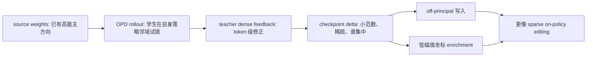

# Dense Supervision, Sparse Updates：OPD 为什么有密集监督，却只改动稀疏子网？

### 元信息

| 项目 | 内容 |
|---|---|
| 原文 | [Dense Supervision, Sparse Updates: On the Sparsity and Geometry of On-Policy Distillation](https://arxiv.org/abs/2606.13657) |
| 类型 | 论文 |
| 方向 | 大模型后训练、On-policy distillation、参数几何 |
| 作者 | Guo Yu、Wenlin Liu、Yulan Hu、Hao-Xuan Ma、Jun-Peng Jiang、Han-Jia Ye |
| 日期 | 2026-06-11 |
| 代码 | [SydCS/OPD-Param-Analysis](https://github.com/SydCS/OPD-Param-Analysis) |

### TL;DR

- 这篇论文问的是一个后训练机制问题：**OPD 同时拥有“学生自己采样”的 on-policy 数据和“教师 token 级反馈”的密集监督，它到底像 SFT、离线蒸馏，还是像 RLVR？**
- 作者不主要看 reward curve，而是看 checkpoint delta：令 \(\Delta W = W_{\text{trained}} - W_{\text{src}}\)，逐层分析更新范数、坐标稀疏、模块能量、SVD 谱、source principal subspace alignment 和低幅值坐标覆盖。
- 核心结论是：OPD 的监督信号虽然密集，但最终更新仍然是**小范数、坐标稀疏、FFN-heavy、full-rank 但谱集中、远离源模型主奇异方向**的结构；它更接近 sparse on-policy editing，而不是 dense supervised rewriting。
- 主表里 6 个 OPD-style 样本的相对 Frobenius 范数只有 `0.036%` 到 `0.142%`，可见坐标稀疏度在 `66.72%` 到 `89.50%`；离线蒸馏对照则是 `11.936%` 范数、`3.06%` 稀疏度。
- 这个稀疏结构不是事后描述。作者用 full-OPD delta mask 重新训练 DS-Qwen OPD，只训练约 `17.5%` 坐标，AIME24/AIME25 平均 peak mean@16 达 `35.10%`，接近 full OPD 的 `35.52%`。
- 但稀疏不等于可以丢掉 AdamW。JustRL-teacher OPD 中，AdamW peak/final mean@16 是 `43.02%/42.40%`，SGD 是 `39.06%/37.92%`；二阶矩变异系数平均 `4.85`，说明 dense teacher feedback 仍保留强坐标异质性。
- 论文局限也明确：多数证据来自 final checkpoint 静态分析，干预实验集中在 DS-Qwen 和 Qwen2.5-VL 的数学推理任务；更大模型、agentic/embodied 任务、完整训练轨迹和行为变化还没有被系统验证。

### 1. 研究问题：OPD 位于 SFT 和 RLVR 之间，但参数更新会落在哪边？

论文的切入点不是“OPD 能不能提高分数”，而是：

- **SFT / 离线 KD**：
  - 样本来自固定数据或教师示范；
  - token-level 标签密集；
  - 风险是训练轨迹和模型测试时自己的生成分布不一致。
- **RLVR**：
  - 样本来自当前策略；
  - 信号常是序列级 reward 或 verifier 结果；
  - 更新常被观察到是小子网、off-principal、接近 sparse editing。
- **OPD**：
  - 样本也来自当前学生策略；
  - 但教师在学生生成轨迹上给密集 token 级反馈；
  - 因而它把“on-policy distribution”和“dense supervision”拼到了一起。

这个组合制造了一个很具体的分歧：

| 假设 | 预期参数行为 | 论文要验证什么 |
|---|---|---|
| 稀疏来自 reward 稀疏 | 换成 dense teacher feedback 后，OPD 应该更像 SFT/KD，参数会更密集地被重写 | 如果成立，OPD delta 应该更大、更 dense、更贴近 source principal directions |
| 稀疏来自 on-policy 训练分布 | 即使监督是 dense，模型仍在自己的行为邻域内修补，因此 delta 仍可能稀疏且 off-principal | 如果成立，OPD 应该保留 RLVR 类似的稀疏子网和几何偏置 |

作者的主张是第二种：**决定 OPD 权重几何的关键不只是 reward 是否稀疏，而是训练样本是否来自模型自己的策略分布。**

### 2. OPD 目标函数：密集监督作用在学生自己的轨迹上

论文把 OPD 写成一个简洁的诊断对象：

```text
给定 prompt x ~ D
学生策略 pi_theta 先生成 y = (y_1, ..., y_T)
教师 pi_T 不提供固定示范轨迹，而是在学生前缀 (x, y_<t) 上给分布反馈
训练目标是在这些学生生成前缀上最小化 teacher-student divergence
```

公式形式可以概括为：

$$
\mathcal{L}_{\mathrm{OPD}}(\theta)
=
\mathbb{E}_{x\sim\mathcal{D},\, y\sim\pi_\theta(\cdot|x)}
\left[
\sum_{t=1}^{T}
D\left(
\pi_T(\cdot|x,y_{<t})
\| 
\pi_\theta(\cdot|x,y_{<t})
\right)
\right]
$$

变量解释：

| 符号 | 含义 | 为什么重要 |
|---|---|---|
| \(x\) | prompt | 决定训练问题分布 |
| \(y\sim\pi_\theta(\cdot|x)\) | 学生当前策略生成的回答 | 这是 on-policy 部分，区别于固定 teacher traces |
| \(y_{<t}\) | 学生生成的前缀 | 教师反馈条件在学生自己的路径上 |
| \(\pi_T\) | teacher policy | 提供 dense token-level 分布或 divergence 目标 |
| \(D(\cdot\|\cdot)\) | KL、JS 或其他 token-level divergence | 这是 dense supervision 部分 |

因此，OPD 的关键不是“老师给了更多标签”这么简单。

- 教师没有强迫学生拟合一条外部固定轨迹。
- 教师是在学生已经走到的局部行为区域里提供修正。
- 如果学生的行为邻域已经接近某种能力流形，参数更新就可能像“局部编辑”而不是“全局重写”。

### 3. 作者怎么量化“改了哪里”？

论文把每个可匹配浮点 tensor 的最终 checkpoint 差分记为：

$$
\Delta W = W_{\mathrm{trained}} - W_{\mathrm{src}}
$$

然后从三类问题推进：

| 问题 | 指标 | 直觉 |
|---|---|---|
| 更新有多大、多少坐标动了 | relative norm、coordinate sparsity、top-coordinate energy | 区分 dense rewriting 和 sparse editing |
| 更新在模块里怎么分布 | FFN / Attention / Embedding / LM head 能量占比 | 看 OPD 是否主要写入 FFN，还是跨模块均匀更新 |
| 更新的几何方向是什么 | SVD top-k energy、stable rank、principal projection、low-magnitude coverage | 看它是否沿 source 主方向移动，还是写到低幅值、off-principal 坐标 |

几个核心公式：

$$
r = \frac{\|\Delta W\|_F}{\|W_{\mathrm{src}}\|_F}
$$

- \(r\)：相对更新规模。
- 如果 \(r\) 很小，说明最终 checkpoint 离源模型很近。
- 但小范数不代表功能不重要，所以需要再看稀疏和干预实验。

$$
s_\epsilon =
\frac{|\{i: |\Delta W_i|\le \epsilon\}|}{|\Delta W|}
$$

- \(s_\epsilon\)：阈值 \(\epsilon\) 下的坐标稀疏度。
- 主表使用 \(\epsilon=10^{-5}\)，匹配 bfloat16 checkpoint delta 分析。
- 稀疏度高表示大部分坐标没有阈值可见的移动。

$$
\frac{\|U_k^\top \Delta W V_k\|_F^2}{\|\Delta W\|_F^2}
$$

- \(U_k,V_k\)：源权重矩阵 \(W_{\mathrm{src}}\) 的 leading singular vectors。
- 这个值低，表示更新没有主要沿源模型已有的高能主方向移动。
- 论文进一步用 low-magnitude mask 证明 OPD 更倾向写入源权重幅值较小的坐标。

### 4. 主表证据：dense teacher feedback 没有制造 dense delta

论文最重要的一张表是 global delta statistics。

| Pair | Rel. norm | Sparsity | Top-16 SVD energy | Stable rank | Principal coverage | Low-mag coverage |
|---|---:|---:|---:|---:|---:|---:|
| Qwen-Math Distill | 11.936% | 3.06% | 8.57% | 82.74 | 9.95% | 10.10% |
| DeepScaleR RLVR | 0.073% | 77.89% | 19.62% | 16.07 | 5.29% | 31.26% |
| DS-Qwen OPD | 0.047% | 82.58% | 26.92% | 9.97 | 4.81% | 38.04% |
| DS-Qwen OPD (JustRL) | 0.108% | 70.43% | 40.94% | 7.25 | 5.46% | 23.04% |
| MiniCPM OPD | 0.069% | 81.65% | 26.81% | 12.32 | 5.39% | 39.42% |
| Qwen2.5-VL OPD | 0.142% | 66.72% | 30.52% | 12.58 | 5.23% | 24.99% |
| Qwen3-1.7B OPD | 0.045% | 79.03% | 19.69% | 20.31 | 4.45% | 34.69% |
| Qwen3 OPSD | 0.036% | 89.50% | 26.19% | 7.77 | 4.39% | 48.57% |

这张表支持三层判断：

- **规模上，OPD delta 很小**：
  - 6 个 OPD-style 对象的相对范数都低于 `0.15%`；
  - 离线蒸馏对照是 `11.936%`，差了两个数量级。
- **坐标上，OPD delta 很稀疏**：
  - OPD 稀疏度范围是 `66.72%` 到 `89.50%`；
  - 离线蒸馏只有 `3.06%`，基本是 dense rewrite。
- **几何上，OPD 更像 on-policy update**：
  - principal coverage 只有 `4.39%` 到 `5.46%`，低于 10% 随机基线；
  - low-magnitude coverage 达 `24.99%` 到 `48.57%`，说明更新偏向源权重幅值小的位置。

这里最有解释力的是 DS-Qwen OPD (JustRL)。

- JustRL RLVR 自身相对范数更大：`0.497%`。
- 稀疏度也更低：`34.68%`。
- 但拿 JustRL 做 teacher 的 OPD 又回到 OPD-style：
  - 相对范数 `0.108%`；
  - 稀疏度 `70.43%`；
  - top-16 SVD energy `40.94%`；
  - stable rank `7.25`。

这削弱了一个简单解释：**OPD 稀疏不是因为 teacher 自己稀疏，而是 OPD 的 on-policy student rollout 训练方式在起作用。**

### 5. 模块结构：OPD 不是只动某一层，但能量经常 FFN-heavy

论文没有把“稀疏”理解成“只改最后几层”。

- Layerwise sparsity 显示，OPD 更新分布在 transformer 多层中。
- 早期层平均稀疏度在 low-80% 区间。
- 后期层会降到约 70%。
- 各主要投影矩阵仍保持显著稀疏。

模块能量表更具体：

| Pair | FFN | Attention | Embedding | LM head | Other |
|---|---:|---:|---:|---:|---:|
| DeepScaleR RLVR | 83.89 | 11.41 | 2.06 | 2.64 | 0.00 |
| DS-Qwen OPD | 85.88 | 11.11 | 0.55 | 2.46 | 0.00 |
| MiniCPM OPD | 65.06 | 21.01 | 4.69 | 9.23 | 0.00 |
| Qwen2.5-VL OPD | 81.40 | 10.52 | 3.48 | - | 4.60 |
| Qwen3-1.7B OPD | 69.70 | 27.03 | 3.27 | - | 0.00 |
| Qwen3 OPSD | 62.31 | 37.36 | 0.33 | - | 0.00 |

可以带走两个细节：

- **FFN-heavy 是主趋势**：
  - DS-Qwen OPD 的 FFN 能量占 `85.88%`；
  - Qwen2.5-VL OPD 是 `81.40%`；
  - MiniCPM OPD 是 `65.06%`。
- **但不是 FFN-only**：
  - Qwen3 OPSD attention 能量达到 `37.36%`；
  - Qwen3-1.7B OPD attention 也有 `27.03%`。

这对参数高效 OPD 很关键：

- 如果直接给 LoRA/OFT/adapter 一个均匀预算，可能浪费在低能模块上。
- 如果只改 FFN，又可能错过 Qwen3 OPSD 这类 attention-heavy 设置。
- 更合理的后续方向是按 checkpoint delta 或在线 proxy 自适应分配模块预算。

### 6. Mask overlap：OPD 和 RLVR 触碰的不是随机子网

作者进一步问：

- OPD 稀疏只是“稀疏度一样”吗？
- 还是它真的和 RLVR 更新到了相互重叠的能力子网？

他们用 one-sided coverage 比较可见更新 mask。

| Model family | 对比方向 | Random baseline | Observed | 解释 |
|---|---:|---:|---:|---|
| DS-Qwen | DeepScaleR RLVR -> DS-Qwen OPD | 17.50% | 53.21% | 约 3.04 倍随机 |
| DS-Qwen | DS-Qwen OPD -> DeepScaleR RLVR | 22.11% | 67.20% | 约 3.04 倍随机 |
| Qwen2.5-VL | GRPO -> OPD | 33.28% | 73.53% | 约 2.21 倍随机 |
| Qwen2.5-VL | OPD -> GRPO | 13.44% | 29.69% | 约 2.21 倍随机 |
| DS-Qwen | DeepScaleR-teacher OPD -> JustRL-teacher OPD | 29.57% | 80.17% | 约 2.71 倍随机 |
| DS-Qwen | JustRL-teacher OPD -> DeepScaleR-teacher OPD | 17.50% | 47.45% | 约 2.71 倍随机 |

这张表的意义是：

- OPD 和 RLVR 不只是“都稀疏”。
- 它们的可见更新坐标有显著交集。
- 这种交集可能对应模型在推理能力上需要被编辑的局部结构。
- 但 OPD mask 和 RLVR mask 不是完全一样，所以不能把 RLVR mask 当成 OPD 的完整替代。

### 7. 干预实验：只训练 OPD 发现的子网，几乎恢复 full OPD

最重要的功能性实验是 mask training。

作者先从 full OPD 得到 mask：

$$
m_i = \mathbb{1}\{|\theta_{\mathrm{full},i} - \theta_{0,i}| > \tau\}
$$

其中 \(\tau=10^{-5}\)。

然后重新从源 checkpoint \(\theta_0\) 开始训练：

```text
Input:
  theta_0: source checkpoint
  teacher: OPD teacher
  mask m: 可训练坐标集合
  tau = 1e-5

State:
  theta starts from theta_0
  frozen coordinates are restored after every optimizer step

Loop:
  1. 学生 rollout 当前策略回答
  2. teacher 在学生前缀上给 dense feedback
  3. 计算 OPD loss
  4. 只保留 mask 内梯度
  5. optimizer step
  6. 恢复 mask 外坐标，避免 decoupled weight decay 造成移动

Output:
  masked-OPD checkpoint
  compare with full OPD, RLVR-mask OPD, random-mask OPD
```

DS-Qwen 的关键数字：

| 训练方式 | Mask 密度 | Peak mean@16 over AIME24/AIME25 | Late average |
|---|---:|---:|---:|
| Full OPD | 100% | 35.52% | 34.27% |
| OPD mask | 约 17.5% | 35.10% | 34.73% |
| RLVR mask | 约 22.1% | 34.69% | 未作为主结论 |
| Random mask | 约 17.5% | 32.92% | 更低 |

这说明：

- OPD delta mask 不是随便省参数。
- 只训练那些 full OPD 真正移动过的坐标，能接近 full training。
- 随机同密度 mask 也能提升，但明显更弱。
- RLVR mask 可用，说明 overlap 有功能意义；但不完全等价，说明 OPD 有自己的编辑结构。

Qwen2.5-VL 的 appendix 也重复了这个模式：

| 训练方式 | Geo3K peak | Final | Last-5 average |
|---|---:|---:|---:|
| Full OPD | 55.72% | 54.94% | 54.65% |
| Full-OPD mask | 54.24% | 54.23% | 53.86% |
| Random mask same density | 52.30% | 未作为主结论 | 更低 |
| GRPO mask | 49.98% | 未作为主结论 | 更低 |
| Random GRPO-density mask | 47.40% | 未作为主结论 | 更低 |

所以作者把 OPD delta 称为一种 sparse task vector 是有根据的：

- 它来自训练后的最终权重差；
- 它稀疏；
- 它携带功能变化；
- 它不是经典 lottery ticket 式剪枝后才发现的结构，而是在 OPD checkpoint delta 里自然浮现。

### 8. AdamW/SGD 消融：静态稀疏不等于优化器可以简化

论文最容易被误读的一点是：

- 如果 OPD delta 稀疏；
- 如果 RLVR 里 SGD 有时能竞争 AdamW；
- 那 OPD 是否也可以直接用 SGD？

作者的实验给出否定答案。

| 设置 | Optimizer | Learning rate | Peak mean@16 | Final mean@16 |
|---|---|---:|---:|---:|
| JustRL-teacher OPD | AdamW | 1e-6 | 43.02% | 42.40% |
| JustRL-teacher OPD | SGD | 1e-2 | 39.06% | 37.92% |

解释路径是：

- OPD 虽然 on-policy，但每个 generated token 都有教师监督。
- 这让梯度不再像 sparse reward 那样只从序列级信号回传。
- 参数最终可能稀疏，但训练过程中的坐标尺度仍然非常不均匀。

作者检查 AdamW optimizer state：

- 一阶 momentum alignment：
  - 开始约 `0.958`；
  - 平均仍为正，约 `0.280`；
  - 结束掉到 `0.008`；
  - 期间短暂转负。
- 二阶矩 coefficient of variation：
  - 平均 `4.85`；
  - 表示 \(\sqrt{v_t}\) 在坐标之间差异很大。

这给出一个更细的判断：

- AdamW 的 momentum 不是稳定解释全部优势的原因。
- 但 adaptive coordinate-wise scaling 仍然有用。
- 因此不能从“final delta 稀疏”直接推出“训练时 SGD 足够”。

### 9. 几何结果：full-rank 但谱集中，远离 source principal directions

论文在几何部分处理了两个常见混淆。

#### 9.1 不是 strict low-rank，但能量高度集中

作者发现：

- OPD update matrix 在数值 rank 上通常是 full-rank。
- 但 top singular values 捕获了相当多 Frobenius energy。

关键数字：

| Pair | Top-16 SVD energy | Stable rank |
|---|---:|---:|
| DS-Qwen OPD | 26.92% | 9.97 |
| MiniCPM OPD | 26.81% | 12.32 |
| Qwen2.5-VL OPD | 30.52% | 12.58 |
| Qwen3-1.7B OPD | 19.69% | 20.31 |
| Qwen3 OPSD | 26.19% | 7.77 |
| Qwen-Math Distill | 8.57% | 82.74 |

正确解读是：

- 只看 numerical rank，会误以为 OPD 不适合低秩方法。
- 只看 top-k energy，会误以为 OPD 就是低秩更新。
- 更准确的说法是：**OPD delta full-rank，但能量谱集中；低秩方法可能捕获核心能量，却不应被期待精确复现完整 delta。**

#### 9.2 不沿源模型主方向走，而是写入低幅值坐标

source-principal 分析说明：

- 在 \(k=10\%\) rank fraction 下，主 OPD 样本的 median joint principal projection 都低于 `1%`。
- 10% source-principal coordinate mask 覆盖可见 OPD 更新的比例只有 `4.39%` 到 `5.46%`。
- 但 bottom 10% source-magnitude coordinates 覆盖比例达到 `24.99%` 到 `48.57%`。

这说明 OPD 不是把源模型已有高能方向继续放大。

更像是：



这个图的关键不是“低幅值坐标一定更安全”，而是：

- 源模型主方向代表已有高能结构；
- OPD 没有主要沿这些方向移动；
- 它在低幅值坐标里写入较多可见更新；
- 这与 RLVR 的 off-principal 结果相互呼应。

### 10. 实验设置：覆盖了哪些模型和任务？

论文的静态 delta 分析包括 10 个模型对。

| 类别 | 模型对 | 数据/信号 |
|---|---|---|
| 离线蒸馏对照 | Qwen2.5-Math-1.5B -> DS-Qwen | DeepSeek-R1 teacher public checkpoint |
| RLVR 参考 | DS-Qwen -> DeepScaleR-1.5B | verifier/reward signal |
| OPD | DS-Qwen -> DS-Qwen OPD | DeepScaleR teacher，DAPO-Math-17K |
| RLVR 参考 | DS-Qwen -> JustRL | simple fixed-hyperparameter recipe |
| OPD | DS-Qwen -> DS-Qwen OPD (JustRL teacher) | DAPO-Math-17K |
| OPD | MiniCPM5-1B-SFT -> MiniCPM5-1B OPD | public OPD checkpoint |
| VLM RLVR | Qwen2.5-VL-3B-Instruct -> GRPO checkpoint | Geo3K |
| VLM OPD | Qwen2.5-VL-3B-Instruct -> OPD | NoisyRollout-7B teacher，Geo3K |
| OPD | Qwen3-1.7B-Base -> Qwen3-1.7B OPD | Qwen3-4B-Base-GRPO teacher |
| OPSD | Qwen3-4B -> Qwen3 OPSD | OpenThoughts_math_30k subsets |

两个控制训练配置尤其重要：

| 设置 | DS-Qwen OPD | Qwen2.5-VL OPD |
|---|---|---|
| Student | DeepSeek-R1-Distill-Qwen-1.5B | Qwen2.5-VL-3B-Instruct |
| Teacher | DeepScaleR-1.5B 或 JustRL-DeepSeek-1.5B | NoisyRollout-Geo3K-7B |
| 数据 | DAPO-Math-17K / AIME24+AIME25 | Geo3K train/test |
| Loss | \(k_1\) policy-gradient style OPD，无 task reward | Forward-KL top-k OPD，top-k=32，无 task reward |
| Rollout | vLLM，n=4 responses per prompt | vLLM，n=1 response per prompt |
| Optimizer | AdamW lr=1e-6；消融 SGD lr=1e-2 | AdamW lr=1e-6 |
| 训练 | 1 epoch，每 10 steps eval | 10 epochs，每 10 steps eval |

代码仓库目前更像分析工具而不是完整训练复现包。

- README 说明核心入口是 `scripts/analyze_opd_delta.py`。
- 该脚本支持 safetensors、pytorch bin、dtensor sharded torch checkpoint。
- 它计算 abs/relative sparsity、SVD top-k energy、stable rank、principal projection、mask coverage 等指标。
- 仓库也包含 `analyze_delta_mask_overlap.py`，对应论文的 mask overlap 分析。

这意味着可复现性边界要分开看：

- **delta 分析工具**：公开。
- **所有训练配置和 checkpoint 获取链路**：论文描述较完整，但读者仍需自行准备 checkpoint。
- **完整 OPD 训练运行**：依赖 verl、thunlp/OPD、OPSD 等外部实现和原配置。

### 11. 相关工作位置：这不是又一个 OPD recipe，而是 post-training geometry 论文

论文与几个方向的关系：

| 方向 | 论文的位置 |
|---|---|
| OPD / GKD / MiniLLM | 不提出新目标函数，而是分析已有 OPD 风格训练到底如何改权重 |
| RLVR 子网研究 | 接续“RLVR fine-tunes small subnetworks”的发现，问 dense teacher feedback 是否会破坏这种稀疏性 |
| source geometry / off-principal updates | 接续 RLVR 远离 source principal directions 的观察，把问题扩展到 OPD |
| LoRA / OFT / BOFT | 用 full-rank but spectrally concentrated 解释为什么低秩可能有效但不是完整答案 |
| Muon / high-pass optimizer | 指出 OPD 的谱结构可能不适合 vanilla Muon 的 spectral normalization，需要 OPD-native optimizer 实验 |

它的贡献不在于“OPD 分数更高”。

更准确的贡献是：

- 给 OPD 建立了一套 weight-space diagnostic；
- 把 dense supervision 和 sparse update 这两个表面冲突的现象统一起来；
- 通过 masked training 证明静态 delta 的一部分确有功能意义；
- 通过 AdamW/SGD 消融提醒大家不要把 RLVR 优化器结论直接搬到 OPD。

### 12. 结论与局限：这篇文章改变了什么判断？

我认为这篇论文最有价值的判断是：

> OPD 的密集监督没有把模型变成“被教师轨迹全面重写”的学生；只要轨迹来自学生自己的策略，它仍然可能以稀疏、off-principal、谱集中的方式完成能力编辑。

这对后训练研究有几个直接启发：

- **参数高效 OPD**：
  - 不应只问 LoRA rank 多大；
  - 应问哪些模块、哪些坐标、哪些 source-geometry 区域承载 OPD task vector。
- **优化器选择**：
  - final delta 稀疏不代表训练梯度简单；
  - OPD 的 dense teacher feedback 仍可能需要 AdamW 的 adaptive scaling。
- **能力编辑与安全**：
  - 如果 OPD 主要写入低幅值、off-principal 坐标，后续可以研究这种写入是否更容易隔离、回滚或审计；
  - 但论文没有证明这些坐标天然安全，也没有研究 adversarial 后训练。
- **Agent / 长程任务后训练**：
  - 当前实验集中在数学推理和 VLM 几何；
  - agentic tool-use、长期记忆、embodied control 的 OPD delta 是否同样稀疏，还完全开放。

局限需要写清：

- 静态分析依赖 final checkpoint delta，不能揭示完整训练动态。
- 稀疏阈值和 bfloat16 checkpoint 表示有关，虽然作者提供了多阈值 appendix，但主结论仍依赖数值可见性定义。
- 干预实验主要是 DS-Qwen 与 Qwen2.5-VL；大模型和更多任务没有覆盖。
- mask training 证明“这些坐标足够有用”，但没有证明“这些坐标是唯一最优子网”。
- 代码仓库公开了分析入口，但完整训练复现需要额外 checkpoint、数据和外部训练框架。

### 13. 细读库存：哪些细节真正支撑了论文主张？

为了避免把这篇论文读成一句“OPD 稀疏”，这里把关键证据按 claim → mechanism → evidence → boundary 再整理一次。

| 主张 | 机制解释 | 证据 | 边界 |
|---|---|---|---|
| OPD 不是 dense rewriting | 样本来自学生当前策略，教师只在学生已到达的前缀上给密集反馈 | OPD 相对范数最高 `0.142%`，离线蒸馏对照 `11.936%` | 只比较了有限模型对，且主表依赖最终 checkpoint |
| 稀疏坐标有功能意义 | full OPD delta mask 标出可训练子网，重新训练时冻结 mask 外坐标 | DS-Qwen OPD mask peak `35.10%`，接近 full OPD `35.52%` | 不证明 mask 唯一最优，也不证明训练早期即可发现 |
| OPD 和 RLVR 共享部分能力子网 | 两者都在当前策略分布附近改写模型，只是反馈来源不同 | DS-Qwen RLVR->OPD observed `53.21%`，随机基线 `17.50%` | overlap 是坐标覆盖，不直接等于行为机制完全一致 |
| OPD 不是严格低秩 | 数值 rank 仍可满秩，但能量集中在少数奇异方向 | OPD top-16 energy 常在 `19.69%` 到 `40.94%` | 低秩 adapter 能抓住部分能量，但不能完整复现 delta |
| AdamW 仍有必要 | dense teacher feedback 让坐标尺度异质性保留 | AdamW final `42.40%`，SGD final `37.92%`；二阶矩 CV 平均 `4.85` | 只做了 JustRL-teacher OPD 的直接消融 |

这个库存说明，论文最强的证据并不来自单个指标。

- 如果只有相对范数小，可能只是训练不足。
- 如果只有稀疏度高，可能只是数值阈值选择。
- 如果只有 SVD 能量集中，可能只是普通低秩现象。
- 如果只有 mask overlap，可能只是同任务同模型的巧合。
- 但当这些指标同时出现，并且 masked retraining 能恢复性能时，论文的解释就更有分量。

### 14. Figure 和 Table 逐项证据解读

论文虽然有图，但核心信息可以用表格和指标还原。

#### Figure 1：OPD 在四个维度上同时接近 on-policy sparse updates

Figure 1 对应主表的可视化。

- 它不是单独展示“稀疏”。
- 它把四个信号放在一起：
  - relative norm；
  - coordinate sparsity；
  - spectral concentration；
  - source geometry coverage。

这张图支持的结论是：

- OPD 的相对范数接近 RLVR，而不是离线蒸馏。
- OPD 的稀疏度接近 RLVR，而不是离线蒸馏。
- OPD 的 top-16 SVD energy 高于离线蒸馏，说明更新能量更集中。
- OPD 的 principal coverage 低、low-magnitude coverage 高，说明它不是沿源模型已有主方向重写。

它不能证明的是：

- 这些几何特征直接导致性能提升；
- 每一种 OPD recipe 都会稳定出现同样模式；
- 更大模型或更长任务也有同样比例。

#### Figure 2：稀疏不是层级局部，而是跨层稀疏子网

Figure 2 展示 DS-Qwen OPD 的 layerwise sparsity。

重点在于：

- 更新不是只集中在最后几层。
- 早期层、后期层、不同 projection 都有阈值可见和不可见坐标。
- 稀疏度后段下降，说明后层更活跃，但没有变成 dense。

这对工程设计有直接影响：

- 不能简单说“只调最后 N 层就等于 OPD 子网”。
- 也不能简单说“只调 FFN 就足够”，因为 attention 在某些设置里占比不低。
- 如果要做 OPD adapter，最好让预算能跨层分布，再由指标或在线信号决定模块权重。

#### Table 3：FFN-heavy 是趋势，但不是定律

Table 3 最值得看的是例外。

- DS-Qwen OPD 的 FFN 能量 `85.88%`，很支持 FFN-heavy。
- Qwen2.5-VL OPD 的 FFN 能量 `81.40%`，也支持这个趋势。
- 但 Qwen3 OPSD 的 attention 是 `37.36%`。
- Qwen3-1.7B OPD attention 是 `27.03%`。

因此更稳妥的结论是：

> OPD 往往把主要能量写进 FFN，但不同模型、teacher 和任务会改变 attention 的角色。

这个区别很重要。

- 对数学推理小模型，FFN 可能承载更多中间能力编辑。
- 对 VLM 或不同架构，attention 可能承担更多跨模态或路径选择作用。
- 对 agentic trajectory，未来甚至可能出现 tool token、memory token、retrieval token 相关模块更活跃。

#### Figure 3：masked training 和 optimizer ablation 是功能性证据

Figure 3 左侧问：

- full OPD delta mask 是不是有用？
- RLVR mask 能否替代？
- random mask 是否只是同样参数预算？

答案是：

- OPD mask 几乎贴近 full OPD。
- RLVR mask 也能训练，但略弱。
- random mask 更弱。

Figure 3 右侧问：

- 既然 final delta 稀疏，SGD 是否足够？

答案是：

- SGD 明显落后 AdamW。
- 稀疏 final support 和训练动态不能混为一谈。

这两个子图形成了一个很好的张力：

- 稀疏子网是真实有用的。
- 但训练这个子网的优化过程仍然复杂。

### 15. 失败案例与反例：论文自己给了哪些边界？

这篇论文没有把结论说满，几个反例尤其值得保留。

#### JustRL 是 RLVR 里的边界样本

JustRL RLVR 的相对范数是 `0.497%`。

- 它比 DeepScaleR RLVR 的 `0.073%` 大很多。
- 稀疏度 `34.68%`，也远低于 DeepScaleR RLVR 的 `77.89%`。
- principal coverage `8.34%`，更接近随机 10% 基线。

这说明：

- 不是所有 RLVR 都高度稀疏。
- 训练长度、recipe、阶段设计可能让 on-policy update 变得更宽。
- 因而“on-policy 一定稀疏”不是论文结论。

但反过来，JustRL-teacher OPD 又回到 `70.43%` 稀疏度。

- 这让它成为一个关键对照。
- 它说明 teacher checkpoint 本身更宽，并不必然让学生 OPD delta 也更宽。

#### Qwen2.5-VL OPD 是 OPD 里的宽更新样本

Qwen2.5-VL OPD 的相对范数 `0.142%`。

- 这是 6 个 OPD-style 样本里最高的。
- 稀疏度 `66.72%`，也是 OPD 样本中较低的一侧。
- 但它仍远小于离线蒸馏的 `11.936%` 相对范数。

这说明：

- VLM 或任务差异会让 OPD 更新更宽。
- OPD 稀疏不是固定比例，而是一个结构趋势。
- 如果未来扩展到多模态 agent 或 embodied task，应重新测量，而不是直接套用 DS-Qwen 结论。

#### SGD 消融是对“稀疏就简单”的反例

如果只看 final delta，可以形成一个诱人但错误的工程假设：

- delta 稀疏；
- 训练也许只需要稀疏优化；
- SGD 可能足够。

论文用 AdamW/SGD 结果打断了这个推理。

- AdamW 的 final mean@16 是 `42.40%`。
- SGD 的 final mean@16 是 `37.92%`。
- 二阶矩 CV 平均 `4.85`。

这表明：

- 稀疏 support 是结果形态。
- dense teacher supervision 仍然产生强坐标尺度差异。
- 优化器是否需要 adaptive scaling，要看训练动态，而不是只看最终 mask。

### 16. 复现实验该怎么拆？

如果要把这篇论文变成后续实验计划，我会按四层复现。

| 层级 | 目标 | 最小动作 | 主要风险 |
|---|---|---|---|
| 静态 delta 复现 | 验证主表指标 | 准备 source/trained checkpoints，运行 `analyze_opd_delta.py` | checkpoint 版本、dtype、tensor key 对齐 |
| Mask overlap 复现 | 验证 OPD/RLVR 子网重叠 | 对两个训练后 checkpoint 生成 visible-update mask | mask density 差异导致 one-sided coverage 解读困难 |
| Masked retraining | 验证子网是否功能充分 | 从 source checkpoint 重启 OPD，只训练 mask 内坐标 | 训练配置、teacher、rollout backend 必须一致 |
| Optimizer ablation | 验证 AdamW/SGD 差异 | 固定 teacher 和数据，替换 AdamW/SGD | learning rate 公平性、训练步数、评测方差 |

最容易复现的是第一层。

- 官方仓库 README 给出的入口是 `scripts/analyze_opd_delta.py`。
- 输入是 source HuggingFace checkpoint 和 OPD-trained checkpoint。
- 输出目录会保存 delta 分析结果。
- 脚本本身已经覆盖 safetensors、torch bin 和 sharded torch checkpoint。

最难复现的是第三层和第四层。

- 需要相同 teacher。
- 需要相同 rollout 设置。
- 需要保证 mask 外坐标在每一步后恢复。
- 需要避免 decoupled weight decay 偷偷移动冻结坐标。
- 还要用 AIME24/AIME25 或 Geo3K 的同一评测协议。

### 17. 对后训练方法设计的具体启发

这篇论文可以转化为四条方法设计假设。

#### 假设 A：OPD adapter 应该按 delta energy 分配模块预算

原因：

- FFN 能量常常高。
- 但 attention 在 Qwen3 OPSD 和 Qwen3-1.7B OPD 中不可忽略。

可做实验：

- uniform LoRA budget；
- FFN-biased LoRA budget；
- delta-energy-guided budget；
- online-gradient-energy-guided budget。

比较指标：

- final task score；
- update sparsity；
- source principal projection；
- top-k SVD energy；
- mask overlap with full OPD。

#### 假设 B：低幅值坐标是 OPD 的重要写入区

原因：

- bottom 10% source-magnitude coordinates 覆盖了 `24.99%` 到 `48.57%` 的可见 OPD 更新。

可做实验：

- 限制更新到低幅值坐标；
- 限制更新到 source-principal 坐标；
- 限制更新到随机同密度坐标；
- 对比能力、稳定性和遗忘。

关键边界：

- 低幅值坐标可能只是相关，不一定因果最优。
- 不同架构的 source magnitude 分布可能不可比。

#### 假设 C：OPD-native optimizer 应保留 adaptive scaling

原因：

- AdamW 优于 SGD。
- 二阶矩 CV 高。
- 但 momentum alignment 不稳定。

可做实验：

- AdamW；
- SGD；
- AdamW without momentum；
- RMSProp-like adaptive-only；
- high-pass Muon variants；
- layerwise adaptive scaling。

核心观察：

- final delta 是否仍稀疏；
- performance 是否稳定；
- optimizer state 是否与最终 mask 对齐。

#### 假设 D：Agent OPD 可能比数学 OPD 更宽

原因：

- 论文没有覆盖 tool-use、long-horizon memory、environment interaction。
- agentic task 的状态空间更非平稳，轨迹更长，反馈对象更多。

可做实验：

- Web task OPD；
- coding agent OPD；
- tool-use trajectory OPD；
- memory update OPD。

重点指标：

- 更新是否仍 FFN-heavy；
- tool token 周边模块是否更活跃；
- attention update 是否上升；
- mask 是否跨 episode memory 相关模块集中。

### 18. 一句话结论

这篇论文真正值得带走的是：

- **OPD 的 dense supervision 并没有自动带来 dense parameter rewriting。**
- **只要训练轨迹来自学生自己的策略分布，最终更新仍可能呈现 sparse、off-principal、spectrally concentrated 的 on-policy 后训练结构。**
- **但优化过程仍受 dense teacher feedback 影响，不能把 RLVR 的 optimizer 经验直接迁移到 OPD。**

这个结论把“后训练 recipe”从经验菜单推进到可测量的参数几何。

- 以后讨论 OPD 不应只问分数。
- 还应问它改了哪些坐标、哪些模块、哪些奇异方向。
- 更应问这些坐标是否能被提前发现、压缩、约束、回滚和审计。

### 19. 继续追问

- 如果 OPD delta 是 sparse task vector，能否在训练中在线发现 mask，而不是先 full OPD 再回放？
- 如果 top-16 SVD energy 已有 `19.69%` 到 `40.94%`，LoRA rank、OFT 约束和模块预算该如何联合选择？
- 如果 low-magnitude coordinate coverage 高，是否能设计一种“低幅值坐标优先”的 OPD adapter？
- 如果 AdamW 的二阶矩异质性是关键，OPD-native optimizer 是否应该保留 adaptive scaling，但重写 momentum 或谱归一化？
- 如果 agentic task 的行为分布更长、更非平稳，OPD 还会保持同样的 sparse/off-principal 结构吗？

这篇论文的研究价值在于，它没有把后训练只当成外部 benchmark 分数问题，而是把“模型到底在哪里被改写”放回中心。对于正在做 reasoning model、VLM post-training 或 agent 后训练的人来说，这个视角比单纯争论 OPD、RLVR、SFT 谁更强更有后续研究空间。
