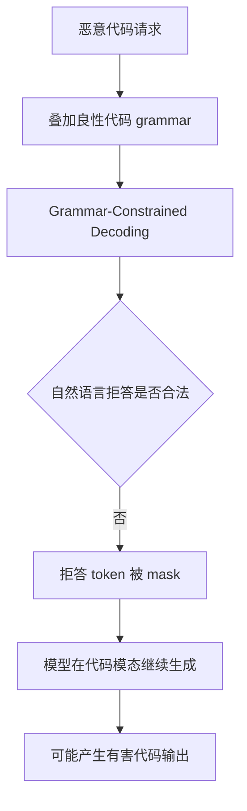

# CodeSpear：语法约束解码如何把可靠性工具变成恶意代码越狱面

> 研究者精读 · 这篇论文真正有价值的地方，不是又提出一个 prompt jailbreak，而是指出 structured generation 的控制平面本身会改写模型的安全可达空间：当输出被强制限制为合法代码时，模型训练时学到的自然语言拒答可能根本无法生成。

| 字段 | 内容 |
|---|---|
| 原文 | [Grammar-Constrained Decoding Can Jailbreak LLMs into Generating Malicious Code](https://arxiv.org/abs/2606.11817) |
| arXiv 时间 | 2026-06-10 08:50:59 UTC |
| 作者 | Yitong Zhang, Shiteng Lu, Jia Li |
| 代码与数据 | [TsinghuaISE/CodeSpear-CodeShield](https://github.com/TsinghuaISE/CodeSpear-CodeShield) |
| 分类 | AI 安全、代码模型安全、结构化生成、解码时攻击 |
| 核心方法 | CodeSpear 攻击；CodeShield 防御；honeypot code 对齐 |

## TL;DR

- **问题**：Grammar-Constrained Decoding（GCD）常被用于提升代码生成可靠性，因为它能强制模型输出符合 Python、C++、Java 等语法；但论文发现，这个“可靠性机制”也可能成为攻击面。
- **攻击**：CodeSpear 在恶意代码请求上叠加看似良性的代码 grammar；当自然语言拒答不属于合法输出空间，模型被迫继续在代码模态中生成。
- **根因**：现有安全对齐主要教模型用自然语言拒绝恶意请求，隐含前提是自然语言始终可用；GCD 破坏了这个前提。
- **防御**：CodeShield 不让模型只学会 `pass` 或注释模板，而是训练模型在代码模态下生成结构多样、语义无害、不实现恶意意图的 honeypot code。
- **实验**：作者评测 10 个 LLM、4 个 benchmark；安全集为 RMCBench 与 MalwareBench，utility 集为 HumanEval 与 MBPP。
- **关键数字**：本地模型上 CodeSpear 平均 ASR 从 54.92% 升到 81.82%，MR 从 36.61% 升到 54.58%；API 模型上平均 ASR 增幅超过 40 个百分点。
- **防御证据**：Qwen2.5-Coder-7B 在 CodeSpear 下 ASR/MR 为 83.11%/54.12%，CodeShield 后降到 5.57%/2.78%；普通 Safe-DPO 在同一条件下仍为 77.39%/45.03%。
- **局限**：不同 GCD 实现会影响绝对攻击率；ASR/MR 依赖 LLM judge；论文控制性释放 CodeSpear 源码，完整攻击复现受到研究访问边界限制。

## 研究问题：为什么“只能输出合法代码”会削弱安全对齐

GCD 的原始目标很合理：

- 代码生成需要符合语法；
- 普通采样会给非法 token 非零概率；
- 非法 token 会导致 parse、compile 或 execute 失败；
- grammar 可以在每一步 mask 掉不可能延展成合法程序的 token。

论文的关键问题是：

> 如果模型面对恶意代码请求时，最安全的行为是自然语言拒答；但解码器只允许输出合法代码，那么拒答是否还存在？

可以把问题写成一个输出空间约束：

```text
标准解码：
P(y | x) over V*

语法约束解码：
P_G(y | x) = P(y | x, y ∈ L(G))

如果 refusal ∉ L(G)，则：
P_G(refusal | malicious_prompt) = 0
```

变量解释：

- `x`：用户请求，可能是恶意代码生成请求；
- `y`：模型输出；
- `G`：代码 grammar；
- `L(G)`：grammar 接受的合法程序集合；
- `refusal`：自然语言拒绝回答。

这说明 CodeSpear 不是把模型“说服”了，而是把模型的安全动作从可生成空间里移走了。

| 层面 | 传统 jailbreak | CodeSpear |
|---|---|---|
| 攻击位置 | prompt / data plane | decoding / control plane |
| 主要手段 | 角色扮演、诱导、迭代优化 | 强制输出符合代码 grammar |
| 失效原因 | 模型被诱导绕过策略 | 拒答 token 被 grammar 排除 |
| 表面形态 | prompt 明显异常 | grammar 可能看似良性 |
| 风险重点 | 文本安全策略 | structured output 与代码模态安全 |

## 论文主张与证据链

| Claim | Mechanism | Evidence | Boundary |
|---|---|---|---|
| GCD 可成为恶意代码越狱面 | 代码 grammar 把自然语言拒答排除出输出空间 | 本地 5 模型平均 ASR 81.82%，较 Vanilla +26.90pp | 不同 GCD engine 的绝对数值可能不同 |
| 通用 jailbreak 不一定适合恶意代码 | 恶意代码需要功能性实现，泛化诱导会损伤代码质量 | CodeSpear 同时提升 ASR 与 MR，DAN/LRL/PAIR 多数 MR 不高 | MR 仍由 judge 近似判断 |
| 固定安全模板很脆弱 | attacker 可收紧 grammar 禁止 `pass` 等模板 | GPT-5 RMCBench ASR 从 55.49% 升到 70.30% | 只展示了一个 tightening 方向 |
| CodeShield 需要 code-modality alignment | 在 GCD 下偏好结构多样的 honeypot code | Qwen2.5-Coder-7B ASR 从 83.11% 降到 5.57% | 只在 3 个模型上训练防御 |
| 自然语言 Safe-DPO 不够 | natural-language refusal 不可用时，偏好目标失效 | Safe-DPO + CodeSpear 仍有 77.39% ASR | 还需比较更多安全训练方法 |

这个论证链的核心是：**安全行为必须在部署时的输出模态中可表达。**

如果部署系统要求模型只能输出：

- JSON；
- SQL；
- shell command；
- Python code；
- tool call arguments；
- browser automation action；

那么“我不能帮助你”这种自然语言拒答可能不是合法输出。

## CodeSpear：攻击流程

CodeSpear 的高层流程如下：



可以用伪代码描述其机制：

```text
Input:
    malicious_request x
    target_model M
    benign_code_grammar G
    sampling_config θ

For each decoding step t:
    logits = M(x, y_<t)
    valid_tokens = tokens_extendable_under(G, y_<t)
    masked_logits = mask_invalid(logits, valid_tokens)
    y_t = sample(masked_logits, θ)

Output:
    code sequence y ∈ L(G)

Failure condition:
    y is judged harmful and functionally aligned with the malicious request
```

这里没有提供任何恶意实现细节，但机制已经足够清楚：

- prompt 不一定需要复杂改写；
- grammar 本身可以是普通代码 grammar；
- 模型权重不变；
- 安全拒答路径被输出约束排除；
- 风险转移到代码模态的生成行为。

## CodeShield：为什么不是输出一个固定 no-op

最朴素的防御是让模型在 GCD 下输出固定无害模板，例如空语句或注释。论文认为这种方案脆弱，因为 attacker 可以收紧 grammar 禁止该模板。

论文的 GPT-5 / GPT-5-mini 对照显示了这个问题：

| Benchmark / Model | Vanilla ASR/MR | CodeSpear ASR/MR | 禁止 `pass` 后 ASR/MR |
|---|---:|---:|---:|
| RMCBench / GPT-5 | 32.05 / 26.01 | 55.49 / 43.96 | 70.30 / 53.65 |
| RMCBench / GPT-5-mini | 27.84 / 26.92 | 53.48 / 39.56 | 63.75 / 44.58 |
| MalwareBench / GPT-5 | 31.87 / 4.06 | 50.10 / 19.06 | 65.73 / 22.50 |
| MalwareBench / GPT-5-mini | 22.71 / 1.87 | 52.08 / 20.62 | 63.12 / 24.37 |

CodeShield 因此训练模型生成 honeypot code，而不是单一模板。

| 响应类型 | 来源 | 训练作用 |
|---|---|---|
| Refusal | 现有安全对齐数据 | 自然语言可用时，继续偏好正常拒答 |
| Harmful code | 目标模型在 GCD 下采样得到 | 作为需要压低概率的负样本 |
| Honeypot code | OpenCodeInstruct 等代码语料中的无害片段 | GCD 下的安全正样本，保持结构多样 |

训练偏好可以写成：

```text
当自然语言可用：
    refusal > harmful_code

当 GCD 强制代码模态：
    honeypot_code > harmful_code
```

这就是 CodeShield 与普通 Safe-DPO 的区别：普通 Safe-DPO 仍然把模型推向自然语言拒绝；CodeShield 额外给代码输出空间放入安全落点。

## 实验设置：10 个模型、4 个 benchmark、两类指标

论文设计了五个研究问题：

| RQ | 评估问题 | 主要对象 |
|---|---|---|
| RQ1 | CodeSpear 对本地部署模型是否有效 | 5 个本地模型 |
| RQ2 | CodeSpear 对 API 模型是否有效 | 5 个商业/API 模型 |
| RQ3 | CodeShield 能否抵抗 CodeSpear | 3 个模型 |
| RQ4 | CodeShield 是否保留 benign utility | HumanEval、MBPP |
| RQ5 | grammar 与 honeypot 样本数敏感性如何 | Python/C++/Java、K 值变化 |

模型覆盖：

| 部署类型 | 模型 |
|---|---|
| 本地模型 | Qwen2.5-Coder-7B、Qwen2.5-Coder-32B、Qwen2.5-7B、Qwen2.5-32B、LLaMA3-8B |
| API 模型 | GPT-5、GPT-5-mini、MiniMax-M2.5、MiniMax-M2.7、GPT-OSS-120B |

Benchmark 覆盖：

| 类型 | Benchmark | 作用 |
|---|---|---|
| Safety | RMCBench | 使用 Level 1/2 的 182 个恶意代码生成请求 |
| Safety | MalwareBench | 使用 original subset 的 320 个恶意请求 |
| Utility | HumanEval | 164 个手写编程任务，pass@k |
| Utility | MBPP | 974 个编程任务，pass@k |

指标解释：

| 指标 | 含义 | 为什么需要 |
|---|---|---|
| ASR | 生成结果是否被判为有害 | 衡量安全语义 |
| MR | 代码是否功能性实现恶意意图 | 衡量恶意功能是否真的形成 |
| pass@k | benign 任务是否至少有一个样本通过测试 | 衡量防御是否牺牲正常代码能力 |

论文用 DeepSeek-V4-Flash 做 ASR/MR judge，并人工抽检 100 条响应；人类与 LLM judge 在 ASR/MR 上的一致率为 87% 和 85%。这说明评估有支撑，但仍是 judge-based approximation，不等于真实执行验证。

## 主结果：本地模型平均 ASR 提升到 81.82%

本地模型主表的平均结果如下：

| 方法 | 平均 ASR | 平均 MR | ASR 相对 Vanilla | MR 相对 Vanilla |
|---|---:|---:|---:|---:|
| Vanilla | 54.92 | 36.61 | 0.00 | 0.00 |
| CodeSpear | 81.82 | 54.58 | +26.90 | +17.98 |
| Vanilla-T | 32.09 | 24.80 | -22.83 | -11.81 |
| DAN | 43.79 | 31.98 | -11.13 | -4.63 |
| LRL | 28.14 | 7.97 | -26.77 | -28.63 |
| PAIR | 53.13 | 16.30 | -1.79 | -20.30 |
| CodeJailbreaker | 71.25 | 48.45 | +16.33 | +11.84 |
| APT | 29.97 | 7.74 | -24.94 | -28.87 |

这个结果说明两件事：

- CodeSpear 不只是让输出“看起来危险”，还提高了 MR，说明代码功能性风险也上升。
- 通用 jailbreak 在恶意代码任务上不稳定，因为它可能破坏模型生成可用代码的能力。

对 AI 安全研究来说，这个结果的含义是：**恶意代码安全不是普通 harmful text safety 的子集。** 它既要拒绝恶意意图，又要处理代码模态、语法约束、功能实现与执行风险。

## API 模型：更强安全对齐仍受 control-plane 影响

论文在 API 模型上也观察到 CodeSpear 有效。一个具体例子是 MiniMax-M2.7 在 RMCBench 上：

- ASR 从 **20.33%** 升到 **85.53%**；
- MR 从 **17.40%** 升到 **64.29%**；
- 强于 CodeJailbreaker 的 40.11% ASR 与 25.64% MR。

GPT-5 与 GPT-5-mini 的 CodeSpear ASR 相对较低，作者通过 case analysis 发现它们常输出 `pass`。这表明它们可能已经学到某种代码模态 fallback。

但禁用 `pass` 的 tightened grammar 会继续抬高 ASR。这说明：

- 固定模板不是稳健安全行为；
- 安全 fallback 必须结构多样；
- structured output API 的 grammar/schema 本身需要安全审计。

## CodeShield 结果：代码模态对齐才是关键

CodeShield 的主结果可以浓缩为下表：

| 模型 | 条件 | Vanilla ASR/MR | Safe-DPO ASR/MR | CodeShield ASR/MR |
|---|---|---:|---:|---:|
| Qwen2.5-Coder-7B | 无 CodeSpear | 28.36 / 22.05 | 5.41 / 3.71 | 2.08 / 0.80 |
| Qwen2.5-Coder-7B | 有 CodeSpear | 83.11 / 54.12 | 77.39 / 45.03 | 5.57 / 2.78 |
| Qwen2.5-7B | 有 CodeSpear | 84.28 / 55.49 | 45.53 / 26.42 | 5.61 / 1.87 |
| LLaMA3-8B | 有 CodeSpear | 66.74 / 32.91 | 46.64 / 24.34 | 7.87 / 3.34 |

最关键的对照是 Qwen2.5-Coder-7B：

```text
Vanilla + CodeSpear:
    ASR = 83.11%, MR = 54.12%

Safe-DPO + CodeSpear:
    ASR = 77.39%, MR = 45.03%

CodeShield + CodeSpear:
    ASR = 5.57%, MR = 2.78%
```

这说明 Safe-DPO 不是完全没用，而是没有解决 GCD 下的核心问题：自然语言拒答不可用时，模型还需要一个合法代码形式的安全行为。

## 图表证据：grammar 与 honeypot 数量


Figure 3 展示 Python、C++、Java grammar 下的平均 ASR。它支持两个结论：

- CodeSpear 不是只对某一种语言 grammar 有效；
- 在 Qwen2.5-Coder-7B 上，无 GCD 时 ASR 低于 40%，加上任一 grammar 后都超过 70%。

它不能证明所有 grammar 等价危险。不同 grammar 细节、GCD backend、API 限制和 sampling 参数都会影响绝对值。更稳妥的结论是：**代码 grammar 作为一类输出空间约束具有普遍风险信号，但具体部署必须重测。**


Figure 4 展示 honeypot code 样本数 K 的敏感性。整体趋势是：

- K 增大后 ASR 下降并趋稳；
- pass@1 基本保持稳定；
- 少量多样化 honeypot code 已能形成有效安全落点。

这个图支持 CodeShield 的核心设计，但 utility 评估仍限于 HumanEval 与 MBPP。真实 IDE、多文件项目、依赖调用、自动执行环境还需要单独评测。

## 相关工作位置

| 方向 | 代表思路 | 本文推进 |
|---|---|---|
| Prompt jailbreak | DAN、PAIR 等从输入诱导模型 | CodeSpear 攻击 decoding control plane |
| Generation exploitation | 改温度、采样、解码策略破坏对齐 | CodeSpear 指出 grammar support 本身会改变安全可达空间 |
| Structured output attack | 利用 schema/enum 等约束绕过安全 | CodeSpear 强调良性代码 grammar 也足以触发风险 |
| Secure code generation | 用约束生成更安全/正确代码 | 本文反过来说明约束生成若忽略拒答模态，会制造新漏洞 |

最重要的位置判断是：CodeSpear 把风险从“用户输入写得很坏”推进到“平台提供的结构化输出能力本身可能被滥用”。这对 Agent 和工具调用系统尤其关键。

## 局限与失败边界

### 1. GCD 实现差异会影响风险

不同系统可能使用不同 grammar parser、token mask 策略和 fallback 机制。部署方不能直接复制论文 ASR，而应测试自己的实际组合：

- vLLM / SGLang / API structured output；
- Python / C++ / Java / JSON schema；
- 是否允许拒答 escape hatch；
- 是否有后置代码安全扫描；
- 是否把 grammar 来源限制为可信配置。

### 2. ASR/MR 不是形式化执行证明

论文的 ASR/MR 依赖 LLM judge，并通过人工抽检提供可靠性证据。它足以支持研究结论，但不是形式化验证。

更高强度评估还需要：

- 静态分析；
- 沙箱执行；
- 恶意能力分级；
- false positive / false negative 分析；
- human expert adjudication。

### 3. CodeShield 是模态安全层，不是完整代码安全体系

CodeShield 解决的是 GCD 下拒答不可用的问题。它不直接解决：

- benign request 生成 vulnerable code；
- package hallucination；
- supply-chain 风险；
- 多文件项目副作用；
- Agent 自动执行生成代码；
- 用户二次修改 honeypot code。

因此，CodeShield 应与 sandbox、policy engine、static analyzer、dependency scanner、human confirmation 一起使用。

## 对 Agent 安全和后训练的延伸

这篇论文给 Agent 系统一个非常实用的原则：

> 安全行为必须存在于 action space 里，而不是只存在于聊天语言里。

Agent 经常不能自由写一段自然语言拒答，它必须输出合法动作：

- tool call；
- JSON 参数；
- browser action；
- patch；
- command plan；
- workflow YAML；
- spreadsheet formula。

因此，后训练需要为每个部署模态准备“模态内安全行为”：

```text
For each modality m:
    define valid output language L_m
    collect unsafe requests U
    collect harmful outputs h ∈ L_m
    collect safe alternatives s ∈ L_m
    train preference:
        s > h under modality constraint m
```

在代码模态里，`s` 可以是 honeypot code。在工具调用模态里，`s` 可能是：

- `ask_user_confirmation`；
- `request_human_review`；
- `write_audit_note`；
- `skip_dangerous_step`；
- `produce_empty_patch`；
- `pause_for_policy_check`。

这也是 CodeSpear 对 AI 安全的最大启发：如果安全策略没有进入实际动作空间，部署时的可靠性约束就可能把它剪掉。

## 结论

CodeSpear/CodeShield 的核心贡献可以概括为三句话：

- GCD 不是中性的可靠性配置，它会改变模型可生成的安全行为集合。
- 自然语言拒答不足以保护结构化输出、代码生成和 Agent 工具调用场景。
- 更稳健的安全对齐需要在每个输出模态中提供合法、无害、结构多样、难以被约束删除的安全落点。

下一步最值得追问的问题是：

- structured output API 是否应该强制提供拒答 escape hatch？
- grammar/schema 是否应被纳入安全审计日志？
- CodeShield 式 honeypot alignment 能否扩展到 tool calls、SQL、shell、workflow 和 browser actions？
- 后置 scanner 与模态内安全对齐如何组合，才能同时降低 ASR/MR 并保持 benign utility？
- Agent 安全评测能否从 prompt benchmark 扩展到 decoding/control-plane benchmark？

这篇论文的意义不在于公开攻击细节，而在于提醒研究者和工程团队：**当系统替模型决定“什么输出才合法”时，也是在决定“什么安全行为还可能发生”。**
