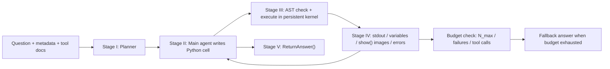

# SpatialClaw：把代码变成空间推理 Agent 的动作接口

### 元信息

- **论文**：SpatialClaw: Rethinking Action Interface for Agentic Spatial Reasoning
- **方法名**：SpatialClaw
- **作者**：Seokju Cho, Ryo Hachiuma, Abhishek Badki, Hang Su, Byung-Kwan Lee, Chan Hee Song, Sifei Liu, Subhashree Radhakrishnan, Seungryong Kim, Yu-Chiang Frank Wang, Min-Hung Chen
- **机构线索**：NVIDIA；KAIST AI
- **日期**：arXiv v1，2026-06-11
- **方向**：大模型 Agent；视觉语言模型；工具调用；空间推理；代码动作接口
- **原文**：[arXiv 摘要](https://arxiv.org/abs/2606.13673)；[PDF](https://arxiv.org/pdf/2606.13673)；[项目页](https://spatialclaw.github.io/)；[代码仓库](https://github.com/NVlabs/SpatialClaw)

### TL;DR

- **这篇论文做什么**：SpatialClaw 研究的不是“再给 VLM 接几个视觉工具”，而是问工具增强 Agent 的**动作接口**是否限制了空间推理能力。作者认为，复杂 3D/4D 空间问题需要反复组合深度、分割、相机位姿、轨迹和数值计算，固定 JSON tool-call 或一次性代码都不够。
- **核心方法**：SpatialClaw 让 VLM-backed Agent 每一步写一个 Python cell，在持久化 IPython kernel 中执行。输入帧、元数据、Depth Anything 3 重建、SAM3 分割、几何工具、NumPy、SciPy、Matplotlib 都作为可复用变量和函数留在同一工作区。
- **推理循环**：系统按 planning → code generation → code execution → feedback assembly → answer submission 五阶段运行；每一步把 stdout、变量摘要、异常、`show()` 注册的图像反馈回模型，直到 `ReturnAnswer()` 或达到步数上限 `N_max`。
- **实验设置**：作者在 20 个空间推理 benchmark 上评估，覆盖 single-image、multi-view、general spatial、video & 4D、general video understanding；使用 6 个开源 VLM backbone，来自 Qwen3.5/3.6 与 Gemma4 两个模型家族，参数从 26B 到 397B。
- **关键数字**：Gemma 4-31B 上，SpatialClaw 平均准确率 **59.9%**，比 no-tool baseline 的 **53.4%** 高 **+6.5 pp**，比 SpaceTools-Toolshed 的 **48.7%** 高 **+11.2 pp**。跨 6 个 backbone 都提升，最大 backbone 平均 **60.4%**，Qwen3.6-27B 提升 **+7.7 pp**。
- **消融证据**：在相同工具集和提示下，single-pass code 得 **55.2%**，structured tool-call 得 **56.7%**，code-as-action 得 **59.9%**。去掉 utility wrappers 后仍有 **56.4%**，说明收益不只来自预置工具函数，而来自可自由组合的代码接口。
- **局限**：剩余错误主要受 VLM 与感知工具质量限制；失败模式里仍有几何坐标、角度、投影关系处理错误、工具选择错误和不一致恢复失败。论文没有证明代码动作接口能消除感知瓶颈，也没有给出真实机器人闭环部署结果。

### 研究问题：Agent 的能力到底卡在工具，还是卡在动作接口？

论文的关键切入点是一个很容易被忽略的问题：

- 工具增强 Agent 常被描述为：
  - 给模型接入 detector、segmenter、depth estimator、pose estimator；
  - 让模型选择工具；
  - 用工具输出补足 VLM 原生视觉能力。
- 但 SpatialClaw 认为还缺一个更底层的问题：
  - **工具如何被调用？**
  - **工具输出如何被保存？**
  - **中间状态是否可观察？**
  - **Agent 能否在看到错误 mask、异常 depth、错误轨迹后修正策略？**

作者把这个层面称为 **action interface**：

| 接口类型 | Agent 能做什么 | 主要限制 |
|---|---|---|
| No-tool | 直接用 VLM 看图并生成自然语言推理 | 没有外部计算和可验证中间证据 |
| Single-pass code | 一次性写完整 Python 程序 | 执行前必须确定完整策略，不能边看中间结果边改 |
| Structured tool-call | 通过 JSON/XML 调预定义工具 | 工具组合受 schema 限制，测试时难表达临时几何计算 |
| SpatialClaw code-as-action | 每步写一个 cell，在持久 kernel 中组合、检查、修正 | 更强但也引入 sandbox、错误恢复、预算控制问题 |


这张图对应论文 Figure 2。它不是装饰图，而是整篇论文的核心主张：

- **single-pass code** 把代码当成一次性答案生成器；
- **structured tool-call** 把工具当成固定菜单；
- **SpatialClaw** 把代码当成可交互的空间分析工作台。

<u>更准确地说</u>：SpatialClaw 不是把 Python 作为“更复杂的 tool call 格式”，而是把 Python kernel 作为 Agent 的状态空间。

### 论文主张与证据链

| Claim | Mechanism | Evidence | Boundary |
|---|---|---|---|
| 动作接口会限制空间推理 Agent 能力 | 比较 no-tool、single-pass code、structured tool-call、code-as-action | 同工具同 prompt 下，SpatialClaw 59.9%，structured tool-call 56.7%，single-pass 55.2% | 结论限定在论文评测的 20 个空间 benchmark |
| 持久 kernel 让 Agent 能组合和修正证据 | masks、depth、camera geometry、plots 等变量跨 step 保留 | Figure 3 的五阶段 loop；Appendix E 描述 stateful IPython kernel | 需要 sandbox、timeout、错误压缩和强预算控制 |
| 关键收益来自组合，而不只是工具本身 | 代码能用 KDTree、norm、dot product、RANSAC 等临时计算 | Figure 6 中超过一半 win 归因于 code composition；control flow 19.5% | LLM-as-Judge 归因不是因果实验，只是 trace-level 分类 |
| 泛化不是靠 benchmark 特调 | 同一 system prompt、tool set、最大步数、输入预处理用于全部 benchmark/backbone | 6 个 backbone 全部提升；20 benchmark 中 19/20 对同 backbone 有提升 | 仍依赖底层 VLM、SAM3、DA3 的感知质量 |
| 失败仍主要来自几何与感知瓶颈 | 错误样本由 LLM-as-Judge 分到 11 类 | Figure 7 指出几何坐标/距离/角度/投影错误与感知错误突出 | 没有给出人类审计全部错误分类的可靠性上界 |

### 方法机制：持久 Python kernel 里到底有什么？

SpatialClaw 的工作区为每个样本初始化一次，样本结束后销毁。这个工作区暴露 6 类入口：

1. **`InputImages`**
   - 存放采样后的图片或视频帧。
   - Agent 可以直接索引帧、查看帧数量和后续工具输出。

2. **`Metadata`**
   - 包含 frame rate、duration、frame indices。
   - 视频题里如果问“某个时间点之前/之后”，Agent 可以把自然语言问题映射到帧序列。

3. **`tools`**
   - `tools.Reconstruct` 包装 Depth Anything 3。
   - 返回 per-frame depth、camera intrinsics、camera extrinsics、dense point maps。
   - `tools.SAM3` 负责 text / point / box prompt 的 image 或 video mask。
   - 还有 `tools.Mask`、`tools.Geometry`、`tools.Graph`、`tools.Draw`、`tools.Time` 等工具命名空间。

4. **`show(...)`**
   - 把中间图像注册到下一步模型上下文。
   - `matplotlib` 的图也可以通过同一机制进入反馈。

5. **`vlm`**
   - 调用隔离的 VLM 会话。
   - `vlm.locate(...)` 做 visual grounding，返回 bounding boxes。
   - `vlm.ask_with_thinking(...)` 处理工具外的视觉或常识问题。

6. **`ReturnAnswer(...)`**
   - 提交最终答案。
   - 格式不合要求时，loop 不直接成功终止。

这些入口共同构成一个可写、可看、可复用的计算环境。关键不是工具名更多，而是工具输出会成为普通 Python 变量：

```text

state_t = {
  InputImages,
  Metadata,
  variables_0..t,
  stdout_0..t,
  shown_images_0..t,
  exceptions_0..t
}

action_t = PythonCell(question, plan, state_t)

state_{t+1} = Execute(action_t, state_t)

```

这个公式化写法表达了论文最重要的设计：

- `state_t` 不是自然语言聊天历史，而是混合了变量、图像、异常和 stdout 的执行状态；
- `action_t` 不是一个 JSON 工具名，而是一段可组合的 Python cell；
- `state_{t+1}` 会保留此前中间物，允许后续 cell 重用或修正。

### detail inventory：这篇论文能落到哪些具体机制？

下面这张清单把论文里可检索的细节拆出来，避免只停在“用代码做工具调用”的口号层：

| 维度 | 论文里的具体对象 | 为什么重要 |
|---|---|---|
| 输入 | sampled frames、frame indices、duration、frame rate | 视频和 4D 题不能只看单帧，时间索引必须进入计算 |
| 视觉工具 | SAM3、Depth Anything 3、visual grounding、VLM reasoning session | 把对象、深度、相机、点云从像素中显式化 |
| 科学计算 | NumPy、SciPy、Matplotlib、KDTree、norm、dot product、RANSAC | 让 Agent 在测试时临时生成几何算法 |
| 状态 | masks、depth maps、camera intrinsics/extrinsics、dense point maps、plots | 中间产物不再是一次性文本，而是可复用变量 |
| 反馈 | stdout、变量摘要、traceback、`show()` 图像 | 下一步动作能基于真实执行结果修正 |
| 安全 | AST sandbox、regex guard、timeout、tool-call budget | 代码动作接口必须受控，否则能力和风险一起放大 |
| 评测 | 20 benchmark、5 类任务、6 个 backbone | 用大覆盖面证明接口收益不是单一数据集偶然 |
| 归因 | primitive usage、meta-category win/loss、LLM-as-Judge attribution、failure modes | 从结果分数走向机制解释 |

可以把 SpatialClaw 的一次推理抽象成如下伪代码：

```python
Input: question q, frames I, metadata m, tool docs D
State: persistent kernel K with InputImages, Metadata, tools, show, vlm, ReturnAnswer

plan = Planner(q, m, D)              # no image access
history = [plan]

for step in range(N_max):
    cell = MainAgent(q, history, K.summary(), shown_images=K.visual_feedback)
    verdict = ASTSandbox(cell)

    if verdict.rejected:
        history.append(verdict.error)
        continue

    result = K.execute(cell)
    feedback = {
        "stdout": result.stdout,
        "new_variables": summarize(result.variables),
        "visuals": collect_show_images(result),
        "error": condense_traceback(result.error),
    }
    history.append(feedback)

    if result.has_valid_ReturnAnswer():
        return result.answer

return fallback_answer(q, I, history, K.variables)
```

这个伪代码说明：

- planner 只给路线，不直接看图和写代码；
- sandbox 是动作执行前的硬门；
- feedback 是下一步 action 的真实观察；
- fallback 是预算耗尽后的兜底，而不是常规路径；
- 空间推理能力来自 `K.execute` 后的状态积累，而不是单次 prompt。

### 五阶段 loop：为什么不是直接让模型写代码？

论文 Figure 3 把 SpatialClaw 包成 5 个阶段：



#### Stage I：Planning

- Planner 是独立 LLM session。
- 它拿到 question、metadata、tool documentation。
- 它**不看输入图像**，目的是节约视觉上下文并避免先入为主。
- 它不能写可执行代码，也不能提前下结论。
- 它输出“要收集什么证据、可能怎么分析”的计划。

#### Stage II：Code generation

主 Agent 每一步输出结构化字段：

- `Purpose`：这一步要做什么；
- `Reasoning`：为什么这么做；
- `Next Goal`：下一步目标；
- `Code`：实际执行的 Python cell。

这个格式让每个动作都有可解释的局部意图，但真正改变环境的是 `Code`。

#### Stage III：Code execution

执行前会做静态检查：

- AST analyzer 拒绝 unsafe imports；
- 拒绝 file I/O、network access；
- 拒绝 `exec`、`eval` 等动态代码；
- 正则补充拦截 `.save`、`.to_csv` 等 method-style writes；
- 通过后才在 persistent kernel 中执行。

这点很重要，因为 SpatialClaw 把代码变成动作接口后，安全面显著变大。作者没有把这个问题轻描淡写，而是在 Appendix E 明确加入 sandbox。

#### Stage IV：Feedback assembly

反馈不是只把“工具返回值”转成一句话，而是组合多类信号：

- stdout；
- 新变量的 type、length、size；
- concise traceback；
- `show()` 注册的中间图；
- `matplotlib` 图像；
- 执行失败的压缩错误信息。

这使得 Agent 能看到：

- mask 是否圈错对象；
- depth distribution 是否异常；
- trajectory 是否与问题方向相反；
- 数值计算是否出现维度或 frame-index 错配；
- 一个假设是否被中间证据推翻。

#### Stage V：Answer submission

Agent 用 `ReturnAnswer()` 提交答案。若格式不合问题类型，例如 multiple choice、numerical、free-form text 不匹配，系统继续 loop。

终止条件可以写成：

```text

stop = ReturnAnswer_valid
       or step_count >= N_max
       or consecutive_failures >= F_max
       or tool_calls >= C_max

```

如果预算耗尽，系统会走 fallback：

- 先让 VLM 用 key frames 直接回答；
- 再不行就从近期消息和变量里用 regex 提取 best-effort answer。

### 为什么空间推理特别需要这种接口？

空间推理和普通视觉问答的差别在于，答案常常不在单一视觉对象里，而在多个中间证据的关系里：

| 问题类型 | 需要的中间证据 | 为什么 structured tool-call 容易吃亏 |
|---|---|---|
| 最近/最远对象 | segmentation mask、point cloud、KDTree、distance norm | JSON schema 很难预先列出每种距离计算组合 |
| 相机运动 | frame index、camera extrinsics、pose chain | 需要跨帧组合和方向判定 |
| 相对方向 | object centers、viewpoint reference、dot product / angle | 坐标系和参照系常需临时校正 |
| 4D 动态 | temporal correspondence、trajectory、速度趋势 | 需要先看中间轨迹，再决定是否重算 |
| 多视角 | multi-view geometry、mask alignment、point maps | 一次性程序容易在未观察中间结果前选错策略 |

论文里给出的典型例子包括：

- 用 `scipy.spatial.KDTree` 找最近点；
- 用 RANSAC 估计平面；
- 用 dot product 判断方向；
- 用 vector norm 计算距离；
- 用 segmentation mask 对 point map 做筛选；
- 用 `show()` 可视化中间证据后再修改测量方式。

这些操作并不是“调用一个更强工具”就能解决。它们更像测试时临时生成的空间分析程序。

### 实验设置：20 个 benchmark、5 类任务、6 个 backbone

论文把 20 个 benchmark 分成 5 类：

| 类别 | Benchmark |
|---|---|
| Single-image spatial reasoning | ERQA, Omni3D, OmniSpatial, SPBench |
| Multi-view spatial reasoning | MindCube, MMSI, SPAR-Bench |
| Video spatial & 4D reasoning | MMSI-Video, OSI-Bench, PAI-Bench, VSI-Bench-U, VSTI-Bench, DSI-Bench |
| General spatial reasoning | BLINK, SpatialTree, ViewSpatial |
| General video understanding | CV-Bench, PerceptComp, Video-MME, Video-MME-v2 |

评测指标按 benchmark 原始协议保留：

- categorical questions 用 0/1 accuracy；
- numerical questions 用 MRA；
- SPAR-Bench view-change-inference 用 VCI；
- 超过 1000 样本的 benchmark 取固定 seed 的 1000 子集；
- 最终报告为 per-sample score 的 unweighted mean。

6 个 backbone 全部用同一配置：

| Backbone | Size / activated | Context |
|---|---:|---:|
| Qwen3.5-397B-A17B | 397B / 17B activated | 262K |
| Qwen3.5-122B-A10B | 122B / 10B activated | 262K |
| Qwen3.6-35B-A3B | 35B / 3B activated | 262K |
| Qwen3.6-27B | 27B | 262K |
| Gemma4-31B | 31B | 256K |
| Gemma4-26B-A4B | 26B / 4B activated | 256K |

作者强调：

- 不按 benchmark 调 prompt；
- 不按 backbone 调工具集；
- 不按任务类别调预算；
- 也没有用额外训练或 fine-tuning。

这让实验更像“接口替换”而不是“为 benchmark 额外工程化”。

### 主结果：平均准确率和跨 backbone 增益

项目页重建了主表的 per-category average。核心数字如下：

| Backbone | Method | Single-img | Multi-view | General | Video & 4D | Video Und. | Average | 增益 |
|---|---|---:|---:|---:|---:|---:|---:|---:|
| Qwen3.5-397B-A17B | No-tool | 59.0 | 53.9 | 65.1 | 53.3 | 58.1 | 57.3 | - |
| Qwen3.5-397B-A17B | SpatialClaw | 60.8 | 60.7 | 64.7 | 58.5 | 59.7 | 60.4 | +3.1 |
| Qwen3.5-122B-A10B | No-tool | 52.9 | 48.3 | 62.5 | 50.5 | 57.1 | 53.7 | - |
| Qwen3.5-122B-A10B | SpatialClaw | 58.8 | 54.6 | 62.3 | 54.3 | 56.5 | 56.9 | +3.2 |
| Qwen3.6-35B-A3B | No-tool | 54.5 | 43.7 | 60.3 | 49.8 | 55.7 | 52.6 | - |
| Qwen3.6-35B-A3B | SpatialClaw | 58.8 | 55.4 | 62.4 | 54.0 | 57.8 | 57.2 | +4.6 |
| Qwen3.6-27B | No-tool | 58.6 | 49.0 | 62.3 | 51.3 | 55.9 | 55.0 | - |
| Qwen3.6-27B | SpatialClaw | 61.7 | 64.0 | 67.0 | 60.6 | 62.7 | 62.7 | +7.7 |
| Gemma4-31B | No-tool | 55.6 | 50.2 | 62.4 | 47.6 | 55.5 | 53.4 | - |
| Gemma4-31B | SpatialClaw | 61.9 | 62.5 | 64.8 | 55.1 | 59.4 | 59.9 | +6.5 |
| Gemma4-26B-A4B | No-tool | 50.7 | 42.5 | 59.0 | 40.5 | 51.6 | 48.0 | - |
| Gemma4-26B-A4B | SpatialClaw | 56.0 | 56.8 | 62.7 | 48.7 | 52.8 | 54.3 | +6.3 |

几个值得单独看：

- **Gemma4-31B** 是论文主对比里最常用的 backbone：
  - no-tool：53.4；
  - SpatialClaw：59.9；
  - 增益：+6.5 pp。
- **Qwen3.6-27B** 的提升最大：
  - 55.0 → 62.7；
  - 增益：+7.7 pp。
- 最大 per-benchmark gains：
  - DSI-Bench：+17.6 pp；
  - MindCube：+15.3 pp；
  - MMSI：+13.4 pp。

这些最大收益集中在 video/4D 和 multi-view。换句话说，SpatialClaw 的价值不是在静态识别题上“补一点工具”，而是在需要跨帧、跨视角、跨坐标系组合的时候显现。

### 接口消融：同工具、同 prompt，只换动作接口

论文最有说服力的一张表是 action interface comparison：

| Action interface | Average | 相对 no-tool |
|---|---:|---:|
| No-tool baseline | 53.4 | - |
| Single-pass code | 55.2 | +1.8 |
| Structured tool-call | 56.7 | +3.3 |
| SpatialClaw code-as-action | 59.9 | +6.5 |

这个对比把“工具是否可用”和“接口是否可组合”拆开：

- single-pass code 有 Python 表达力，但不能看中间结果；
- structured tool-call 能逐步调用工具，但组合能力受 schema 限制；
- SpatialClaw 同时保留：
  - 多步观察；
  - 持久变量；
  - 任意 Python 组合；
  - 异常反馈；
  - 中间图像检查。

再看与其他 spatial agents 的比较：

| Method | Interface | Average | 与 SpatialClaw 差距 |
|---|---|---:|---:|
| VADAR | Single-pass | 40.5* | -19.4 |
| pySpatial | Single-pass | 47.8 | -12.1 |
| SpaceTools-Toolshed | Tool-call | 48.7 | -11.2 |
| SpatialClaw | Code as action | 59.9 | best |

`*` VADAR 不支持 video / multi-image inputs，因此只平均 single-image benchmark。

### 工具消融：是不是预置工具函数太强？

论文还做了工具集消融。这里用的是 Gemma4-26B-A4B，15 个 benchmark，每个 benchmark 500 样本：

| Variant | Single-image | Multi-view | General | Video & 4D | Average | 下降 |
|---|---:|---:|---:|---:|---:|---:|
| SpatialClaw full | 53.8 | 60.0 | 56.8 | 54.9 | 56.9 | - |
| No utility functions | 53.4 | 59.4 | 55.8 | 54.4 | 56.4 | -0.5 |
| No perception tools | 53.1 | 46.1 | 53.3 | 47.9 | 51.4 | -5.5 |
| No-tool baseline | 48.1 | 43.3 | 53.1 | 46.1 | 48.7 | -8.2 |

这张表支持两个判断：

- 去掉 `tools.Mask`、`tools.Geometry` 等 utility wrappers 后，只剩 SAM3/DA3 和 NumPy/SciPy，平均只降 **0.5 pp**。
- 去掉 SAM3/DA3 等 perception tools 后，仍比 no-tool 高 **+2.7 pp**。

<u>解释</u>：

- 感知工具当然重要，尤其是 multi-view 和 video/4D；
- 但工具函数不是全部，代码接口本身也能让模型做更多结构化计算；
- utility wrappers 不是主要收益来源，Agent 能用科学计算库临时补出许多操作。

### Trace 分析：Agent 真的在做几何组合吗？

论文的 Analysis and Insights 有三层证据。

#### Finding 2：primitive usage 会随问题类型自发变化


作者把 20 个 benchmark 的细粒度类别映射到 13 个 meta-categories，并统计 Agent 轨迹里的 NumPy/SciPy primitives：

- **distance-type questions**
  - 更常用 KDTree；
  - 更常用 vector norm；
  - 对应 nearest-neighbor、proximity、distance ranking。
- **direction-type questions**
  - 更常用 dot product；
  - 更常用 angular operations；
  - 对应 orientation、heading、relative direction。
- **camera motion / viewpoint**
  - 更依赖 pose composition；
  - 更依赖 frame-to-frame transform。

这不是作者给不同任务写了不同 prompt。论文明确说没有 category-specific prompt engineering 或 tool routing。

所以这部分证据回答的是：

- SpatialClaw 是否只是“工具多，所以分数高”？
- 还是 Agent 真的学会按问题语义组织计算？

作者的答案是后者：动作接口让模型能把问题语义转成几何 primitive 组合。

#### Finding 3：优势集中在需要链式几何计算的类别


图中比较 SpatialClaw 和 structured tool-call / single-pass code 在 13 个 meta-categories 上的 win/loss margin。

关键结论：

- SpatialClaw 在 **11/13** 个 meta-categories 上对两个基线都有净优势；
- 最大提升集中在：
  - camera motion；
  - multi-view / viewpoint reasoning；
  - relative direction；
  - 需要跨帧、跨视角、跨坐标系的任务。

这和论文主张一致：

- 如果题目只需要直接视觉识别，动作接口增益有限；
- 如果题目要求先重建、再筛选、再测量、再验证，持久代码接口收益更大。

#### Finding 4：超过一半 win 来自 code composition


作者对“SpatialClaw 正确、structured tool-call 错误”的样本做 LLM-as-Judge 归因：

| 归因类别 | 比例 | 含义 |
|---|---:|---|
| Code composition | 52.2% | 多个工具调用和数值操作被串成一个连贯程序 |
| Control flow | 19.5% | `if` / `for` 等分支和循环让 Agent 能按中间结果调整 |
| Interface-neutral | 28.3% | 胜利主要来自视觉识别或偶然因素，和接口关系弱 |

这里的读法要谨慎：

- 这是 judge-based trace attribution，不是严格因果干预；
- 但它和 action-interface 消融、工具消融、meta-category win/loss 方向一致；
- 因此可以作为机制证据，而不是孤立结论。

### 安全与系统工程：代码动作接口不是免费午餐

SpatialClaw 的 Appendix E 值得细读，因为它暴露了代码动作接口的工程代价。

#### 1. AST sandbox

系统执行代码前做静态分析：

- 禁止 file I/O；
- 禁止 network access；
- 禁止 unsafe builtins；
- 禁止 `exec` 和 `eval`；
- 禁止直接 import GPU backend libraries；
- 用 regex 补充拦截 `.save`、`.to_csv` 等写文件模式。

如果代码被拒绝：

- 它不会执行；
- 拒绝原因被作为错误反馈给 Agent；
- Agent 在下一步修改代码；
- 这被设计成普通 observation，而不是运行中断。

#### 2. Per-frame type contract

论文还设计了 frame-index 对齐检查：

- 每个 frame-indexed perception output 都记录绝对帧索引；
- 如果把某一帧的 segmentation mask 套到另一帧的 point map；
- composition site 会直接抛异常并指出 offending frames。

这类错误在视觉 Agent 里很隐蔽，因为 tensor shape 可能完全合法，但语义上错帧。SpatialClaw 的做法是把 silent semantic error 变成可反馈的 runtime error。

#### 3. 错误压缩

当 cell 抛 Python exception：

- 只保留最终 exception type；
- 保留错误消息；
- 保留 offending source line；
- 删除执行框架内部 traceback；
- 删除 faulting line 后未执行的代码；
- 把 Reasoning / Next Goal 压缩成占位摘要。

这解决了两个问题：

- traceback 太长会污染上下文；
- Agent 可能模仿失败输出或被未执行代码误导。

#### 4. 工具重试和硬预算

系统还区分几类失败：

- perception tool server 临时过载；
- GPU server restart；
- language-model endpoint 连接失败；
- cell timeout；
- response-format error；
- sandbox rejection。

预算包括：

- LLM step 数；
- consecutive step-level failures；
- cumulative tool calls。

这说明 code-as-action 的实用化重点不是“让模型随便写 Python”，而是把 Python 放在有边界、有反馈、有预算的 runtime 里。

### 失败模式：SpatialClaw 还没有解决什么？

论文用 Gemini-3.1-Pro 对 1000 个错误样本做 11 类失败模式分类。作者没有在正文里把所有比例展开成表，但给出了主要现象：

- **几何 reasoning errors**
  - 3D 坐标处理错误；
  - distance / angle 判断错误；
  - projective relationship 错误；
  - 底层感知证据可能对，但几何运算或解释错。
- **tool-selection and coverage failures**
  - 选错工具；
  - 漏掉必要中间步骤；
  - 过早提交答案。
- **perception failures**
  - VLM hallucinate object / attribute / relation；
  - detection / segmentation 局部错误；
  - depth / reconstruction 误差传导到后续推理。
- **recovery failures**
  - 已经检测到不一致，但不能有效恢复；
  - 在 flawed early hypothesis 上继续推进；
  - 或在多个假设间 oscillate。
- **residual failures**
  - ground-truth annotation 歧义；
  - parsing / budget / runtime issue；
  - answer format mismatch。

论文自己的局限判断也很明确：

- 当前最大瓶颈转向感知质量；
- action interface 继续优化会有边际收益递减；
- 后续主轴可能是更好的 VLM、reconstruction、segmentation；
- 另一个方向是用 reinforcement learning 改进 tool selection、geometric coding、error recovery。

### 逐图逐表证据解读

| 图表 | 支持的结论 | 不能证明什么 |
|---|---|---|
| Figure 1 | Gemma4-31B 上，SpatialClaw 在 20 个 benchmark 的雷达图整体外扩，说明收益覆盖面广 | 雷达图轴被 individually rescaled，不能直接比较不同 benchmark 的绝对难度 |
| Figure 2 | single-pass、structured tool-call、code-as-action 的信息流差异是论文核心变量 | 图本身是概念图，不是实验结果 |
| Figure 3 | 五阶段 loop 说明 planner、code cell、execution feedback、answer submission 如何连接 | 不说明每个阶段对最终分数的独立贡献 |
| Table 1 | 6 个 backbone 上 SpatialClaw 都提升，且 multi-view / video & 4D 增益突出 | 不排除某些单项 benchmark 或小类别上 no-tool 更强 |
| Table 2 | 同工具同 prompt 下，code-as-action 明显优于 single-pass 和 structured tool-call | 只覆盖论文定义的接口实现，不能代表所有可能的 tool-call 设计 |
| Table 4 | 去掉 utility wrappers 后只降 0.5 pp，说明预置 helper 不是主要来源 | 去掉 perception tools 后仍下降明显，说明感知工具仍关键 |
| Figure 5 | KDTree、norm、dot product 等 primitive 会随问题类型自发变化 | primitive 统计只说明相关性，不保证每次调用都必要或正确 |
| Figure 6 | 正确但 structured tool-call 错的样本里，52.2% 被归因为 code composition | LLM-as-Judge 归因有主观性，不等于人工审计的金标准 |
| Figure 7 | 几何推理、感知、工具选择和恢复失败仍是主要错误来源 | 没有给出所有失败模式的人类标注一致性 |

这组证据组合起来，形成了比较完整的 claim → mechanism → evidence → boundary：

1. **Claim**
   - 空间推理 Agent 的能力不只由工具集合决定，还由 action interface 决定。

2. **Mechanism**
   - 持久 kernel 允许中间变量、图像、异常和数值计算跨 step 累积。

3. **Evidence**
   - 同工具接口消融、跨 backbone 结果、primitive usage、trace attribution 相互支持。

4. **Boundary**
   - 感知质量和几何 coding 仍是主要瓶颈，真实机器人闭环还没有被证明。

### 反例与负面结果怎么读？

SpatialClaw 不是每一项都赢。论文主表里能看到一些反例：

- Qwen3.5-397B-A17B 在 ERQA、Omni3D、SpatialTree 上，SpatialClaw 低于或等于 no-tool。
- Qwen3.5-122B-A10B 在 ERQA、Omni3D、General video understanding 的部分平均上没有提升。
- Gemma4-31B 的 general spatial 类别只从 62.4 到 64.8，提升小于 multi-view 和 video & 4D。

这些反例反而帮助理解论文边界：

- **如果题目近似静态识别**，工具和代码组合可能引入额外错误面；
- **如果底层感知工具不可靠**，更灵活的接口会放大错误传播；
- **如果 no-tool VLM 已接近饱和**，action interface 的边际收益会变小；
- **如果问题需要少量常识而非几何计算**，代码 workspace 未必是最佳路径。

因此，SpatialClaw 最强的适用区间可以描述为：

```text

best_case =
  多帧或多视角
  + 需要对象级定位
  + 需要显式几何计算
  + 中间证据可被可视化或数值检查
  + 初始策略可能需要修正

weak_case =
  单帧直觉识别
  or 感知工具明显不可靠
  or 问题主要依赖语言常识
  or 评测答案格式过窄且容易被执行噪声影响

```

### 和相关工作的位置关系

| 工作线索 | 代表方向 | SpatialClaw 的不同点 |
|---|---|---|
| Spatial VLM fine-tuning | 用 3D annotation 或空间监督训练模型 | SpatialClaw training-free，不改 backbone 参数 |
| Tool-augmented visual agents | HuggingGPT、Visual programming、OctoTools 等 | SpatialClaw 关注空间推理里 action interface 的可组合性 |
| Spatial reasoning agents | GCA、RieMind、SpaceTools、Think3D、pySpatial、VADAR | 大多用 typed operations、scene graph、RL tool-call 或 single-pass program，不是逐步代码执行加中间反馈 |
| CodeAct / executable code actions | 通用 LLM Agent 里用 Python 作为 action | SpatialClaw 把该范式落到 3D/4D 空间推理，并做 controlled interface comparison |

这里最值得带走的不是“SpatialClaw 首次让 Agent 写代码”，而是：

- 它把 code action interface 和视觉空间推理的任务结构对齐；
- 它证明在同工具条件下，接口本身能解释一部分能力差异；
- 它用 trace 分析说明收益来自 composition / control flow，而不只是 benchmark 偶然性。

### 可复现性与工程边界

官方仓库声明包含：

- LangGraph workflow；
- persistent Jupyter kernel；
- AST safety check；
- planning / reflection loops；
- 20 个 benchmark loaders；
- perception tool wrappers；
- FastAPI-served GPU tool server；
- vLLM auto-discovery and load balancing；
- SLURM launch managers。

这比只发一个 demo 更完整，但复现成本仍然不低：

- setup 包含 agent 和 vLLM 环境；
- 需要预下载模型权重；
- SLURM 运行有额外步骤；
- perception tools 需要 GPU 服务；
- 论文使用的 6 个 backbone 和 20 个 benchmark 全量复现成本较高；
- README 提供 quickstart，但真实复现实验表需要按 docs/installation、docs/running、docs/configuration 执行。

对研究者来说，最容易复用的不是整套实验，而是三个设计模式：

1. **把工具输出变成持久变量**
   - 不是把结果转成短文本丢回聊天；
   - 而是让后续步骤能直接复用 object、mask、point map、plot。

2. **把错误当成 observation**
   - sandbox rejection、NameError、timeout、frame mismatch 都进入反馈；
   - Agent 修改代码，而不是系统静默失败。

3. **把 action interface 作为实验变量**
   - 同工具、同 prompt、同 backbone；
   - 只换 action format；
   - 这样才能判断接口是否真的带来能力。

### 结论与领域延伸

SpatialClaw 的研究意义可以概括为一句话：

> 对复杂 Agent，工具能力不只取决于工具清单，还取决于动作接口是否允许状态、组合、检查和修正。

这对大模型 Agent 研究有几个直接延伸：

- **Agent benchmark 设计**
  - 未来不能只报“是否有工具”；
  - 需要明确 action interface：
    - JSON tool-call；
    - single-shot program；
    - persistent code workspace；
    - typed scene graph；
    - natural-language planner + external executor。

- **安全 Agent 设计**
  - code-as-action 带来更强能力，也扩大执行风险；
  - SpatialClaw 的 AST sandbox、regex guard、type contract、budget termination 是必要组成；
  - 这类系统不能只靠 prompt safety。

- **后训练方向**
  - 论文目前 training-free；
  - 但失败模式指向 tool selection、geometric coding、error recovery；
  - 这些正适合用 RL 或 process reward 建模：
    - 奖励是否选择了正确工具；
    - 奖励是否检查了中间图；
    - 奖励是否在异常后修正；
    - 奖励是否避免过早 `ReturnAnswer()`。

- **多模态 Agent 的状态表示**
  - 聊天上下文不是唯一记忆；
  - 变量表、图像反馈、异常、typed contracts 也应被视为 Agent state；
  - 这对长程任务、机器人、自动数据分析都有启发。

最后的边界也要保留：

- SpatialClaw 证明的是 20 个空间推理 benchmark 上的 interface advantage；
- 它没有证明真实物理环境中能稳定闭环控制；
- 它没有解决感知工具本身错误；
- 它也没有消除代码执行带来的安全和资源管理成本。

但它把一个关键问题讲清楚了：**当任务需要临时生成计算过程时，动作接口本身就是模型能力的一部分。**
