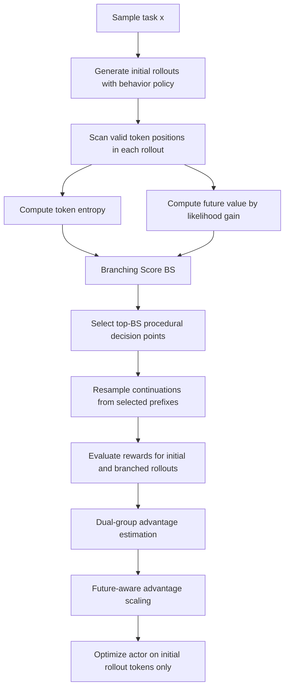

# APPO：把 Agentic RL 的信用分配从工具调用边界推进到“过程决策点”

## 元信息与 TL;DR

- **论文**：[APPO: Agentic Procedural Policy Optimization](https://arxiv.org/abs/2606.12384)
- **版本**：arXiv:2606.12384v1，2026-06-10 17:47:07 UTC 提交
- **作者与机构**：Xucong Wang、Ziyu Ma、Yong Wang 等；University of Science and Technology of China、AMAP, Alibaba Group、Southern University of Science and Technology
- **代码材料**：[AMAP-ML/APPO](https://github.com/AMAP-ML/APPO)
- **类别**：大模型后训练 / 大模型 Agent
- **一句话定位**：APPO 不是又一个“多采几条轨迹”的 Agent RL 技巧，而是在问：长程工具 Agent 失败时，真正该被分叉和记账的是整段工具调用、整段 `<think>`，还是生成序列里那些会改变后续轨迹的细粒度过程决策点？

### TL;DR

- **它要解决什么**：
  - 现有 Agentic RL 多用轨迹级稀疏奖励，或者在工具调用边界、固定 workflow、think-action step 上做分支。
  - 这会把很多关键中间选择揉成一个粗粒度单元，导致 credit assignment 不稳定：最后错了，却很难知道是哪个思考 token、搜索方向、计算选择或验证动作把轨迹带偏。

- **它怎么做**：
  - APPO 把“分支点”从工具调用边界扩展到整个生成序列中的 token 位置。
  - 它提出 **Branching Score, BS**：用局部 token entropy 表示不确定性，用 future value 表示当前 token 对后续 continuation 的政策诱导影响，再把二者相乘筛出“既不确定、又会改变后续结果”的过程点。
  - 分支 rollout 的奖励不直接进入 actor loss，而是作为辅助对比信号，用 dual-group advantage 和 future-aware advantage scaling 反向给原始 rollout 的过程 token 分配信用。

- **实验和证据是什么**：
  - 论文在 **13 个 benchmark** 上评测，覆盖 DeepReasoning、DeepSearch、知识密集推理和计算问题。
  - 摘要报告 APPO 相比强 Agentic RL baseline 约提升 **近 4 分**；正文贡献处称平均约 **3 分**。
  - 在 DeepSearch 任务上，Qwen3-8B / Qwen3-14B 的 GAIA 分数分别达到 **42.7 / 46.6**，并改善 HLE。
  - 在 Qwen2.5-7B 的 branching 配置表中，APPO 平均分最高到 **58.1**；消融显示只用 entropy、去掉 future-aware 项、去掉 dual-group 都会降到 **54.7-56.3** 区间。

- **关键局限**：
  - BS 作为最优分支准则没有理论最优性证明，论文自己也承认它主要靠实验验证。
  - 工具环境仍限制在 Search 与 Python，尚未覆盖浏览器、文件系统、代码编辑器、MCP 工具链、多账户权限等真实 Agent 工程场景。
  - 代码仓库给了 VERL + ARPO stack 的复现实用路径，但没有 release；README 明确仍沿用 ARPO 的 dataset、tool cache 和 evaluation pipeline。

## 研究问题：为什么 Agentic RL 需要更细的“过程”单位？

### 旧问题不是“奖励太少”，而是“奖励落不到关键步骤上”

在典型 RLVR / Agentic RL 设置里，Agent 处理一个任务时会交替产生：

- 思考文本；
- 工具调用；
- 工具返回；
- 下一轮思考；
- 最终答案。

最终 reward 往往只在整条轨迹结束后出现：

```text
任务 x -> 轨迹 y -> reward R(x, y)
```

这对长程 Agent 有两个麻烦：

- **轨迹很长**：
  - 搜索型任务可能包含多轮检索、阅读、回溯和总结。
  - 数学或知识密集任务可能包含多次假设、计算、验证。

- **错误来源很局部**：
  - 一个看似平常的搜索 query 可能把后续检索空间带偏。
  - 一个中间计算假设可能让后面所有步骤都沿错方向展开。
  - 一个“我应该验证一下”的 token 可能决定是否调用工具查证。

如果只在工具调用边界分支，模型看到的是“整段工具前思考 + 工具调用 + 返回”的混合效果；如果只按固定 workflow 分支，模型看到的是人为定义的阶段，而不一定是模型真正做出决策的地方。

### APPO 对“procedure”的定义更接近可学习的微决策

论文把 procedure 理解为围绕高影响 token 组织起来的过程性推理模式。这里的关键不是 token 本身有语义标签，而是：

- 这个位置之前的 prefix 固定；
- 从这个位置之后换一种 continuation；
- 最终 reward 的分布会明显变化。

因此，procedure 可以是：

- 决定用哪个搜索词；
- 决定先算哪个中间量；
- 决定是否调用 Python；
- 决定是否接受一个检索结果；
- 决定是否反思前一轮答案。

这种定义把 Agent 训练从“工具调用是动作”推进到“思考序列内部也有动作结构”。这也是 APPO 最值得读的地方：它把后训练里的 credit assignment 具体落到 Agent 的生成过程，而不是只换一个 PPO/GRPO 变体名。

## 论文主张与论证路线

| Claim | Mechanism | Evidence | Boundary |
|---|---|---|---|
| 工具调用边界不是唯一关键点 | 分析 Tool-Star 54K 数据中的 rollout token 分布 | Figure 1(a) 显示高不确定位置广泛分布在 thinking span，不集中在 tool-call boundary | 该分析依赖特定数据集和工具设定，不等于所有 Agent 环境都有相同分布 |
| token entropy 不能单独代表“重要决策” | 比较 entropy bin 与 branch accuracy / outcome uncertainty | Figure 1(b) 显示高 entropy 不稳定地对应高影响分支，可能只是词汇罕见性 | entropy 仍有用，只是需要和未来影响结合 |
| 更好的分支点应同时不确定且影响后续 | Branching Score = entropy 的 z-score 与 future value 的 z-score 相乘 | APPO 在 13 个 benchmark 上稳定优于 ARPO / GRPO 等 baseline | BS 没有最优性证明，是有效启发式 |
| branch rollout 应作为 credit 信号，而不是直接训练所有 branch token | dual-group advantage 分开估计初始 rollout 和 branch rollout；actor loss 只优化初始 rollout | 消融表显示去掉 dual-group 或 future-aware 项会掉分 | 分支奖励估计仍依赖 verifiable reward；开放式任务更难 |
| 过程级分支提升的是 exploration quality，不只是增加采样量 | top-BS token 选择、procedure-level advantage scaling | Figure 3/4/5/6 展示 pass@、训练动态、分支分布和词云变化 | 没有证明 APPO 在真实浏览器/文件编辑 Agent 中仍同等有效 |

### 这条论证为什么成立？

APPO 的核心说服链可以拆成四步：

1. **先证明旧分支单位太粗**：
   - 工具调用边界只覆盖一小部分高不确定决策。
   - 固定 workflow 会把模型内部的过程选择压扁。

2. **再证明 entropy 单独不够**：
   - 高 entropy 有时只是罕见词、语气词、格式选择。
   - 这些 token 可能不改变后续任务结果。

3. **然后提出 future-aware BS**：
   - 如果当前策略比 rollout 旧策略更偏好后续 continuation，说明这个位置可能承载后续价值变化。
   - 把这个信号和 entropy 结合，才能同时筛掉“确定但重要”和“不确定但无关”的两类噪声。

4. **最后把分支 reward 回写到原始过程 token**：
   - branch 用来估计不同 continuation 的结果差异。
   - 训练仍优化原始 rollout，避免把混合策略生成的 branch 直接塞进 actor loss 造成偏差。

## 方法机制：APPO 到底改了哪几个环节？

### 1. Agentic RL 的基础设定

论文考虑的 rollout 是工具交互序列：

```text
x
  -> think_1
  -> tool_call_1
  -> observation_1
  -> think_2
  -> tool_call_2
  -> observation_2
  -> ...
  -> answer
  -> reward
```

在这个设定里：

- `x` 是任务输入；
- `π` 是当前策略；
- `π_ref` 是 reference policy；
- `R` 是最终任务 reward；
- KL 项约束当前策略不要过度偏离 reference；
- advantage 需要把最后 reward 分配给中间 token 或序列片段。

传统做法常见三类：

- **group-level advantage**：
  - 对同一 prompt 采多条完整 rollout；
  - 按 reward 的组内相对差异更新；
  - 优点是简单，缺点是粒度太粗。

- **tool-call / step-level branching**：
  - 在工具调用前后分叉；
  - 更适合 tool-use 任务，但会忽略 `<think>` 内部决策。

- **entropy-token branching**：
  - 在高 entropy token 后分叉；
  - 能进入思考内部，但会被词汇不确定性污染。

APPO 的改动可以概括为：

```text
粗粒度动作边界
  -> 细粒度 token 候选
  -> Branching Score 选点
  -> branch rollout 估计过程信用
  -> 只对初始 rollout 做 actor 更新
```

### 2. Branching Score：把“局部不确定”与“后续影响”相乘

论文先定义 token entropy：

```text
Entropy_t = - Σ_v p_t(v) log p_t(v)
```

变量解释：

- `t`：rollout 中的 token 位置；
- `v`：词表中的候选 token；
- `p_t(v)`：模型在位置 `t` 对 token `v` 的概率；
- entropy 高表示模型在当前位置选择不确定。

但 entropy 的问题是：

- 它只看当前位置；
- 不看这个 token 后面的 continuation 是否变好；
- 不区分“任务关键歧路”和“自然语言表达歧义”。

所以 APPO 加入 future value：

```text
FutureValue_t = exp(Σ_{k >= t} γ^(k-t) · [log π_current(a_k|s_k) - log π_rollout(a_k|s_k)])
```

变量解释：

- `π_current`：当前 mini-batch 更新中的策略；
- `π_rollout`：生成初始 rollout 的行为策略；
- `a_k`：位置 `k` 的动作或 token；
- `s_k`：位置 `k` 的状态；
- `γ`：衰减因子，越远的后续 token 权重越低；
- 指数项表示当前策略相对旧策略对后续 continuation 的偏好变化。

然后定义：

```text
BS_t = Z(Entropy_t) * Z(FutureValue_t)
```

变量解释：

- `Z(.)`：在同一 rollout 内做 z-score normalization；
- 相乘意味着 token 需要同时具备两个条件：
  - 局部不确定；
  - 对后续 continuation 有策略诱导影响。

### 3. 为什么不用加法？

论文附录比较了 BS 的替代设计，包括：

- normalized entropy 与 future value 的加权加法；
- 只用 future value；
- 其他比例组合。

作者的观察是：

- 加法设计能捕捉 “calculate”“verify”“break”“solve” 这类推理关键词；
- 如果过度偏向 future value，会选到类似 “I'll” 这种重申结论或表达连贯性相关 token；
- 这类 token 对后续 likelihood 有影响，但不一定提供有效训练价值。

这说明 APPO 的乘法不是随便写的：

- entropy 负责排除低不确定位置；
- future value 负责排除无后续影响位置；
- 乘法让两个门槛同时生效。

### 4. Branch rollout 只做辅助信用估计

APPO 的分支过程：

1. 对每条初始 rollout 扫描有效 token；
2. 计算每个 token 的 entropy、future value、BS；
3. 选 top-k BS token；
4. 从这些 prefix 后重新采样 continuation；
5. 得到 branch rollout 和最终 reward；
6. 用 branch reward 与 initial rollout reward 建立对比；
7. actor loss 只在初始 rollout token 上优化。

这一步很重要，因为 branch 是 mini-batch 当前策略产生的，而初始 rollout 是 behavior policy 产生的。直接混合优化会引入 off-policy 和分布混杂问题。论文因此做了 dual-group advantage：

- 初始 rollout 一组；
- branch rollout 一组；
- 两组分别做 group-relative advantage；
- 再通过 future-aware term 对原始 token 的 advantage 做缩放。

## 算法流程：从 rollout 到过程级优势



伪代码版：

```text
Input:
  policy π, reference π_ref, toolset T, training set D
  rollout budget B, initial rollout count N
  selected branch points K, PPO epochs E
  procedural weight λ, decay γ

For each training step:
  sample task x from D
  set behavior policy π_old = π

  Initialization:
    generate N full rollouts with tool interaction
    store them as rollout trees

  For each PPO epoch:
    while remaining branch budget > 0:
      sample a rollout tree
      for each valid token position t:
        Entropy_t = local token uncertainty
        FutureValue_t = discounted likelihood gain of suffix
        BS_t = Z(Entropy_t) * Z(FutureValue_t)

      select top-K token positions by BS
      for each selected position:
        resample continuation from prefix
        add branch to tree

    evaluate rewards for all initial and branched rollouts
    compute initial-rollout advantage and branch-rollout advantage separately
    compute future-aware procedural scaling
    update π on initial rollout tokens with KL regularization

Output:
  policy with procedure-aware branching and credit assignment
```

### 这段算法的设计取舍

- **为什么先生成 initial rollouts**：
  - 保证每个任务先有完整轨迹根节点；
  - 后续 branch 才能围绕具体轨迹中的真实决策点展开。

- **为什么从 token 而不是 tool-call 选点**：
  - Figure 1 的 pilot study 表明关键不确定位置并不集中在工具调用边界；
  - 非工具思考 span 内也有会改变结果的 procedure。

- **为什么 branch 不直接进 actor loss**：
  - branch 用当前 mini-batch policy 生成，和 behavior rollout 分布不同；
  - 直接训练所有 branch 可能让优化信号混入策略漂移；
  - APPO 把 branch 当作 reward/advantage probe，训练仍落在初始 rollout 上。

## 实验设置：数据、模型、工具和训练资源

### 任务范围

论文说实验覆盖 13 个 benchmark，主要可以分成两组：

| 任务族 | 代表任务 | 主要考察能力 | 为什么适合 APPO |
|---|---|---|---|
| DeepReasoning | WebWalker、HotpotQA、2Wiki、MuSiQue、Bamboogle 等 | 多跳推理、搜索、计算和知识整合 | 错误常来自中间搜索词、跳转顺序、验证策略 |
| DeepSearch | GAIA、HLE 等 | 长程搜索、复杂工具使用、结果综合 | 分支质量比单纯多 rollout 更关键 |

### 模型与 baseline

论文和附录涉及的模型 / 方法包括：

- Qwen2.5-7B-Instruct；
- Llama3.1-8B-Instruct；
- Qwen3-8B；
- Qwen3-14B；
- GRPO 类 group-relative baseline；
- ARPO；
- entropy-only branching；
- 去掉 future-aware 项；
- 去掉 dual-group advantage。

### 训练与实现细节

论文附录给出的关键设置：

| 阶段 | 设置 | 作用 |
|---|---|---|
| 冷启动 SFT | ToolStar 54K SFT 数据 + STILL 0.8K 样本 | 给 backbone 基础工具使用能力 |
| SFT 框架 | LLaMA-Factory、DeepSpeed ZeRO-3、Flash-Attention2 | 标准化冷启动训练 |
| SFT 参数 | learning rate 7e-6、batch size 128、weight decay 0.1、3 epochs、BF16、max length 4096 | 让复现者理解 warm-start 条件 |
| RL 框架 | VERL | 承接 ARPO / tool-use rollout stack |
| loss mask | 工具执行结果从 loss 中 mask 掉 | 避免模型学习工具返回文本本身 |
| DeepReasoning | batch 128、PPO mini-batch 16、global rollout 16、initial sampling 4、max response 4096 | 7B reasoning 任务默认配置 |
| DeepSearch | max response 8192，8B / 14B，14B 使用 16 张 H100，1K 数据跑 5 epochs | 长程搜索任务配置 |

官方 GitHub README 还补充了工程入口：

- 复现流程是 **cold-start SFT -> APPO RL training -> evaluation**；
- APPO RL 基于 **VERL + tool-use stack**；
- 数据和 search cache 复用 ARPO，位于 `ARPO/`；
- 关键配置包含：
  - `algorithm.adv_estimator=appo`
  - `actor_rollout_ref.rollout.mode=sync_with_tool`
  - `actor_rollout_ref.rollout.n=16`
  - `actor_rollout_ref.rollout.initial_rollouts=8`
  - `actor_rollout_ref.rollout.appo_dynamic_branching=True`
  - `actor_rollout_ref.rollout.reward_scale_discount=0.9`
  - `actor_rollout_ref.actor.policy_loss.loss_mode=future_kl`

## 主结果：APPO 的提升来自哪里？

### 1. DeepReasoning：分支位置选择比“更多采样”更重要

Table 3 对 branching config 的分析可以整理成：

| Method | WebWalker | HotpotQA | 2Wiki | MuSiQue | Bamboogle | Average |
|---|---:|---:|---:|---:|---:|---:|
| ARPO | 26.0 | 58.8 | 76.1 | 31.1 | 71.5 | 52.7 |
| APPO config A | 25.4 | 60.4 | 77.0 | 30.6 | 70.2 | 52.7 |
| APPO config B | 26.7 | 63.8 | 77.6 | 31.0 | 70.6 | 53.9 |
| APPO config C | 28.0 | 65.0 | 79.4 | 30.8 | 73.3 | 55.3 |
| APPO best shown | 33.5 | 66.5 | 81.5 | 31.5 | 77.6 | 58.1 |
| APPO variant | 31.8 | 65.8 | 81.2 | 31.0 | 79.5 | 57.9 |
| APPO variant | 29.2 | 65.5 | 79.0 | 31.2 | 75.7 | 56.1 |

可见：

- ARPO 与最弱 APPO 配置平均都在 **52.7**；
- 选点和 branching 配置调好后，APPO 到 **58.1**；
- 这说明 APPO 不是“只要叫 APPO 就赢”，而是要靠合适的初始 rollout 多样性、branch 数量和分支位置组合。

### 2. DeepSearch：长程搜索任务更能体现过程分支

论文正文对 Table 2 的解释强调：

- APPO 在复杂 deep search 上同时体现 effectiveness 和 efficiency；
- 即使强闭源模型在这些任务上也不稳定；
- APPO 在 8B 与 14B 模型尺度上都建立了新的强结果；
- Qwen3-8B / Qwen3-14B 在 GAIA 上分别达到 **42.7 / 46.6**；
- HLE 也有改善。

这部分证据的意义在于：

- DeepSearch 任务的失败不只是知识不足；
- 很多失败来自搜索路径、何时查证、何时停止、如何整合证据；
- 这些正是 APPO 所说的 procedure decision point。

### 3. Pass@1 到 Pass@5：APPO 改善的是候选轨迹质量

Figure 3 比较 ARPO 和 APPO 在四个数据集上的 Pass@1 到 Pass@5。

这类图表不是简单说明“多采样更好”，而是在回答：

- 如果给模型多次机会，APPO 是否产生更多可成功轨迹？
- 如果只看 Pass@1，APPO 是否提升首条轨迹质量？
- 如果 Pass@5 提升更明显，说明 APPO 主要改善探索覆盖；
- 如果 Pass@1 也提升，说明训练后策略本身更会走高价值过程点。

论文没有在 HTML 摘要中展开所有数值，但从作者论证看，APPO 的强项是让分支集中在高影响位置，避免连续高 entropy 低价值 token 消耗预算。

## 消融：哪些组件真的有用？

### 消融表

Table 4 的组件消融可以整理成：

| Backbone | Method | WebWalker | HotpotQA | 2Wiki | MuSiQue | Bamboogle | Average | 解释 |
|---|---|---:|---:|---:|---:|---:|---:|---|
| Llama3.1-8B | APPO | 32.0 | 65.5 | 79.8 | 35.2 | 76.8 | 57.9 | 完整方法 |
| Llama3.1-8B | BSEnt. | 31.4 | 65.4 | 78.0 | 34.8 | 75.5 | 57.0 | 只强调 entropy 相关分支会下降 |
| Llama3.1-8B | w/o future-aware | 29.8 | 64.8 | 78.6 | 35.0 | 74.5 | 56.5 | 去掉未来影响项后平均降 1.4 |
| Llama3.1-8B | w/o Dual-group | 30.9 | 65.0 | 76.4 | 35.5 | 76.2 | 56.8 | 混合优势估计不如分组估计 |
| Qwen2.5-7B | APPO | 33.5 | 66.5 | 81.5 | 31.5 | 77.6 | 58.1 | 完整方法 |
| Qwen2.5-7B | BSEnt. | 29.4 | 64.8 | 80.5 | 31.0 | 75.7 | 56.3 | entropy-only 低 1.8 |
| Qwen2.5-7B | w/o future-aware | 30.3 | 60.0 | 79.9 | 30.6 | 72.6 | 54.7 | future-aware 项影响最大 |
| Qwen2.5-7B | w/o Dual-group | 33.0 | 63.8 | 75.8 | 30.6 | 76.6 | 56.0 | dual-group 对 2Wiki 尤其明显 |

### 消融说明了三件事

1. **entropy 是必要但不充分的信号**：
   - BSEnt. 在两个 backbone 上都低于完整 APPO。
   - 这支持作者前文的 Figure 1 观察：高 entropy 可能只是词汇不确定。

2. **future-aware 项不是装饰**：
   - Qwen2.5-7B 去掉 future-aware 后平均降到 **54.7**；
   - 这比 entropy-only 还差；
   - 说明 APPO 的核心不只是“token-level branching”，而是“未来 continuation 影响感知”。

3. **dual-group advantage 处理了 branch 与 initial rollout 的分布差异**：
   - 去掉 dual-group 后平均分下降；
   - 这说明 branch rollout 不能粗暴和 initial rollout 混在一起算优势。

## Figure / Table 逐项证据解读

### Figure 1：为什么旧分支准则不够

Figure 1 包含三层证据：

- **1(a) token entropy distribution**：
  - 高不确定位置并不只在工具调用边界；
  - thinking span 内部也有大量候选点。

- **1(b) branch accuracy by entropy / BS bins**：
  - entropy 高不代表分支 outcome 更有信息；
  - BS 更接近“这个位置是否值得分叉”。

- **1(c) resampling criteria pass@ comparison**：
  - oracle 表示理想选择高 accuracy uncertainty 的位置；
  - APPO 试图用可计算的 BS 逼近这个 oracle；
  - 结果优于 tool-call 或 entropy-only 类策略。

### Figure 2：APPO overview 的关键不是流程图，而是梯度边界

Figure 2 展示：

- 初始 rollout 先完整产生；
- mini-batch 中按 BS 找细粒度决策点；
- 从 prefix 后重新采样 continuation；
- branch 和 initial rollout 共同用于 dual-group advantage；
- 最终优化只作用在 initial rollout token。

这张图最值得注意的是“branch 不直接训练”的边界。如果把 branch 全部拿来做 actor loss，方法可能退化成带分支数据增强的 PPO，而不是过程级 credit assignment。

### Figure 4：训练动态说明 token-level branching 也可能不稳

Figure 4 比较 pure-token branching 与 APPO guided branching 的训练动态。它对应的结论是：

- token-level 不等于 procedure-level；
- 如果只是随便在 token 上分支，训练可能被高 entropy 噪声吸走；
- APPO 的 BS 起到选择性过滤作用。

### Figure 5 / Figure 6：分支分布和词云说明 APPO 改变了探索对象

Figure 5 观察 ARPO 与 APPO 的 branch distribution：

- ARPO 更容易围绕固定 tool-call / high-entropy 局部聚集；
- APPO 分支更分散到可改变 reasoning trajectory 的位置。

Figure 6 的词云显示：

- 高 entropy tokens 与 BS-selected tokens 的语义类型不同；
- BS 更倾向选择计算、验证、求解相关词；
- 这增强了“APPO 在找过程决策，而不是语言噪声”的解释性。

## 相关工作位置：APPO 和 GRPO / ARPO / Tree RL 的区别

### 与 GRPO 类方法的关系

GRPO 类方法的重点是：

- 同一 prompt 多采样；
- 按组内 reward 估计 advantage；
- 避免显式 value model；
- 适合 RLVR 的稀疏奖励。

APPO 接受这个基础，但认为：

- 组内优势仍然太粗；
- 整条 trajectory 成败不能告诉模型哪个中间 procedure 值得强化；
- 因此需要 branch rollout 作为局部 counterfactual probe。

### 与 ARPO 的关系

APPO 的官方 README 明确写到：

- APPO 延续 ARPO 的 Agentic RL stack；
- SFT、dataset、tool cache、evaluation 都复用 ARPO；
- 主要新增 procedure-aware branching。

这意味着 APPO 不是从零搭一个新 Agent 系统，而是在 ARPO 的工具栈上改信用分配：

| 维度 | ARPO | APPO |
|---|---|---|
| 分支位置 | 更靠近 tool-call round / high entropy | 整个序列中的 BS-selected procedure token |
| 信号来源 | 工具调用附近的不确定性 | entropy + future value |
| 训练目标 | Agentic RL baseline | procedure-aware advantage scaling |
| 工程复用 | ARPO stack | 复用 ARPO dataset、cache、evaluation |

### 与 Tree RL / MCTS-DPO 的关系

Tree RL 的共同想法是：

- 从某个中间节点分叉；
- 用不同 continuation 的 reward 差异判断哪条路径好；
- 把这个差异变成偏好或优势信号。

APPO 的新意在于：

- 分叉节点不是人工 step；
- 不是离线构造 preference pair；
- 而是在 on-policy mini-batch 中用 BS 动态选 procedure token；
- branch 是 credit probe，不是直接训练样本。

## 失败案例与边界：这篇论文还不能证明什么？

### 1. BS 没有最优性证明

论文在限制中明确承认：

- splitting point selection 主要由实验验证；
- BS 是否是最优 branching criterion 没有理论保证；
- 要真正量化某个点的 actual branching value，需要更系统的 framework 和对 LLM 内在性质的研究。

这意味着：

- BS 是很强的启发式；
- 但不能把它当作普适最优 credit assignment 公式；
- 在别的模型、别的工具环境、别的 reward 结构中，BS 的权重和形式可能要重调。

### 2. 工具集仍然偏窄

论文限制还指出当前工具主要是：

- Search；
- Python。

这覆盖了很多知识密集和计算任务，但距离真实 Agent 还有差距：

- 浏览器点击；
- 文件读写；
- 代码编辑；
- 终端命令；
- 多服务 API；
- 权限、密钥、账户状态；
- 长期 memory 和跨会话上下文。

如果把 APPO 放到真实 coding agent 或 office agent 中，procedure 决策点可能不只在 token 序列里，还会出现在：

- 工具参数结构；
- 文件 diff；
- 观察状态；
- 人类确认边界；
- sandbox 权限选择。

### 3. 安全和能力提升之间有张力

APPO 的 impact statement 说它会推动搜索、医疗、教育等 Agent 能力，并提到更强自动化行为需要治理。

从 AI 安全角度看，这里有一个直接问题：

- 如果 APPO 让 Agent 更善于找到高影响过程点；
- 那它也可能更善于优化有风险的工具调用路径；
- 尤其当 reward 只验证任务成功、不验证合规边界时，procedure-level credit assignment 可能强化“绕过约束的有效过程”。

因此 APPO 未来需要和安全约束结合：

- 对工具调用加入权限 reward / penalty；
- 对中间搜索和代码执行加入 policy guard；
- 对 branch rollout 做安全分类；
- 对高 BS token 加风险审计，而不仅是性能优化。

## 代码仓库能复现什么，不能复现什么？

### 仓库给出的实用路径

官方 README 给出三阶段：

1. **Cold-Start SFT Stage**：
   - 使用 LLaMA-Factory；
   - 准备 SFT dataset；
   - 运行 `APPO/scripts/sft_train.sh`。

2. **APPO RL Stage**：
   - 基于 VERL + tool-use stack；
   - 安装 `torch==2.6.0`、`flash-attn`、`verl_arpo_entropy`；
   - 配置 Bright Data API；
   - 运行 7B reasoning、8B deep search、14B deep search 脚本。

3. **Evaluation**：
   - 复用 ARPO `evaluation/` pipeline；
   - 先启动 vLLM inference service；
   - 再跑 `infer_local_sds.sh`；
   - 最后用 `evaluate_passk.sh` 计算指标。

### 仓库透露的工程事实

| 工程点 | 观察 | 影响 |
|---|---|---|
| 与 ARPO 关系 | README 说 cold-start、datasets、tool cache、evaluation 都跟 ARPO | APPO 是在既有 stack 上加 procedure-aware RL |
| tool-use rollout | `actor_rollout_ref.rollout.mode=sync_with_tool` | 训练时工具交互是同步进入 rollout 的 |
| rollout 数量 | `rollout.n=16`，`initial_rollouts=8` | 分支预算和初始多样性是核心超参 |
| dynamic branching | `appo_dynamic_branching=True` | APPO 的分支逻辑是可开关组件 |
| reward discount | `reward_scale_discount=0.9` | future-aware 缩放用衰减控制远期影响 |
| actor loss | `loss_mode=future_kl` | 训练目标和 future-aware 项绑定 |

### 不能从仓库直接推出的结论

- 仓库没有 release；
- README 显示 stars/forks 仍为 0，说明项目刚公开；
- citation 还写着 coming soon；
- 复现依赖 Bright Data、vLLM、H100、ARPO 数据和 cache；
- 这不是“开箱即用”的轻量框架，更像研究复现实验栈。

## 研究者视角：APPO 对后训练和 Agent 研究有什么启发？

### 启发 1：Agent 后训练需要“可分支的内部状态”

传统 RLVR 最大的问题是稀疏 reward。APPO 的回答不是简单密集化 reward，而是：

- 找到可做 counterfactual branching 的中间位置；
- 用 branch outcome 估计局部决策影响；
- 再把这种影响投回原始策略更新。

这对后续研究很重要，因为它暗示：

- 长程 Agent 的训练数据不应只存 final answer；
- 应存 prefix、branch point、continuation、tool observation、reward；
- evaluation 也应记录哪些中间决策改变了最终结果。

### 启发 2：token 是载体，procedure 才是训练对象

APPO 不是说“每个 token 都是动作”。更准确地说：

- token 是可观测载体；
- procedure 是潜在过程决策；
- BS 是从 token 序列中识别 procedure 的启发式。

未来可能出现更强的 procedure 表示：

- 基于 hidden state clustering；
- 基于工具参数 AST；
- 基于 planner state；
- 基于 natural language rationale segment；
- 基于 environment transition graph。

### 启发 3：Agent 安全也可以用 procedure-level audit

如果 APPO 能找出“高影响过程点”，安全研究也可以借这个概念：

- 哪些 token / plan step 会导致高风险工具调用？
- 哪些 prefix 后的 continuation 更容易触发 prompt injection？
- 哪些 procedure 对越权、泄露、破坏性操作有高 future value？
- 能否训练一个 risk-aware Branching Score？

一个自然扩展是：

```text
SafeBS_t = Z(Entropy_t) * Z(TaskFutureValue_t) * (1 - Z(RiskFutureValue_t))
```

其中：

- `TaskFutureValue_t` 衡量任务成功相关的未来价值；
- `RiskFutureValue_t` 衡量安全违规相关的未来风险；
- SafeBS 只鼓励高价值、低风险的过程分支。

这不是论文已做的实验，而是从 APPO 机制出发的直接研究问题。

## 结论：APPO 的价值和最该追问的地方

### 最值得带走的判断

- APPO 的真正贡献不是“又提高了几个 benchmark 点”，而是把 Agentic RL 的分支与 credit assignment 单位重新定义为 **procedure-level decision point**。
- 这个定义把工具 Agent 的训练问题从外部动作扩展到内部思考过程，让 `<think>` 内部的关键选择也能被 reward 差异约束。
- Branching Score 的设计很朴素，但抓住了一个核心：有用分支点必须同时具备局部不确定性和后续影响力。

### 证据边界

- 论文有完整实验、消融、训练配置和代码仓库，足够支持“在 Search/Python 工具 Agent 的推理与搜索任务上有效”。
- 它还不足以支持“所有 Agent 工具生态都适用”，尤其是真实浏览器、代码编辑、长期 memory、权限控制、多用户状态下的 Agent。
- BS 的最优性还需要更多理论与跨环境实验支持。

### 后续追问

- **对后训练**：
  - procedure-level advantage 能否和 DAPO、Dr. GRPO、GSPO 等优势估计方法组合？
  - future value 是否能从 likelihood gain 换成 learned value 或 verifier signal？

- **对 Agent**：
  - 真实 coding agent 中的 branch point 应该是 token、tool call、diff hunk，还是 test failure state？
  - APPO 能否训练“何时停止搜索”“何时问用户确认”“何时拒绝危险操作”？

- **对 AI 安全**：
  - 高 BS token 是否也标记高风险行为转折点？
  - 能否把 branch rollout 同时送入 safety evaluator，做 performance-credit 与 risk-credit 的双通道训练？

APPO 给出的答案还不是终点，但它把一个关键问题讲清楚了：长程 Agent 的能力提升不只取决于最后 reward，也取决于我们能否找到那些真正改变轨迹命运的中间过程点。
