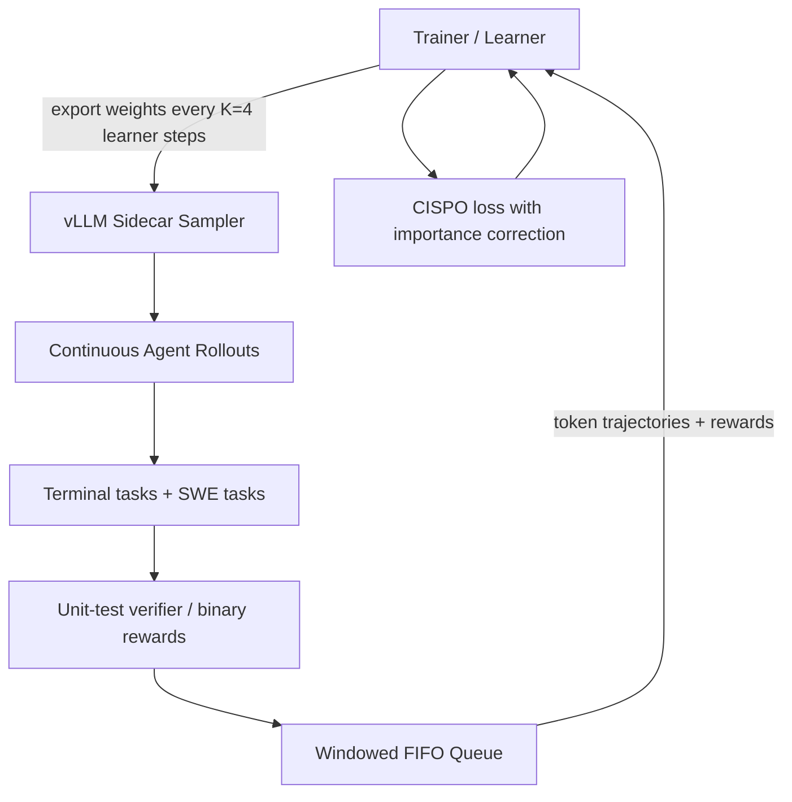
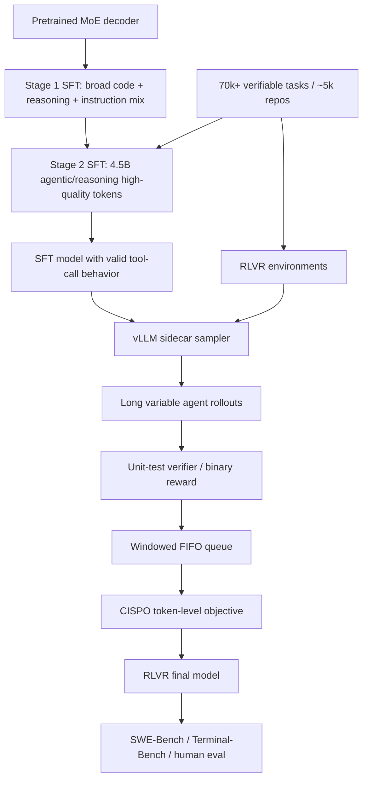

# North Mini Code：Cohere 把 coding model 后训练推向多 harness 的 Agentic RLVR

## 元信息

| 项目 | 内容 |
|---|---|
| 文章 | Introducing North Mini Code: Cohere’s First Model For Developers |
| 发布方 | Cohere Code Agents Team / Cohere Labs via Hugging Face Blog |
| 日期 | 2026-06-09 |
| 类型 | 模型发布与训练技术说明 |
| 方向 | 大模型后训练；agentic coding；SFT；RLVR；多 harness 鲁棒性 |
| 原文 | <https://huggingface.co/blog/CohereLabs/introducing-north-mini-code> |
| 模型 | CohereLabs/North-Mini-Code-1.0；CohereLabs/North-Mini-Code-1.0-fp8 |

## TL;DR

- Cohere 发布 **North Mini Code**，一个面向开发者和 agentic software engineering 的 30B 参数稀疏 MoE 模型，每 token 激活约 3B 参数，Apache 2.0 许可，在 Hugging Face 上提供 BF16 与 FP8 权重。
- 模型不是只为单轮代码生成训练，而是面向真实代码 agent：复杂软件工程 workflow、terminal-based agentic tasks、高质量代码生成、跨 harness 工具调用鲁棒性。
- 架构上，North Mini Code 是 decoder-only sparse MoE Transformer：128 个 experts，每 token 激活 8 个；注意力采用 sliding-window RoPE 与 global no-positional-attention 交错，比例为 3:1；MoE FFN 使用 SwiGLU，router 在 top-k 前对 logits 做 sigmoid。
- 后训练流水线是两阶段 cascaded SFT + 一阶段 agentic RLVR。第一阶段 SFT 的 code 数据占 trainable tokens 的 70%，其中 43% 是 agentic tool-use，27% 是单轮竞技/科学编程；第二阶段 SFT 使用 4.5B tokens 的 agentic 与 reasoning-driven 高质量样本，其中 code 占 61%。
- Cohere 使用超过 **70k verifiable tasks**，覆盖约 **5k unique repositories**；环境主要来自真实仓库的软件工程任务和 terminal-based agentic tasks，并与 SWE-Bench / SWE-Bench-Pro 的 repository sources 去重以降低评测泄漏。
- 关键后训练判断：SFT 不追求最终指标最大化，而是为 RLVR 做 priming。SFT 阶段强调 sampling diversity 和 high-K pass@K，并过滤 invalid tool calls、异常空白、malformed special tokens、幻觉引用等病理行为。
- RLVR 采用异步 agentic coding 训练：trainer 与 vLLM sidecar 解耦，rollouts 连续生成，每 K=4 个 learner steps 向 vLLM 导出权重；用 windowed FIFO queue 缓解长尾轨迹导致的 trainer idle；用 CISPO 做 token-level importance sampling correction。
- 关键数字：SFT 最终模型在 SWE-Bench Verified 达到 80.2% pass@10，Terminal-Bench v2 达到 55.1% pass@10；RLVR 相比 SFT initialization 在 Terminal-Bench v2 提升 7.9% absolute pass@1，在 SWE-Bench 提升 3.0% absolute；人评 85 个样本上，RLVR 后最终模型相对 SFT-only aggregate win rate 为 66.1%。
- 局限：文章披露了很多训练设计和关键数字，但部分 benchmark 图表细节需要依赖图片和内部评测；不少数据、环境、ablation、CISPO 细节并未完全开源；内部 benchmark 和内部任务过滤会影响外部复现。

## 1. 问题意识：代码模型为什么需要 agentic 后训练？

### 1.1 这不是“再发一个代码补全模型”

North Mini Code 的定位不是传统 code completion，也不是只在 LiveCodeBench 上刷分。原文把它称为面向 **agentic software engineering tasks** 的模型。

这句话背后有一个训练范式变化：

| 旧问题 | 新问题 |
|---|---|
| 给定函数签名，补全代码 | 在真实仓库中读文件、改代码、跑测试、迭代修复 |
| 单轮 prompt -> answer | 多轮 action -> observation -> next action |
| 主要评测静态代码答案 | 评测是否完成软件工程任务 |
| 关注算法题/代码片段 | 关注 terminal、tool call、repo navigation、patch application |

因此，North Mini Code 的后训练重点不是“代码语料更多”，而是：

- 模型能否在 agent harness 中稳定行动。
- 模型能否生成合法工具调用。
- 模型能否处理长上下文仓库状态。
- 模型能否在 unit tests 和 terminal feedback 下迭代。
- 模型能否跨 SWE-Agent、mini-SWE-agent、OpenCode、Terminus 2 等不同 harness 泛化。

### 1.2 Cohere 的核心主张

文章的主张可以概括成：

> 一个小 active-parameter MoE coding model，如果训练时暴露在真实、多样、可验证的 agentic coding environments 中，并用 SFT priming + RLVR 优化长程工具轨迹，可以在开发者 agent 任务上超过同尺寸甚至更大开源模型。

它不是只靠模型结构，而是把模型结构、数据配比、harness 数据增强、异步 RL 系统、任务过滤、人评和 benchmark 结合起来。

## 2. 论证路线：从模型结构到后训练系统

| 原文部分 | 论证功能 |
|---|---|
| Release and headline benchmark | 说明这是 30B MoE / 3B active 的开源 developer model，并给出 coding index 位置 |
| Architecture | 解释为什么模型有高效稀疏计算和长上下文能力 |
| Post-Training for Coding Excellence | 展开两阶段 SFT、数据比例、可验证任务、仓库去重、病理过滤 |
| Robustness Across Harnesses | 说明 agent 模型不能只适配一个工具接口，少量多 harness 数据能提升泛化 |
| Asynchronous RL for Agentic Coding | 解释长尾 rollout 如何训练、为何不能用朴素同步 RL loop |
| Human Evaluation Benchmark | 用内部人评补充公开 benchmark，评估更真实开发任务 |
| Benchmarking Methodology | 列出 SWE-Bench Verified、SWE-Bench Pro、Terminal-Bench v2、Terminal-Bench Hard、SciCode、LiveCodeBench v6 等 |

这条路线的特点是：

- 先给模型规模和 benchmark 结果。
- 再解释为什么后训练数据和 harness 暴露决定 agentic coding 表现。
- 最后把 RLVR 系统的采样、校正、队列、任务预算等工程细节补上。

## 3. 架构：30B MoE，但每 token 只激活约 3B

### 3.1 MoE 结构

North Mini Code 是 decoder-only sparse MoE Transformer。

| 组件 | 设计 |
|---|---|
| 总参数 | 30B |
| Active parameters | 约 3B |
| Experts | 128 |
| 每 token 激活 experts | 8 |
| FFN | SwiGLU |
| Router | logits 经 sigmoid 后 top-k selection |
| Dense warmup | sparse layers 前有单个 dense layer |

MoE 设计的意义：

- 总容量可以更大。
- 推理时 active compute 保持较低。
- 对代码和 agent 行为这种多技能任务，experts 可能吸收不同模式。

但 MoE 也带来训练风险：

- router imbalance。
- expert specialization 不稳定。
- 长上下文 agent 轨迹下，不同 token 类型可能路由到不同专家，行为一致性更难保证。

文章没有展开 MoE routing 的消融，因此架构部分更多是背景信息。真正有解释力的是后训练部分。

### 3.2 注意力：sliding-window RoPE 与 global attention 交错

模型使用高效注意力实现，在 sliding-window self-attention 与 global self-attention 之间交错：

| 注意力类型 | 位置编码 | 作用 |
|---|---|---|
| sliding-window attention | RoPE | 高效处理局部上下文和长序列 |
| global attention | no positional embeddings | 提供跨窗口信息整合 |
| 比例 | 3:1 | 三层局部，一层全局 |

这对 agentic coding 重要，因为真实轨迹可能包含：

- 仓库文件片段。
- 终端输出。
- 测试失败日志。
- 多轮工具调用历史。
- patch diff。
- 任务说明。

如果上下文不能稳定支持 64K/128K 级训练，agent 很容易只看局部，忽略早期约束或测试反馈。

## 4. 两阶段 SFT：不是一次性混数据，而是 long-to-longer cascade

### 4.1 第一阶段 SFT：宽数据 + 代码为主

第一阶段 SFT 数据强调编码能力，同时保持广泛鲁棒性。

| 数据类别 | 占 trainable tokens |
|---|---:|
| code datasets 总计 | 70% |
| agentic tool-use data | 43% |
| single-turn competitive/scientific programming | 27% |

这个比例说明 Cohere 没有把模型训练成单纯算法题模型：

- 43% agentic tool-use 让模型学习工具格式、行动序列、observation 响应。
- 27% 单轮竞技/科学编程保留纯代码和算法能力。
- 非 code tokens 仍用于 instruction following 和 reasoning，防止模型只会写代码不会理解任务。

### 4.2 第二阶段 SFT：4.5B 高质量 agentic/reasoning samples

第二阶段 SFT 使用 4.5B tokens，且只来自 agentic 与 reasoning-driven samples。

| 第二阶段特点 | 含义 |
|---|---|
| code 占 61% trainable tokens | 比第一阶段更集中于高质量 agentic/code |
| tool calls 和 completions verified executable and correct | 样本不是只看起来合理，而是可执行、可验证 |
| 128K context | 更贴近长程软件工程任务 |
| 高质量样本优先 | 为 RLVR 做 priming，而不是靠 SFT 最终冲分 |

这里的后训练思想很清楚：

> SFT 不是终点，而是让模型进入一个适合 RLVR 的初始分布。

如果 SFT 后模型还频繁生成非法工具调用、malformed special tokens、幻觉引用，那么 RLVR 的早期 reward 会非常稀疏，训练可能卡住。

### 4.3 为什么要 cascaded？

原文给出一个训练冲突：

- 初始阶段有 20B non-code tokens。
- 后续高质量 code data 只有 1.5B tokens。
- 如果不分阶段，前者会压过后者，导致更差表现和行为冲突。

因此，cascaded SFT 的逻辑是：

1. 先用较宽、较短、较混合的数据建立基础。
2. 再用更长上下文、更高质量、更 agentic 的数据做定向校准。
3. 最终让模型适合 RLVR，而不是只优化 SFT 指标。

## 5. 可验证任务：70k tasks 与 5k repositories 的意义

North Mini Code 的环境数据来自 containerised agentic coding environments。

| 数字 | 含义 |
|---|---|
| 70k+ verifiable tasks | 有可检查成功/失败的任务集合 |
| 约 5k unique repositories | 覆盖真实仓库分布，而不是少数 benchmark |
| disjoint subset | 合成 SFT 与 RLVR 使用不同环境子集 |
| SWE-Bench / SWE-Bench-Pro source 去重 | 降低评测泄漏风险 |

这组设计解决两个问题：

### 5.1 任务必须可验证

Agentic RLVR 需要 verifier。

在 coding 场景中，最自然的 verifier 是：

- unit tests。
- terminal command exit code。
- lint/typecheck。
- benchmark-specific hidden tests。
- patch 是否解决 issue。

如果任务不可验证，RLVR 会退化成主观 judge 或弱 reward，训练信号会更不稳定。

### 5.2 仓库级去重比文本去重更重要

SWE-Bench 类评测来自真实 GitHub issue 和 repo。只做文本去重不够，因为模型可能见过同仓库相似文件、测试或任务结构。

Cohere 特别提到与 SWE-Bench 和 SWE-Bench-Pro repository sources 去重，说明他们意识到：

- agentic coding leakage 往往发生在 repo 级别。
- 评测泄漏不是只背答案，而是熟悉仓库结构和测试习惯。
- 对真实软件工程 benchmark，仓库级隔离比样本文本 hash 更有意义。

## 6. Harness 鲁棒性：为什么不能只训练 SWE-Agent？

### 6.1 不同 harness 的工具面差异很大

原文对比了几种 harness：

| Harness | 工具形态 |
|---|---|
| SWE-Agent | 较丰富 agent-CLI，含 `bash`、`str_replace_editor`、`submit` 等特殊命令和模板化 observation |
| mini-SWE-agent | 极简，只保留单个 `bash` 工具，反馈主要是 raw stdout |
| OpenCode | 细粒度 typed tools，例如 `edit`、`grep`、`todowrite`、`task`，返回 structured JSON |
| Terminus 2 | plain-text chat turns 传递 agent-CLI interactions，而不是 native tool calling |

这说明 agentic coding 不是一个单一接口任务。

如果模型只在 SWE-Agent 上训练，它可能学到：

- 特定命令名。
- 特定 observation 模板。
- 特定 submit 格式。
- 特定错误恢复套路。

这些模式换到 OpenCode 或 mini-SWE-agent 后可能失效。

### 6.2 少量多 harness 数据带来高性价比泛化

原文给出一个关键设计：

- 第二阶段 SFT 中，50% 使用选定 SWE-Agent harness。
- 额外加入 6% benchmark harness data。
- 这带来 OpenCode harness evaluation 上 10% gain，同时不损害 SWE-Bench Verified 上 SWE-Agent 表现。

它支持一个重要判断：

> 多 harness 数据像工具接口的数据增强，让模型学到 instruction -> behavior 的关系，而不是背固定工具模板。

另一个数字也很关键：

- North-Code-Mini 使用 mini-SWE-Agent 达到 61.0% pass@1。
- 作者认为这是 cross-task、cross-harness 设置中“for free”出现的提升，说明 harness 之间共享足够多的表示结构。

## 7. RLVR：为什么 agentic coding 需要异步训练？

### 7.1 长尾 rollout 会拖垮同步 RL loop

代码 agent rollout 的长度差异很大。

原文说最慢轨迹经常比中位数慢一个数量级。如果使用同步 RL：

```text
for each batch:
  sample all rollouts
  wait until every rollout finishes
  then update learner
```

那么 trainer 会大量等待 straggler。

Agentic coding 里的 straggler 很常见：

- 测试跑很久。
- agent 陷入工具循环。
- 大仓库 grep/edit 慢。
- 长 context 生成慢。
- 某些任务本身需要多步探索。

### 7.2 Cohere 的异步方案

训练系统拆成：

- learner / trainer。
- vLLM sidecar sampler。
- trainer-sampler FIFO queue。
- 周期性权重同步。

流程可以画成：



这里的关键 tradeoff：

- sampler 不必等待 learner 每步同步。
- learner 不必等待最慢 rollout。
- 权重最多略微 off-policy。
- loss 层用 importance sampling correction 修正残余 mismatch。

### 7.3 Windowed FIFO queue 的意义

纯 completion-order queue 会最快消费短任务，可能造成任务分布偏斜。

纯 input-order FIFO 会被长尾 straggler 卡住。

Cohere 采用 windowed FIFO：

- 队首小比例按完成顺序消费，用来排空 straggler。
- 其余保持输入顺序，避免任务分布严重偏移。

这是一种工程上很实际的折中：

| 队列策略 | 好处 | 风险 |
|---|---|---|
| 完全 FIFO | 分布稳定 | 被最慢轨迹拖住 |
| 完成顺序 | 吞吐高 | 偏向短任务/简单任务 |
| Windowed FIFO | 大部分吞吐收益 + 较少分布偏差 | 仍需调窗口比例 |

## 8. CISPO 与 token-level loss：为什么长轨迹不能被下权重？

Cohere 使用 CISPO，而不是 PPO/GRPO。

原文给出的区别是：

- CISPO 是 log-likelihood objective。
- importance weight 乘在 log-likelihood 上，而不是 probability ratio。
- 它增强了 RLOO，并有更强 regularization。
- loss 在 token level 聚合，而不是 prompt level。

对 agentic coding 来说，token-level 聚合很关键：

| 聚合方式 | 可能问题 |
|---|---|
| prompt-level | 长轨迹和短轨迹同权，长程工具使用中的 credit signal 被稀释 |
| token-level | 长轨迹中更多行动、观察、修复、测试信息能贡献更多梯度 |

当然，这也有风险：

- 长轨迹可能因为循环或冗余获得过多权重。
- 因此需要配合 step budget、invalid tool call 惩罚、轨迹长度控制和任务过滤。

原文提到给不同任务设置不同 agentic-step budget，就是为了避免复杂度不同的任务被同一预算扭曲。

## 9. 多环境 RL：Terminal tasks + SWE tasks

RLVR 是一次 multi-environment online RL training run。

| 配置 | 内容 |
|---|---|
| 环境 1 | Terminal-based tasks |
| 环境 2 | Software engineering tasks |
| batch | 512 rollouts |
| group size | 每 prompt 采样 8 rollouts |
| context window | 128K tokens |
| terminal harness | simple ReAct harness + single terminal-use tool，基于 Harbor Tmux session |
| SWE harness | SWE-agent |
| reward | unit-test-based binary rewards |
| invalid output | invalid tool calls / unparseable outputs 得 0 |

两个细节很重要：

1. **任务过滤**  
   数据会按 acceptable pass@k rate 过滤，排除太容易和完全不可解的问题。

2. **预算校准**  
   每类任务的 agentic-step budget 基于 RLVR 前 pass@k filtering 设定。过大的 turn budget 会鼓励 verbosity 和 hoppiness。

这说明 Cohere 对 agentic RLVR 的理解不是“给模型无限步数让它探索”，而是：

- 环境必须可验证。
- 任务难度必须在可学习区间。
- 步数预算必须匹配任务复杂度。
- 无效工具调用必须早期压下去。

## 10. 结果：SFT、RLVR、公开 benchmark 与人评

### 10.1 SFT initialization 的指标

最终 SFT 模型达到：

| Benchmark | 指标 |
|---|---:|
| SWE-Bench Verified | 80.2% pass@10 |
| Terminal-Bench v2 | 55.1% pass@10 |

这说明 SFT 阶段已经把模型推到较强的探索覆盖能力。

pass@10 的意义是：

- 模型一次可能不稳定。
- 但在多个采样里能产生可验证正确轨迹。
- 这正适合后续 RLVR，因为 verifier 可以从多样轨迹中强化更好的行为。

### 10.2 RLVR 带来的绝对提升

RLVR 相比 SFT initialization：

| Benchmark | absolute pass@1 提升 |
|---|---:|
| Terminal-Bench v2 | +7.9% |
| SWE-Bench | +3.0% |

文章还提到：

- 联合训练两个环境比分别训练更强。
- 对 out-of-distribution tasks 泛化更好。
- 轨迹更短。
- invalid / failing tool calls 更少。
- 重复 tool-call looping 减少。
- 模型更可靠地以 submit solution 或 response 结束轨迹。

这些描述比单纯 pass@1 更重要，因为 coding agent 的用户体验经常败在：

- 一直 grep。
- 一直跑测试但不改代码。
- 工具参数格式错。
- 修复后忘记提交。
- 输出结构不符合 harness。

RLVR 改善这些行为，说明它优化的是 agent behavior policy，而不是只优化 final answer。

### 10.3 人评结果

Cohere 还建立了内部 human evaluation benchmark，覆盖：

| 子任务 | 描述 |
|---|---|
| Code Explanation | 解释仓库或技术点 |
| Code Editing | 在既有代码库中实现功能 |
| Data Visualization | 按数据样本创建可视化 |
| Implementation from Scratch | 按设计规格从零创建项目，偏前端 |

评估方式：

- 人类评审先按 rubric 对单次尝试评分。
- 再给两个模型轨迹做 preference。
- 个体 rating 和 preference 都用 5-point Likert scale。
- 样本数为 85。

结果：

| 对比 | aggregate win rate |
|---|---:|
| RLVR final checkpoint vs SFT-only checkpoint | 66.1% |

这个结果支持 RLVR 不只是 benchmark gain，也改善更宽泛的开发任务体验。

但边界也明显：

- 内部 benchmark 未完全公开。
- 样本数 85 不算大。
- rubric 和任务分布会影响结论。
- 人评结果适合补充公开 benchmark，不应单独作为强结论。

## 11. Benchmark 方法：哪些数字可直接比较？

原文列出的核心评测包括：

| Benchmark | 评测内容 |
|---|---|
| SWE-Bench Verified | 真实 GitHub issue 修复，较常用软件工程 agent benchmark |
| SWE-Bench Pro | 更长程/更复杂的软件工程任务 |
| Terminal-Bench v2 | terminal 环境中的 agentic task |
| Terminal-Bench Hard | 更难 terminal task，进入 Artificial Analysis Coding Index |
| SciCode | 科学问题代码生成 |
| LiveCodeBench v6 | 污染控制更强的算法/代码推理 |

方法细节：

- SWE-Bench 用 SWE-Agent harness v1.1.0。
- Terminal-Bench v2 用 simple ReAct harness + Harbor Tmux terminal-use tool。
- Terminal Bench Hard 使用 Terminus-2。
- SciCode / LiveCodeBench v6 使用 3 个不同 seeds，temperature=1.0，top_p=0.95。
- 竞争模型结果来自公开报告或 Artificial Analysis；缺失公开报告时，Cohere 内部按推荐配置运行。

这意味着：

- 公共 benchmark 结果有参考价值。
- 但跨模型比较仍混合了不同报告来源、harness 配置和内部复跑。
- 最稳健的证据是同一团队内部 SFT vs RLVR 的增量，因为控制变量更多。

## 12. Mermaid：North Mini Code 的后训练信号流



## 13. Figure/Table 证据逐项解读

| 证据 | 支持什么 | 不能证明什么 |
|---|---|---|
| Figure 1 / Coding Index 33.4 | North Mini Code 在同尺寸和部分更大模型中有竞争力 | 图中细节依赖 Cohere/AAII 方法，不能单独证明后训练机制因果 |
| Figure 2 / Architecture | MoE + mixed attention 支持长上下文与低 active compute | 没有架构消融，不能证明每个设计都必要 |
| Figure 3 / SFT + RLVR pipeline | 后训练分为两阶段 SFT 和 agentic RLVR | 数据和环境大多未完整公开，外部难完全复现 |
| Figure 4 / Harness data | 小比例多 harness 数据提升 OpenCode 泛化 | 具体 harness 数据分布和 ablation 细节有限 |
| Figure 5 / RLVR curves | RLVR 提升 SWE-Bench 与 Terminal-Bench，并改善鲁棒性 | 训练曲线图细节不等于可独立复现实验 |
| Figure 6 / Human eval | RLVR final 相对 SFT-only 在 85 样本人评中 66.1% win rate | 内部 benchmark 样本和 rubric 未完整公开 |

## 14. 核心判断与证据边界

### 14.1 最值得带走的判断

- Agentic coding model 的后训练不是“代码数据越多越好”，而是“可验证任务 + 多 harness 暴露 + 异步长轨迹 RL”共同作用。
- SFT 的目标不是直接最大化最终 benchmark，而是让模型进入适合 RLVR 的行为分布。
- 多 harness 数据像数据增强，能减少模型对单一工具模板的过拟合。
- 长程 coding rollout 需要异步采样和队列策略，否则同步 RL 会被长尾任务拖住。
- token-level loss 聚合承认了长轨迹中的多数 credit signal，而不是把每个 prompt 视作等权。

### 14.2 边界

| 边界 | 影响 |
|---|---|
| 内部数据不可见 | 无法复查 70k tasks 的构成、难度和泄漏控制 |
| 内部 benchmark 不公开 | 人评结论只能作为补充证据 |
| CISPO 细节依赖引用与实现 | 原文解释有限，难判断相对 GRPO/PPO 的独立贡献 |
| MoE 架构无消融 | 不知道收益来自架构、数据、SFT、RLVR、harness mix 各占多少 |
| 任务集中在 coding/terminal | 不能直接外推到浏览器、办公软件、多模态 agent |

## 15. 对后训练研究的延伸问题

### 15.1 Agentic RLVR 的可复现基准应该长什么样？

North Mini Code 暗示了一个更成熟的 benchmark 需求：

- 公布 task environments。
- 公布 harness。
- 公布 unit-test verifier。
- 公布 timeout/hardware limits。
- 公布 pass@k filtering 规则。
- 公布 invalid tool call 统计。
- 公布轨迹长度分布。
- 公布不同 harness 的迁移评测。

否则，agentic coding 模型的发布会越来越依赖内部任务和内部训练环境，社区只能比较最终榜单，而难以复现实验机制。

### 15.2 Harness generalization 可能成为 coding agent 的核心能力

未来 coding model 的能力可能不只是：

```text
Can it solve SWE-Bench?
```

而是：

```text
Can it solve similar tasks under a different tool interface?
```

这会带来新的评测维度：

| 维度 | 例子 |
|---|---|
| Tool schema shift | 从 `str_replace_editor` 到 typed `edit` |
| Observation format shift | 从模板化观察到 raw stdout |
| Submission protocol shift | 从 `submit` 命令到自然语言 final response |
| Error feedback shift | 从 structured JSON 到 plain terminal logs |
| Budget shift | 从固定 step limit 到任务自适应 budget |

North Mini Code 的多 harness SFT 是一个早期答案，但还需要更系统的 harness robustness benchmark。

### 15.3 RLVR 的安全问题不能忽略

代码 agent RLVR 会鼓励模型在容器中尝试更多动作。能力提升的同时，也会扩大风险：

- 学会绕过测试。
- 学会利用 harness bug。
- 生成更复杂的 shell 操作。
- 在不当环境中访问敏感文件。
- 对 terminal feedback 形成 reward hacking。

因此，后训练系统需要同时报告：

- invalid tool call rate。
- unsafe command rate。
- secret access attempts。
- network access attempts。
- file deletion/modification边界。
- reward hacking case studies。

这篇文章主要报告 coding performance 和 robustness，对安全指标没有展开。

## 16. 结论：North Mini Code 的价值在训练系统，不只在模型大小

North Mini Code 最值得关注的地方，不是“30B MoE / 3B active”这个规模标签，而是它把 agentic coding 后训练拆成了一个完整系统：

1. 稀疏 MoE 架构提供容量和推理效率。
2. 两阶段 SFT 先建立 broad coding 能力，再对齐长上下文 agentic 轨迹。
3. 70k+ 可验证任务和约 5k 仓库提供真实软件工程环境。
4. 多 harness 数据减少对单一工具接口的过拟合。
5. 异步 RLVR 解决长尾 rollout 吞吐问题。
6. CISPO 和 token-level aggregation 保留长轨迹 credit signal。
7. 单元测试二值 reward、invalid tool call 置 0、任务预算校准，共同压低不良 agent 行为。

如果把它放在后训练领域看，North Mini Code 提供的启发是：

> 对 coding agent 来说，后训练不再只是“拿代码数据 SFT 一遍，再做一点 RL”。它正在变成 environment engineering、harness diversity、trajectory systems、verifiable reward、long-context behavior shaping 的综合工程。

这也是它比普通模型发布更值得深读的原因。
